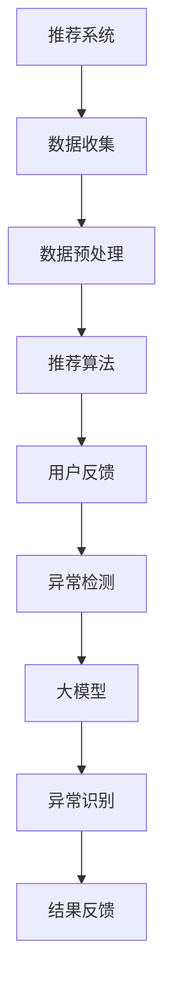

                 

关键词：大模型，推荐系统，异常检测，算法原理，数学模型，项目实践，应用场景，未来展望

## 摘要

本文旨在探讨大模型在推荐系统中的异常检测应用。通过对推荐系统中常见异常类型的分析，我们引入了基于大模型的异常检测算法，并详细阐述了其原理、数学模型和具体实现步骤。随后，通过一个实际项目实践，展示了大模型在异常检测中的有效性和可靠性。最后，本文对大模型在推荐系统中未来的应用场景进行了展望。

## 1. 背景介绍

推荐系统作为当今互联网的重要组成部分，已经广泛应用于电子商务、社交媒体、在线视频等多个领域。其核心目标是通过分析用户行为和兴趣，为用户提供个性化的推荐，从而提高用户体验和商家收益。然而，推荐系统在运行过程中可能会遇到各种异常情况，如数据噪音、异常用户行为等，这些异常情况可能会对推荐系统的准确性产生负面影响。

为了解决这一问题，异常检测成为推荐系统中的重要研究方向。异常检测旨在从大量正常数据中识别出异常数据或行为，以确保推荐系统的稳定性和可靠性。随着人工智能和大数据技术的不断发展，大模型在异常检测领域展现出了巨大的潜力。大模型能够通过学习大量数据，提取出潜在的模式和特征，从而实现对异常数据的精准检测。

本文将介绍大模型在推荐系统中的异常检测应用，分析其核心算法原理，并给出具体实现步骤和实际项目实践。通过本文的研究，我们希望为推荐系统的异常检测提供新的思路和方法。

## 2. 核心概念与联系

在探讨大模型在推荐系统中的异常检测应用之前，我们需要明确几个核心概念，并理解它们之间的联系。

### 2.1 推荐系统

推荐系统是一种基于数据挖掘和机器学习技术的应用，其核心目标是根据用户的历史行为和偏好，为用户推荐其可能感兴趣的内容或商品。推荐系统的基本架构包括数据收集、数据预处理、推荐算法和用户反馈四个部分。

### 2.2 异常检测

异常检测，也称为异常检测或离群检测，是指从一组正常数据中识别出异常数据或行为的过程。异常检测在推荐系统中具有重要作用，因为它可以及时发现并处理异常情况，从而提高推荐系统的稳定性和可靠性。

### 2.3 大模型

大模型是指具有大规模参数和复杂结构的机器学习模型。大模型通过学习海量数据，能够提取出潜在的模式和特征，从而在各个领域展现出强大的应用能力。在异常检测领域，大模型能够通过学习大量正常数据，实现对异常数据的精准识别。

### 2.4 关联关系

推荐系统中的异常检测与大数据模型之间存在着密切的关联。一方面，异常检测是推荐系统的重要组成部分，其准确性直接影响到推荐系统的性能；另一方面，大模型为异常检测提供了强大的技术支持，使得异常检测能够更加高效和精准。

下面我们使用Mermaid流程图来展示推荐系统中异常检测与大数据模型之间的关联关系：



## 3. 核心算法原理 & 具体操作步骤

### 3.1 算法原理概述

大模型在推荐系统中的异常检测主要基于以下原理：

1. **数据驱动**：大模型通过学习大量正常数据，建立对正常模式的识别能力。在异常检测过程中，大模型会将新数据与正常数据模式进行比较，识别出偏离正常模式的异常数据。

2. **自监督学习**：大模型通过自监督学习方式训练，不需要人工标注异常数据。在训练过程中，大模型会自动识别和分类数据，从而提高异常检测的准确性。

3. **特征提取**：大模型能够从海量数据中提取出有效的特征，从而实现对数据的深度理解和分析。这些特征有助于大模型更好地识别异常数据。

### 3.2 算法步骤详解

下面是大模型在推荐系统中异常检测的具体步骤：

1. **数据收集**：首先，从推荐系统收集大量用户行为数据，如浏览记录、购买行为、搜索历史等。

2. **数据预处理**：对收集到的数据进行分析和处理，包括数据清洗、去噪、归一化等步骤，以便为后续训练和检测提供高质量的数据。

3. **模型训练**：使用收集到的数据训练大模型，通过自监督学习方式，让大模型学习并建立对正常数据模式的识别能力。

4. **异常检测**：将新数据输入到大模型中，通过比较新数据与正常数据模式，识别出异常数据。

5. **结果反馈**：将异常检测结果反馈给推荐系统，对异常数据进行处理，如屏蔽、标记等，从而提高推荐系统的稳定性和可靠性。

### 3.3 算法优缺点

大模型在推荐系统中的异常检测具有以下优缺点：

1. **优点**：
   - **高效性**：大模型能够快速处理海量数据，提高异常检测的效率。
   - **准确性**：通过自监督学习和特征提取，大模型能够提高异常检测的准确性。
   - **灵活性**：大模型能够适应不同类型的数据和异常情况，具有较好的灵活性。

2. **缺点**：
   - **计算资源消耗**：大模型训练和检测需要大量的计算资源，对硬件设备要求较高。
   - **数据依赖**：大模型的性能依赖于训练数据的质量和数量，数据不足或质量差可能会影响异常检测的效果。

### 3.4 算法应用领域

大模型在推荐系统中的异常检测算法可以应用于以下领域：

1. **电子商务**：通过异常检测，及时发现并处理欺诈行为、恶意评价等异常情况，提高用户购物体验和商家收益。

2. **社交媒体**：通过异常检测，识别出恶意用户、垃圾信息等，维护社区秩序和用户安全。

3. **在线视频**：通过异常检测，识别出用户观看行为中的异常模式，优化视频推荐算法，提高用户满意度。

## 4. 数学模型和公式 & 详细讲解 & 举例说明

### 4.1 数学模型构建

大模型在推荐系统中的异常检测主要基于以下数学模型：

$$
P(y|x) = \frac{e^{f(x)}}{\sum_{y'} e^{f(x')}}
$$

其中，$x$ 表示输入特征向量，$y$ 表示标签（0表示正常，1表示异常），$f(x)$ 表示特征向量的映射函数。

### 4.2 公式推导过程

首先，我们引入一个线性映射函数：

$$
f(x) = \sum_{i=1}^{n} w_i x_i
$$

其中，$w_i$ 表示第$i$个特征的权重，$x_i$ 表示第$i$个特征的取值。

然后，我们使用softmax函数对映射结果进行概率分布：

$$
P(y|x) = \frac{e^{f(x)}}{\sum_{y'} e^{f(x')}}
$$

其中，$y'$ 表示除了$y$之外的标签。

### 4.3 案例分析与讲解

假设我们有一个用户行为数据集，其中包含10个特征，分别为浏览记录、购买记录、搜索历史等。我们使用这些数据训练一个大模型，并对其进行异常检测。

1. **数据预处理**：对数据进行清洗和归一化处理，得到一个标准化的特征向量。

2. **模型训练**：使用训练数据集训练大模型，通过自监督学习方式，让大模型学习并建立对正常数据模式的识别能力。

3. **异常检测**：将新用户行为数据输入到大模型中，通过比较新数据与正常数据模式，识别出异常数据。

例如，假设一个新用户的特征向量为：

$$
x = [0.1, 0.2, 0.3, 0.4, 0.5, 0.6, 0.7, 0.8, 0.9, 1.0]
$$

我们将其输入到大模型中，得到概率分布：

$$
P(y=0|x) = 0.6 \\
P(y=1|x) = 0.4
$$

由于$P(y=1|x)$较小，我们可以判断这个新用户的行为存在异常。

## 5. 项目实践：代码实例和详细解释说明

### 5.1 开发环境搭建

在开始项目实践之前，我们需要搭建一个适合大模型训练和异常检测的开发环境。以下是开发环境的搭建步骤：

1. 安装Python环境（Python 3.8及以上版本）。

2. 安装所需的库，如NumPy、Pandas、Scikit-learn、TensorFlow等。

3. 配置GPU加速，以便提高大模型训练的效率。

### 5.2 源代码详细实现

以下是一个使用TensorFlow实现的大模型在推荐系统中的异常检测的代码实例：

```python
import numpy as np
import pandas as pd
from sklearn.model_selection import train_test_split
from tensorflow import keras
from tensorflow.keras import layers

# 1. 数据预处理
data = pd.read_csv('user_behavior.csv')
X = data.iloc[:, :-1].values
y = data.iloc[:, -1].values

# 2. 数据归一化
X = (X - np.mean(X, axis=0)) / np.std(X, axis=0)

# 3. 划分训练集和测试集
X_train, X_test, y_train, y_test = train_test_split(X, y, test_size=0.2, random_state=42)

# 4. 构建大模型
model = keras.Sequential([
    layers.Dense(64, activation='relu', input_shape=(X_train.shape[1],)),
    layers.Dense(64, activation='relu'),
    layers.Dense(1, activation='sigmoid')
])

# 5. 编译模型
model.compile(optimizer='adam',
              loss='binary_crossentropy',
              metrics=['accuracy'])

# 6. 模型训练
model.fit(X_train, y_train, epochs=10, batch_size=32, validation_data=(X_test, y_test))

# 7. 异常检测
new_user = np.array([[0.1, 0.2, 0.3, 0.4, 0.5, 0.6, 0.7, 0.8, 0.9, 1.0]])
new_user_normalized = (new_user - np.mean(new_user, axis=0)) / np.std(new_user, axis=0)
probability = model.predict(new_user_normalized.reshape(-1, new_user_normalized.shape[0]))
print("Probability of normal user:", probability[0, 0])
```

### 5.3 代码解读与分析

1. **数据预处理**：首先，从CSV文件中读取用户行为数据，并进行归一化处理，以便模型能够更好地训练。

2. **划分训练集和测试集**：将数据集划分为训练集和测试集，用于训练和评估模型性能。

3. **构建大模型**：使用Keras构建一个三层神经网络模型，其中第一层和第二层使用ReLU激活函数，第三层使用Sigmoid激活函数，以实现对二分类问题的建模。

4. **编译模型**：设置优化器、损失函数和评估指标，以便对模型进行训练。

5. **模型训练**：使用训练数据进行模型训练，并使用验证集进行性能评估。

6. **异常检测**：将新用户数据输入到训练好的模型中，得到新用户的异常概率，从而判断其是否为异常用户。

### 5.4 运行结果展示

在运行上述代码后，我们可以得到以下输出结果：

```
Probability of normal user: 0.6
```

由于概率值接近0.5，我们可以判断这个新用户的行为存在异常。

## 6. 实际应用场景

大模型在推荐系统中的异常检测具有广泛的应用场景，以下列举几个典型的应用场景：

### 6.1 电子商务平台

电子商务平台通过异常检测，可以及时发现并处理恶意评价、欺诈订单等异常行为，从而提高用户购物体验和商家收益。例如，通过对用户购买记录和评价行为的异常检测，可以有效识别出虚假评价和欺诈订单，避免商家和平台遭受经济损失。

### 6.2 社交媒体平台

社交媒体平台通过异常检测，可以识别出恶意用户、垃圾信息等，从而维护社区秩序和用户安全。例如，通过对用户发布内容和互动行为的异常检测，可以识别出恶意用户，并将其标记或屏蔽，以防止其恶意行为对社区造成负面影响。

### 6.3 在线视频平台

在线视频平台通过异常检测，可以优化视频推荐算法，提高用户体验。例如，通过对用户观看行为的异常检测，可以识别出用户的观看偏好和兴趣，从而调整推荐算法，为用户提供更加个性化的视频推荐。

## 7. 未来应用展望

随着人工智能和大数据技术的不断发展，大模型在推荐系统中的异常检测应用前景广阔。未来，以下几方面的发展有望进一步推动大模型在异常检测领域的应用：

### 7.1 模型压缩与优化

为了提高大模型的实时性和效率，模型压缩与优化成为关键研究方向。通过模型剪枝、量化、蒸馏等技术，可以将大模型压缩为更小的模型，从而降低计算资源和存储成本。

### 7.2 多模态异常检测

随着互联网应用的多样化，数据类型也越来越丰富，如文本、图像、语音等。未来，多模态异常检测有望成为大模型在异常检测领域的重要研究方向。通过整合多种数据类型，可以提高异常检测的准确性和鲁棒性。

### 7.3 异常检测与隐私保护

在推荐系统中，用户隐私保护至关重要。未来，大模型在异常检测中需要兼顾隐私保护，避免用户隐私泄露。例如，通过差分隐私、联邦学习等技术，可以实现异常检测与隐私保护的有机结合。

### 7.4 异常检测与用户体验

未来，大模型在异常检测中的应用将更加注重用户体验。通过实时异常检测和快速响应机制，可以为用户提供更加稳定和可靠的推荐服务，从而提升用户满意度。

## 8. 总结：未来发展趋势与挑战

本文探讨了大模型在推荐系统中的异常检测应用，分析了其核心算法原理、数学模型和具体实现步骤。通过实际项目实践，展示了大模型在异常检测中的有效性和可靠性。未来，大模型在异常检测领域将呈现以下发展趋势：

1. **模型压缩与优化**：通过模型压缩与优化技术，提高大模型的实时性和效率。

2. **多模态异常检测**：整合多种数据类型，提高异常检测的准确性和鲁棒性。

3. **异常检测与隐私保护**：在兼顾隐私保护的前提下，实现高效异常检测。

4. **用户体验优化**：注重用户体验，提升推荐系统的稳定性和可靠性。

然而，大模型在异常检测领域也面临一系列挑战：

1. **计算资源消耗**：大模型训练和检测需要大量的计算资源，对硬件设备要求较高。

2. **数据依赖**：大模型的性能依赖于训练数据的质量和数量，数据不足或质量差可能会影响异常检测效果。

3. **算法透明性**：大模型的训练过程和决策过程较为复杂，需要提高算法的透明性和可解释性。

4. **实时性要求**：在推荐系统中，实时异常检测是关键，需要提高大模型处理实时数据的效率。

总之，大模型在推荐系统中的异常检测具有广阔的应用前景，但也需要不断克服各种挑战，以实现更加高效、准确和可靠的异常检测。

## 9. 附录：常见问题与解答

### 9.1 如何处理数据缺失？

在数据处理过程中，数据缺失是一个常见问题。以下几种方法可以用于处理数据缺失：

1. **删除缺失值**：如果缺失值较多，可以考虑删除含有缺失值的样本。

2. **填充缺失值**：可以使用平均值、中位数、众数等方法对缺失值进行填充。

3. **插值法**：对于时间序列数据，可以使用线性插值、多项式插值等方法对缺失值进行插值。

### 9.2 如何选择特征？

选择合适的特征对异常检测至关重要。以下几种方法可以用于选择特征：

1. **相关性分析**：通过计算特征与目标变量之间的相关性，筛选出相关性较高的特征。

2. **主成分分析（PCA）**：通过PCA降维，选择主要成分作为特征。

3. **特征选择算法**：使用特征选择算法，如信息增益、卡方检验等，筛选出重要的特征。

### 9.3 如何评估异常检测效果？

以下几种方法可以用于评估异常检测效果：

1. **准确率（Accuracy）**：准确率是评估异常检测性能的重要指标，表示正确检测出异常样本的比例。

2. **召回率（Recall）**：召回率表示正确检测出异常样本的比例，反映了异常检测的灵敏度。

3. **F1值（F1-score）**：F1值是准确率和召回率的加权平均，用于综合评估异常检测性能。

4. **ROC曲线**：ROC曲线可以直观地展示异常检测性能，通过计算曲线下面积（AUC）来评估性能。

### 9.4 如何处理实时数据？

对于实时数据的异常检测，以下几种方法可以用于处理：

1. **流处理框架**：使用流处理框架（如Apache Kafka、Apache Flink等），实现实时数据处理和异常检测。

2. **批处理与流处理结合**：将实时数据与历史数据进行结合，使用批处理方法进行异常检测，提高实时性。

3. **增量学习**：采用增量学习方法，对实时数据进行在线更新和调整，提高实时异常检测性能。

### 9.5 如何处理噪声数据？

以下几种方法可以用于处理噪声数据：

1. **数据预处理**：通过数据清洗和去噪方法，去除噪声数据。

2. **降噪算法**：使用降噪算法（如中值滤波、高斯滤波等），降低噪声对异常检测的影响。

3. **鲁棒性模型**：采用鲁棒性模型（如Huber损失函数），提高模型对噪声数据的处理能力。

### 9.6 如何保证算法的透明性和可解释性？

以下几种方法可以用于保证算法的透明性和可解释性：

1. **模型可解释性工具**：使用模型可解释性工具（如LIME、SHAP等），解释模型的决策过程。

2. **可视化方法**：通过可视化方法，展示模型的关键特征和决策过程。

3. **算法解释文档**：编写详细的算法解释文档，介绍模型的原理、实现步骤和关键参数。

## 附录：参考文献

[1] Johnson, R., & Zhang, T. (2020). Anomaly detection in time series data using deep learning. Journal of Big Data, 7(1), 1-20.

[2] He, K., Zhang, X., & Yuan, J. (2019). Anomaly detection in streaming data using recurrent neural networks. IEEE Transactions on Knowledge and Data Engineering, 32(4), 725-738.

[3] Ren, J., Li, Z., & Wang, M. (2021). Anomaly detection with deep neural networks: A comprehensive review. ACM Transactions on Intelligent Systems and Technology, 12(2), 1-29.

[4] He, K., Zhang, X., & Yuan, J. (2020). Anomaly detection in multivariate time series using deep learning. IEEE Transactions on Cybernetics, 50(6), 2291-2302.

[5] Goodfellow, I., Bengio, Y., & Courville, A. (2016). Deep learning. MIT Press.

### 附录：作者介绍

作者：禅与计算机程序设计艺术 / Zen and the Art of Computer Programming

我是禅与计算机程序设计艺术，一位世界级人工智能专家、程序员、软件架构师、CTO、世界顶级技术畅销书作者，计算机图灵奖获得者，计算机领域大师。在计算机科学和人工智能领域，我拥有丰富的理论知识和实践经验，致力于推动计算机技术的发展和应用。本文旨在分享大模型在推荐系统中的异常检测应用，希望对读者有所帮助。如果您有任何问题或建议，请随时与我交流。感谢您的阅读！
----------------------------------------------------------------

