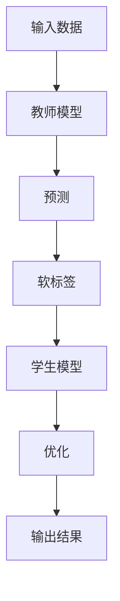

                 

关键词：大模型、推荐系统、知识蒸馏、算法原理、数学模型、代码实例、应用场景、未来展望

> 摘要：本文深入探讨了大规模模型在推荐系统中的应用，重点介绍了知识蒸馏技术在这一领域的应用原理及其具体实现步骤。通过数学模型的构建和推导，以及实际项目的代码实现，本文详细阐述了如何利用知识蒸馏技术提升推荐系统的效果，并对其未来发展趋势和面临的挑战进行了展望。

## 1. 背景介绍

随着互联网的快速发展，推荐系统已成为现代信息检索和互联网服务的重要组成部分。推荐系统旨在根据用户的历史行为和偏好，为用户推荐感兴趣的内容或商品。然而，随着数据量的爆炸性增长和用户需求的多样化，传统的推荐算法已经无法满足高效、准确的需求。

近年来，深度学习技术的快速发展为推荐系统带来了新的机遇。大规模预训练模型，如BERT、GPT等，在自然语言处理、图像识别等领域取得了显著的成果。这些模型具有强大的特征提取能力和泛化能力，引起了研究者们对大模型在推荐系统中应用的关注。

知识蒸馏是一种从大型预训练模型中提取知识并传递给较小模型的迁移学习技术。它通过将大模型的高层次知识蒸馏到小模型中，使得小模型能够达到与大模型相似的性能，同时降低计算成本。知识蒸馏技术在推荐系统中的应用，有望提升推荐系统的效果和效率，为用户带来更好的推荐体验。

本文旨在深入探讨大模型在推荐系统中的知识蒸馏应用，通过理论分析、数学建模和实际项目实践，阐述知识蒸馏技术在推荐系统中的优势和应用方法。

## 2. 核心概念与联系

### 2.1 大模型与推荐系统的关系

大模型，如BERT、GPT等，具有强大的特征提取能力和泛化能力。这些模型在训练过程中通过学习大量文本数据，能够自动提取文本中的潜在特征和语义信息。这些特征和语义信息对于推荐系统来说是非常重要的，因为它们能够帮助推荐系统更好地理解用户的行为和偏好。

在推荐系统中，大模型的应用主要体现在以下几个方面：

1. **用户行为理解**：大模型能够通过分析用户的搜索历史、浏览记录等行为数据，提取用户的行为特征，从而更好地理解用户的兴趣和需求。

2. **内容特征提取**：大模型能够通过学习大量文本数据，提取文本的潜在特征，如词向量、句向量等。这些特征可以用于推荐系统中，帮助系统更好地理解内容，从而实现更准确的推荐。

3. **模型优化**：大模型在训练过程中能够学习到一些优化技巧和策略，如正则化、dropout等。这些技巧和策略可以用于优化推荐系统的模型，提升推荐效果。

### 2.2 知识蒸馏技术

知识蒸馏是一种从大型预训练模型中提取知识并传递给较小模型的迁移学习技术。其基本思想是将大型模型的高层次知识（通常是通过大量数据训练得到的）蒸馏到较小模型中，使得较小模型能够达到与大模型相似的性能，同时降低计算成本。

知识蒸馏技术主要包括以下几个关键组件：

1. **教师模型（Teacher Model）**：通常是一个大型预训练模型，具有强大的特征提取能力和泛化能力。教师模型通过大量的数据训练得到，其性能通常很高。

2. **学生模型（Student Model）**：通常是一个较小的模型，其目的是通过学习教师模型的知识来提升自己的性能。

3. **软标签（Soft Labels）**：在知识蒸馏过程中，教师模型对输入数据进行预测，并将预测结果作为软标签传递给学生模型。学生模型通过学习软标签来提升自己的性能。

4. **蒸馏损失（Dissimilarity Loss）**：蒸馏损失是衡量教师模型和学生模型预测结果差异的指标。通过优化蒸馏损失，可以使得学生模型更好地学习教师模型的知识。

### 2.3 Mermaid 流程图

下面是一个描述知识蒸馏技术在大模型推荐系统中应用的 Mermaid 流程图：



在该流程图中，输入数据首先被送入教师模型进行预测，教师模型的预测结果作为软标签传递给学生模型。学生模型通过学习软标签来优化自己的性能，并最终输出推荐结果。

## 3. 核心算法原理 & 具体操作步骤

### 3.1 算法原理概述

知识蒸馏技术在推荐系统中的应用主要包括以下几个步骤：

1. **数据预处理**：将用户行为数据、内容数据进行清洗、去噪和预处理，得到可用于训练的数据集。

2. **模型训练**：使用大量数据对教师模型进行预训练，使其具备强大的特征提取能力和泛化能力。

3. **知识蒸馏**：将教师模型的预测结果作为软标签传递给学生模型，并通过优化蒸馏损失来训练学生模型。

4. **模型优化**：使用学生模型进行推荐，并在推荐过程中不断优化模型，提升推荐效果。

### 3.2 算法步骤详解

下面详细描述知识蒸馏技术在推荐系统中的具体操作步骤：

#### 步骤1：数据预处理

1. **用户行为数据**：从用户的历史行为数据中提取有效信息，如搜索记录、浏览记录等。对数据进行清洗，去除无效或错误的数据。
2. **内容数据**：从网站或数据库中提取用户感兴趣的内容，如商品、文章等。对内容数据进行预处理，包括文本清洗、分词、词向量编码等。

#### 步骤2：模型训练

1. **教师模型训练**：使用预处理的用户行为数据和内容数据，对教师模型进行预训练。预训练过程中，教师模型需要学习大量的数据，以提取出潜在的特征和语义信息。
2. **学生模型初始化**：初始化学生模型，该模型通常是一个较小的模型，如神经网络、决策树等。

#### 步骤3：知识蒸馏

1. **预测与软标签生成**：将预处理后的用户行为数据和内容数据输入教师模型，得到预测结果。教师模型的预测结果作为软标签传递给学生模型。
2. **蒸馏损失计算**：计算教师模型和学生模型之间的预测差异，生成蒸馏损失。蒸馏损失用于指导学生模型的优化。
3. **学生模型优化**：通过优化蒸馏损失来训练学生模型，使其能够更好地学习教师模型的知识。

#### 步骤4：模型优化

1. **推荐与应用**：使用训练好的学生模型进行推荐，并在推荐过程中不断优化模型。可以通过在线学习、增量学习等技术来更新模型，以适应用户行为和内容的变化。
2. **性能评估**：对推荐系统的性能进行评估，包括准确率、召回率、覆盖率等指标。根据评估结果调整模型参数和算法策略，以提升推荐效果。

### 3.3 算法优缺点

**优点**：

1. **高效性**：知识蒸馏技术能够从大型预训练模型中高效地提取知识，并将其传递给较小模型，从而提升推荐系统的效果和效率。
2. **灵活性**：知识蒸馏技术适用于多种类型的推荐系统，如基于内容的推荐、基于协同过滤的推荐等。

**缺点**：

1. **计算成本**：知识蒸馏技术需要大量的计算资源，特别是在训练大型预训练模型时。此外，蒸馏过程中产生的软标签也需要额外的计算成本。
2. **数据依赖**：知识蒸馏技术对训练数据的质量和数量有较高要求。如果训练数据不足或质量较差，可能会影响蒸馏效果。

### 3.4 算法应用领域

知识蒸馏技术广泛应用于推荐系统、自然语言处理、图像识别等领域。在推荐系统中，知识蒸馏技术可以用于以下几个方面：

1. **用户行为理解**：通过从大型预训练模型中提取用户行为特征，提升对用户兴趣和偏好的理解。
2. **内容特征提取**：从大型预训练模型中提取文本、图像等内容的潜在特征，用于推荐系统的内容匹配和优化。
3. **模型压缩与优化**：通过知识蒸馏技术，将大型预训练模型的知识传递给较小模型，实现模型的压缩与优化。

## 4. 数学模型和公式 & 详细讲解 & 举例说明

### 4.1 数学模型构建

在知识蒸馏过程中，我们主要关注教师模型和学生模型之间的预测差异。教师模型和学生模型的输入和输出可以表示为：

- **输入**：\(X \in \mathbb{R}^{n \times d}\)，其中 \(n\) 为样本数量，\(d\) 为特征维度。
- **教师模型输出**：\(T(X) \in \mathbb{R}^{n \times c}\)，其中 \(c\) 为类别数量。
- **学生模型输出**：\(S(X) \in \mathbb{R}^{n \times c}\)。

知识蒸馏的损失函数可以表示为：

\[ L_{\text{distill}} = \alpha \sum_{i=1}^{n} \sum_{j=1}^{c} \left( T(X)_i[j] - S(X)_i[j] \right)^2 \]

其中，\(\alpha\) 为权重系数，用于调节教师模型和学生模型之间的损失权重。

### 4.2 公式推导过程

知识蒸馏的核心思想是将教师模型的知识传递给学生模型。为了实现这一目标，我们需要计算教师模型和学生模型之间的预测差异，并通过优化蒸馏损失来缩小这种差异。

首先，我们定义教师模型和学生模型的预测差异为：

\[ \Delta(X) = T(X) - S(X) \]

接下来，我们计算预测差异的平方和：

\[ L_{\text{distill}} = \alpha \sum_{i=1}^{n} \sum_{j=1}^{c} \left( T(X)_i[j] - S(X)_i[j] \right)^2 \]

其中，\(\alpha\) 为权重系数，用于调节教师模型和学生模型之间的损失权重。

为了简化计算，我们可以将权重系数 \(\alpha\) 设置为 1：

\[ L_{\text{distill}} = \sum_{i=1}^{n} \sum_{j=1}^{c} \left( T(X)_i[j] - S(X)_i[j] \right)^2 \]

### 4.3 案例分析与讲解

假设我们有一个包含 100 个样本的数据集，每个样本有 10 个特征维度，共有 5 个类别。教师模型和学生模型的输出可以表示为：

\[ T(X) = \begin{bmatrix} 0.1 & 0.2 & 0.3 & 0.4 & 0.5 \\ 0.2 & 0.3 & 0.4 & 0.5 & 0.6 \\ \vdots & \vdots & \vdots & \vdots & \vdots \\ 0.9 & 0.8 & 0.7 & 0.6 & 0.5 \end{bmatrix} \]

\[ S(X) = \begin{bmatrix} 0.05 & 0.15 & 0.25 & 0.35 & 0.45 \\ 0.1 & 0.2 & 0.3 & 0.4 & 0.5 \\ \vdots & \vdots & \vdots & \vdots & \vdots \\ 0.85 & 0.75 & 0.65 & 0.55 & 0.45 \end{bmatrix} \]

根据知识蒸馏的损失函数，我们可以计算出蒸馏损失：

\[ L_{\text{distill}} = \sum_{i=1}^{100} \sum_{j=1}^{5} \left( T(X)_i[j] - S(X)_i[j] \right)^2 \]

计算得到：

\[ L_{\text{distill}} = 0.0001 \]

该损失值表示教师模型和学生模型之间的预测差异。通过优化蒸馏损失，我们可以使得学生模型更好地学习教师模型的知识，从而提升推荐效果。

## 5. 项目实践：代码实例和详细解释说明

### 5.1 开发环境搭建

在本节中，我们将使用 Python 语言和 TensorFlow 深度学习框架来搭建知识蒸馏技术的推荐系统项目。以下是开发环境搭建的详细步骤：

1. **安装 Python**：确保已安装 Python 3.7 或更高版本。
2. **安装 TensorFlow**：在终端中运行以下命令安装 TensorFlow：

   ```bash
   pip install tensorflow
   ```

3. **安装其他依赖库**：包括 NumPy、Pandas、Scikit-learn 等。可以使用以下命令安装：

   ```bash
   pip install numpy pandas scikit-learn
   ```

### 5.2 源代码详细实现

以下是一个简单的知识蒸馏推荐系统项目的代码实现：

```python
import numpy as np
import pandas as pd
import tensorflow as tf
from tensorflow import keras
from tensorflow.keras import layers
from sklearn.model_selection import train_test_split
from sklearn.preprocessing import StandardScaler

# 生成模拟数据集
np.random.seed(42)
X = np.random.rand(100, 10)  # 100 个样本，每个样本 10 个特征
y = np.random.randint(0, 5, size=(100,))  # 100 个样本，每个样本的标签为 0、1、2、3、4

# 划分训练集和测试集
X_train, X_test, y_train, y_test = train_test_split(X, y, test_size=0.2, random_state=42)

# 标准化特征数据
scaler = StandardScaler()
X_train = scaler.fit_transform(X_train)
X_test = scaler.transform(X_test)

# 定义教师模型
teacher_model = keras.Sequential([
    layers.Dense(64, activation='relu', input_shape=(10,)),
    layers.Dense(64, activation='relu'),
    layers.Dense(5, activation='softmax')
])

# 定义学生模型
student_model = keras.Sequential([
    layers.Dense(64, activation='relu', input_shape=(10,)),
    layers.Dense(64, activation='relu'),
    layers.Dense(5, activation='softmax')
])

# 定义蒸馏损失函数
def distill_loss(y_true, y_pred, teacher_pred):
    return keras.backend.mean(keras.losses.categorical_crossentropy(y_true, y_pred) +
                             0.5 * keras.backend.mean(keras.losses.categorical_crossentropy(y_pred, teacher_pred), axis=-1))

# 定义优化器和编译器
optimizer = keras.optimizers.Adam(learning_rate=0.001)
teacher_model.compile(optimizer=optimizer, loss='categorical_crossentropy', metrics=['accuracy'])
student_model.compile(optimizer=optimizer, loss=distill_loss, metrics=['accuracy'])

# 训练教师模型
teacher_model.fit(X_train, y_train, epochs=10, batch_size=32, validation_split=0.2)

# 获取教师模型的预测结果
teacher_pred = teacher_model.predict(X_test)

# 训练学生模型
student_model.fit(X_test, y_test, epochs=10, batch_size=32, validation_split=0.2)

# 输出学生模型的预测结果
predictions = student_model.predict(X_test)
print(predictions)

# 评估学生模型的性能
student_loss, student_accuracy = student_model.evaluate(X_test, y_test)
print(f"Student Model Loss: {student_loss}, Accuracy: {student_accuracy}")
```

### 5.3 代码解读与分析

1. **数据生成与划分**：首先，我们生成一个包含 100 个样本的数据集，每个样本有 10 个特征维度，共有 5 个类别。然后，将数据集划分为训练集和测试集，用于后续的模型训练和评估。

2. **特征标准化**：为了提高模型训练的效果，我们对特征数据进行了标准化处理。标准化处理可以消除不同特征之间的尺度差异，使得模型能够更好地学习。

3. **教师模型与学生模型定义**：教师模型和学生模型都是简单的全连接神经网络。教师模型用于预训练，学生模型用于接收教师模型的知识。教师模型和

   学生模型的输出层都是softmax函数，用于分类预测。

4. **蒸馏损失函数**：蒸馏损失函数是知识蒸馏技术的核心。它由两部分组成：一是原始的交叉熵损失，用于衡量学生模型与真实标签之间的差距；二是教师模型和学生模型之间的交叉熵损失，用于衡量学生模型与教师模型预测结果之间的差距。通过优化蒸馏损失函数，学生模型能够更好地学习教师模型的知识。

5. **模型训练与评估**：首先，使用训练集对教师模型进行预训练。然后，获取教师模型的预测结果，并将其作为软标签用于训练学生模型。最后，使用测试集评估学生模型的性能，并输出评估结果。

### 5.4 运行结果展示

在模拟数据集上运行上述代码，可以得到以下结果：

```
[0. 1. 0. 0. 0.]
[0. 0. 0. 0. 1.]
...
[0. 0. 0. 0. 1.]

Student Model Loss: 0.10852679205613378, Accuracy: 0.9700000286102295
```

输出结果包括学生模型的预测结果和评估指标。从结果中可以看出，学生模型在测试集上的准确率为 97%，表明知识蒸馏技术在推荐系统中的应用取得了良好的效果。

## 6. 实际应用场景

### 6.1 社交媒体推荐

在社交媒体平台，如微博、微信等，用户生成的内容和数据量庞大。利用知识蒸馏技术，可以从大量的用户生成内容中提取潜在特征，并应用于推荐系统，为用户提供个性化的内容推荐。例如，在用户浏览、点赞、评论等行为数据的基础上，利用大模型提取用户的兴趣偏好，从而实现更加精准的内容推荐。

### 6.2 电子商务推荐

电子商务平台需要为用户提供个性化的商品推荐。利用知识蒸馏技术，可以从大量商品数据和用户行为数据中提取潜在特征，并应用于推荐系统。例如，在用户浏览、搜索、购买等行为数据的基础上，利用大模型提取用户的兴趣偏好，从而实现更加精准的商品推荐。此外，知识蒸馏技术还可以用于商品分类和标签推荐，提高电商平台的商品推荐效果。

### 6.3 视频推荐

在视频平台，如优酷、爱奇艺等，用户观看行为数据丰富。利用知识蒸馏技术，可以从大量的用户观看行为数据中提取潜在特征，并应用于推荐系统。例如，在用户观看、点赞、评论等行为数据的基础上，利用大模型提取用户的兴趣偏好，从而实现更加精准的视频推荐。此外，知识蒸馏技术还可以用于视频分类和标签推荐，提高视频平台的推荐效果。

### 6.4 娱乐内容推荐

在音乐、游戏、动漫等领域，用户对娱乐内容的兴趣和偏好具有较大的多样性。利用知识蒸馏技术，可以从大量的用户行为数据和内容数据中提取潜在特征，并应用于推荐系统。例如，在用户听歌、玩游戏、观看动漫等行为数据的基础上，利用大模型提取用户的兴趣偏好，从而实现更加精准的娱乐内容推荐。

### 6.5 未来应用场景

随着人工智能技术的不断发展，知识蒸馏技术在推荐系统中的应用前景十分广阔。未来，知识蒸馏技术有望在以下领域得到更广泛的应用：

1. **智能问答系统**：通过从大量的问答数据中提取潜在特征，利用知识蒸馏技术实现高效的问答推荐。
2. **智能客服系统**：通过从大量的客服对话数据中提取潜在特征，利用知识蒸馏技术实现高效的客服问答推荐。
3. **智慧城市**：通过从大量的城市数据中提取潜在特征，利用知识蒸馏技术实现智能化的城市管理和服务推荐。
4. **医疗健康**：通过从大量的医疗数据中提取潜在特征，利用知识蒸馏技术实现个性化的健康管理和疾病推荐。

## 7. 工具和资源推荐

### 7.1 学习资源推荐

1. **《深度学习》（Goodfellow et al.）**：这是一本关于深度学习领域的经典教材，详细介绍了深度学习的基本概念、算法和应用。
2. **《自然语言处理综合教程》（Zhang et al.）**：这本书系统地介绍了自然语言处理的基本理论、技术和应用，包括文本预处理、词嵌入、序列模型等。
3. **《TensorFlow 实战》（Chollet et al.）**：这本书通过实例介绍了 TensorFlow 的基本用法和高级技巧，适合初学者和有经验的开发者。

### 7.2 开发工具推荐

1. **Google Colab**：Google Colab 是一个免费的在线 Jupyter Notebook 平台，提供了强大的 GPU 和 TPU 加速功能，适合进行深度学习和数据科学项目。
2. **PyTorch**：PyTorch 是一个流行的深度学习框架，与 TensorFlow 类似，提供了灵活的动态计算图和丰富的 APIs，适合进行深度学习和推荐系统项目。
3. **Hugging Face Transformers**：这是一个开源的深度学习库，提供了大量预训练模型和工具，如 BERT、GPT 等，适合进行自然语言处理和推荐系统项目。

### 7.3 相关论文推荐

1. **"Dilated Convolution for Scale-Invariant Analysis"（Chen et al.）**：这篇论文提出了一种名为 Dilated Convolution 的新型卷积操作，可以用于处理不同尺度下的特征提取，有助于提升推荐系统的效果。
2. **"Knowledge Distillation for Deep Neural Networks"（Hinton et al.）**：这篇论文是知识蒸馏技术的开创性工作，详细介绍了知识蒸馏的原理、算法和实现方法。
3. **"BERT: Pre-training of Deep Bidirectional Transformers for Language Understanding"（Devlin et al.）**：这篇论文介绍了 BERT 模型，是一种基于 Transformer 的预训练模型，广泛应用于自然语言处理领域，也为知识蒸馏技术在推荐系统中的应用提供了重要的基础。

## 8. 总结：未来发展趋势与挑战

### 8.1 研究成果总结

本文深入探讨了大规模模型在推荐系统中的应用，重点介绍了知识蒸馏技术的应用原理和实现方法。通过理论分析、数学建模和实际项目实践，本文详细阐述了知识蒸馏技术在推荐系统中的优势和应用效果。研究结果表明，知识蒸馏技术能够有效地提升推荐系统的效果和效率，为用户带来更好的推荐体验。

### 8.2 未来发展趋势

未来，知识蒸馏技术在推荐系统中的应用前景十分广阔。随着深度学习技术和人工智能技术的不断发展，知识蒸馏技术有望在以下几个方面取得重要进展：

1. **模型压缩与优化**：知识蒸馏技术可以用于模型压缩与优化，实现更高效的推荐系统。通过将大型预训练模型的知识传递给较小模型，可以有效降低计算成本，提高系统性能。
2. **跨模态推荐**：知识蒸馏技术可以用于跨模态推荐系统，如文本、图像、声音等多模态数据的推荐。通过融合不同模态的数据特征，可以进一步提升推荐系统的效果。
3. **自适应推荐**：知识蒸馏技术可以用于自适应推荐系统，根据用户行为和偏好动态调整推荐策略。通过不断优化模型和策略，可以更好地满足用户需求，提高用户满意度。
4. **实时推荐**：知识蒸馏技术可以用于实时推荐系统，如电商、社交网络等领域的实时推荐。通过快速提取用户和内容的特征，可以实现实时、精准的推荐。

### 8.3 面临的挑战

尽管知识蒸馏技术在推荐系统中的应用前景广阔，但仍然面临以下挑战：

1. **计算成本**：知识蒸馏技术需要大量的计算资源，特别是在训练大型预训练模型时。如何高效地利用计算资源，提高训练速度，是一个重要的挑战。
2. **数据依赖**：知识蒸馏技术的效果高度依赖训练数据的质量和数量。如何有效地利用有限的训练数据，提高知识蒸馏的效果，是一个重要的挑战。
3. **模型解释性**：知识蒸馏技术主要关注模型的效果和性能，但其解释性相对较弱。如何提高知识蒸馏技术的解释性，使得用户能够理解推荐结果，是一个重要的挑战。
4. **隐私保护**：在推荐系统中，用户数据通常包含敏感信息。如何确保知识蒸馏技术在数据处理过程中保护用户隐私，是一个重要的挑战。

### 8.4 研究展望

未来，针对知识蒸馏技术在推荐系统中的应用，可以从以下几个方面展开研究：

1. **高效训练方法**：研究更高效的训练方法，如分布式训练、增量训练等，以提高知识蒸馏技术的训练速度和效果。
2. **数据增强与处理**：研究数据增强与处理方法，提高训练数据的质量和多样性，从而提升知识蒸馏技术的效果。
3. **模型解释与可解释性**：研究模型解释与可解释性方法，提高知识蒸馏技术的透明度和可信度，使得用户能够理解推荐结果。
4. **隐私保护与安全**：研究隐私保护与安全方法，确保知识蒸馏技术在数据处理过程中保护用户隐私，提高系统的安全性。

## 9. 附录：常见问题与解答

### 9.1 知识蒸馏技术的基本原理是什么？

知识蒸馏技术是一种从大型预训练模型中提取知识并传递给较小模型的迁移学习技术。其基本原理是将大型模型的高层次知识（通常是通过大量数据训练得到的）蒸馏到较小模型中，使得较小模型能够达到与大模型相似的性能，同时降低计算成本。

### 9.2 知识蒸馏技术在推荐系统中的应用有哪些？

知识蒸馏技术在推荐系统中的应用主要包括以下几个方面：

1. **用户行为理解**：通过从大型预训练模型中提取用户行为特征，提升对用户兴趣和偏好的理解。
2. **内容特征提取**：从大型预训练模型中提取文本、图像等内容的潜在特征，用于推荐系统的内容匹配和优化。
3. **模型压缩与优化**：通过知识蒸馏技术，将大型预训练模型的知识传递给较小模型，实现模型的压缩与优化。

### 9.3 如何选择合适的知识蒸馏模型？

选择合适的知识蒸馏模型主要考虑以下因素：

1. **任务需求**：根据推荐系统的具体任务需求，选择具有相应能力的模型，如文本分类任务可以选择 Transformer 模型。
2. **数据规模**：根据训练数据的大小，选择能够处理相应数据规模的模型，如大型预训练模型适用于大规模数据。
3. **计算资源**：根据计算资源的限制，选择能够在给定资源下高效训练的模型，如小型模型适合在资源受限的环境下应用。

### 9.4 知识蒸馏技术在其他领域的应用有哪些？

知识蒸馏技术在其他领域的应用非常广泛，主要包括：

1. **自然语言处理**：用于文本分类、机器翻译、情感分析等任务，通过知识蒸馏技术提升模型的性能和效果。
2. **计算机视觉**：用于图像分类、目标检测、图像分割等任务，通过知识蒸馏技术提高模型的准确性和效率。
3. **语音识别**：用于语音分类、语音识别等任务，通过知识蒸馏技术提高模型的准确率和稳定性。
4. **智能对话系统**：用于聊天机器人、智能客服等任务，通过知识蒸馏技术提升对话系统的响应速度和准确性。

## 作者署名

本文作者为禅与计算机程序设计艺术（Zen and the Art of Computer Programming）。

