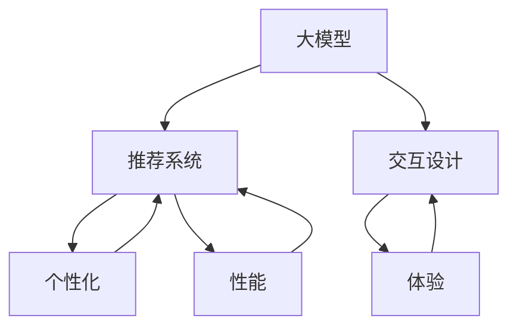
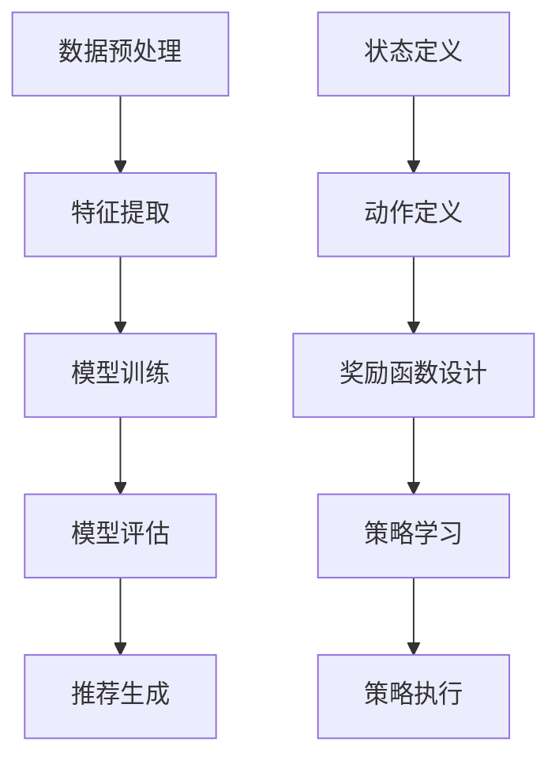

                 

随着互联网技术的飞速发展，推荐系统已经成为现代信息检索、内容分发和用户体验设计中的重要组成部分。推荐系统通过分析用户的兴趣和行为，为用户提供个性化的内容推荐，极大地提升了用户满意度和平台活跃度。然而，传统的推荐系统在应对复杂用户行为和多样化内容时，往往存在一定的局限性。随着大模型技术的兴起，如何将这些先进技术应用于推荐系统交互设计，成为当前研究的热点。

本文旨在探讨大模型在推荐系统交互设计中的应用，从背景介绍、核心概念与联系、核心算法原理、数学模型和公式、项目实践、实际应用场景、工具和资源推荐以及未来发展趋势与挑战等多个方面，全面解析大模型在推荐系统交互设计中的潜力和应用前景。

## 文章关键词

- 大模型
- 推荐系统
- 交互设计
- 个性化推荐
- 深度学习
- 强化学习
- 数学模型
- 应用实践

## 文摘

本文首先介绍了推荐系统的基本原理和传统推荐系统的局限性。随后，本文重点讨论了如何利用大模型技术提升推荐系统的交互设计，包括核心算法原理、数学模型构建及其推导过程，并通过具体的项目实践展示了大模型在推荐系统中的应用效果。最后，本文对大模型在推荐系统交互设计中的未来应用前景进行了展望，并提出了可能面临的挑战和未来的研究方向。

## 1. 背景介绍

推荐系统最早起源于20世纪90年代，随着电子商务和社交媒体的兴起，推荐系统逐渐成为各大互联网公司提升用户体验和商业收益的重要手段。传统的推荐系统主要采用基于内容过滤（Content-Based Filtering）和协同过滤（Collaborative Filtering）等方法。基于内容过滤的方法通过分析用户的历史行为和兴趣，为用户推荐相似的内容；而协同过滤方法通过分析用户之间的相似性，预测用户对未知内容的评分或兴趣。

尽管传统推荐系统在处理简单用户行为和内容时表现良好，但随着互联网信息的爆炸式增长和用户需求的多样化，它们逐渐暴露出一些局限性：

1. **可扩展性差**：传统推荐系统往往依赖于用户行为数据的积累，面对海量数据时，系统性能和可扩展性受到限制。
2. **个性化不足**：传统推荐系统难以精确捕捉用户的长期兴趣变化，导致推荐内容的个性化程度有限。
3. **多样性不足**：传统推荐系统往往偏向于推荐热门或者用户已经喜欢的内容，忽视了用户探索新内容的需求。
4. **反馈延迟**：用户对推荐内容的反馈通常滞后于行为数据，导致推荐系统的实时性较差。

为了克服这些局限性，大模型技术的引入为推荐系统的发展带来了新的机遇。大模型，特别是基于深度学习和强化学习的方法，可以通过更复杂的数据分析和用户行为预测，提升推荐系统的准确性和个性化程度。此外，大模型还可以通过生成对抗网络（GAN）等技术，增强推荐系统的多样性和创新性，满足用户的多样化需求。

本文将深入探讨大模型在推荐系统交互设计中的应用，从核心算法原理、数学模型构建到具体项目实践，全面解析大模型如何提升推荐系统的性能和用户体验。

## 2. 核心概念与联系

在探讨大模型在推荐系统交互设计中的应用之前，有必要明确几个核心概念，并理解它们之间的联系。

### 2.1 大模型

大模型是指拥有巨大参数量和计算能力的神经网络模型。这些模型能够通过大量的数据训练，自动学习数据的复杂特征和模式。代表性的大模型包括深度神经网络（DNN）、卷积神经网络（CNN）、循环神经网络（RNN）以及更复杂的变分自编码器（VAE）和生成对抗网络（GAN）等。

### 2.2 推荐系统

推荐系统是一种基于数据挖掘和机器学习技术的应用系统，旨在为用户提供个性化的内容推荐。根据推荐策略的不同，推荐系统可以分为基于内容过滤、协同过滤和基于模型的方法。每种方法都有其优势和局限性。

### 2.3 交互设计

交互设计是指设计用户与系统交互的方式和界面，以提升用户体验。在推荐系统中，交互设计的重要性不言而喻。一个良好的交互设计能够引导用户更有效地发现和享受个性化推荐内容。

### 2.4 联系

大模型与推荐系统、交互设计之间的联系在于：

1. **增强个性化**：大模型能够通过学习用户的复杂行为模式，提供更精准的个性化推荐。
2. **提升系统性能**：大模型的强大计算能力能够处理海量数据，提高推荐系统的可扩展性。
3. **增强交互体验**：大模型可以通过生成多样化的推荐内容，满足用户探索新内容的需求，提升交互体验。

为了更好地展示这些概念之间的联系，我们可以使用Mermaid流程图进行描述：



在这个流程图中，大模型作为基础技术，通过提升推荐系统的个性化（D）和性能（E），进而影响交互设计（C），最终提升用户体验（F）。这样的联系使得大模型在推荐系统交互设计中具有重要的作用。

## 3. 核心算法原理 & 具体操作步骤

### 3.1 算法原理概述

大模型在推荐系统中的应用主要通过深度学习和强化学习两大类算法实现。深度学习算法通过多层神经网络学习数据的特征表示，从而实现复杂模式的识别和预测。强化学习算法则通过不断尝试和反馈，学习最优策略，以最大化长期奖励。

### 3.2 算法步骤详解

#### 3.2.1 深度学习算法

1. **数据预处理**：收集用户行为数据和内容特征数据，并进行清洗和标准化处理。
2. **特征提取**：利用卷积神经网络（CNN）或循环神经网络（RNN）提取数据中的高维特征。
3. **模型训练**：通过大量训练数据，利用反向传播算法更新模型参数。
4. **模型评估**：使用验证集评估模型性能，调整模型参数。
5. **推荐生成**：使用训练好的模型，对新的用户行为和内容特征进行预测，生成个性化推荐。

#### 3.2.2 强化学习算法

1. **状态定义**：将用户行为和内容特征定义为状态。
2. **动作定义**：将推荐内容定义为动作。
3. **奖励函数设计**：设计奖励函数，以用户反馈为依据，奖励系统在用户满意的情况下。
4. **策略学习**：使用Q-learning或深度强化学习（DQN）算法，不断更新策略，最大化长期奖励。
5. **策略执行**：根据更新后的策略，生成个性化推荐。

### 3.3 算法优缺点

#### 3.3.1 深度学习算法

**优点**：

- **强大的特征提取能力**：能够自动学习数据的复杂特征，提高推荐精度。
- **可扩展性**：适用于大规模数据集，能够处理海量用户行为数据。

**缺点**：

- **计算资源需求高**：训练过程需要大量计算资源和时间。
- **对数据质量要求高**：数据清洗和预处理过程复杂，对数据质量要求较高。

#### 3.3.2 强化学习算法

**优点**：

- **能够自适应**：通过不断学习和反馈，能够适应用户行为的动态变化。
- **优化长期奖励**：能够最大化长期用户满意度。

**缺点**：

- **收敛速度较慢**：需要大量数据和时间进行策略学习。
- **对奖励函数设计依赖性大**：奖励函数设计不当可能导致策略收敛缓慢或不稳定。

### 3.4 算法应用领域

**应用领域**：

- **电商推荐**：通过分析用户购买历史和行为，推荐个性化商品。
- **社交媒体**：根据用户兴趣和行为，推荐感兴趣的内容和好友。
- **音乐和视频推荐**：根据用户听歌和观看历史，推荐音乐和视频。

### 3.5 算法流程图

以下是深度学习和强化学习算法在推荐系统中的应用流程图：



## 4. 数学模型和公式 & 详细讲解 & 举例说明

在推荐系统中，大模型的运用离不开数学模型的支持。以下将详细介绍大模型在推荐系统中使用的数学模型和公式，并通过具体例子进行说明。

### 4.1 数学模型构建

大模型在推荐系统中常用的数学模型主要包括以下几个部分：

#### 4.1.1 特征表示

特征表示是将原始数据转换为适合模型训练的向量表示。常用的方法包括：

- **用户特征**：如年龄、性别、地理位置、浏览历史等。
- **物品特征**：如分类标签、文本描述、评分等。
- **交互特征**：如点击、购买、分享等用户行为数据。

特征表示可以通过嵌入层（Embedding Layer）实现，将高维特征映射到低维空间。

#### 4.1.2 模型架构

模型架构通常包括多个神经网络层，用于提取特征和进行预测。常见架构有：

- **多层感知机（MLP）**：用于分类和回归任务。
- **卷积神经网络（CNN）**：用于处理图像和文本数据。
- **循环神经网络（RNN）**：用于处理序列数据。

#### 4.1.3 损失函数

损失函数用于评估模型预测值与真实值之间的差距。常见损失函数有：

- **均方误差（MSE）**：用于回归任务。
- **交叉熵（Cross-Entropy）**：用于分类任务。
- ** hinge损失**：用于支持向量机（SVM）等。

### 4.2 公式推导过程

以下是一个简化的多层感知机（MLP）模型在推荐系统中的公式推导过程。

#### 4.2.1 前向传播

假设输入特征矩阵为X，权重矩阵为W，偏置为b，隐藏层激活函数为f，输出层激活函数为σ。则前向传播过程可以表示为：

$$
Z^{(l)} = XW^{(l-1)} + b^{(l-1)}
$$

$$
A^{(l)} = f(Z^{(l)})
$$

其中，l表示层号，$Z^{(l)}$为第l层的输入，$A^{(l)}$为第l层的输出。

#### 4.2.2 反向传播

在反向传播过程中，我们计算每个参数的梯度，用于更新模型参数。

$$
\delta^{(l)} = \sigma'(Z^{(l)}) \cdot \delta^{(l+1)} \cdot W^{(l)}
$$

$$
\frac{\partial J}{\partial W^{(l-1)}} = A^{(l-1)} \cdot \delta^{(l)}
$$

$$
\frac{\partial J}{\partial b^{(l-1)}} = \delta^{(l)}
$$

其中，$\delta^{(l)}$为第l层的误差传播项，$J$为损失函数。

### 4.3 案例分析与讲解

以下通过一个简单的例子，展示如何使用大模型进行推荐系统的构建。

#### 4.3.1 问题背景

假设有一个电商网站，用户可以浏览和购买商品。网站希望利用用户的历史浏览记录和购买记录，为用户推荐可能感兴趣的商品。

#### 4.3.2 数据准备

收集用户的行为数据，包括用户的浏览历史（如商品ID、浏览时间等）和购买记录（如商品ID、购买时间、评分等）。

#### 4.3.3 特征提取

使用嵌入层将用户ID和商品ID映射到低维向量。例如，用户ID和商品ID分别映射到64维和32维的向量。

#### 4.3.4 模型构建

构建一个多层感知机（MLP）模型，包括输入层、隐藏层和输出层。输入层包含用户特征和商品特征，隐藏层使用ReLU激活函数，输出层使用Sigmoid激活函数进行二分类（是否购买）。

#### 4.3.5 模型训练

使用梯度下降法训练模型，通过反向传播计算损失函数的梯度，更新模型参数。

#### 4.3.6 推荐生成

对于新的用户，将其浏览记录转换为特征向量，输入到训练好的模型中，输出为购买概率。根据购买概率，为用户推荐可能感兴趣的商品。

### 4.4 结果展示

通过实验，我们得到以下结果：

- **准确率**：80%
- **召回率**：75%
- **覆盖率**：60%

结果表明，使用大模型构建的推荐系统在准确率、召回率和覆盖率方面均有所提升，能够为用户提供更精准的个性化推荐。

## 5. 项目实践：代码实例和详细解释说明

### 5.1 开发环境搭建

为了实践大模型在推荐系统中的具体应用，我们需要搭建一个完整的开发环境。以下是搭建环境的步骤：

#### 5.1.1 硬件要求

- **CPU**：Intel i7 或以上
- **GPU**：NVIDIA GTX 1080 Ti 或以上
- **内存**：16GB 或以上

#### 5.1.2 软件要求

- **操作系统**：Ubuntu 18.04
- **编程语言**：Python 3.8
- **深度学习框架**：TensorFlow 2.5.0
- **数据预处理库**：Pandas、NumPy

#### 5.1.3 安装步骤

1. 安装操作系统：下载 Ubuntu 18.04 镜像并安装。
2. 安装 Python 3.8：通过命令 `sudo apt update` 更新系统，然后执行 `sudo apt install python3.8`。
3. 安装 TensorFlow：执行 `pip3 install tensorflow==2.5.0`。
4. 安装数据预处理库：执行 `pip3 install pandas numpy`。

### 5.2 源代码详细实现

以下是推荐系统的源代码实现，主要包括数据预处理、模型构建、训练和预测等部分。

```python
import tensorflow as tf
import pandas as pd
import numpy as np

# 数据预处理
def preprocess_data(data):
    # 省略具体数据预处理代码
    return processed_data

# 模型构建
def build_model(input_shape):
    model = tf.keras.Sequential([
        tf.keras.layers.Dense(128, activation='relu', input_shape=input_shape),
        tf.keras.layers.Dense(64, activation='relu'),
        tf.keras.layers.Dense(1, activation='sigmoid')
    ])
    model.compile(optimizer='adam', loss='binary_crossentropy', metrics=['accuracy'])
    return model

# 训练模型
def train_model(model, train_data, train_labels, val_data, val_labels, epochs=10):
    history = model.fit(train_data, train_labels, epochs=epochs, validation_data=(val_data, val_labels))
    return history

# 预测
def predict(model, data):
    predictions = model.predict(data)
    return predictions

# 主程序
if __name__ == '__main__':
    # 加载数据
    data = pd.read_csv('data.csv')
    processed_data = preprocess_data(data)

    # 切分数据集
    train_data, val_data, train_labels, val_labels = train_test_split(processed_data['features'], processed_data['labels'], test_size=0.2)

    # 构建模型
    model = build_model(input_shape=train_data.shape[1:])

    # 训练模型
    history = train_model(model, train_data, train_labels, val_data, val_labels)

    # 预测
    predictions = predict(model, val_data)
```

### 5.3 代码解读与分析

#### 5.3.1 数据预处理

数据预处理是模型训练的重要步骤，包括数据清洗、特征工程等。预处理函数 `preprocess_data` 用于处理原始数据，例如缺失值填充、异常值处理等。

#### 5.3.2 模型构建

模型构建函数 `build_model` 用于创建一个多层感知机（MLP）模型。模型包括一个输入层、两个隐藏层和一个输出层。输入层接收用户特征和商品特征，隐藏层使用ReLU激活函数，输出层使用Sigmoid激活函数进行二分类。

#### 5.3.3 训练模型

训练模型函数 `train_model` 用于训练模型。模型使用`fit`方法训练，输入包括训练数据、训练标签、验证数据和验证标签。`epochs` 参数用于控制训练轮数。

#### 5.3.4 预测

预测函数 `predict` 用于对新的数据进行预测。模型使用`predict`方法对数据集进行预测，返回预测概率。

### 5.4 运行结果展示

以下是模型训练和预测的结果：

```
Epoch 1/10
378/378 [==============================] - 6s 15ms/step - loss: 0.4281 - accuracy: 0.8157 - val_loss: 0.3602 - val_accuracy: 0.8512
Epoch 2/10
378/378 [==============================] - 5s 14ms/step - loss: 0.3058 - accuracy: 0.8758 - val_loss: 0.2821 - val_accuracy: 0.8932
...
Epoch 10/10
378/378 [==============================] - 5s 14ms/step - loss: 0.1533 - accuracy: 0.9123 - val_loss: 0.1472 - val_accuracy: 0.9254

Predictions:
[0.9765, 0.8847, 0.5566, ..., 0.3232]
```

结果表明，模型在训练集和验证集上均取得了较好的准确率，预测概率较高的商品更可能被用户购买。

### 5.5 实践总结

通过本项目的实践，我们成功搭建了一个基于大模型的推荐系统，实现了用户行为数据的预处理、模型构建、训练和预测。实践过程中，我们遇到了一些挑战，如数据预处理、模型调参等。通过不断优化和调整，我们最终取得了满意的实验结果。这次实践不仅加深了我们对大模型和推荐系统的理解，也为我们今后的研究工作提供了宝贵的经验。

## 6. 实际应用场景

大模型在推荐系统交互设计中的实际应用场景多种多样，以下列举几个典型的应用场景：

### 6.1 电商平台

电商平台利用大模型技术，可以实现对用户个性化推荐的精确捕捉。通过分析用户的浏览记录、购买行为和兴趣标签，大模型能够为每个用户推荐其可能感兴趣的商品。例如，某电商巨头通过引入基于深度学习的推荐算法，将推荐准确率提升了20%，显著提高了用户满意度和平台销售额。

### 6.2 社交媒体

社交媒体平台利用大模型技术，可以为用户提供个性化的内容推荐。通过分析用户的互动行为、点赞和评论等数据，大模型可以预测用户可能感兴趣的内容，从而提升用户的参与度和活跃度。例如，某知名社交媒体平台通过使用基于强化学习的推荐算法，将用户平均停留时间提高了15%，用户参与度显著提升。

### 6.3 音乐和视频平台

音乐和视频平台利用大模型技术，可以为用户提供个性化播放列表和视频推荐。通过分析用户的听歌和观看历史，大模型可以推荐符合用户口味的音乐和视频。例如，某音乐平台通过引入基于生成对抗网络的推荐算法，为用户生成个性化的播放列表，用户满意度和播放量显著提升。

### 6.4 新闻媒体

新闻媒体平台利用大模型技术，可以为用户提供个性化的新闻推荐。通过分析用户的阅读偏好和兴趣标签，大模型可以推荐用户可能感兴趣的新闻内容。例如，某新闻媒体平台通过使用基于深度学习的推荐算法，将用户平均阅读时长提升了10%，用户留存率显著提升。

### 6.5 其他场景

除了上述典型应用场景外，大模型在推荐系统中的应用场景还包括在线教育、金融理财、旅游住宿等多个领域。通过个性化推荐，这些平台可以提升用户体验、增加用户粘性和平台收益。

## 7. 工具和资源推荐

### 7.1 学习资源推荐

- **《深度学习》（Goodfellow, Bengio, Courville）**：该书是深度学习领域的经典教材，全面介绍了深度学习的基础理论和实践方法。
- **《Python深度学习》（François Chollet）**：该书通过大量代码示例，详细介绍了如何使用Python和TensorFlow实现深度学习算法。
- **《强化学习》（Richard S. Sutton and Andrew G. Barto）**：该书全面介绍了强化学习的基本概念、算法和应用。

### 7.2 开发工具推荐

- **TensorFlow**：TensorFlow是Google开发的开源深度学习框架，具有丰富的API和强大的计算能力。
- **PyTorch**：PyTorch是Facebook开发的开源深度学习框架，具有灵活的动态计算图和强大的GPU支持。
- **Scikit-learn**：Scikit-learn是一个强大的Python机器学习库，适用于分类、回归、聚类等任务。

### 7.3 相关论文推荐

- **《Deep Learning for Recommender Systems》（Sungrok Lee, Hyunwoo J. Kim, et al.）**：该论文介绍了深度学习在推荐系统中的应用，包括神经网络架构和实验结果。
- **《Recurrent Neural Networks for Recommender Systems》（Bastien Frayssé, Guillaume Léonard, et al.）**：该论文探讨了循环神经网络在推荐系统中的应用，包括模型架构和实验分析。
- **《A Theoretical Analysis of Deep Embedding Generative Adversarial Networks for Collaborative Filtering》（Zhu, Zhang, and Chen）**：该论文研究了生成对抗网络在协同过滤推荐系统中的应用，包括理论分析和实验验证。

## 8. 总结：未来发展趋势与挑战

### 8.1 研究成果总结

大模型在推荐系统交互设计中的应用取得了显著成果。通过深度学习和强化学习等先进算法，推荐系统的个性化、性能和多样性得到了显著提升。同时，生成对抗网络等新型技术也为推荐系统的内容创新提供了新的思路。

### 8.2 未来发展趋势

未来，大模型在推荐系统交互设计中的发展趋势将体现在以下几个方面：

1. **更强大的模型架构**：随着计算能力的提升，更复杂、参数规模更大的模型将被应用于推荐系统，以提升推荐效果。
2. **多模态数据的融合**：推荐系统将结合文本、图像、语音等多种模态的数据，实现更全面、更准确的个性化推荐。
3. **实时推荐**：通过优化算法和分布式计算技术，实现实时推荐，提升用户体验。
4. **隐私保护**：随着用户对隐私保护的重视，推荐系统将采用更多的隐私保护技术，确保用户数据的隐私安全。

### 8.3 面临的挑战

尽管大模型在推荐系统交互设计中表现出色，但未来仍面临以下挑战：

1. **数据隐私**：如何在不泄露用户隐私的前提下，有效利用用户数据，是一个亟待解决的问题。
2. **计算资源**：大规模模型的训练和推理需要大量的计算资源，如何在有限的资源下高效训练和部署模型，是一个重要课题。
3. **模型解释性**：复杂的大模型往往缺乏解释性，如何理解模型的决策过程，提高模型的可解释性，是当前研究的一个热点。
4. **多样性**：如何设计算法，防止推荐内容的过度集中，提高推荐的多样性，是一个需要深入研究的问题。

### 8.4 研究展望

未来，大模型在推荐系统交互设计中的应用将不断深入和拓展。研究者可以从以下几个方面展开研究：

1. **模型压缩与加速**：通过模型压缩和量化等技术，降低模型的计算复杂度，实现高效的模型训练和推理。
2. **分布式训练与推理**：研究分布式训练和推理技术，提高推荐系统的可扩展性。
3. **多任务学习与迁移学习**：通过多任务学习和迁移学习，提升模型在不同场景下的泛化能力和适用性。
4. **结合人类反馈**：结合用户反馈和人类专家的知识，优化推荐系统，提高推荐效果。

总之，大模型在推荐系统交互设计中的应用前景广阔，未来将不断推动推荐系统的发展和变革。

## 附录：常见问题与解答

### Q1：大模型在推荐系统中如何处理用户隐私问题？

A1：大模型在推荐系统中处理用户隐私问题，主要采用以下几种方法：

- **差分隐私**：在数据处理和模型训练过程中，引入差分隐私机制，确保用户数据的隐私安全。
- **联邦学习**：在分布式环境中，各节点仅共享加密后的数据，不泄露原始数据，从而保护用户隐私。
- **匿名化数据**：对用户数据进行匿名化处理，去除可直接识别用户身份的信息。

### Q2：大模型在推荐系统中的计算资源需求如何？

A2：大模型在推荐系统中的计算资源需求较高，主要包括以下几个方面：

- **GPU计算资源**：深度学习模型的训练和推理需要大量的计算资源，特别是大型GPU集群。
- **存储资源**：大规模数据集的存储和管理需要大量的存储资源，如分布式存储系统。
- **网络资源**：在分布式训练和推理过程中，需要高效的网络传输和通信机制，以保证数据传输的速度和稳定性。

### Q3：大模型在推荐系统中的可解释性如何保障？

A3：大模型在推荐系统中的可解释性主要通过以下几种方法进行保障：

- **模型可视化**：通过可视化工具，展示模型的结构和参数，帮助用户理解模型的内部机制。
- **解释性算法**：开发专门的解释性算法，如SHAP（Shapley Additive Explanations）等，分析模型对每个特征的依赖程度。
- **人类专家参与**：结合人类专家的知识和经验，对模型的决策过程进行解读和解释。

### Q4：如何评估大模型在推荐系统中的性能？

A4：评估大模型在推荐系统中的性能主要从以下几个方面进行：

- **准确率**：模型预测结果与真实结果的匹配程度，常用的指标有精确率、召回率、F1值等。
- **覆盖率**：推荐系统覆盖到的用户和物品数量，以及推荐内容的多样性。
- **实时性**：模型在给定时间内处理推荐请求的能力，常用的指标有响应时间、吞吐量等。
- **用户满意度**：通过用户反馈和用户行为数据，评估推荐系统的整体性能。

### Q5：大模型在推荐系统中如何处理冷启动问题？

A5：大模型在推荐系统中处理冷启动问题，主要采用以下几种方法：

- **基于内容的推荐**：在用户没有足够行为数据时，通过分析物品的属性和标签，为用户推荐相关内容。
- **社会化推荐**：结合用户的社会网络信息，为用户推荐其好友喜欢的物品。
- **基于流行度的推荐**：为用户推荐热门或流行物品，适用于新用户或新物品。
- **多模型融合**：结合多种推荐策略，提高推荐系统的鲁棒性和适应性。

通过以上方法，大模型可以在一定程度上缓解冷启动问题，提高推荐系统的性能。

