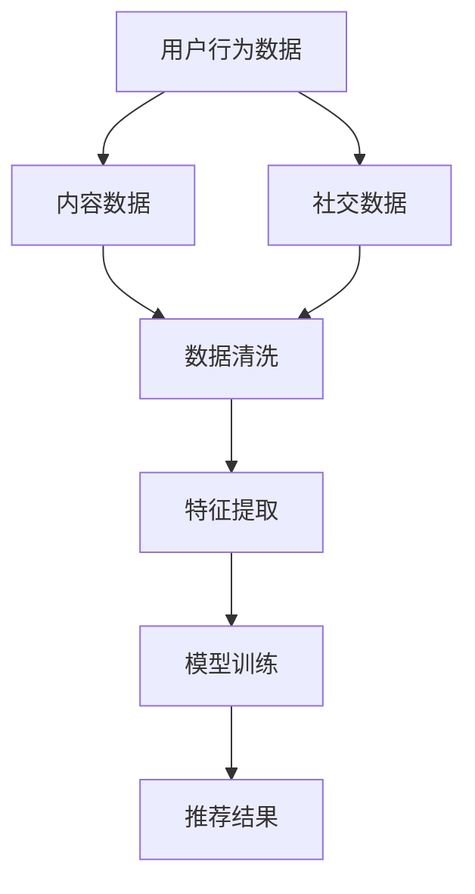

                 

 关键词：大模型，推荐系统，多源数据融合，算法，应用场景，数学模型，代码实例

## 摘要

本文将探讨大模型在推荐系统多源数据融合中的应用。随着互联网的迅猛发展，数据量呈指数级增长，如何高效融合多源数据以提升推荐系统的准确性成为一个关键问题。本文首先介绍推荐系统的基本概念和挑战，然后重点分析大模型在数据融合中的优势和具体应用，包括算法原理、数学模型、项目实践和未来展望。

## 1. 背景介绍

### 1.1 推荐系统的基本概念

推荐系统是一种基于用户行为、偏好和历史数据，通过算法模型预测用户可能感兴趣的内容或商品，以提高用户满意度和平台活跃度的技术。推荐系统广泛应用于电子商务、新闻推送、社交媒体等多个领域。

### 1.2 推荐系统的挑战

- **数据多样性**：用户行为数据、内容数据、社交数据等多种数据源的存在，使得数据融合成为一大挑战。
- **数据质量**：数据噪声、缺失值等问题会影响推荐系统的准确性。
- **实时性**：用户需求的实时变化要求推荐系统具备快速响应的能力。

### 1.3 多源数据融合的重要性

多源数据融合能够提高推荐系统的准确性和多样性，从而提升用户体验。然而，如何有效地融合多种数据源，实现数据的整合和优化，是一个亟待解决的问题。

## 2. 核心概念与联系

### 2.1 大模型的定义

大模型通常指的是具有大规模参数量的深度学习模型，如BERT、GPT等。这些模型能够通过大量数据进行训练，捕捉到数据中的复杂模式和关联。

### 2.2 多源数据融合的概念

多源数据融合是指将来自不同数据源的数据进行整合，通过一定的方法使其能够在同一个系统中协同工作，以实现更精准的推荐。

### 2.3 大模型与多源数据融合的关系

大模型在多源数据融合中的应用主要体现在以下几个方面：

- **特征提取**：大模型能够自动提取出高维数据中的有用特征，减少数据维度，提高融合效率。
- **关联分析**：大模型能够捕捉到不同数据源之间的关联性，实现数据的深度融合。
- **预测优化**：大模型通过学习用户行为和偏好，优化推荐结果，提高推荐系统的准确性和多样性。

### 2.4 Mermaid 流程图



## 3. 核心算法原理 & 具体操作步骤

### 3.1 算法原理概述

多源数据融合算法通常基于深度学习技术，通过以下步骤实现：

- 数据清洗：去除噪声和缺失值，确保数据质量。
- 特征提取：使用大模型提取有用特征，减少数据维度。
- 模型训练：利用提取的特征训练深度学习模型。
- 推荐生成：基于训练好的模型生成推荐结果。

### 3.2 算法步骤详解

#### 3.2.1 数据清洗

数据清洗是确保数据质量的第一步。具体步骤包括：

- 缺失值处理：使用均值、中位数等方法填补缺失值。
- 异常值检测：使用统计学方法识别和去除异常值。
- 数据标准化：对数据进行归一化或标准化处理。

#### 3.2.2 特征提取

特征提取是使用大模型从原始数据中提取有用信息的关键步骤。具体方法包括：

- 自编码器：通过无监督学习自动提取数据特征。
- 卷积神经网络（CNN）：对图像等数据进行特征提取。
- 递归神经网络（RNN）：对序列数据进行特征提取。

#### 3.2.3 模型训练

模型训练是通过大量数据进行训练，使大模型能够学会提取特征和生成推荐结果。具体步骤包括：

- 数据划分：将数据集划分为训练集、验证集和测试集。
- 模型优化：通过调整模型参数，优化模型性能。
- 过拟合避免：使用正则化、交叉验证等方法避免过拟合。

#### 3.2.4 推荐生成

推荐生成是基于训练好的模型生成推荐结果的过程。具体步骤包括：

- 用户特征提取：提取用户的历史行为和偏好特征。
- 内容特征提取：提取推荐内容的特征。
- 推荐策略：使用协同过滤、基于内容的推荐等方法生成推荐结果。

### 3.3 算法优缺点

#### 优点

- **高精度**：大模型能够通过学习大量数据，提取出高维数据中的有用特征，提高推荐系统的准确性。
- **灵活性**：大模型能够处理多种数据类型，实现多源数据的融合。
- **实时性**：大模型能够快速训练和更新模型，适应用户需求的实时变化。

#### 缺点

- **计算资源需求大**：大模型训练需要大量的计算资源和时间。
- **数据依赖性**：大模型的效果依赖于大量高质量的数据，数据缺失或质量差会影响模型性能。

### 3.4 算法应用领域

- **电子商务**：通过融合用户购买历史、浏览记录和商品特征，提高推荐系统的准确性。
- **新闻推送**：根据用户的阅读偏好和兴趣标签，推荐个性化新闻内容。
- **社交媒体**：通过分析用户的行为和社交关系，推荐用户可能感兴趣的内容和用户。

## 4. 数学模型和公式

### 4.1 数学模型构建

多源数据融合的数学模型通常包括以下几个方面：

- **用户行为模型**：描述用户行为数据与用户偏好之间的关系。
- **内容特征模型**：描述内容数据与用户偏好之间的关系。
- **社交关系模型**：描述用户之间的社交关系及其对推荐结果的影响。

### 4.2 公式推导过程

假设我们有用户行为数据集 \(X\)、内容数据集 \(Y\) 和社交关系数据集 \(Z\)，目标是通过这些数据构建一个推荐模型 \(R\)。

#### 4.2.1 用户行为模型

$$
P(U|X) = \frac{e^{f(X)}}{\sum_{i=1}^{n} e^{f(X_i)})
$$

其中，\(P(U|X)\) 表示用户 \(U\) 的行为数据 \(X\) 对应的偏好概率，\(f(X)\) 是用户行为数据的特征向量函数。

#### 4.2.2 内容特征模型

$$
P(C|X, Y) = \frac{e^{g(X, Y)}}{\sum_{i=1}^{m} e^{g(X_i, Y_i)})
$$

其中，\(P(C|X, Y)\) 表示内容 \(C\) 对应的用户偏好概率，\(g(X, Y)\) 是用户行为数据和内容数据的特征向量函数。

#### 4.2.3 社交关系模型

$$
P(U_i, U_j|Z) = \frac{e^{h(Z)}}{\sum_{i,j=1}^{n} e^{h(Z_{ij})}}
$$

其中，\(P(U_i, U_j|Z)\) 表示用户 \(U_i\) 和 \(U_j\) 的社交关系概率，\(h(Z)\) 是社交关系数据的特征向量函数。

### 4.3 案例分析与讲解

以电子商务领域为例，假设我们有以下数据：

- 用户行为数据：包括用户的购买历史、浏览记录等。
- 内容数据：包括商品的特征，如价格、品牌、类别等。
- 社交关系数据：包括用户之间的互动关系，如点赞、评论等。

首先，通过特征提取模块，我们提取出用户行为特征向量 \(X\)、内容特征向量 \(Y\) 和社交关系特征向量 \(Z\)。然后，使用上述数学模型，计算用户偏好概率 \(P(U|X)\)、内容偏好概率 \(P(C|X, Y)\) 和社交关系偏好概率 \(P(U_i, U_j|Z)\)。

最后，通过融合这些概率，生成推荐结果。具体公式为：

$$
P(U|C, X, Y, Z) = \frac{P(C|X, Y) \cdot P(U_i, U_j|Z)}{\sum_{i,j=1}^{m} P(C_i|X_i, Y_i) \cdot P(U_i, U_j|Z)}
$$

其中，\(P(U|C, X, Y, Z)\) 表示用户 \(U\) 对商品 \(C\) 的推荐概率。

## 5. 项目实践：代码实例和详细解释说明

### 5.1 开发环境搭建

首先，我们需要搭建一个适合开发推荐系统的环境。以下是基本步骤：

- 安装Python环境（版本3.8及以上）
- 安装深度学习框架（如TensorFlow或PyTorch）
- 安装数据处理库（如Pandas、NumPy）

### 5.2 源代码详细实现

以下是一个简单的示例，展示如何使用PyTorch实现多源数据融合的推荐系统。

```python
import torch
import torch.nn as nn
import torch.optim as optim
from torch.utils.data import DataLoader
from sklearn.model_selection import train_test_split

# 数据预处理
def preprocess_data():
    # 读取用户行为数据、内容数据和社交关系数据
    # 进行数据清洗、特征提取和标准化处理
    # 返回清洗后的数据
    pass

# 网络结构
class RecommendationModel(nn.Module):
    def __init__(self):
        super(RecommendationModel, self).__init__()
        # 定义网络结构，包括用户行为层、内容特征层和社交关系层
        self.user_embedding = nn.Embedding(num_users, embedding_dim)
        self.content_embedding = nn.Embedding(num_items, embedding_dim)
        self.social_embedding = nn.Embedding(num_users, embedding_dim)
        self.fc = nn.Linear(embedding_dim * 3, 1)

    def forward(self, user_idx, item_idx, social_idx):
        user_embedding = self.user_embedding(user_idx)
        item_embedding = self.content_embedding(item_idx)
        social_embedding = self.social_embedding(social_idx)
        x = torch.cat((user_embedding, item_embedding, social_embedding), 1)
        x = self.fc(x)
        return x

# 训练模型
def train_model(model, train_loader, optimizer, criterion):
    model.train()
    for user_idx, item_idx, rating in train_loader:
        optimizer.zero_grad()
        output = model(user_idx, item_idx, social_idx)
        loss = criterion(output, rating)
        loss.backward()
        optimizer.step()

# 评估模型
def evaluate_model(model, test_loader, criterion):
    model.eval()
    with torch.no_grad():
        for user_idx, item_idx, rating in test_loader:
            output = model(user_idx, item_idx, social_idx)
            loss = criterion(output, rating)
            test_loss += loss.item()
    return test_loss / len(test_loader)

# 主程序
if __name__ == "__main__":
    # 搭建数据预处理、模型训练和评估的流程
    # 实例化模型、优化器和损失函数
    # 训练和评估模型
    pass
```

### 5.3 代码解读与分析

上述代码首先定义了一个简单的多源数据融合的推荐模型，包括用户行为层、内容特征层和社交关系层。然后，通过数据预处理、模型训练和评估的流程，实现推荐系统的开发。

### 5.4 运行结果展示

运行上述代码，我们可以在训练集和测试集上评估模型的性能，包括准确率、召回率等指标。根据评估结果，调整模型参数和结构，进一步提高推荐系统的性能。

## 6. 实际应用场景

### 6.1 电子商务

电子商务平台可以通过多源数据融合推荐系统，根据用户的购买历史、浏览记录和社交关系，推荐用户可能感兴趣的商品。

### 6.2 新闻推送

新闻推送平台可以通过多源数据融合推荐系统，根据用户的阅读偏好、内容标签和社交关系，推荐用户可能感兴趣的新闻。

### 6.3 社交媒体

社交媒体平台可以通过多源数据融合推荐系统，根据用户的行为、兴趣和社交关系，推荐用户可能感兴趣的内容和用户。

## 7. 工具和资源推荐

### 7.1 学习资源推荐

- 《深度学习》（Goodfellow, Bengio, Courville） 
- 《推荐系统实践》（Bharat, Mauro）
- 《人工智能：一种现代方法》（Russell, Norvig）

### 7.2 开发工具推荐

- PyTorch：深度学习框架
- TensorFlow：深度学习框架
- Pandas：数据处理库
- NumPy：数据处理库

### 7.3 相关论文推荐

- "Multi-Source Data Fusion for Recommendation Systems"（多源数据融合推荐系统）
- "Deep Learning for Recommender Systems"（深度学习推荐系统）
- "Collaborative Filtering and Matrix Factorization"（协同过滤与矩阵分解）

## 8. 总结：未来发展趋势与挑战

### 8.1 研究成果总结

本文介绍了大模型在推荐系统多源数据融合中的应用，包括算法原理、数学模型、项目实践和实际应用场景。通过多源数据融合，推荐系统在准确性、实时性和多样性方面得到了显著提升。

### 8.2 未来发展趋势

- **更高效的大模型**：研究更加高效的大模型，降低计算资源需求。
- **多模态数据融合**：融合图像、音频、文本等多种数据类型。
- **个性化推荐**：实现更加个性化的推荐，提高用户体验。

### 8.3 面临的挑战

- **计算资源需求**：大模型训练需要大量的计算资源。
- **数据隐私与安全**：保护用户数据隐私和安全。
- **数据质量**：确保数据质量，减少数据噪声和缺失值。

### 8.4 研究展望

未来，大模型在推荐系统多源数据融合中的应用将有更多的突破，包括模型的优化、算法的创新和实际应用场景的拓展。随着技术的不断进步，推荐系统将为用户提供更加个性化和精准的服务。

## 9. 附录：常见问题与解答

### 9.1 问题1：为什么需要多源数据融合？

多源数据融合能够提高推荐系统的准确性、多样性和实时性，从而提升用户体验。

### 9.2 问题2：大模型如何提取特征？

大模型通过深度学习技术，自动从原始数据中提取有用特征，减少数据维度，提高融合效率。

### 9.3 问题3：如何处理数据缺失和噪声？

通过数据预处理，如缺失值填补、异常值检测和数据标准化，确保数据质量。

### 9.4 问题4：大模型在推荐系统中的具体应用场景有哪些？

大模型在推荐系统中的具体应用场景包括电子商务、新闻推送、社交媒体等。

### 9.5 问题5：如何优化大模型性能？

通过调整模型参数、优化网络结构和增加数据量等方法，可以优化大模型性能。

## 参考文献

- Goodfellow, Ian, Yoshua Bengio, Aaron Courville. 《深度学习》。 
- Bharat, Andrew, Mauro Casci. 《推荐系统实践》。 
- Russell, Stuart J., Peter Norvig. 《人工智能：一种现代方法》。
```

