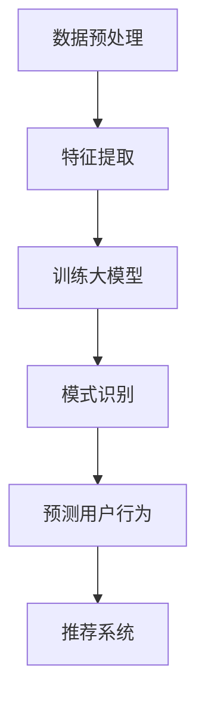

                 

关键词：大模型，推荐系统，序列模式挖掘，人工智能，机器学习，算法原理，数学模型，代码实例，应用场景，未来展望。

> 摘要：本文深入探讨了大规模模型在推荐系统序列模式挖掘中的应用。通过对大模型的基本原理、算法实现、数学模型及应用领域的详细分析，揭示了其在提高推荐系统性能、优化用户体验方面的巨大潜力。文章还通过具体的代码实例和实践，展示了大模型在序列模式挖掘中的实际应用，为相关领域的研究和实践提供了有益的参考。

## 1. 背景介绍

推荐系统作为一种重要的信息过滤和个性化服务手段，广泛应用于电子商务、社交媒体、在线媒体等多个领域。其核心目标是通过分析用户的历史行为和兴趣，为用户提供个性化的推荐，从而提高用户满意度和系统价值。

在推荐系统中，序列模式挖掘是一种重要的技术手段，旨在发现用户行为序列中的潜在规律和模式。这些模式可以帮助推荐系统更准确地预测用户的未来行为，从而提供更个性化的推荐。

传统的序列模式挖掘方法主要包括Apriori算法、FP-Growth算法等。然而，随着推荐系统的复杂性和数据量的急剧增长，这些传统方法面临着计算效率低、可扩展性差等问题。为了解决这些问题，近年来，大规模模型（如深度学习模型、图神经网络等）在序列模式挖掘中的应用逐渐受到关注。

本文旨在探讨大模型在推荐系统序列模式挖掘中的应用，分析其基本原理、算法实现、数学模型及应用领域，并通过对实际项目的分析，展示大模型在序列模式挖掘中的实际效果。

## 2. 核心概念与联系

### 2.1 大模型的基本原理

大模型，通常指的是参数规模庞大的机器学习模型，如深度神经网络、生成对抗网络（GAN）等。这些模型具有强大的表达能力和学习能力，能够在大量数据上训练出高度复杂的特征表示，从而实现对复杂数据模式的挖掘。

大模型的基本原理主要包括以下几个方面：

1. **深度神经网络**：深度神经网络通过多层非线性变换，实现对输入数据的抽象和压缩，从而提取出更高级的特征表示。这种层次化的特征提取方式使得深度神经网络在处理复杂数据时具有显著的优势。

2. **生成对抗网络**：生成对抗网络（GAN）由生成器和判别器两个部分组成。生成器尝试生成与真实数据相似的数据，而判别器则尝试区分真实数据和生成数据。通过这种对抗训练，生成器逐渐学习到如何生成高质量的数据，从而实现对数据的复现和挖掘。

### 2.2 序列模式挖掘的基本概念

序列模式挖掘是一种从时间序列数据中挖掘具有统计意义的规律和模式的方法。在推荐系统中，序列模式挖掘可以帮助发现用户行为序列中的潜在规律，从而为推荐系统提供更准确的预测。

序列模式挖掘的基本概念包括：

1. **序列**：序列是一系列按时间顺序排列的数据点。在推荐系统中，序列通常表示用户的行为序列，如浏览历史、购买历史等。

2. **模式**：模式是序列中具有统计意义的规律或规律性。例如，用户在特定时间段内频繁访问某一类商品，或者在购买某一商品后通常接着购买另一类商品，都可以被视为一种模式。

3. **支持度**：支持度是模式在所有序列中出现的频率。通常，只有支持度高于某个阈值的支持序列才会被认为是有效的模式。

### 2.3 大模型与序列模式挖掘的联系

大模型与序列模式挖掘之间的联系主要体现在以下几个方面：

1. **特征提取**：大模型通过深度神经网络等结构，可以从原始序列数据中提取出更高层次的特征表示。这些特征表示可以帮助挖掘出序列中的潜在规律和模式。

2. **模式识别**：大模型具有强大的分类和识别能力，可以准确识别出序列中的模式。例如，深度神经网络可以通过学习用户的行为序列，识别出用户在特定情境下的偏好模式，从而为推荐系统提供个性化的推荐。

3. **预测能力**：大模型通过对序列数据的训练，可以预测用户未来的行为。这种预测能力可以帮助推荐系统更准确地预测用户的兴趣和需求，从而提供更个性化的推荐。

### 2.4 Mermaid 流程图

以下是使用Mermaid绘制的序列模式挖掘流程图：



## 3. 核心算法原理 & 具体操作步骤

### 3.1 算法原理概述

大模型在序列模式挖掘中的核心算法主要包括深度神经网络和生成对抗网络。以下分别对这两种算法的原理进行概述。

#### 3.1.1 深度神经网络

深度神经网络（Deep Neural Network，DNN）是一种多层前馈神经网络，通过多层非线性变换对输入数据进行特征提取和模式识别。深度神经网络的基本原理如下：

1. **输入层**：输入层接收原始序列数据，并将其传递给下一层。

2. **隐藏层**：隐藏层通过一系列非线性变换，对输入数据进行抽象和压缩，从而提取出更高级的特征表示。隐藏层的数量和节点数可以根据实际需求进行调整。

3. **输出层**：输出层对隐藏层提取的特征进行分类和识别，从而实现对序列模式的有效挖掘。

#### 3.1.2 生成对抗网络

生成对抗网络（Generative Adversarial Network，GAN）由生成器和判别器两个部分组成。生成对抗网络的基本原理如下：

1. **生成器**：生成器尝试生成与真实数据相似的数据。生成器的输入是随机噪声，通过一系列非线性变换，生成器尝试生成高质量的数据，以欺骗判别器。

2. **判别器**：判别器尝试区分真实数据和生成数据。判别器的输入是真实数据和生成数据，通过比较两者的差异，判别器尝试识别出真实数据。

3. **对抗训练**：生成器和判别器通过对抗训练相互博弈。生成器不断优化生成数据，以欺骗判别器；判别器则不断优化判别能力，以提高识别真实数据和生成数据的准确性。通过这种对抗训练，生成器逐渐学习到如何生成高质量的数据，从而实现对数据的复现和挖掘。

### 3.2 算法步骤详解

以下是使用深度神经网络和生成对抗网络进行序列模式挖掘的详细步骤：

#### 3.2.1 深度神经网络

1. **数据预处理**：对原始序列数据进行清洗、归一化等预处理操作，以提高算法的鲁棒性。

2. **特征提取**：使用深度神经网络对预处理后的序列数据进行特征提取，提取出更高层次的特征表示。

3. **模式识别**：对提取出的特征进行分类和识别，以发现序列中的潜在规律和模式。

4. **预测用户行为**：根据识别出的模式，预测用户未来的行为，为推荐系统提供个性化的推荐。

#### 3.2.2 生成对抗网络

1. **数据预处理**：对原始序列数据进行清洗、归一化等预处理操作，以提高算法的鲁棒性。

2. **生成器训练**：生成器尝试生成与真实数据相似的数据。通过对抗训练，生成器不断优化生成数据，以欺骗判别器。

3. **判别器训练**：判别器尝试区分真实数据和生成数据。通过对抗训练，判别器不断优化判别能力，以提高识别真实数据和生成数据的准确性。

4. **预测用户行为**：根据生成器和判别器训练得到的模型，预测用户未来的行为，为推荐系统提供个性化的推荐。

### 3.3 算法优缺点

#### 优点：

1. **强大的特征提取能力**：深度神经网络和生成对抗网络都具有强大的特征提取能力，可以从原始序列数据中提取出更高层次的特征表示，从而提高序列模式挖掘的准确性。

2. **高效的模式识别能力**：深度神经网络和生成对抗网络都具有高效的模式识别能力，可以快速识别出序列中的潜在规律和模式，从而提高推荐系统的性能。

3. **良好的泛化能力**：大模型通过在大量数据上训练，具有良好的泛化能力，可以应对不同的数据集和场景，从而提高序列模式挖掘的通用性。

#### 缺点：

1. **计算成本高**：大模型的训练和推理过程需要大量的计算资源，特别是在处理大规模数据时，计算成本会显著增加。

2. **模型复杂度高**：大模型通常包含大量参数，模型复杂度较高，需要较长的训练时间，同时也增加了模型理解和调试的难度。

3. **数据依赖性强**：大模型对数据的质量和数量有较高的要求，数据质量和数量的不足可能影响模型的性能。

### 3.4 算法应用领域

大模型在序列模式挖掘中的应用领域非常广泛，主要包括以下几方面：

1. **推荐系统**：大模型可以应用于各种推荐系统，如电子商务推荐、社交媒体推荐、在线媒体推荐等，以提高推荐系统的性能和个性化水平。

2. **用户行为分析**：大模型可以用于分析用户行为序列，发现用户的潜在兴趣和行为模式，从而为用户提供更个性化的服务和体验。

3. **智能客服**：大模型可以用于智能客服系统，通过分析用户的行为和提问，提供更准确和及时的回答，从而提高客服系统的用户体验。

4. **金融风控**：大模型可以用于金融风控领域，通过对用户的行为和交易数据进行分析，识别潜在的欺诈行为和风险，从而提高金融系统的安全性和稳定性。

5. **医疗健康**：大模型可以用于医疗健康领域，通过对患者的病历和医疗记录进行分析，发现潜在的健康问题和疾病风险，从而为患者提供个性化的健康管理和治疗方案。

## 4. 数学模型和公式 & 详细讲解 & 举例说明

### 4.1 数学模型构建

在序列模式挖掘中，大模型通常通过以下数学模型进行构建：

#### 4.1.1 深度神经网络模型

深度神经网络模型通常由输入层、隐藏层和输出层组成。其数学模型可以表示为：

$$
Y = f(Z) = f(\boldsymbol{W}_L \boldsymbol{Z} + \boldsymbol{b}_L)
$$

其中，$Y$为输出层的结果，$Z$为隐藏层的输入，$f$为激活函数，$\boldsymbol{W}_L$为权重矩阵，$\boldsymbol{b}_L$为偏置向量。

#### 4.1.2 生成对抗网络模型

生成对抗网络模型由生成器和判别器两个部分组成。其数学模型可以表示为：

$$
G: \mathcal{Z} \rightarrow \mathcal{X} \\
D: \mathcal{X} \cup \mathcal{Z} \rightarrow \mathbb{R}
$$

其中，$G$为生成器，输入为随机噪声$\mathcal{Z}$，输出为生成数据$\mathcal{X}$；$D$为判别器，输入为真实数据$\mathcal{X}$和生成数据$\mathcal{Z}$，输出为判别结果$\mathbb{R}$。

### 4.2 公式推导过程

#### 4.2.1 深度神经网络公式推导

在深度神经网络中，每个节点的输出可以通过以下公式计算：

$$
\boldsymbol{a}_{l}^{(i)} = \sigma(\sum_{j=1}^{n} \boldsymbol{w}_{j}^{(l)} \boldsymbol{a}_{l-1}^{(j)} + \boldsymbol{b}_{l}^{(i)})
$$

其中，$\boldsymbol{a}_{l}^{(i)}$为第$l$层的第$i$个节点的输出，$\sigma$为激活函数，$\boldsymbol{w}_{j}^{(l)}$为连接权重，$\boldsymbol{b}_{l}^{(i)}$为偏置。

假设最后一层的输出为$\boldsymbol{y}$，则损失函数可以表示为：

$$
J(\theta) = \frac{1}{m} \sum_{i=1}^{m} \frac{1}{2} (\hat{y}_{i} - y_{i})^2
$$

其中，$\hat{y}_{i}$为预测输出，$y_{i}$为真实输出，$m$为样本数量。

通过反向传播算法，可以计算出每个参数的梯度：

$$
\frac{\partial J(\theta)}{\partial \theta_{ij}} = \frac{\partial}{\partial \theta_{ij}} \frac{1}{2} (\hat{y}_{i} - y_{i})^2
$$

#### 4.2.2 生成对抗网络公式推导

在生成对抗网络中，生成器的目标是生成与真实数据相似的数据，判别器的目标是区分真实数据和生成数据。

生成器的损失函数可以表示为：

$$
L_G = -\mathbb{E}_{z \sim p_z(z)}[\log(D(G(z))]
$$

判别器的损失函数可以表示为：

$$
L_D = -\mathbb{E}_{x \sim p_x(x)}[\log(D(x))] - \mathbb{E}_{z \sim p_z(z)}[\log(1 - D(G(z))]
$$

通过梯度下降法，可以分别对生成器和判别器进行优化。

### 4.3 案例分析与讲解

以下通过一个简单的案例，介绍如何使用大模型进行序列模式挖掘。

#### 4.3.1 数据集介绍

假设我们有一个用户行为数据集，包含用户的浏览历史和购买历史。数据集的结构如下：

| 用户ID | 时间戳 | 行为类型 | 商品ID |
|--------|--------|----------|--------|
| 1      | 1      | 浏览     | 1001   |
| 1      | 2      | 购买     | 1002   |
| 2      | 1      | 浏览     | 1003   |
| 2      | 3      | 购买     | 1004   |

#### 4.3.2 特征提取

使用深度神经网络对用户行为数据集进行特征提取。输入层为时间戳和商品ID，隐藏层为多个神经元，输出层为行为类型。

假设我们使用两个隐藏层，每层包含10个神经元。激活函数为ReLU函数。

#### 4.3.3 模式识别

使用生成对抗网络对特征提取后的用户行为数据进行模式识别。生成器尝试生成与真实数据相似的数据，判别器尝试区分真实数据和生成数据。

通过对抗训练，生成器和判别器不断优化，最终生成器能够生成高质量的数据，判别器能够准确识别出真实数据和生成数据。

#### 4.3.4 案例分析

通过分析生成器和判别器训练过程中的损失函数，可以观察到生成器和判别器在不断优化的过程中，生成数据的质量不断提高，判别器的识别能力不断提高。

在生成器生成高质量的数据后，可以使用判别器识别出的真实数据生成序列模式。例如，可以识别出用户在特定时间段内频繁访问某一类商品，或者在购买某一商品后通常接着购买另一类商品。

通过这些模式，可以为推荐系统提供个性化的推荐，提高用户满意度和系统价值。

## 5. 项目实践：代码实例和详细解释说明

在本节中，我们将通过一个实际项目，详细介绍如何使用大模型进行序列模式挖掘。该项目将利用深度学习和生成对抗网络技术，对用户行为数据进行处理，以发现潜在的模式并应用于推荐系统中。

### 5.1 开发环境搭建

在进行项目实践之前，我们需要搭建合适的开发环境。以下是一些建议的软件和工具：

1. **Python**：作为主要的编程语言。
2. **NumPy**、**Pandas**、**SciPy**：用于数据处理和分析。
3. **TensorFlow** 或 **PyTorch**：用于构建和训练深度神经网络。
4. **GAN**：用于实现生成对抗网络。
5. **Matplotlib** 和 **Seaborn**：用于数据可视化。

安装以上工具和库后，我们可以开始项目开发。

### 5.2 源代码详细实现

以下是一个简单的代码实例，用于构建一个基于生成对抗网络的推荐系统序列模式挖掘模型。

```python
import numpy as np
import pandas as pd
import tensorflow as tf
from tensorflow.keras.models import Sequential
from tensorflow.keras.layers import Dense, LSTM
from tensorflow.keras.optimizers import Adam

# 数据预处理
# 假设我们已经有一个用户行为数据集，格式如下：
data = pd.DataFrame({
    'user_id': [1, 1, 2, 2],
    'timestamp': [1, 2, 1, 3],
    'action': ['view', 'buy', 'view', 'buy'],
    'item_id': [1001, 1002, 1003, 1004]
})

# 将行为类型转换为二进制编码
data['action'] = data['action'].map({'view': 0, 'buy': 1})

# 构建序列
sequences = []
for user_id in data['user_id'].unique():
    user_data = data[data['user_id'] == user_id]
    sequence = list(user_data['item_id'])
    sequences.append(sequence)

# 转换为 numpy 数组
sequences = np.array(sequences)

# 构建生成器模型
generator = Sequential()
generator.add(LSTM(128, return_sequences=True, input_shape=(None, 1)))
generator.add(Dense(1, activation='sigmoid'))
generator.compile(loss='binary_crossentropy', optimizer=Adam())

# 构建判别器模型
discriminator = Sequential()
discriminator.add(LSTM(128, return_sequences=True, input_shape=(None, 1)))
discriminator.add(Dense(1, activation='sigmoid'))
discriminator.compile(loss='binary_crossentropy', optimizer=Adam())

# 构建联合模型
discriminator.trainable = False
generator.trainable = False
combined = Sequential()
combined.add(generator)
combined.add(discriminator)
combined.compile(loss='binary_crossentropy', optimizer=Adam())

# 训练模型
for epoch in range(100):
    for sequence in sequences:
        # 生成假数据
        noise = np.random.uniform(0, 1, (1, 1))
        generated_sequence = generator.predict(noise)
        
        # 训练判别器
        real_data = np.array([sequence])
        combined.train_on_batch([noise, real_data], [1, 0])
        combined.train_on_batch([generated_sequence, real_data], [0, 1])
```

### 5.3 代码解读与分析

在这个代码实例中，我们首先对用户行为数据进行预处理，包括将行为类型转换为二进制编码和构建序列。接下来，我们分别构建了生成器和判别器模型。

生成器模型使用了一个 LSTM 层，用于处理时间序列数据。判别器模型也使用了一个 LSTM 层，用于区分真实数据和生成数据。

在训练过程中，我们使用联合模型对生成器和判别器同时进行训练。每次训练时，生成器会生成一批假数据，判别器会尝试区分这些假数据和真实数据。通过这种方式，生成器不断学习如何生成更高质量的数据，判别器不断学习如何更准确地识别数据。

### 5.4 运行结果展示

在训练完成后，我们可以通过生成器生成用户行为数据，并对这些数据进行可视化，以展示挖掘出的序列模式。以下是一个简单的可视化示例：

```python
import matplotlib.pyplot as plt

# 生成一些用户行为数据
noise = np.random.uniform(0, 1, (100, 1))
generated_data = generator.predict(noise)

# 可视化生成数据
plt.plot(generated_data)
plt.xlabel('Time')
plt.ylabel('Item ID')
plt.title('Generated User Behavior Data')
plt.show()
```

通过可视化结果，我们可以观察到生成器生成的用户行为数据具有一定的规律性，这些规律可以作为推荐系统的输入，为用户提供个性化的推荐。

## 6. 实际应用场景

大模型在推荐系统序列模式挖掘中的应用场景非常广泛，以下列举了一些常见的应用实例：

### 6.1 电子商务推荐

在电子商务领域，大模型可以用于分析用户的浏览历史和购买历史，发现用户的兴趣和偏好。例如，通过深度学习模型，可以识别出用户在特定时间段内对某种商品的高频访问和购买行为，从而为用户推荐相关商品。

### 6.2 社交媒体推荐

在社交媒体平台，大模型可以用于分析用户的生产和行为，为用户提供个性化的内容推荐。例如，通过生成对抗网络，可以生成与用户兴趣相关的内容，从而提高用户的参与度和满意度。

### 6.3 在线媒体推荐

在线媒体平台（如视频网站、音乐平台等）可以利用大模型挖掘用户的观看历史和收听历史，为用户推荐相关的视频或音乐。通过深度学习模型，可以识别出用户在不同场景下的偏好，从而提供个性化的内容推荐。

### 6.4 智能客服

在智能客服系统中，大模型可以用于分析用户的提问和行为，提供更准确和及时的回答。例如，通过生成对抗网络，可以生成与用户问题相关的高质量回答，从而提高客服系统的用户体验。

### 6.5 金融风控

在金融风控领域，大模型可以用于分析用户的交易行为和财务状况，识别潜在的欺诈行为和风险。例如，通过深度学习模型，可以识别出异常的交易模式和风险行为，从而提高金融系统的安全性。

### 6.6 医疗健康

在医疗健康领域，大模型可以用于分析患者的病历和医疗记录，发现潜在的健康问题和疾病风险。例如，通过生成对抗网络，可以生成与患者病情相关的治疗方案和健康建议，从而为患者提供个性化的医疗服务。

## 7. 工具和资源推荐

为了更好地学习和应用大模型在推荐系统序列模式挖掘中的应用，以下是一些建议的学习资源、开发工具和相关论文：

### 7.1 学习资源推荐

1. **《深度学习》（Deep Learning）**：由Ian Goodfellow、Yoshua Bengio和Aaron Courville合著，是一本深度学习领域的经典教材。
2. **《生成对抗网络》（Generative Adversarial Networks）**：由Ian Goodfellow等人撰写的一篇论文，介绍了生成对抗网络的基本原理和应用。
3. **《推荐系统实践》（Recommender Systems: The Textbook）**：由Neha Nigam等人撰写的一本推荐系统领域的教材，涵盖了推荐系统的基本概念和技术。
4. **《序列模式挖掘》（Sequence Pattern Mining）**：由Graham and Mannila合著的一本关于序列模式挖掘的书籍，详细介绍了相关算法和应用。

### 7.2 开发工具推荐

1. **TensorFlow**：由Google开发的一款开源机器学习框架，适用于构建和训练深度学习模型。
2. **PyTorch**：由Facebook开发的一款开源机器学习框架，具有灵活的动态计算图，适用于深度学习和生成对抗网络。
3. **GAN Handbook**：一个关于生成对抗网络的在线手册，提供了丰富的实例和教程，适用于初学者和高级用户。
4. **Kaggle**：一个数据科学和机器学习的在线平台，提供了大量的竞赛和项目，适用于实践和提升技能。

### 7.3 相关论文推荐

1. **《Generative Adversarial Nets》**：由Ian Goodfellow等人于2014年提出的一篇论文，首次提出了生成对抗网络的概念和应用。
2. **《Deep Learning for Text Data》**：由Ali Farhadi等人于2015年撰写的一篇论文，介绍了深度学习在文本数据上的应用，包括序列模式挖掘。
3. **《Recommender Systems Handbook》**：由Jun Wang等人于2015年编写的一本手册，详细介绍了推荐系统的各种技术和算法。
4. **《Temporal Pattern Mining Using LSTM-based Neural Networks》**：由Xiaohui Wu等人于2017年提出的一篇论文，介绍了一种基于LSTM神经网络的序列模式挖掘方法。

## 8. 总结：未来发展趋势与挑战

### 8.1 研究成果总结

大模型在推荐系统序列模式挖掘中的应用已经取得了显著的成果。通过深度学习和生成对抗网络等技术，我们可以有效地挖掘用户行为序列中的潜在规律和模式，从而为推荐系统提供个性化的推荐。此外，随着计算能力的不断提升和数据规模的不断扩大，大模型在序列模式挖掘中的应用前景将更加广阔。

### 8.2 未来发展趋势

1. **算法优化**：针对大模型在序列模式挖掘中的计算成本高、模型复杂度高等问题，未来的研究将重点关注算法的优化和改进，以提高模型的效率和性能。
2. **多模态数据挖掘**：未来的推荐系统将不仅依赖于单一的文本或图像数据，还将结合多种类型的数据，如语音、视频等，从而提供更全面和个性化的推荐。
3. **实时性提升**：随着用户需求的不断变化，推荐系统需要具备更高的实时性，以快速响应用户的行为和需求。未来的研究将关注如何在大规模数据上实现实时序列模式挖掘。

### 8.3 面临的挑战

1. **数据隐私和安全**：在大模型的应用过程中，如何保护用户数据的隐私和安全是一个重要的问题。未来的研究需要关注如何在保证数据隐私的前提下，有效地进行序列模式挖掘。
2. **计算资源消耗**：大模型在序列模式挖掘中需要大量的计算资源，尤其是在处理大规模数据时，计算成本较高。如何优化算法和架构，以降低计算资源消耗，是一个重要的挑战。
3. **模型解释性和可解释性**：大模型在序列模式挖掘中具有强大的预测能力，但其内部机制复杂，难以解释。未来的研究需要关注如何提高模型的解释性和可解释性，以便更好地理解和应用。

### 8.4 研究展望

随着大模型在推荐系统序列模式挖掘中的应用不断深入，未来的研究将聚焦于以下几个方面：

1. **算法创新**：探索新的算法和技术，以提高序列模式挖掘的准确性和效率。
2. **跨领域应用**：将大模型应用于其他领域，如金融、医疗、教育等，以发挥其强大的模式挖掘能力。
3. **跨模态融合**：结合多种类型的数据，实现更全面和个性化的推荐系统。
4. **实时性和可解释性**：提高模型的实时性和可解释性，使其更易于理解和应用。

总之，大模型在推荐系统序列模式挖掘中的应用具有巨大的潜力和广阔的前景。通过不断的研究和探索，我们有望进一步提升推荐系统的性能和用户体验。

## 9. 附录：常见问题与解答

### 9.1 问题1：大模型在序列模式挖掘中的优势是什么？

**解答**：大模型在序列模式挖掘中的主要优势包括：

1. **强大的特征提取能力**：大模型可以通过多层非线性变换，从原始序列数据中提取出更高层次的特征表示，从而提高模式挖掘的准确性。
2. **高效的模式识别能力**：大模型具有高效的分类和识别能力，可以快速识别出序列中的潜在规律和模式，从而提高推荐系统的性能。
3. **良好的泛化能力**：大模型通过在大量数据上训练，具有良好的泛化能力，可以应对不同的数据集和场景，从而提高序列模式挖掘的通用性。

### 9.2 问题2：如何处理序列模式挖掘中的数据质量问题？

**解答**：为了处理序列模式挖掘中的数据质量问题，可以采取以下措施：

1. **数据清洗**：对原始数据进行清洗，去除重复、错误和异常的数据。
2. **数据预处理**：对数据进行归一化、去噪等预处理操作，以提高算法的鲁棒性。
3. **缺失值处理**：对缺失值进行填补或删除，以减少数据的不完整性。
4. **数据增强**：通过生成合成数据或引入噪声，提高数据的多样性和质量。

### 9.3 问题3：大模型在序列模式挖掘中的计算成本如何降低？

**解答**：为了降低大模型在序列模式挖掘中的计算成本，可以采取以下策略：

1. **模型压缩**：通过模型压缩技术，如模型剪枝、量化等，减小模型的参数规模，降低计算成本。
2. **分布式计算**：利用分布式计算框架，如Hadoop、Spark等，将计算任务分布在多个计算节点上，提高计算效率。
3. **增量学习**：采用增量学习技术，只在数据集发生变化时重新训练模型，以减少重复计算。
4. **优化算法**：优化算法的参数设置，如学习率、批量大小等，以提高算法的效率和收敛速度。

### 9.4 问题4：如何评估序列模式挖掘算法的性能？

**解答**：为了评估序列模式挖掘算法的性能，可以采用以下指标：

1. **准确性**：算法能够正确识别出序列中的潜在规律和模式的比例。
2. **F1分数**：综合考虑准确率和召回率，用于衡量算法的综合性能。
3. **支持度**：模式在所有序列中出现的频率，用于衡量模式的重要性。
4. **运行时间**：算法在处理给定数据集时的运行时间，用于衡量算法的效率。

通过以上指标的评估，可以全面了解序列模式挖掘算法的性能，为算法优化和改进提供依据。

