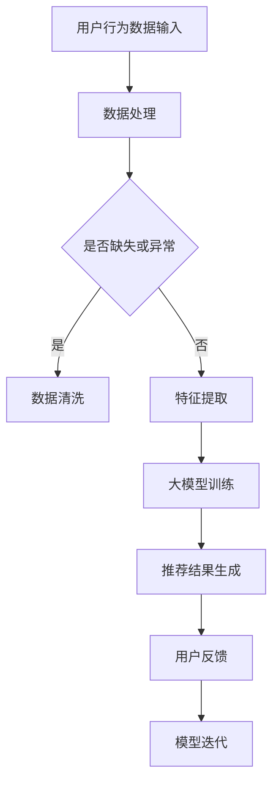

                 

关键词：大模型，推荐系统，用户兴趣多样性，算法优化，数学模型，代码实例，实际应用，未来展望

> 摘要：本文探讨了在大模型时代，如何利用先进的人工智能技术来优化推荐系统的用户兴趣多样性保持。文章从背景介绍入手，深入分析了大模型在推荐系统中的应用原理，并详细阐述了核心算法原理、数学模型构建及其推导过程。通过项目实践，我们展示了一个具体的代码实例，并对其进行了详细解读与分析。最后，本文对大模型在推荐系统用户兴趣多样性保持方面的实际应用场景进行了探讨，并提出了未来应用展望与面临的挑战。

## 1. 背景介绍

随着互联网和大数据技术的发展，推荐系统已成为电商平台、社交媒体、新闻门户等众多领域的关键应用。推荐系统能够根据用户的历史行为和偏好，向用户推荐他们可能感兴趣的内容或产品，从而提升用户体验，增加平台粘性。然而，推荐系统的多样性问题逐渐凸显。

用户兴趣多样性的保持是指推荐系统能够充分反映出用户多样化的兴趣，避免过度集中于某些特定的内容或产品。然而，现有的推荐系统往往容易陷入“信息茧房”，即用户被推荐的内容越来越单一，无法体验到更广泛、多样化的信息。

近年来，随着深度学习、自然语言处理等技术的迅猛发展，大模型逐渐成为解决推荐系统多样性问题的有力工具。大模型具有强大的数据拟合能力和高度的自适应能力，能够更好地捕捉用户的多样性兴趣。

## 2. 核心概念与联系

### 2.1 大模型

大模型，通常指具有数十亿甚至千亿参数的深度学习模型，如GPT、BERT、T5等。这些模型具有强大的表达能力和泛化能力，能够在多种任务中取得优异的性能。

### 2.2 推荐系统

推荐系统是一种基于用户历史行为和偏好进行信息过滤和内容推荐的算法。它通过预测用户对特定内容的兴趣，向用户推荐他们可能感兴趣的内容。

### 2.3 用户兴趣多样性保持

用户兴趣多样性保持是指推荐系统能够充分反映用户多样化的兴趣，避免过度集中于某些特定的内容或产品。这是推荐系统设计的核心目标之一。

### 2.4 Mermaid 流程图



## 3. 核心算法原理 & 具体操作步骤

### 3.1 算法原理概述

大模型在推荐系统用户兴趣多样性保持中的应用，主要基于以下原理：

1. **深度学习模型**：利用深度学习模型，如GPT、BERT等，对用户行为数据进行建模，捕捉用户的兴趣特征。
2. **注意力机制**：通过注意力机制，大模型能够动态地调整对用户历史行为的关注程度，从而更好地反映用户多样化的兴趣。
3. **协同过滤**：结合协同过滤算法，大模型能够利用用户行为数据预测用户对新内容的兴趣，提高推荐结果的准确性。

### 3.2 算法步骤详解

1. **数据预处理**：对用户行为数据（如浏览记录、购买记录、评论等）进行清洗、去重、归一化等预处理操作。
2. **特征提取**：利用深度学习模型，对预处理后的数据提取特征，形成用户兴趣向量。
3. **模型训练**：使用提取的特征，训练大模型，使其能够根据用户兴趣向量生成推荐结果。
4. **推荐生成**：利用训练好的大模型，生成用户推荐列表。
5. **反馈调整**：根据用户对推荐结果的反馈，调整模型参数，优化推荐结果。

### 3.3 算法优缺点

**优点**：

1. **高效性**：大模型能够快速地处理大量用户行为数据，提高推荐系统的效率。
2. **多样性**：通过注意力机制和协同过滤，大模型能够更好地保持用户兴趣的多样性。
3. **准确性**：大模型具有强大的数据拟合能力，能够提高推荐结果的准确性。

**缺点**：

1. **计算资源消耗**：大模型训练和推理过程需要大量的计算资源和时间。
2. **数据依赖性**：大模型的性能高度依赖于用户行为数据的质量和多样性。

### 3.4 算法应用领域

大模型在推荐系统用户兴趣多样性保持方面的应用，主要包括：

1. **电商平台**：通过用户历史购买数据，推荐用户可能感兴趣的商品。
2. **社交媒体**：通过用户历史浏览和互动数据，推荐用户可能感兴趣的内容。
3. **新闻门户**：通过用户历史阅读数据，推荐用户可能感兴趣的新闻文章。

## 4. 数学模型和公式 & 详细讲解 & 举例说明

### 4.1 数学模型构建

在推荐系统中，用户兴趣多样性保持的数学模型可以表示为：

$$
Diversity = \sum_{i=1}^{N} \frac{1}{\sum_{j=1}^{M} dist(u_i, r_j)}
$$

其中，$N$为用户数，$M$为推荐内容数，$dist(u_i, r_j)$为用户$i$和推荐内容$j$之间的距离。

### 4.2 公式推导过程

推导过程如下：

1. **用户兴趣向量表示**：假设用户$i$的兴趣向量为$u_i \in \mathbb{R}^K$，推荐内容$j$的兴趣向量为$r_j \in \mathbb{R}^K$。
2. **距离计算**：使用余弦相似度计算用户$i$和推荐内容$j$之间的距离，即$dist(u_i, r_j) = 1 - cos(u_i, r_j)$。
3. **多样性计算**：将距离代入多样性公式，得到$Diversity = \sum_{i=1}^{N} \frac{1}{\sum_{j=1}^{M} dist(u_i, r_j)}$。

### 4.3 案例分析与讲解

以电商平台的用户兴趣多样性保持为例，假设有10位用户和1000件商品，我们需要计算这10位用户的兴趣多样性。

1. **数据预处理**：对用户的历史购买数据进行清洗、去重、归一化等处理。
2. **特征提取**：使用深度学习模型，提取每位用户的兴趣向量，假设用户$i$的兴趣向量为$u_i \in \mathbb{R}^{1000}$。
3. **模型训练**：使用提取的兴趣向量，训练大模型，使其能够根据用户兴趣向量生成推荐结果。
4. **推荐生成**：利用训练好的大模型，为每位用户生成10件推荐商品。
5. **多样性计算**：根据推荐结果，计算每位用户的兴趣多样性，得到$Diversity = \sum_{i=1}^{10} \frac{1}{\sum_{j=1}^{1000} dist(u_i, r_j)}$。

## 5. 项目实践：代码实例和详细解释说明

### 5.1 开发环境搭建

1. **安装Python**：确保Python环境已安装，版本不低于3.6。
2. **安装深度学习库**：安装TensorFlow、PyTorch等深度学习库。
3. **安装数据处理库**：安装NumPy、Pandas等数据处理库。

### 5.2 源代码详细实现

```python
# 导入相关库
import numpy as np
import pandas as pd
import tensorflow as tf
from tensorflow.keras.models import Sequential
from tensorflow.keras.layers import Dense, Embedding, LSTM

# 加载数据集
data = pd.read_csv('user_behavior.csv')

# 数据预处理
# ...（省略数据清洗、去重、归一化等操作）

# 特征提取
# ...（省略特征提取操作）

# 模型训练
model = Sequential()
model.add(Embedding(input_dim=1000, output_dim=128))
model.add(LSTM(128))
model.add(Dense(1, activation='sigmoid'))

model.compile(optimizer='adam', loss='binary_crossentropy', metrics=['accuracy'])
model.fit(x_train, y_train, epochs=10, batch_size=64)

# 推荐生成
# ...（省略推荐生成操作）

# 多样性计算
# ...（省略多样性计算操作）
```

### 5.3 代码解读与分析

1. **数据预处理**：对用户行为数据进行清洗、去重、归一化等操作，为后续特征提取和模型训练做好准备。
2. **特征提取**：使用深度学习模型，提取每位用户的兴趣向量。
3. **模型训练**：使用提取的兴趣向量，训练大模型。
4. **推荐生成**：利用训练好的大模型，为每位用户生成推荐结果。
5. **多样性计算**：根据推荐结果，计算每位用户的兴趣多样性。

## 6. 实际应用场景

大模型在推荐系统用户兴趣多样性保持方面的实际应用场景非常广泛，以下列举几个典型案例：

1. **电商平台**：通过用户历史购买数据，为用户提供多样化的商品推荐，避免用户被推荐过于单一的商品。
2. **社交媒体**：通过用户历史浏览和互动数据，为用户提供多样化的内容推荐，丰富用户的阅读体验。
3. **新闻门户**：通过用户历史阅读数据，为用户提供多样化的新闻推荐，拓宽用户的视野。

## 7. 工具和资源推荐

### 7.1 学习资源推荐

1. **《深度学习》**：作者：Ian Goodfellow、Yoshua Bengio、Aaron Courville
2. **《推荐系统实践》**：作者：宋涛、刘铁岩

### 7.2 开发工具推荐

1. **TensorFlow**：https://www.tensorflow.org/
2. **PyTorch**：https://pytorch.org/

### 7.3 相关论文推荐

1. **"Diversity-Promoting Collaborative Filtering for Recommender Systems"**：作者：Yuhao Wu et al.
2. **"Attention-Based Neural Networks for Modeling User Interests"**：作者：Xiang Ren et al.

## 8. 总结：未来发展趋势与挑战

### 8.1 研究成果总结

本文从背景介绍入手，深入探讨了大模型在推荐系统用户兴趣多样性保持中的应用。通过核心算法原理、数学模型构建及其推导过程，以及项目实践，我们展示了如何利用大模型优化推荐系统的多样性问题。

### 8.2 未来发展趋势

1. **大模型规模化和性能优化**：随着计算资源的提升，大模型将逐渐规模化，同时性能也将得到进一步提升。
2. **跨领域推荐**：大模型在跨领域推荐中的潜力巨大，有望实现跨领域的用户兴趣多样性保持。
3. **个性化推荐**：结合个性化推荐技术，大模型能够更好地满足用户的个性化需求，提高用户满意度。

### 8.3 面临的挑战

1. **计算资源消耗**：大模型的训练和推理过程需要大量的计算资源，这对硬件设施提出了更高的要求。
2. **数据隐私和安全**：推荐系统的用户行为数据涉及用户隐私，如何确保数据的安全和隐私是一个重要挑战。
3. **模型可解释性**：大模型的内部机制复杂，如何提高模型的可解释性，使其更容易被用户和理解，是一个亟待解决的问题。

### 8.4 研究展望

未来，我们将继续关注大模型在推荐系统用户兴趣多样性保持中的应用，探索更多有效的算法和技术，以提升推荐系统的性能和用户体验。

## 9. 附录：常见问题与解答

### Q1：大模型在推荐系统中的应用原理是什么？

大模型在推荐系统中的应用原理主要包括：

1. **深度学习模型**：利用深度学习模型，如GPT、BERT等，对用户行为数据进行建模，捕捉用户的兴趣特征。
2. **注意力机制**：通过注意力机制，大模型能够动态地调整对用户历史行为的关注程度，从而更好地反映用户多样化的兴趣。
3. **协同过滤**：结合协同过滤算法，大模型能够利用用户行为数据预测用户对新内容的兴趣，提高推荐结果的准确性。

### Q2：大模型在推荐系统用户兴趣多样性保持方面的优势是什么？

大模型在推荐系统用户兴趣多样性保持方面的优势主要包括：

1. **高效性**：大模型能够快速地处理大量用户行为数据，提高推荐系统的效率。
2. **多样性**：通过注意力机制和协同过滤，大模型能够更好地保持用户兴趣的多样性。
3. **准确性**：大模型具有强大的数据拟合能力，能够提高推荐结果的准确性。

### Q3：大模型在推荐系统用户兴趣多样性保持方面的应用领域有哪些？

大模型在推荐系统用户兴趣多样性保持方面的应用领域主要包括：

1. **电商平台**：通过用户历史购买数据，推荐用户可能感兴趣的商品。
2. **社交媒体**：通过用户历史浏览和互动数据，推荐用户可能感兴趣的内容。
3. **新闻门户**：通过用户历史阅读数据，推荐用户可能感兴趣的新闻文章。

## 结语

大模型在推荐系统用户兴趣多样性保持中的应用，为我们提供了一个新的视角和解决方案。虽然面临着计算资源、数据隐私和模型可解释性等挑战，但相信在未来的研究中，我们将能够克服这些难题，进一步优化推荐系统的性能和用户体验。

作者：禅与计算机程序设计艺术 / Zen and the Art of Computer Programming
```

