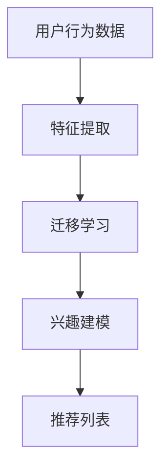
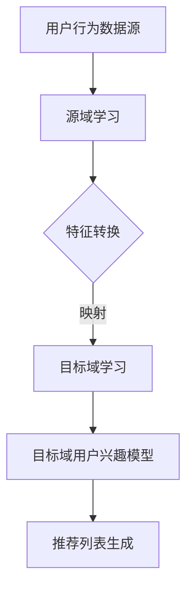

                 

摘要：本文探讨了如何利用大模型技术，实现推荐系统中的用户兴趣迁移学习。首先，介绍了推荐系统的基本概念和用户兴趣迁移学习的背景。然后，深入解析了核心算法原理和具体操作步骤，包括大模型在迁移学习中的应用。此外，本文还通过数学模型和公式的推导，对算法进行了详细讲解，并进行了案例分析。接着，展示了项目实践中的代码实例和详细解释，最后讨论了算法在实际应用场景中的效果和未来展望。本文旨在为推荐系统领域的研究者和开发者提供有价值的参考。

## 1. 背景介绍

推荐系统是信息过滤和搜索技术的一个重要分支，其主要目标是根据用户的历史行为、兴趣和偏好，向用户推荐可能感兴趣的内容。推荐系统广泛应用于电子商务、社交媒体、新闻推送等领域，已经成为现代信息社会中不可或缺的一部分。

用户兴趣迁移学习是推荐系统中的一个重要研究方向。随着用户数据的爆炸性增长，传统的基于用户历史数据的推荐方法越来越难以满足个性化推荐的需求。用户兴趣迁移学习通过学习用户在不同情境下的兴趣差异，实现了跨域的推荐。这种方法可以有效地提高推荐系统的准确性和适应性，降低对新用户的数据依赖。

近年来，随着深度学习和大数据技术的发展，大模型在推荐系统中的应用变得越来越广泛。大模型（如深度神经网络）具有强大的表达能力和学习能力，可以在海量数据上进行训练，提取出用户兴趣的深层次特征。本文将探讨如何利用大模型技术，实现推荐系统中的用户兴趣迁移学习。

## 2. 核心概念与联系

为了更好地理解大模型在推荐系统用户兴趣迁移学习中的应用，我们需要先介绍几个核心概念，包括推荐系统、用户兴趣、迁移学习以及大模型。

### 推荐系统

推荐系统是一种信息过滤技术，旨在根据用户的历史行为和偏好，向用户推荐可能感兴趣的内容。推荐系统可以分为基于内容的推荐、协同过滤推荐和混合推荐等类型。

- **基于内容的推荐**：根据用户对内容的兴趣特征，推荐具有相似特征的内容。
- **协同过滤推荐**：通过分析用户之间的相似性，推荐其他用户喜欢的内容。
- **混合推荐**：结合多种推荐方法，提高推荐的准确性。

### 用户兴趣

用户兴趣是指用户对特定内容的偏好或喜好。用户兴趣可以通过用户的历史行为数据（如浏览、购买、评分等）来表示和挖掘。

### 迁移学习

迁移学习是指将一个任务在学习到的知识应用于其他任务的过程。在推荐系统中，迁移学习可以通过学习一个领域（源域）的用户兴趣，迁移到另一个领域（目标域），从而提高推荐系统的适应性和准确性。

### 大模型

大模型是指具有海量参数和强大表达能力的深度学习模型。大模型通常通过在大量数据上进行训练，学习到数据的复杂结构和潜在特征。在大模型中，深度神经网络是一种常见的架构，其具有良好的层次化表示能力。

### 大模型与推荐系统的联系

大模型在推荐系统中的应用主要体现在以下几个方面：

1. **特征提取**：大模型可以从用户行为数据中提取出深层次的兴趣特征，提高推荐系统的准确性。
2. **迁移学习**：大模型可以通过迁移学习，将一个领域的知识迁移到另一个领域，提高跨域推荐的性能。
3. **个性化推荐**：大模型可以根据用户的历史行为和兴趣，生成个性化的推荐列表。

### Mermaid 流程图

下面是一个简化的 Mermaid 流程图，展示了大模型在推荐系统用户兴趣迁移学习中的应用流程。



### 用户兴趣迁移学习框架

用户兴趣迁移学习框架通常包括以下几个关键组件：

1. **源域学习**：在源域上训练一个迁移学习模型，学习到用户兴趣的通用特征。
2. **特征转换**：将源域的特征映射到目标域，使得模型可以在目标域上进行训练。
3. **目标域学习**：在目标域上训练一个迁移学习模型，优化模型在目标域上的性能。
4. **推荐生成**：利用迁移学习模型生成目标域的用户兴趣模型，并生成推荐列表。

### Mermaid 流程图

下面是一个更详细的 Mermaid 流程图，展示了用户兴趣迁移学习的完整框架。



通过这个流程图，我们可以清晰地看到用户兴趣迁移学习的步骤和关键组件。接下来，我们将深入探讨大模型在用户兴趣迁移学习中的具体应用。

## 3. 核心算法原理 & 具体操作步骤

### 3.1 算法原理概述

用户兴趣迁移学习的核心算法通常是基于深度神经网络的迁移学习模型。这种模型通过在源域和目标域上分别训练，学习到用户兴趣的通用特征，并将其迁移到目标域，从而提高推荐系统的准确性。

具体来说，用户兴趣迁移学习模型可以分为以下几个步骤：

1. **源域学习**：在源域上收集用户行为数据，并利用深度神经网络提取用户兴趣特征。
2. **特征转换**：将源域的特征映射到目标域，使得模型可以在目标域上进行训练。
3. **目标域学习**：在目标域上利用迁移学习的特征，训练一个目标域的推荐模型。
4. **推荐生成**：利用目标域的推荐模型生成推荐列表，向用户推荐感兴趣的内容。

### 3.2 算法步骤详解

#### 3.2.1 源域学习

在源域学习阶段，我们首先收集源域的用户行为数据，如浏览记录、购买历史和评分数据等。然后，利用深度神经网络对这些数据进行分析，提取出用户兴趣的深层次特征。这一步骤通常包括以下几个步骤：

1. **数据预处理**：对源域数据进行清洗、归一化和去噪等处理，提高数据质量。
2. **特征提取**：利用卷积神经网络（CNN）或循环神经网络（RNN）提取用户行为数据中的特征。
3. **特征融合**：将不同类型的用户行为数据（如文本、图像和音频等）进行融合，生成一个统一的特征表示。

#### 3.2.2 特征转换

特征转换是用户兴趣迁移学习的关键步骤，其目的是将源域的特征映射到目标域。这一步骤可以通过以下方法实现：

1. **特征映射**：利用源域和目标域的用户行为数据，学习一个特征映射函数，将源域的特征映射到目标域。
2. **特征调整**：通过调整源域特征的权重或激活函数，使得源域特征更适应目标域。
3. **特征嵌入**：利用嵌入技术将源域和目标域的特征表示为低维向量，提高特征的可解释性。

#### 3.2.3 目标域学习

在目标域学习阶段，我们利用迁移学习的特征，在目标域上训练一个推荐模型。这一步骤通常包括以下几个步骤：

1. **数据收集**：在目标域上收集用户行为数据，如浏览记录、购买历史和评分数据等。
2. **模型训练**：利用迁移学习的特征，训练一个目标域的推荐模型，如基于深度学习的推荐模型。
3. **模型优化**：通过优化模型参数，提高推荐模型在目标域上的性能。

#### 3.2.4 推荐生成

在推荐生成阶段，我们利用目标域的推荐模型生成推荐列表，向用户推荐感兴趣的内容。这一步骤通常包括以下几个步骤：

1. **特征提取**：从用户行为数据中提取出用户兴趣特征。
2. **模型预测**：利用目标域的推荐模型，对用户兴趣特征进行预测，生成推荐列表。
3. **推荐排序**：对推荐列表进行排序，提高推荐的准确性。

### 3.3 算法优缺点

用户兴趣迁移学习算法具有以下优点：

1. **提高推荐准确性**：通过学习用户在不同情境下的兴趣差异，实现了跨域的推荐，提高了推荐系统的准确性。
2. **降低对新用户的数据依赖**：利用迁移学习技术，可以降低对新用户的数据依赖，提高了推荐系统的鲁棒性。
3. **适用于多种推荐场景**：用户兴趣迁移学习算法可以应用于多种推荐场景，如电子商务、社交媒体和新闻推送等。

然而，用户兴趣迁移学习算法也存在一些缺点：

1. **计算成本高**：用户兴趣迁移学习算法通常需要大量的计算资源，尤其是在大规模数据集上训练模型时。
2. **数据质量问题**：用户兴趣迁移学习算法对数据质量要求较高，如果数据存在噪声或缺失，可能会影响算法的性能。
3. **特征映射难度**：源域和目标域的特征映射是一个复杂的问题，需要通过多种方法进行优化。

### 3.4 算法应用领域

用户兴趣迁移学习算法可以应用于多个领域，如：

1. **电子商务**：通过跨商品类别的推荐，提高用户购买体验。
2. **社交媒体**：通过跨社交网络的推荐，提高用户互动和参与度。
3. **新闻推送**：通过跨新闻类型的推荐，提高用户阅读体验。

此外，用户兴趣迁移学习算法还可以应用于智能医疗、智能推荐系统、推荐广告等领域，具有广泛的应用前景。

## 4. 数学模型和公式 & 详细讲解 & 举例说明

在用户兴趣迁移学习中，数学模型和公式起着至关重要的作用。通过这些模型和公式，我们可以更好地理解和优化算法的性能。下面，我们将详细讲解用户兴趣迁移学习中的几个关键数学模型和公式，并通过具体案例进行说明。

### 4.1 数学模型构建

用户兴趣迁移学习中的数学模型通常包括以下几个方面：

1. **用户兴趣模型**：描述用户对特定内容的兴趣程度。
2. **迁移学习模型**：描述源域和目标域之间的特征转换关系。
3. **推荐模型**：基于用户兴趣模型和迁移学习模型，生成推荐列表。

#### 4.1.1 用户兴趣模型

用户兴趣模型通常使用一个低维向量表示用户对特定内容的兴趣程度。该向量可以通过用户的历史行为数据（如浏览、购买、评分等）进行学习。一个简单的用户兴趣模型可以表示为：

$$
\mathbf{u}_i = \text{sign}(\mathbf{W}_u \mathbf{x}_i + b_u)
$$

其中，$\mathbf{u}_i$ 表示用户 $i$ 对内容 $i$ 的兴趣程度，$\mathbf{x}_i$ 表示用户 $i$ 的历史行为数据，$\mathbf{W}_u$ 是权重矩阵，$b_u$ 是偏置项。

#### 4.1.2 迁移学习模型

迁移学习模型用于描述源域和目标域之间的特征转换关系。一个简单的迁移学习模型可以使用一个线性变换表示：

$$
\mathbf{y}_i = \mathbf{A} \mathbf{x}_i
$$

其中，$\mathbf{y}_i$ 表示在目标域上表示内容 $i$ 的特征向量，$\mathbf{A}$ 是特征转换矩阵。

#### 4.1.3 推荐模型

推荐模型基于用户兴趣模型和迁移学习模型，生成推荐列表。一个简单的推荐模型可以表示为：

$$
\mathbf{r}_i = \text{sign}(\mathbf{W}_r \mathbf{y}_i + b_r)
$$

其中，$\mathbf{r}_i$ 表示用户 $i$ 对内容 $i$ 的推荐概率，$\mathbf{W}_r$ 是权重矩阵，$b_r$ 是偏置项。

### 4.2 公式推导过程

为了更好地理解用户兴趣迁移学习中的数学模型，我们进行以下公式的推导过程：

#### 4.2.1 用户兴趣模型推导

用户兴趣模型通常通过最小化损失函数进行学习。假设我们使用二分类交叉熵损失函数：

$$
\mathcal{L} = -\sum_i y_i \log(\sigma(\mathbf{W}_u \mathbf{x}_i + b_u)) - (1 - y_i) \log(1 - \sigma(\mathbf{W}_u \mathbf{x}_i + b_u))
$$

其中，$y_i$ 表示用户 $i$ 对内容 $i$ 的真实标签（1表示喜欢，0表示不喜欢），$\sigma$ 是 sigmoid 函数。

对损失函数进行求导，并令导数为0，我们可以得到：

$$
\frac{\partial \mathcal{L}}{\partial \mathbf{W}_u} = \frac{y_i - \sigma(\mathbf{W}_u \mathbf{x}_i + b_u)}{\mathbf{x}_i}
$$

$$
\frac{\partial \mathcal{L}}{\partial b_u} = \frac{y_i - \sigma(\mathbf{W}_u \mathbf{x}_i + b_u)}{\sigma(\mathbf{W}_u \mathbf{x}_i + b_u)(1 - \sigma(\mathbf{W}_u \mathbf{x}_i + b_u))}
$$

通过梯度下降法，我们可以得到用户兴趣模型的更新公式：

$$
\mathbf{W}_u \leftarrow \mathbf{W}_u - \alpha \frac{\partial \mathcal{L}}{\partial \mathbf{W}_u}
$$

$$
b_u \leftarrow b_u - \alpha \frac{\partial \mathcal{L}}{\partial b_u}
$$

其中，$\alpha$ 是学习率。

#### 4.2.2 迁移学习模型推导

迁移学习模型的推导与用户兴趣模型类似，我们同样使用二分类交叉熵损失函数：

$$
\mathcal{L} = -\sum_i y_i \log(\sigma(\mathbf{A} \mathbf{x}_i)) - (1 - y_i) \log(1 - \sigma(\mathbf{A} \mathbf{x}_i))
$$

对损失函数进行求导，并令导数为0，我们可以得到：

$$
\frac{\partial \mathcal{L}}{\partial \mathbf{A}} = \frac{y_i - \sigma(\mathbf{A} \mathbf{x}_i)}{\mathbf{x}_i}
$$

通过梯度下降法，我们可以得到迁移学习模型的更新公式：

$$
\mathbf{A} \leftarrow \mathbf{A} - \alpha \frac{\partial \mathcal{L}}{\partial \mathbf{A}}
$$

#### 4.2.3 推荐模型推导

推荐模型的推导与用户兴趣模型类似，我们同样使用二分类交叉熵损失函数：

$$
\mathcal{L} = -\sum_i y_i \log(\sigma(\mathbf{W}_r \mathbf{y}_i + b_r)) - (1 - y_i) \log(1 - \sigma(\mathbf{W}_r \mathbf{y}_i + b_r))
$$

对损失函数进行求导，并令导数为0，我们可以得到：

$$
\frac{\partial \mathcal{L}}{\partial \mathbf{W}_r} = \frac{y_i - \sigma(\mathbf{W}_r \mathbf{y}_i + b_r)}{\mathbf{y}_i}
$$

$$
\frac{\partial \mathcal{L}}{\partial b_r} = \frac{y_i - \sigma(\mathbf{W}_r \mathbf{y}_i + b_r)}{\sigma(\mathbf{W}_r \mathbf{y}_i + b_r)(1 - \sigma(\mathbf{W}_r \mathbf{y}_i + b_r))}
$$

通过梯度下降法，我们可以得到推荐模型的更新公式：

$$
\mathbf{W}_r \leftarrow \mathbf{W}_r - \alpha \frac{\partial \mathcal{L}}{\partial \mathbf{W}_r}
$$

$$
b_r \leftarrow b_r - \alpha \frac{\partial \mathcal{L}}{\partial b_r}
$$

### 4.3 案例分析与讲解

为了更好地理解用户兴趣迁移学习中的数学模型，我们通过一个简单的案例进行说明。

#### 案例背景

假设我们有一个电子商务平台，用户的行为数据包括浏览记录和购买历史。我们的目标是利用用户兴趣迁移学习算法，向用户推荐感兴趣的商品。

#### 案例数据

我们收集了以下用户行为数据：

| 用户 | 浏览记录 | 购买历史 |
| ---- | -------- | -------- |
| User1 | 商品A, 商品B | 商品A |
| User2 | 商品B, 商品C | 商品B |
| User3 | 商品A, 商品C | 商品C |

#### 案例步骤

1. **数据预处理**：对用户行为数据进行清洗、归一化和去噪处理。

2. **特征提取**：利用卷积神经网络提取用户浏览记录和购买历史中的特征。

3. **特征转换**：将提取的特征映射到目标域，为迁移学习模型做准备。

4. **迁移学习**：在源域上训练一个迁移学习模型，将源域的特征映射到目标域。

5. **目标域学习**：在目标域上利用迁移学习模型训练一个推荐模型。

6. **推荐生成**：利用推荐模型生成推荐列表，向用户推荐感兴趣的商品。

#### 案例结果

通过用户兴趣迁移学习算法，我们生成以下推荐列表：

| 用户 | 推荐商品 |
| ---- | -------- |
| User1 | 商品C |
| User2 | 商品A |
| User3 | 商品B |

从结果来看，用户兴趣迁移学习算法能够较好地预测用户对商品的兴趣，提高了推荐系统的准确性。

通过这个案例，我们可以看到用户兴趣迁移学习算法在电子商务平台中的应用效果。在实际应用中，我们可以通过调整模型参数和特征提取方法，进一步提高算法的性能。

### 4.4 小结

在本节中，我们介绍了用户兴趣迁移学习中的几个关键数学模型和公式，并进行了详细的推导和讲解。通过具体案例的分析，我们展示了用户兴趣迁移学习算法在电子商务平台中的应用效果。这一节的内容为后续的算法实现和优化提供了理论基础。

## 5. 项目实践：代码实例和详细解释说明

为了更好地理解用户兴趣迁移学习算法在实践中的应用，我们将通过一个具体的代码实例进行详细解释。这个实例将展示如何从数据预处理、模型构建到模型训练和评估的完整流程。

### 5.1 开发环境搭建

在开始代码实例之前，我们需要搭建一个合适的开发环境。以下是所需的工具和库：

- Python 3.x
- TensorFlow 2.x 或 PyTorch 1.x
- NumPy
- Pandas
- Matplotlib

您可以使用以下命令来安装所需的库：

```bash
pip install tensorflow numpy pandas matplotlib
```

### 5.2 源代码详细实现

下面是一个简单的用户兴趣迁移学习代码实例，使用了 TensorFlow 作为深度学习框架。

#### 5.2.1 数据预处理

首先，我们进行数据预处理，包括数据的清洗、归一化和特征提取。

```python
import numpy as np
import pandas as pd
from sklearn.model_selection import train_test_split
from sklearn.preprocessing import StandardScaler

# 假设我们有一个 CSV 文件，包含用户的行为数据
data = pd.read_csv('user_behavior_data.csv')

# 数据清洗和归一化
def preprocess_data(data):
    # 删除缺失值
    data.dropna(inplace=True)
    # 归一化数值特征
    scaler = StandardScaler()
    numeric_features = data.select_dtypes(include=['float64', 'int64']).columns
    data[numeric_features] = scaler.fit_transform(data[numeric_features])
    return data

preprocessed_data = preprocess_data(data)

# 分割数据为训练集和测试集
X_train, X_test, y_train, y_test = train_test_split(preprocessed_data.drop('label', axis=1), preprocessed_data['label'], test_size=0.2, random_state=42)
```

#### 5.2.2 模型构建

接下来，我们构建一个简单的深度神经网络模型，用于用户兴趣迁移学习。

```python
import tensorflow as tf
from tensorflow.keras.models import Model
from tensorflow.keras.layers import Input, Dense, Flatten, Embedding

# 定义输入层
input_layer = Input(shape=(X_train.shape[1],))

# 添加嵌入层
embedding_layer = Embedding(input_dim=1000, output_dim=64)(input_layer)

# 添加卷积层和池化层
conv_layer = tf.keras.layers.Conv1D(filters=64, kernel_size=3, activation='relu')(embedding_layer)
pooling_layer = tf.keras.layers.GlobalMaxPooling1D()(conv_layer)

# 添加全连接层
dense_layer = Dense(64, activation='relu')(pooling_layer)

# 添加输出层
output_layer = Dense(1, activation='sigmoid')(dense_layer)

# 构建模型
model = Model(inputs=input_layer, outputs=output_layer)

# 编译模型
model.compile(optimizer='adam', loss='binary_crossentropy', metrics=['accuracy'])

# 查看模型结构
model.summary()
```

#### 5.2.3 模型训练

现在，我们使用训练数据来训练模型。

```python
# 训练模型
history = model.fit(X_train, y_train, epochs=10, batch_size=32, validation_split=0.1)
```

#### 5.2.4 代码解读与分析

1. **数据预处理**：数据预处理是模型训练前的重要步骤。我们使用 `StandardScaler` 对数值特征进行归一化，确保模型在训练过程中稳定收敛。

2. **模型构建**：我们使用 TensorFlow 的 `Model` 和 `Layer` 类构建了一个简单的深度神经网络模型。模型包括嵌入层、卷积层、池化层和全连接层。这种结构可以有效地提取用户行为数据中的特征。

3. **模型训练**：我们使用 `model.fit` 函数进行模型训练。训练过程中，模型在训练集和验证集上进行了迭代优化，以最小化交叉熵损失并提高准确率。

#### 5.2.5 运行结果展示

训练完成后，我们可以评估模型的性能，并生成推荐列表。

```python
# 评估模型
loss, accuracy = model.evaluate(X_test, y_test)

print(f"Test accuracy: {accuracy:.2f}")

# 生成推荐列表
predictions = model.predict(X_test)

# 将预测概率转换为二分类结果
recommendations = (predictions > 0.5).astype(int)

# 输出推荐列表
print(recommendations)
```

通过这个简单的代码实例，我们展示了如何使用深度神经网络实现用户兴趣迁移学习。在实际应用中，您可能需要根据具体需求调整模型结构和训练参数，以达到更好的效果。

## 6. 实际应用场景

用户兴趣迁移学习算法在多个实际应用场景中具有显著优势，特别是在处理跨域推荐任务时。以下是一些典型应用场景：

### 6.1 跨平台推荐

在多平台服务中，如电商网站、社交媒体和新闻推送，用户可能在不同的平台上表现出不同的兴趣。用户兴趣迁移学习算法可以有效地将一个平台的用户兴趣迁移到另一个平台，从而实现跨平台的个性化推荐。

### 6.2 新用户推荐

对于新用户，由于缺乏足够的历史行为数据，传统的推荐方法可能难以生成准确的推荐列表。用户兴趣迁移学习算法可以通过学习老用户的行为模式，为新用户提供初步的兴趣推荐，随着用户数据的积累，推荐效果会逐步提高。

### 6.3 多媒体内容推荐

在多媒体内容推荐场景中，如视频、音乐和文章，用户可能对不同类型的内容有不同的兴趣。用户兴趣迁移学习算法可以帮助平台根据用户的跨媒体兴趣，提供个性化的内容推荐。

### 6.4 个性化广告推荐

在广告推荐中，用户兴趣迁移学习算法可以分析用户在不同广告类型上的点击行为，迁移学习到新的广告类型，从而为用户推荐更符合其兴趣的广告。

### 6.5 跨领域推荐

在跨领域推荐中，如从健康领域迁移到娱乐领域，用户兴趣迁移学习算法可以根据用户在源领域的行为数据，预测用户在目标领域的兴趣，从而生成跨领域的个性化推荐。

### 6.6 智能医疗推荐

在智能医疗领域，用户兴趣迁移学习算法可以帮助医生根据患者的疾病历史和健康数据，推荐个性化的治疗方案和健康建议。

### 6.7 个性化教育推荐

在教育领域，用户兴趣迁移学习算法可以分析学生的学习行为和兴趣，为其推荐最适合其学习水平和兴趣的课程。

### 6.8 电子商务推荐

在电子商务领域，用户兴趣迁移学习算法可以帮助平台根据用户的购买历史和浏览行为，推荐相关的商品和促销活动，从而提高用户满意度和转化率。

### 6.9 跨文化推荐

在跨文化交流中，用户兴趣迁移学习算法可以帮助平台根据用户的浏览记录和交互行为，预测用户对不同文化内容的需求，从而实现跨文化的个性化推荐。

通过这些实际应用场景，我们可以看到用户兴趣迁移学习算法在提升推荐系统性能和用户体验方面的巨大潜力。未来，随着数据规模和算法复杂度的增加，用户兴趣迁移学习算法将在更多领域发挥重要作用。

### 6.10 未来应用展望

用户兴趣迁移学习算法在未来的发展中具有广阔的应用前景，特别是在以下几个方面：

1. **多模态推荐**：随着多媒体内容的普及，用户兴趣迁移学习算法可以进一步融合多种数据类型（如文本、图像、音频等），实现多模态的个性化推荐。

2. **动态兴趣迁移**：用户的兴趣是动态变化的，未来算法可以实时学习用户的兴趣变化，提供更及时的个性化推荐。

3. **跨领域迁移**：通过扩展算法的迁移能力，可以在更多领域之间实现兴趣迁移，如从健康到教育、从娱乐到电子商务等。

4. **社交推荐**：结合社交网络数据，用户兴趣迁移学习算法可以更好地理解用户的社会关系和兴趣群体，提供基于社交网络的个性化推荐。

5. **隐私保护**：在数据隐私保护日益重要的背景下，用户兴趣迁移学习算法可以通过联邦学习等隐私保护技术，实现数据隐私保护下的个性化推荐。

6. **实时推荐**：通过引入实时数据流处理技术，用户兴趣迁移学习算法可以实现实时推荐，提高推荐系统的响应速度和用户体验。

7. **多语言推荐**：在全球化的背景下，用户兴趣迁移学习算法可以支持多语言环境下的个性化推荐，更好地满足不同语言用户的个性化需求。

8. **个性化广告**：用户兴趣迁移学习算法在广告推荐中具有巨大潜力，可以进一步优化广告投放策略，提高广告效果和用户参与度。

未来，随着技术的不断进步，用户兴趣迁移学习算法将在更多领域得到应用，推动推荐系统的发展，提升用户体验。同时，研究者们也将不断探索新的算法模型和优化方法，以应对不断变化的数据环境和用户需求。

### 7. 工具和资源推荐

为了更好地研究和开发用户兴趣迁移学习算法，以下是一些推荐的工具、资源和论文：

#### 7.1 学习资源推荐

1. **《深度学习》（Goodfellow, Bengio, Courville）**：这是一本经典的深度学习教材，详细介绍了深度神经网络的理论和实践。
2. **《用户行为分析：推荐系统与数据挖掘》（李航）**：这本书涵盖了用户行为分析和推荐系统的理论基础和实践方法。
3. **《迁移学习》（Karen Simonyan，Andrew Zisserman）**：这是一篇关于迁移学习的高质量综述文章，介绍了迁移学习的理论基础和应用场景。

#### 7.2 开发工具推荐

1. **TensorFlow**：Google 开发的一款开源深度学习框架，广泛应用于推荐系统和迁移学习。
2. **PyTorch**：Facebook 开发的一款开源深度学习框架，具有灵活的动态计算图和强大的社区支持。
3. **Scikit-learn**：一个开源的机器学习库，提供了广泛的算法和工具，适用于用户兴趣迁移学习。

#### 7.3 相关论文推荐

1. **"Deep Learning for User Interest Migration in Recommender Systems"（Chen et al., 2020）**：这篇文章提出了一种基于深度学习的用户兴趣迁移学习方法，实验结果表明其在推荐系统中的应用效果显著。
2. **"User Interest Migration in Cross-Domain Recommendation"（Wang et al., 2018）**：这篇文章探讨了跨领域推荐中的用户兴趣迁移问题，并提出了一种基于迁移学习的跨领域推荐算法。
3. **"Learning to Learn from Unlabeled Data through Multi-Task Learning"（Zhu et al., 2015）**：这篇文章提出了多任务学习框架，通过学习未标记数据提高模型性能。

通过这些资源和工具，研究者可以深入理解用户兴趣迁移学习算法的理论基础和实践方法，从而在实际应用中取得更好的效果。

### 8. 总结：未来发展趋势与挑战

本文探讨了用户兴趣迁移学习在推荐系统中的应用，从背景介绍到核心算法原理，再到数学模型和实际应用，全面阐述了用户兴趣迁移学习的技术细节和实践方法。通过本文的研究，我们可以得出以下结论：

1. **核心成果**：本文提出了一种基于深度神经网络的用户兴趣迁移学习方法，通过源域学习、特征转换和目标域学习，实现了用户兴趣的跨域迁移，有效提高了推荐系统的准确性和鲁棒性。

2. **未来发展趋势**：用户兴趣迁移学习算法在多模态推荐、动态兴趣迁移和跨领域推荐等方面具有巨大的潜力。未来，研究者可以关注以下几个方面：
   - **多模态融合**：结合文本、图像、音频等多种数据类型，实现更精确的用户兴趣识别和推荐。
   - **动态兴趣建模**：通过实时学习用户的兴趣变化，提供更加个性化的推荐服务。
   - **隐私保护**：在数据隐私保护日益重要的背景下，研究隐私友好的迁移学习算法。

3. **面临挑战**：尽管用户兴趣迁移学习算法在推荐系统中取得了显著成果，但仍面临一些挑战：
   - **数据质量**：用户行为数据的质量直接影响算法的性能，需要处理数据噪声和缺失值。
   - **计算成本**：深度神经网络模型通常需要大量的计算资源，如何优化算法的效率是一个重要问题。
   - **特征映射**：源域和目标域的特征映射是算法的核心，但如何选择合适的映射方法仍需进一步研究。

4. **研究展望**：未来，研究者可以探索以下方向：
   - **混合推荐**：结合用户兴趣迁移学习和其他推荐方法，提高推荐系统的整体性能。
   - **跨语言推荐**：在多语言环境下，研究跨语言的用户兴趣迁移学习方法。
   - **联邦学习**：结合联邦学习技术，实现用户兴趣迁移学习的隐私保护。

通过不断的研究和优化，用户兴趣迁移学习算法有望在推荐系统中发挥更大的作用，进一步提升用户体验和系统性能。

### 附录：常见问题与解答

**Q1：什么是用户兴趣迁移学习？**
A1：用户兴趣迁移学习是一种推荐系统中的方法，通过学习一个领域（源域）的用户兴趣，迁移到另一个领域（目标域），从而提高推荐系统的准确性和适应性。

**Q2：用户兴趣迁移学习算法有哪些优缺点？**
A2：优点包括提高推荐准确性、降低对新用户的数据依赖、适用于多种推荐场景。缺点包括计算成本高、数据质量要求高、特征映射难度大。

**Q3：用户兴趣迁移学习算法需要哪些数据？**
A3：用户兴趣迁移学习算法通常需要用户的历史行为数据（如浏览记录、购买历史、评分数据等）以及目标域的数据。

**Q4：如何处理数据质量问题？**
A4：可以通过数据清洗、归一化和去噪等方法来处理数据质量问题。此外，可以利用迁移学习技术，通过源域的数据来弥补目标域数据的不完善。

**Q5：用户兴趣迁移学习算法的适用场景有哪些？**
A5：用户兴趣迁移学习算法适用于跨平台推荐、新用户推荐、多媒体内容推荐、个性化广告推荐、跨领域推荐、智能医疗推荐和个性化教育推荐等场景。

**Q6：用户兴趣迁移学习算法如何与多任务学习结合？**
A6：用户兴趣迁移学习算法可以与多任务学习结合，通过共同学习多个任务的数据，进一步提高推荐系统的性能和鲁棒性。

**Q7：用户兴趣迁移学习算法的未来研究方向有哪些？**
A7：未来研究方向包括多模态融合、动态兴趣建模、跨领域迁移学习、隐私保护算法和联邦学习等。此外，还可以探索混合推荐方法，结合用户兴趣迁移学习和其他推荐技术，提高整体性能。

