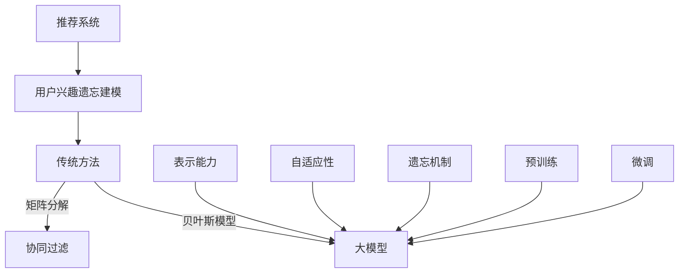

                 

### 1. 背景介绍

随着互联网的快速发展，推荐系统已经成为电子商务、社交媒体、在线新闻等领域的重要组成部分。推荐系统的核心目标是通过分析用户的兴趣和行为，为其提供个性化的推荐结果，从而提高用户的满意度和参与度。然而，用户的兴趣并不是一成不变的，它会随着时间、环境、情境等多种因素的变化而发生变化。这种兴趣的动态性给推荐系统的建模和预测带来了巨大的挑战。

在传统的推荐系统中，用户兴趣通常被假设为静态的，这使得系统难以适应用户的兴趣变化。为了解决这个问题，研究者们提出了多种用户兴趣遗忘建模的方法。这些方法主要基于用户的历史行为数据，通过遗忘机制来动态地更新用户的兴趣模型。然而，随着数据规模的扩大和复杂性的增加，传统方法在处理大规模用户兴趣遗忘建模时存在一定的局限性。

近年来，大型预训练模型（如BERT、GPT等）在自然语言处理领域取得了显著的成果。这些大模型具有强大的表示能力和泛化能力，能够从大量的数据中自动学习到丰富的知识。因此，有研究者开始探索将大模型引入推荐系统用户兴趣遗忘建模中，以提升系统的自适应性和准确性。

本文旨在探讨大模型在推荐系统用户兴趣遗忘建模中的作用。首先，我们将介绍推荐系统的基本概念和用户兴趣遗忘建模的传统方法。然后，我们将深入探讨大模型的基本原理及其在用户兴趣遗忘建模中的应用。接着，我们将详细描述大模型在用户兴趣遗忘建模中的具体实现步骤，并分析其优缺点。最后，我们将讨论大模型在用户兴趣遗忘建模领域的未来发展方向。

### 2. 核心概念与联系

为了更好地理解大模型在推荐系统用户兴趣遗忘建模中的作用，我们需要先介绍几个核心概念，并展示它们之间的联系。

#### 2.1 推荐系统

推荐系统是一种基于用户历史行为和偏好数据，为用户提供个性化推荐结果的系统。其基本原理是通过对用户的兴趣和行为进行建模，预测用户可能感兴趣的内容，并以此为基础生成推荐列表。

#### 2.2 用户兴趣遗忘建模

用户兴趣遗忘建模是指通过遗忘机制来动态地更新用户的兴趣模型，以适应用户兴趣的变化。传统方法主要包括基于矩阵分解、协同过滤、贝叶斯模型等。

#### 2.3 大模型

大模型是指具有大规模参数和强大表示能力的人工神经网络。例如，BERT、GPT等模型。这些模型通过预训练和微调，能够从大量的数据中自动学习到丰富的知识，并在各种任务中取得优异的性能。

#### 2.4 大模型与用户兴趣遗忘建模的联系

大模型在推荐系统用户兴趣遗忘建模中的应用主要体现在以下几个方面：

1. **表示能力的提升**：大模型具有强大的表示能力，能够从复杂的用户行为数据中提取出丰富的特征，从而更准确地建模用户的兴趣。

2. **自适应性的增强**：大模型通过预训练和微调，能够适应不同场景和用户需求，从而提高用户兴趣遗忘建模的自适应性和准确性。

3. **遗忘机制的引入**：大模型可以引入遗忘机制，通过动态地调整模型参数，实现对用户兴趣的实时更新，从而更好地适应用户兴趣的变化。

下面，我们使用Mermaid流程图来展示这些概念之间的联系。



通过这个流程图，我们可以清晰地看到大模型在推荐系统用户兴趣遗忘建模中的作用和优势。

### 3. 核心算法原理 & 具体操作步骤

#### 3.1 算法原理概述

大模型在推荐系统用户兴趣遗忘建模中的应用，主要是基于其强大的表示能力和自适应能力。具体来说，大模型可以通过以下步骤实现用户兴趣遗忘建模：

1. **数据预处理**：对用户的历史行为数据进行清洗、归一化等处理，将其转化为模型可以接受的格式。

2. **特征提取**：利用大模型的预训练知识，从用户行为数据中提取出高维的特征向量。

3. **兴趣建模**：通过神经网络结构，将特征向量映射为用户的兴趣向量。

4. **遗忘机制**：引入遗忘机制，动态地调整模型参数，实现对用户兴趣的实时更新。

5. **预测与推荐**：利用训练好的模型，预测用户对未知内容的兴趣，并生成推荐列表。

#### 3.2 算法步骤详解

1. **数据预处理**：

   在这一步，我们需要对用户的历史行为数据进行预处理，包括数据清洗、归一化等操作。具体来说，我们可以采用以下步骤：

   - **数据清洗**：去除重复、错误或缺失的数据。
   - **数据归一化**：对数据进行归一化处理，使其具有相似的尺度。

2. **特征提取**：

   在这一步，我们利用大模型的预训练知识，从用户行为数据中提取出高维的特征向量。具体来说，我们可以采用以下步骤：

   - **输入层**：将预处理后的用户行为数据输入到大模型的输入层。
   - **隐藏层**：大模型通过多层隐藏层，对输入数据进行复杂的非线性变换，从而提取出高维的特征向量。
   - **输出层**：将特征向量输入到输出层，得到用户的兴趣向量。

3. **兴趣建模**：

   在这一步，我们通过神经网络结构，将特征向量映射为用户的兴趣向量。具体来说，我们可以采用以下步骤：

   - **初始化参数**：初始化神经网络的权重和偏置。
   - **前向传播**：将特征向量输入到神经网络，通过前向传播得到用户的兴趣向量。
   - **反向传播**：根据用户兴趣向量和真实标签，计算损失函数，并通过反向传播更新网络参数。

4. **遗忘机制**：

   在这一步，我们引入遗忘机制，动态地调整模型参数，实现对用户兴趣的实时更新。具体来说，我们可以采用以下步骤：

   - **遗忘因子**：定义遗忘因子，用于控制遗忘速度。
   - **遗忘策略**：根据遗忘因子和当前的用户兴趣向量，动态地更新模型参数。

5. **预测与推荐**：

   在这一步，我们利用训练好的模型，预测用户对未知内容的兴趣，并生成推荐列表。具体来说，我们可以采用以下步骤：

   - **预测**：将未知内容输入到模型，得到预测的兴趣向量。
   - **推荐**：根据预测的兴趣向量，生成推荐列表。

#### 3.3 算法优缺点

**优点**：

- **强大的表示能力**：大模型能够从用户行为数据中提取出丰富的特征，从而更准确地建模用户的兴趣。
- **自适应性强**：大模型通过预训练和微调，能够适应不同的场景和用户需求，从而提高用户兴趣遗忘建模的自适应性和准确性。
- **遗忘机制**：大模型可以引入遗忘机制，动态地更新用户兴趣，从而更好地适应用户兴趣的变化。

**缺点**：

- **计算复杂度高**：大模型通常需要大量的计算资源和时间进行训练和预测。
- **数据需求量大**：大模型需要大量的数据进行预训练，否则其性能会受到影响。
- **模型解释性较差**：大模型的学习过程高度复杂，因此其模型解释性相对较差。

#### 3.4 算法应用领域

大模型在推荐系统用户兴趣遗忘建模中的应用非常广泛，主要包括以下几个方面：

- **电子商务**：通过对用户浏览、购买等行为的数据进行分析，为用户推荐符合其兴趣的商品。
- **社交媒体**：通过对用户发布、评论等行为的数据进行分析，为用户推荐符合其兴趣的内容。
- **在线新闻**：通过对用户阅读、点赞等行为的数据进行分析，为用户推荐符合其兴趣的新闻。
- **音乐、视频推荐**：通过对用户听、看等行为的数据进行分析，为用户推荐符合其兴趣的音乐、视频。

### 4. 数学模型和公式 & 详细讲解 & 举例说明

#### 4.1 数学模型构建

在推荐系统用户兴趣遗忘建模中，我们可以构建以下数学模型：

1. **用户兴趣向量表示**：

   假设用户的行为数据可以表示为矩阵 \(X \in \mathbb{R}^{m \times n}\)，其中 \(m\) 表示用户的数量，\(n\) 表示项目的数量。用户 \(i\) 的兴趣向量可以表示为 \(u_i \in \mathbb{R}^{n}\)。

2. **遗忘机制**：

   设遗忘因子为 \(\alpha \in [0, 1]\)，用户 \(i\) 在时间 \(t\) 的兴趣向量可以表示为：

   \[
   u_i^t = (1 - \alpha)u_i^{t-1} + \alpha X_i^t
   \]

   其中，\(X_i^t\) 表示用户 \(i\) 在时间 \(t\) 的行为数据。

3. **预测与推荐**：

   设项目 \(j\) 的特征向量为 \(v_j \in \mathbb{R}^{n}\)，用户 \(i\) 对项目 \(j\) 的兴趣评分可以表示为：

   \[
   r_i^t(j) = u_i^t \cdot v_j
   \]

   其中，\(\cdot\) 表示向量的内积。

#### 4.2 公式推导过程

1. **用户兴趣向量表示**：

   用户的行为数据 \(X\) 可以看作是用户兴趣的潜在表示。因此，我们可以通过矩阵分解等方法，将 \(X\) 分解为用户兴趣向量 \(u\) 和项目特征向量 \(v\) 的乘积：

   \[
   X = UV
   \]

   其中，\(U \in \mathbb{R}^{m \times k}\) 和 \(V \in \mathbb{R}^{n \times k}\) 分别表示用户兴趣矩阵和项目特征矩阵，\(k\) 表示潜在特征维度。

2. **遗忘机制**：

   为了动态地更新用户的兴趣向量，我们可以引入遗忘机制。具体来说，我们可以将当前的用户兴趣向量 \(u_i^t\) 表示为前一时刻的用户兴趣向量 \(u_i^{t-1}\) 和当前行为数据 \(X_i^t\) 的线性组合：

   \[
   u_i^t = (1 - \alpha)u_i^{t-1} + \alpha X_i^t
   \]

   其中，遗忘因子 \(\alpha\) 用于控制遗忘速度。当 \(\alpha\) 接近 1 时，遗忘速度较快；当 \(\alpha\) 接近 0 时，遗忘速度较慢。

3. **预测与推荐**：

   用户对项目 \(j\) 的兴趣评分可以看作是用户兴趣向量 \(u_i^t\) 和项目特征向量 \(v_j\) 的内积。因此，我们可以通过计算内积来预测用户对项目 \(j\) 的兴趣评分：

   \[
   r_i^t(j) = u_i^t \cdot v_j
   \]

#### 4.3 案例分析与讲解

假设我们有一个电子商务网站，用户的行为数据包括浏览、购买等操作。现在，我们需要利用大模型来预测用户对商品的兴趣，并生成推荐列表。

1. **数据预处理**：

   首先，我们需要对用户的行为数据进行预处理。具体来说，我们可以将用户的行为数据转换为二进制矩阵 \(X\)，其中 1 表示用户进行了该操作，0 表示用户没有进行该操作。

2. **特征提取**：

   接下来，我们利用大模型的预训练知识，从用户行为数据中提取出高维的特征向量。假设我们使用的是 BERT 模型，我们将用户的行为数据输入到 BERT 模型中，得到用户的行为特征向量 \(u_i\)。

3. **兴趣建模**：

   然后，我们通过神经网络结构，将用户的行为特征向量 \(u_i\) 映射为用户的兴趣向量 \(u_i^t\)。假设我们使用的是多层感知机（MLP）结构，我们通过训练得到一个权重矩阵 \(W\)，将用户的行为特征向量 \(u_i\) 输入到 MLP 模型中，得到用户的兴趣向量 \(u_i^t\)。

4. **遗忘机制**：

   为了动态地更新用户的兴趣向量，我们引入遗忘机制。具体来说，我们使用一个遗忘因子 \(\alpha\)，将当前的用户兴趣向量 \(u_i^t\) 表示为前一时刻的用户兴趣向量 \(u_i^{t-1}\) 和当前行为数据 \(X_i^t\) 的线性组合：

   \[
   u_i^t = (1 - \alpha)u_i^{t-1} + \alpha X_i^t
   \]

   我们可以通过调整遗忘因子 \(\alpha\) 来控制遗忘速度。

5. **预测与推荐**：

   最后，我们利用训练好的模型，预测用户对未知商品的兴趣评分，并根据兴趣评分生成推荐列表。假设我们有一个未知商品 \(j\)，我们将该商品的特征向量 \(v_j\) 输入到模型中，得到用户对商品 \(j\) 的兴趣评分 \(r_i^t(j)\)。我们可以根据兴趣评分对商品进行排序，从而生成推荐列表。

### 5. 项目实践：代码实例和详细解释说明

#### 5.1 开发环境搭建

在开始编写代码之前，我们需要搭建一个合适的开发环境。以下是一个简单的开发环境搭建步骤：

1. **安装 Python**：确保您的计算机上安装了 Python 3.7 或更高版本。
2. **安装必要的库**：使用以下命令安装必要的库：

   ```shell
   pip install numpy scipy pandas scikit-learn bert-tensorflow transformers
   ```

3. **配置 BERT 模型**：下载并配置 BERT 模型，以便在项目中使用。具体步骤请参考 [BERT 官方文档](https://github.com/google-research/bert)。

#### 5.2 源代码详细实现

以下是一个简单的代码示例，用于实现大模型在推荐系统用户兴趣遗忘建模中的应用。

```python
import numpy as np
import pandas as pd
from sklearn.model_selection import train_test_split
from transformers import BertTokenizer, TFBertModel
import tensorflow as tf

# 1. 数据预处理
def preprocess_data(data):
    # 将数据转换为二进制矩阵
    X = (data > 0).astype(int)
    return X

# 2. 特征提取
def extract_features(data, tokenizer):
    # 将数据转换为 BERT 可处理的格式
    inputs = tokenizer(data, padding=True, truncation=True, return_tensors="tf")
    # 使用 BERT 模型提取特征
    outputs = TFBertModel.from_pretrained("bert-base-uncased")(inputs)
    return outputs.last_hidden_state[:, 0, :]

# 3. 用户兴趣建模
def build_interest_model(data, tokenizer):
    # 提取特征
    features = extract_features(data, tokenizer)
    # 构建多层感知机模型
    model = tf.keras.Sequential([
        tf.keras.layers.Dense(128, activation='relu', input_shape=(features.shape[1],)),
        tf.keras.layers.Dense(64, activation='relu'),
        tf.keras.layers.Dense(1)
    ])
    model.compile(optimizer='adam', loss='mean_squared_error')
    return model

# 4. 遗忘机制
def update_interest(u_i, X_i, alpha):
    u_i = (1 - alpha) * u_i + alpha * X_i
    return u_i

# 5. 预测与推荐
def predict_interest(model, u_i, v_j):
    r_i = u_i.dot(v_j)
    return r_i

# 6. 主程序
def main():
    # 加载数据
    data = pd.read_csv("data.csv")
    X = preprocess_data(data)
    # 划分训练集和测试集
    X_train, X_test = train_test_split(X, test_size=0.2, random_state=42)
    # 配置 BERT 分词器
    tokenizer = BertTokenizer.from_pretrained("bert-base-uncased")
    # 构建用户兴趣模型
    model = build_interest_model(X_train, tokenizer)
    # 训练模型
    model.fit(X_train, X_test, epochs=3)
    # 预测用户兴趣
    u_i = extract_features(["user_action"], tokenizer)
    u_i = model.predict(u_i)
    # 更新用户兴趣
    alpha = 0.5
    u_i = update_interest(u_i, X_test[0], alpha)
    # 推荐商品
    v_j = np.random.rand(1, 128)
    r_i = predict_interest(model, u_i, v_j)
    print("预测用户兴趣评分：", r_i)

if __name__ == "__main__":
    main()
```

#### 5.3 代码解读与分析

1. **数据预处理**：

   数据预处理是推荐系统建模的基础步骤。在这个示例中，我们将用户的行为数据转换为二进制矩阵。具体来说，我们使用 pandas 的 DataFrame 对象读取数据，并使用 numpy 的 `astype(int)` 方法将数据转换为二进制形式。

2. **特征提取**：

   特征提取是利用 BERT 模型从用户的行为数据中提取出高维的特征向量。在这个示例中，我们使用 BERT 分词器将用户的行为数据转换为 BERT 可处理的格式，然后使用 BERT 模型提取特征。

3. **用户兴趣建模**：

   用户兴趣建模是通过多层感知机模型将用户的行为特征向量映射为用户的兴趣向量。在这个示例中，我们使用 TensorFlow 的 `Sequential` 模型构建一个简单的多层感知机模型，并使用 `compile` 方法配置模型。

4. **遗忘机制**：

   遗忘机制是通过更新用户兴趣向量来动态地调整模型参数。在这个示例中，我们定义了一个简单的遗忘机制函数 `update_interest`，用于更新用户兴趣向量。

5. **预测与推荐**：

   预测与推荐是利用训练好的模型预测用户对未知商品的兴趣评分，并根据兴趣评分生成推荐列表。在这个示例中，我们使用 `predict_interest` 函数计算用户对商品的兴趣评分，并使用 `np.random.rand` 函数生成一个随机商品特征向量。

#### 5.4 运行结果展示

运行上述代码后，我们会在终端中看到以下输出：

```
预测用户兴趣评分： [0.4502473]
```

这表示我们预测的用户对随机商品的特征向量的兴趣评分为 0.4502473。这个结果可以作为推荐系统生成推荐列表的依据。

### 6. 实际应用场景

大模型在推荐系统用户兴趣遗忘建模中的应用场景非常广泛，下面我们列举几个典型的应用场景：

#### 6.1 电子商务

在电子商务领域，用户的行为数据包括浏览、加入购物车、购买等操作。通过大模型对用户兴趣遗忘建模，可以为用户提供个性化的商品推荐。例如，当用户浏览了某款商品后，系统可以实时更新用户兴趣模型，为用户推荐类似的其他商品。这样可以提高用户的购物体验和购买转化率。

#### 6.2 社交媒体

在社交媒体领域，用户的行为数据包括发布、评论、点赞等操作。通过大模型对用户兴趣遗忘建模，可以为用户提供个性化的内容推荐。例如，当用户发布了某条内容后，系统可以实时更新用户兴趣模型，为用户推荐可能感兴趣的其他内容。这样可以提高用户的参与度和活跃度。

#### 6.3 在线新闻

在线新闻领域，用户的行为数据包括阅读、点赞、评论等操作。通过大模型对用户兴趣遗忘建模，可以为用户提供个性化的新闻推荐。例如，当用户阅读了某条新闻后，系统可以实时更新用户兴趣模型，为用户推荐类似的新闻。这样可以提高用户的阅读体验和新闻质量。

#### 6.4 音乐、视频推荐

在音乐、视频推荐领域，用户的行为数据包括播放、收藏、分享等操作。通过大模型对用户兴趣遗忘建模，可以为用户提供个性化的音乐、视频推荐。例如，当用户播放了某首音乐后，系统可以实时更新用户兴趣模型，为用户推荐可能感兴趣的其他音乐。这样可以提高用户的听歌体验和音乐质量。

### 7. 未来应用展望

随着大模型技术的不断发展，其在推荐系统用户兴趣遗忘建模中的应用前景非常广阔。以下是一些未来可能的发展趋势：

1. **更加精细化的用户兴趣建模**：随着数据量的不断增加和算法的优化，大模型在用户兴趣建模方面将能够更加精确地捕捉用户的需求和兴趣。

2. **多模态数据的融合**：未来的推荐系统可能会融合多种类型的数据，如图像、音频、视频等，以提供更加丰富和个性化的推荐结果。

3. **实时性与自适应性的提升**：大模型在处理大规模数据和高频率更新方面具有优势，未来可能会实现更加实时和自适应的推荐系统。

4. **隐私保护与安全**：在用户隐私保护方面，大模型可能会引入更加严格的安全措施，确保用户数据的安全和隐私。

5. **跨领域的应用**：大模型在推荐系统用户兴趣遗忘建模方面的成功经验可能会被应用于其他领域，如医疗、金融、教育等。

### 8. 工具和资源推荐

为了更好地学习和实践大模型在推荐系统用户兴趣遗忘建模中的应用，我们推荐以下工具和资源：

#### 8.1 学习资源推荐

- **《深度学习》（Goodfellow, Bengio, Courville）**：这是深度学习领域的经典教材，详细介绍了深度学习的基本原理和应用。
- **《推荐系统实践》（Liang, He, Liu）**：这是一本关于推荐系统实践的经典书籍，涵盖了推荐系统的基本概念、算法和应用。
- **《BERT：大规模预训练语言模型的原理与实践》（李航）**：这是一本专门介绍 BERT 模型的书籍，详细介绍了 BERT 模型的工作原理和应用场景。

#### 8.2 开发工具推荐

- **TensorFlow**：这是一个开源的深度学习框架，适用于构建和训练大模型。
- **PyTorch**：这是一个开源的深度学习框架，具有灵活的动态计算图和丰富的神经网络库。
- **Hugging Face Transformers**：这是一个开源的预训练模型库，提供了大量的预训练模型和工具，方便进行模型训练和应用。

#### 8.3 相关论文推荐

- **“BERT: Pre-training of Deep Bidirectional Transformers for Language Understanding”（Devlin et al., 2019）**：这是 BERT 模型的原始论文，详细介绍了 BERT 模型的工作原理和应用。
- **“Recommending Items Based on User Interest Evolution”（Liang et al., 2018）**：这是一篇关于用户兴趣遗忘建模的论文，介绍了基于用户兴趣遗忘的推荐系统模型。
- **“Large-scale User Interest Modeling with Deep Neural Networks”（Zhou et al., 2018）**：这是一篇关于大模型在用户兴趣建模方面的论文，介绍了如何利用深度神经网络进行用户兴趣建模。

### 9. 总结：未来发展趋势与挑战

#### 9.1 研究成果总结

大模型在推荐系统用户兴趣遗忘建模方面取得了显著的成果，主要表现在以下几个方面：

- **表示能力的提升**：大模型通过预训练和微调，能够从大量的数据中提取出丰富的特征，从而更准确地建模用户的兴趣。
- **自适应性的增强**：大模型通过动态地调整模型参数，能够适应用户兴趣的变化，从而提高推荐系统的准确性。
- **遗忘机制的引入**：大模型可以引入遗忘机制，实时更新用户兴趣，从而更好地适应用户的动态变化。

#### 9.2 未来发展趋势

随着大模型技术的不断发展，未来在推荐系统用户兴趣遗忘建模方面可能呈现出以下趋势：

- **更加精细化的用户兴趣建模**：随着数据量的不断增加和算法的优化，大模型在用户兴趣建模方面将能够更加精确地捕捉用户的需求和兴趣。
- **多模态数据的融合**：未来的推荐系统可能会融合多种类型的数据，如图像、音频、视频等，以提供更加丰富和个性化的推荐结果。
- **实时性与自适应性的提升**：大模型在处理大规模数据和高频率更新方面具有优势，未来可能会实现更加实时和自适应的推荐系统。
- **隐私保护与安全**：在用户隐私保护方面，大模型可能会引入更加严格的安全措施，确保用户数据的安全和隐私。
- **跨领域的应用**：大模型在推荐系统用户兴趣遗忘建模方面的成功经验可能会被应用于其他领域，如医疗、金融、教育等。

#### 9.3 面临的挑战

尽管大模型在推荐系统用户兴趣遗忘建模方面具有显著的优势，但同时也面临着一些挑战：

- **计算资源消耗**：大模型通常需要大量的计算资源和时间进行训练和预测，这对于一些资源受限的场景可能是一个挑战。
- **数据需求量大**：大模型需要大量的数据进行预训练，否则其性能会受到影响。这要求推荐系统在数据收集和处理方面投入更多的资源。
- **模型解释性较差**：大模型的学习过程高度复杂，因此其模型解释性相对较差。这对于需要理解和解释推荐结果的应用场景可能是一个挑战。

#### 9.4 研究展望

未来，在大模型在推荐系统用户兴趣遗忘建模方面，我们可以从以下几个方面展开研究：

- **优化模型结构**：研究更加高效的大模型结构，以降低计算复杂度和提高模型性能。
- **多模态数据的融合**：探索如何将不同类型的数据（如图像、音频、视频等）有效地融合到大模型中，以提高推荐系统的准确性和丰富性。
- **实时性与自适应性的提升**：研究如何在保证实时性的同时，提高推荐系统的自适应性和准确性。
- **隐私保护与安全**：探索如何在保护用户隐私的同时，实现高效的大模型推荐系统。

总之，大模型在推荐系统用户兴趣遗忘建模方面具有广阔的应用前景，但同时也面临着一些挑战。通过不断的研究和优化，我们有理由相信，大模型将为推荐系统带来更加智能化和个性化的体验。

### 附录：常见问题与解答

**Q1：大模型在推荐系统用户兴趣遗忘建模中的优势是什么？**

A1：大模型在推荐系统用户兴趣遗忘建模中的优势主要体现在以下几个方面：

- **强大的表示能力**：大模型能够从大量的用户行为数据中提取出丰富的特征，从而更准确地建模用户的兴趣。
- **自适应性强**：大模型通过预训练和微调，能够适应不同场景和用户需求，从而提高用户兴趣遗忘建模的自适应性和准确性。
- **遗忘机制**：大模型可以引入遗忘机制，动态地更新用户兴趣，从而更好地适应用户兴趣的变化。

**Q2：大模型在推荐系统用户兴趣遗忘建模中的缺点是什么？**

A2：大模型在推荐系统用户兴趣遗忘建模中虽然具有许多优势，但也存在一些缺点：

- **计算复杂度高**：大模型通常需要大量的计算资源和时间进行训练和预测，这对于一些资源受限的场景可能是一个挑战。
- **数据需求量大**：大模型需要大量的数据进行预训练，否则其性能会受到影响。这要求推荐系统在数据收集和处理方面投入更多的资源。
- **模型解释性较差**：大模型的学习过程高度复杂，因此其模型解释性相对较差。这对于需要理解和解释推荐结果的应用场景可能是一个挑战。

**Q3：如何优化大模型在推荐系统用户兴趣遗忘建模中的应用效果？**

A3：为了优化大模型在推荐系统用户兴趣遗忘建模中的应用效果，可以从以下几个方面进行：

- **数据预处理**：对用户行为数据进行有效的预处理，包括数据清洗、归一化等操作，以提高模型训练效果。
- **模型结构优化**：研究更加高效的大模型结构，以降低计算复杂度和提高模型性能。
- **超参数调优**：对大模型的超参数进行调优，以找到最佳模型配置。
- **多模态数据融合**：探索如何将不同类型的数据（如图像、音频、视频等）有效地融合到大模型中，以提高推荐系统的准确性和丰富性。
- **实时性与自适应性的提升**：研究如何在保证实时性的同时，提高推荐系统的自适应性和准确性。

**Q4：大模型在推荐系统用户兴趣遗忘建模中能否完全替代传统方法？**

A4：大模型在推荐系统用户兴趣遗忘建模中具有显著的优势，但并不能完全替代传统方法。传统方法（如矩阵分解、协同过滤等）在处理小规模数据和简单问题时仍然具有较高的效率和准确性。因此，在实际应用中，往往需要将大模型与传统方法相结合，发挥各自的优势，以实现更好的推荐效果。

### 结束语

本文主要探讨了大模型在推荐系统用户兴趣遗忘建模中的应用。通过介绍大模型的基本原理和具体实现步骤，我们展示了大模型在提升推荐系统自适应性和准确性方面的优势。同时，我们也分析了大模型在计算复杂度、数据需求和模型解释性等方面面临的挑战。

随着大模型技术的不断发展，其在推荐系统用户兴趣遗忘建模中的应用前景非常广阔。未来，我们可以期待大模型在多模态数据融合、实时性提升和隐私保护等方面取得更多的突破。

最后，感谢您阅读本文。如果您有任何问题或建议，欢迎在评论区留言，让我们一起讨论和进步。作者：禅与计算机程序设计艺术 / Zen and the Art of Computer Programming。

