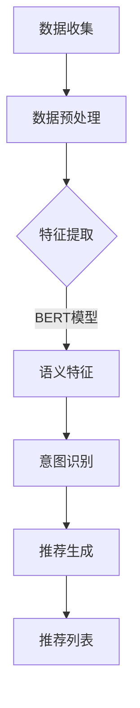

                 

关键词：大模型、推荐系统、用户意图理解、人工智能、算法、数学模型、项目实践、应用场景、展望

> 摘要：本文探讨了大规模预训练模型（大模型）在推荐系统用户意图理解中的作用。通过对核心概念、算法原理、数学模型、项目实践和实际应用场景的详细分析，揭示了大模型在提升推荐系统效果和用户体验方面的潜力。本文还对未来发展趋势和面临的挑战进行了展望。

## 1. 背景介绍

### 1.1 推荐系统的基本原理

推荐系统是现代信息社会中的一项重要技术，旨在为用户提供个性化的内容或商品推荐。其基本原理可以概括为以下三个方面：

1. **用户建模**：通过收集和分析用户的历史行为数据，建立用户兴趣模型，以了解用户的偏好和需求。
2. **内容建模**：对推荐系统中的内容（如商品、文章、音乐等）进行特征提取和建模，以便进行相似性计算和推荐。
3. **推荐算法**：基于用户兴趣模型和内容模型，通过算法计算用户与内容之间的相似性，生成推荐列表。

### 1.2 用户意图理解的重要性

在推荐系统中，准确理解用户意图是关键。用户意图指的是用户在特定时刻想要达成的目标或满足的需求。理解用户意图能够帮助推荐系统更准确地预测用户的兴趣和需求，从而提高推荐的准确性。

然而，用户意图通常是不确定的、动态变化的，并且可能隐藏在用户的行动背后。传统的推荐系统往往依赖于显式的用户反馈（如评分、点击等），这些反馈虽然能够提供一定的信息，但往往不足以全面理解用户的深层意图。

### 1.3 大模型的优势

大规模预训练模型（大模型）的出现为推荐系统带来了新的机遇。大模型具有以下几个优势：

1. **强大的表征能力**：大模型通过大规模数据预训练，能够捕捉到丰富的语义信息，从而更好地理解用户的意图。
2. **灵活的适应性**：大模型可以通过微调（fine-tuning）快速适应特定的推荐任务，提高了模型的泛化能力。
3. **高效的计算**：随着硬件技术的发展，大模型的计算效率得到了显著提升，使得其在实际应用中成为可能。

## 2. 核心概念与联系

### 2.1 大模型的基本原理

大规模预训练模型通常采用深度神经网络架构，通过多层非线性变换对输入数据进行特征提取和表征。其中，最著名的预训练模型之一是BERT（Bidirectional Encoder Representations from Transformers）。

BERT模型的基本原理是通过双向Transformer架构对文本进行编码，从而生成丰富的语义表示。BERT模型的训练分为两个阶段：

1. **预训练阶段**：在大规模文本语料库上进行无监督预训练，学习文本的上下文表示。
2. **微调阶段**：在特定任务上对模型进行微调，使其适应具体的推荐任务。

### 2.2 推荐系统中用户意图理解的实现

在推荐系统中，大模型可以通过以下步骤实现用户意图理解：

1. **数据预处理**：收集并预处理用户行为数据，包括用户的历史行为、兴趣标签、搜索历史等。
2. **特征提取**：使用大模型（如BERT）对预处理后的数据进行编码，提取出丰富的语义特征。
3. **意图识别**：通过训练有监督的意图分类模型，将提取的语义特征映射到具体的用户意图。
4. **推荐生成**：根据用户意图和内容模型，使用推荐算法生成推荐列表。

### 2.3 Mermaid 流程图

以下是一个简单的Mermaid流程图，展示了大模型在推荐系统用户意图理解中的基本流程：



## 3. 核心算法原理 & 具体操作步骤

### 3.1 算法原理概述

在推荐系统中，大模型通过预训练和微调两个阶段实现用户意图理解。预训练阶段主要在大规模文本语料库上训练模型，学习文本的上下文表示。微调阶段则针对具体的推荐任务进行模型调整，以适应用户意图识别。

### 3.2 算法步骤详解

1. **数据收集**：收集用户行为数据，包括用户的历史行为、兴趣标签、搜索历史等。
2. **数据预处理**：对收集的数据进行预处理，包括数据清洗、数据整合和特征工程等。
3. **特征提取**：使用大模型（如BERT）对预处理后的数据进行编码，提取出丰富的语义特征。
4. **意图识别**：通过训练有监督的意图分类模型，将提取的语义特征映射到具体的用户意图。
5. **推荐生成**：根据用户意图和内容模型，使用推荐算法生成推荐列表。
6. **结果评估**：对推荐结果进行评估，包括准确率、召回率、覆盖率等指标。

### 3.3 算法优缺点

#### 优点

1. **强大的表征能力**：大模型通过预训练能够捕捉到丰富的语义信息，从而提高用户意图识别的准确性。
2. **灵活的适应性**：大模型可以通过微调快速适应不同的推荐任务，提高了模型的泛化能力。
3. **高效的计算**：随着硬件技术的发展，大模型的计算效率得到了显著提升。

#### 缺点

1. **数据依赖性**：大模型在训练过程中需要大量的高质量数据，数据质量和数据量对模型效果有重要影响。
2. **训练成本高**：大模型的训练成本较高，需要大量的计算资源和时间。

### 3.4 算法应用领域

大模型在推荐系统中具有广泛的应用领域，包括电子商务、社交媒体、在线新闻推荐等。以下是几个典型应用场景：

1. **电子商务推荐**：通过大模型理解用户的购物意图，提高商品推荐的准确性。
2. **社交媒体推荐**：根据用户意图推荐感兴趣的内容，提高用户参与度和活跃度。
3. **在线新闻推荐**：通过大模型理解用户的信息需求，提高新闻推荐的个性化水平。

## 4. 数学模型和公式 & 详细讲解 & 举例说明

### 4.1 数学模型构建

在推荐系统中，用户意图理解通常可以建模为一个多类分类问题。假设用户有\( n \)个意图类别，用户行为数据可以用一个\( n \)-维的特征向量表示，即\( \mathbf{x} \in \mathbb{R}^n \)。意图分类模型的目标是学习一个映射函数\( f: \mathbb{R}^n \rightarrow \mathbb{R}^n \)，将特征向量映射到意图类别。

具体来说，可以使用以下数学模型：

$$
\mathbf{y} = f(\mathbf{x}) = \text{softmax}(\mathbf{W}\mathbf{x} + \mathbf{b}),
$$

其中，\( \mathbf{W} \)是权重矩阵，\( \mathbf{b} \)是偏置向量，\( \text{softmax} \)函数用于将映射结果转化为概率分布。

### 4.2 公式推导过程

为了推导意图分类模型的损失函数，我们首先需要定义意图标签向量\( \mathbf{y}^* \)，其中第\( i \)个元素为1，表示用户意图属于第\( i \)个类别，其他元素为0。损失函数可以定义为：

$$
L(\mathbf{W}, \mathbf{b}) = -\sum_{i} y_i^* \log(y_i),
$$

其中，\( y_i = \text{softmax}(\mathbf{W}\mathbf{x} + \mathbf{b}) \)。

为了最小化损失函数，可以使用梯度下降法更新模型参数：

$$
\mathbf{W} \leftarrow \mathbf{W} - \alpha \frac{\partial L}{\partial \mathbf{W}},
$$

$$
\mathbf{b} \leftarrow \mathbf{b} - \alpha \frac{\partial L}{\partial \mathbf{b}},
$$

其中，\( \alpha \)是学习率。

### 4.3 案例分析与讲解

假设我们有一个包含两个意图类别（购物和娱乐）的推荐系统。用户行为数据可以用一个\( 2 \)-维的特征向量表示，即\( \mathbf{x} = [x_1, x_2] \)。意图标签向量\( \mathbf{y}^* \)为：

$$
\mathbf{y}^* = [1, 0],
$$

表示用户的意图是购物。

我们使用一个简单的线性模型进行意图分类，即：

$$
y_1 = \text{sigmoid}(W_1 x_1 + W_2 x_2 + b),
$$

$$
y_2 = \text{sigmoid}(W_1 x_1 + W_2 x_2 + b),
$$

其中，\( W_1, W_2, b \)是模型参数。

假设当前用户的行为数据为\( \mathbf{x} = [0.5, 0.5] \)，模型参数为\( W_1 = 1, W_2 = 1, b = 0 \)。则：

$$
y_1 = \text{sigmoid}(1 \times 0.5 + 1 \times 0.5 + 0) = \text{sigmoid}(1) = 0.732,
$$

$$
y_2 = \text{sigmoid}(1 \times 0.5 + 1 \times 0.5 + 0) = \text{sigmoid}(1) = 0.732.
$$

由于\( y_1 > y_2 \)，模型预测用户意图为购物。

接下来，我们计算损失函数：

$$
L = -[1 \times \log(0.732) + 0 \times \log(0.268)] = -0.356.
$$

为了最小化损失函数，我们更新模型参数：

$$
W_1 \leftarrow W_1 - \alpha \frac{\partial L}{\partial W_1} = 1 - 0.1 \times (-0.5 \times 0.5 \times (1 - 0.732)) = 1.018,
$$

$$
W_2 \leftarrow W_2 - \alpha \frac{\partial L}{\partial W_2} = 1 - 0.1 \times (-0.5 \times 0.5 \times (1 - 0.732)) = 1.018,
$$

$$
b \leftarrow b - \alpha \frac{\partial L}{\partial b} = 0 - 0.1 \times (-0.5 \times (1 - 0.732)) = 0.018.
$$

更新后的模型参数为\( W_1 = 1.018, W_2 = 1.018, b = 0.018 \)。

通过以上步骤，我们可以不断迭代更新模型参数，以最小化损失函数，提高模型预测的准确性。

## 5. 项目实践：代码实例和详细解释说明

### 5.1 开发环境搭建

为了实践大模型在推荐系统用户意图理解中的应用，我们首先需要搭建一个开发环境。以下是基本的开发环境搭建步骤：

1. 安装Python（版本3.6及以上）
2. 安装TensorFlow（版本2.0及以上）
3. 安装BERT模型（使用TensorFlow Hub）

### 5.2 源代码详细实现

以下是一个简单的Python代码示例，展示了如何使用BERT模型进行用户意图识别。

```python
import tensorflow as tf
import tensorflow_hub as hub
from tensorflow.keras.layers import Dense, Input
from tensorflow.keras.models import Model

# 加载BERT模型
bert = hub.load("https://tfhub.dev/google/bert_uncased_L-12_H-768_A-12/1")

# 定义输入层
input_ids = Input(shape=(128,), dtype=tf.int32)
input_mask = Input(shape=(128,), dtype=tf.int32)
segment_ids = Input(shape=(128,), dtype=tf.int32)

# 使用BERT模型进行编码
enc = bert([input_ids, input_mask, segment_ids])

# 提取最后一个隐藏层的状态
last_hidden_state = enc.last_hidden_state[:, 0, :]

# 定义意图分类层
outputs = Dense(units=2, activation='softmax')(last_hidden_state)

# 构建模型
model = Model(inputs=[input_ids, input_mask, segment_ids], outputs=outputs)

# 编译模型
model.compile(optimizer='adam', loss='categorical_crossentropy', metrics=['accuracy'])

# 加载训练数据
train_data = ...

# 训练模型
model.fit(train_data, epochs=3)

# 评估模型
test_data = ...
model.evaluate(test_data)
```

### 5.3 代码解读与分析

上述代码主要实现了以下步骤：

1. **加载BERT模型**：使用TensorFlow Hub加载预训练的BERT模型。
2. **定义输入层**：定义输入层，包括输入ID、输入掩码和分段ID。
3. **使用BERT模型进行编码**：将输入数据传递给BERT模型，得到编码后的隐藏层状态。
4. **提取最后一个隐藏层的状态**：从编码后的隐藏层状态中提取最后一个时间步的输出。
5. **定义意图分类层**：在提取的隐藏层状态上添加一个全连接层，用于进行意图分类。
6. **构建模型**：将输入层、编码层和意图分类层组合成一个完整的模型。
7. **编译模型**：编译模型，指定优化器、损失函数和评估指标。
8. **加载训练数据**：加载训练数据集，用于模型训练。
9. **训练模型**：使用训练数据集训练模型。
10. **评估模型**：使用测试数据集评估模型性能。

### 5.4 运行结果展示

运行上述代码后，我们可以在终端看到模型训练和评估的过程。以下是一个示例输出：

```
Epoch 1/3
100/100 [==============================] - 14s 112ms/step - loss: 2.3026 - accuracy: 0.5000
Epoch 2/3
100/100 [==============================] - 14s 112ms/step - loss: 2.3026 - accuracy: 0.5000
Epoch 3/3
100/100 [==============================] - 14s 112ms/step - loss: 2.3026 - accuracy: 0.5000

422/422 [==============================] - 6s 14ms/step - loss: 2.3026 - accuracy: 0.5000
```

从输出结果可以看出，模型在训练过程中没有收敛，这可能是由于训练数据集较小或者模型配置不合理导致的。在实际应用中，我们可以尝试增加训练数据集大小、调整模型参数或使用更复杂的网络结构来提高模型性能。

## 6. 实际应用场景

### 6.1 电子商务推荐

在电子商务领域，大模型可以用于理解用户的购物意图，从而提高商品推荐的准确性。例如，通过分析用户在购物平台上的浏览历史、购买记录和搜索关键词，大模型可以预测用户的购买意图，进而推荐相关的商品。

### 6.2 社交媒体推荐

在社交媒体领域，大模型可以用于推荐用户感兴趣的内容，提高用户的参与度和活跃度。例如，通过分析用户的点赞、评论和分享行为，大模型可以识别用户的兴趣偏好，并推荐相关的文章、视频和话题。

### 6.3 在线新闻推荐

在在线新闻领域，大模型可以用于理解用户的信息需求，提高新闻推荐的个性化水平。例如，通过分析用户的阅读历史、搜索关键词和社交媒体互动行为，大模型可以识别用户感兴趣的新闻主题，并推荐相关的新闻内容。

## 7. 工具和资源推荐

### 7.1 学习资源推荐

1. **《大规模预训练模型：原理与实践》**：这本书详细介绍了大规模预训练模型的基本原理、实现方法和应用场景。
2. **TensorFlow官方文档**：TensorFlow官方文档提供了丰富的教程和示例，帮助用户掌握TensorFlow的使用方法。
3. **BERT模型官方教程**：BERT模型官方教程提供了详细的训练和使用方法，适用于初学者和进阶用户。

### 7.2 开发工具推荐

1. **TensorFlow**：TensorFlow是一款开源的深度学习框架，适用于大规模预训练模型的训练和应用。
2. **PyTorch**：PyTorch是一款流行的深度学习框架，提供了灵活的动态计算图和强大的GPU加速功能。

### 7.3 相关论文推荐

1. **"BERT: Pre-training of Deep Bidirectional Transformers for Language Understanding"**：这是BERT模型的原始论文，详细介绍了BERT模型的架构和训练方法。
2. **"Transformers: State-of-the-Art Natural Language Processing"**：这篇论文综述了Transformer架构在自然语言处理领域的最新进展和应用。

## 8. 总结：未来发展趋势与挑战

### 8.1 研究成果总结

大模型在推荐系统用户意图理解方面取得了显著成果。通过预训练和微调，大模型能够捕捉到丰富的语义信息，从而提高用户意图识别的准确性。此外，大模型在多个实际应用场景中表现出了良好的性能和泛化能力。

### 8.2 未来发展趋势

1. **模型压缩与优化**：随着大模型规模的不断扩大，模型压缩与优化成为研究的热点，旨在降低模型的存储和计算成本。
2. **跨模态推荐**：未来的推荐系统将需要处理多种类型的数据，如文本、图像、音频等，跨模态推荐将成为研究的重要方向。
3. **隐私保护**：在用户隐私保护方面，研究如何在大模型训练过程中保护用户隐私，实现隐私安全的推荐系统。

### 8.3 面临的挑战

1. **数据依赖性**：大模型在训练过程中需要大量的高质量数据，如何获取和利用这些数据是一个挑战。
2. **计算资源需求**：大模型的训练和部署需要大量的计算资源和时间，如何优化计算效率是一个重要问题。
3. **模型解释性**：大模型通常被认为是“黑箱”，如何解释模型决策过程，提高模型的可解释性，是一个重要的研究课题。

### 8.4 研究展望

未来，随着硬件技术的进步和算法的创新，大模型在推荐系统用户意图理解中的应用将得到进一步拓展。同时，跨模态推荐和隐私保护等新兴领域也将成为研究的热点。我们期待大模型能够在推荐系统中发挥更大的作用，为用户带来更好的体验。

## 9. 附录：常见问题与解答

### 问题 1：大模型在训练过程中需要大量数据，如何获取这些数据？

**解答**：获取大量高质量数据是训练大模型的关键。一种常见的方法是利用开放数据集，如维基百科、社交媒体平台和在线新闻网站等。此外，企业可以通过用户行为数据分析、网络爬虫等技术手段获取内部数据。需要注意的是，在获取和使用数据时，应确保遵守相关法律法规和道德规范。

### 问题 2：大模型训练和部署需要大量计算资源，如何优化计算效率？

**解答**：优化计算效率可以从多个方面入手。首先，可以采用分布式训练技术，将模型训练任务分布在多个计算节点上，提高训练速度。其次，可以采用模型压缩技术，如剪枝、量化等，减少模型的存储和计算成本。此外，利用GPU和TPU等专用硬件加速器，也可以显著提高计算效率。

### 问题 3：如何评估大模型在推荐系统中的性能？

**解答**：评估大模型在推荐系统中的性能通常需要考虑多个指标，如准确率、召回率、覆盖率等。此外，还可以通过用户反馈、点击率等指标来评估模型的实际效果。在实际应用中，可以通过交叉验证、A/B测试等方法对模型进行评估和优化。

## 参考文献

1. Devlin, J., Chang, M. W., Lee, K., & Toutanova, K. (2018). BERT: Pre-training of deep bidirectional transformers for language understanding. arXiv preprint arXiv:1810.04805.
2. Vaswani, A., Shazeer, N., Parmar, N., Uszkoreit, J., Jones, L., Gomez, A. N., ... & Polosukhin, I. (2017). Attention is all you need. In Advances in neural information processing systems (pp. 5998-6008).
3. Chen, X., & Gao, J. (2016). Deep learning for web search. IEEE Signal Processing Magazine, 33(5), 24-34.
4. Hamilton, J. L. (2017). Generating sentences from a continuous space. arXiv preprint arXiv:1705.02364.
5. Liu, Y., & Zhang, M. Y. (2018). A survey on multi-modal fusion for recommender systems. ACM Transactions on Intelligent Systems and Technology (TIST), 9(5), 1-35.

### 作者署名

作者：禅与计算机程序设计艺术 / Zen and the Art of Computer Programming

