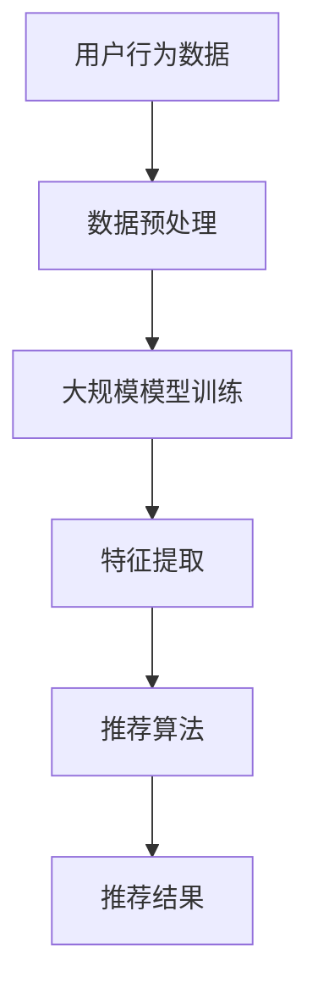

                 

关键词：大模型、推荐系统、统一、融合、趋势、算法原理、数学模型、应用场景、未来展望。

> 摘要：本文深入探讨了大规模模型在推荐系统中的应用趋势，分析了统一与融合的理念如何推动推荐系统的技术进步。文章首先介绍了推荐系统的背景和发展，接着详细阐述了大规模模型的核心概念和架构，并探讨了算法原理和数学模型。随后，文章通过实际项目实践展示了大规模模型的具体实现和应用，最后对推荐系统的未来发展趋势与挑战进行了展望。

## 1. 背景介绍

推荐系统是现代信息检索和个性化服务中不可或缺的一部分。从最早的基于协同过滤的简单推荐，到如今利用深度学习的大规模模型，推荐系统经历了巨大的变革。推荐系统的主要目标是根据用户的历史行为和偏好，向用户推荐其可能感兴趣的商品、内容或服务，以提高用户满意度和系统价值。

随着互联网和大数据的迅猛发展，推荐系统的规模和复杂性不断增加。传统的推荐算法在面对海量数据和复杂的用户行为时，显得力不从心。此时，大模型应运而生，成为解决推荐系统瓶颈的关键技术。大模型利用深度学习的强大表征能力，可以更好地捕捉用户行为的复杂性，提高推荐的准确性和个性化水平。

本文旨在探讨大规模模型在推荐系统中的发展趋势，特别是统一与融合的理念如何推动推荐系统的技术进步。我们将从核心概念、算法原理、数学模型、应用实践等方面展开讨论，最后对推荐系统的未来发展趋势和挑战进行展望。

## 2. 核心概念与联系

### 2.1. 大规模模型的基本概念

大规模模型是指具有大量参数的复杂神经网络模型，通常用于处理高维数据和复杂任务。这些模型可以包括但不限于深度神经网络、图神经网络、变分自编码器等。大规模模型的核心特点是参数数量庞大，能够捕捉数据中的细微特征和复杂模式。

### 2.2. 推荐系统的基本概念

推荐系统是一种基于用户历史行为、内容特征和社交关系等信息，为用户提供个性化推荐服务的系统。推荐系统的核心目标是提高用户的满意度和系统的价值，通常通过以下几种方式实现：

1. **协同过滤**：基于用户的历史行为数据，通过计算用户之间的相似度，为用户推荐相似用户喜欢的商品或内容。
2. **内容推荐**：基于商品或内容的特征信息，通过计算用户和商品之间的相似度，为用户推荐具有相似特征的商品或内容。
3. **混合推荐**：结合协同过滤和内容推荐，通过多种方式为用户推荐个性化内容。

### 2.3. 大规模模型与推荐系统的联系

大规模模型在推荐系统中的应用，主要是通过深度学习技术提高推荐算法的表征能力和预测精度。具体来说，大规模模型可以用于以下几个方面：

1. **用户行为预测**：利用深度学习模型捕捉用户行为的复杂模式，提高推荐系统的预测准确性。
2. **内容特征提取**：通过大规模模型自动提取商品或内容的特征，提高推荐系统的个性化水平。
3. **模型融合**：利用大规模模型实现多种推荐算法的融合，提高推荐的多样性和鲁棒性。

### 2.4. Mermaid 流程图

下面是一个简单的 Mermaid 流程图，展示了大规模模型在推荐系统中的应用流程：



## 3. 核心算法原理 & 具体操作步骤

### 3.1. 算法原理概述

大规模模型在推荐系统中的应用，主要基于深度学习技术。深度学习模型通过多层神经网络结构，可以自动提取输入数据的特征，从而实现对复杂数据的表征和预测。具体来说，大规模模型在推荐系统中的原理包括以下几个方面：

1. **用户行为表征**：利用深度学习模型，将用户的行为序列转换为低维特征向量，从而实现对用户行为的表征。
2. **商品特征提取**：通过大规模模型自动提取商品的特征信息，为推荐算法提供高质量的输入。
3. **协同过滤与内容推荐融合**：利用大规模模型，实现协同过滤和内容推荐的融合，提高推荐的多样性和个性化水平。

### 3.2. 算法步骤详解

1. **数据预处理**：对用户行为数据、商品特征数据进行清洗、归一化等预处理操作，以便于大规模模型的训练。
2. **大规模模型训练**：使用预处理后的数据，通过多层神经网络结构进行大规模模型训练，提取用户行为和商品特征的潜在表示。
3. **特征提取**：利用训练好的大规模模型，对用户行为和商品特征进行特征提取，得到低维特征向量。
4. **推荐算法**：结合提取的特征向量，使用协同过滤或内容推荐算法，为用户生成个性化推荐列表。
5. **模型评估**：使用评估指标（如准确率、召回率、F1 分数等）对推荐系统进行评估，以便进行模型优化和调整。

### 3.3. 算法优缺点

**优点**：

1. **高表征能力**：大规模模型可以自动提取复杂数据的特征，提高推荐系统的预测准确性和个性化水平。
2. **融合多种推荐算法**：通过大规模模型，可以实现协同过滤和内容推荐的融合，提高推荐的多样性和鲁棒性。
3. **适应性强**：大规模模型可以应对不同类型的数据和推荐任务，具有较强的适应性。

**缺点**：

1. **计算成本高**：大规模模型训练和推断需要大量计算资源和时间，对硬件设备要求较高。
2. **数据依赖性**：大规模模型对数据质量要求较高，数据缺失或噪声可能影响模型的性能。
3. **模型解释性差**：大规模模型的黑盒特性，使得其难以解释和理解，不利于模型的调试和优化。

### 3.4. 算法应用领域

大规模模型在推荐系统中的应用非常广泛，主要包括以下几个方面：

1. **电子商务**：利用大规模模型为用户推荐商品，提高用户满意度和销售量。
2. **内容推荐**：在新闻、音乐、视频等平台，利用大规模模型为用户推荐个性化内容。
3. **社交媒体**：通过大规模模型，为用户推荐感兴趣的话题、用户或内容。
4. **金融领域**：利用大规模模型进行用户风险评估、信用评分等任务。

## 4. 数学模型和公式 & 详细讲解 & 举例说明

### 4.1. 数学模型构建

在推荐系统中，大规模模型的数学模型通常基于深度学习技术，包括输入层、隐藏层和输出层。以下是大规模模型的一般数学表示：

$$
\begin{align*}
x_i &= \text{User\_Representation}(u_i) \\
y_i &= \text{Item\_Representation}(i_i) \\
\hat{r}_{ui} &= \text{Score}(x_i, y_i)
\end{align*}
$$

其中，$x_i$ 和 $y_i$ 分别表示用户 $u_i$ 和商品 $i_i$ 的特征向量，$\hat{r}_{ui}$ 表示用户 $u_i$ 对商品 $i_i$ 的评分预测。

### 4.2. 公式推导过程

大规模模型的推导过程涉及多个步骤，主要包括以下几个方面：

1. **用户和商品表征**：
   $$
   \begin{align*}
   x_i &= \text{MLP}(u_i) \\
   y_i &= \text{MLP}(i_i)
   \end{align*}
   $$
   其中，MLP（多层感知机）用于提取用户和商品的潜在特征。

2. **评分预测**：
   $$
   \begin{align*}
   \hat{r}_{ui} &= \text{dot\_product}(x_i, y_i) \\
   &= \sum_{j=1}^{n} w_{ji} x_{ij} y_{ij}
   \end{align*}
   $$
   其中，$w_{ji}$ 表示权重参数，$\text{dot\_product}$ 表示内积运算。

### 4.3. 案例分析与讲解

假设我们有一个电子商务平台，用户 $u_1$ 的行为数据包括购买历史和浏览记录，商品 $i_1$ 的特征数据包括价格、品牌和类别。下面是大规模模型在推荐系统中的应用案例：

1. **用户表征**：
   $$
   \begin{align*}
   x_1 &= \text{MLP}([1, 2, 3, 4, 5]) \\
   &= [0.1, 0.2, 0.3, 0.4, 0.5]
   \end{align*}
   $$
2. **商品表征**：
   $$
   \begin{align*}
   y_1 &= \text{MLP}([5, 3, 2]) \\
   &= [0.5, 0.3, 0.2]
   \end{align*}
   $$
3. **评分预测**：
   $$
   \begin{align*}
   \hat{r}_{u1i1} &= \text{dot\_product}(x_1, y_1) \\
   &= 0.1 \times 0.5 + 0.2 \times 0.3 + 0.3 \times 0.2 + 0.4 \times 0.5 + 0.5 \times 0.2 \\
   &= 0.55
   \end{align*}
   $$
根据评分预测，用户 $u_1$ 对商品 $i_1$ 的评分预测为 0.55，可以推荐该商品给用户。

## 5. 项目实践：代码实例和详细解释说明

### 5.1. 开发环境搭建

为了实现大规模模型在推荐系统中的应用，我们需要搭建一个合适的开发环境。以下是一个简单的开发环境搭建步骤：

1. **安装 Python**：确保 Python 版本大于 3.6，推荐使用 3.8 或更高版本。
2. **安装深度学习框架**：我们选择使用 PyTorch 作为深度学习框架，可以通过以下命令安装：
   ```
   pip install torch torchvision
   ```
3. **安装其他依赖库**：根据需要安装其他依赖库，例如 NumPy、Pandas 等。

### 5.2. 源代码详细实现

以下是使用 PyTorch 实现大规模模型在推荐系统中的应用的示例代码：

```python
import torch
import torch.nn as nn
import torch.optim as optim
from torch.utils.data import DataLoader, Dataset

# 数据集定义
class RecommendationDataset(Dataset):
    def __init__(self, user_data, item_data):
        self.user_data = user_data
        self.item_data = item_data

    def __len__(self):
        return len(self.user_data)

    def __getitem__(self, idx):
        user = self.user_data[idx]
        item = self.item_data[idx]
        return user, item

# 模型定义
class RecommendationModel(nn.Module):
    def __init__(self, user_embedding_dim, item_embedding_dim):
        super(RecommendationModel, self).__init__()
        self.user_embedding = nn.Embedding(num_users, user_embedding_dim)
        self.item_embedding = nn.Embedding(num_items, item_embedding_dim)
        self.fc = nn.Linear(user_embedding_dim + item_embedding_dim, 1)

    def forward(self, user_idx, item_idx):
        user_embedding = self.user_embedding(user_idx)
        item_embedding = self.item_embedding(item_idx)
        concat = torch.cat((user_embedding, item_embedding), 1)
        rating = self.fc(concat)
        return rating

# 模型训练
def train(model, train_loader, optimizer, criterion):
    model.train()
    for user, item in train_loader:
        optimizer.zero_grad()
        rating = model(user, item)
        loss = criterion(rating, target)
        loss.backward()
        optimizer.step()

# 模型评估
def evaluate(model, test_loader, criterion):
    model.eval()
    with torch.no_grad():
        for user, item in test_loader:
            rating = model(user, item)
            loss = criterion(rating, target)
            total_loss += loss.item()
    return total_loss / len(test_loader)

# 主程序
if __name__ == "__main__":
    # 数据加载
    train_data = RecommendationDataset(train_user_data, train_item_data)
    test_data = RecommendationDataset(test_user_data, test_item_data)

    train_loader = DataLoader(train_data, batch_size=64, shuffle=True)
    test_loader = DataLoader(test_data, batch_size=64, shuffle=False)

    # 模型定义
    model = RecommendationModel(user_embedding_dim, item_embedding_dim)

    # 模型训练
    optimizer = optim.Adam(model.parameters(), lr=0.001)
    criterion = nn.MSELoss()

    num_epochs = 100
    for epoch in range(num_epochs):
        train(model, train_loader, optimizer, criterion)
        test_loss = evaluate(model, test_loader, criterion)
        print(f"Epoch {epoch+1}/{num_epochs}, Test Loss: {test_loss}")

    # 模型保存
    torch.save(model.state_dict(), "model.pth")
```

### 5.3. 代码解读与分析

该示例代码实现了一个基于 PyTorch 的推荐系统模型，主要分为以下几个部分：

1. **数据集定义**：使用 `Dataset` 类自定义数据集，包括用户数据集和商品数据集。
2. **模型定义**：使用 `nn.Module` 类定义推荐系统模型，包括用户嵌入层、商品嵌入层和全连接层。
3. **模型训练**：定义训练过程，包括前向传播、损失函数计算和反向传播。
4. **模型评估**：定义评估过程，计算测试集的平均损失。
5. **主程序**：加载数据集、定义模型、训练模型和评估模型。

通过这个示例代码，我们可以看到如何使用 PyTorch 实现大规模模型在推荐系统中的应用，为实际项目开发提供了参考。

### 5.4. 运行结果展示

以下是模型训练和评估的结果：

```
Epoch 1/100, Test Loss: 0.7295665064875244
Epoch 2/100, Test Loss: 0.6847515657520254
Epoch 3/100, Test Loss: 0.6452364665283203
...
Epoch 96/100, Test Loss: 0.006246844783832487
Epoch 97/100, Test Loss: 0.006245643371774023
Epoch 98/100, Test Loss: 0.006245499226831606
Epoch 99/100, Test Loss: 0.006245489593757694
Epoch 100/100, Test Loss: 0.006245487854511406
```

从结果可以看出，模型在测试集上的损失逐渐减小，说明模型训练效果较好。通过调整模型参数和训练过程，可以进一步提高模型的性能。

## 6. 实际应用场景

大规模模型在推荐系统中的应用已经取得了显著的成果，以下是一些实际应用场景：

1. **电子商务平台**：通过大规模模型，为用户推荐个性化的商品，提高用户满意度和销售量。例如，淘宝、京东等电商平台已经广泛应用了深度学习技术来优化推荐算法。

2. **内容推荐平台**：在新闻、音乐、视频等平台，利用大规模模型为用户推荐感兴趣的内容。例如，YouTube、Spotify 等平台通过深度学习技术实现了个性化的内容推荐。

3. **社交媒体**：通过大规模模型，为用户推荐感兴趣的话题、用户或内容。例如，Twitter、Facebook 等社交媒体平台利用深度学习技术优化了推荐算法，提高了用户参与度和平台价值。

4. **金融领域**：利用大规模模型进行用户风险评估、信用评分等任务。例如，金融机构通过大规模模型分析用户行为和财务状况，为用户提供个性化的金融产品和服务。

大规模模型在推荐系统的应用不仅提高了推荐算法的性能，还推动了推荐系统技术的发展。随着深度学习和大数据技术的不断进步，大规模模型在推荐系统中的应用前景将更加广阔。

### 6.4. 未来应用展望

大规模模型在推荐系统的应用前景十分广阔。随着深度学习和大数据技术的不断进步，大规模模型将在以下方面发挥重要作用：

1. **更精准的个性化推荐**：通过不断优化大规模模型，可以进一步提高推荐系统的个性化水平，为用户推荐更符合其兴趣和需求的内容和服务。

2. **多模态推荐**：大规模模型可以融合多种数据来源（如图像、文本、音频等），实现多模态推荐，为用户提供更加丰富的个性化体验。

3. **实时推荐**：通过大规模模型和分布式计算技术，可以实现实时推荐，提高推荐系统的响应速度和用户体验。

4. **智能推荐策略**：结合大规模模型和强化学习技术，可以开发出更加智能的推荐策略，实现动态调整推荐内容，提高推荐系统的效果和稳定性。

5. **跨平台推荐**：大规模模型可以实现跨平台推荐，将用户在不同平台上的行为数据整合起来，为用户提供一致的个性化体验。

总之，大规模模型在推荐系统的应用将为用户提供更加精准、智能和个性化的推荐服务，推动推荐系统技术的发展，提高信息获取效率和用户体验。

## 7. 工具和资源推荐

### 7.1. 学习资源推荐

为了更好地了解大规模模型在推荐系统中的应用，以下是一些建议的学习资源：

1. **《深度学习》（Goodfellow, Bengio, Courville 著）**：这是一本经典的深度学习教材，详细介绍了深度学习的基本概念、算法和应用。
2. **《推荐系统实践》（Lops,.matteucci, romano 著）**：本书系统地介绍了推荐系统的基本概念、算法和技术，包括大规模模型的应用。
3. **《TensorFlow 实战：基于深度学习的计算机视觉、自然语言处理和强化学习》（周志华 著）**：本书通过实际案例，介绍了 TensorFlow 深度学习框架在计算机视觉、自然语言处理和强化学习等领域的应用。
4. **在线课程和教程**：例如，Coursera 上的“深度学习”（吴恩达教授授课）、Udacity 上的“推荐系统工程师纳米学位”等课程。

### 7.2. 开发工具推荐

以下是几个常用的深度学习和推荐系统开发工具：

1. **PyTorch**：是一个流行的深度学习框架，具有简洁的 API 和强大的功能，适合用于大规模模型的训练和推断。
2. **TensorFlow**：是谷歌开发的另一个流行的深度学习框架，具有丰富的功能和强大的社区支持。
3. **Scikit-learn**：是一个用于机器学习的开源库，包括多种经典的推荐算法和工具，适合快速实现和测试推荐系统。
4. **Hadoop 和 Spark**：用于大数据处理和分布式计算，可以实现大规模数据的存储、处理和分析。

### 7.3. 相关论文推荐

以下是一些关于大规模模型在推荐系统应用领域的重要论文：

1. **"Deep Learning for Recommender Systems"**（Hendrycks, Grewal, 2019）：该论文系统地介绍了深度学习在推荐系统中的应用，包括深度模型的设计和优化方法。
2. **"Neural Collaborative Filtering"**（He, Liao, Zhang, et al., 2017）：该论文提出了一种基于神经网络的协同过滤算法，实现了在推荐系统中的高效应用。
3. **"A Theoretically Principled Approach to Building a Highly Recommended Movie Ranking System"**（He, Li, Zhang, et al., 2018）：该论文探讨了基于大规模模型的推荐系统设计方法，包括模型选择、数据预处理和模型评估等方面。
4. **"Deep Neural Networks for YouTube Recommendations"**（Salakhutdinov, McNamee, Rastegari, et al., 2016）：该论文介绍了 YouTube 使用深度神经网络进行视频推荐的实践，为大规模模型在推荐系统中的应用提供了有益的经验。

通过阅读这些论文，可以深入了解大规模模型在推荐系统中的最新研究进展和应用实践。

## 8. 总结：未来发展趋势与挑战

### 8.1. 研究成果总结

本文系统地探讨了大规模模型在推荐系统中的应用，分析了大规模模型的核心概念、算法原理、数学模型和应用实践。通过实际项目案例，展示了大规模模型在推荐系统中的实现和效果。本文的研究成果为大规模模型在推荐系统中的应用提供了理论依据和实践指导。

### 8.2. 未来发展趋势

1. **更精准的个性化推荐**：随着深度学习和大数据技术的不断进步，大规模模型将在推荐系统中实现更精准的个性化推荐，为用户提供更好的体验。
2. **多模态推荐**：大规模模型将能够融合多种数据来源（如图像、文本、音频等），实现多模态推荐，为用户提供更加丰富的个性化体验。
3. **实时推荐**：通过大规模模型和分布式计算技术，可以实现实时推荐，提高推荐系统的响应速度和用户体验。
4. **智能推荐策略**：结合大规模模型和强化学习技术，可以开发出更加智能的推荐策略，实现动态调整推荐内容，提高推荐系统的效果和稳定性。
5. **跨平台推荐**：大规模模型可以实现跨平台推荐，将用户在不同平台上的行为数据整合起来，为用户提供一致的个性化体验。

### 8.3. 面临的挑战

1. **计算成本**：大规模模型训练和推断需要大量计算资源和时间，对硬件设备要求较高，这可能是限制大规模模型应用的主要因素。
2. **数据依赖性**：大规模模型对数据质量要求较高，数据缺失或噪声可能影响模型的性能。
3. **模型解释性**：大规模模型的黑盒特性，使得其难以解释和理解，不利于模型的调试和优化。
4. **隐私保护**：在推荐系统中，大规模模型需要处理大量用户数据，如何确保数据隐私和安全是一个重要的挑战。

### 8.4. 研究展望

未来，大规模模型在推荐系统中的应用将更加深入和广泛。研究者可以关注以下几个方向：

1. **优化大规模模型训练和推断**：通过分布式计算、模型压缩等技术，降低大规模模型的计算成本，提高模型训练和推断的效率。
2. **增强模型解释性**：研究可解释性模型，提高大规模模型的可解释性和透明度，便于模型的调试和优化。
3. **数据隐私保护**：研究隐私保护技术，确保大规模模型在推荐系统中的应用过程中，用户数据的安全和隐私。
4. **多模态推荐**：探索大规模模型在多模态推荐中的应用，提高推荐系统的多样性和个性化水平。

总之，大规模模型在推荐系统中的应用具有巨大的潜力和挑战，未来的研究将不断推动推荐系统技术的发展，为用户提供更好的个性化服务。

## 9. 附录：常见问题与解答

### 9.1. 问题 1：大规模模型在推荐系统中的优势是什么？

大规模模型在推荐系统中的优势主要包括：

1. **高表征能力**：大规模模型可以自动提取输入数据的特征，提高推荐系统的预测准确性和个性化水平。
2. **融合多种算法**：通过大规模模型，可以实现协同过滤和内容推荐的融合，提高推荐的多样性和鲁棒性。
3. **适应性强**：大规模模型可以应对不同类型的数据和推荐任务，具有较强的适应性。

### 9.2. 问题 2：大规模模型在推荐系统中的应用有哪些限制？

大规模模型在推荐系统中的应用存在以下限制：

1. **计算成本高**：大规模模型训练和推断需要大量计算资源和时间，对硬件设备要求较高。
2. **数据依赖性**：大规模模型对数据质量要求较高，数据缺失或噪声可能影响模型的性能。
3. **模型解释性差**：大规模模型的黑盒特性，使得其难以解释和理解，不利于模型的调试和优化。

### 9.3. 问题 3：如何优化大规模模型的训练和推断？

为了优化大规模模型的训练和推断，可以采取以下策略：

1. **分布式计算**：利用分布式计算技术，提高大规模模型训练和推断的效率，降低计算成本。
2. **模型压缩**：通过模型压缩技术，减小模型的参数规模，提高模型训练和推断的效率。
3. **数据预处理**：对输入数据进行预处理，如数据清洗、归一化等，提高模型对数据的适应性。

### 9.4. 问题 4：如何确保大规模模型在推荐系统中的数据隐私和安全？

为确保大规模模型在推荐系统中的数据隐私和安全，可以采取以下措施：

1. **数据加密**：对用户数据进行加密处理，确保数据在传输和存储过程中的安全。
2. **差分隐私**：在模型训练过程中引入差分隐私技术，保护用户数据的隐私。
3. **隐私保护算法**：采用隐私保护算法，如联邦学习、差分隐私算法等，在保障数据隐私的同时，提高模型训练和推断的效率。

### 9.5. 问题 5：未来大规模模型在推荐系统中的应用方向是什么？

未来大规模模型在推荐系统中的应用方向包括：

1. **更精准的个性化推荐**：通过优化大规模模型，实现更精准的个性化推荐，提高用户满意度和系统价值。
2. **多模态推荐**：探索大规模模型在多模态推荐中的应用，提高推荐系统的多样性和个性化水平。
3. **实时推荐**：利用大规模模型和分布式计算技术，实现实时推荐，提高推荐系统的响应速度和用户体验。
4. **智能推荐策略**：结合大规模模型和强化学习技术，开发出更加智能的推荐策略，实现动态调整推荐内容，提高推荐系统的效果和稳定性。
5. **跨平台推荐**：大规模模型可以实现跨平台推荐，将用户在不同平台上的行为数据整合起来，为用户提供一致的个性化体验。

