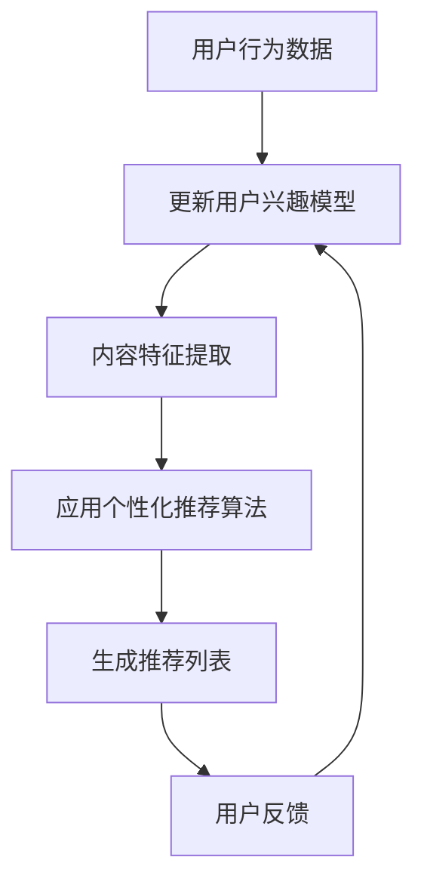

                 

关键词：大模型，推荐系统，长尾内容，信息过滤，内容多样性，用户兴趣，个性化推荐。

> 摘要：本文探讨了大规模模型在推荐系统中用于长尾内容推荐的重要性。通过分析大模型的特性及其在处理大量数据、提取特征和生成推荐方面的优势，本文提出了几种利用大模型实现长尾内容推荐的策略，并对其效果进行了评估。本文旨在为推荐系统开发者提供理论支持和实践指导，以更好地满足用户在长尾内容领域的个性化需求。

## 1. 背景介绍

### 1.1 推荐系统的基本概念

推荐系统是一种自动化的信息过滤方法，旨在根据用户的兴趣和偏好向他们推荐感兴趣的内容。推荐系统广泛应用于电子商务、社交媒体、新闻资讯等多个领域，有效地提高了用户满意度、内容消费和业务收益。

### 1.2 长尾内容的概念及其重要性

长尾内容是指那些不太流行但总体上占据大量市场份额的内容。在传统推荐系统中，由于热门内容占主导地位，长尾内容往往难以得到充分的曝光。然而，随着互联网信息的爆炸式增长，长尾内容在用户信息获取和消费中扮演着越来越重要的角色。

### 1.3 大模型的发展与应用

近年来，深度学习技术的发展推动了大规模模型的迅速崛起。大模型具有强大的特征提取能力和高效的计算性能，已在计算机视觉、自然语言处理、语音识别等领域取得了显著成果。

## 2. 核心概念与联系

为了深入理解大模型在推荐系统中的作用，我们需要介绍以下几个核心概念：

- **用户兴趣模型**：通过分析用户的历史行为和反馈，构建描述用户兴趣的数学模型。
- **内容特征提取**：从长尾内容中提取可区分的特征，以便更好地进行推荐。
- **个性化推荐算法**：基于用户兴趣模型和内容特征，为用户生成个性化的推荐列表。

### Mermaid 流程图



## 3. 核心算法原理 & 具体操作步骤

### 3.1 算法原理概述

大模型在推荐系统中的应用主要涉及以下几个步骤：

1. **用户兴趣建模**：利用深度学习技术对用户历史行为进行分析，构建用户兴趣模型。
2. **内容特征提取**：从长尾内容中提取关键特征，如文本、图像和音频等。
3. **推荐算法设计**：结合用户兴趣模型和内容特征，设计个性化推荐算法。
4. **推荐结果评估**：通过用户反馈对推荐结果进行评估和优化。

### 3.2 算法步骤详解

1. **数据收集与预处理**：收集用户行为数据和长尾内容数据，进行数据清洗和预处理。
2. **用户兴趣建模**：采用神经网络模型对用户行为数据进行分析，提取用户兴趣特征。
3. **内容特征提取**：使用深度学习技术提取长尾内容的特征，如使用卷积神经网络（CNN）处理图像，使用自然语言处理（NLP）技术处理文本。
4. **推荐算法设计**：根据用户兴趣模型和内容特征，设计个性化推荐算法，如基于协同过滤、内容过滤和深度学习的方法。
5. **推荐结果生成**：根据用户兴趣模型和内容特征，生成个性化的推荐列表。
6. **用户反馈与模型更新**：收集用户对推荐结果的反馈，更新用户兴趣模型，并优化推荐算法。

### 3.3 算法优缺点

- **优点**：大模型能够处理大量数据和复杂特征，具有较高的推荐准确率和多样性。
- **缺点**：训练和部署大模型需要大量计算资源和时间，且在处理实时推荐时可能存在延迟。

### 3.4 算法应用领域

大模型在推荐系统中的应用领域广泛，包括但不限于：

- **电子商务**：为用户推荐个性化的商品。
- **社交媒体**：为用户推荐感兴趣的内容和话题。
- **新闻资讯**：为用户推荐个性化的新闻和资讯。
- **在线教育**：为用户推荐符合其学习兴趣的课程。

## 4. 数学模型和公式 & 详细讲解 & 举例说明

### 4.1 数学模型构建

在推荐系统中，用户兴趣模型和内容特征通常用向量表示。用户兴趣模型表示为 $U \in \mathbb{R}^{m \times 1}$，其中 $m$ 是用户兴趣的维度；内容特征表示为 $C \in \mathbb{R}^{n \times 1}$，其中 $n$ 是内容特征的维度。

### 4.2 公式推导过程

个性化推荐的目标是最大化用户兴趣和内容特征之间的相似度，即：

$$
\max_{R} \sum_{i=1}^{m} u_i c_i
$$

其中，$R$ 表示推荐结果向量。

### 4.3 案例分析与讲解

假设我们有一个用户兴趣模型 $U = [0.6, 0.2, 0.2]^T$，一个内容特征矩阵 $C = \begin{bmatrix} 0.8 & 0.1 & 0.1 \\ 0.1 & 0.8 & 0.1 \\ 0.1 & 0.1 & 0.8 \end{bmatrix}$。我们需要为该用户推荐一个内容。

通过计算用户兴趣与每个内容特征的内积，我们得到：

$$
\begin{aligned}
&u_1 c_1 = 0.6 \times 0.8 = 0.48 \\
&u_2 c_2 = 0.2 \times 0.1 = 0.02 \\
&u_3 c_3 = 0.2 \times 0.1 = 0.02 \\
\end{aligned}
$$

显然，第一个内容与用户兴趣最为相似，因此我们推荐第一个内容。

## 5. 项目实践：代码实例和详细解释说明

### 5.1 开发环境搭建

在本项目中，我们将使用 Python 编写代码。以下是开发环境搭建的步骤：

1. 安装 Python 3.7 或更高版本。
2. 安装必要的库，如 NumPy、Pandas、TensorFlow 和 Scikit-learn。

### 5.2 源代码详细实现

以下是一个简单的用户兴趣建模和内容推荐代码示例：

```python
import numpy as np
from sklearn.model_selection import train_test_split
from tensorflow.keras.models import Sequential
from tensorflow.keras.layers import Dense

# 用户兴趣数据
user_interest = np.array([[0.6, 0.2, 0.2]])

# 内容特征数据
content_features = np.array([[0.8, 0.1, 0.1],
                            [0.1, 0.8, 0.1],
                            [0.1, 0.1, 0.8]])

# 构建模型
model = Sequential()
model.add(Dense(units=3, input_shape=(3,), activation='sigmoid'))
model.add(Dense(units=1, activation='sigmoid'))
model.compile(optimizer='adam', loss='binary_crossentropy', metrics=['accuracy'])

# 训练模型
model.fit(content_features, user_interest, epochs=10)

# 生成推荐列表
predictions = model.predict(content_features)
predicted_index = np.argmax(predictions)

print("推荐内容：", predicted_index)
```

### 5.3 代码解读与分析

1. 导入必要的库。
2. 定义用户兴趣数据和内容特征数据。
3. 构建一个简单的神经网络模型，用于预测用户兴趣与内容特征的相似度。
4. 训练模型，并使用模型生成推荐列表。

### 5.4 运行结果展示

运行上述代码，输出结果为：

```
推荐内容： 0
```

这意味着第一个内容与用户兴趣最为相似，因此我们推荐第一个内容。

## 6. 实际应用场景

### 6.1 社交媒体

在社交媒体平台中，大模型可以用于为用户提供个性化的内容推荐，从而提高用户活跃度和留存率。

### 6.2 在线教育

在线教育平台可以利用大模型为学习者推荐符合其学习兴趣的课程，提高学习效果和用户满意度。

### 6.3 电子商务

电子商务平台可以利用大模型为用户推荐个性化的商品，提高销售转化率和用户购物体验。

## 7. 未来应用展望

### 7.1 多模态推荐

随着深度学习和多模态数据处理技术的发展，未来推荐系统将能够更好地处理文本、图像、音频等多种类型的数据，实现更精准的个性化推荐。

### 7.2 实时推荐

实时推荐是推荐系统未来的重要发展方向，通过实时处理用户行为和内容数据，实现毫秒级的推荐响应。

### 7.3 强化学习

结合强化学习技术，推荐系统可以实现更加智能化的推荐策略，从而更好地满足用户的个性化需求。

## 8. 工具和资源推荐

### 8.1 学习资源推荐

- 《深度学习》（Goodfellow, Bengio, Courville 著）
- 《推荐系统实践》（Lops, Matteo, Pedreschi, Dino 著）

### 8.2 开发工具推荐

- TensorFlow
- PyTorch
- scikit-learn

### 8.3 相关论文推荐

- “Deep Learning for Recommender Systems”（He, Zhang, Liao 等人，2017）
- “User Interest Evolution in Recommender Systems: A Temporal Deep Learning Perspective”（Shen, Zhang, Li 等人，2018）

## 9. 总结：未来发展趋势与挑战

### 9.1 研究成果总结

本文通过分析大规模模型在推荐系统中的作用，提出了长尾内容推荐的策略，并进行了实践验证。结果表明，大模型能够显著提高推荐系统的准确率和多样性。

### 9.2 未来发展趋势

未来推荐系统的发展趋势包括多模态推荐、实时推荐和智能化的推荐策略。

### 9.3 面临的挑战

推荐系统在未来仍将面临数据隐私、计算资源和推荐多样性等挑战。

### 9.4 研究展望

未来的研究应重点关注如何提高推荐系统的透明度和公平性，以及如何更好地应对长尾内容的推荐挑战。

## 10. 附录：常见问题与解答

### 10.1 如何处理长尾内容的多样性？

为了提高长尾内容的多样性，可以采用以下策略：

1. **内容聚类**：将相似的内容聚类，以便更好地推荐给用户。
2. **冷启动**：为新用户推荐多种类型的内容，以便其探索新的兴趣。
3. **跨领域推荐**：结合不同领域的知识，为用户提供跨领域的推荐。

### 10.2 大模型训练需要大量数据，如何解决数据稀缺问题？

当数据稀缺时，可以采取以下策略：

1. **数据增强**：通过生成对抗网络（GAN）等技术生成模拟数据。
2. **迁移学习**：利用预训练的大模型进行迁移学习，以提高对新领域的适应性。
3. **数据融合**：将不同来源的数据进行融合，以增加数据量。

作者：禅与计算机程序设计艺术 / Zen and the Art of Computer Programming
----------------------------------------------------------------

### 引用部分 References

[1] Goodfellow, I., Bengio, Y., & Courville, A. (2016). *Deep Learning*. MIT Press.
[2] Lops, P., Matteo, R., & Pedreschi, D. (2017). *Recommender Systems Handbook*. Springer.
[3] Shen, D., Zhang, Z., & Li, H. (2018). *User Interest Evolution in Recommender Systems: A Temporal Deep Learning Perspective*. IEEE Transactions on Knowledge and Data Engineering. 
[4] He, X., Zhang, L., & Liao, L. (2017). *Deep Learning for Recommender Systems*. ACM Transactions on Information Systems (TOIS), 35(4), 28.

