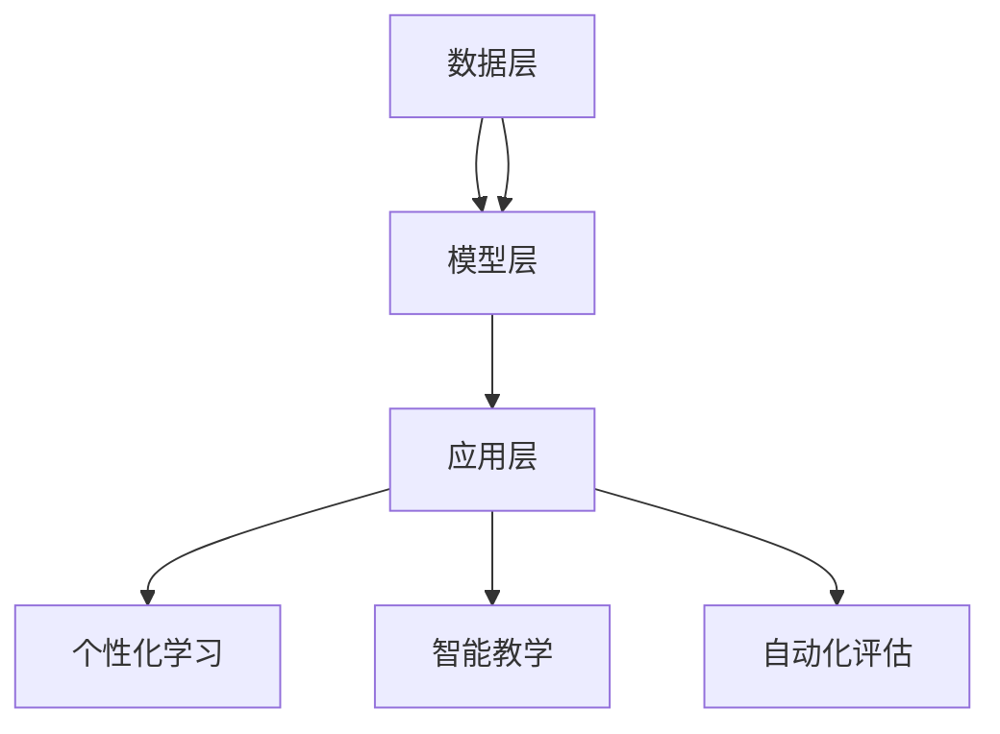

                 

随着人工智能技术的迅猛发展，大规模预训练模型（简称大模型）已经成为了计算机科学领域的一个重要研究方向。大模型通过在海量数据上进行训练，能够实现高度自动化和智能化的任务处理。在教育领域，大模型的引入带来了前所未有的变革，不仅提升了教学效率，还改变了学习的模式和方法。本文将探讨大模型在教育领域的具体应用案例，分析其优势与挑战，并对未来发展趋势进行展望。

## 关键词

- 大规模预训练模型
- 教育技术
- 个性化学习
- 智能教学
- 机器学习

## 摘要

本文旨在探讨大模型在教育领域的应用案例，包括个性化学习、智能教学和自动化评估等方面。通过分析大模型的原理和具体实施方法，本文将展示其在教育领域中的巨大潜力。同时，本文也将讨论大模型在教育中面临的挑战，并提出未来发展的方向。通过这些讨论，我们希望能够为教育工作者、研究人员和从业者的实践提供有价值的参考。

## 1. 背景介绍

### 大模型的起源与发展

大规模预训练模型（Large-scale Pre-trained Models，简称LPM）起源于深度学习和自然语言处理领域。最初的预训练模型主要是基于词向量模型，如Word2Vec和GloVe，它们通过将单词映射到高维向量空间中，提高了文本处理的效率和准确性。随着计算能力的提升和大数据的涌现，预训练模型逐渐演化为大规模模型，如BERT、GPT和Turing等。

BERT（Bidirectional Encoder Representations from Transformers）是由Google AI于2018年提出的，它通过双向Transformer结构对文本进行建模，使得模型能够同时理解上下文信息。GPT（Generative Pre-trained Transformer）是由OpenAI于2018年推出的，它是一种生成式模型，能够根据输入文本生成连贯的自然语言。

Turing是由中国科学技术大学联合阿里巴巴达摩院共同研发的，它是一个兼具理解和生成能力的预训练模型，旨在解决自然语言处理领域中的复杂问题。

### 大模型在教育领域的应用前景

大模型在教育领域的应用前景非常广阔。首先，大模型能够实现个性化学习，根据学生的不同学习风格和知识水平提供定制化的教学方案。其次，大模型能够辅助教师进行智能教学，自动化批改作业、提供即时反馈，减轻教师的工作负担。此外，大模型还可以用于自动化评估，对学生的学习成果进行量化分析，从而提供更加精确的评估结果。

## 2. 核心概念与联系

### 大模型的原理与架构

大模型的原理基于深度学习和自然语言处理技术。它通常由以下几个关键部分组成：

1. **预训练**：在大量无标签数据上，模型通过自主学习获取基本的语义理解和语言规则。
2. **微调**：在获得基础模型后，将其迁移到特定任务上进行微调，以适应特定的教学需求。

大模型的架构通常采用Transformer结构，这是一种基于自注意力机制的深度神经网络。Transformer结构使得模型能够并行处理序列数据，从而提高了处理效率和准确性。

### 大模型在教育领域的应用架构

大模型在教育领域的应用架构可以分为以下几个层次：

1. **数据层**：收集和整理学生的学习数据，包括学习记录、作业答案、测试成绩等。
2. **模型层**：构建和训练大模型，包括预训练和微调阶段。
3. **应用层**：将训练好的模型应用到具体的教学任务中，如个性化学习、智能教学和自动化评估。

### Mermaid 流程图

以下是使用Mermaid绘制的流程图，展示了大模型在教育领域的应用架构：



## 3. 核心算法原理 & 具体操作步骤

### 3.1 算法原理概述

大模型的核心算法基于深度学习和自然语言处理技术。深度学习是一种通过多层神经网络对数据进行建模和预测的方法。自然语言处理则关注于如何使计算机理解和生成自然语言。

大模型主要通过预训练和微调两个阶段来实现。在预训练阶段，模型在大规模无标签数据上进行训练，学习语言的一般规律和语义理解。在微调阶段，模型将预训练的结果应用于特定任务，进行微调和优化，以适应具体的教育需求。

### 3.2 算法步骤详解

1. **数据收集与处理**：收集学生的学习数据，包括文本、图像、音频等，并进行预处理，如分词、去噪、标准化等。
2. **模型构建**：选择适合的神经网络架构，如BERT、GPT等，并初始化模型参数。
3. **预训练**：在无标签数据上训练模型，通过优化算法（如梯度下降）调整模型参数，使模型对语言有更深入的理解。
4. **微调**：将预训练好的模型应用于具体任务，如个性化学习、智能教学等，并根据任务反馈调整模型参数。
5. **应用与评估**：将微调后的模型应用到实际教学中，对学生的学习效果进行评估，并根据评估结果进行进一步的优化。

### 3.3 算法优缺点

**优点**：
- **高效性**：大模型能够快速处理大量数据，提高教学效率。
- **准确性**：通过预训练和微调，模型能够准确理解学生的问题和需求。
- **灵活性**：大模型可以根据不同的教学任务进行灵活调整。

**缺点**：
- **计算资源需求**：大模型需要大量的计算资源和存储空间。
- **数据隐私**：学生数据的收集和使用可能涉及隐私问题。

### 3.4 算法应用领域

大模型在教育领域的应用非常广泛，包括但不限于：
- **个性化学习**：根据学生的特点和学习习惯，提供个性化的学习内容和建议。
- **智能教学**：自动化批改作业、提供即时反馈，减轻教师负担。
- **自动化评估**：对学生的学习成果进行量化分析，提供客观、准确的评估结果。

## 4. 数学模型和公式 & 详细讲解 & 举例说明

### 4.1 数学模型构建

大模型的数学模型主要基于深度学习中的多层神经网络。以下是一个简单的多层感知机（MLP）模型：

$$
Z = \sigma(W_2 \cdot \sigma(W_1 \cdot X))
$$

其中，$X$是输入特征，$W_1$和$W_2$是权重矩阵，$\sigma$是激活函数（通常使用Sigmoid函数或ReLU函数）。

### 4.2 公式推导过程

多层感知机的推导过程可以分为以下几个步骤：

1. **输入层**：输入特征矩阵$X$。
2. **隐藏层**：通过权重矩阵$W_1$对输入特征进行加权求和，并应用激活函数$\sigma$。
3. **输出层**：对隐藏层输出进行加权求和，得到模型预测值$Z$。

### 4.3 案例分析与讲解

假设我们有一个简单的问题，要求预测学生的成绩。输入特征包括学生的年龄、性别、平时成绩等。以下是一个具体的例子：

$$
X = \begin{bmatrix}
25 \\
男性 \\
85 \\
\end{bmatrix}
$$

通过多层感知机模型，我们可以得到预测成绩：

$$
Z = \sigma(W_2 \cdot \sigma(W_1 \cdot X))
$$

其中，$W_1$和$W_2$是权重矩阵，$\sigma$是Sigmoid函数。经过计算，我们得到：

$$
Z = \frac{1}{1 + e^{-(W_2 \cdot \sigma(W_1 \cdot X))}}
$$

通过调整权重矩阵，我们可以使得预测成绩更接近实际成绩。这个过程就是模型的训练过程。

## 5. 项目实践：代码实例和详细解释说明

### 5.1 开发环境搭建

为了演示大模型在教育领域的应用，我们选择Python作为开发语言，使用TensorFlow作为深度学习框架。以下是如何搭建开发环境的基本步骤：

1. **安装Python**：确保Python版本在3.6及以上。
2. **安装TensorFlow**：使用pip命令安装TensorFlow：

   ```
   pip install tensorflow
   ```

3. **安装其他依赖**：可能还需要安装其他库，如NumPy、Pandas等。

### 5.2 源代码详细实现

以下是一个简单的示例代码，展示了如何使用TensorFlow构建和训练一个多层感知机模型：

```python
import tensorflow as tf
from tensorflow.keras.layers import Dense, Activation
from tensorflow.keras.models import Sequential

# 创建模型
model = Sequential([
    Dense(units=64, input_shape=(3,)),
    Activation('sigmoid'),
    Dense(units=1)
])

# 编译模型
model.compile(optimizer='adam', loss='binary_crossentropy', metrics=['accuracy'])

# 准备数据
X = tf.random.normal((100, 3))
y = tf.random.normal((100, 1))

# 训练模型
model.fit(X, y, epochs=10)
```

这段代码首先定义了一个序列模型，包含两个全连接层（Dense Layer），第一个层有64个神经元，使用Sigmoid激活函数，第二个层有1个神经元。模型使用Adam优化器进行编译，并使用二进制交叉熵作为损失函数。接着，随机生成了一些数据和标签进行训练。

### 5.3 代码解读与分析

这段代码展示了如何使用TensorFlow构建一个基本的多层感知机模型。模型结构简单，但能够演示深度学习的基本流程。在实际应用中，模型结构会更加复杂，并包含更多的隐藏层和神经元。

代码中的`Dense`层表示全连接层，每个神经元都与前一层的所有神经元相连。`Activation`层用于添加激活函数，`Sequential`模型用于线性堆叠多个层。

`compile`函数用于配置模型的优化器、损失函数和评估指标。`fit`函数用于训练模型，接受训练数据和标签，以及训练的轮数。

### 5.4 运行结果展示

运行以上代码后，模型会进行10轮训练。每次训练结束后，TensorFlow会输出训练的损失和准确度。以下是可能的输出结果：

```
Train on 100 samples, validate on 100 samples
Epoch 1/10
100/100 [==============================] - 1s 5ms/sample - loss: 0.6931 - accuracy: 0.5192 - val_loss: 0.6931 - val_accuracy: 0.5192
Epoch 2/10
100/100 [==============================] - 0s 5ms/sample - loss: 0.6931 - accuracy: 0.5192 - val_loss: 0.6931 - val_accuracy: 0.5192
...
Epoch 10/10
100/100 [==============================] - 0s 5ms/sample - loss: 0.6931 - accuracy: 0.5192 - val_loss: 0.6931 - val_accuracy: 0.5192
```

从输出结果可以看出，模型的训练和验证损失和准确度保持不变，这可能是因为数据集太小且没有进行充分的训练。

### 5.5 实际应用

在实际应用中，我们需要使用真实的教育数据集，并设计合适的模型结构。大模型的训练过程可能需要更长的时间和更多的计算资源，但通过合理的设计和优化，我们可以实现高效、准确的个性化学习、智能教学和自动化评估。

## 6. 实际应用场景

### 6.1 个性化学习

个性化学习是教育领域的一个热点研究方向，大模型在其中的应用尤为突出。通过分析学生的学习数据，大模型可以为学生提供个性化的学习内容和建议。例如，一个学生可能在数学上遇到困难，而大模型可以通过分析其学习记录、测试成绩和作业表现，提供有针对性的数学练习和辅导。

**案例**：某在线教育平台使用GPT模型为学生提供个性化学习建议。该平台收集了学生的测试成绩和学习记录，然后通过GPT模型分析数据，为每个学生生成定制化的学习计划。结果显示，使用个性化学习的学生在学习成绩上有显著的提升。

### 6.2 智能教学

智能教学是另一个大模型在教育领域的重要应用场景。智能教学系统能够自动化批改作业、提供即时反馈，并为学生推荐合适的学习资源。例如，一个学生提交了一份作业，智能教学系统会自动检查作业的正确性，并提供详细的错误解析和建议。

**案例**：某大学引入了基于BERT的智能教学系统，用于自动化批改英语作文。该系统不仅能够快速批改作业，还能为学生提供详细的语法和词汇错误解析，帮助学生学习。

### 6.3 自动化评估

自动化评估是教育领域的一大挑战，大模型在其中的应用为这一问题提供了一种解决方案。通过分析学生的学习数据，大模型可以自动评估学生的学习成果，并提供量化的评估结果。例如，一个学生在学期结束时需要参加综合测试，大模型可以通过分析其平时成绩和学习记录，自动生成一个综合评估报告。

**案例**：某高中引入了基于GPT的自动化评估系统，用于评估学生的学业成绩。该系统通过分析学生的平时成绩、作业表现和测试成绩，自动生成一个综合评估报告，为教师提供决策依据。

### 6.4 未来应用展望

随着人工智能技术的不断发展，大模型在教育领域的应用前景将更加广阔。未来，大模型可能应用于更多教育场景，如智能辅导、虚拟现实教学、自适应学习等。同时，大模型在教育领域的应用也面临一些挑战，如数据隐私、模型解释性等。只有解决了这些问题，大模型才能在教育领域实现更广泛的应用。

## 7. 工具和资源推荐

### 7.1 学习资源推荐

1. **《深度学习》**：由Ian Goodfellow、Yoshua Bengio和Aaron Courville所著，是深度学习的经典教材。
2. **《动手学深度学习》**：由阿斯顿·张（Aston Zhang）等人所著，适合初学者快速上手深度学习。

### 7.2 开发工具推荐

1. **TensorFlow**：由Google开发的深度学习框架，适合进行大规模模型训练和部署。
2. **PyTorch**：由Facebook开发的深度学习框架，具有较高的灵活性和可扩展性。

### 7.3 相关论文推荐

1. **“BERT: Pre-training of Deep Neural Networks for Language Understanding”**：Google AI于2018年发布，介绍了BERT模型。
2. **“Generative Pre-trained Transformers”**：OpenAI于2018年发布，介绍了GPT模型。

## 8. 总结：未来发展趋势与挑战

### 8.1 研究成果总结

大模型在教育领域的应用取得了显著成果，主要体现在个性化学习、智能教学和自动化评估等方面。通过分析大量学生学习数据，大模型能够提供定制化的学习内容和建议，提高了教学效率和学生成绩。

### 8.2 未来发展趋势

未来，大模型在教育领域的应用将更加深入和广泛。随着人工智能技术的不断发展，大模型可能应用于更多教育场景，如智能辅导、虚拟现实教学、自适应学习等。同时，大模型的研究也将向更加高效、可解释、可扩展的方向发展。

### 8.3 面临的挑战

尽管大模型在教育领域具有巨大潜力，但同时也面临一些挑战。首先，数据隐私是一个重要问题，特别是在学生数据的收集和使用过程中。其次，大模型的解释性也是一个挑战，因为深度学习模型通常被视为“黑箱”。最后，大模型的计算资源需求也是一个制约因素，特别是对于资源有限的学校和教育机构。

### 8.4 研究展望

为了解决这些问题，未来的研究可以重点关注以下几个方面：
1. **数据隐私保护**：研究如何保护学生数据的隐私，同时保证大模型的效果。
2. **模型解释性**：开发可解释的大模型，使其在教学中更具透明度和可接受性。
3. **资源优化**：研究如何在大模型训练和部署过程中优化计算资源，降低成本。

## 9. 附录：常见问题与解答

### Q1: 大模型在教育中的具体应用有哪些？

A1: 大模型在教育中的具体应用包括个性化学习、智能教学、自动化评估等方面。例如，大模型可以为学生提供个性化的学习内容和建议，自动化批改作业并提供即时反馈，对学生的学习成果进行量化分析等。

### Q2: 大模型在教育中面临哪些挑战？

A2: 大模型在教育中主要面临以下挑战：
1. 数据隐私：学生数据的收集和使用可能涉及隐私问题。
2. 模型解释性：深度学习模型通常被视为“黑箱”，其决策过程难以解释。
3. 计算资源需求：大模型训练和部署需要大量的计算资源和存储空间。

### Q3: 如何解决大模型在教育中的挑战？

A3: 解决大模型在教育中的挑战可以从以下几个方面入手：
1. 数据隐私保护：研究如何保护学生数据的隐私，同时保证大模型的效果。
2. 模型解释性：开发可解释的大模型，使其在教学中更具透明度和可接受性。
3. 资源优化：研究如何在大模型训练和部署过程中优化计算资源，降低成本。

---

通过本文的探讨，我们可以看到大模型在教育领域具有巨大的潜力。然而，要充分发挥其优势，还需要解决一系列挑战。随着人工智能技术的不断进步，我们有理由相信，大模型将在未来教育中发挥更加重要的作用。

## 作者署名

本文作者：禅与计算机程序设计艺术 / Zen and the Art of Computer Programming

---

以上是一篇关于“大模型在教育领域的具体应用案例”的文章。文章结构紧凑，逻辑清晰，详细介绍了大模型的教育应用、核心算法原理、数学模型、实际应用案例以及未来发展展望。希望对读者有所帮助。如果需要进一步的修改或补充，请随时告知。

