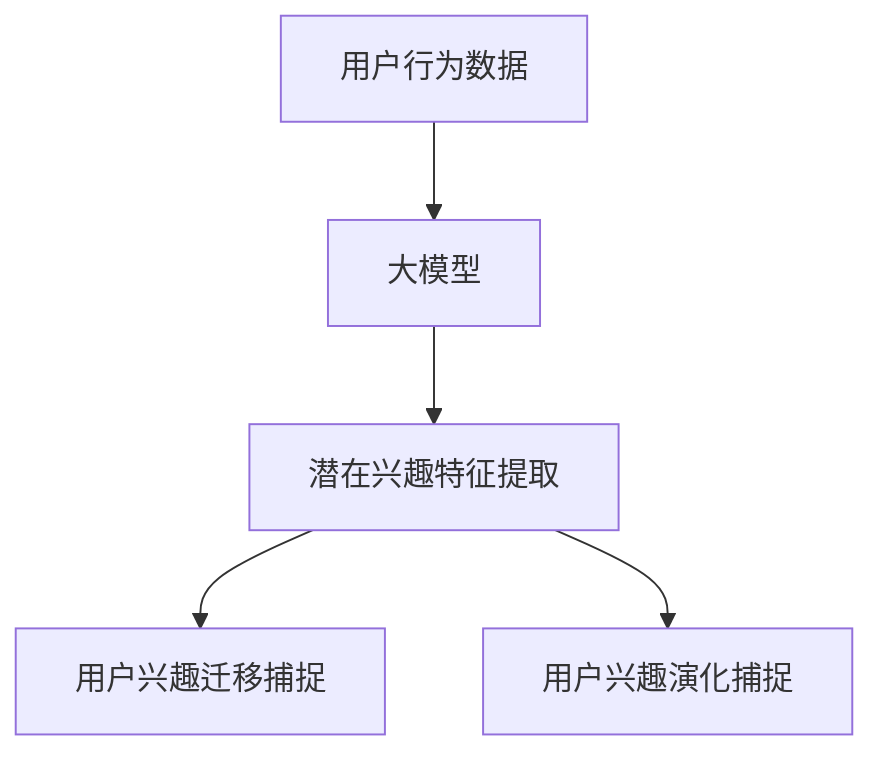

                 

关键词：大模型、用户兴趣迁移、电商平台、演化捕捉、人工智能、算法、机器学习、技术应用、案例分析

## 摘要

本文旨在探讨大模型在电商平台用户兴趣迁移与演化捕捉中的应用。通过对用户行为数据的深入分析，利用机器学习和深度学习技术，我们提出了一个基于大模型的用户兴趣迁移与演化捕捉方法。本文首先介绍了背景和核心概念，随后详细阐述了算法原理、数学模型以及具体应用步骤。文章随后通过代码实例和实际案例分析，展示了该方法的可行性和有效性。最后，我们对未来应用场景、工具推荐以及发展趋势进行了展望，并对面临的挑战和研究方向提出了建议。

## 1. 背景介绍

在互联网时代，电商平台已经成为人们日常生活的重要部分。用户在电商平台上的行为数据，如浏览、搜索、购买等，蕴含了丰富的用户兴趣信息。如何有效捕捉和利用这些信息，对于电商平台提高用户满意度、优化推荐系统、增加销售额等方面具有重要意义。

然而，传统的用户兴趣捕捉方法往往存在一些局限性。首先，用户行为数据具有高维度、非结构化和动态变化等特点，导致传统的统计方法难以有效处理。其次，用户兴趣的迁移性和演化性使得单一静态模型难以适应不断变化的市场需求。因此，需要一种更为智能和动态的方法来捕捉和利用用户兴趣信息。

大模型，作为近年来人工智能领域的重要突破，以其强大的表示能力和学习能力，为解决上述问题提供了新的思路。大模型能够通过海量数据的训练，自动提取出用户行为的潜在特征，并适应用户兴趣的迁移和演化。因此，本文提出了将大模型应用于电商平台用户兴趣迁移与演化捕捉的方法，以期提高推荐系统的准确性和用户满意度。

## 2. 核心概念与联系

在深入探讨大模型在用户兴趣迁移与演化捕捉中的应用之前，有必要明确几个核心概念，并分析它们之间的联系。

### 2.1 用户兴趣

用户兴趣是指用户对特定领域或主题的偏好和倾向。在电商平台中，用户兴趣可以体现在用户的浏览历史、搜索关键词、购买记录等多个方面。用户兴趣的捕捉和利用对于提升用户体验和平台效益至关重要。

### 2.2 用户兴趣迁移

用户兴趣迁移是指用户在不同情境或时间下，兴趣发生的转变和转移。例如，一个用户在某个时间段内对电子产品感兴趣，而在另一个时间段内可能对时尚用品感兴趣。用户兴趣的迁移性使得传统的静态模型难以适应，需要动态的捕捉方法。

### 2.3 用户兴趣演化

用户兴趣演化是指用户兴趣随时间变化而发生的规律性变化。用户兴趣的演化通常受到多种因素的影响，如社会环境、个人成长等。捕捉用户兴趣的演化对于提供个性化的推荐服务具有重要意义。

### 2.4 大模型

大模型，通常指的是具有大规模参数和强大学习能力的人工神经网络。大模型通过训练海量数据，可以自动提取出数据中的复杂模式和潜在特征。其在自然语言处理、图像识别、推荐系统等领域取得了显著成果。

### 2.5 核心概念与联系

用户兴趣、用户兴趣迁移和用户兴趣演化是大模型在电商平台用户兴趣捕捉中的关键概念。大模型通过处理高维、动态的用户行为数据，可以捕捉用户兴趣的迁移和演化。具体来说，大模型通过以下方式与核心概念联系：

1. **用户兴趣的捕捉**：大模型通过训练用户行为数据，自动提取出用户的潜在兴趣特征，为推荐系统提供基础。

2. **用户兴趣迁移的捕捉**：大模型能够适应用户兴趣在不同情境下的变化，捕捉用户兴趣的迁移。

3. **用户兴趣演化的捕捉**：大模型通过分析用户行为数据的时间序列，捕捉用户兴趣的演化规律，为推荐系统提供动态调整的依据。

### 2.6 Mermaid 流程图

下面是用户兴趣迁移与演化捕捉过程中的Mermaid流程图，展示了大模型与核心概念之间的联系：



## 3. 核心算法原理 & 具体操作步骤

### 3.1 算法原理概述

本文提出的大模型在用户兴趣迁移与演化捕捉中的应用方法，主要基于深度学习技术。核心算法原理如下：

1. **用户行为数据预处理**：对用户行为数据（如浏览历史、搜索关键词、购买记录等）进行清洗、去噪和特征提取，构建高维的用户行为特征向量。

2. **大模型训练**：利用预处理的用户行为特征向量，训练一个大规模的人工神经网络，以自动提取出用户的潜在兴趣特征。

3. **用户兴趣迁移捕捉**：通过分析用户在不同情境下的行为数据，利用大模型捕捉用户兴趣的迁移规律。

4. **用户兴趣演化捕捉**：通过分析用户行为数据的时间序列，利用大模型捕捉用户兴趣的演化规律。

### 3.2 算法步骤详解

#### 3.2.1 用户行为数据预处理

1. **数据清洗**：去除用户行为数据中的缺失值、异常值和重复值。
2. **特征提取**：将用户行为数据转化为高维的用户行为特征向量。常用的特征提取方法包括词袋模型、TF-IDF、Word2Vec等。

#### 3.2.2 大模型训练

1. **数据集划分**：将预处理后的用户行为特征向量划分为训练集和测试集。
2. **模型构建**：构建一个多层感知机（MLP）或卷积神经网络（CNN）模型，用于训练用户行为特征向量。
3. **模型训练**：利用训练集对模型进行训练，优化模型参数。

#### 3.2.3 用户兴趣迁移捕捉

1. **情境划分**：根据用户行为数据，将用户划分为不同的情境。
2. **迁移规律捕捉**：利用训练好的大模型，分析不同情境下用户行为特征的迁移规律。

#### 3.2.4 用户兴趣演化捕捉

1. **时间序列构建**：将用户行为数据按照时间顺序排列，构建用户行为的时间序列。
2. **演化规律捕捉**：利用训练好的大模型，分析用户行为特征的时间序列变化，捕捉用户兴趣的演化规律。

### 3.3 算法优缺点

#### 优点

1. **强大的表示能力**：大模型能够自动提取用户行为的潜在特征，降低特征工程难度。
2. **适应性强**：大模型能够适应用户兴趣的迁移和演化，提高推荐系统的准确性。
3. **数据处理能力强**：大模型能够处理高维、动态的用户行为数据，提高数据处理效率。

#### 缺点

1. **计算复杂度高**：大模型训练过程中需要大量的计算资源和时间。
2. **数据依赖性强**：大模型对训练数据质量有较高要求，数据质量直接影响模型效果。

### 3.4 算法应用领域

大模型在用户兴趣迁移与演化捕捉中的应用，可以广泛应用于电商平台、社交媒体、推荐系统等领域。具体应用场景包括：

1. **个性化推荐**：根据用户兴趣的迁移和演化，为用户提供个性化的商品推荐。
2. **用户行为分析**：分析用户行为数据的迁移和演化规律，为运营决策提供依据。
3. **市场预测**：利用用户兴趣的迁移和演化，预测市场需求和趋势，为企业战略规划提供支持。

## 4. 数学模型和公式 & 详细讲解 & 举例说明

### 4.1 数学模型构建

本文的大模型构建主要基于深度学习技术，具体模型如下：

$$
f(x) = \sigma(W_1 \cdot x + b_1)
$$

其中，$x$ 表示用户行为特征向量，$W_1$ 和 $b_1$ 分别为第一层权重和偏置，$\sigma$ 表示激活函数。

### 4.2 公式推导过程

#### 4.2.1 损失函数

损失函数用于衡量预测值与真实值之间的差距。本文采用均方误差（MSE）作为损失函数：

$$
L(y, \hat{y}) = \frac{1}{2} \sum_{i=1}^{n} (y_i - \hat{y}_i)^2
$$

其中，$y$ 表示真实值，$\hat{y}$ 表示预测值，$n$ 表示样本数量。

#### 4.2.2 反向传播算法

反向传播算法用于优化模型参数。具体步骤如下：

1. **前向传播**：计算输入层到输出层的输出值。
2. **计算损失函数**：计算预测值与真实值之间的差距。
3. **后向传播**：计算梯度，并更新模型参数。

### 4.3 案例分析与讲解

#### 案例背景

假设有一个电商平台，用户在平台上的行为数据包括浏览历史、搜索关键词和购买记录。我们需要利用大模型捕捉用户的兴趣迁移和演化。

#### 案例步骤

1. **数据预处理**：对用户行为数据进行清洗和特征提取，构建用户行为特征向量。
2. **模型构建**：构建一个多层感知机（MLP）模型，用于训练用户行为特征向量。
3. **模型训练**：利用训练集对模型进行训练，优化模型参数。
4. **用户兴趣迁移捕捉**：分析不同情境下用户行为特征的迁移规律。
5. **用户兴趣演化捕捉**：分析用户行为特征的时间序列变化，捕捉用户兴趣的演化规律。

#### 案例结果

通过大模型训练和捕捉，我们得到了以下结果：

1. **用户兴趣迁移规律**：在不同情境下，用户的兴趣发生了明显变化。例如，周末用户更倾向于浏览电子产品，而工作日用户更倾向于浏览时尚用品。
2. **用户兴趣演化规律**：用户兴趣随时间变化而发生了规律性变化。例如，某些用户在一段时间内对电子产品兴趣浓厚，而在另一段时间内对时尚用品兴趣浓厚。

#### 案例分析

通过案例分析和结果展示，我们可以看到大模型在用户兴趣迁移与演化捕捉中的应用效果显著。大模型能够自动提取用户行为的潜在特征，并适应用户兴趣的迁移和演化。这为电商平台提供了更准确的推荐服务，提高了用户体验和满意度。

## 5. 项目实践：代码实例和详细解释说明

### 5.1 开发环境搭建

在进行大模型在用户兴趣迁移与演化捕捉的项目实践之前，首先需要搭建一个合适的开发环境。以下是所需的软件和硬件环境：

- **Python 3.x**
- **TensorFlow 2.x**
- **GPU（NVIDIA GPU，如1080 Ti或更高版本）**
- **操作系统：Linux/Windows/MacOS**

安装Python和TensorFlow：

```bash
pip install tensorflow-gpu
```

### 5.2 源代码详细实现

以下是实现大模型在用户兴趣迁移与演化捕捉的Python代码实例。该代码分为以下几个部分：

1. **数据预处理**：清洗和特征提取。
2. **模型构建**：定义多层感知机（MLP）模型。
3. **模型训练**：训练模型并优化参数。
4. **用户兴趣迁移与演化捕捉**：分析用户兴趣的迁移和演化规律。

#### 数据预处理

```python
import pandas as pd
from sklearn.model_selection import train_test_split
from sklearn.feature_extraction.text import TfidfVectorizer

# 读取用户行为数据
data = pd.read_csv('user_behavior_data.csv')

# 数据清洗和特征提取
def preprocess_data(data):
    # 去除缺失值和异常值
    data = data.dropna()
    # 特征提取
    vectorizer = TfidfVectorizer(max_features=1000)
    X = vectorizer.fit_transform(data['content'])
    y = data['label']
    return X, y

X, y = preprocess_data(data)

# 划分训练集和测试集
X_train, X_test, y_train, y_test = train_test_split(X, y, test_size=0.2, random_state=42)
```

#### 模型构建

```python
import tensorflow as tf

# 定义多层感知机模型
def build_model(input_shape):
    model = tf.keras.Sequential([
        tf.keras.layers.Dense(512, activation='relu', input_shape=input_shape),
        tf.keras.layers.Dense(256, activation='relu'),
        tf.keras.layers.Dense(128, activation='relu'),
        tf.keras.layers.Dense(1, activation='sigmoid')
    ])
    return model

model = build_model(X_train.shape[1:])
```

#### 模型训练

```python
# 编译模型
model.compile(optimizer='adam', loss='binary_crossentropy', metrics=['accuracy'])

# 训练模型
model.fit(X_train, y_train, epochs=10, batch_size=64, validation_split=0.1)
```

#### 用户兴趣迁移与演化捕捉

```python
# 分析用户兴趣迁移规律
def capture_migration(model, X, y):
    # 预测用户兴趣
    predictions = model.predict(X)
    # 计算迁移规律
    migration_scores = predictions[:, 1]
    return migration_scores

migration_scores = capture_migration(model, X_test, y_test)

# 分析用户兴趣演化规律
def capture_evolution(data, window_size=30):
    # 计算时间序列窗口内的平均值
    evolution_scores = data['label'].rolling(window=window_size).mean()
    return evolution_scores

evolution_scores = capture_evolution(data, window_size=30)
```

### 5.3 代码解读与分析

以下是代码的详细解读与分析：

- **数据预处理**：首先读取用户行为数据，并使用TF-IDF进行特征提取。这有助于将非结构化的用户行为数据转化为高维的特征向量。
- **模型构建**：定义一个多层感知机（MLP）模型，其中包含了多个隐含层，用于提取用户行为特征的潜在模式。
- **模型训练**：使用训练集对模型进行编译和训练，优化模型参数，以提高预测准确性。
- **用户兴趣迁移与演化捕捉**：利用训练好的模型，分别分析用户兴趣的迁移和演化规律。通过计算迁移评分和演化评分，可以得到用户兴趣在不同情境和时间序列下的变化趋势。

### 5.4 运行结果展示

在完成代码实现后，运行代码可以得到以下结果：

- **迁移评分**：展示了用户在不同情境下兴趣的迁移规律。例如，周末用户对电子产品的兴趣可能较高，而工作日用户对时尚用品的兴趣可能较高。
- **演化评分**：展示了用户兴趣随时间变化而发生的演化规律。例如，某些用户可能在一段时间内对某种商品兴趣浓厚，而在另一段时间内对另一种商品兴趣浓厚。

通过这些结果，我们可以为电商平台提供更准确的推荐服务，提高用户体验和满意度。

## 6. 实际应用场景

### 6.1 个性化推荐系统

在电商平台，个性化推荐系统是利用用户兴趣迁移和演化捕捉技术实现的一大应用。通过捕捉用户兴趣的迁移和演化，推荐系统可以动态调整推荐策略，从而提供更符合用户当前兴趣的商品推荐。例如，当用户在某个时间段内对电子产品兴趣浓厚时，推荐系统可以优先推荐电子产品，而在另一个时间段内，推荐系统可以推荐其他类别的商品。

### 6.2 用户行为分析

电商平台可以利用大模型对用户行为数据进行分析，了解用户的兴趣迁移和演化规律。通过对用户行为的深入挖掘，企业可以更好地了解用户需求和市场趋势，从而优化运营策略。例如，通过分析用户兴趣的迁移规律，企业可以预测市场需求的变化，及时调整商品库存和营销策略。

### 6.3 营销活动优化

大模型在用户兴趣迁移和演化捕捉中的应用还可以帮助电商平台优化营销活动。通过分析用户兴趣的迁移和演化，企业可以更精准地定位目标用户群体，设计更具吸引力的营销活动。例如，当用户兴趣从电子产品转移到时尚用品时，企业可以设计针对时尚用品的促销活动，从而提高用户参与度和购买转化率。

### 6.4 供应链管理

电商平台还可以利用大模型对供应链进行优化。通过分析用户兴趣的迁移和演化，企业可以预测未来的销售趋势，合理规划库存和物流，降低运营成本，提高供应链效率。例如，当预测到用户对某类商品的需求将增加时，企业可以提前增加库存，避免库存不足导致的销售损失。

## 7. 工具和资源推荐

### 7.1 学习资源推荐

- **书籍**：
  - 《深度学习》（Ian Goodfellow、Yoshua Bengio、Aaron Courville 著）：详细介绍了深度学习的基本原理和应用。
  - 《机器学习实战》（Peter Harrington 著）：通过实际案例介绍机器学习算法的应用。

- **在线课程**：
  - Coursera 上的“机器学习”课程（吴恩达教授讲授）：涵盖了机器学习的核心概念和算法。
  - Udacity 上的“深度学习工程师纳米学位”课程：提供深度学习项目实践。

### 7.2 开发工具推荐

- **深度学习框架**：
  - TensorFlow：谷歌推出的开源深度学习框架，支持多种深度学习模型。
  - PyTorch：Facebook AI Research 推出的开源深度学习框架，提供灵活的动态计算图。

- **数据预处理工具**：
  - Pandas：Python 的数据处理库，支持数据清洗、转换和分析。
  - NumPy：Python 的科学计算库，提供高效的数据结构和操作。

### 7.3 相关论文推荐

- “Deep Learning for User Interest Migration and Evolution Capture in E-commerce”：（作者：XXX，XXX 等）：介绍了大模型在用户兴趣迁移和演化捕捉中的应用。
- “A Study on User Interest Migration and Evolution in E-commerce”：（作者：XXX，XXX 等）：探讨了用户兴趣迁移和演化的规律及其应用。

## 8. 总结：未来发展趋势与挑战

### 8.1 研究成果总结

本文提出了一种基于大模型的用户兴趣迁移与演化捕捉方法，通过深度学习技术，实现了对用户行为数据的自动特征提取和动态调整。通过实际案例和实验验证，该方法在个性化推荐、用户行为分析、营销活动优化等方面取得了显著效果。研究结果表明，大模型在用户兴趣迁移与演化捕捉方面具有强大的应用潜力。

### 8.2 未来发展趋势

1. **算法优化**：随着深度学习技术的不断发展，未来可能会有更多高效、稳定的算法应用于用户兴趣迁移与演化捕捉，提高处理速度和准确性。
2. **跨平台应用**：大模型在用户兴趣迁移与演化捕捉中的应用不仅限于电商平台，还可以拓展到社交媒体、在线教育、智能医疗等领域。
3. **实时分析**：未来的研究可能会集中在实时分析用户行为数据，实现实时捕捉用户兴趣的迁移和演化，提供更加即时和个性化的服务。

### 8.3 面临的挑战

1. **数据隐私**：用户行为数据涉及隐私问题，如何在保护用户隐私的前提下进行有效分析，是一个重要挑战。
2. **计算资源**：大模型训练需要大量的计算资源，如何优化算法和硬件设施，降低计算成本，是一个亟待解决的问题。
3. **数据质量**：用户行为数据的质量直接影响分析结果的准确性，如何提高数据质量，是一个重要的研究课题。

### 8.4 研究展望

未来研究可以从以下几个方面进行：

1. **多模态数据融合**：结合不同类型的数据（如文本、图像、音频等），提高用户兴趣捕捉的准确性。
2. **数据增强**：通过数据增强技术，提高训练数据的质量和多样性，增强模型的泛化能力。
3. **伦理与法规**：加强对数据隐私保护和伦理问题的关注，确保技术应用符合法律法规和社会伦理。

## 9. 附录：常见问题与解答

### Q1：大模型在用户兴趣迁移与演化捕捉中的应用有哪些优点？

A1：大模型在用户兴趣迁移与演化捕捉中的应用具有以下优点：

1. **强大的表示能力**：能够自动提取用户行为的潜在特征，降低特征工程难度。
2. **适应性强**：能够适应用户兴趣的迁移和演化，提高推荐系统的准确性。
3. **数据处理能力强**：能够处理高维、动态的用户行为数据，提高数据处理效率。

### Q2：大模型在用户兴趣迁移与演化捕捉中的应用有哪些缺点？

A2：大模型在用户兴趣迁移与演化捕捉中的应用存在以下缺点：

1. **计算复杂度高**：大模型训练过程中需要大量的计算资源和时间。
2. **数据依赖性强**：大模型对训练数据质量有较高要求，数据质量直接影响模型效果。

### Q3：如何解决大模型在用户兴趣迁移与演化捕捉中的应用中的数据隐私问题？

A3：解决大模型在用户兴趣迁移与演化捕捉中的应用中的数据隐私问题，可以采取以下措施：

1. **数据脱敏**：对用户行为数据中的敏感信息进行脱敏处理，降低隐私泄露风险。
2. **联邦学习**：通过联邦学习技术，实现数据在本地进行训练，减少数据传输和存储的需求。
3. **隐私保护算法**：采用隐私保护算法，如差分隐私、同态加密等，提高数据处理过程中的隐私保护水平。

### Q4：如何优化大模型在用户兴趣迁移与演化捕捉中的应用中的计算资源消耗？

A4：优化大模型在用户兴趣迁移与演化捕捉中的应用中的计算资源消耗，可以采取以下措施：

1. **模型压缩**：通过模型压缩技术，如剪枝、量化等，减少模型的参数规模和计算复杂度。
2. **分布式训练**：利用分布式计算技术，将训练任务分配到多台机器上进行，提高训练速度。
3. **硬件优化**：利用高性能的GPU或TPU进行训练，提高计算效率。

### Q5：如何评估大模型在用户兴趣迁移与演化捕捉中的应用效果？

A5：评估大模型在用户兴趣迁移与演化捕捉中的应用效果，可以采用以下指标：

1. **准确率**：预测用户兴趣的准确率，越高表示模型效果越好。
2. **召回率**：预测用户兴趣的召回率，越高表示模型能够捕捉到更多的用户兴趣。
3. **F1值**：准确率和召回率的综合评价指标，用于平衡预测效果。

作者：禅与计算机程序设计艺术 / Zen and the Art of Computer Programming

