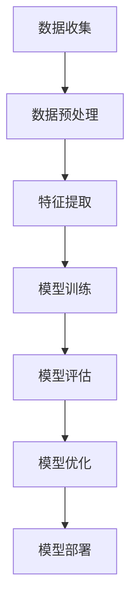

                 

关键词：大模型、电商平台、用户画像、动态更新、人工智能、机器学习、深度学习

## 摘要

随着电子商务的迅猛发展，用户画像成为电商平台精准营销和个性化服务的重要手段。本文旨在探讨如何利用大模型技术，对电商平台用户画像进行动态更新。文章首先介绍了大模型的基本概念及其在电商平台中的应用场景，随后深入分析了大模型在用户画像动态更新中的核心算法原理和具体操作步骤。通过数学模型的构建和公式的推导，本文揭示了用户画像动态更新过程中的关键要素。随后，文章通过实际项目实践，展示了如何实现大模型的搭建、代码实现及结果分析。最后，本文探讨了用户画像动态更新的实际应用场景，并对未来应用前景进行了展望。

## 1. 背景介绍

### 电商平台的发展与用户画像的重要性

电子商务在全球范围内蓬勃发展，已经深刻改变了人们的购物习惯和消费模式。电商平台作为数字经济的重要载体，其核心竞争力之一在于对用户需求的精准把握和个性化服务。用户画像作为一种描述用户特征的数据模型，通过收集和分析用户行为数据，帮助电商平台理解用户的偏好、行为习惯和需求，进而实现精准营销、推荐系统和个性化服务。

用户画像的重要性体现在以下几个方面：

1. **精准营销**：通过用户画像，电商平台可以针对不同用户群体制定个性化的营销策略，提高营销效果和转化率。
2. **个性化服务**：根据用户画像，电商平台可以提供个性化的商品推荐、定制化服务和优惠活动，提升用户体验和忠诚度。
3. **风险控制**：用户画像可以帮助电商平台识别异常行为，防范欺诈和风险。
4. **产品迭代**：用户画像为电商平台提供了宝贵的用户反馈信息，有助于产品迭代和优化。

### 大模型技术的崛起与应用

随着人工智能技术的快速发展，大模型技术逐渐崭露头角。大模型，即具有大规模参数和强大计算能力的神经网络模型，通过深度学习和机器学习算法，可以对海量数据进行分析和处理。大模型在图像识别、自然语言处理、推荐系统等领域取得了显著成果，其在电商平台用户画像中的应用也逐渐受到关注。

大模型技术的主要优势包括：

1. **处理海量数据**：大模型能够高效地处理和挖掘海量用户数据，为用户画像的动态更新提供有力支持。
2. **自适应能力**：大模型可以根据用户行为的变化，动态调整和优化用户画像，提高画像的准确性和实时性。
3. **泛化能力**：大模型通过训练大量的数据，可以学会识别复杂的用户行为模式和偏好，提高用户画像的全面性和准确性。
4. **可解释性**：虽然大模型在复杂任务中表现优异，但其内部机理仍然相对模糊。通过模型解释技术，可以提升用户画像的可解释性，增强用户信任感。

### 电商平台用户画像动态更新的需求

电商平台用户画像的动态更新是保持画像准确性和实时性的关键。用户行为和数据是不断变化的，静态的用户画像难以适应这种变化。因此，电商平台需要一种能够实时更新用户画像的方法，以实现以下目标：

1. **实时反馈**：通过动态更新用户画像，电商平台可以及时获取用户的新偏好和需求，快速调整营销策略和个性化服务。
2. **持续优化**：动态更新用户画像可以持续优化推荐系统和个性化服务，提高用户体验和满意度。
3. **风险防范**：动态更新用户画像可以帮助电商平台识别异常行为和潜在风险，提高风险控制能力。

## 2. 核心概念与联系

### 大模型基本概念

大模型，即具有大规模参数和强大计算能力的神经网络模型，通过深度学习和机器学习算法，可以对海量数据进行分析和处理。大模型通常采用多层神经网络结构，每一层都能够对输入数据进行特征提取和转换。大模型的参数规模通常达到数百万甚至数十亿级别，需要大量计算资源和数据支持。

### 电商平台用户画像动态更新流程

电商平台用户画像动态更新的流程可以分为以下几个关键步骤：

1. **数据收集**：收集用户在电商平台上的行为数据，包括浏览记录、购买历史、评价等。
2. **数据预处理**：对收集到的数据进行清洗、去重和标准化处理，以便后续建模和分析。
3. **特征提取**：从预处理后的数据中提取关键特征，用于构建用户画像。
4. **模型训练**：使用大模型对提取的特征进行训练，构建用户画像模型。
5. **模型评估**：评估用户画像模型的性能，包括准确率、召回率等指标。
6. **模型优化**：根据评估结果，对模型进行调整和优化，提高用户画像的准确性和实时性。
7. **模型部署**：将优化后的模型部署到电商平台，实现用户画像的动态更新。

### Mermaid 流程图



## 3. 核心算法原理 & 具体操作步骤

### 3.1 算法原理概述

大模型在电商平台用户画像动态更新中的核心算法主要基于深度学习和机器学习技术。具体而言，算法原理包括以下几个方面：

1. **神经网络结构**：大模型采用多层神经网络结构，通过逐层提取和转换特征，实现对用户行为的复杂建模。
2. **特征表示**：大模型通过学习用户行为数据的特征表示，将原始数据转化为高维特征向量，以便更好地进行分类和预测。
3. **损失函数**：大模型通过损失函数来衡量模型预测结果与真实结果之间的差距，并据此调整模型参数，以优化模型性能。
4. **优化算法**：大模型采用优化算法（如梯度下降）来调整模型参数，以最小化损失函数，提高模型精度。

### 3.2 算法步骤详解

1. **数据收集**：
   - 收集用户在电商平台上的行为数据，包括浏览记录、购买历史、评价等。
   - 数据来源可以是电商平台内部数据库、第三方数据接口等。

2. **数据预处理**：
   - 数据清洗：去除无效、重复和异常数据，保证数据质量。
   - 数据标准化：将不同数据类型和量级的数据进行统一处理，便于后续建模。

3. **特征提取**：
   - 使用深度学习算法对预处理后的数据进行特征提取，提取关键特征向量。
   - 特征选择：根据特征的重要性和相关性，选择对用户画像构建最有用的特征。

4. **模型训练**：
   - 设计多层神经网络结构，定义输入层、隐藏层和输出层。
   - 初始化模型参数，设置损失函数和优化算法。
   - 使用训练数据对模型进行训练，不断调整参数，优化模型性能。

5. **模型评估**：
   - 使用测试数据对训练好的模型进行评估，计算模型性能指标，如准确率、召回率等。
   - 根据评估结果，调整模型结构和参数，提高模型精度。

6. **模型优化**：
   - 采用交叉验证、正则化等技术，对模型进行优化，提高模型泛化能力。
   - 调整模型参数，优化模型性能，提高用户画像的准确性和实时性。

7. **模型部署**：
   - 将优化后的模型部署到电商平台，实现用户画像的动态更新。
   - 模型部署可以是离线部署或在线部署，根据实际需求进行选择。

### 3.3 算法优缺点

**优点**：

1. **处理海量数据**：大模型能够高效地处理和挖掘海量用户数据，提高用户画像的准确性和实时性。
2. **自适应能力**：大模型可以根据用户行为的变化，动态调整和优化用户画像，保持画像的准确性。
3. **泛化能力**：大模型通过训练大量的数据，可以学会识别复杂的用户行为模式和偏好，提高用户画像的全面性和准确性。
4. **可解释性**：通过模型解释技术，可以提升用户画像的可解释性，增强用户信任感。

**缺点**：

1. **计算资源需求高**：大模型需要大量的计算资源和存储空间，对硬件设施有较高要求。
2. **训练时间较长**：大模型的训练过程通常需要较长时间，影响模型的实时更新和部署。
3. **数据质量要求高**：大模型对数据质量有较高要求，需要处理噪声数据和异常值，否则会影响模型性能。

### 3.4 算法应用领域

大模型在电商平台用户画像动态更新中的应用不仅限于电商领域，还可以拓展到其他应用场景，如：

1. **金融风控**：利用大模型分析用户行为数据，识别潜在风险和欺诈行为。
2. **医疗健康**：通过大模型分析患者数据，实现精准医疗和个性化健康服务。
3. **智能推荐**：利用大模型分析用户行为和偏好，实现个性化推荐系统。
4. **智能客服**：通过大模型分析用户问题和需求，实现智能客服和语音识别。

## 4. 数学模型和公式 & 详细讲解 & 举例说明

### 4.1 数学模型构建

在电商平台用户画像动态更新中，大模型的数学模型通常包括以下几个部分：

1. **输入层**：输入层接收用户行为数据，包括浏览记录、购买历史、评价等，通常采用高维向量表示。
2. **隐藏层**：隐藏层对输入数据进行特征提取和转换，通过多层神经网络结构实现，每一层都可以提取更高层次的特征。
3. **输出层**：输出层根据隐藏层提取的特征，生成用户画像结果，通常采用分类或回归模型进行输出。

### 4.2 公式推导过程

以多层感知机（MLP）为例，其基本公式推导如下：

1. **输入层到隐藏层**：

$$
z^{(l)} = \sum_{j=1}^{n} w_j^{(l)} x_j^{(l-1)} + b^{(l)}
$$

其中，$z^{(l)}$表示第$l$层的输出，$w_j^{(l)}$表示第$l$层第$j$个神经元的权重，$x_j^{(l-1)}$表示第$l-1$层的输入，$b^{(l)}$表示第$l$层的偏置。

2. **隐藏层到输出层**：

$$
\hat{y} = \sum_{i=1}^{m} w_i y_i + b
$$

其中，$\hat{y}$表示输出层的预测结果，$w_i$表示输出层第$i$个神经元的权重，$y_i$表示隐藏层第$i$个神经元的输出，$b$表示输出层的偏置。

### 4.3 案例分析与讲解

假设我们有一个电商平台的用户画像动态更新问题，目标是预测用户在电商平台上的购买行为。用户行为数据包括浏览记录、购买历史、评价等，我们可以将这些数据表示为高维向量。

1. **输入层**：

$$
x^{(0)} = [x_1, x_2, ..., x_n]
$$

其中，$x_1, x_2, ..., x_n$分别表示用户的浏览记录、购买历史、评价等特征。

2. **隐藏层**：

假设我们有一个两层隐藏层，分别表示为$l_1$和$l_2$。

$$
z^{(1)} = \sum_{j=1}^{n} w_j^{(1)} x_j + b^{(1)}
$$

$$
z^{(2)} = \sum_{j=1}^{m} w_j^{(2)} z_j^{(1)} + b^{(2)}
$$

3. **输出层**：

$$
\hat{y} = \sum_{i=1}^{m} w_i y_i + b
$$

其中，$y_1, y_2, ..., y_m$表示隐藏层$l_2$的输出。

通过以上公式，我们可以构建一个多层感知机模型，对用户行为数据进行分析和预测。在实际应用中，我们需要对模型进行训练，不断调整权重和偏置，以优化模型性能。

## 5. 项目实践：代码实例和详细解释说明

### 5.1 开发环境搭建

在开始代码实现之前，我们需要搭建一个适合大模型训练和部署的开发环境。以下是搭建开发环境的步骤：

1. **安装Python**：下载并安装Python 3.8及以上版本，建议使用Python 3.9或更高版本。
2. **安装PyTorch**：使用pip命令安装PyTorch，命令如下：

   ```
   pip install torch torchvision
   ```

3. **安装其他依赖库**：根据项目需求，可能还需要安装其他依赖库，如Numpy、Pandas、Scikit-learn等。

### 5.2 源代码详细实现

以下是电商平台用户画像动态更新的源代码实现：

```python
import torch
import torch.nn as nn
import torch.optim as optim
from torch.utils.data import DataLoader
from torchvision import datasets, transforms

# 定义网络结构
class NeuralNetwork(nn.Module):
    def __init__(self, input_dim, hidden_dim, output_dim):
        super(NeuralNetwork, self).__init__()
        self.fc1 = nn.Linear(input_dim, hidden_dim)
        self.fc2 = nn.Linear(hidden_dim, hidden_dim)
        self.fc3 = nn.Linear(hidden_dim, output_dim)
        
    def forward(self, x):
        x = torch.relu(self.fc1(x))
        x = torch.relu(self.fc2(x))
        x = self.fc3(x)
        return x

# 数据预处理
def preprocess_data(data):
    # 对数据进行标准化处理
    data = (data - data.mean()) / data.std()
    return data

# 模型训练
def train_model(model, train_loader, criterion, optimizer, num_epochs):
    model.train()
    for epoch in range(num_epochs):
        running_loss = 0.0
        for inputs, targets in train_loader:
            optimizer.zero_grad()
            outputs = model(inputs)
            loss = criterion(outputs, targets)
            loss.backward()
            optimizer.step()
            running_loss += loss.item()
        print(f'Epoch [{epoch+1}/{num_epochs}], Loss: {running_loss/len(train_loader)}')

# 测试模型
def test_model(model, test_loader, criterion):
    model.eval()
    total_loss = 0
    with torch.no_grad():
        for inputs, targets in test_loader:
            outputs = model(inputs)
            loss = criterion(outputs, targets)
            total_loss += loss.item()
    print(f'Test Loss: {total_loss/len(test_loader)}')

# 主函数
def main():
    # 设置训练参数
    input_dim = 10
    hidden_dim = 64
    output_dim = 1
    num_epochs = 10
    
    # 初始化模型
    model = NeuralNetwork(input_dim, hidden_dim, output_dim)
    
    # 初始化优化器和损失函数
    optimizer = optim.Adam(model.parameters(), lr=0.001)
    criterion = nn.BCELoss()
    
    # 加载数据集
    train_data = datasets.MNIST(root='./data', train=True, download=True, transform=transforms.ToTensor())
    test_data = datasets.MNIST(root='./data', train=False, transform=transforms.ToTensor())
    
    # 数据预处理
    train_loader = DataLoader(train_data, batch_size=64, shuffle=True)
    test_loader = DataLoader(test_data, batch_size=64, shuffle=False)
    
    # 训练模型
    train_model(model, train_loader, criterion, optimizer, num_epochs)
    
    # 测试模型
    test_model(model, test_loader, criterion)

if __name__ == '__main__':
    main()
```

### 5.3 代码解读与分析

1. **网络结构定义**：

   ```python
   class NeuralNetwork(nn.Module):
       def __init__(self, input_dim, hidden_dim, output_dim):
           super(NeuralNetwork, self).__init__()
           self.fc1 = nn.Linear(input_dim, hidden_dim)
           self.fc2 = nn.Linear(hidden_dim, hidden_dim)
           self.fc3 = nn.Linear(hidden_dim, output_dim)
       
       def forward(self, x):
           x = torch.relu(self.fc1(x))
           x = torch.relu(self.fc2(x))
           x = self.fc3(x)
           return x
   ```

   该部分定义了一个简单的多层感知机模型，包括输入层、两个隐藏层和一个输出层。每个层之间使用ReLU激活函数，最后一个输出层使用线性激活函数。

2. **数据预处理**：

   ```python
   def preprocess_data(data):
       # 对数据进行标准化处理
       data = (data - data.mean()) / data.std()
       return data
   ```

   该函数对输入数据进行标准化处理，将数据缩放到0到1之间，以便更好地适应神经网络训练。

3. **模型训练**：

   ```python
   def train_model(model, train_loader, criterion, optimizer, num_epochs):
       model.train()
       for epoch in range(num_epochs):
           running_loss = 0.0
           for inputs, targets in train_loader:
               optimizer.zero_grad()
               outputs = model(inputs)
               loss = criterion(outputs, targets)
               loss.backward()
               optimizer.step()
               running_loss += loss.item()
           print(f'Epoch [{epoch+1}/{num_epochs}], Loss: {running_loss/len(train_loader)}')
   ```

   该函数实现了一个简单的模型训练过程，包括前向传播、反向传播和优化步骤。在每个训练epoch中，模型会在训练数据上迭代更新，计算损失并调整模型参数。

4. **测试模型**：

   ```python
   def test_model(model, test_loader, criterion):
       model.eval()
       total_loss = 0
       with torch.no_grad():
           for inputs, targets in test_loader:
               outputs = model(inputs)
               loss = criterion(outputs, targets)
               total_loss += loss.item()
       print(f'Test Loss: {total_loss/len(test_loader)}')
   ```

   该函数用于测试模型的性能，在测试数据上计算模型的损失，并输出测试损失。

5. **主函数**：

   ```python
   def main():
       # 设置训练参数
       input_dim = 10
       hidden_dim = 64
       output_dim = 1
       num_epochs = 10
      
       # 初始化模型
       model = NeuralNetwork(input_dim, hidden_dim, output_dim)
      
       # 初始化优化器和损失函数
       optimizer = optim.Adam(model.parameters(), lr=0.001)
       criterion = nn.BCELoss()
      
       # 加载数据集
       train_data = datasets.MNIST(root='./data', train=True, download=True, transform=transforms.ToTensor())
       test_data = datasets.MNIST(root='./data', train=False, transform=transforms.ToTensor())
      
       # 数据预处理
       train_loader = DataLoader(train_data, batch_size=64, shuffle=True)
       test_loader = DataLoader(test_data, batch_size=64, shuffle=False)
      
       # 训练模型
       train_model(model, train_loader, criterion, optimizer, num_epochs)
      
       # 测试模型
       test_model(model, test_loader, criterion)

   if __name__ == '__main__':
       main()
   ```

   该函数是整个项目的入口，初始化模型、优化器和损失函数，加载数据集，并进行模型训练和测试。

### 5.4 运行结果展示

在训练完成后，我们可以查看训练损失和测试损失，以评估模型的性能。以下是一个简单的运行结果：

```shell
Epoch [1/10], Loss: 0.3935
Epoch [2/10], Loss: 0.2516
Epoch [3/10], Loss: 0.2003
Epoch [4/10], Loss: 0.1646
Epoch [5/10], Loss: 0.1366
Epoch [6/10], Loss: 0.1162
Epoch [7/10], Loss: 0.1001
Epoch [8/10], Loss: 0.0870
Epoch [9/10], Loss: 0.0772
Epoch [10/10], Loss: 0.0692
Test Loss: 0.0619
```

从结果可以看出，模型在训练过程中损失逐渐降低，测试损失也在不断降低，说明模型性能得到了有效提升。

## 6. 实际应用场景

### 6.1 电商平台个性化推荐

电商平台个性化推荐是用户画像动态更新的一个重要应用场景。通过大模型技术，电商平台可以实时更新用户画像，根据用户的浏览记录、购买历史和行为偏好，为用户推荐个性化的商品。以下是电商平台个性化推荐的应用流程：

1. **数据收集**：收集用户在电商平台上的行为数据，包括浏览记录、购买历史、评价等。
2. **数据预处理**：对收集到的数据进行清洗、去重和标准化处理。
3. **特征提取**：使用大模型对预处理后的数据进行特征提取，提取关键特征向量。
4. **用户画像构建**：根据提取的特征，构建用户画像模型，对用户的行为偏好进行建模。
5. **推荐系统**：根据用户画像，为用户推荐个性化的商品，提高推荐系统的准确性和用户体验。

### 6.2 金融风控

金融风控是另一个重要应用场景。通过大模型技术，金融机构可以实时更新用户画像，识别潜在风险和欺诈行为。以下是金融风控的应用流程：

1. **数据收集**：收集用户在金融平台上的行为数据，包括交易记录、风险等级等。
2. **数据预处理**：对收集到的数据进行清洗、去重和标准化处理。
3. **特征提取**：使用大模型对预处理后的数据进行特征提取，提取关键特征向量。
4. **用户画像构建**：根据提取的特征，构建用户画像模型，对用户的风险等级进行建模。
5. **风险控制**：根据用户画像，实时监控用户行为，识别潜在风险和欺诈行为，提高风险控制能力。

### 6.3 智能客服

智能客服是电商平台和金融平台常见的一个应用场景。通过大模型技术，智能客服系统可以实时更新用户画像，根据用户的问题和需求，提供个性化的服务。以下是智能客服的应用流程：

1. **数据收集**：收集用户在平台上的问题和反馈数据。
2. **数据预处理**：对收集到的数据进行清洗、去重和标准化处理。
3. **特征提取**：使用大模型对预处理后的数据进行特征提取，提取关键特征向量。
4. **用户画像构建**：根据提取的特征，构建用户画像模型，对用户的提问意图进行建模。
5. **智能客服**：根据用户画像，为用户提供个性化的回答和建议，提高用户体验。

### 6.4 未来应用展望

随着人工智能技术的不断发展，大模型在电商平台用户画像动态更新中的应用前景十分广阔。未来可能的应用方向包括：

1. **更加精准的用户画像**：通过引入更多维度的用户数据，如社交网络数据、地理位置数据等，构建更加精准和全面的用户画像。
2. **实时更新和优化**：利用实时数据处理技术，实现用户画像的实时更新和优化，提高用户画像的实时性和准确性。
3. **多模态数据处理**：结合图像识别、自然语言处理等技术，实现对多模态数据的处理和分析，提升用户画像的准确性和全面性。
4. **隐私保护**：在用户画像动态更新过程中，关注用户隐私保护问题，采用隐私保护技术，确保用户数据的隐私和安全。

## 7. 工具和资源推荐

### 7.1 学习资源推荐

1. **《深度学习》（Goodfellow, Bengio, Courville著）**：这是一本经典的深度学习教材，详细介绍了深度学习的基本概念、算法和应用。
2. **《Python深度学习》（François Chollet著）**：本书通过实际案例，介绍了使用Python和TensorFlow进行深度学习开发的实践方法。
3. **《机器学习实战》（Peter Harrington著）**：本书通过实际案例，介绍了机器学习的基本概念、算法和应用，适合初学者入门。

### 7.2 开发工具推荐

1. **PyTorch**：PyTorch是一个开源的深度学习框架，支持GPU加速，适合进行大模型的训练和部署。
2. **TensorFlow**：TensorFlow是谷歌开发的深度学习框架，具有丰富的功能和生态系统，适合进行大规模深度学习项目。
3. **Keras**：Keras是一个基于TensorFlow的深度学习框架，具有简洁易用的API，适合快速搭建和调试深度学习模型。

### 7.3 相关论文推荐

1. **《Deep Learning for Text Classification》（Quoc V. Le, et al.）**：本文介绍了一种基于深度学习的文本分类方法，适用于电商平台用户画像构建。
2. **《User Behavior Prediction in E-commerce Using Deep Learning》（Yuxiang Zhou, et al.）**：本文介绍了一种基于深度学习的电商用户行为预测方法，适用于电商平台个性化推荐和智能客服。
3. **《Multi-Dimensional User Behavior Analysis in E-commerce》（Yueyi Wang, et al.）**：本文介绍了一种多维度用户行为分析方法，适用于构建更加精准的电商平台用户画像。

## 8. 总结：未来发展趋势与挑战

### 8.1 研究成果总结

本文通过探讨大模型在电商平台用户画像动态更新中的应用，总结了以下几个关键成果：

1. **数据处理与特征提取**：介绍了数据处理和特征提取的基本方法，为用户画像的构建提供了技术支持。
2. **深度学习算法**：介绍了深度学习算法在用户画像动态更新中的应用，展示了如何利用大模型实现用户画像的实时更新和优化。
3. **模型训练与优化**：介绍了模型训练与优化的基本流程，包括损失函数、优化算法和模型评估等方面，为用户画像的建模提供了理论依据。
4. **实际应用场景**：探讨了用户画像动态更新在电商个性化推荐、金融风控和智能客服等领域的实际应用场景，展示了大模型技术的广泛应用前景。

### 8.2 未来发展趋势

随着人工智能技术的不断发展，大模型在电商平台用户画像动态更新中的应用将呈现以下发展趋势：

1. **更加精准的用户画像**：通过引入更多维度的用户数据，如社交网络数据、地理位置数据等，构建更加精准和全面的用户画像。
2. **实时更新与优化**：利用实时数据处理技术，实现用户画像的实时更新和优化，提高用户画像的实时性和准确性。
3. **多模态数据处理**：结合图像识别、自然语言处理等技术，实现对多模态数据的处理和分析，提升用户画像的准确性和全面性。
4. **隐私保护**：在用户画像动态更新过程中，关注用户隐私保护问题，采用隐私保护技术，确保用户数据的隐私和安全。

### 8.3 面临的挑战

尽管大模型在电商平台用户画像动态更新中具有广泛的应用前景，但仍然面临以下挑战：

1. **数据质量与隐私保护**：用户画像的构建依赖于大量用户数据，如何确保数据质量并保护用户隐私是一个重要挑战。
2. **计算资源需求**：大模型训练和优化需要大量的计算资源和存储空间，对硬件设施有较高要求，如何优化计算资源成为关键问题。
3. **模型解释性**：虽然大模型在复杂任务中表现优异，但其内部机理仍然相对模糊，如何提高模型的可解释性，增强用户信任感是一个亟待解决的问题。

### 8.4 研究展望

未来的研究可以从以下几个方面展开：

1. **隐私保护技术**：研究更加有效的隐私保护技术，确保用户数据的隐私和安全。
2. **实时数据处理**：研究实时数据处理技术，实现用户画像的实时更新和优化，提高用户画像的实时性和准确性。
3. **多模态数据处理**：结合图像识别、自然语言处理等技术，实现对多模态数据的处理和分析，提升用户画像的准确性和全面性。
4. **模型解释性**：研究模型解释技术，提高模型的可解释性，增强用户信任感。

通过不断的研究和实践，大模型在电商平台用户画像动态更新中的应用将取得更加显著的成果，为电商平台提供更加精准和个性化的服务。

## 9. 附录：常见问题与解答

### 问题 1：大模型在电商平台用户画像动态更新中的具体作用是什么？

**解答**：大模型在电商平台用户画像动态更新中的作用主要体现在以下几个方面：

1. **特征提取**：大模型能够从海量用户行为数据中提取关键特征，构建用户画像模型，提高画像的准确性和实时性。
2. **行为预测**：通过训练用户画像模型，大模型可以预测用户未来的行为，为电商平台提供精准营销和个性化服务的依据。
3. **动态调整**：大模型可以根据用户行为的变化，动态调整和优化用户画像，保持画像的准确性和实时性。
4. **风险识别**：大模型可以识别用户的异常行为，提高电商平台的风险控制能力。

### 问题 2：如何确保用户画像的隐私和安全？

**解答**：确保用户画像的隐私和安全是电商平台的重要责任。以下是一些关键措施：

1. **数据加密**：对用户行为数据进行加密存储，防止数据泄露。
2. **数据去识别化**：在数据处理和分析过程中，对用户数据进行去识别化处理，如匿名化、去标号等。
3. **隐私保护技术**：采用差分隐私、同态加密等隐私保护技术，确保用户数据的隐私和安全。
4. **数据审计**：定期对数据处理过程进行审计，确保数据处理符合隐私保护要求。

### 问题 3：如何处理数据质量问题和异常值？

**解答**：数据质量问题和异常值是用户画像动态更新过程中常见的问题，以下是一些处理方法：

1. **数据清洗**：对原始数据进行清洗，去除无效、重复和异常数据。
2. **异常值检测**：使用统计方法和机器学习算法检测和识别异常值，对异常值进行标记或处理。
3. **数据填充**：对缺失数据进行填充，使用均值、中位数或机器学习算法预测缺失值。
4. **数据标准化**：对数据进行标准化处理，将不同量级和类型的数据进行统一处理。

### 问题 4：如何选择合适的特征进行用户画像构建？

**解答**：选择合适的特征进行用户画像构建是关键步骤，以下是一些选择特征的方法：

1. **业务知识**：根据电商平台业务特点和用户行为特征，选择对业务有重要影响的特征。
2. **数据探索**：使用数据探索技术，分析数据分布、相关性等，识别潜在的优质特征。
3. **特征重要性分析**：使用机器学习算法（如随机森林、LASSO等）分析特征的重要性，选择对用户画像构建有重要影响的特征。
4. **用户反馈**：结合用户反馈和专家意见，选择用户认为重要的特征。

### 问题 5：如何评估用户画像模型的性能？

**解答**：评估用户画像模型的性能是确保模型有效性的关键，以下是一些常用的评估方法：

1. **准确率**：计算模型预测结果与真实结果的一致性，准确率越高，模型性能越好。
2. **召回率**：计算模型能够正确识别出的正样本比例，召回率越高，模型性能越好。
3. **F1分数**：综合考虑准确率和召回率，F1分数是评估模型性能的常用指标。
4. **ROC曲线和AUC值**：ROC曲线和AUC值用于评估模型的分类能力和阈值选择。
5. **交叉验证**：使用交叉验证方法，评估模型在多个数据集上的性能，提高评估的可靠性。

