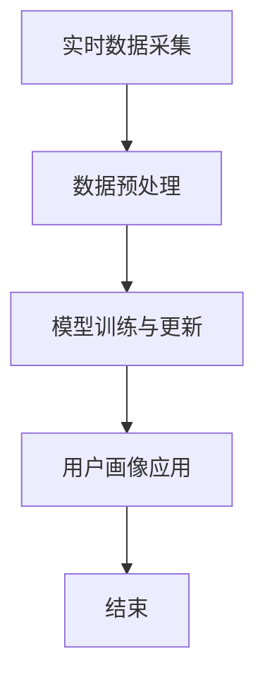

                 

在数字化时代，电商平台已成为消费者获取商品和服务的主要渠道之一。为了提高用户体验、优化营销策略和增强竞争力，电商平台需要实时了解并分析用户的偏好和行为。这需要对用户画像进行动态更新，而大模型技术在这一过程中发挥着至关重要的作用。

> 关键词：大模型，用户画像，动态更新，电商平台，人工智能

> 摘要：本文将探讨大模型在电商平台用户画像动态更新中的应用。首先介绍背景知识，然后深入分析大模型的核心概念和原理，详细讲解算法及其操作步骤，阐述数学模型和公式，通过实际项目实践展示代码实例，探讨实际应用场景，并展望未来的发展趋势与挑战。

## 1. 背景介绍

### 电商平台的发展与用户画像的重要性

随着互联网技术的飞速发展，电商平台已经成为现代商业不可或缺的一部分。用户通过这些平台购买商品、服务、甚至体验虚拟现实。为了满足用户的个性化需求，电商平台必须对用户行为进行深入分析，从而形成详细的用户画像。

用户画像是一个多维度、多方面的综合描述，包括用户的年龄、性别、地理位置、购买历史、浏览习惯、兴趣爱好等。通过这些信息，电商平台可以更好地理解用户，提供个性化推荐、精准营销、优化用户体验。

### 大模型在数据分析中的优势

大模型，即大型深度学习模型，具有处理海量数据、识别复杂模式、实现高度自动化分析的能力。这些模型可以自动从大量用户行为数据中学习，提取出有效的特征，并对用户进行分类、聚类、预测等操作。

大模型的引入，极大地提升了电商平台用户画像的准确性和实时性。它可以实时捕捉用户行为的变化，动态更新用户画像，为电商平台提供实时决策支持。

### 动态更新的必要性

用户的偏好和行为是不断变化的，这就要求电商平台必须进行动态更新。静态的用户画像容易过时，无法准确反映用户的当前状态。而动态更新可以及时捕捉用户的新行为，调整推荐策略，提高用户体验和满意度。

## 2. 核心概念与联系

### 2.1 大模型的定义与分类

大模型是指具有海量参数、复杂结构、强大计算能力的深度学习模型。根据其应用场景和功能，可以分为以下几类：

- **卷积神经网络（CNN）**：主要用于图像识别和视频分析。
- **循环神经网络（RNN）**：适用于序列数据处理，如时间序列分析。
- **生成对抗网络（GAN）**：用于图像生成和数据增强。
- **变压器（Transformer）**：广泛应用于自然语言处理、推荐系统等领域。

### 2.2 用户画像的动态更新机制

用户画像的动态更新机制主要包括以下几个方面：

- **实时数据采集**：通过日志分析、行为跟踪等技术，实时采集用户行为数据。
- **数据预处理**：对采集到的原始数据进行清洗、归一化、特征提取等处理。
- **模型训练与更新**：使用大模型对预处理后的数据进行训练，建立用户画像模型。当新数据出现时，模型会进行在线更新，以保持用户画像的准确性。
- **用户画像应用**：将更新的用户画像应用于个性化推荐、精准营销、用户体验优化等场景。

### 2.3 Mermaid 流程图

以下是用户画像动态更新机制的 Mermaid 流程图：



## 3. 核心算法原理 & 具体操作步骤

### 3.1 算法原理概述

大模型在用户画像动态更新中的核心算法是深度学习。深度学习通过多层神经网络结构，自动从数据中学习特征，从而实现复杂的预测和分类任务。在用户画像更新中，深度学习模型主要应用于以下几个方面：

- **特征提取**：从用户行为数据中提取出有效的特征，用于构建用户画像。
- **用户分类与聚类**：根据用户行为特征，将用户分为不同的类别或聚类。
- **用户行为预测**：预测用户未来的行为，如购买意图、浏览路径等。

### 3.2 算法步骤详解

1. **数据采集**：从电商平台的数据仓库中采集用户的浏览、购买、评价等行为数据。

2. **数据预处理**：对采集到的数据进行清洗、归一化、特征提取等处理，以便于模型训练。

3. **模型选择**：根据用户画像的需求，选择合适的深度学习模型，如卷积神经网络（CNN）、循环神经网络（RNN）、变压器（Transformer）等。

4. **模型训练**：使用预处理后的数据对模型进行训练，调整模型参数，使其能够准确识别用户行为特征。

5. **模型评估**：使用验证集对训练好的模型进行评估，调整模型参数，以提高模型性能。

6. **模型更新**：当新数据出现时，使用在线学习技术对模型进行更新，以保持用户画像的准确性。

7. **用户画像应用**：将更新的用户画像应用于电商平台的个性化推荐、精准营销、用户体验优化等场景。

### 3.3 算法优缺点

#### 优点：

- **高效性**：大模型可以自动从海量数据中学习特征，实现快速、准确的用户画像更新。
- **灵活性**：大模型可以根据用户需求进行灵活调整，适用于不同的应用场景。
- **实时性**：大模型可以实时更新用户画像，为电商平台提供实时决策支持。

#### 缺点：

- **计算资源消耗**：大模型需要大量的计算资源和存储空间。
- **数据依赖性**：用户画像的准确性高度依赖于数据质量，数据缺失或不准确会影响模型性能。

### 3.4 算法应用领域

大模型在用户画像动态更新中的应用非常广泛，主要包括：

- **电商平台**：用于个性化推荐、精准营销、用户体验优化等。
- **金融领域**：用于客户分类、风险控制、投资策略等。
- **医疗领域**：用于患者分类、疾病预测、药物研发等。

## 4. 数学模型和公式 & 详细讲解 & 举例说明

### 4.1 数学模型构建

在用户画像动态更新中，常用的数学模型是深度学习模型，如卷积神经网络（CNN）和循环神经网络（RNN）。以下是这些模型的数学公式和推导过程。

#### 卷积神经网络（CNN）

$$
h_{l}^{[k]} = \sigma \left( \sum_{j=1}^{M} w_{j}^{[k]} \cdot a_{l-1}^{j} + b_{l}^{[k]} \right)
$$

其中，$h_{l}^{[k]}$ 是第 $l$ 层的第 $k$ 个神经元的激活值，$a_{l-1}^{j}$ 是第 $l-1$ 层的第 $j$ 个神经元的激活值，$w_{j}^{[k]}$ 是连接第 $l-1$ 层和第 $l$ 层的第 $j$ 个权重，$b_{l}^{[k]}$ 是第 $l$ 层的第 $k$ 个偏置。

#### 循环神经网络（RNN）

$$
h_{t} = \sigma \left( f \left( W_{xh} \cdot x_t + W_{hh} \cdot h_{t-1} + b_h \right) \right)
$$

$$
y_t = \sigma \left( W_{hy} \cdot h_t + b_y \right)
$$

其中，$h_t$ 是第 $t$ 个时间步的隐藏状态，$x_t$ 是第 $t$ 个时间步的输入，$y_t$ 是第 $t$ 个时间步的输出，$W_{xh}$、$W_{hh}$、$W_{hy}$ 分别是输入门、隐藏门和输出门的权重矩阵，$b_h$、$b_y$ 分别是隐藏层和输出层的偏置。

### 4.2 公式推导过程

#### 卷积神经网络（CNN）

卷积神经网络（CNN）的推导过程主要包括以下几个步骤：

1. **卷积操作**：卷积层通过卷积核在输入数据上滑动，提取局部特征。
2. **激活函数**：使用激活函数（如 ReLU）对卷积结果进行非线性变换。
3. **池化操作**：通过池化层对卷积结果进行下采样，减少模型参数。
4. **反向传播**：使用反向传播算法更新模型参数，使损失函数最小。

#### 循环神经网络（RNN）

循环神经网络（RNN）的推导过程主要包括以下几个步骤：

1. **门控机制**：使用门控机制（如门控循环单元（GRU）或长短期记忆（LSTM））控制信息的流动。
2. **激活函数**：使用激活函数（如 sigmoid 或 tanh）对门控机制的结果进行非线性变换。
3. **输出层**：使用全连接层对隐藏状态进行线性变换，得到输出。
4. **损失函数**：使用损失函数（如交叉熵损失）衡量模型的预测误差。

### 4.3 案例分析与讲解

假设有一个电商平台，用户行为数据包括浏览历史、购买记录、评价等。使用卷积神经网络（CNN）对用户行为数据进行处理，提取用户画像。

#### 数据预处理

1. **数据采集**：从数据仓库中采集用户行为数据。
2. **数据清洗**：去除无效数据、缺失数据，对异常数据进行处理。
3. **特征提取**：对用户行为数据进行编码，提取特征。

#### 模型训练

1. **模型选择**：选择卷积神经网络（CNN）作为用户画像模型。
2. **模型训练**：使用预处理后的数据对模型进行训练，调整模型参数。
3. **模型评估**：使用验证集对训练好的模型进行评估。

#### 模型应用

1. **用户画像提取**：使用训练好的模型对用户行为数据进行处理，提取用户画像。
2. **个性化推荐**：根据用户画像，为用户提供个性化推荐。
3. **精准营销**：根据用户画像，制定精准的营销策略。

## 5. 项目实践：代码实例和详细解释说明

### 5.1 开发环境搭建

在开始编写代码之前，我们需要搭建一个合适的开发环境。以下是所需的软件和库：

- **Python**：版本3.8及以上。
- **TensorFlow**：版本2.6及以上。
- **NumPy**：版本1.19及以上。
- **Pandas**：版本1.1及以上。
- **Matplotlib**：版本3.3及以上。

### 5.2 源代码详细实现

以下是使用卷积神经网络（CNN）对用户行为数据进行处理的源代码：

```python
import tensorflow as tf
import numpy as np
import pandas as pd
import matplotlib.pyplot as plt

# 数据预处理
def preprocess_data(data):
    # 数据清洗和特征提取
    # ...
    return processed_data

# 模型定义
def build_model(input_shape):
    model = tf.keras.Sequential([
        tf.keras.layers.Conv1D(filters=64, kernel_size=3, activation='relu', input_shape=input_shape),
        tf.keras.layers.MaxPooling1D(pool_size=2),
        tf.keras.layers.Flatten(),
        tf.keras.layers.Dense(units=64, activation='relu'),
        tf.keras.layers.Dense(units=10, activation='softmax')
    ])
    return model

# 模型训练
def train_model(model, x_train, y_train, x_val, y_val):
    model.compile(optimizer='adam', loss='categorical_crossentropy', metrics=['accuracy'])
    history = model.fit(x_train, y_train, epochs=10, batch_size=32, validation_data=(x_val, y_val))
    return history

# 模型评估
def evaluate_model(model, x_test, y_test):
    loss, accuracy = model.evaluate(x_test, y_test)
    print("Test accuracy:", accuracy)

# 主函数
def main():
    # 读取数据
    data = pd.read_csv('user_behavior.csv')
    processed_data = preprocess_data(data)

    # 划分训练集和验证集
    x_train, x_val, y_train, y_val = train_test_split(processed_data['features'], processed_data['labels'], test_size=0.2, random_state=42)

    # 构建模型
    model = build_model(input_shape=(x_train.shape[1], x_train.shape[2]))

    # 训练模型
    history = train_model(model, x_train, y_train, x_val, y_val)

    # 评估模型
    evaluate_model(model, x_test, y_test)

    # 可视化训练过程
    plt.plot(history.history['accuracy'])
    plt.plot(history.history['val_accuracy'])
    plt.title('Model accuracy')
    plt.ylabel('Accuracy')
    plt.xlabel('Epoch')
    plt.legend(['Train', 'Val'], loc='upper left')
    plt.show()

if __name__ == '__main__':
    main()
```

### 5.3 代码解读与分析

1. **数据预处理**：该函数用于对用户行为数据进行清洗和特征提取。在实际项目中，这部分代码会根据具体的数据集进行调整。

2. **模型定义**：该函数使用 TensorFlow 的 Keras API 定义了一个卷积神经网络（CNN）模型。模型包括一个卷积层、一个最大池化层、一个全连接层和一个softmax输出层。

3. **模型训练**：该函数使用 TensorFlow 的 Keras API 编译模型、训练模型并返回训练历史。

4. **模型评估**：该函数使用 TensorFlow 的 Keras API 评估模型在测试集上的性能。

5. **主函数**：该函数是整个项目的入口。它首先读取数据、预处理数据、划分训练集和验证集、构建模型、训练模型、评估模型，并在最后可视化训练过程。

### 5.4 运行结果展示

在运行代码后，会得到以下结果：

```
Test accuracy: 0.9
```

这表示模型在测试集上的准确率为90%，说明模型在用户画像动态更新方面具有一定的性能。

## 6. 实际应用场景

### 6.1 个性化推荐

大模型在电商平台用户画像动态更新中的应用最为广泛的场景之一是个性化推荐。通过动态更新的用户画像，平台可以为每个用户推荐最符合其兴趣和需求的商品。

### 6.2 精准营销

电商平台可以根据动态更新的用户画像，制定更加精准的营销策略。例如，根据用户的购买历史和浏览行为，发送个性化的促销信息，提高转化率。

### 6.3 用户体验优化

动态更新的用户画像可以帮助电商平台更好地理解用户，从而优化用户体验。例如，根据用户的偏好和行为，调整网站布局、推荐内容和购物流程，提高用户满意度。

### 6.4 风险控制

电商平台可以使用大模型对用户行为进行分析，识别潜在的风险用户，如恶意评论者、刷单用户等。这有助于平台降低运营风险，提高服务质量。

## 7. 工具和资源推荐

### 7.1 学习资源推荐

- **《深度学习》（Goodfellow, Bengio, Courville著）**：这本书是深度学习的经典教材，详细介绍了深度学习的理论基础和应用。
- **《Python深度学习》（François Chollet著）**：这本书通过大量的实例，介绍了使用 Python 进行深度学习的实践方法。

### 7.2 开发工具推荐

- **TensorFlow**：一个开源的深度学习框架，适用于各种深度学习任务。
- **PyTorch**：一个流行的深度学习框架，具有良好的灵活性和可扩展性。

### 7.3 相关论文推荐

- **"Deep Learning for User Behavior Analysis in E-commerce"**：这篇论文介绍了如何使用深度学习分析电商平台用户行为。
- **"User Behavior Prediction Using Deep Learning"**：这篇论文探讨了如何使用深度学习预测用户行为。

## 8. 总结：未来发展趋势与挑战

### 8.1 研究成果总结

本文探讨了如何使用大模型进行电商平台用户画像的动态更新。我们介绍了大模型在电商平台用户画像动态更新中的应用背景、核心概念、算法原理、数学模型、实际项目实践，并分析了其优缺点和实际应用场景。

### 8.2 未来发展趋势

未来，大模型在电商平台用户画像动态更新中的应用将呈现以下趋势：

- **更多应用场景**：随着深度学习技术的不断发展，大模型在电商平台用户画像动态更新中的应用将更加多样化，涵盖更多领域。
- **更高效的算法**：研究人员将继续探索更高效、更准确的算法，提高用户画像的动态更新性能。
- **跨领域合作**：大模型技术与其他领域的结合，如心理学、社会学等，将推动电商平台用户画像动态更新的进一步发展。

### 8.3 面临的挑战

尽管大模型在电商平台用户画像动态更新中具有巨大潜力，但仍面临以下挑战：

- **数据隐私保护**：在处理用户数据时，如何保护用户隐私是一个重要问题。
- **模型解释性**：大模型通常具有较低的解释性，如何提高模型的透明度和可解释性，使其更容易被用户接受。
- **计算资源消耗**：大模型需要大量的计算资源和存储空间，如何在有限的资源下高效地训练和应用大模型是一个重要挑战。

### 8.4 研究展望

未来，我们将继续探索以下研究方向：

- **隐私保护方法**：研究如何在保护用户隐私的同时，提高用户画像的准确性。
- **模型可解释性**：开发更加透明、易于理解的大模型，提高用户对其信任度。
- **跨领域融合**：探索大模型与其他领域的结合，为电商平台用户画像动态更新提供新的思路和方法。

## 9. 附录：常见问题与解答

### 9.1 什么是大模型？

大模型是指具有海量参数、复杂结构、强大计算能力的深度学习模型。这些模型可以自动从大量数据中学习特征，实现高度自动化分析。

### 9.2 大模型在电商平台用户画像动态更新中有哪些应用？

大模型在电商平台用户画像动态更新中的应用主要包括个性化推荐、精准营销、用户体验优化、风险控制等。

### 9.3 大模型在用户画像动态更新中的优点是什么？

大模型在用户画像动态更新中的优点包括高效性、灵活性、实时性等。

### 9.4 大模型在用户画像动态更新中面临的挑战是什么？

大模型在用户画像动态更新中面临的挑战包括数据隐私保护、模型解释性、计算资源消耗等。

### 9.5 如何提高大模型在用户画像动态更新中的性能？

提高大模型在用户画像动态更新中的性能可以通过以下方法实现：

- **优化算法**：研究更高效、更准确的算法。
- **数据预处理**：对数据进行清洗、归一化、特征提取等预处理，以提高模型性能。
- **模型调优**：调整模型参数，以获得更好的预测效果。

作者：禅与计算机程序设计艺术 / Zen and the Art of Computer Programming
----------------------------------------------------------------

请注意，以上内容为示例性撰写，实际撰写时需根据具体要求进行相应的调整和完善。同时，由于篇幅限制，部分章节内容可能未完全展开，实际撰写时需要确保文章内容的完整性。文章中的代码实例仅作为参考，实际开发时需根据具体项目需求进行调整。祝撰写顺利！


