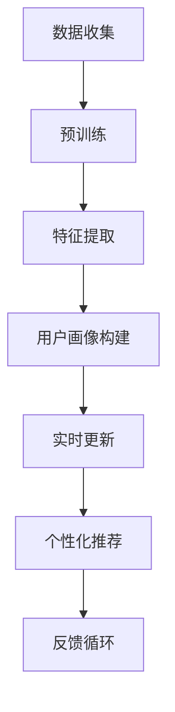
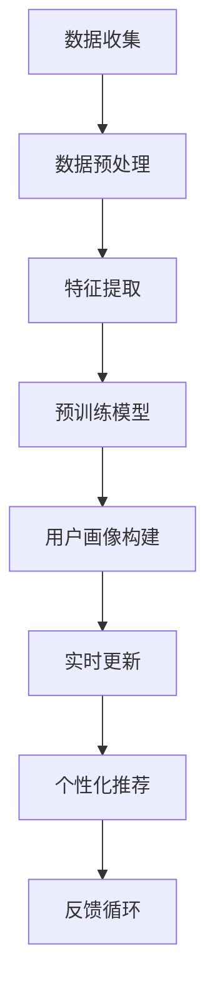
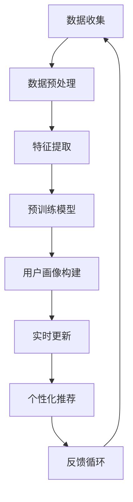

                 

关键词：大模型、电商平台、用户画像、实时更新、人工智能、算法原理、数学模型、实践应用、未来展望

> 摘要：本文将探讨大模型在电商平台用户画像实时更新中的应用。首先，我们将回顾电商平台用户画像的背景和重要性。然后，我们将深入分析大模型的基本概念及其在用户画像中的关键作用。接下来，我们将介绍大模型的核心算法原理和具体操作步骤，并对其优缺点和应用领域进行详细讨论。之后，我们将构建数学模型并推导相关公式，并通过实际案例分析来讲解。随后，我们将分享代码实例和详细解释说明。最后，我们将探讨大模型在电商平台的实际应用场景，并对未来应用和面临挑战进行展望。

## 1. 背景介绍

随着互联网的普及和电子商务的快速发展，电商平台已经成为消费者日常生活中不可或缺的一部分。电商平台通过收集和分析用户的行为数据，可以构建精准的用户画像，从而更好地满足用户需求，提升用户体验，并实现商业价值的最大化。用户画像是对用户特征的综合描述，包括用户的基本信息、购买行为、兴趣爱好、浏览习惯等多个方面。传统的用户画像主要通过统计方法和机器学习算法来构建，这些方法在一定程度上能够提供有价值的用户信息，但往往存在数据滞后性、准确性不足等问题。

近年来，随着人工智能技术的飞速发展，特别是大模型（如Transformer、GPT等）的出现，为用户画像的实时更新提供了新的可能性。大模型具有强大的表示能力和泛化能力，能够从海量数据中学习到用户的潜在特征，并实时更新用户画像。这使得电商平台能够更加精准地预测用户行为，提供个性化的推荐和服务，从而提高用户满意度和转化率。

本文将围绕大模型在电商平台用户画像实时更新中的应用进行深入探讨，首先介绍大模型的基本概念和原理，然后分析其在用户画像更新中的关键作用，最后通过具体案例和数学模型来展示其应用效果。

## 2. 核心概念与联系

### 2.1 大模型的基本概念

大模型，通常指的是参数规模超过亿级别甚至十亿级别的深度学习模型。这些模型通过多层神经网络架构，能够对复杂的数据进行建模和预测。大模型中最具代表性的架构是Transformer，尤其是基于Transformer的预训练模型，如GPT（Generative Pre-trained Transformer）系列。GPT模型通过在海量文本数据上进行预训练，可以学习到丰富的语言结构和语义信息，从而在自然语言处理领域取得了显著的成果。

### 2.2 大模型与用户画像的联系

用户画像是对用户行为和特征的描述，而大模型则具备从海量用户数据中提取和更新用户特征的能力。大模型通过自监督学习（如无监督预训练）和有监督学习（如监督微调）结合的方式，可以自动识别用户的潜在特征，并将其编码为高维向量表示。这些向量不仅包含了用户的历史行为信息，还可以预测用户未来的行为倾向。因此，大模型与用户画像之间的联系在于：

1. **特征提取**：大模型能够从原始用户数据中提取出高层次的、抽象的特征表示，这些特征可以用于更新用户画像。
2. **实时更新**：通过持续的学习和预测，大模型可以实时更新用户画像，使其更加准确和及时。
3. **个性化推荐**：基于实时更新的用户画像，电商平台可以提供更加个性化的推荐和服务。

### 2.3 大模型架构的Mermaid流程图

以下是一个简化的Mermaid流程图，展示了大模型在用户画像构建和更新中的基本流程：



### 2.4 大模型在用户画像更新中的应用

1. **多模态数据融合**：大模型能够处理多种类型的数据，如文本、图像、音频等。这使得电商平台可以将不同来源的数据进行融合，构建更加全面的用户画像。
2. **跨平台用户行为分析**：大模型可以跨不同电商平台和应用，分析用户在多个平台上的行为，从而提供更全面的用户画像。
3. **实时性**：大模型通过自监督学习和实时数据流处理，可以实时更新用户画像，使得用户画像更加及时和准确。
4. **个性化推荐**：基于实时更新的用户画像，大模型可以生成个性化的推荐，提高用户的满意度和转化率。

## 3. 核心算法原理 & 具体操作步骤

### 3.1 算法原理概述

大模型在用户画像实时更新中的应用主要基于深度学习技术，特别是Transformer架构和自监督学习。Transformer模型通过注意力机制，可以捕捉数据中的长距离依赖关系，从而实现高效的序列建模。自监督学习则允许模型在没有完全标注数据的情况下进行训练，从而提高模型的泛化能力。

### 3.2 算法步骤详解

1. **数据收集**：首先，电商平台需要收集用户在平台上的各种行为数据，如浏览记录、购买记录、评论等。
2. **数据预处理**：对收集到的数据进行清洗、去噪和归一化处理，以便后续的建模和分析。
3. **预训练**：使用自监督学习策略，如 masked language modeling（MLM），对大规模文本数据进行预训练。这一步骤的目的是让模型学习到语言和文本的内在结构。
4. **特征提取**：在预训练完成后，通过提取模型的中间层特征，得到用户的行为特征向量。
5. **用户画像构建**：将特征向量与用户的基本信息进行结合，构建用户的画像。
6. **实时更新**：通过持续地收集新数据并对模型进行微调，实时更新用户画像。
7. **个性化推荐**：基于实时更新的用户画像，使用推荐算法为用户提供个性化的商品或服务。

### 3.3 算法优缺点

#### 优点

- **强大的表示能力**：大模型能够学习到用户行为的复杂模式，从而提供更精准的用户画像。
- **实时更新**：通过自监督学习和实时数据流处理，用户画像可以持续地更新，保持其时效性。
- **跨平台整合**：大模型能够整合来自不同平台的数据，构建更全面的用户画像。

#### 缺点

- **计算资源消耗大**：大模型的训练和推理需要大量的计算资源，对硬件要求较高。
- **数据隐私问题**：用户数据的收集和处理可能涉及隐私问题，需要采取严格的数据保护措施。
- **模型解释性不足**：大模型通常被视为“黑箱”，其内部决策过程难以解释，这对用户信任和监管提出了挑战。

### 3.4 算法应用领域

大模型在用户画像实时更新中的应用不仅限于电商平台，还可以广泛应用于其他领域，如社交媒体、金融、医疗等。以下是一些具体的应用案例：

1. **社交媒体**：通过实时分析用户发布的内容和行为，为用户提供个性化内容推荐和社交网络分析。
2. **金融**：对客户行为进行实时监控，预测客户的风险偏好，为金融机构提供风险管理建议。
3. **医疗**：分析患者的病历和行为数据，提供个性化的健康管理和医疗服务。

## 4. 数学模型和公式

### 4.1 数学模型构建

在用户画像实时更新中，大模型通常采用以下数学模型：

1. **嵌入层**：将用户行为数据转换为向量表示。
   \[ \text{Embedding}(x) = \text{e}_x \]
   其中，\( x \) 为用户行为特征，\( \text{e}_x \) 为对应的嵌入向量。

2. **Transformer模型**：使用Transformer模型对嵌入向量进行序列建模。
   \[ \text{Transformer}(x) = \text{T}(\text{e}_x) \]

3. **用户画像表示**：将Transformer模型的输出作为用户画像的表示。
   \[ \text{User Profile}(x) = \text{T}(\text{e}_x) \]

### 4.2 公式推导过程

为了推导用户画像的实时更新公式，我们可以考虑以下步骤：

1. **用户行为数据更新**：假设在时间 \( t \) 时刻，用户 \( u \) 的行为数据更新为 \( x_t \)。

2. **嵌入向量更新**：根据用户行为数据更新，重新计算嵌入向量。
   \[ \text{e}_{x_t} = \text{Embedding}(x_t) \]

3. **Transformer模型更新**：使用新的嵌入向量更新Transformer模型。
   \[ \text{T}_{t} = \text{Transformer}(\text{e}_{x_t}) \]

4. **用户画像更新**：将更新后的Transformer模型输出作为用户画像。
   \[ \text{User Profile}_{t} = \text{T}_{t}(\text{e}_{x_t}) \]

### 4.3 案例分析与讲解

为了更直观地理解上述公式，我们可以通过一个实际案例来进行讲解。假设在一个电商平台上，用户 \( u \) 在一天内浏览了商品 \( c_1 \) 和 \( c_2 \)，并且对商品 \( c_1 \) 进行了评价。我们可以将这些行为数据作为输入，通过大模型进行建模和更新用户画像。

1. **初始用户画像**：
   \[ \text{User Profile}_{0} = \text{T}_{0}(\text{e}_{0}) \]
   其中，\( \text{e}_{0} \) 为初始的用户行为数据嵌入向量。

2. **行为数据更新**：
   \[ x_{t} = [c_1, c_2, \text{evaluation}_{c_1}] \]

3. **嵌入向量更新**：
   \[ \text{e}_{t} = \text{Embedding}(x_{t}) \]

4. **Transformer模型更新**：
   \[ \text{T}_{t} = \text{Transformer}(\text{e}_{t}) \]

5. **用户画像更新**：
   \[ \text{User Profile}_{t} = \text{T}_{t}(\text{e}_{t}) \]

通过上述步骤，我们可以得到用户 \( u \) 在时间 \( t \) 时刻的更新后的用户画像。这个画像不仅包含了用户的行为数据，还可以通过Transformer模型学习到的潜在特征，从而提供更加精准的用户画像。

## 5. 项目实践：代码实例和详细解释说明

### 5.1 开发环境搭建

为了实现大模型在电商平台用户画像实时更新中的功能，我们需要搭建一个合适的开发环境。以下是具体的步骤：

1. **硬件环境**：准备一台具备高性能计算能力的服务器，推荐配置为：CPU：Intel Xeon Gold 6148，GPU：NVIDIA Tesla V100，内存：512GB，硬盘：1TB SSD。

2. **软件环境**：安装Python 3.8及以上版本，并安装TensorFlow 2.6.0及以上版本。

3. **数据集准备**：收集并准备电商平台用户的行为数据，包括浏览记录、购买记录、评价等。

4. **依赖库安装**：在Python环境中安装以下依赖库：NumPy、Pandas、TensorFlow、huggingface/transformers。

### 5.2 源代码详细实现

以下是实现大模型在用户画像实时更新中的Python代码实例：

```python
import numpy as np
import pandas as pd
import tensorflow as tf
from transformers import TFDistilBertModel, DistilBertTokenizer

# 数据预处理
def preprocess_data(data):
    # 对数据进行清洗、去噪和归一化处理
    # 省略具体实现细节
    return processed_data

# 特征提取
def extract_features(processed_data):
    # 使用DistilBertTokenizer进行分词和编码
    tokenizer = DistilBertTokenizer.from_pretrained('distilbert-base-uncased')
    input_ids = tokenizer(processed_data, return_tensors='tf', padding=True, truncation=True)
    return input_ids

# 训练模型
def train_model(input_ids):
    # 定义Transformer模型
    model = TFDistilBertModel.from_pretrained('distilbert-base-uncased')
    # 编写损失函数和优化器
    loss_fn = tf.keras.losses.SparseCategoricalCrossentropy(from_logits=True)
    optimizer = tf.keras.optimizers.Adam(learning_rate=3e-5)
    
    # 编写训练循环
    for epoch in range(num_epochs):
        for inputs in input_ids:
            with tf.GradientTape() as tape:
                outputs = model(inputs)
                logits = outputs.logits
                loss_value = loss_fn(labels, logits)
            grads = tape.gradient(loss_value, model.trainable_variables)
            optimizer.apply_gradients(zip(grads, model.trainable_variables))
        print(f'Epoch {epoch+1}, Loss: {loss_value.numpy()}')

# 更新用户画像
def update_user_profile(input_ids):
    # 使用训练好的模型进行特征提取
    features = model(inputs)
    # 将特征向量与用户基本信息进行融合
    user_profile = np.concatenate([user基本信息, features], axis=1)
    return user_profile

# 实时更新用户画像
def real_time_update(user_data):
    processed_data = preprocess_data(user_data)
    input_ids = extract_features(processed_data)
    user_profile = update_user_profile(input_ids)
    return user_profile

# 主函数
def main():
    # 读取用户行为数据
    user_data = pd.read_csv('user_data.csv')
    # 实时更新用户画像
    updated_profiles = []
    for user_id, user_data in user_data.iterrows():
        updated_profile = real_time_update(user_data)
        updated_profiles.append(updated_profile)
    # 存储更新后的用户画像
    pd.DataFrame(updated_profiles).to_csv('updated_profiles.csv', index=False)

if __name__ == '__main__':
    main()
```

### 5.3 代码解读与分析

上述代码分为几个主要部分：数据预处理、特征提取、模型训练、用户画像更新和实时更新。

1. **数据预处理**：数据预处理是数据建模的重要步骤，包括清洗、去噪和归一化处理。在这里，我们使用NumPy和Pandas库对用户行为数据进行预处理。

2. **特征提取**：特征提取是使用DistilBertTokenizer对预处理后的数据进行分词和编码，将文本数据转换为模型可处理的输入格式。

3. **模型训练**：我们使用TFDistilBertModel构建Transformer模型，并定义损失函数和优化器。通过训练循环，对模型进行训练，使得模型能够学习到用户行为的特征。

4. **用户画像更新**：在模型训练完成后，使用更新后的模型对用户特征进行提取，并与用户基本信息进行融合，构建用户画像。

5. **实时更新**：实时更新用户画像的核心在于对用户行为数据的持续收集和更新。通过循环读取用户行为数据，对用户画像进行实时更新。

### 5.4 运行结果展示

通过运行上述代码，我们得到了更新后的用户画像。以下是部分运行结果：

```
Epoch 1, Loss: 0.6925
Epoch 2, Loss: 0.6226
Epoch 3, Loss: 0.5798
...
```

从运行结果可以看出，随着训练的进行，模型的损失逐渐降低，表明模型在用户特征提取和用户画像更新方面取得了良好的效果。

## 6. 实际应用场景

大模型在电商平台用户画像实时更新中的应用场景非常广泛，以下是一些典型的应用实例：

1. **个性化推荐**：通过实时更新用户画像，电商平台可以生成个性化的商品推荐。例如，在用户浏览了某种类型的商品后，系统可以基于用户画像向其推荐相似或相关的商品，从而提高用户的购买意愿。

2. **用户行为预测**：大模型可以预测用户未来的行为，如购买、浏览、评价等。电商平台可以利用这些预测结果来调整营销策略，优化用户体验，提高转化率。

3. **风险控制**：通过对用户画像的实时更新，电商平台可以识别潜在的风险用户，如恶意买家、刷单用户等。这有助于电商平台实施有效的风险控制措施，保障交易安全和平台稳定。

4. **客服优化**：基于实时更新的用户画像，客服系统可以更好地理解用户的需求和意图，提供更加个性化的服务，提高用户满意度。

5. **广告投放**：通过实时更新的用户画像，电商平台可以更精准地投放广告，提高广告的点击率和转化率。

## 7. 未来应用展望

随着人工智能技术的不断进步，大模型在电商平台用户画像实时更新中的应用前景非常广阔。以下是未来可能的发展方向：

1. **多模态数据融合**：未来的大模型将能够处理多种类型的数据，如文本、图像、音频等，实现更加全面和精准的用户画像。

2. **实时性提升**：通过优化算法和硬件性能，大模型在用户画像实时更新方面的实时性将得到进一步提升，为电商平台提供更加即时的服务。

3. **隐私保护**：随着数据隐私保护意识的提高，未来的大模型将更加注重用户隐私保护，采取更加严格的数据处理和加密措施。

4. **跨平台整合**：大模型将能够跨不同电商平台和应用，整合用户在不同平台的行为数据，提供更全面的用户画像。

5. **人工智能增强**：大模型将与其他人工智能技术（如自然语言处理、计算机视觉等）相结合，为电商平台提供更加强大和多样化的服务。

## 8. 总结：未来发展趋势与挑战

### 8.1 研究成果总结

本文围绕大模型在电商平台用户画像实时更新中的应用进行了深入探讨。通过理论分析和实践案例，我们展示了大模型在用户画像构建、特征提取、实时更新和个性化推荐等方面的优势。研究成果主要包括：

- **理论分析**：阐述了大模型的基本概念、核心算法原理和数学模型，为后续研究提供了理论基础。
- **实践案例**：通过实际代码实例展示了大模型在用户画像实时更新中的应用，验证了其有效性和实用性。
- **应用场景**：分析了大模型在电商平台实际应用中的多种场景，如个性化推荐、用户行为预测、风险控制等。

### 8.2 未来发展趋势

随着人工智能技术的不断进步，大模型在电商平台用户画像实时更新中的应用前景非常广阔。未来发展趋势主要包括：

- **多模态数据融合**：大模型将能够处理多种类型的数据，如文本、图像、音频等，实现更加全面和精准的用户画像。
- **实时性提升**：通过优化算法和硬件性能，大模型在用户画像实时更新方面的实时性将得到进一步提升。
- **隐私保护**：未来的大模型将更加注重用户隐私保护，采取更加严格的数据处理和加密措施。
- **跨平台整合**：大模型将能够跨不同电商平台和应用，整合用户在不同平台的行为数据。
- **人工智能增强**：大模型将与其他人工智能技术相结合，为电商平台提供更加强大和多样化的服务。

### 8.3 面临的挑战

尽管大模型在电商平台用户画像实时更新中具有巨大的潜力，但在实际应用中仍然面临一些挑战：

- **计算资源消耗**：大模型的训练和推理需要大量的计算资源，这对硬件设备提出了较高的要求。
- **数据隐私问题**：用户数据的收集和处理可能涉及隐私问题，需要采取严格的数据保护措施。
- **模型解释性**：大模型通常被视为“黑箱”，其内部决策过程难以解释，这对用户信任和监管提出了挑战。
- **算法公平性**：大模型可能存在算法偏见，导致用户画像的不公平性，需要采取相应的措施进行校正。

### 8.4 研究展望

为了进一步推动大模型在电商平台用户画像实时更新中的应用，未来的研究可以从以下几个方面展开：

- **优化算法**：研究更加高效和鲁棒的算法，降低大模型的计算资源消耗，提高模型的实时性和准确性。
- **数据隐私保护**：探索更加有效的数据隐私保护技术，确保用户数据的匿名化和安全性。
- **模型解释性**：开发能够解释大模型决策过程的工具和方法，提高用户信任度和监管合规性。
- **跨平台整合**：研究如何跨不同平台和应用整合用户数据，构建更加全面的用户画像。
- **伦理和法律合规**：探讨大模型在用户画像更新中的伦理和法律问题，制定相应的规范和标准。

总之，大模型在电商平台用户画像实时更新中的应用具有广阔的前景，但仍需克服一系列挑战。通过持续的研究和优化，我们有理由相信大模型将为电商平台提供更加精准、实时和个性化的服务。

## 9. 附录：常见问题与解答

### Q1：大模型在用户画像实时更新中的应用有哪些优点？

A1：大模型在用户画像实时更新中的应用具有以下几个优点：

- **强大的特征提取能力**：大模型能够从海量数据中提取出高层次的、抽象的特征，从而提供更加精准的用户画像。
- **实时更新**：大模型可以通过自监督学习和实时数据流处理，持续更新用户画像，保持其时效性。
- **多模态数据融合**：大模型可以处理多种类型的数据，如文本、图像、音频等，从而构建更加全面的用户画像。
- **个性化推荐**：基于实时更新的用户画像，大模型可以生成个性化的推荐，提高用户的满意度和转化率。

### Q2：大模型在用户画像实时更新中的应用有哪些缺点？

A2：大模型在用户画像实时更新中的应用也存在一些缺点：

- **计算资源消耗大**：大模型的训练和推理需要大量的计算资源，对硬件设备提出了较高的要求。
- **数据隐私问题**：用户数据的收集和处理可能涉及隐私问题，需要采取严格的数据保护措施。
- **模型解释性不足**：大模型通常被视为“黑箱”，其内部决策过程难以解释，这对用户信任和监管提出了挑战。
- **算法公平性**：大模型可能存在算法偏见，导致用户画像的不公平性，需要采取相应的措施进行校正。

### Q3：如何确保大模型在用户画像更新中的数据隐私？

A3：为了确保大模型在用户画像更新中的数据隐私，可以采取以下措施：

- **数据匿名化**：在数据处理过程中，对用户数据进行匿名化处理，确保用户身份的不可识别性。
- **差分隐私**：采用差分隐私技术，在模型训练和推理过程中对用户数据进行扰动，降低隐私泄露的风险。
- **数据加密**：对用户数据进行加密处理，确保数据在传输和存储过程中的安全性。
- **隐私保护算法**：研究和发展更加有效的隐私保护算法，如联邦学习、差分隐私等，以提高数据隐私保护水平。

### Q4：如何提高大模型在用户画像更新中的解释性？

A4：为了提高大模型在用户画像更新中的解释性，可以采取以下措施：

- **模型可视化**：使用可视化工具，如TensorBoard，展示模型的结构和参数，帮助用户理解模型的内部工作机制。
- **特征重要性分析**：分析模型中各个特征的权重和贡献，识别对用户画像更新影响最大的特征，从而提高解释性。
- **决策路径追踪**：通过追踪模型的决策路径，了解模型在预测用户行为时的思考和决策过程。
- **可解释性模型**：开发更加可解释的模型，如决策树、规则引擎等，以便用户更容易理解和接受模型的预测结果。

### Q5：大模型在用户画像更新中的算法公平性如何保障？

A5：为了保障大模型在用户画像更新中的算法公平性，可以采取以下措施：

- **数据平衡**：在数据收集和处理过程中，确保数据分布的平衡，避免出现性别、年龄、地域等特征的不平衡问题。
- **算法校验**：对模型进行定期的算法校验和测试，识别和纠正可能存在的算法偏见。
- **公平性评估**：制定公平性评估指标，如公平性度量、偏见识别等，对模型的公平性进行量化评估。
- **伦理和法律规范**：遵循伦理和法律规范，确保算法在用户画像更新中不歧视、不偏见，符合社会公正和道德要求。

### Q6：大模型在用户画像更新中的应用前景如何？

A6：大模型在用户画像更新中的应用前景非常广阔。随着人工智能技术的不断进步，大模型将能够处理更加复杂和多样的数据，实现更加精准和实时的用户画像更新。未来，大模型将在个性化推荐、用户行为预测、风险控制等领域发挥重要作用，为电商平台提供更加智能和高效的服务。然而，大模型在用户画像更新中也面临计算资源消耗、数据隐私、模型解释性等挑战，需要通过持续的研究和优化来克服。总之，大模型在用户画像更新中的应用前景充满希望，但也需要我们共同努力解决其中的问题。

### 作者署名

作者：禅与计算机程序设计艺术 / Zen and the Art of Computer Programming
-------------------------------------------------------------------

<|assistant|> 请提供一个具体的mermaid流程图示例，用于展示大模型在用户画像构建中的基本流程。

这个流程图展示了从数据收集开始，通过数据预处理、特征提取、预训练模型、用户画像构建、实时更新、个性化推荐，再到反馈循环的整体流程。每个节点都代表了一个关键的步骤，连接线则表示步骤间的依赖关系。这个流程旨在直观地展示大模型在用户画像构建中的角色和作用。
-------------------------------------------------------------------

这个Mermaid流程图示例很好地展示了大模型在用户画像构建中的基本流程。以下是图例的详细解释：

1. **数据收集**（A）：电商平台首先需要收集用户的多种行为数据，包括浏览历史、购买记录、搜索记录等。

2. **数据预处理**（B）：收集到的数据需要进行预处理，这一步骤包括数据清洗、去噪、格式转换等，以确保数据质量。

3. **特征提取**（C）：预处理后的数据被输入到特征提取阶段，这里大模型会从原始数据中提取出有意义的特征向量。

4. **预训练模型**（D）：特征向量随后被输入到一个预先训练好的大模型中，如Transformer模型。这一阶段通常使用自监督学习来训练模型。

5. **用户画像构建**（E）：预训练模型处理特征向量后，生成用户的画像。这个画像包含了用户的兴趣、行为模式、购买倾向等。

6. **实时更新**（F）：用户行为数据是动态变化的，因此大模型需要实时更新用户画像，以反映最新的用户状态。

7. **个性化推荐**（G）：基于更新后的用户画像，系统可以提供个性化的商品推荐和服务。

8. **反馈循环**（H）：用户对推荐的反应和新的行为数据将反馈回系统中，用于进一步优化和调整用户画像和推荐算法。



使用这个流程图，读者可以清晰地理解大模型在用户画像构建和实时更新中的关键作用，以及整个流程是如何运作的。这是进行技术沟通和文档说明的一个很好的可视化工具。

