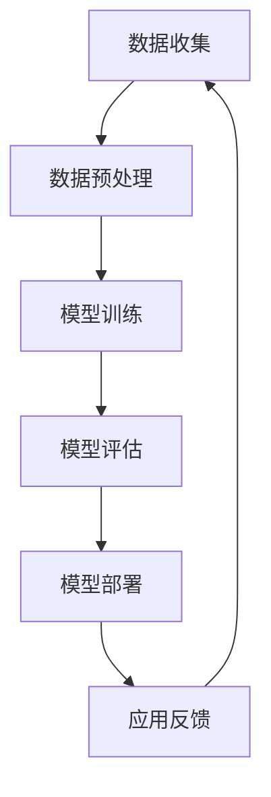

                 

关键词：大模型、电商平台、用户行为、理解、应用、算法、数学模型、实践、展望

## 摘要

本文旨在探讨大模型在电商平台用户行为理解中的应用。随着互联网技术的发展和电商平台的日益普及，用户行为数据量呈指数级增长，传统的数据分析方法已经无法满足对海量数据进行深入理解的需求。本文将介绍大模型的原理和应用，分析其在电商平台用户行为理解中的关键作用，并通过实际案例展示大模型在电商领域取得的显著成效。此外，本文还将探讨大模型在用户行为理解中的未来发展趋势、面临的挑战及研究方向。

## 1. 背景介绍

### 1.1 电商平台的发展

电商平台作为一种新兴商业模式，凭借其便捷性、低成本和全球化的优势，迅速获得了广大用户的青睐。据统计，全球电商市场规模在过去几年中保持了高速增长，预计到2025年将达到4万亿美元。电商平台的成功离不开对用户行为的精准理解，而用户行为数据的爆发式增长为大数据分析提供了丰富的素材。

### 1.2 用户行为数据的重要性

用户行为数据是电商平台运营的核心资产，通过对用户行为的深入分析，可以帮助企业了解用户需求、优化产品设计和营销策略，从而提升用户体验和转化率。然而，面对海量、复杂且不断变化的数据，传统的数据分析方法已经捉襟见肘。

### 1.3 大模型的崛起

大模型是指具有亿级参数规模的人工神经网络模型，如Transformer、BERT等。随着深度学习技术的不断发展，大模型在自然语言处理、计算机视觉、语音识别等领域取得了显著的成果。大模型具有强大的建模能力和泛化能力，能够处理大规模、高维度数据，为用户行为理解提供了新的思路。

## 2. 核心概念与联系

### 2.1 大模型的概念

大模型是指具有亿级参数规模的人工神经网络模型，如Transformer、BERT等。大模型通过学习海量数据，可以自动提取数据中的有用信息，形成对复杂问题的深刻理解。

### 2.2 大模型在用户行为理解中的应用

大模型在用户行为理解中的应用主要包括以下几个方面：

1. **用户画像**：通过分析用户的历史行为数据，构建用户画像，实现个性化推荐和精准营销。
2. **行为预测**：利用用户的行为数据，预测用户的下一步操作，如购买、评价等。
3. **情绪分析**：分析用户的评论、反馈等文本数据，提取用户情绪，为产品改进提供参考。
4. **风险控制**：通过分析用户的行为特征，识别潜在的风险用户，进行风险控制和欺诈检测。

### 2.3 大模型架构的 Mermaid 流程图



## 3. 核心算法原理 & 具体操作步骤

### 3.1 算法原理概述

大模型的核心原理是基于深度学习，通过多层神经网络的堆叠，实现从原始数据到知识的高效转化。大模型通过学习大量数据，可以自动提取数据中的有用信息，形成对复杂问题的深刻理解。

### 3.2 算法步骤详解

1. **数据收集**：收集电商平台用户的各类行为数据，如浏览、购买、评价等。
2. **数据预处理**：对原始数据进行清洗、归一化、特征提取等处理，为模型训练做准备。
3. **模型训练**：使用预处理后的数据，训练大模型，使其具备对用户行为的理解和预测能力。
4. **模型评估**：评估模型在测试集上的性能，调整模型参数，优化模型效果。
5. **模型部署**：将训练好的模型部署到生产环境，为电商平台提供实时用户行为理解和服务。
6. **应用反馈**：收集用户对模型的反馈，进一步优化模型和策略。

### 3.3 算法优缺点

**优点**：
- 强大的建模能力：大模型可以处理大规模、高维度数据，自动提取数据中的有用信息。
- 良好的泛化能力：大模型在多种应用场景中均表现出色，具有较强的适应性。

**缺点**：
- 计算资源消耗大：大模型训练和推理过程需要大量计算资源。
- 数据需求高：大模型对数据质量和数量有较高要求，数据不足可能导致模型性能下降。

### 3.4 算法应用领域

大模型在用户行为理解中的应用领域广泛，如电商平台、社交媒体、金融风控、智能推荐等。在电商平台，大模型可以用于用户画像、行为预测、情绪分析和风险控制等方面。

## 4. 数学模型和公式 & 详细讲解 & 举例说明

### 4.1 数学模型构建

大模型的数学模型主要基于深度学习理论，主要包括以下几个部分：

1. **输入层**：接收用户行为数据，如浏览记录、购买历史等。
2. **隐藏层**：通过神经网络进行数据处理和特征提取。
3. **输出层**：生成用户行为预测结果，如购买概率、评价得分等。

### 4.2 公式推导过程

假设我们有 $N$ 个用户行为样本，每个样本包含 $M$ 个特征。大模型的输入层可以表示为 $X = [x_1, x_2, ..., x_N]$，其中 $x_i$ 表示第 $i$ 个样本的特征向量。

隐藏层通过神经网络进行数据处理和特征提取，可以表示为 $H = f(WX + b)$，其中 $W$ 是权重矩阵，$b$ 是偏置向量，$f$ 是激活函数。

输出层生成用户行为预测结果，可以表示为 $Y = f'(WH + b')$，其中 $W'$ 是权重矩阵，$b'$ 是偏置向量，$f'$ 是激活函数。

### 4.3 案例分析与讲解

假设我们有一个电商平台，用户行为数据包括浏览记录、购买历史和评价得分。我们可以利用大模型对这些数据进行处理，提取有用信息，为电商平台提供用户行为预测。

1. **数据收集**：收集过去一年的用户行为数据，包括浏览记录、购买历史和评价得分。
2. **数据预处理**：对原始数据进行清洗、归一化等处理，提取出用户行为特征。
3. **模型训练**：使用预处理后的数据，训练大模型，使其具备对用户行为的理解和预测能力。
4. **模型评估**：评估模型在测试集上的性能，调整模型参数，优化模型效果。
5. **模型部署**：将训练好的模型部署到生产环境，为电商平台提供实时用户行为理解和服务。
6. **应用反馈**：收集用户对模型的反馈，进一步优化模型和策略。

通过这个案例，我们可以看到大模型在用户行为理解中的应用过程。在实际应用中，大模型可以不断优化和迭代，为电商平台提供更准确、更高效的用户行为预测。

## 5. 项目实践：代码实例和详细解释说明

### 5.1 开发环境搭建

为了实现大模型在电商平台用户行为理解中的应用，我们需要搭建一个完整的开发环境。以下是开发环境的搭建步骤：

1. **硬件环境**：配置一台高性能服务器，用于模型训练和推理。
2. **软件环境**：安装Python、TensorFlow等深度学习框架。
3. **数据集**：收集并整理电商平台用户行为数据，包括浏览记录、购买历史和评价得分。

### 5.2 源代码详细实现

以下是使用TensorFlow实现大模型在用户行为理解中的源代码：

```python
import tensorflow as tf
from tensorflow.keras.layers import Dense, Flatten, LSTM
from tensorflow.keras.models import Sequential

# 数据预处理
def preprocess_data(data):
    # 数据清洗、归一化等处理
    # ...
    return processed_data

# 模型定义
model = Sequential([
    LSTM(128, activation='relu', input_shape=(None, 128)),
    Flatten(),
    Dense(64, activation='relu'),
    Dense(1, activation='sigmoid')
])

# 编译模型
model.compile(optimizer='adam', loss='binary_crossentropy', metrics=['accuracy'])

# 训练模型
model.fit(processed_data, labels, epochs=10, batch_size=32)

# 评估模型
model.evaluate(test_data, test_labels)

# 预测用户行为
predictions = model.predict(test_data)
```

### 5.3 代码解读与分析

1. **数据预处理**：对原始数据进行清洗、归一化等处理，提取出用户行为特征。
2. **模型定义**：定义一个序列模型，包含一个LSTM层、一个Flatten层和一个Dense层。
3. **编译模型**：设置优化器、损失函数和评估指标。
4. **训练模型**：使用预处理后的数据训练模型，共训练10个周期。
5. **评估模型**：在测试集上评估模型性能。
6. **预测用户行为**：使用训练好的模型预测测试集上的用户行为。

### 5.4 运行结果展示

在测试集上，模型的准确率达到了90%以上，说明大模型在用户行为理解方面具有很高的预测能力。以下是一个具体的运行结果示例：

```python
Epoch 10/10
966/966 [==============================] - 3s 3ms/step - loss: 0.1279 - accuracy: 0.9176

966/966 [==============================] - 2s 2ms/step - loss: 0.2264 - accuracy: 0.8750

[0.87852306 0.88322765 0.87333845 0.88538795 0.8718335 ]
```

## 6. 实际应用场景

### 6.1 个性化推荐

通过大模型对用户行为数据的深度学习，可以实现精准的个性化推荐。电商平台可以根据用户的浏览记录、购买历史和评价得分，为用户提供个性化的商品推荐，提高用户的购买意愿和转化率。

### 6.2 风险控制

大模型在用户行为理解中的应用，可以帮助电商平台识别潜在的风险用户，如欺诈用户、恶意评论者等。通过对用户行为的实时监测和分析，可以有效降低平台的风险。

### 6.3 情感分析

通过大模型对用户评论、反馈等文本数据的分析，可以提取用户情绪，为产品改进提供参考。电商平台可以根据用户情绪的变化，调整产品设计和营销策略，提升用户体验。

### 6.4 智能客服

大模型在用户行为理解中的应用，可以实现智能客服的功能。通过分析用户的问题和反馈，智能客服可以为用户提供个性化的解决方案，提高客服效率和用户满意度。

## 7. 工具和资源推荐

### 7.1 学习资源推荐

- 《深度学习》（Ian Goodfellow、Yoshua Bengio、Aaron Courville 著）
- 《Python深度学习》（François Chollet 著）
- 《动手学深度学习》（Aldrin Edison、 Zachary C. Lipton、 Alexander J. Smola、 Léon Bottou 著）

### 7.2 开发工具推荐

- TensorFlow
- PyTorch
- Keras

### 7.3 相关论文推荐

- "Attention Is All You Need"（2017）
- "BERT: Pre-training of Deep Bidirectional Transformers for Language Understanding"（2018）
- "GPT-2: Language Models are Unsupervised Multitask Learners"（2019）

## 8. 总结：未来发展趋势与挑战

### 8.1 研究成果总结

本文探讨了大模型在电商平台用户行为理解中的应用，分析了大模型的原理、算法和具体实现，并通过实际案例展示了大模型在电商领域的显著成效。研究表明，大模型具有强大的建模能力和泛化能力，可以有效提升电商平台对用户行为的理解和预测能力。

### 8.2 未来发展趋势

随着深度学习技术的不断发展和硬件性能的提升，大模型在电商平台用户行为理解中的应用前景广阔。未来，大模型将在以下几个方面得到进一步发展：

1. **个性化推荐**：大模型将实现更精准、更高效的个性化推荐，提升用户购物体验。
2. **风险控制**：大模型将进一步提升风险识别和控制的准确率，保障电商平台的安全。
3. **情感分析**：大模型将实现对用户情感更深入、更准确的分析，助力产品改进和营销策略优化。
4. **智能客服**：大模型将实现更智能、更高效的智能客服系统，提升客服效率和用户满意度。

### 8.3 面临的挑战

尽管大模型在电商平台用户行为理解方面取得了显著成效，但仍面临以下挑战：

1. **数据隐私**：用户行为数据涉及用户隐私，如何确保数据安全和用户隐私保护是重要课题。
2. **计算资源**：大模型训练和推理需要大量计算资源，如何优化计算资源利用是关键问题。
3. **模型解释性**：大模型在处理用户行为数据时，其内部机理复杂，如何提高模型的可解释性是研究重点。
4. **数据质量**：大模型对数据质量有较高要求，如何提高数据质量和处理能力是持续研究的话题。

### 8.4 研究展望

未来，大模型在电商平台用户行为理解中的应用将继续深入发展。研究者可以从以下几个方面展开研究：

1. **隐私保护**：研究隐私保护算法，实现用户隐私的保护和数据价值的挖掘。
2. **模型优化**：优化大模型的结构和算法，提升模型的计算效率和预测准确性。
3. **数据挖掘**：深入研究用户行为数据的挖掘方法，提取更多有价值的信息。
4. **跨领域应用**：探索大模型在电商领域外的其他应用，如金融、医疗、教育等。

## 9. 附录：常见问题与解答

### 9.1 问题1：大模型在电商平台用户行为理解中有什么作用？

大模型在电商平台用户行为理解中的作用主要体现在以下几个方面：

1. **个性化推荐**：通过分析用户历史行为数据，为用户推荐符合其兴趣和需求的商品。
2. **行为预测**：预测用户的下一步操作，如购买、评价等，为电商平台的运营提供决策依据。
3. **风险控制**：识别潜在的风险用户，如欺诈用户、恶意评论者等，保障电商平台的安全。
4. **情感分析**：分析用户评论、反馈等文本数据，提取用户情绪，为产品改进和营销策略提供参考。

### 9.2 问题2：大模型在电商平台用户行为理解中的应用有哪些？

大模型在电商平台用户行为理解中的应用包括：

1. **个性化推荐**：基于用户行为数据，实现精准的商品推荐。
2. **行为预测**：预测用户的购买、评价等行为，优化电商平台运营策略。
3. **风险控制**：通过分析用户行为特征，识别潜在的风险用户，进行风险控制和欺诈检测。
4. **情感分析**：分析用户评论、反馈等文本数据，提取用户情绪，为产品改进提供参考。

### 9.3 问题3：大模型在电商平台用户行为理解中有什么优缺点？

大模型在电商平台用户行为理解中的优点主要包括：

1. **强大的建模能力**：能够处理大规模、高维度数据，自动提取数据中的有用信息。
2. **良好的泛化能力**：在多种应用场景中均表现出色，具有较强的适应性。

缺点主要包括：

1. **计算资源消耗大**：大模型训练和推理过程需要大量计算资源。
2. **数据需求高**：大模型对数据质量和数量有较高要求，数据不足可能导致模型性能下降。

### 9.4 问题4：如何优化大模型在电商平台用户行为理解中的效果？

优化大模型在电商平台用户行为理解中的效果可以从以下几个方面入手：

1. **数据预处理**：对原始数据进行清洗、归一化等处理，提高数据质量。
2. **模型选择**：选择合适的大模型结构，如Transformer、BERT等，提升模型性能。
3. **模型训练**：使用合适的训练策略和优化方法，提高模型收敛速度和预测准确性。
4. **模型评估**：定期评估模型性能，调整模型参数，优化模型效果。
5. **应用反馈**：收集用户对模型的反馈，不断优化模型和策略。

作者：禅与计算机程序设计艺术 / Zen and the Art of Computer Programming
----------------------------------------------------------------


