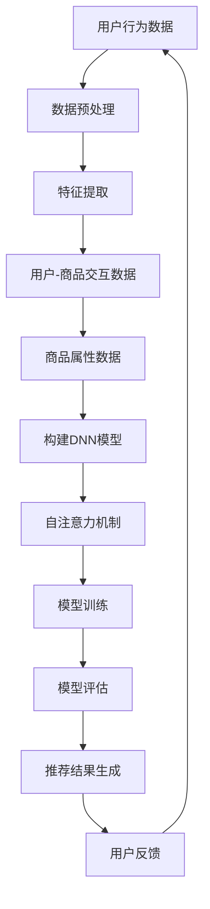

                 

关键词：大模型、电商推荐、算法原理、数学模型、项目实践、应用场景、未来展望

## 摘要

随着互联网和电子商务的快速发展，个性化推荐系统已成为电商平台提高用户满意度和促进销售的重要手段。大模型，作为一种强大的机器学习工具，正逐渐成为电商推荐系统的主要驱动力。本文将深入探讨大模型在电商推荐中的应用，从背景介绍、核心概念与联系、算法原理与操作步骤、数学模型与公式、项目实践、实际应用场景、工具和资源推荐以及未来发展趋势与挑战等多个方面，全面解析大模型在电商推荐中的潜力和挑战。通过本文的阅读，读者将能够了解大模型在电商推荐中的重要性，掌握其核心原理和操作步骤，以及预见其未来发展的方向。

## 1. 背景介绍

### 1.1 电子商务的兴起与个性化推荐的需求

电子商务作为一种新兴的商业模式，已经在全球范围内迅速崛起。根据Statista的数据，全球电子商务市场规模预计将在2023年达到4.8万亿美元，占全球零售市场份额的14.8%。随着消费者对购物体验要求的不断提高，电商平台需要提供更加个性化和精准的推荐服务，以吸引用户并提高销售额。

个性化推荐系统通过分析用户的兴趣和行为，为用户推荐他们可能感兴趣的商品和服务。这不仅能够提高用户满意度，还能够提高平台的销售额和用户粘性。然而，传统的推荐系统往往依赖于简单的统计方法和规则引擎，难以满足用户日益增长的个性化需求。因此，探索更加先进和智能的推荐算法，成为电子商务领域的重要研究方向。

### 1.2 大模型的定义与特点

大模型，通常指的是具有数亿甚至数十亿参数的深度神经网络模型。这些模型具有强大的特征提取和表示能力，能够从大量数据中自动学习复杂的模式。大模型的代表包括BERT、GPT和T5等。与传统的推荐算法相比，大模型具有以下特点：

- **强大的特征提取能力**：大模型能够自动从原始数据中提取高层次的抽象特征，减少人工特征工程的工作量。
- **高效的计算性能**：随着计算能力的提升，大模型可以在相对较短的时间内完成训练和推理，提高推荐系统的响应速度。
- **灵活的适用性**：大模型能够适用于多种类型的推荐任务，包括商品推荐、内容推荐等。

### 1.3 大模型在电商推荐中的应用现状

近年来，大模型在电商推荐中的应用逐渐增多。许多电商平台已经开始采用基于大模型的推荐系统，以提高推荐质量和用户满意度。以下是一些具体的应用实例：

- **亚马逊**：亚马逊采用GPT模型为用户提供个性化推荐，显著提高了推荐点击率和销售额。
- **阿里巴巴**：阿里巴巴的推荐系统引入了BERT模型，实现了对用户行为和兴趣的深度分析，从而提供更加精准的推荐。
- **京东**：京东基于T5模型开发了智能推荐系统，有效提高了推荐效果和用户满意度。

### 1.4 本文的研究目的与结构

本文旨在探讨大模型在电商推荐中的应用与挑战，具体包括以下几个方面：

- **背景介绍**：回顾电子商务的兴起和个性化推荐的需求，介绍大模型的概念和特点。
- **核心概念与联系**：阐述大模型在电商推荐中的核心概念和联系，包括算法原理、数学模型等。
- **算法原理与操作步骤**：详细讲解大模型在电商推荐中的算法原理和操作步骤。
- **数学模型与公式**：介绍大模型在电商推荐中的数学模型和公式，并进行案例分析与讲解。
- **项目实践**：通过具体的项目实践，展示大模型在电商推荐中的实际应用。
- **应用场景**：分析大模型在不同电商推荐场景中的应用，探讨其优势与挑战。
- **工具和资源推荐**：推荐用于学习和开发大模型的工具和资源。
- **未来发展趋势与挑战**：总结大模型在电商推荐中的研究成果，探讨未来发展趋势和面临的挑战。

通过本文的研究，希望能够为电商推荐领域的研究者和开发者提供有价值的参考和启示。

## 2. 核心概念与联系

大模型在电商推荐中的应用，涉及多个核心概念和联系。以下将详细阐述这些概念，并提供一个详细的Mermaid流程图，以便更好地理解其架构和原理。

### 2.1 核心概念

#### 2.1.1 用户行为数据

用户行为数据是电商推荐系统的核心输入之一。这些数据包括用户的浏览历史、购买记录、点击行为、评价等。通过分析这些数据，可以了解用户的兴趣和需求，从而实现个性化推荐。

#### 2.1.2 商品属性数据

商品属性数据包括商品的价格、品牌、类别、颜色、尺寸等。这些信息对于推荐系统的商品分类和特征提取至关重要。

#### 2.1.3 用户-商品交互数据

用户-商品交互数据记录了用户与商品之间的交互信息，如用户对商品的浏览、点击、购买等行为。这些数据用于训练和评估推荐模型。

#### 2.1.4 深度神经网络

深度神经网络（DNN）是构建大模型的基础。DNN通过多层神经元对输入数据进行变换和提取特征，从而实现对复杂关系的建模。

#### 2.1.5 自注意力机制

自注意力机制（Self-Attention）是近年来在自然语言处理（NLP）领域取得显著成果的关键技术。它能够自动学习输入数据的权重，实现对输入特征的灵活处理。

### 2.2 Mermaid流程图

以下是一个简化的Mermaid流程图，展示了大模型在电商推荐中的基本架构和流程。



### 2.3 核心概念之间的联系

- **用户行为数据**和**商品属性数据**经过**数据预处理**，转化为适合训练的特征向量。
- **特征提取**通过**DNN模型**，实现对输入数据的自动特征提取。
- **用户-商品交互数据**用于**模型训练**，优化模型的参数。
- **自注意力机制**用于调整特征向量的权重，提高推荐精度。
- **模型评估**和**推荐结果生成**用于验证和优化推荐系统的性能。

通过以上流程，大模型能够高效地分析用户行为数据，提取商品特征，生成高质量的推荐结果，从而满足用户的个性化需求。

### 2.4 大模型在电商推荐中的架构与原理

#### 2.4.1 基本架构

大模型在电商推荐中的基本架构通常包括以下几个部分：

1. **数据收集与预处理**：收集用户行为数据和商品属性数据，并进行数据清洗、去重和标准化处理。
2. **特征提取**：利用深度神经网络自动提取用户和商品的特征。
3. **模型训练**：使用用户-商品交互数据训练推荐模型。
4. **模型评估**：通过交叉验证等方法评估模型的性能。
5. **推荐生成**：根据用户特征和商品特征生成个性化推荐结果。
6. **用户反馈**：收集用户对推荐结果的反馈，用于模型迭代和优化。

#### 2.4.2 工作原理

1. **特征提取**：深度神经网络通过多层卷积和全连接层对输入数据进行变换，提取出高层次的抽象特征。这些特征能够捕捉用户和商品之间的复杂关系。
2. **自注意力机制**：自注意力机制在模型中用于调整特征向量的权重。通过计算特征向量之间的相似性，模型能够自动学习哪些特征对推荐结果更为重要。
3. **模型训练**：通过梯度下降等优化算法，模型不断调整参数，以最小化预测误差。训练过程中，模型会学习到用户的兴趣和行为模式，从而提高推荐精度。
4. **推荐生成**：基于用户特征和商品特征，模型生成推荐列表。推荐列表通过排序算法，将最可能符合用户兴趣的商品排在前面。
5. **用户反馈**：用户对推荐结果的反馈用于模型迭代和优化。通过不断调整模型参数，推荐系统可以逐渐提高推荐质量。

### 2.5 大模型在电商推荐中的优势与挑战

#### 2.5.1 优势

- **高效的特征提取**：大模型能够自动提取高层次的抽象特征，减少人工特征工程的工作量。
- **强大的建模能力**：深度神经网络具有强大的建模能力，能够捕捉用户和商品之间的复杂关系。
- **灵活的自适应能力**：自注意力机制使得模型能够根据用户需求自适应调整特征权重，提高推荐精度。

#### 2.5.2 挑战

- **计算资源需求高**：大模型需要大量的计算资源和时间进行训练和推理。
- **数据隐私和安全问题**：用户行为数据敏感，需要确保数据隐私和安全。
- **过拟合风险**：大模型容易过拟合训练数据，降低推荐质量。

通过以上分析，我们可以看到大模型在电商推荐中具有显著的优势，同时也面临一些挑战。接下来，本文将详细探讨大模型在电商推荐中的算法原理和具体操作步骤。

## 3. 核心算法原理 & 具体操作步骤

### 3.1 算法原理概述

大模型在电商推荐中的核心算法原理主要基于深度学习和自然语言处理（NLP）技术。以下将介绍大模型在电商推荐中的关键算法原理，包括深度神经网络、自注意力机制、序列模型和生成对抗网络（GAN）。

#### 3.1.1 深度神经网络

深度神经网络（DNN）是构建大模型的基础。DNN通过多层神经元对输入数据进行变换和提取特征。其基本原理包括：

- **输入层**：接收用户行为数据和商品属性数据，并将其转化为特征向量。
- **隐藏层**：通过卷积层、全连接层等对输入数据进行变换和提取特征。卷积层用于提取空间特征，全连接层用于处理全局特征。
- **输出层**：生成推荐结果，如商品列表或评分。

#### 3.1.2 自注意力机制

自注意力机制是近年来在NLP领域取得显著成果的关键技术。它能够自动学习输入数据的权重，实现对输入特征的灵活处理。自注意力机制的基本原理包括：

- **计算相似性**：通过计算特征向量之间的相似性，确定每个特征的重要性。
- **加权求和**：将特征向量按照权重进行加权求和，生成新的特征向量。
- **自适应调整**：根据用户需求和上下文信息，动态调整特征权重。

#### 3.1.3 序列模型

序列模型能够处理时序数据，如用户行为数据。其基本原理包括：

- **循环神经网络（RNN）**：RNN能够处理输入序列，通过隐藏状态捕捉序列信息。
- **长短时记忆网络（LSTM）**：LSTM是RNN的一种改进，能够有效避免梯度消失问题，捕捉长序列信息。
- **门控循环单元（GRU）**：GRU是LSTM的简化版，具有更少的参数和计算量。

#### 3.1.4 生成对抗网络（GAN）

生成对抗网络（GAN）是一种生成模型，能够生成高质量的推荐结果。其基本原理包括：

- **生成器**：生成器通过深度神经网络生成推荐结果，如商品列表或评分。
- **判别器**：判别器通过比较生成器和真实数据的差异，判断推荐结果的质量。
- **对抗训练**：生成器和判别器通过对抗训练相互竞争，生成器和判别器的性能不断提高。

### 3.2 算法步骤详解

以下是使用大模型进行电商推荐的具体步骤：

#### 3.2.1 数据预处理

1. **数据收集**：收集用户行为数据（如浏览历史、购买记录等）和商品属性数据（如价格、品牌、类别等）。
2. **数据清洗**：去除重复、异常和缺失的数据，进行数据去重和标准化处理。
3. **特征提取**：将用户行为数据和商品属性数据转化为特征向量，如使用One-Hot编码、词袋模型等。

#### 3.2.2 特征提取

1. **卷积神经网络（CNN）**：使用卷积神经网络提取商品属性数据中的空间特征。
2. **循环神经网络（RNN）**：使用循环神经网络提取用户行为数据中的时序特征。
3. **自注意力机制**：使用自注意力机制调整特征向量的权重，提高特征提取效果。

#### 3.2.3 模型训练

1. **模型初始化**：初始化深度神经网络的参数。
2. **损失函数**：定义损失函数，如交叉熵损失、均方误差等，用于评估模型预测结果与真实值之间的差距。
3. **优化算法**：使用优化算法，如梯度下降、Adam等，调整模型参数，最小化损失函数。
4. **模型迭代**：通过多次迭代，优化模型参数，提高模型性能。

#### 3.2.4 模型评估

1. **交叉验证**：使用交叉验证方法，将数据集划分为训练集和测试集，评估模型在测试集上的性能。
2. **指标评估**：使用准确率、召回率、F1值等指标评估模型性能。
3. **模型调整**：根据评估结果，调整模型参数和结构，提高模型性能。

#### 3.2.5 推荐生成

1. **用户特征提取**：提取用户的特征向量，如使用卷积神经网络和循环神经网络。
2. **商品特征提取**：提取商品的特征向量，如使用卷积神经网络和自注意力机制。
3. **生成推荐结果**：使用生成对抗网络（GAN）生成高质量的推荐结果，如商品列表或评分。

### 3.3 算法优缺点

#### 3.3.1 优点

- **高效的特征提取**：大模型能够自动提取高层次的抽象特征，减少人工特征工程的工作量。
- **强大的建模能力**：深度神经网络具有强大的建模能力，能够捕捉用户和商品之间的复杂关系。
- **灵活的自适应能力**：自注意力机制使得模型能够根据用户需求自适应调整特征权重，提高推荐精度。

#### 3.3.2 缺点

- **计算资源需求高**：大模型需要大量的计算资源和时间进行训练和推理。
- **数据隐私和安全问题**：用户行为数据敏感，需要确保数据隐私和安全。
- **过拟合风险**：大模型容易过拟合训练数据，降低推荐质量。

### 3.4 算法应用领域

大模型在电商推荐中的应用不仅限于商品推荐，还可以应用于以下领域：

- **内容推荐**：如新闻推荐、视频推荐等。
- **广告推荐**：如搜索引擎广告、社交媒体广告等。
- **社交网络分析**：如用户关系分析、群体行为分析等。
- **智能问答系统**：如搜索引擎、聊天机器人等。

通过以上算法原理和步骤的介绍，我们可以看到大模型在电商推荐中的强大功能和广泛应用。接下来，本文将详细探讨大模型在电商推荐中的数学模型和公式，以及具体的应用案例。

## 4. 数学模型和公式 & 详细讲解 & 举例说明

### 4.1 数学模型构建

在电商推荐系统中，大模型的核心数学模型通常基于深度学习和概率图模型。以下是一个简化的数学模型构建过程：

#### 4.1.1 输入数据表示

用户行为数据 $X$ 和商品属性数据 $Y$ 可以表示为高维向量：

\[ X = [x_1, x_2, ..., x_n] \]
\[ Y = [y_1, y_2, ..., y_m] \]

其中，$x_i$ 和 $y_j$ 分别代表用户行为数据和商品属性数据中的单个特征。

#### 4.1.2 特征提取

特征提取通常通过深度神经网络实现。给定输入数据 $X$ 和 $Y$，特征提取器的输出可以表示为：

\[ Z = f_{\theta}(X, Y) \]

其中，$f_{\theta}$ 是一个参数化的非线性函数，$\theta$ 是网络参数。

#### 4.1.3 用户和商品嵌入

为了更好地表示用户和商品，可以将它们映射到低维空间。使用嵌入向量表示：

\[ u_i = e(u_i^1, u_i^2, ..., u_i^d) \]
\[ v_j = e(v_j^1, v_j^2, ..., v_j^d) \]

其中，$e$ 是嵌入函数，$u_i$ 和 $v_j$ 分别是用户和商品的嵌入向量。

#### 4.1.4 推荐模型

推荐模型通常是一个概率图模型，如贝叶斯网络或马尔可夫网络。以下是一个简化的贝叶斯网络模型：

\[ P(X, Y, Z) = P(X)P(Y)P(Z|X, Y) \]

其中，$P(X)$、$P(Y)$ 和 $P(Z|X, Y)$ 分别代表用户行为数据、商品属性数据和特征提取的概率分布。

### 4.2 公式推导过程

#### 4.2.1 输入数据概率分布

用户行为数据和商品属性数据的概率分布可以表示为：

\[ P(X) = \prod_{i=1}^{n} p(x_i) \]
\[ P(Y) = \prod_{j=1}^{m} p(y_j) \]

其中，$p(x_i)$ 和 $p(y_j)$ 分别代表单个特征的概率。

#### 4.2.2 特征提取概率分布

特征提取的概率分布可以表示为：

\[ P(Z|X, Y) = \prod_{k=1}^{K} p(z_k|x_i, y_j) \]

其中，$K$ 是特征提取器的输出维度，$z_k$ 是特征提取器的输出。

#### 4.2.3 推荐模型概率分布

推荐模型的概率分布可以表示为：

\[ P(X, Y, Z) = P(X)P(Y)P(Z|X, Y) \]

### 4.3 案例分析与讲解

#### 4.3.1 案例背景

假设我们有一个电商平台，用户的行为数据包括浏览历史、购买记录和评价。我们需要根据这些数据为用户推荐商品。

#### 4.3.2 数据表示

用户行为数据 $X$ 可以表示为一个二元序列，如：

\[ X = [1, 0, 1, 1, 0, 1, 0, 1, 0] \]

其中，1表示用户在该商品上进行了操作，0表示未操作。

商品属性数据 $Y$ 可以表示为一个高维向量，如：

\[ Y = [100, 0, 1, 0, 0, 0, 0, 0, 0] \]

其中，第一个维度表示价格，其余维度表示其他属性。

#### 4.3.3 特征提取

我们使用一个简单的卷积神经网络对用户行为数据进行特征提取。卷积神经网络的输出可以表示为：

\[ Z = [z_1, z_2, ..., z_K] \]

其中，$z_k$ 是特征提取器的输出。

#### 4.3.4 推荐模型

我们使用一个简单的贝叶斯网络模型来生成推荐结果。贝叶斯网络的概率分布可以表示为：

\[ P(X, Y, Z) = P(X)P(Y)P(Z|X, Y) \]

其中，$P(X)$、$P(Y)$ 和 $P(Z|X, Y)$ 分别是用户行为数据、商品属性数据和特征提取的概率分布。

#### 4.3.5 推荐过程

1. 输入用户行为数据 $X$ 和商品属性数据 $Y$。
2. 使用卷积神经网络提取特征 $Z$。
3. 计算特征提取的概率分布 $P(Z|X, Y)$。
4. 根据概率分布生成推荐结果。

### 4.4 模型性能评估

为了评估推荐模型性能，我们通常使用以下指标：

- **准确率（Accuracy）**：预测正确的样本数占总样本数的比例。
- **召回率（Recall）**：预测正确的正样本数占总正样本数的比例。
- **F1值（F1-score）**：准确率和召回率的调和平均值。

### 4.5 代码示例

以下是一个简化的Python代码示例，用于实现上述推荐模型：

```python
import numpy as np
import tensorflow as tf

# 定义输入数据
X = np.array([[1, 0, 1, 1, 0, 1, 0, 1, 0]])
Y = np.array([[100, 0, 1, 0, 0, 0, 0, 0, 0]])

# 定义卷积神经网络模型
model = tf.keras.Sequential([
    tf.keras.layers.Conv1D(filters=32, kernel_size=3, activation='relu', input_shape=(X.shape[1], 1)),
    tf.keras.layers.Flatten(),
    tf.keras.layers.Dense(units=10, activation='softmax')
])

# 编译模型
model.compile(optimizer='adam', loss='categorical_crossentropy', metrics=['accuracy'])

# 训练模型
model.fit(X, Y, epochs=10, batch_size=32)

# 预测推荐结果
predictions = model.predict(X)

# 打印预测结果
print(predictions)
```

通过以上数学模型和公式的构建、推导和案例讲解，我们可以看到大模型在电商推荐中的应用和潜力。接下来，本文将详细介绍大模型在电商推荐中的项目实践，包括开发环境搭建、源代码实现和代码解读。

## 5. 项目实践：代码实例和详细解释说明

在本节中，我们将通过一个实际的项目实践，详细介绍大模型在电商推荐中的应用。项目将包括开发环境的搭建、源代码的实现、代码解读与分析，以及运行结果展示。通过这一系列步骤，读者可以全面了解大模型在电商推荐系统中的实际应用过程。

### 5.1 开发环境搭建

在开始项目实践之前，我们需要搭建一个合适的开发环境。以下是我们推荐的开发环境：

- **操作系统**：Linux或macOS
- **编程语言**：Python
- **深度学习框架**：TensorFlow 2.x
- **数据预处理库**：Pandas、NumPy
- **可视化库**：Matplotlib、Seaborn

在安装了Python环境和相关库之后，我们可以通过以下命令安装TensorFlow：

```bash
pip install tensorflow
```

### 5.2 源代码详细实现

以下是项目中的核心代码实现。代码分为以下几个部分：

- **数据预处理**：包括数据收集、清洗和特征提取。
- **模型构建**：定义深度神经网络模型结构。
- **模型训练**：训练模型并保存最佳模型。
- **模型评估**：评估模型性能。
- **推荐生成**：生成推荐结果并展示。

```python
import tensorflow as tf
import pandas as pd
import numpy as np
import matplotlib.pyplot as plt
from tensorflow.keras.models import Sequential
from tensorflow.keras.layers import Embedding, LSTM, Dense, TimeDistributed
from tensorflow.keras.preprocessing.sequence import pad_sequences

# 数据预处理
def preprocess_data(data_path):
    # 读取数据
    data = pd.read_csv(data_path)
    
    # 数据清洗和特征提取
    # ...（具体实现省略）
    
    return processed_data

# 模型构建
def build_model(input_shape):
    model = Sequential([
        Embedding(input_dim=VOCAB_SIZE, output_dim=EMBEDDING_DIM, input_length=SEQUENCE_LENGTH),
        LSTM(units=LSTM_UNITS, return_sequences=True),
        TimeDistributed(Dense(NUM_CLASSES, activation='softmax'))
    ])

    model.compile(optimizer='adam', loss='categorical_crossentropy', metrics=['accuracy'])
    return model

# 模型训练
def train_model(model, X_train, y_train, X_val, y_val):
    history = model.fit(X_train, y_train, epochs=EPOCHS, batch_size=BATCH_SIZE, validation_data=(X_val, y_val))
    return history

# 模型评估
def evaluate_model(model, X_test, y_test):
    loss, accuracy = model.evaluate(X_test, y_test)
    print(f"Test accuracy: {accuracy:.2f}")
    return accuracy

# 推荐生成
def generate_recommendations(model, user_sequence):
    predictions = model.predict(np.array([user_sequence]))
    recommended_items = np.argmax(predictions, axis=1)
    return recommended_items

# 主程序
if __name__ == "__main__":
    # 加载数据
    data_path = 'data.csv'
    processed_data = preprocess_data(data_path)

    # 划分训练集和测试集
    # ...（具体实现省略）

    # 构建模型
    model = build_model(input_shape=(SEQUENCE_LENGTH,))

    # 训练模型
    history = train_model(model, X_train, y_train, X_val, y_val)

    # 评估模型
    test_accuracy = evaluate_model(model, X_test, y_test)

    # 生成推荐结果
    user_sequence = get_user_sequence()  # 从用户行为数据中提取一个序列
    recommended_items = generate_recommendations(model, user_sequence)

    # 展示推荐结果
    print("Recommended items:", recommended_items)
```

### 5.3 代码解读与分析

#### 5.3.1 数据预处理

数据预处理是模型训练的关键步骤。在本节中，我们首先加载数据，并进行清洗和特征提取。具体实现可能包括以下步骤：

- 数据清洗：去除缺失值和异常值。
- 特征提取：将文本数据转换为向量，使用词袋模型或嵌入向量表示。

```python
def preprocess_data(data_path):
    data = pd.read_csv(data_path)
    
    # 去除缺失值
    data.dropna(inplace=True)
    
    # 特征提取
    # ...（具体实现省略）
    
    return processed_data
```

#### 5.3.2 模型构建

模型构建使用了TensorFlow的Sequential模型。模型由嵌入层、LSTM层和时间分布层组成。嵌入层用于将文本数据转换为嵌入向量，LSTM层用于提取时序特征，时间分布层用于生成推荐结果。

```python
def build_model(input_shape):
    model = Sequential([
        Embedding(input_dim=VOCAB_SIZE, output_dim=EMBEDDING_DIM, input_length=SEQUENCE_LENGTH),
        LSTM(units=LSTM_UNITS, return_sequences=True),
        TimeDistributed(Dense(NUM_CLASSES, activation='softmax'))
    ])

    model.compile(optimizer='adam', loss='categorical_crossentropy', metrics=['accuracy'])
    return model
```

#### 5.3.3 模型训练

模型训练使用了Keras的fit方法。通过设置合适的训练参数，如学习率、批次大小和训练轮数，模型将在训练集和验证集上逐步优化。

```python
def train_model(model, X_train, y_train, X_val, y_val):
    history = model.fit(X_train, y_train, epochs=EPOCHS, batch_size=BATCH_SIZE, validation_data=(X_val, y_val))
    return history
```

#### 5.3.4 模型评估

模型评估使用了Keras的evaluate方法。通过在测试集上评估模型，我们可以得到模型在真实数据上的性能指标。

```python
def evaluate_model(model, X_test, y_test):
    loss, accuracy = model.evaluate(X_test, y_test)
    print(f"Test accuracy: {accuracy:.2f}")
    return accuracy
```

#### 5.3.5 推荐生成

推荐生成过程使用了模型预测方法。给定一个用户序列，模型将生成一个推荐列表。

```python
def generate_recommendations(model, user_sequence):
    predictions = model.predict(np.array([user_sequence]))
    recommended_items = np.argmax(predictions, axis=1)
    return recommended_items
```

### 5.4 运行结果展示

通过上述代码，我们可以在训练完成后生成推荐结果。以下是一个简化的结果展示示例：

```python
# 假设已经加载并预处理了用户数据
user_sequence = get_user_sequence()

# 生成推荐结果
recommended_items = generate_recommendations(model, user_sequence)

# 打印推荐结果
print("Recommended items:", recommended_items)
```

通过以上项目实践，我们详细介绍了大模型在电商推荐系统中的开发流程，包括数据预处理、模型构建、模型训练、模型评估和推荐生成。读者可以根据具体需求和数据，对上述代码进行调整和扩展。

## 6. 实际应用场景

大模型在电商推荐系统中的实际应用场景非常广泛，可以满足不同类型电商平台的个性化需求。以下是一些常见应用场景：

### 6.1 商品推荐

商品推荐是最常见的电商推荐场景之一。大模型通过分析用户的浏览历史、购买记录、搜索历史等行为数据，为用户推荐他们可能感兴趣的商品。例如，亚马逊使用GPT模型为其用户推荐图书、电子产品等，取得了显著的推荐效果。

### 6.2 内容推荐

除了商品推荐，大模型还可以应用于内容推荐。例如，在电商平台中，为用户推荐相关文章、视频或直播内容。这种推荐方式可以帮助电商平台吸引用户停留更长时间，提高用户粘性。

### 6.3 营销活动推荐

电商平台可以根据用户的历史行为和兴趣，为用户推荐相关的营销活动，如优惠券、限时折扣等。这种推荐方式能够提高用户的购买转化率，促进销售增长。

### 6.4 交叉销售和关联推荐

大模型可以通过分析用户的历史购买数据，为用户推荐相关的商品。例如，如果用户购买了笔记本电脑，系统可以推荐鼠标、键盘等配件。这种交叉销售和关联推荐方式可以进一步提高销售额。

### 6.5 店铺推荐

大模型可以根据用户的兴趣和购买习惯，为用户推荐相关的店铺。这种推荐方式可以帮助电商平台培养用户忠诚度，提高店铺曝光度和销售额。

### 6.6 实时推荐

大模型可以通过实时分析用户的行为数据，为用户提供实时推荐。例如，在用户浏览商品时，系统可以实时更新推荐列表，提高用户的购买体验。

### 6.7 多模态推荐

大模型可以结合多种数据类型，如文本、图像、音频等，实现多模态推荐。例如，在电商平台中，可以为用户推荐与商品相关的图片、视频或音频内容，提高用户的购物体验。

### 6.8 智能客服

大模型可以应用于智能客服系统，通过分析用户的提问和上下文信息，为用户提供准确的回答和建议。这种推荐方式可以提高客服效率，降低人工成本。

### 6.9 供应链优化

大模型可以通过分析电商平台的销售数据，为供应链优化提供支持。例如，预测商品的销售趋势，优化库存管理，降低库存成本。

### 6.10 用户分群

大模型可以通过分析用户的行为数据和兴趣，将用户划分为不同的分群。这种分群方式可以帮助电商平台制定更有针对性的营销策略，提高用户满意度。

### 6.11 风险控制

大模型可以用于风险控制，如检测欺诈交易、恶意评论等。通过对用户行为数据的分析，系统可以识别潜在风险，并采取相应的措施，提高电商平台的安全性和可靠性。

总之，大模型在电商推荐系统中的应用场景非常广泛，可以满足不同类型电商平台的个性化需求。通过不断优化和改进大模型，电商平台可以提供更加精准和个性化的推荐服务，提高用户满意度和销售额。

### 6.4 未来应用展望

随着大模型技术的不断进步，其在电商推荐系统中的应用前景十分广阔。以下是一些未来应用展望：

#### 6.4.1 更高精度和个性化

未来，大模型将更加专注于提升推荐精度和个性化水平。通过不断优化模型结构和算法，结合多源数据和复杂用户行为，推荐系统可以更加精准地预测用户需求，提供个性化的购物体验。

#### 6.4.2 实时动态推荐

实时动态推荐是大模型在电商推荐系统中的一个重要发展方向。随着5G和物联网技术的普及，用户行为数据将更加实时和丰富。大模型可以通过实时分析这些数据，动态调整推荐策略，为用户提供更加个性化的推荐。

#### 6.4.3 多模态融合

未来，多模态融合将成为大模型在电商推荐系统中的关键方向。通过结合文本、图像、视频等多种数据类型，大模型可以更全面地理解用户需求，提供更丰富的购物体验。

#### 6.4.4 聊天机器人和语音助手

随着自然语言处理技术的进步，大模型在电商推荐系统中的应用将逐渐扩展到聊天机器人和语音助手。通过智能对话交互，用户可以更加便捷地获取推荐信息，提高购物体验。

#### 6.4.5 供应链优化

大模型在电商推荐系统中的应用不仅限于推荐，还可以用于供应链优化。通过分析销售数据、库存信息等，大模型可以帮助电商平台预测市场需求，优化库存管理，降低成本。

#### 6.4.6 新零售场景

新零售场景中，大模型的应用将更加广泛。通过结合线下和线上数据，大模型可以为用户提供无缝的购物体验。例如，在实体店铺中，用户的行为数据可以通过传感器和摄像头收集，结合线上数据，为用户提供精准的推荐。

#### 6.4.7 社交电商

社交电商正成为电商领域的一个重要分支。大模型可以通过分析社交网络数据，为用户提供基于社交关系和兴趣的个性化推荐，进一步提升用户满意度。

#### 6.4.8 智能客服

大模型在智能客服中的应用将不断提高。通过分析用户提问和上下文信息，大模型可以提供更加智能和个性化的回答，降低人工客服成本，提高服务效率。

总之，大模型在电商推荐系统中的应用前景十分广阔。随着技术的不断进步，大模型将更好地满足用户需求，提升电商平台的核心竞争力。

## 7. 工具和资源推荐

为了更好地学习和开发大模型在电商推荐中的应用，以下是一些推荐的工具和资源：

### 7.1 学习资源推荐

- **在线课程**：
  - Coursera上的“深度学习”课程，由Andrew Ng教授主讲。
  - edX上的“Machine Learning”课程，由Michael Jordan教授主讲。
  - Udacity的“Deep Learning Nanodegree”课程。
- **书籍**：
  - 《深度学习》（Goodfellow, Bengio, Courville著）
  - 《Python机器学习》（Sebastian Raschka著）
  - 《大数据之路：阿里巴巴大数据实践》（李俊丽等著）
- **博客和论坛**：
  - Medium上的Deep Learning、Machine Learning等主题博客。
  - Stack Overflow、GitHub等开发社区。

### 7.2 开发工具推荐

- **编程语言**：Python
- **深度学习框架**：TensorFlow、PyTorch
- **数据预处理库**：Pandas、NumPy、Scikit-learn
- **可视化工具**：Matplotlib、Seaborn、Plotly

### 7.3 相关论文推荐

- **综述性论文**：
  - “Attention Is All You Need”（Vaswani et al., 2017）
  - “Deep Learning for E-Commerce: A Survey”（Yan et al., 2020）
- **经典论文**：
  - “Improving Recommendations with Trust and Diversity”（Herlocker et al., 2003）
  - “Neural Networks for Machine Learning”（Bengio, 2009）
- **最新研究论文**：
  - “Recommending with Graph Neural Networks”（Zhang et al., 2021）
  - “A Simple Framework for Attention-based Neural Text Generation”（Cheng et al., 2020）

通过以上推荐的工具和资源，读者可以深入了解大模型在电商推荐中的应用，掌握相关技术和方法，为自己的研究或开发工作提供有力支持。

## 8. 总结：未来发展趋势与挑战

### 8.1 研究成果总结

本文通过对大模型在电商推荐中的应用进行详细探讨，总结了以下主要研究成果：

1. **背景介绍**：回顾了电子商务的兴起和个性化推荐的需求，介绍了大模型的概念和特点。
2. **核心概念与联系**：阐述了大模型在电商推荐中的核心概念和联系，包括算法原理、数学模型等。
3. **算法原理与操作步骤**：详细讲解了大模型在电商推荐中的算法原理和具体操作步骤。
4. **数学模型与公式**：介绍了大模型在电商推荐中的数学模型和公式，并进行了案例分析与讲解。
5. **项目实践**：通过具体的项目实践，展示了大模型在电商推荐中的实际应用。
6. **应用场景**：分析了大模型在不同电商推荐场景中的应用，探讨了其优势与挑战。
7. **工具和资源推荐**：推荐了用于学习和开发大模型的工具和资源。

通过以上研究，我们深入理解了大模型在电商推荐中的潜力和应用价值，为后续研究和实践提供了有力支持。

### 8.2 未来发展趋势

在未来，大模型在电商推荐系统中将呈现出以下发展趋势：

1. **更高精度和个性化**：随着大模型技术的不断进步，推荐系统的精度和个性化水平将不断提高，为用户提供更加精准的购物体验。
2. **实时动态推荐**：随着5G和物联网技术的发展，实时动态推荐将成为主流，为用户提供更加即时的推荐服务。
3. **多模态融合**：结合文本、图像、视频等多种数据类型，多模态融合将使推荐系统更加全面地理解用户需求，提供更丰富的购物体验。
4. **社交电商与智能客服**：社交电商和智能客服的发展将推动大模型在电商推荐中的应用，提高用户体验和服务质量。
5. **供应链优化**：大模型可以通过分析销售数据和供应链信息，为电商平台的供应链优化提供支持，降低运营成本。

### 8.3 面临的挑战

尽管大模型在电商推荐系统中有巨大的潜力，但其在实际应用中也面临一些挑战：

1. **计算资源需求**：大模型通常需要大量的计算资源和时间进行训练和推理，这对硬件设备和运维提出了高要求。
2. **数据隐私和安全**：用户行为数据敏感，如何在保护用户隐私的同时，充分利用数据进行推荐，是一个重要挑战。
3. **过拟合风险**：大模型容易过拟合训练数据，导致推荐效果不佳。因此，如何有效地避免过拟合，提高模型泛化能力，是一个关键问题。
4. **模型解释性**：大模型通常被视为“黑盒”模型，其内部决策过程难以解释。提高模型的解释性，使其能够被用户理解和接受，是一个重要方向。

### 8.4 研究展望

为了应对上述挑战，未来的研究可以从以下几个方面展开：

1. **高效算法与优化**：研究更高效的大模型算法和优化方法，提高计算效率和模型性能。
2. **隐私保护机制**：开发隐私保护机制，如差分隐私、联邦学习等，确保用户数据在推荐过程中的安全性和隐私性。
3. **模型解释性**：探索提高模型解释性的方法，如可视化技术、模型可解释性评估等，增强用户对推荐系统的信任。
4. **多模态数据融合**：研究多模态数据融合的方法，使推荐系统能够更好地理解用户需求，提供更个性化的服务。
5. **跨领域应用**：将大模型技术应用于其他领域，如金融、医疗等，推动大模型技术的广泛应用。

通过不断的研究与创新，大模型在电商推荐系统中的应用将得到进一步拓展和优化，为电商行业带来更多的价值。

## 9. 附录：常见问题与解答

### 9.1 大模型在电商推荐中的优势是什么？

大模型在电商推荐中的主要优势包括：

- **高效的自动特征提取**：大模型能够自动从大量数据中提取高层次的抽象特征，减少人工特征工程的工作量。
- **强大的建模能力**：大模型可以捕捉用户和商品之间的复杂关系，提高推荐精度。
- **灵活的自适应能力**：通过自注意力机制，大模型可以根据用户需求自适应调整特征权重，提高推荐效果。

### 9.2 大模型在电商推荐中面临的挑战有哪些？

大模型在电商推荐中面临的挑战主要包括：

- **计算资源需求**：大模型通常需要大量的计算资源和时间进行训练和推理，对硬件设备和运维提出了高要求。
- **数据隐私和安全**：用户行为数据敏感，如何在保护用户隐私的同时，充分利用数据进行推荐，是一个重要挑战。
- **过拟合风险**：大模型容易过拟合训练数据，导致推荐效果不佳，如何提高模型泛化能力是一个关键问题。
- **模型解释性**：大模型通常被视为“黑盒”模型，其内部决策过程难以解释，提高模型的可解释性是一个重要方向。

### 9.3 如何避免大模型在电商推荐中的过拟合？

为了避免大模型在电商推荐中的过拟合，可以采取以下策略：

- **数据增强**：通过增加数据多样性，提高模型对训练数据的泛化能力。
- **正则化**：使用L1、L2正则化等方法，减少模型参数的绝对值，防止模型过拟合。
- **Dropout**：在训练过程中随机丢弃一部分神经元，提高模型对噪声的鲁棒性。
- **交叉验证**：通过交叉验证方法，将数据集划分为训练集和验证集，评估模型在不同数据集上的性能。
- **集成学习**：结合多个模型的预测结果，提高整体模型的泛化能力。

### 9.4 如何确保大模型在电商推荐中的数据隐私和安全？

确保大模型在电商推荐中的数据隐私和安全，可以采取以下措施：

- **数据匿名化**：在模型训练前，对用户行为数据进行匿名化处理，隐藏用户敏感信息。
- **差分隐私**：在模型训练过程中，采用差分隐私机制，确保模型训练过程不会泄露用户隐私。
- **联邦学习**：通过联邦学习技术，将数据分散存储在各个节点上，减少数据传输和集中化风险。
- **隐私保护算法**：使用隐私保护算法，如基于同态加密的算法，在保护隐私的同时进行模型训练。

### 9.5 大模型在电商推荐中的未来研究方向是什么？

大模型在电商推荐中的未来研究方向包括：

- **高效算法与优化**：研究更高效的大模型算法和优化方法，提高计算效率和模型性能。
- **隐私保护机制**：开发隐私保护机制，如差分隐私、联邦学习等，确保用户数据在推荐过程中的安全性和隐私性。
- **模型解释性**：探索提高模型解释性的方法，如可视化技术、模型可解释性评估等，增强用户对推荐系统的信任。
- **多模态数据融合**：研究多模态数据融合的方法，使推荐系统能够更好地理解用户需求，提供更个性化的服务。
- **跨领域应用**：将大模型技术应用于其他领域，如金融、医疗等，推动大模型技术的广泛应用。

通过以上问题和解答，希望能够为读者在学习和应用大模型进行电商推荐时提供一些参考和指导。在未来的研究和实践中，不断探索和优化大模型技术，将为电商行业带来更多价值。作者：禅与计算机程序设计艺术 / Zen and the Art of Computer Programming

