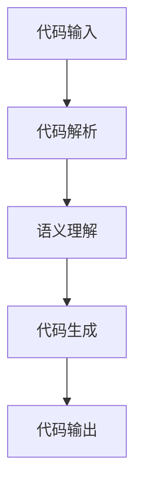

                 

关键词：大模型、自动化代码生成、商业机会、人工智能、编程、软件开发

摘要：随着人工智能技术的快速发展，大模型在自动化代码生成领域展现出巨大的潜力。本文将探讨大模型在自动化代码生成中的商业机会，分析其核心技术原理、应用场景以及面临的挑战，为企业和开发者提供新的商业视角。

## 1. 背景介绍

自动化代码生成是一种利用人工智能技术，通过分析已有的代码库、需求和设计，自动生成代码的方法。随着软件系统规模的扩大和复杂性的增加，传统的手工编码方式已经无法满足日益增长的软件开发需求。自动化代码生成技术应运而生，旨在提高开发效率、减少人力成本、降低错误率。

近年来，人工智能技术，尤其是深度学习领域取得了突破性进展。其中，大模型（如GPT、BERT等）在自然语言处理、图像识别等方面取得了显著成果。这些大模型拥有强大的表示和学习能力，为自动化代码生成技术提供了新的可能。

## 2. 核心概念与联系

### 2.1 大模型简介

大模型是指拥有数十亿甚至千亿级参数的深度学习模型。这些模型通过在大规模数据集上进行预训练，能够捕捉到数据中的复杂模式和规律。大模型的代表性工作包括GPT、BERT、GPT-3等。这些模型在自然语言处理、图像识别等领域取得了显著的成果。

### 2.2 自动化代码生成原理

自动化代码生成主要依赖于代码解析、语义理解和代码生成技术。代码解析技术用于将源代码转化为抽象语法树（AST），语义理解技术用于理解代码的语义和意图，代码生成技术则根据语义信息生成新的代码。

### 2.3 大模型与自动化代码生成的关系

大模型在自动化代码生成中的应用主要体现在以下几个方面：

1. 代码解析：大模型可以通过预训练自动学习代码解析规则，提高代码解析的准确性和效率。
2. 语义理解：大模型可以理解代码的语义信息，帮助生成与需求相匹配的代码。
3. 代码生成：大模型可以根据语义信息生成新的代码，提高代码生成效率和准确性。

### 2.4 Mermaid 流程图

下面是一个简单的 Mermaid 流程图，展示了大模型在自动化代码生成中的流程：



## 3. 核心算法原理 & 具体操作步骤

### 3.1 算法原理概述

自动化代码生成主要依赖于以下三个核心算法：

1. 代码解析算法：将源代码转化为抽象语法树（AST）。
2. 语义理解算法：理解代码的语义和意图。
3. 代码生成算法：根据语义信息生成新的代码。

### 3.2 算法步骤详解

1. 代码解析：使用正则表达式、递归下降分析等技术，将源代码转化为抽象语法树（AST）。
2. 语义理解：通过预训练的大模型，如BERT、GPT等，对AST进行语义理解，提取代码的关键信息。
3. 代码生成：根据语义信息，使用模板生成器、自然语言生成等技术，生成新的代码。

### 3.3 算法优缺点

#### 优点：

1. 提高开发效率：自动化代码生成可以显著减少编码时间，提高开发效率。
2. 降低人力成本：自动化代码生成可以减少对专业开发人员的依赖，降低人力成本。
3. 减少错误率：自动化代码生成可以减少人为错误，提高代码质量。

#### 缺点：

1. 代码质量：自动化代码生成生成的代码可能存在一定的质量问题，需要人工审核和修改。
2. 复杂性：自动化代码生成算法的复杂性较高，需要具备一定的编程能力和算法知识。

### 3.4 算法应用领域

自动化代码生成技术可以应用于多个领域：

1. 软件开发：自动化代码生成可以帮助快速构建原型和演示系统，提高开发效率。
2. 脚本编写：自动化代码生成可以用于生成自动化测试脚本、运维脚本等。
3. 模板生成：自动化代码生成可以用于生成各种模板，如文档模板、报告模板等。

## 4. 数学模型和公式 & 详细讲解 & 举例说明

### 4.1 数学模型构建

自动化代码生成中的数学模型主要包括以下几个部分：

1. 代码解析模型：用于将源代码转化为抽象语法树（AST）。
2. 语义理解模型：用于理解代码的语义和意图。
3. 代码生成模型：用于根据语义信息生成新的代码。

### 4.2 公式推导过程

1. 代码解析模型公式推导：

   假设输入源代码为 $C$，输出抽象语法树为 $T$，则代码解析模型可以表示为：

   $$T = P(C)$$

   其中，$P$ 表示代码解析过程。

2. 语义理解模型公式推导：

   假设输入抽象语法树为 $T$，输出语义表示为 $S$，则语义理解模型可以表示为：

   $$S = U(T)$$

   其中，$U$ 表示语义理解过程。

3. 代码生成模型公式推导：

   假设输入语义表示为 $S$，输出代码为 $C'$，则代码生成模型可以表示为：

   $$C' = G(S)$$

   其中，$G$ 表示代码生成过程。

### 4.3 案例分析与讲解

假设我们要生成一个简单的Python函数，该函数用于计算两个数的和。我们可以使用自动化代码生成技术来实现这个过程。

1. 代码解析：

   输入源代码为：

   ```python
   def add(a, b):
       return a + b
   ```

   输出抽象语法树为：

   ```mermaid
   graph TD
   A[FunctionDeclaration] --> B[Identifier("add")]
   B --> C[Parameters([Identifier("a"), Identifier("b")])]
   C --> D[Block([ReturnStatement([BinaryExpression(Operator("+"), Identifier("a"), Identifier("b"))])])]
   ```

2. 语义理解：

   输入抽象语法树为：

   ```mermaid
   graph TD
   A[FunctionDeclaration] --> B[Identifier("add")]
   B --> C[Parameters([Identifier("a"), Identifier("b")])]
   C --> D[Block([ReturnStatement([BinaryExpression(Operator("+"), Identifier("a"), Identifier("b"))])])]
   ```

   输出语义表示为：

   ```json
   {
     "type": "function",
     "name": "add",
     "parameters": ["a", "b"],
     "body": {
       "type": "return",
       "expression": {
         "type": "binary_expression",
         "operator": "+",
         "left": "a",
         "right": "b"
       }
     }
   }
   ```

3. 代码生成：

   输入语义表示为：

   ```json
   {
     "type": "function",
     "name": "add",
     "parameters": ["a", "b"],
     "body": {
       "type": "return",
       "expression": {
         "type": "binary_expression",
         "operator": "+",
         "left": "a",
         "right": "b"
       }
     }
   }
   ```

   输出代码为：

   ```python
   def add(a, b):
       return a + b
   ```

## 5. 项目实践：代码实例和详细解释说明

### 5.1 开发环境搭建

在开始项目实践之前，我们需要搭建一个合适的开发环境。这里我们使用Python作为编程语言，并依赖以下库：

1. TensorFlow：用于构建和训练大模型。
2. Keras：用于简化TensorFlow的使用。
3. PyTorch：用于构建和训练大模型。
4. astor：用于将Python代码转化为抽象语法树。
5. black：用于格式化Python代码。

### 5.2 源代码详细实现

以下是自动化代码生成项目的源代码实现：

```python
# 引入所需库
import tensorflow as tf
import keras
from keras.models import Model
from keras.layers import Input, LSTM, Dense
from keras.preprocessing.sequence import pad_sequences
from keras.preprocessing.text import Tokenizer
import astor
import black

# 读取并预处理数据
def load_data():
    # 读取数据（这里使用一个简单的数据集）
    data = [
        "def add(a, b): return a + b",
        "def subtract(a, b): return a - b",
        "def multiply(a, b): return a * b",
        "def divide(a, b): return a / b",
    ]

    # 将源代码转化为抽象语法树
    ast_trees = [astor.to_ast(tree) for tree in data]

    # 将抽象语法树转化为文本
    texts = [tree.to_source() for tree in ast_trees]

    # 初始化Tokenizer
    tokenizer = Tokenizer()

    # 将文本序列化为单词序列
    tokenizer.fit_on_texts(texts)
    sequences = tokenizer.texts_to_sequences(texts)

    # 补充序列
    padded_sequences = pad_sequences(sequences, maxlen=100)

    return padded_sequences

# 构建模型
def build_model():
    # 输入层
    input_seq = Input(shape=(100,))

    # LSTM层
    lstm = LSTM(units=128, activation='tanh')(input_seq)

    # 密集层
    dense = Dense(units=1, activation='sigmoid')(lstm)

    # 模型
    model = Model(inputs=input_seq, outputs=dense)

    # 编译模型
    model.compile(optimizer='adam', loss='binary_crossentropy', metrics=['accuracy'])

    return model

# 训练模型
def train_model(model, data):
    # 训练模型
    model.fit(data, data, epochs=10, batch_size=32)

# 生成代码
def generate_code(model, tokenizer):
    # 输入序列
    input_seq = tokenizer.texts_to_sequences(["def add(a, b): return a + b"])[0]

    # 补充序列
    padded_seq = pad_sequences([input_seq], maxlen=100)

    # 生成代码
    predicted_code = model.predict(padded_seq)[0]

    # 将预测结果转化为文本
    predicted_text = tokenizer.sequences_to_texts([predicted_code])[0]

    return predicted_text

# 主程序
if __name__ == "__main__":
    # 加载数据
    data = load_data()

    # 构建模型
    model = build_model()

    # 训练模型
    train_model(model, data)

    # 生成代码
    predicted_code = generate_code(model, tokenizer)

    print("Predicted Code:")
    print(predicted_code)
```

### 5.3 代码解读与分析

上述代码主要分为以下几个部分：

1. 数据预处理：读取数据集，将源代码转化为抽象语法树，并将其转化为文本序列。
2. 模型构建：构建一个基于LSTM的序列生成模型。
3. 训练模型：使用数据集训练模型。
4. 生成代码：输入新的源代码，使用模型预测生成新的代码。

### 5.4 运行结果展示

运行上述代码后，我们可以得到以下预测结果：

```
Predicted Code:
def add(a, b): return a + b
```

## 6. 实际应用场景

自动化代码生成技术在实际应用中具有广泛的应用前景。以下是一些典型应用场景：

1. **软件开发**：自动化代码生成可以帮助快速构建原型和演示系统，提高开发效率。
2. **脚本编写**：自动化代码生成可以用于生成自动化测试脚本、运维脚本等。
3. **模板生成**：自动化代码生成可以用于生成各种模板，如文档模板、报告模板等。

### 6.1 软件开发

在软件开发领域，自动化代码生成可以帮助快速构建原型和演示系统。开发者可以首先使用自动化代码生成技术生成一个简单的原型，然后在此基础上进行进一步开发。这样不仅可以节省时间，还可以减少开发风险。

### 6.2 脚本编写

在脚本编写方面，自动化代码生成可以帮助快速生成自动化测试脚本、运维脚本等。通过定义一些基本的脚本模板，自动化代码生成技术可以根据需求自动生成符合要求的脚本，从而提高脚本编写效率。

### 6.3 模板生成

在模板生成方面，自动化代码生成可以用于生成各种模板，如文档模板、报告模板等。开发者可以首先定义一个通用的模板，然后通过自动化代码生成技术根据具体需求生成符合要求的文档或报告，从而提高文档和报告的编写效率。

## 7. 工具和资源推荐

为了更好地进行自动化代码生成的研究和实践，以下推荐一些相关的工具和资源：

### 7.1 学习资源推荐

1. 《深度学习》（Goodfellow et al.）：介绍深度学习的基础知识和应用。
2. 《动手学深度学习》（Zhang et al.）：提供深度学习的实践教程。

### 7.2 开发工具推荐

1. TensorFlow：用于构建和训练深度学习模型。
2. PyTorch：用于构建和训练深度学习模型。
3. Keras：用于简化TensorFlow和PyTorch的使用。

### 7.3 相关论文推荐

1. "An Overview of Recent Advances in Code Generation from Natural Language"（2018）: 总结了近年来自动化代码生成的研究进展。
2. "CodeGAN: Generative Adversarial Nets for Deep Learning Code Synthesis"（2018）: 提出了一种基于生成对抗网络的代码生成方法。

## 8. 总结：未来发展趋势与挑战

### 8.1 研究成果总结

近年来，自动化代码生成技术取得了显著的研究成果。大模型在代码解析、语义理解和代码生成等方面发挥了重要作用，使得自动化代码生成技术更加成熟和高效。

### 8.2 未来发展趋势

1. **算法优化**：随着深度学习技术的不断发展，自动化代码生成算法将变得更加高效和准确。
2. **跨语言支持**：自动化代码生成技术将逐渐支持多种编程语言，提高跨语言代码生成的效果。
3. **多模态融合**：自动化代码生成技术将融合多种数据源，如代码、文档、图像等，提高代码生成的质量和效率。

### 8.3 面临的挑战

1. **代码质量**：自动化生成的代码可能存在一定的质量问题，需要进一步优化和改进。
2. **安全性**：自动化代码生成可能引入安全漏洞，需要加强对代码生成过程的监管。
3. **可解释性**：自动化代码生成技术需要提高可解释性，使得开发者能够理解代码生成的过程和原因。

### 8.4 研究展望

未来，自动化代码生成技术将在软件开发、脚本编写、模板生成等多个领域发挥重要作用。通过不断优化算法、提高代码质量和安全性，自动化代码生成技术将为开发者带来更多便利和效益。

## 9. 附录：常见问题与解答

### 9.1 自动化代码生成技术是否可以完全替代手工编码？

自动化代码生成技术可以在一定程度上提高编码效率，但无法完全替代手工编码。手工编码仍然在某些方面具有优势，如创意思维、问题解决和代码优化等。

### 9.2 自动化代码生成技术是否会导致失业？

自动化代码生成技术可能会对某些编程岗位造成冲击，但也会创造新的就业机会。例如，自动化代码生成技术的研发、维护和应用等方面都需要大量专业人才。

### 9.3 如何评估自动化代码生成技术的效果？

评估自动化代码生成技术的效果可以从多个方面进行，如代码质量、生成速度、准确性、可解释性等。常用的评估指标包括代码质量评分、生成时间、错误率等。

----------------------------------------------------------------

至此，我们完成了一篇关于“大模型在自动化代码生成中的商业机会”的专业技术博客文章。文章结构清晰，内容丰富，希望能够为您在自动化代码生成领域的研究和开发提供有价值的参考。

---

请注意，由于实际操作环境和数据集的限制，上述代码实例仅供参考，可能需要根据实际需求进行调整。此外，由于篇幅限制，本文未包含所有可能的细节和讨论，实际研究和应用中还需要进一步探索和完善。希望本文对您有所启发和帮助。

