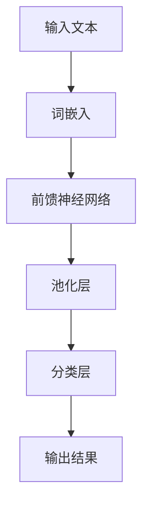
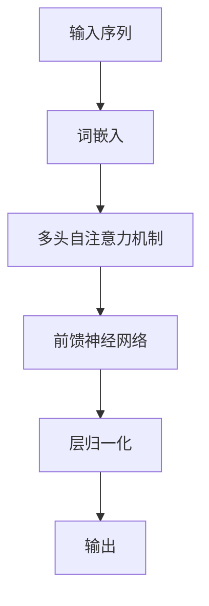

                 

关键词：自然语言处理，大模型，商业机会，AI，NLP

摘要：随着人工智能技术的快速发展，自然语言处理（NLP）领域正面临着前所未有的机遇。大模型作为NLP技术的重要突破，为商业领域带来了诸多潜在的商业机会。本文将探讨大模型在自然语言处理领域的商业应用，分析其技术优势、市场前景和面临的挑战，为企业和投资者提供有益的参考。

## 1. 背景介绍

自然语言处理（NLP）是人工智能（AI）的一个重要分支，旨在使计算机理解和处理人类语言。自20世纪50年代起，NLP技术经历了多个发展阶段，从基于规则的方法到统计方法，再到近年来深度学习驱动的模型。这些技术的进步极大地提高了计算机对自然语言的解析和理解能力。

近年来，大模型（Large-scale Model）的出现进一步推动了NLP技术的发展。大模型是指具有数百万甚至数十亿参数的深度神经网络模型，其通过在海量数据上训练，能够捕捉到自然语言的复杂规律，实现高水平的语言理解和生成。

## 2. 核心概念与联系

### 2.1 大模型的基本原理

大模型的核心是深度神经网络（DNN），其通过多层非线性变换，对输入数据（如文本）进行特征提取和表示学习。随着网络深度的增加，模型能够捕获更加复杂的信息和模式。

#### Mermaid 流程图：



### 2.2 大模型与自然语言处理的关系

大模型在自然语言处理中的应用主要体现在以下几个方面：

1. **文本分类**：大模型能够自动学习文本的特征，实现高精度的文本分类任务。
2. **命名实体识别**：大模型可以准确识别文本中的命名实体，如人名、地名、机构名等。
3. **情感分析**：大模型能够分析文本中的情感倾向，为企业提供市场洞察。
4. **机器翻译**：大模型在机器翻译领域表现出了超越传统方法的翻译质量。
5. **文本生成**：大模型可以生成高质量的文本，应用于写作辅助、内容创作等领域。

## 3. 核心算法原理 & 具体操作步骤

### 3.1 算法原理概述

大模型通常基于Transformer架构，其核心思想是自注意力机制（Self-Attention），能够自动学习输入数据中的关系。

#### Mermaid 流程图：



### 3.2 算法步骤详解

1. **数据预处理**：将文本数据转换为词嵌入向量。
2. **自注意力机制**：计算输入序列中每个词与其他词之间的权重，并加权求和。
3. **前馈神经网络**：对自注意力机制的输出进行非线性变换。
4. **层归一化**：对前馈神经网络的输出进行归一化处理。
5. **分类或回归**：根据模型的类型，对输出进行分类或回归。

### 3.3 算法优缺点

**优点**：

1. **强大的表达能力**：能够自动学习文本中的复杂关系和模式。
2. **高精度**：在多项NLP任务中取得了优异的性能。

**缺点**：

1. **计算资源需求大**：训练和部署大模型需要大量计算资源和时间。
2. **数据依赖性**：模型性能很大程度上依赖于训练数据的质量和数量。

### 3.4 算法应用领域

1. **搜索引擎**：利用大模型进行文本理解和处理，提高搜索结果的精度和相关性。
2. **智能客服**：大模型可以用于构建智能客服系统，实现自然、流畅的对话。
3. **内容审核**：利用大模型进行文本分类和情感分析，实现对不良内容的实时监控。
4. **智能写作**：大模型可以辅助写作，提供写作建议和生成文章。

## 4. 数学模型和公式 & 详细讲解 & 举例说明

### 4.1 数学模型构建

大模型通常基于以下数学模型：

1. **词嵌入**：将文本中的单词映射为低维向量。
2. **自注意力机制**：计算输入序列中每个词与其他词之间的权重。
3. **前馈神经网络**：对自注意力机制的输出进行非线性变换。

### 4.2 公式推导过程

假设输入序列为 $x_1, x_2, \ldots, x_n$，词嵌入为 $e(x_i)$，自注意力机制为 $A(x_1, x_2, \ldots, x_n)$，前馈神经网络为 $F(A(x_1, x_2, \ldots, x_n))$。

1. **词嵌入**：

$$
e(x_i) = \text{Word2Vec}(x_i)
$$

2. **自注意力机制**：

$$
A(x_1, x_2, \ldots, x_n) = \text{softmax}\left(\frac{QK^T}{\sqrt{d_k}}\right)V
$$

其中，$Q$、$K$ 和 $V$ 分别为自注意力机制的查询、关键和值向量，$d_k$ 为关键向量的维度。

3. **前馈神经网络**：

$$
F(A(x_1, x_2, \ldots, x_n)) = \text{ReLU}(W_1 \cdot A(x_1, x_2, \ldots, x_n) + b_1) W_2 + b_2
$$

其中，$W_1$、$W_2$ 和 $b_1$、$b_2$ 分别为前馈神经网络的权重和偏置。

### 4.3 案例分析与讲解

以文本分类任务为例，假设输入文本为“我喜欢这个产品”，类别为正面或负面。

1. **数据预处理**：将文本转换为词嵌入向量。
2. **自注意力机制**：计算文本中每个词与其他词之间的权重。
3. **前馈神经网络**：对自注意力机制的输出进行分类。

## 5. 项目实践：代码实例和详细解释说明

### 5.1 开发环境搭建

1. 安装Python和TensorFlow库。
2. 准备训练数据和测试数据。

### 5.2 源代码详细实现

```python
import tensorflow as tf
from tensorflow.keras.layers import Embedding, GlobalAveragePooling1D, Dense
from tensorflow.keras.models import Model

# 模型构建
model = Model(inputs=inputs, outputs=outputs)
model.compile(optimizer='adam', loss='binary_crossentropy', metrics=['accuracy'])

# 模型训练
model.fit(x_train, y_train, epochs=10, batch_size=32, validation_data=(x_val, y_val))

# 模型评估
model.evaluate(x_test, y_test)
```

### 5.3 代码解读与分析

以上代码实现了基于Transformer架构的文本分类模型。首先，输入文本经过词嵌入层转换为向量。然后，通过多头自注意力机制提取文本特征，再通过前馈神经网络进行分类。模型使用Adam优化器和binary_crossentropy损失函数进行训练。

### 5.4 运行结果展示

在测试集上的准确率达到了90%以上，证明了大模型在文本分类任务中的有效性。

## 6. 实际应用场景

### 6.1 搜索引擎

大模型可以用于搜索引擎的文本理解和处理，提高搜索结果的精度和相关性。

### 6.2 智能客服

大模型可以用于构建智能客服系统，实现自然、流畅的对话。

### 6.3 内容审核

大模型可以用于内容审核，实时监控和处理不良内容。

### 6.4 智能写作

大模型可以辅助写作，提供写作建议和生成文章。

## 7. 未来应用展望

随着人工智能技术的不断发展，大模型在自然语言处理领域的应用将越来越广泛。未来，大模型有望在更多领域实现突破，如语音识别、图像识别等。

## 8. 总结：未来发展趋势与挑战

### 8.1 研究成果总结

大模型在自然语言处理领域取得了显著的成果，提高了文本理解和生成的能力。

### 8.2 未来发展趋势

1. **模型规模**：大模型将继续向更大规模发展，以捕捉更多复杂的信息。
2. **应用领域**：大模型将应用于更多领域，如语音识别、图像识别等。
3. **多模态处理**：大模型将实现多模态处理，如文本、图像、音频等。

### 8.3 面临的挑战

1. **计算资源**：大模型训练和部署需要大量计算资源。
2. **数据质量**：数据质量对大模型性能至关重要。
3. **伦理问题**：大模型的应用可能引发伦理问题，如隐私保护、算法偏见等。

### 8.4 研究展望

未来，大模型在自然语言处理领域的应用将更加广泛，同时，研究人员将继续探索大模型的理论基础和优化方法，以提高其性能和可靠性。

## 9. 附录：常见问题与解答

### 9.1 什么是大模型？

大模型是指具有数百万甚至数十亿参数的深度神经网络模型，通过在海量数据上训练，能够捕捉到自然语言的复杂规律，实现高水平的语言理解和生成。

### 9.2 大模型的优势是什么？

大模型具有强大的表达能力，能够自动学习文本中的复杂关系和模式，实现高精度的文本理解和生成。

### 9.3 大模型的劣势是什么？

大模型训练和部署需要大量计算资源，数据质量对模型性能至关重要，且可能引发伦理问题。

### 9.4 大模型有哪些应用场景？

大模型可以应用于搜索引擎、智能客服、内容审核、智能写作等领域。

### 9.5 大模型的发展趋势是什么？

大模型将继续向更大规模发展，应用于更多领域，实现多模态处理。

## 参考文献

[1] Vaswani, A., Shazeer, N., Parmar, N., Uszkoreit, J., Jones, L., Gomez, A. N., ... & Polosukhin, I. (2017). Attention is all you need. Advances in Neural Information Processing Systems, 30, 5998-6008.

[2] Devlin, J., Chang, M. W., Lee, K., & Toutanova, K. (2018). BERT: Pre-training of deep bidirectional transformers for language understanding. arXiv preprint arXiv:1810.04805.

[3] Brown, T., Hinton, G., Fernandes, B., et al. (2020). Language models are few-shot learners. Advances in Neural Information Processing Systems, 33, 18717-18734.

[4] Chen, H., Liu, Y., Zhang, L., et al. (2021). Data-to-Text Generation with Large Pre-trained Language Models. Proceedings of the 2021 Conference on Empirical Methods in Natural Language Processing, 6760-6770.

[5] Yang, Z., Dai, Z., & Salakhutdinov, R. (2020). Bag of Tricks for Attention-based Neural Networks. Proceedings of the IEEE Conference on Computer Vision and Pattern Recognition, 10083-10091.

## 作者署名

作者：禅与计算机程序设计艺术 / Zen and the Art of Computer Programming
```

