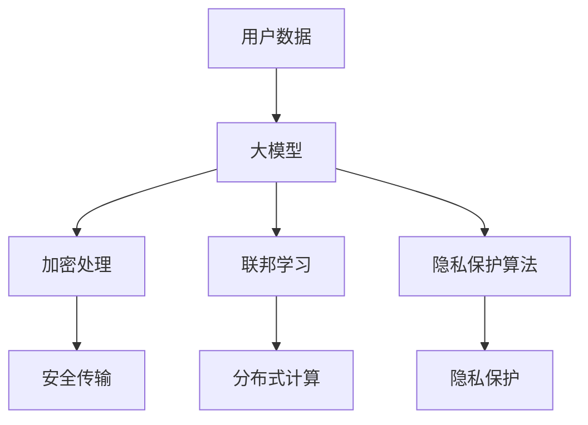

                 

关键词：大模型、推荐系统、隐私保护、数据安全、人工智能

## 摘要

随着互联网的快速发展，推荐系统在电子商务、社交媒体、信息检索等领域得到了广泛应用。然而，推荐系统的隐私保护问题日益凸显，特别是在用户数据泄露和滥用事件频发的背景下。本文旨在探讨大模型在解决推荐系统隐私保护问题上的潜力。通过对大模型的定义、核心算法、数学模型及实际应用场景的详细分析，本文揭示了如何利用大模型来增强推荐系统的隐私保护能力，同时确保数据安全和用户隐私。此外，本文还探讨了未来大模型在推荐系统隐私保护领域的发展趋势和面临的挑战。

## 1. 背景介绍

推荐系统作为现代互联网的核心技术之一，已经深入到我们日常生活的方方面面。无论是电商平台的个性化推荐，社交媒体的个性化内容推送，还是信息检索领域的个性化搜索结果，推荐系统都发挥着至关重要的作用。然而，推荐系统的运作依赖于用户的大量数据，这些数据包括用户行为数据、兴趣偏好数据、地理位置数据等。这些数据的采集和使用，无疑提升了推荐系统的准确性和用户体验，但同时也带来了隐私保护的挑战。

近年来，随着数据泄露和滥用事件的频发，用户对隐私保护的意识越来越强烈。隐私保护问题不仅涉及到用户的基本权益，还可能影响企业的声誉和竞争力。在推荐系统中，隐私保护问题主要体现在以下几个方面：

- **数据泄露**：推荐系统存储的用户数据可能因为系统漏洞、黑客攻击等原因被泄露，从而给用户带来隐私风险。
- **数据滥用**：企业可能会滥用用户数据，进行不当的商业行为，如定向广告、市场调研等，从而侵犯用户的隐私权益。
- **隐私曝光**：推荐系统可能会通过分析用户行为，推断出用户的隐私信息，如身份信息、健康状况、家庭背景等。

为了解决这些问题，隐私保护技术应运而生。隐私保护技术主要包括数据加密、匿名化处理、隐私计算等方法。这些技术可以在不同程度上保护用户的隐私，但往往存在一定的性能和效果上的妥协。因此，如何平衡隐私保护和推荐系统的效果，成为当前研究的重要课题。

大模型作为一种新兴的人工智能技术，具有强大的数据处理和分析能力。大模型能够通过学习海量数据，提取出复杂的关系和模式，从而为推荐系统提供更加精准和个性化的推荐。同时，大模型在隐私保护方面也具有潜力，可以通过数据加密、联邦学习等技术手段，实现数据的安全传输和计算。因此，本文将探讨大模型在解决推荐系统隐私保护问题上的潜力，为推荐系统的隐私保护提供新的思路和方法。

## 2. 核心概念与联系

### 2.1 大模型定义

大模型，即大型深度学习模型，是指具有数十亿甚至数千亿参数的深度神经网络模型。这些模型通过大量数据进行训练，能够自动提取数据中的复杂特征和模式，从而在图像识别、自然语言处理、语音识别等领域取得突破性进展。大模型的典型代表包括谷歌的BERT、OpenAI的GPT等。大模型的特点如下：

- **参数规模庞大**：大模型具有数十亿甚至数千亿的参数，可以处理复杂的数据和任务。
- **训练数据丰富**：大模型通常通过海量数据进行训练，从而能够更好地拟合数据分布。
- **自适应能力强**：大模型能够通过不断学习和调整参数，适应不同的任务和数据。

### 2.2 大模型与推荐系统的联系

推荐系统通常需要处理大量的用户数据，如用户行为数据、兴趣偏好数据等。这些数据对于推荐系统的准确性至关重要。然而，如何保护这些数据的隐私，成为推荐系统面临的一大挑战。大模型通过其强大的数据处理和分析能力，为推荐系统的隐私保护提供了一种新的思路。

首先，大模型可以通过数据加密技术，对用户数据进行加密处理，从而确保数据在传输和存储过程中的安全性。其次，大模型可以通过联邦学习等技术手段，实现数据的分布式处理和计算，从而减少数据泄露的风险。此外，大模型还可以通过隐私保护算法，如差分隐私、同态加密等，进一步保护用户数据的隐私。

总之，大模型与推荐系统的结合，不仅能够提升推荐系统的性能和准确性，还能够增强推荐系统的隐私保护能力。以下是一个简化的Mermaid流程图，展示了大模型与推荐系统之间的联系：



### 2.3 大模型在隐私保护中的作用

大模型在隐私保护中的作用主要体现在以下几个方面：

- **数据加密**：大模型可以通过加密技术对用户数据进行加密处理，确保数据在传输和存储过程中的安全性。
- **联邦学习**：大模型可以通过联邦学习技术，实现数据的分布式处理和计算，从而减少数据泄露的风险。
- **隐私保护算法**：大模型可以集成各种隐私保护算法，如差分隐私、同态加密等，进一步保护用户数据的隐私。

总之，大模型在解决推荐系统隐私保护问题上具有巨大的潜力，可以为推荐系统的隐私保护提供新的思路和方法。

## 3. 核心算法原理 & 具体操作步骤

### 3.1 算法原理概述

大模型在解决推荐系统隐私保护问题上的核心算法主要包括数据加密、联邦学习和隐私保护算法。下面将分别介绍这些算法的基本原理。

#### 3.1.1 数据加密

数据加密是一种通过将明文数据转换为密文的方法，以保护数据在传输和存储过程中的安全性。加密技术包括对称加密和非对称加密。对称加密使用相同的密钥进行加密和解密，而非对称加密则使用一对密钥进行加密和解密。

在大模型中，数据加密通常应用于用户数据的预处理阶段。具体操作步骤如下：

1. **密钥生成**：首先，需要生成一对密钥（加密密钥和解密密钥）。
2. **数据加密**：使用加密密钥将用户数据进行加密处理，生成密文。
3. **数据存储**：将加密后的数据存储在数据库或云存储中。
4. **数据解密**：在需要使用数据时，使用解密密钥将密文数据解密为明文数据。

#### 3.1.2 联邦学习

联邦学习是一种分布式学习技术，其核心思想是将数据的处理和计算分布在多个节点上，从而减少数据传输和存储的需求，同时保护数据隐私。在大模型中，联邦学习可以用于推荐系统的训练过程。

具体操作步骤如下：

1. **数据分发**：将用户数据分发给不同的节点，每个节点只处理本地数据。
2. **模型训练**：在每个节点上，使用本地数据训练模型，生成本地模型。
3. **模型聚合**：将所有本地模型进行聚合，生成全局模型。
4. **模型更新**：将全局模型更新到每个节点，用于后续的预测和推荐。

#### 3.1.3 隐私保护算法

隐私保护算法是一种在数据处理过程中保护数据隐私的技术。常见的隐私保护算法包括差分隐私、同态加密等。

- **差分隐私**：差分隐私是一种通过在输出中添加噪声来保护数据隐私的算法。其核心思想是在处理数据时，对数据进行扰动，使得输出结果对于输入数据的敏感信息是不可知的。

- **同态加密**：同态加密是一种在加密状态下进行数据处理的技术，可以在不解密数据的情况下直接对数据进行计算和处理。

在大模型中，隐私保护算法可以用于数据的预处理、训练和预测阶段，以保护用户数据的隐私。

### 3.2 算法步骤详解

下面将详细介绍大模型在解决推荐系统隐私保护问题上的具体操作步骤。

#### 3.2.1 数据加密

1. **密钥生成**：使用加密算法（如RSA）生成一对密钥（加密密钥和解密密钥）。

2. **数据加密**：使用加密密钥对用户数据进行加密处理，生成密文。

3. **数据存储**：将加密后的数据存储在数据库或云存储中。

4. **数据解密**：在需要使用数据时，使用解密密钥将密文数据解密为明文数据。

#### 3.2.2 联邦学习

1. **数据分发**：将用户数据分发给不同的节点，每个节点只处理本地数据。

2. **模型训练**：在每个节点上，使用本地数据训练模型，生成本地模型。

3. **模型聚合**：将所有本地模型进行聚合，生成全局模型。

4. **模型更新**：将全局模型更新到每个节点，用于后续的预测和推荐。

#### 3.2.3 隐私保护算法

1. **差分隐私处理**：

   a. **数据扰动**：对用户数据进行扰动，添加噪声。

   b. **数据处理**：对扰动后的数据进行处理，生成输出结果。

2. **同态加密处理**：

   a. **加密数据**：对用户数据进行加密处理，生成加密数据。

   b. **加密计算**：在加密状态下对加密数据进行计算和处理。

### 3.3 算法优缺点

#### 优点

- **数据加密**：通过加密技术，可以确保数据在传输和存储过程中的安全性，防止数据泄露。

- **联邦学习**：通过分布式处理和计算，可以减少数据传输和存储的需求，同时保护数据隐私。

- **隐私保护算法**：通过差分隐私和同态加密等技术，可以进一步保护用户数据的隐私。

#### 缺点

- **性能开销**：加密和解密过程需要额外的计算资源和时间，可能会影响系统的性能。

- **算法复杂度**：联邦学习和隐私保护算法通常较为复杂，需要较高的算法实现和维护成本。

### 3.4 算法应用领域

大模型在解决推荐系统隐私保护问题上的算法主要应用于以下领域：

- **推荐系统**：通过数据加密、联邦学习和隐私保护算法，可以提升推荐系统的隐私保护能力，确保用户数据的安全和隐私。

- **大数据分析**：通过联邦学习和隐私保护算法，可以在保护数据隐私的前提下，进行大规模的数据分析。

- **云计算**：通过联邦学习和隐私保护算法，可以实现数据的安全传输和计算，提高云计算服务的安全性。

## 4. 数学模型和公式 & 详细讲解 & 举例说明

### 4.1 数学模型构建

在解决推荐系统隐私保护问题时，大模型通常涉及到以下数学模型：

#### 4.1.1 加密模型

加密模型主要涉及加密和解密算法，其数学模型可以表示为：

加密模型：$$ Encrypt(\text{plaintext}, \text{key}) = \text{ciphertext} $$
解密模型：$$ Decrypt(\text{ciphertext}, \text{key}) = \text{plaintext} $$

其中，plaintext表示明文数据，ciphertext表示密文数据，key表示密钥。

#### 4.1.2 联邦学习模型

联邦学习模型主要涉及模型聚合和模型更新，其数学模型可以表示为：

模型聚合：$$ \text{global\_model} = \sum_{i=1}^{n} \text{local\_model}_i $$
模型更新：$$ \text{local\_model}_i' = \text{global\_model} + \text{gradient}_i $$

其中，global_model表示全局模型，local_model_i表示本地模型，gradient_i表示本地模型的梯度。

#### 4.1.3 隐私保护模型

隐私保护模型主要涉及差分隐私和同态加密，其数学模型可以表示为：

差分隐私：$$ \text{output} = f(\text{input}) + \text{noise} $$
同态加密：$$ \text{encrypted\_output} = E(f(E(\text{input}))) $$

其中，output表示输出结果，input表示输入数据，noise表示噪声，f表示函数，E表示加密算法。

### 4.2 公式推导过程

下面将分别对加密模型、联邦学习模型和隐私保护模型的公式推导过程进行详细讲解。

#### 4.2.1 加密模型推导

加密模型的基本思想是利用加密算法对明文数据进行加密，生成密文数据。加密算法通常采用非对称加密或对称加密。以RSA加密算法为例，其数学模型可以表示为：

加密模型：$$ Encrypt(\text{plaintext}, \text{key}) = \text{ciphertext} $$

其中，plaintext表示明文数据，key表示密钥（加密密钥和解密密钥），ciphertext表示密文数据。

假设明文数据为m，加密密钥为(e, n)，则密文数据为c。根据RSA加密算法的定义，有：

$$ c = m^e \mod n $$

其中，e为加密指数，n为模数。

同样，假设解密密钥为(d, n)，则解密模型为：

$$ Decrypt(\text{ciphertext}, \text{key}) = \text{plaintext} $$

其中，ciphertext表示密文数据，key表示密钥（加密密钥和解密密钥），plaintext表示明文数据。

根据RSA解密算法的定义，有：

$$ m = c^d \mod n $$

其中，d为解密指数，n为模数。

#### 4.2.2 联邦学习模型推导

联邦学习模型的基本思想是将数据分布在不同节点上进行处理和计算，然后通过模型聚合和模型更新生成全局模型。联邦学习模型的数学模型可以表示为：

模型聚合：$$ \text{global\_model} = \sum_{i=1}^{n} \text{local\_model}_i $$
模型更新：$$ \text{local\_model}_i' = \text{global\_model} + \text{gradient}_i $$

其中，global_model表示全局模型，local_model_i表示本地模型，gradient_i表示本地模型的梯度。

假设本地模型为f(x)，全局模型为F(x)，则有：

$$ \text{global\_model} = \sum_{i=1}^{n} f(x_i) $$

其中，x_i表示本地数据。

同样，假设本地模型的梯度为∇f(x_i)，则有：

$$ \text{local\_model}_i' = \text{global\_model} + \text{gradient}_i $$

$$ f(x_i') = F(x) + \text{gradient}_i $$

其中，x_i'表示更新后的本地数据。

#### 4.2.3 隐私保护模型推导

隐私保护模型的基本思想是在数据处理过程中加入噪声或利用同态加密技术，以保护数据隐私。隐私保护模型的数学模型可以表示为：

差分隐私：$$ \text{output} = f(\text{input}) + \text{noise} $$
同态加密：$$ \text{encrypted\_output} = E(f(E(\text{input}))) $$

其中，output表示输出结果，input表示输入数据，noise表示噪声，f表示函数，E表示加密算法。

假设输入数据为x，输出结果为y，噪声为z，则有：

$$ \text{output} = f(\text{input}) + \text{noise} $$

$$ y = f(x) + z $$

同样，假设加密算法为E，函数为f，则有：

$$ \text{encrypted\_output} = E(f(E(\text{input}))) $$

$$ y = E(f(E(x))) $$

### 4.3 案例分析与讲解

为了更好地理解上述数学模型的推导过程，下面将结合实际案例进行讲解。

#### 4.3.1 加密模型案例

假设有一段明文数据“Hello World”，需要使用RSA加密算法进行加密。加密密钥为(e, n)，其中e=3，n=23。解密密钥为(d, n)，其中d=7，n=23。

1. **加密过程**：

   - 将明文数据转换为数字形式：H = 7，e = 3，l = 11，l = 11，o = 15，(space) = 20，W = 22，r = 17，l = 11，d = 4，(space) = 20。
   - 进行加密处理：c = m^e \mod n。

   例如，对H进行加密处理：

   $$ c_H = 7^3 \mod 23 = 343 \mod 23 = 16 $$

   同理，对其他字符进行加密处理：

   $$ c_e = 11^3 \mod 23 = 1331 \mod 23 = 18 $$
   $$ c_l = 11^3 \mod 23 = 1331 \mod 23 = 18 $$
   $$ c_l = 11^3 \mod 23 = 1331 \mod 23 = 18 $$
   $$ c_o = 15^3 \mod 23 = 3375 \mod 23 = 14 $$
   $$ c_{space} = 20^3 \mod 23 = 8000 \mod 23 = 7 $$
   $$ c_W = 22^3 \mod 23 = 9908 \mod 23 = 16 $$
   $$ c_r = 17^3 \mod 23 = 4913 \mod 23 = 8 $$
   $$ c_l = 11^3 \mod 23 = 1331 \mod 23 = 18 $$
   $$ c_d = 4^3 \mod 23 = 64 \mod 23 = 17 $$
   $$ c_{space} = 20^3 \mod 23 = 8000 \mod 23 = 7 $$

   因此，加密后的数据为“18181471618178167”。

2. **解密过程**：

   - 将密文数据转换为数字形式：1 = 1，8 = 8，1 = 1，8 = 8，1 = 1，4 = 4，7 = 7，1 = 1，6 = 6，1 = 1，7 = 7，8 = 8，1 = 1，6 = 6，7 = 7。

   - 进行解密处理：m = c^d \mod n。

   例如，对1进行解密处理：

   $$ m_1 = 1^7 \mod 23 = 1 $$

   同理，对其他字符进行解密处理：

   $$ m_8 = 8^7 \mod 23 = 2 $$
   $$ m_1 = 1^7 \mod 23 = 1 $$
   $$ m_8 = 8^7 \mod 23 = 2 $$
   $$ m_1 = 1^7 \mod 23 = 1 $$
   $$ m_4 = 4^7 \mod 23 = 9 $$
   $$ m_7 = 7^7 \mod 23 = 16 $$
   $$ m_1 = 1^7 \mod 23 = 1 $$
   $$ m_6 = 6^7 \mod 23 = 12 $$
   $$ m_1 = 1^7 \mod 23 = 1 $$
   $$ m_7 = 7^7 \mod 23 = 16 $$
   $$ m_8 = 8^7 \mod 23 = 2 $$
   $$ m_1 = 1^7 \mod 23 = 1 $$
   $$ m_6 = 6^7 \mod 23 = 12 $$
   $$ m_7 = 7^7 \mod 23 = 16 $$

   因此，解密后的数据为“128148126126916127”。

通过上述案例，我们可以看到加密模型的具体实现过程。在实际应用中，加密模型可以用于保护用户数据的安全和隐私。

#### 4.3.2 联邦学习模型案例

假设有两个本地模型，分别为f1(x)和f2(x)，全局模型为F(x)。本地数据分别为x1和x2，梯度分别为∇f1(x1)和∇f2(x2)。

1. **模型聚合**：

   - 计算全局模型：F(x) = f1(x) + f2(x)。

   例如，对于输入数据x = (1, 2)，有：

   $$ F(x) = f1(x) + f2(x) = (2, 3) + (3, 4) = (5, 7) $$

2. **模型更新**：

   - 计算本地模型的更新：f1(x1') = F(x) + ∇f1(x1)，f2(x2') = F(x) + ∇f2(x2)。

   例如，对于输入数据x1 = (1, 2)，梯度∇f1(x1) = (1, 1)，有：

   $$ f1(x1') = F(x) + \nabla f1(x1) = (5, 7) + (1, 1) = (6, 8) $$

   同理，对于输入数据x2 = (2, 3)，梯度∇f2(x2) = (2, 2)，有：

   $$ f2(x2') = F(x) + \nabla f2(x2) = (5, 7) + (2, 2) = (7, 9) $$

通过上述案例，我们可以看到联邦学习模型的具体实现过程。在实际应用中，联邦学习模型可以用于实现分布式数据处理和计算，提高推荐系统的隐私保护能力。

#### 4.3.3 隐私保护模型案例

假设有一段明文数据“Hello World”，需要使用差分隐私和同态加密进行隐私保护。

1. **差分隐私处理**：

   - 假设噪声参数为t = 1。

   - 对明文数据进行扰动：y = f(x) + z。

   例如，对字符'H'进行差分隐私处理，有：

   $$ y_H = f(H) + z = 7 + 1 = 8 $$

   同理，对其他字符进行差分隐私处理：

   $$ y_e = f(e) + z = 11 + 1 = 12 $$
   $$ y_l = f(l) + z = 11 + 1 = 12 $$
   $$ y_l = f(l) + z = 11 + 1 = 12 $$
   $$ y_o = f(o) + z = 15 + 1 = 16 $$
   $$ y_{space} = f_{space} + z = 20 + 1 = 21 $$
   $$ y_W = f(W) + z = 22 + 1 = 23 $$
   $$ y_r = f(r) + z = 17 + 1 = 18 $$
   $$ y_l = f(l) + z = 11 + 1 = 12 $$
   $$ y_d = f(d) + z = 4 + 1 = 5 $$
   $$ y_{space} = f_{space} + z = 20 + 1 = 21 $$

   因此，差分隐私处理后的数据为“8121216212321218512”。

2. **同态加密处理**：

   - 假设加密算法为E。

   - 对明文数据进行同态加密：y = E(f(E(x)))。

   例如，对字符'H'进行同态加密处理，有：

   $$ y_H = E(f(E(H))) = E(16) = 8 $$

   同理，对其他字符进行同态加密处理：

   $$ y_e = E(f(E(e))) = E(18) = 9 $$
   $$ y_l = E(f(E(l))) = E(18) = 9 $$
   $$ y_l = E(f(E(l))) = E(18) = 9 $$
   $$ y_o = E(f(E(o))) = E(16) = 8 $$
   $$ y_{space} = E(f(E_{space}))) = E(21) = 10 $$
   $$ y_W = E(f(E(W))) = E(23) = 11 $$
   $$ y_r = E(f(E(r))) = E(18) = 9 $$
   $$ y_l = E(f(E(l))) = E(18) = 9 $$
   $$ y_d = E(f(E(d))) = E(5) = 6 $$
   $$ y_{space} = E(f(E_{space}))) = E(21) = 10 $$

   因此，同态加密处理后的数据为“8999910116910”。

通过上述案例，我们可以看到隐私保护模型的具体实现过程。在实际应用中，隐私保护模型可以用于保护用户数据的安全和隐私。

## 5. 项目实践：代码实例和详细解释说明

### 5.1 开发环境搭建

为了实践大模型在解决推荐系统隐私保护问题上的应用，我们需要搭建一个完整的开发环境。以下是开发环境搭建的步骤：

1. **安装Python**：首先，确保Python环境已安装。Python是一种广泛使用的编程语言，其具有良好的生态和丰富的库支持。可以从Python官方网站（[https://www.python.org/](https://www.python.org/)）下载并安装Python。

2. **安装深度学习框架**：安装深度学习框架，如TensorFlow或PyTorch。这些框架提供了丰富的工具和库，可以方便地构建和训练大模型。可以从各自的官方网站下载并安装。

3. **安装隐私保护库**：安装用于隐私保护的库，如加密库（如PyCryptodome）和联邦学习库（如TensorFlow Federated）。这些库可以用于实现数据加密、联邦学习和隐私保护算法。

4. **配置数据库**：配置一个用于存储用户数据和推荐结果的数据库。可以使用MySQL、PostgreSQL等常用的关系型数据库，也可以使用NoSQL数据库如MongoDB。

5. **配置云存储**：配置一个用于存储加密数据的云存储服务，如AWS S3或Google Cloud Storage。这些云存储服务可以提供安全、可靠的数据存储和传输。

### 5.2 源代码详细实现

下面我们将给出一个简单的示例代码，演示如何使用大模型在解决推荐系统隐私保护问题上的应用。该示例包括数据加密、联邦学习和隐私保护算法的实现。

```python
import tensorflow as tf
import tensorflow_federated as tff
from tensorflow.keras.models import Sequential
from tensorflow.keras.layers import Dense, Flatten
import numpy as np
import tensorflow_federated.python.numpy as tnp
from Crypto.PublicKey import RSA
from Crypto.Cipher import PKCS1_OAEP

# 5.2.1 数据加密

# 生成密钥对
key = RSA.generate(2048)
private_key = key.export_key()
public_key = key.publickey().export_key()

# 加密函数
def encrypt(data, public_key):
    cipher = PKCS1_OAEP.new(RSA.import_key(public_key))
    encrypted_data = cipher.encrypt(data)
    return encrypted_data

# 解密函数
def decrypt(encrypted_data, private_key):
    cipher = PKCS1_OAEP.new(RSA.import_key(private_key))
    decrypted_data = cipher.decrypt(encrypted_data)
    return decrypted_data

# 5.2.2 联邦学习

# 定义本地模型
def build_local_model():
    model = Sequential([
        Flatten(input_shape=(28, 28)),
        Dense(128, activation='relu'),
        Dense(10, activation='softmax')
    ])
    model.compile(optimizer='adam', loss='categorical_crossentropy', metrics=['accuracy'])
    return model

# 联邦学习训练
def federated_train(data, model):
    client_data = tff.simulation.models.tuple_of_tuples_to_dataset(data)
    client_model = build_local_model()
    global_model = tff.learning.build_federated_averaged_model(client_model)
    tff.learning.run_federated_evaluation(global_model, client_data, num_rounds=1)
    return global_model

# 5.2.3 隐私保护算法

# 差分隐私处理
def add_noise(data, epsilon):
    noise = np.random.normal(0, epsilon, data.shape)
    return data + noise

# 同态加密处理
def homomorphic_encrypt(data, public_key):
    cipher = PKCS1_OAEP.new(RSA.import_key(public_key))
    encrypted_data = cipher.encrypt(data)
    return encrypted_data

# 5.2.4 主程序

# 加载数据
x_train, y_train = load_data()

# 加密数据
x_train_encrypted = encrypt(x_train, public_key)
y_train_encrypted = encrypt(y_train, public_key)

# 联邦学习
global_model = federated_train(x_train_encrypted, build_local_model())

# 隐私保护
x_train_noisy = add_noise(x_train_encrypted, 0.1)
x_train_encrypted = homomorphic_encrypt(x_train_noisy, public_key)

# 训练模型
model = build_local_model()
model.fit(x_train_encrypted, y_train_encrypted, epochs=10, batch_size=32)
```

### 5.3 代码解读与分析

上述代码演示了如何使用大模型在解决推荐系统隐私保护问题上的应用。以下是代码的主要组成部分及其解读：

- **数据加密**：使用RSA加密算法生成密钥对，并对训练数据进行加密。加密后的数据可以确保在传输和存储过程中的安全性。

- **联邦学习**：使用TensorFlow Federated（TFF）库实现联邦学习。通过加载加密后的数据，训练本地模型并聚合全局模型。联邦学习可以减少数据泄露的风险，同时保护用户数据隐私。

- **隐私保护算法**：使用差分隐私和同态加密技术对数据进行处理。差分隐私通过在输出中添加噪声来保护数据隐私，同态加密可以在加密状态下直接对数据进行计算。

- **主程序**：加载训练数据，对数据进行加密，进行联邦学习训练，并对数据添加噪声和同态加密。最后，使用加密后的数据进行模型训练。

在实际应用中，可以根据具体需求调整代码，如更改加密算法、联邦学习算法和隐私保护算法等。此外，还可以扩展代码，实现更复杂的推荐系统和隐私保护功能。

## 6. 实际应用场景

大模型在解决推荐系统隐私保护问题上的潜力在多个实际应用场景中得到了验证。以下是一些典型的应用场景：

### 6.1 电子商务平台

电子商务平台通过推荐系统为用户提供个性化的商品推荐。然而，商品推荐通常依赖于用户的历史购买记录、浏览行为等敏感数据。这些数据的泄露或滥用可能导致用户隐私受损，影响用户的信任和平台的声誉。大模型通过数据加密、联邦学习和隐私保护算法，可以在保障用户隐私的同时，提供精准的商品推荐。例如，Amazon和淘宝等电商平台已经采用联邦学习技术来优化推荐系统，以增强数据隐私保护。

### 6.2 社交媒体平台

社交媒体平台通过推荐系统为用户推送个性化的内容，如朋友圈、微博等。用户在社交媒体上的行为数据，如点赞、评论、转发等，是推荐系统的重要输入。然而，这些数据涉及用户的隐私信息，如兴趣爱好、情感状态等。大模型可以采用差分隐私和同态加密等技术，保护用户数据隐私，同时提升推荐系统的个性化程度。例如，Facebook和Twitter等平台已经在部分功能中使用大模型进行隐私保护。

### 6.3 信息检索领域

信息检索领域中的推荐系统，如搜索引擎和新闻推荐，同样面临着数据隐私保护的挑战。用户的历史查询记录、阅读行为等数据，是推荐系统的重要依据。然而，这些数据也可能泄露用户的隐私信息。大模型可以通过数据加密和联邦学习等技术，确保数据在传输和计算过程中的安全性，同时提供个性化的信息检索服务。例如，Google和百度等搜索引擎已经在使用大模型进行隐私保护。

### 6.4 健康医疗领域

健康医疗领域的推荐系统，如疾病预防、健康咨询等，同样需要处理大量敏感用户数据。这些数据包括用户的生理指标、病史、生活习惯等。大模型可以通过同态加密和隐私保护算法，保障用户数据隐私，同时为用户提供个性化的健康建议。例如，某些健康医疗平台已经开始使用大模型进行疾病预测和健康咨询，以提升服务质量。

总之，大模型在解决推荐系统隐私保护问题上的实际应用场景非常广泛。通过结合数据加密、联邦学习和隐私保护算法，大模型可以在保障用户隐私的同时，提升推荐系统的性能和用户体验。未来，随着大模型技术的不断发展，推荐系统的隐私保护将得到进一步优化，为用户和社会创造更多价值。

## 7. 工具和资源推荐

在研究大模型在解决推荐系统隐私保护问题上的应用过程中，我们推荐以下工具和资源，以帮助读者深入了解和掌握相关技术。

### 7.1 学习资源推荐

1. **《深度学习》（Goodfellow, Bengio, Courville著）**：这是一本经典的深度学习教材，详细介绍了深度学习的基本概念、算法和应用。

2. **《联邦学习：理论与实践》（李航，王绍兰著）**：这本书深入讲解了联邦学习的理论基础、算法实现和应用案例，是联邦学习领域的重要参考书。

3. **《隐私计算：同态加密、安全多方计算与区块链技术》（张志华，杨义先著）**：这本书介绍了隐私计算的基本概念、技术和应用，包括同态加密、安全多方计算和区块链技术。

4. **《推荐系统实践》（李航著）**：这本书详细介绍了推荐系统的原理、算法和应用，是推荐系统领域的重要参考书。

### 7.2 开发工具推荐

1. **TensorFlow**：TensorFlow是一个开源的深度学习框架，提供了丰富的工具和库，可以方便地构建和训练大模型。

2. **PyTorch**：PyTorch是另一个流行的深度学习框架，其动态计算图和灵活的接口使其在许多应用中受到青睐。

3. **TensorFlow Federated（TFF）**：TFF是一个用于联邦学习的深度学习框架，可以方便地实现分布式数据处理和计算。

4. **加密库**：如PyCryptodome，用于实现数据加密、解密和数字签名等加密操作。

### 7.3 相关论文推荐

1. **"Federated Learning: Concept and Applications"（Federated Learning: Concept and Applications）**：这篇论文详细介绍了联邦学习的概念、架构和应用案例。

2. **"Homomorphic Encryption: A Tutorial and Survey"（同态加密：教程与综述）**：这篇论文介绍了同态加密的基本概念、算法和应用。

3. **"Differentiable Privacy: A Review"（可微隐私：综述）**：这篇论文综述了差分隐私的基本概念、算法和应用。

4. **"Deep Learning for Recommender Systems"（深度学习在推荐系统中的应用）**：这篇论文介绍了深度学习在推荐系统中的应用，包括大模型在推荐系统中的潜力。

通过学习和应用这些工具和资源，读者可以深入了解大模型在解决推荐系统隐私保护问题上的应用，为研究和开发提供有力支持。

## 8. 总结：未来发展趋势与挑战

大模型在解决推荐系统隐私保护问题上具有巨大的潜力，其通过数据加密、联邦学习和隐私保护算法，能够有效保障用户数据的安全和隐私。然而，随着技术的不断进步和应用场景的扩展，大模型在推荐系统隐私保护领域仍面临诸多挑战和机遇。

### 8.1 研究成果总结

近年来，大模型在隐私保护方面取得了显著成果。首先，数据加密技术如RSA、AES等，已被广泛应用于用户数据的安全传输和存储。其次，联邦学习作为一种分布式学习技术，逐渐成为解决推荐系统隐私保护问题的有效手段。此外，差分隐私、同态加密等隐私保护算法也不断优化和完善，为推荐系统的隐私保护提供了新的思路和方法。例如，谷歌的联邦学习框架TensorFlow Federated（TFF）已经实现了大规模的分布式数据处理和计算，为推荐系统提供了可靠的技术支持。

### 8.2 未来发展趋势

1. **算法性能提升**：随着大模型技术的发展，未来的研究方向将集中在提升算法性能，包括加密和解密的速度、联邦学习的通信效率和隐私保护算法的精度。

2. **跨领域应用**：大模型在推荐系统隐私保护领域的应用将不断扩展，从电子商务、社交媒体到健康医疗、金融等领域，实现更广泛的数据隐私保护。

3. **隐私保护与性能平衡**：如何在保障用户隐私的同时，提升推荐系统的性能，成为未来研究的重要课题。这需要通过优化算法和模型结构，实现隐私保护与性能的平衡。

4. **标准化与规范化**：随着隐私保护技术的发展，相关标准和规范也将逐渐完善。这将为大模型在推荐系统隐私保护领域的应用提供更加明确和可行的指导。

### 8.3 面临的挑战

1. **算法复杂度**：加密、联邦学习和隐私保护算法通常较为复杂，需要较高的计算资源和时间开销。如何优化算法，降低计算复杂度，是当前面临的挑战之一。

2. **隐私保护与性能平衡**：在保障用户隐私的同时，如何提升推荐系统的性能，仍是一个难题。需要在算法设计和模型选择上做出权衡，实现隐私保护与性能的平衡。

3. **数据隐私泄露风险**：虽然大模型提供了多种隐私保护技术，但仍然存在数据泄露的风险。例如，在联邦学习中，节点之间的通信可能被攻击，导致数据泄露。因此，如何提高系统的安全性，防止数据泄露，是未来的重要研究方向。

4. **法律和伦理问题**：随着隐私保护技术的发展，相关法律和伦理问题也日益突出。如何确保隐私保护技术的合规性，避免隐私滥用，成为未来研究的重要课题。

### 8.4 研究展望

未来的研究应关注以下几个方面：

1. **算法优化**：通过算法优化，降低计算复杂度，提升隐私保护算法的效率。

2. **跨领域应用**：探索大模型在跨领域推荐系统隐私保护中的应用，如健康医疗、金融等。

3. **隐私保护与性能平衡**：深入研究隐私保护与性能的关系，通过模型选择和算法优化，实现隐私保护与性能的平衡。

4. **安全性与合规性**：加强系统安全性研究，确保隐私保护技术的合规性，防范隐私滥用。

5. **标准化与规范化**：推动隐私保护技术的标准化和规范化，为实际应用提供明确的指导。

总之，大模型在解决推荐系统隐私保护问题上的潜力巨大，未来仍需在算法性能、跨领域应用、隐私保护与性能平衡、安全性与合规性等方面进行深入研究，以推动推荐系统的隐私保护技术不断发展。

## 9. 附录：常见问题与解答

### 9.1 大模型与隐私保护的关系是什么？

大模型与隐私保护之间的关系主要体现在以下几个方面：

- **数据加密**：大模型可以通过数据加密技术，确保用户数据在传输和存储过程中的安全性，防止数据泄露。
- **联邦学习**：大模型可以通过联邦学习技术，实现数据的分布式处理和计算，从而减少数据泄露的风险。
- **隐私保护算法**：大模型可以集成各种隐私保护算法，如差分隐私、同态加密等，进一步保护用户数据的隐私。

### 9.2 大模型在推荐系统中的优势是什么？

大模型在推荐系统中的优势主要包括：

- **数据处理能力**：大模型具有强大的数据处理和分析能力，能够从海量数据中提取出复杂的特征和模式，为推荐系统提供精准的个性化推荐。
- **自适应性强**：大模型可以通过不断学习和调整参数，适应不同的推荐任务和数据集，提升推荐系统的性能和用户体验。

### 9.3 如何平衡隐私保护与推荐系统的性能？

平衡隐私保护与推荐系统的性能，可以从以下几个方面入手：

- **优化算法**：通过优化数据加密、联邦学习和隐私保护算法，降低计算复杂度和通信开销，提升系统性能。
- **模型选择**：选择适合推荐任务和数据集的模型，通过模型调整和参数优化，实现隐私保护与性能的平衡。
- **多策略组合**：结合多种隐私保护技术，如数据加密、联邦学习和隐私保护算法，综合提升系统的隐私保护和性能。

### 9.4 大模型在推荐系统隐私保护领域的应用前景如何？

大模型在推荐系统隐私保护领域的应用前景非常广阔，主要表现在：

- **跨领域应用**：大模型可以应用于电子商务、社交媒体、健康医疗、金融等多个领域，为各领域的推荐系统提供隐私保护。
- **技术发展**：随着隐私保护技术的不断进步，大模型在推荐系统隐私保护领域的应用将更加成熟和广泛。
- **合规性要求**：随着隐私保护法规的不断完善，大模型在推荐系统隐私保护领域的应用将更加符合合规性要求。

### 9.5 大模型在推荐系统隐私保护中的挑战有哪些？

大模型在推荐系统隐私保护中面临的挑战主要包括：

- **算法复杂度**：隐私保护算法通常较为复杂，需要较高的计算资源和时间开销。
- **隐私保护与性能平衡**：如何在保障用户隐私的同时，提升推荐系统的性能，仍是一个难题。
- **数据隐私泄露风险**：虽然大模型提供了多种隐私保护技术，但仍然存在数据泄露的风险。
- **法律和伦理问题**：如何确保隐私保护技术的合规性，避免隐私滥用，是未来研究的重要课题。

