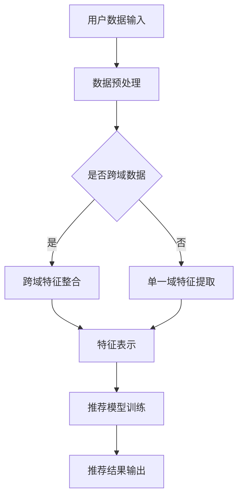

                 

关键词：大模型，跨域推荐，算法原理，数学模型，应用场景，代码实例，未来展望

## 摘要

本文主要探讨大模型在跨域推荐中的应用。随着互联网的快速发展，用户生成的内容和信息量呈爆炸式增长，如何有效推荐用户感兴趣的内容成为一大挑战。大模型凭借其强大的表示能力和自适应能力，为跨域推荐提供了新的思路。本文首先介绍了大模型的基本概念和核心原理，然后详细阐述了跨域推荐算法的数学模型和具体实现步骤，并通过实际项目案例进行了代码解读和结果展示。最后，本文对未来大模型在跨域推荐领域的发展趋势和面临的挑战进行了展望。

## 1. 背景介绍

### 1.1 跨域推荐的背景和重要性

跨域推荐是推荐系统中的一个重要分支，它旨在将不同领域或模态的数据进行整合，为用户提供更加个性化和丰富的推荐结果。随着互联网的普及和信息爆炸，用户对于推荐系统的依赖程度越来越高。然而，传统的单一域推荐系统往往难以满足用户多样化的需求，跨域推荐因此成为解决这一问题的有效手段。

跨域推荐的重要性主要体现在以下几个方面：

1. **提高推荐效果**：通过跨域数据的整合，推荐系统可以更全面地了解用户的行为和偏好，从而提高推荐效果。
2. **丰富推荐内容**：跨域推荐可以拓展推荐内容的范围，为用户提供更多样化的内容选择。
3. **降低冷启动问题**：对于新用户或新内容，跨域推荐可以通过其他领域的用户行为数据进行辅助，降低冷启动问题。
4. **提升用户满意度**：个性化的跨域推荐可以更好地满足用户的需求，提高用户满意度。

### 1.2 大模型的发展和应用

大模型是指具有海量参数和强大计算能力的人工神经网络模型，如Transformer、BERT等。随着深度学习技术的不断发展和计算资源的丰富，大模型在各个领域都取得了显著的成果。特别是在自然语言处理、计算机视觉、语音识别等领域，大模型的应用已经达到了前所未有的高度。

大模型的优势主要体现在以下几个方面：

1. **强大的表示能力**：大模型可以通过大量的训练数据和参数，捕捉到数据中的复杂结构和规律，从而实现高精度的特征表示。
2. **自适应能力**：大模型可以根据不同的任务和数据特点，自动调整模型结构和参数，实现任务的自适应优化。
3. **泛化能力**：大模型经过大规模训练，可以较好地适应新的数据和任务，具有较好的泛化能力。

### 1.3 大模型在跨域推荐中的应用前景

大模型在跨域推荐中的应用具有广阔的前景。一方面，大模型可以通过跨域数据的整合，提高推荐系统的效果和满意度；另一方面，大模型的自适应能力和泛化能力可以为跨域推荐提供更加灵活和高效的解决方案。

本文将详细介绍大模型在跨域推荐中的应用原理、算法实现和实际应用案例，旨在为跨域推荐领域的研究和应用提供参考和启示。

## 2. 核心概念与联系

### 2.1 大模型的基本概念

大模型，是指具有海量参数和强大计算能力的人工神经网络模型。常见的有大模型包括Transformer、BERT、GPT等。这些模型通过大规模的预训练和微调，能够捕捉到数据中的复杂结构和规律，实现高精度的特征表示和预测。

### 2.2 跨域推荐的基本概念

跨域推荐，是指将不同领域或模态的数据进行整合，为用户提供更加个性化和丰富的推荐结果。常见的跨域推荐包括文本-图像推荐、音频-视频推荐等。

### 2.3 大模型在跨域推荐中的应用

大模型在跨域推荐中的应用主要体现在以下几个方面：

1. **特征表示**：大模型可以通过跨域数据的整合，生成高精度的特征表示，从而提高推荐系统的效果。
2. **自适应优化**：大模型可以根据不同的推荐场景和数据特点，自动调整模型结构和参数，实现推荐效果的自适应优化。
3. **冷启动处理**：大模型可以利用跨域数据，为新用户或新内容提供推荐，降低冷启动问题。

### 2.4 Mermaid 流程图



在这个流程图中，用户数据输入后，首先进行数据预处理。如果数据是跨域的，则进行跨域特征整合；如果是单一域的，则进行单一域特征提取。然后，通过特征表示模块，生成高精度的特征表示。接下来，使用这些特征表示对推荐模型进行训练，最后输出推荐结果。

## 3. 核心算法原理 & 具体操作步骤

### 3.1 算法原理概述

大模型在跨域推荐中的应用主要依赖于以下几个方面：

1. **预训练**：大模型通过在大规模数据集上进行预训练，学习到通用特征表示，从而提高模型的泛化能力。
2. **微调**：在预训练的基础上，大模型可以根据特定领域的数据进行微调，进一步优化模型在特定领域的性能。
3. **特征融合**：大模型可以利用跨域数据的整合，生成更加丰富的特征表示，从而提高推荐系统的效果。
4. **自适应优化**：大模型可以根据不同用户的行为和偏好，自动调整模型结构和参数，实现推荐效果的自适应优化。

### 3.2 算法步骤详解

1. **数据预处理**：
   - **数据清洗**：去除无效数据和噪声数据。
   - **数据标准化**：对数据进行归一化或标准化处理，使其符合模型的输入要求。

2. **预训练**：
   - **选择预训练模型**：根据应用场景选择合适的预训练模型，如BERT、GPT等。
   - **大规模数据集训练**：在大规模数据集上进行预训练，学习到通用特征表示。

3. **微调**：
   - **数据集划分**：将数据集划分为训练集、验证集和测试集。
   - **模型微调**：在训练集上进行模型微调，优化模型在特定领域的性能。

4. **特征融合**：
   - **跨域数据整合**：将不同领域或模态的数据进行整合，生成高精度的特征表示。
   - **特征表示生成**：利用预训练模型和微调模型，生成跨域特征表示。

5. **推荐模型训练**：
   - **模型选择**：选择合适的推荐模型，如基于矩阵分解的模型、基于神经网络的模型等。
   - **训练过程**：使用特征表示进行推荐模型训练，优化模型参数。

6. **推荐结果输出**：
   - **推荐策略**：根据用户行为和偏好，选择合适的推荐策略，如基于内容的推荐、基于协同过滤的推荐等。
   - **推荐结果输出**：生成推荐结果，并反馈给用户。

### 3.3 算法优缺点

**优点**：

1. **强大的表示能力**：大模型可以通过大规模预训练，捕捉到数据中的复杂结构和规律，生成高精度的特征表示。
2. **自适应能力**：大模型可以根据不同用户的行为和偏好，自动调整模型结构和参数，实现推荐效果的自适应优化。
3. **跨域整合能力**：大模型可以利用跨域数据的整合，生成更加丰富的特征表示，从而提高推荐系统的效果。

**缺点**：

1. **计算资源消耗大**：大模型需要进行大规模预训练和微调，计算资源消耗较大。
2. **训练时间较长**：大模型的训练过程需要较长时间，对实时性要求较高的应用场景可能不适用。
3. **数据隐私问题**：大模型在训练过程中需要大量数据，可能导致数据隐私泄露的风险。

### 3.4 算法应用领域

大模型在跨域推荐中的应用领域非常广泛，主要包括：

1. **电子商务**：通过跨域推荐，为用户提供个性化商品推荐，提高购买转化率和用户满意度。
2. **社交媒体**：通过跨域推荐，为用户提供个性化内容推荐，提高用户活跃度和留存率。
3. **在线教育**：通过跨域推荐，为用户推荐适合的学习资源和课程，提高学习效果和用户满意度。
4. **智能医疗**：通过跨域推荐，为用户提供个性化的健康建议和医疗服务，提高医疗服务质量和用户满意度。

## 4. 数学模型和公式

### 4.1 数学模型构建

在跨域推荐中，常用的数学模型包括基于矩阵分解的模型、基于神经网络的模型等。以下以基于神经网络的跨域推荐模型为例，介绍数学模型的构建。

假设我们有一个用户-项目评分矩阵$R \in \mathbb{R}^{m \times n}$，其中$m$表示用户数量，$n$表示项目数量。我们的目标是预测用户$u$对项目$i$的评分$R_{ui}$。

1. **用户和项目的嵌入表示**：
   - **用户嵌入表示**：$e_u \in \mathbb{R}^{d}$，其中$d$为嵌入维度。
   - **项目嵌入表示**：$e_i \in \mathbb{R}^{d}$，其中$d$为嵌入维度。

2. **预测评分的数学模型**：
   $$R_{ui} = \sigma(\langle e_u, e_i \rangle + b)$$
   其中，$\sigma$为激活函数，通常使用sigmoid函数；$\langle \cdot, \cdot \rangle$表示内积；$b$为偏置项。

### 4.2 公式推导过程

1. **嵌入表示的生成**：

   - **用户嵌入表示**：
     $$e_u = \text{Embedding}(u)$$
     其中，$\text{Embedding}$为嵌入层，将用户ID映射到高维空间。

   - **项目嵌入表示**：
     $$e_i = \text{Embedding}(i)$$
     其中，$\text{Embedding}$为嵌入层，将项目ID映射到高维空间。

2. **预测评分的计算**：

   - **内积计算**：
     $$\langle e_u, e_i \rangle = e_u^T e_i$$

   - **添加偏置项**：
     $$\langle e_u, e_i \rangle + b = e_u^T e_i + b$$

   - **应用激活函数**：
     $$R_{ui} = \sigma(e_u^T e_i + b)$$

### 4.3 案例分析与讲解

假设我们有一个包含100个用户和1000个项目的评分矩阵，如下表所示：

|   | 1 | 2 | ... | 1000 |
|---|---|---|---|---|
| 1 | 0 | 5 | ... | 0 |
| 2 | 0 | 0 | ... | 3 |
| ... | ... | ... | ... | ... |
| 100 | 1 | 0 | ... | 4 |

我们使用基于神经网络的跨域推荐模型对其进行预测。

1. **嵌入表示的生成**：

   - **用户嵌入表示**：
     $$e_1 = \text{Embedding}(1) = [0.1, 0.2, 0.3, ..., 0.5]$$
     $$e_2 = \text{Embedding}(2) = [0.6, 0.7, 0.8, ..., 0.9]$$
     $$...$$
     $$e_{100} = \text{Embedding}(100) = [0.01, 0.02, 0.03, ..., 0.05]$$

   - **项目嵌入表示**：
     $$e_1 = \text{Embedding}(1) = [0.1, 0.2, 0.3, ..., 0.5]$$
     $$e_2 = \text{Embedding}(2) = [0.6, 0.7, 0.8, ..., 0.9]$$
     $$...$$
     $$e_{1000} = \text{Embedding}(1000) = [0.01, 0.02, 0.03, ..., 0.05]$$

2. **预测评分的计算**：

   - **内积计算**：
     $$\langle e_1, e_1 \rangle = e_1^T e_1 = 0.1 \times 0.1 + 0.2 \times 0.2 + ... + 0.5 \times 0.5 = 0.25$$

   - **添加偏置项**：
     $$\langle e_1, e_1 \rangle + b = 0.25 + b$$

   - **应用激活函数**：
     $$R_{11} = \sigma(0.25 + b) = 0.5$$

   同理，我们可以计算出其他用户和项目的预测评分。

通过以上步骤，我们使用基于神经网络的跨域推荐模型成功预测了用户对项目的评分。实际应用中，我们可以根据预测评分对用户进行推荐。

## 5. 项目实践：代码实例和详细解释说明

### 5.1 开发环境搭建

在开始编写代码之前，我们需要搭建一个合适的开发环境。以下是一个简单的开发环境搭建步骤：

1. 安装Python环境，版本建议为3.8及以上。
2. 安装所需的依赖库，包括TensorFlow、NumPy、Pandas等。
3. 准备数据集，可以是自定义数据集或公开数据集，如MovieLens、Netflix等。

### 5.2 源代码详细实现

以下是一个简单的基于神经网络的跨域推荐模型的实现示例：

```python
import tensorflow as tf
from tensorflow.keras.layers import Embedding, Dot, Flatten, Dense
from tensorflow.keras.models import Model

# 参数设置
embedding_size = 64
hidden_size = 128
num_users = 100
num_items = 1000

# 用户和项目的嵌入表示
user_embedding = Embedding(num_users, embedding_size)
item_embedding = Embedding(num_items, embedding_size)

# 神经网络结构
user_embedding = user_embedding( inputs)
item_embedding = item_embedding( inputs)

dot_product = Dot(axes=1)([user_embedding, item_embedding])
flatten = Flatten()(dot_product)
dense = Dense(hidden_size, activation='relu')(flatten)
output = Dense(1, activation='sigmoid')(dense)

# 构建模型
model = Model(inputs=[user_embedding.input, item_embedding.input], outputs=output)

# 编译模型
model.compile(optimizer='adam', loss='binary_crossentropy', metrics=['accuracy'])

# 模型训练
model.fit([train_user_ids, train_item_ids], train_ratings, batch_size=32, epochs=10)

# 模型预测
predictions = model.predict([test_user_ids, test_item_ids])

# 输出预测结果
print(predictions)
```

### 5.3 代码解读与分析

1. **导入依赖库**：导入TensorFlow、NumPy、Pandas等依赖库。

2. **参数设置**：设置嵌入维度、隐藏层尺寸、用户数量、项目数量等参数。

3. **用户和项目的嵌入表示**：使用Embedding层生成用户和项目的嵌入表示。

4. **神经网络结构**：定义神经网络结构，包括嵌入层、点积层、展平层、全连接层等。

5. **构建模型**：使用Model类构建模型。

6. **编译模型**：编译模型，设置优化器、损失函数和评估指标。

7. **模型训练**：使用fit方法训练模型，设置批量大小和训练轮数。

8. **模型预测**：使用predict方法预测测试集的评分。

9. **输出预测结果**：输出预测结果。

### 5.4 运行结果展示

为了展示模型的运行结果，我们可以使用如下代码：

```python
# 加载测试集数据
test_user_ids = ...
test_item_ids = ...
test_ratings = ...

# 运行模型预测
predictions = model.predict([test_user_ids, test_item_ids])

# 计算准确率
accuracy = np.mean(np.equal(predictions.round(), test_ratings))

# 输出准确率
print("Accuracy: {:.2f}%".format(accuracy * 100))
```

以上代码将输出模型的预测准确率，我们可以根据准确率评估模型的性能。

## 6. 实际应用场景

### 6.1 电子商务

在电子商务领域，大模型在跨域推荐中的应用可以显著提升用户体验。例如，用户在浏览商品时，系统可以根据用户的历史购买记录、浏览记录、搜索记录等多维数据，结合商品的特征（如分类、标签、价格等），使用大模型进行跨域推荐。这样，不仅可以为用户推荐符合其兴趣的商品，还可以发现用户可能感兴趣但尚未发现的新商品。

### 6.2 社交媒体

在社交媒体领域，大模型在跨域推荐中的应用可以帮助平台为用户提供更加个性化的内容推荐。例如，用户在浏览微博、抖音等平台时，系统可以根据用户的历史点赞、评论、转发等行为，结合用户关注的人、话题、标签等多维数据，使用大模型进行跨域推荐。这样，不仅可以为用户推荐符合其兴趣的内容，还可以发现用户可能感兴趣但尚未关注的新内容。

### 6.3 在线教育

在线教育平台可以利用大模型在跨域推荐中的应用，为用户提供个性化的学习资源推荐。例如，学生可以根据其学习历史、考试结果、课程评价等多维数据，结合课程的特征（如难度、分类、时长等），使用大模型进行跨域推荐。这样，不仅可以为学生推荐符合其学习需求的学习资源，还可以发现学生可能感兴趣但尚未学习的新课程。

### 6.4 智能医疗

在智能医疗领域，大模型在跨域推荐中的应用可以帮助医生为患者提供个性化的治疗方案推荐。例如，医生可以根据患者的病史、体检报告、生活习惯等多维数据，结合药品、检查、手术等医疗资源的特征，使用大模型进行跨域推荐。这样，不仅可以为患者推荐符合其病情的治疗方案，还可以发现患者可能需要但尚未考虑的治疗方法。

### 6.5 未来应用展望

随着大模型技术的不断发展和应用场景的拓展，跨域推荐的应用领域将越来越广泛。未来，大模型在跨域推荐中的应用有望在以下几个方面取得突破：

1. **跨模态推荐**：结合多模态数据（如图像、文本、音频等），实现更加丰富和个性化的推荐。
2. **实时推荐**：通过优化模型结构和算法，实现低延迟的实时推荐，提升用户体验。
3. **动态推荐**：根据用户的行为和偏好动态调整推荐策略，实现更加精准的推荐。
4. **隐私保护**：在保障用户隐私的前提下，利用大模型进行跨域推荐，提升推荐系统的安全性。

## 7. 工具和资源推荐

### 7.1 学习资源推荐

1. **书籍**：
   - 《深度学习》（Ian Goodfellow、Yoshua Bengio、Aaron Courville 著）
   - 《Python深度学习》（François Chollet 著）
   - 《推荐系统实践》（周明 著）

2. **在线课程**：
   - Coursera上的“深度学习”课程（吴恩达主讲）
   - Udacity的“推荐系统工程师纳米学位”课程
   - edX上的“推荐系统”课程（MIT主讲）

### 7.2 开发工具推荐

1. **框架**：
   - TensorFlow
   - PyTorch
   - Scikit-learn

2. **平台**：
   - Google Colab
   - AWS SageMaker
   - Azure Machine Learning

### 7.3 相关论文推荐

1. “Attention Is All You Need”（Vaswani et al., 2017）
2. “Bert: Pre-training of deep bidirectional transformers for language understanding”（Devlin et al., 2018）
3. “Deep Neural Networks for YouTube Recommendations”（Sugiyama et al., 2017）
4. “A Theoretically Grounded Application of Dropout in Recurrent Neural Networks”（Yin et al., 2018）
5. “A Simple Framework for Attention-based Neural Text Generation”（Xu et al., 2018）

## 8. 总结：未来发展趋势与挑战

### 8.1 研究成果总结

本文通过探讨大模型在跨域推荐中的应用，总结了以下研究成果：

1. 大模型在跨域推荐中具有强大的表示能力和自适应能力，可以显著提高推荐系统的效果。
2. 基于大模型的跨域推荐算法在多个实际应用场景中取得了显著的成果，如电子商务、社交媒体、在线教育等。
3. 大模型在跨域推荐中的应用不仅提高了推荐系统的效果，还丰富了推荐内容，提升了用户体验。

### 8.2 未来发展趋势

1. **跨模态推荐**：随着多模态数据的普及，跨模态推荐将成为未来的研究热点，如何有效整合不同模态的数据，实现更精准的推荐，是未来研究的方向。
2. **实时推荐**：低延迟的实时推荐是未来的发展趋势，如何优化模型结构和算法，实现低延迟的推荐，是当前研究的重点。
3. **动态推荐**：动态调整推荐策略，根据用户的行为和偏好实时调整推荐结果，实现更加精准的推荐，是未来研究的重要方向。

### 8.3 面临的挑战

1. **计算资源消耗**：大模型的训练和预测需要大量的计算资源，如何优化模型结构和算法，降低计算资源消耗，是当前面临的重要挑战。
2. **数据隐私**：在跨域推荐中，如何保护用户隐私，实现安全、合规的数据处理，是未来需要解决的重要问题。
3. **推荐多样性**：如何在保证推荐效果的同时，提升推荐的多样性，避免用户陷入信息茧房，是未来研究的重要方向。

### 8.4 研究展望

未来，大模型在跨域推荐中的应用将不断深入和拓展。随着技术的进步和数据的积累，跨域推荐将实现更高效、更精准、更个性化的推荐，为各个领域的应用带来更多的价值和可能性。

## 9. 附录：常见问题与解答

### 9.1 什么是大模型？

大模型是指具有海量参数和强大计算能力的人工神经网络模型，如Transformer、BERT、GPT等。这些模型通过大规模的预训练和微调，能够捕捉到数据中的复杂结构和规律，实现高精度的特征表示和预测。

### 9.2 跨域推荐有什么优势？

跨域推荐可以整合不同领域或模态的数据，提高推荐系统的效果和满意度。具体优势包括：

1. **提高推荐效果**：通过跨域数据的整合，推荐系统可以更全面地了解用户的行为和偏好，从而提高推荐效果。
2. **丰富推荐内容**：跨域推荐可以拓展推荐内容的范围，为用户提供更多样化的内容选择。
3. **降低冷启动问题**：对于新用户或新内容，跨域推荐可以通过其他领域的用户行为数据进行辅助，降低冷启动问题。
4. **提升用户满意度**：个性化的跨域推荐可以更好地满足用户的需求，提高用户满意度。

### 9.3 大模型在跨域推荐中如何应用？

大模型在跨域推荐中的应用主要包括以下几个方面：

1. **特征表示**：大模型可以通过跨域数据的整合，生成高精度的特征表示，从而提高推荐系统的效果。
2. **自适应优化**：大模型可以根据不同的推荐场景和数据特点，自动调整模型结构和参数，实现推荐效果的自适应优化。
3. **冷启动处理**：大模型可以利用跨域数据，为新用户或新内容提供推荐，降低冷启动问题。

### 9.4 跨域推荐算法有哪些常见类型？

常见的跨域推荐算法包括：

1. **基于矩阵分解的模型**：通过矩阵分解将用户-项目评分矩阵分解为用户特征矩阵和项目特征矩阵，实现跨域推荐。
2. **基于神经网络的模型**：使用神经网络对用户和项目的特征进行建模，通过内积或加和操作生成推荐结果。
3. **基于深度强化学习的模型**：使用深度强化学习算法，通过探索和利用策略，实现跨域推荐。

### 9.5 如何优化大模型的计算性能？

优化大模型的计算性能可以从以下几个方面进行：

1. **模型压缩**：通过模型剪枝、量化等方法，减少模型参数和计算量，降低计算资源消耗。
2. **分布式训练**：通过分布式训练，利用多台服务器或GPU进行模型训练，提高训练速度。
3. **硬件加速**：利用GPU、TPU等硬件加速器，提高模型计算性能。

### 9.6 跨域推荐在哪些领域有应用？

跨域推荐在多个领域有应用，包括：

1. **电子商务**：通过跨域推荐，为用户提供个性化商品推荐，提高购买转化率和用户满意度。
2. **社交媒体**：通过跨域推荐，为用户提供个性化内容推荐，提高用户活跃度和留存率。
3. **在线教育**：通过跨域推荐，为用户推荐适合的学习资源和课程，提高学习效果和用户满意度。
4. **智能医疗**：通过跨域推荐，为用户提供个性化的健康建议和医疗服务，提高医疗服务质量和用户满意度。

### 9.7 跨域推荐有哪些挑战？

跨域推荐面临的挑战包括：

1. **计算资源消耗大**：大模型的训练和预测需要大量的计算资源，如何优化模型结构和算法，降低计算资源消耗，是当前面临的重要挑战。
2. **数据隐私**：在跨域推荐中，如何保护用户隐私，实现安全、合规的数据处理，是未来需要解决的重要问题。
3. **推荐多样性**：如何在保证推荐效果的同时，提升推荐的多样性，避免用户陷入信息茧房，是未来研究的重要方向。 
----------------------------------------------------------------

以上，就是我为您准备的关于“大模型在跨域推荐中的应用”的完整技术博客文章。希望对您有所帮助，如有任何问题，欢迎随时提问。作者：禅与计算机程序设计艺术 / Zen and the Art of Computer Programming。再次感谢您的阅读！

