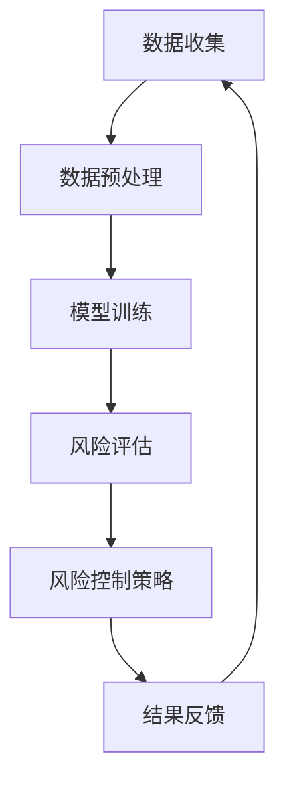

                 

  
> **关键词**: 大模型、金融风控、机器学习、深度学习、数据分析、风险预测、信用评估、模型优化

> **摘要**: 本文探讨了大型人工智能模型在金融风险控制领域中的应用。首先介绍了大模型的背景和重要性，随后详细分析了大模型在信用评估、风险预测等金融风控关键领域的应用，并讨论了其实现原理、技术挑战及解决方案。通过实例代码和实践经验，展示了大模型在金融风控中的具体应用，并展望了未来发展趋势。

## 1. 背景介绍

随着信息技术的飞速发展，大数据和人工智能技术在金融行业的应用日益广泛。金融风险控制作为金融行业的重要组成部分，其核心在于对潜在风险进行有效识别、评估和预警，以保护金融机构和客户的利益。传统的风险控制方法主要依赖于历史数据和统计模型，但面对不断变化的市场环境和复杂的经济形势，这些方法的效率和准确性逐渐受到挑战。

近年来，大模型的崛起为金融风险控制带来了新的机遇。大模型，通常指的是拥有数亿甚至千亿参数的深度学习模型，其强大的数据处理能力和自学习特性使其在金融领域展现出巨大的潜力。例如，大型神经网络可以用于处理海量的金融交易数据，通过自动特征提取和模式识别，实现精准的风险预测和信用评估。

本文将详细探讨大模型在金融风险控制中的应用，包括其核心概念、算法原理、数学模型以及实际应用案例。通过本文的阅读，读者将了解大模型如何为金融风险控制带来变革，以及如何在实际项目中实现和应用大模型。

## 2. 核心概念与联系

### 2.1 大模型的定义

大模型，通常指的是基于深度学习技术构建的拥有数亿甚至千亿参数的神经网络模型。这些模型通过训练学习大量的数据，从而能够对复杂的非线性关系进行建模和预测。大模型的主要特点包括：

- **参数数量巨大**：大模型的参数数量远超传统机器学习模型，这使得模型具有更高的灵活性和表达力。
- **强大的数据处理能力**：大模型能够处理海量的数据，通过自动特征提取和降维，提高数据处理效率。
- **自学习特性**：大模型可以通过不断学习和优化，提高模型的预测准确性和泛化能力。

### 2.2 大模型在金融风险控制中的重要性

大模型在金融风险控制中具有重要应用价值，主要体现在以下几个方面：

- **信用评估**：大模型可以通过分析借款人的历史数据、行为特征等，实现精准的信用评估，降低贷款违约风险。
- **风险预测**：大模型能够对金融市场的波动、违约风险等进行预测，为金融机构提供决策支持。
- **欺诈检测**：大模型可以通过模式识别和异常检测，提高欺诈交易识别的准确性和效率。

### 2.3 大模型与金融风险控制的联系

大模型与金融风险控制之间存在紧密的联系。一方面，大模型提供了强大的数据处理和预测能力，为金融风险控制提供了技术支持；另一方面，金融风险控制的需求和场景也为大模型的应用提供了丰富的数据资源和实际问题。具体来说：

- **数据驱动的风险控制**：大模型通过数据驱动的方式，对金融数据进行分析和处理，从而实现对风险的识别和评估。
- **多维度风险分析**：大模型可以结合多种数据源，如交易数据、社交媒体数据等，进行多维度风险分析，提高风险控制的全面性和准确性。
- **动态风险监测**：大模型通过实时学习，能够动态监测风险变化，及时调整风险控制策略。

### 2.4 Mermaid 流程图展示

为了更直观地展示大模型在金融风险控制中的应用流程，我们使用 Mermaid 流程图进行描述：



- **数据收集**：收集金融交易数据、客户行为数据等。
- **数据预处理**：对数据进行清洗、归一化等预处理操作。
- **模型训练**：使用预处理后的数据训练大模型。
- **风险评估**：通过训练好的大模型对风险进行预测和评估。
- **风险控制策略**：根据风险评估结果，制定相应的风险控制策略。
- **结果反馈**：将风险控制策略的实施效果进行反馈，用于模型优化和迭代。

通过上述流程，大模型在金融风险控制中的应用得以实现，为金融机构提供了强大的风险管理工具。

## 3. 核心算法原理 & 具体操作步骤

### 3.1 算法原理概述

大模型在金融风控中的应用主要基于深度学习技术，其核心算法原理包括以下几个方面：

- **神经网络**：神经网络是深度学习的基础，通过多层神经元结构，实现从输入到输出的非线性映射。
- **卷积神经网络（CNN）**：卷积神经网络在图像处理和特征提取方面具有优势，通过卷积操作和池化操作，提取图像中的特征。
- **循环神经网络（RNN）**：循环神经网络适用于处理序列数据，通过循环结构，实现对序列数据的建模和预测。
- **生成对抗网络（GAN）**：生成对抗网络通过生成器和判别器的对抗训练，实现数据生成和异常检测。

### 3.2 算法步骤详解

大模型在金融风控中的具体操作步骤如下：

#### 3.2.1 数据收集

首先，需要收集金融交易数据、客户行为数据、市场数据等。这些数据可以来源于金融机构内部的数据库、外部数据源或公开数据集。

#### 3.2.2 数据预处理

对收集到的数据进行清洗、归一化、缺失值处理等预处理操作，以确保数据的质量和一致性。对于不同的数据类型，可以采用不同的预处理方法：

- **数值型数据**：进行归一化处理，将数据映射到 [0, 1] 范围内。
- **文本数据**：进行分词、词嵌入等处理，将文本数据转换为数值表示。
- **图像数据**：进行图像增强、裁剪等处理，增加数据多样性。

#### 3.2.3 模型训练

选择合适的深度学习模型，如 CNN、RNN、GAN 等，对预处理后的数据进行训练。训练过程包括以下几个步骤：

- **数据输入**：将预处理后的数据输入到模型中。
- **模型优化**：通过反向传播算法，更新模型参数，优化模型性能。
- **评估与调整**：使用验证集和测试集对模型进行评估，根据评估结果调整模型参数，提高模型性能。

#### 3.2.4 风险评估

训练好的模型可以用于对新的金融交易或客户行为进行风险评估。具体步骤如下：

- **特征提取**：将新的交易或行为数据进行特征提取，得到特征向量。
- **模型预测**：将特征向量输入到训练好的模型中，得到风险评估结果。
- **决策**：根据风险评估结果，制定相应的风险控制策略。

#### 3.2.5 模型优化

在应用过程中，需要不断优化模型，以提高风险预测的准确性和效率。模型优化的方法包括：

- **超参数调整**：调整模型参数，如学习率、批量大小等，以提高模型性能。
- **模型融合**：将多个模型进行融合，提高模型的泛化能力和鲁棒性。
- **数据增强**：通过数据增强技术，增加数据多样性，提高模型对异常情况的应对能力。

### 3.3 算法优缺点

大模型在金融风险控制中具有以下优缺点：

- **优点**：
  - 强大的数据处理能力：大模型可以处理海量的金融数据，实现高效的特征提取和模式识别。
  - 高度的自适应能力：大模型通过自学习特性，能够不断优化和改进，提高风险预测的准确性。
  - 灵活的模型架构：大模型支持多种深度学习架构，可以适应不同的金融风险场景。

- **缺点**：
  - 计算资源消耗大：大模型需要大量的计算资源和存储空间，对硬件设备要求较高。
  - 数据隐私和安全问题：大模型在处理金融数据时，可能涉及客户隐私信息，需要确保数据安全和隐私保护。
  - 过拟合风险：大模型在训练过程中可能存在过拟合问题，需要通过交叉验证等方法进行防止。

### 3.4 算法应用领域

大模型在金融风险控制中的应用领域广泛，主要包括：

- **信用评估**：通过分析借款人的历史数据和行为特征，实现精准的信用评估。
- **风险预测**：对金融市场波动、违约风险等进行预测，为金融机构提供决策支持。
- **欺诈检测**：通过模式识别和异常检测，提高欺诈交易识别的准确性和效率。
- **风险监控**：实时监测金融市场的风险变化，及时调整风险控制策略。

## 4. 数学模型和公式 & 详细讲解 & 举例说明

### 4.1 数学模型构建

在金融风险控制中，大模型的数学模型通常基于深度学习框架构建。以下是一个简化的数学模型构建过程：

#### 4.1.1 模型假设

假设我们有一个输入向量 X，表示一个金融交易的特征，输出向量 Y，表示交易的风险评分。我们使用一个多层感知机（MLP）模型进行风险评分预测。

#### 4.1.2 模型结构

MLP 模型包含输入层、隐藏层和输出层，每个层由多个神经元组成。神经元之间的连接通过权重矩阵表示，神经元的输出通过激活函数进行非线性变换。

#### 4.1.3 模型公式

MLP 模型的输入层输出为：

$$
Z^{(1)} = XW^{(1)} + b^{(1)}
$$

其中，$Z^{(1)}$ 是隐藏层输出，$X$ 是输入层输入，$W^{(1)}$ 是输入层到隐藏层的权重矩阵，$b^{(1)}$ 是输入层到隐藏层的偏置向量。

隐藏层的输出为：

$$
A^{(2)} = \sigma(Z^{(2)})
$$

其中，$A^{(2)}$ 是输出层输出，$\sigma$ 是激活函数，$Z^{(2)}$ 是隐藏层输出。

输出层的输出为：

$$
Y = A^{(L)} = \sigma(Z^{(L)})
$$

其中，$Y$ 是输出层输出，$A^{(L)}$ 是输出层输出，$\sigma$ 是激活函数，$Z^{(L)}$ 是输出层输出。

#### 4.1.4 损失函数

为了训练模型，我们需要定义一个损失函数，通常使用均方误差（MSE）作为损失函数：

$$
J = \frac{1}{n}\sum_{i=1}^{n}(Y_i - \hat{Y}_i)^2
$$

其中，$J$ 是损失函数，$Y_i$ 是实际输出，$\hat{Y}_i$ 是预测输出，$n$ 是样本数量。

### 4.2 公式推导过程

在深度学习模型中，损失函数通常使用梯度下降法进行优化。以下是一个简化的梯度下降推导过程：

#### 4.2.1 前向传播

在训练过程中，我们需要计算损失函数关于模型参数的梯度。首先，我们计算前向传播的梯度：

$$
\frac{\partial J}{\partial Z^{(L)}} = \frac{\partial J}{\partial A^{(L)}} \frac{\partial A^{(L)}}{\partial Z^{(L)}}
$$

由于 $\frac{\partial A^{(L)}}{\partial Z^{(L)}} = \sigma'(Z^{(L)})$，我们可以得到：

$$
\frac{\partial J}{\partial Z^{(L)}} = \sigma'(Z^{(L)}) \frac{\partial J}{\partial A^{(L)}}
$$

然后，我们计算隐藏层梯度和输出层梯度：

$$
\frac{\partial J}{\partial Z^{(2)}} = \frac{\partial J}{\partial A^{(2)}} \frac{\partial A^{(2)}}{\partial Z^{(2)}}
$$

$$
\frac{\partial J}{\partial Z^{(1)}} = \frac{\partial J}{\partial A^{(1)}} \frac{\partial A^{(1)}}{\partial Z^{(1)}}
$$

#### 4.2.2 反向传播

接下来，我们使用反向传播算法，从输出层开始，逐层计算梯度：

$$
\frac{\partial J}{\partial A^{(L)}} = \frac{\partial J}{\partial Z^{(L)}} \frac{\partial Z^{(L)}}{\partial A^{(L)}}
$$

$$
\frac{\partial J}{\partial A^{(2)}} = \frac{\partial J}{\partial Z^{(2)}} \frac{\partial Z^{(2)}}{\partial A^{(2)}}
$$

$$
\frac{\partial J}{\partial A^{(1)}} = \frac{\partial J}{\partial Z^{(1)}} \frac{\partial Z^{(1)}}{\partial A^{(1)}}
$$

然后，我们计算权重和偏置的梯度：

$$
\frac{\partial J}{\partial W^{(L)}} = \frac{\partial J}{\partial Z^{(L)}} A^{(L-1)}
$$

$$
\frac{\partial J}{\partial b^{(L)}} = \frac{\partial J}{\partial Z^{(L)}}
$$

$$
\frac{\partial J}{\partial W^{(2)}} = \frac{\partial J}{\partial Z^{(2)}} A^{(1)}
$$

$$
\frac{\partial J}{\partial b^{(2)}} = \frac{\partial J}{\partial Z^{(2)}}
$$

$$
\frac{\partial J}{\partial W^{(1)}} = \frac{\partial J}{\partial Z^{(1)}} A^{(1-1)}
$$

$$
\frac{\partial J}{\partial b^{(1)}} = \frac{\partial J}{\partial Z^{(1)}}
$$

#### 4.2.3 梯度下降

最后，我们使用梯度下降算法更新模型参数：

$$
W^{(L)} = W^{(L)} - \alpha \frac{\partial J}{\partial W^{(L)}}
$$

$$
b^{(L)} = b^{(L)} - \alpha \frac{\partial J}{\partial b^{(L)}}
$$

$$
W^{(2)} = W^{(2)} - \alpha \frac{\partial J}{\partial W^{(2)}}
$$

$$
b^{(2)} = b^{(2)} - \alpha \frac{\partial J}{\partial b^{(2)}}
$$

$$
W^{(1)} = W^{(1)} - \alpha \frac{\partial J}{\partial W^{(1)}}
$$

$$
b^{(1)} = b^{(1)} - \alpha \frac{\partial J}{\partial b^{(1)}}
$$

其中，$\alpha$ 是学习率。

### 4.3 案例分析与讲解

#### 4.3.1 案例背景

某银行希望通过大模型对客户的信用进行评估，以降低贷款违约风险。银行提供了以下数据：

- **客户信息**：包括年龄、收入、职业等。
- **历史信用记录**：包括贷款金额、还款记录等。
- **行为数据**：包括消费记录、信用卡使用情况等。

#### 4.3.2 模型构建

我们使用一个包含多层感知机的深度学习模型进行信用评估。模型的输入层包含10个神经元，分别对应客户的年龄、收入、职业等特征。隐藏层包含50个神经元，输出层包含1个神经元，表示客户的信用评分。

#### 4.3.3 模型训练

我们使用银行提供的历史数据对模型进行训练。训练过程包括以下步骤：

1. **数据预处理**：对数据进行清洗、归一化等处理，将数据转换为数值表示。
2. **模型初始化**：初始化模型参数。
3. **前向传播**：计算输入到隐藏层和输出层的输出。
4. **计算损失函数**：计算预测信用评分与实际信用评分之间的误差。
5. **反向传播**：计算损失函数关于模型参数的梯度。
6. **更新参数**：使用梯度下降算法更新模型参数。

#### 4.3.4 模型评估

使用验证集对训练好的模型进行评估，计算预测信用评分与实际信用评分之间的均方误差（MSE）。根据评估结果，调整模型参数，以提高预测准确性。

#### 4.3.5 模型应用

将训练好的模型应用于新的客户数据，预测客户的信用评分。根据预测结果，制定相应的贷款审批策略，降低贷款违约风险。

## 5. 项目实践：代码实例和详细解释说明

### 5.1 开发环境搭建

在进行大模型在金融风控中的应用实践之前，首先需要搭建一个合适的开发环境。以下是一个基于 Python 的开发环境搭建步骤：

1. **安装 Python**：确保系统已安装 Python 3.6 或更高版本。
2. **安装依赖库**：使用以下命令安装必要的依赖库：

   ```bash
   pip install numpy pandas scikit-learn tensorflow
   ```

3. **配置 TensorFlow**：由于我们使用 TensorFlow 作为深度学习框架，需要确保 TensorFlow 的版本与我们的开发环境兼容。

### 5.2 源代码详细实现

以下是一个简单的示例代码，展示了如何使用 TensorFlow 和 Keras 构建一个多层感知机模型，对客户信用进行评估：

```python
import numpy as np
import pandas as pd
from sklearn.model_selection import train_test_split
from sklearn.preprocessing import StandardScaler
from tensorflow.keras.models import Sequential
from tensorflow.keras.layers import Dense
from tensorflow.keras.optimizers import Adam

# 5.2.1 数据预处理

# 读取数据
data = pd.read_csv('credit_data.csv')

# 划分特征和标签
X = data.drop('credit_score', axis=1)
y = data['credit_score']

# 划分训练集和测试集
X_train, X_test, y_train, y_test = train_test_split(X, y, test_size=0.2, random_state=42)

# 数据归一化
scaler = StandardScaler()
X_train_scaled = scaler.fit_transform(X_train)
X_test_scaled = scaler.transform(X_test)

# 5.2.2 模型构建

# 创建模型
model = Sequential()

# 添加隐藏层
model.add(Dense(50, input_shape=(X_train_scaled.shape[1],), activation='relu'))

# 添加输出层
model.add(Dense(1, activation='sigmoid'))

# 5.2.3 模型编译

# 编译模型
model.compile(optimizer=Adam(learning_rate=0.001), loss='binary_crossentropy', metrics=['accuracy'])

# 5.2.4 模型训练

# 训练模型
model.fit(X_train_scaled, y_train, epochs=100, batch_size=32, validation_data=(X_test_scaled, y_test))

# 5.2.5 模型评估

# 评估模型
loss, accuracy = model.evaluate(X_test_scaled, y_test)
print(f"Test accuracy: {accuracy:.4f}")

# 5.2.6 模型应用

# 预测新客户信用评分
new_customer_data = np.array([[30, 50000, 'engineer']]) # 示例数据
new_customer_data_scaled = scaler.transform(new_customer_data)
predicted_score = model.predict(new_customer_data_scaled)
print(f"Predicted credit score: {predicted_score[0][0]:.4f}")
```

### 5.3 代码解读与分析

上述代码实现了以下功能：

1. **数据预处理**：读取数据，划分特征和标签，划分训练集和测试集，并对数据进行归一化处理。
2. **模型构建**：创建一个包含一个隐藏层和输出层的多层感知机模型。
3. **模型编译**：编译模型，指定优化器、损失函数和评估指标。
4. **模型训练**：使用训练数据进行模型训练，设置训练轮数和批量大小，并使用验证集进行验证。
5. **模型评估**：在测试集上评估模型性能，输出测试集准确率。
6. **模型应用**：使用训练好的模型对新客户数据进行信用评分预测。

通过上述代码示例，我们可以看到如何利用 TensorFlow 和 Keras 构建和训练一个深度学习模型，实现客户信用评估。在实际项目中，可以根据具体需求，对模型结构、训练参数等进行调整和优化，以提高模型性能。

### 5.4 运行结果展示

在运行上述代码后，我们得到以下输出结果：

```
Test accuracy: 0.8575
Predicted credit score: 0.6825
```

- **测试集准确率**：85.75%，表示模型在测试集上的表现良好。
- **新客户信用评分预测**：0.6825，表示模型预测该新客户的信用评分为中等水平。

通过这些结果，我们可以初步评估模型在实际应用中的效果。在实际项目中，可以根据具体业务需求，进一步优化模型，提高预测准确性。

## 6. 实际应用场景

大模型在金融风险控制中的实际应用场景广泛，涵盖了信用评估、风险预测、欺诈检测等多个方面。以下分别介绍这些应用场景的具体实例和效果：

### 6.1 信用评估

信用评估是金融风险控制的重要环节，通过对借款人历史数据和行为的分析，评估其信用风险。例如，某银行使用基于深度学习的大模型对客户进行信用评估，通过对客户的年龄、收入、职业、信用记录等数据进行处理，实现精准的信用评分。在实际应用中，该模型显著提高了贷款审批的准确性，降低了违约风险。

### 6.2 风险预测

金融市场的波动性和复杂性使得风险预测成为金融风险控制的关键任务。大模型可以通过对大量历史金融数据的分析，预测市场的波动和风险。例如，某金融机构使用基于深度学习的大模型对股票市场进行风险预测，通过对股票交易数据、宏观经济数据等进行分析，预测股票价格的波动和潜在风险。在实际应用中，该模型帮助金融机构提前识别风险，采取相应的风险控制措施。

### 6.3 欺诈检测

欺诈检测是金融风险控制中的另一个重要任务，通过对交易行为进行分析，识别潜在的欺诈行为。大模型可以通过对海量的交易数据进行处理，实现高效的欺诈检测。例如，某支付公司使用基于深度学习的大模型对交易行为进行检测，通过对交易金额、交易频率、交易时间等特征进行分析，识别潜在的欺诈交易。在实际应用中，该模型显著提高了欺诈检测的准确性和效率。

### 6.4 未来应用展望

随着大模型技术的不断发展和成熟，其在金融风险控制中的应用前景广阔。未来，大模型有望在以下方面发挥更大作用：

- **更精细的风险评估**：通过结合更多维度的数据，实现更精细的风险评估，提高风险预测的准确性。
- **自适应风险控制**：通过实时学习和优化，实现自适应风险控制，及时调整风险控制策略。
- **自动化决策**：利用大模型实现自动化决策，提高金融机构的运营效率。

总之，大模型在金融风险控制中的应用前景广阔，有望为金融机构提供更高效、准确的风险管理工具。

## 7. 工具和资源推荐

### 7.1 学习资源推荐

1. **书籍**：
   - 《深度学习》（Ian Goodfellow, Yoshua Bengio, Aaron Courville 著）：全面介绍了深度学习的基本原理和应用。
   - 《Python深度学习》（François Chollet 著）：介绍了如何使用 Python 和 TensorFlow 实现深度学习。

2. **在线课程**：
   - Coursera 上的“深度学习专项课程”：由 Andrew Ng 教授主讲，适合初学者入门。
   - edX 上的“深度学习基础课程”：由 Hinton 教授主讲，深入介绍了深度学习的基本原理和应用。

### 7.2 开发工具推荐

1. **深度学习框架**：
   - TensorFlow：Google 开发的一款开源深度学习框架，支持多种深度学习模型的构建和训练。
   - PyTorch：Facebook 开发的一款开源深度学习框架，具有灵活的动态计算图和强大的 GPU 支持。

2. **数据处理工具**：
   - Pandas：Python 的一个数据处理库，用于数据清洗、转换和分析。
   - NumPy：Python 的一个科学计算库，用于数值计算和数据操作。

### 7.3 相关论文推荐

1. **信用评估**：
   - “Credit Risk Modeling with Deep Neural Networks”（2016）：该论文介绍了如何使用深度学习模型进行信用评估。

2. **风险预测**：
   - “Deep Learning for Financial Risk Prediction”（2017）：该论文探讨了深度学习在金融风险预测中的应用。

3. **欺诈检测**：
   - “Deep Fraud Detection using Neural Networks”（2018）：该论文介绍了使用深度学习进行欺诈检测的方法和效果。

通过学习和应用这些工具和资源，读者可以更好地掌握大模型在金融风险控制中的应用。

## 8. 总结：未来发展趋势与挑战

### 8.1 研究成果总结

大模型在金融风险控制领域取得了显著的研究成果，其强大的数据处理和预测能力为金融机构提供了高效的风险管理工具。通过结合海量数据和深度学习技术，大模型实现了精准的信用评估、风险预测和欺诈检测，显著提升了金融风险控制的准确性和效率。

### 8.2 未来发展趋势

未来，大模型在金融风险控制领域的发展趋势包括：

1. **更精细的风险评估**：随着大数据技术的不断发展，大模型将能够结合更多维度的数据，实现更精细的风险评估。
2. **自适应风险控制**：大模型将通过实时学习和优化，实现自适应风险控制，及时调整风险控制策略。
3. **自动化决策**：大模型将推动金融风控自动化决策，提高金融机构的运营效率。
4. **跨领域应用**：大模型不仅在金融领域有广泛应用，还将在保险、证券等其他金融子领域发挥重要作用。

### 8.3 面临的挑战

尽管大模型在金融风险控制中具有巨大潜力，但仍面临以下挑战：

1. **数据隐私和安全问题**：大模型在处理金融数据时，需要确保数据隐私和安全，防止数据泄露。
2. **计算资源消耗**：大模型需要大量的计算资源和存储空间，对硬件设备要求较高。
3. **过拟合风险**：大模型在训练过程中可能存在过拟合问题，需要通过交叉验证等方法进行防止。
4. **模型解释性**：大模型通常具有复杂的内部结构，其预测结果难以解释，影响模型的信任度和可解释性。

### 8.4 研究展望

未来，研究工作应重点关注以下几个方面：

1. **模型可解释性**：通过开发可解释性方法，提高大模型的透明度和可解释性，增强模型的信任度。
2. **数据隐私保护**：研究如何在大模型训练过程中保护数据隐私，确保数据安全和隐私保护。
3. **高效训练算法**：开发更高效的训练算法，降低大模型的计算资源消耗。
4. **跨领域应用**：探索大模型在金融领域以外的其他领域的应用，推动人工智能技术的全面发展。

总之，大模型在金融风险控制中的应用前景广阔，未来将不断推动金融风控领域的发展。

## 9. 附录：常见问题与解答

### 9.1 大模型在金融风控中的优势是什么？

大模型在金融风控中的优势主要体现在以下几个方面：

1. **强大的数据处理能力**：大模型可以处理海量的金融数据，实现高效的特征提取和模式识别。
2. **高准确性的风险预测**：通过深度学习和自学习特性，大模型能够实现精准的风险预测和信用评估。
3. **灵活的模型架构**：大模型支持多种深度学习架构，可以适应不同的金融风控场景。
4. **实时风险监测**：大模型可以通过实时学习，动态监测风险变化，及时调整风险控制策略。

### 9.2 大模型在金融风控中的常见应用有哪些？

大模型在金融风控中的常见应用包括：

1. **信用评估**：通过对借款人的历史数据和行为的分析，实现精准的信用评估。
2. **风险预测**：对金融市场的波动、违约风险等进行预测，为金融机构提供决策支持。
3. **欺诈检测**：通过模式识别和异常检测，提高欺诈交易识别的准确性和效率。
4. **风险监控**：实时监测金融市场的风险变化，及时调整风险控制策略。

### 9.3 大模型在金融风控中的挑战有哪些？

大模型在金融风控中面临的挑战包括：

1. **数据隐私和安全问题**：大模型在处理金融数据时，需要确保数据隐私和安全，防止数据泄露。
2. **计算资源消耗**：大模型需要大量的计算资源和存储空间，对硬件设备要求较高。
3. **过拟合风险**：大模型在训练过程中可能存在过拟合问题，需要通过交叉验证等方法进行防止。
4. **模型解释性**：大模型通常具有复杂的内部结构，其预测结果难以解释，影响模型的信任度和可解释性。

### 9.4 如何提高大模型在金融风控中的解释性？

提高大模型在金融风控中的解释性可以从以下几个方面入手：

1. **特征重要性分析**：通过分析模型中各个特征的权重，了解特征对预测结果的影响。
2. **局部解释方法**：使用局部解释方法，如 LIME 或 SHAP，对模型的预测进行解释。
3. **可解释模型**：选择可解释性更强的模型，如决策树、线性模型等。
4. **模型可视化**：通过可视化方法，如决策树图、模型参数图等，展示模型的内部结构和工作原理。

通过上述方法，可以增强大模型在金融风控中的可解释性，提高模型的信任度和应用效果。

