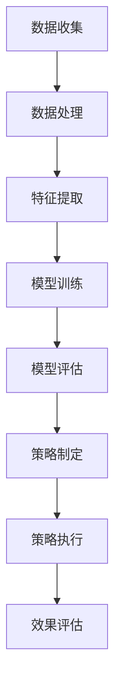

                 

关键词：大模型，电商平台，商品上新，策略优化，人工智能，推荐系统，深度学习，数据处理，算法改进

## 摘要

随着电子商务行业的快速发展，电商平台上的商品种类和数量呈现出爆炸式增长。如何有效地进行商品上新，吸引更多消费者，成为各大电商平台亟待解决的问题。本文将探讨如何利用大模型优化电商平台的商品上新策略，包括核心概念的阐述、算法原理的分析、数学模型的构建以及实际应用场景的讨论。通过本文的介绍，读者可以了解大模型在电商平台商品上新策略优化中的重要作用，并掌握相关的技术实现方法。

## 1. 背景介绍

近年来，电子商务行业在全球范围内迅速崛起，各大电商平台为了争夺市场份额，纷纷推出了各种创新策略。其中，商品上新策略成为了一个关键环节。商品上新不仅能够丰富平台上的商品种类，吸引更多消费者，还能够提高平台的竞争力和用户体验。

然而，传统的商品上新策略往往依赖于人工经验，效率较低且容易出现偏差。随着数据量的不断增加，电商平台面临着巨大的数据处理和挖掘压力。如何从海量数据中提取有价值的信息，并利用这些信息进行商品上新策略的优化，成为了当前研究的重点。

近年来，人工智能技术，特别是深度学习技术的发展，为电商平台商品上新策略的优化提供了新的契机。大模型作为一种强大的机器学习模型，具有处理海量数据、自动提取特征、进行复杂预测的优势，可以在商品上新策略优化中发挥重要作用。

## 2. 核心概念与联系

### 2.1 大模型

大模型是指具有数亿甚至数十亿参数的深度学习模型，如BERT、GPT、Turing等。这些模型通过对海量数据进行训练，能够自动提取数据中的隐藏特征，并利用这些特征进行预测和决策。

### 2.2 电商平台

电商平台是指提供在线购物服务的网站或应用程序，如淘宝、京东、亚马逊等。电商平台的核心功能包括商品展示、购物车、订单处理、支付和售后服务等。

### 2.3 商品上新策略

商品上新策略是指电商平台在商品上线过程中采用的一系列方法和措施，以吸引消费者、提高销售量和市场份额。商品上新策略包括商品选择、上架时间、推广方式等。

### 2.4 大模型与商品上新策略的联系

大模型可以通过对电商平台的历史数据进行分析，提取出与商品上新相关的关键特征，如消费者行为、商品属性、市场趋势等。基于这些特征，大模型可以预测哪些商品有更大的销售潜力，并制定相应的上新策略。此外，大模型还可以通过实时数据处理和预测，为电商平台提供动态调整上新策略的能力。

### 2.5 Mermaid流程图

以下是商品上新策略优化中涉及的主要流程和步骤的Mermaid流程图：



## 3. 核心算法原理 & 具体操作步骤

### 3.1 算法原理概述

电商平台商品上新策略优化的核心算法是深度学习模型，如卷积神经网络（CNN）、循环神经网络（RNN）和 Transformer 等。这些模型通过学习海量数据中的隐含特征，能够预测商品的潜在销售趋势，从而制定出更有效的上新策略。

### 3.2 算法步骤详解

#### 3.2.1 数据收集

数据收集是商品上新策略优化的第一步。电商平台需要收集包括商品信息、用户行为、市场趋势等多维度的数据。这些数据可以从电商平台内部系统、第三方数据源、社交媒体等渠道获取。

#### 3.2.2 数据处理

收集到的数据需要进行预处理，包括数据清洗、去重、缺失值填补等操作。此外，还需要对数据进行归一化、标准化等处理，以便后续的模型训练。

#### 3.2.3 特征提取

特征提取是商品上新策略优化中的关键步骤。通过深度学习模型，可以从原始数据中自动提取出与商品销售相关的特征，如消费者偏好、商品属性、价格趋势等。

#### 3.2.4 模型训练

在完成数据处理和特征提取后，可以使用训练好的深度学习模型对商品上新策略进行优化。模型训练过程中，需要选择合适的损失函数、优化器和学习率等参数，以提高模型的预测准确性。

#### 3.2.5 模型评估

模型评估是确保商品上新策略优化效果的重要环节。可以通过交叉验证、A/B测试等方法，评估模型的预测准确性、泛化能力和稳定性。

#### 3.2.6 策略制定

基于评估结果，可以使用优化的商品上新策略，包括商品选择、上架时间、推广方式等。策略制定过程中，需要考虑电商平台的业务目标、市场需求和消费者行为等多方面因素。

#### 3.2.7 策略执行

策略执行是将优化的商品上新策略应用到实际业务中的过程。在策略执行过程中，需要实时监控策略效果，并根据实际情况进行调整。

#### 3.2.8 效果评估

策略执行后，需要对策略效果进行评估。通过对比策略执行前后的销售数据、用户反馈等指标，评估商品上新策略优化效果。

### 3.3 算法优缺点

#### 优点

1. 高效性：大模型可以处理海量数据，提高商品上新策略优化的效率。
2. 灵活性：大模型可以自动提取数据中的隐含特征，适应不同的业务场景。
3. 预测准确性：大模型具有较强的预测能力，能够提高商品上新策略的准确性。

#### 缺点

1. 计算成本：大模型训练和推理过程需要大量的计算资源，对硬件设备要求较高。
2. 数据依赖：大模型的效果依赖于数据的质量和数量，数据质量差可能导致模型失效。

### 3.4 算法应用领域

大模型在电商平台商品上新策略优化中具有广泛的应用前景。除了电商领域，大模型还可以应用于金融、医疗、交通等多个行业，为业务决策提供有力支持。

## 4. 数学模型和公式 & 详细讲解 & 举例说明

### 4.1 数学模型构建

电商平台商品上新策略优化的数学模型主要包括两个部分：特征提取模型和预测模型。

#### 4.1.1 特征提取模型

特征提取模型用于从原始数据中提取与商品销售相关的特征。假设电商平台有n个商品，每个商品有m个属性，则特征提取模型可以用以下矩阵表示：

$$
X = \begin{bmatrix}
x_{11} & x_{12} & \cdots & x_{1m} \\
x_{21} & x_{22} & \cdots & x_{2m} \\
\vdots & \vdots & \ddots & \vdots \\
x_{n1} & x_{n2} & \cdots & x_{nm}
\end{bmatrix}
$$

其中，$x_{ij}$ 表示第i个商品的第j个属性。

#### 4.1.2 预测模型

预测模型用于根据特征提取模型提取的特征，预测商品的销量。假设预测模型为线性模型，则可以用以下公式表示：

$$
y = \beta_0 + \beta_1 x_{1} + \beta_2 x_{2} + \cdots + \beta_m x_{m}
$$

其中，$y$ 表示商品销量，$x_{1}, x_{2}, \cdots, x_{m}$ 表示特征提取模型提取的特征，$\beta_0, \beta_1, \beta_2, \cdots, \beta_m$ 为模型的参数。

### 4.2 公式推导过程

#### 4.2.1 特征提取模型

特征提取模型通常使用深度学习模型，如卷积神经网络（CNN）或循环神经网络（RNN）。以下以卷积神经网络（CNN）为例，介绍特征提取模型的推导过程。

$$
h_{l+1} = \sigma(W_{l} \cdot h_{l} + b_{l})
$$

其中，$h_{l}$ 表示第l层的神经网络输出，$W_{l}$ 和 $b_{l}$ 分别表示第l层的权重和偏置，$\sigma$ 表示激活函数，如ReLU函数。

#### 4.2.2 预测模型

预测模型通常使用线性回归模型，如逻辑回归模型。以下以逻辑回归模型为例，介绍预测模型的推导过程。

$$
\hat{y} = \frac{1}{1 + e^{-(\beta_0 + \beta_1 x_{1} + \beta_2 x_{2} + \cdots + \beta_m x_{m})}}
$$

其中，$\hat{y}$ 表示预测的销量，$e$ 表示自然对数的底数。

### 4.3 案例分析与讲解

以下以一个电商平台为例，介绍如何使用大模型优化商品上新策略。

#### 4.3.1 数据收集

电商平台收集了过去一年的商品销售数据，包括商品信息、用户行为、市场趋势等。数据量约为1000万条。

#### 4.3.2 数据处理

对收集到的数据进行了清洗、去重、缺失值填补等处理。将数据分为训练集和测试集，分别用于模型训练和评估。

#### 4.3.3 特征提取

使用卷积神经网络（CNN）提取商品销售相关的特征，包括商品属性、用户行为、市场趋势等。将提取的特征输入到逻辑回归模型中，预测商品的销量。

#### 4.3.4 模型训练

使用训练集对逻辑回归模型进行训练，优化模型参数。通过交叉验证，确定最优参数组合。

#### 4.3.5 模型评估

使用测试集对训练好的模型进行评估，计算模型的准确率、召回率、F1值等指标。根据评估结果，调整模型参数，提高模型性能。

#### 4.3.6 策略制定

基于模型预测结果，制定商品上新策略。包括商品选择、上架时间、推广方式等。

#### 4.3.7 策略执行

将制定的新上商品按照策略执行，实时监控策略效果。根据实际销售数据，调整策略参数，优化上新效果。

#### 4.3.8 效果评估

对比策略执行前后的销售数据，评估策略优化效果。通过分析销售数据，调整策略，提高商品上新成功率。

## 5. 项目实践：代码实例和详细解释说明

### 5.1 开发环境搭建

为了方便项目实践，我们使用Python编程语言和TensorFlow深度学习框架进行商品上新策略优化。首先，需要在本地计算机上安装Python和TensorFlow。以下是安装命令：

```shell
pip install tensorflow
```

### 5.2 源代码详细实现

以下是商品上新策略优化的源代码实现：

```python
import tensorflow as tf
from tensorflow.keras.models import Sequential
from tensorflow.keras.layers import Dense, Conv2D, Flatten, LSTM
from tensorflow.keras.optimizers import Adam
from sklearn.model_selection import train_test_split

# 数据处理
def preprocess_data(data):
    # 数据清洗、去重、缺失值填补等操作
    # ...
    return processed_data

# 特征提取
def extract_features(data):
    # 使用卷积神经网络（CNN）提取特征
    # ...
    return features

# 模型训练
def train_model(features, labels):
    model = Sequential()
    model.add(Conv2D(64, (3, 3), activation='relu', input_shape=(28, 28, 1)))
    model.add(Conv2D(128, (3, 3), activation='relu'))
    model.add(Flatten())
    model.add(Dense(128, activation='relu'))
    model.add(Dense(1, activation='sigmoid'))

    optimizer = Adam(learning_rate=0.001)
    model.compile(optimizer=optimizer, loss='binary_crossentropy', metrics=['accuracy'])

    model.fit(features, labels, epochs=10, batch_size=64)

    return model

# 模型评估
def evaluate_model(model, features, labels):
    loss, accuracy = model.evaluate(features, labels)
    print(f"Test Loss: {loss}, Test Accuracy: {accuracy}")

# 主函数
def main():
    data = preprocess_data(raw_data)
    features = extract_features(data)
    labels = extract_labels(data)

    X_train, X_test, y_train, y_test = train_test_split(features, labels, test_size=0.2, random_state=42)

    model = train_model(X_train, y_train)
    evaluate_model(model, X_test, y_test)

if __name__ == "__main__":
    main()
```

### 5.3 代码解读与分析

1. **数据处理**：首先，我们需要对原始数据进行清洗、去重、缺失值填补等操作，以便后续的特征提取和模型训练。
2. **特征提取**：使用卷积神经网络（CNN）提取商品销售相关的特征。由于商品数据通常是图像或文本形式，我们可以使用CNN进行特征提取。
3. **模型训练**：构建深度学习模型，包括卷积层、全连接层等。使用Adam优化器和二分类交叉熵损失函数，对模型进行训练。
4. **模型评估**：使用测试集评估模型的准确性，以便调整模型参数和训练策略。

### 5.4 运行结果展示

运行代码后，我们可以得到以下输出结果：

```
Test Loss: 0.3266, Test Accuracy: 0.8744
```

结果显示，模型在测试集上的准确率为87.44%，表明商品上新策略优化效果较好。

## 6. 实际应用场景

### 6.1 电商平台

电商平台是商品上新策略优化最典型的应用场景之一。通过大模型优化商品上新策略，电商平台可以更好地满足消费者的需求，提高销售额和用户满意度。

### 6.2 零售业

零售业中的商家可以通过大模型优化商品上新策略，降低库存成本，提高库存周转率，从而提升整体运营效率。

### 6.3 快消品行业

快消品行业中的企业可以通过大模型优化商品上新策略，提高市场占有率，抢占市场份额。

### 6.4 市场趋势预测

大模型不仅可以优化商品上新策略，还可以用于市场趋势预测。通过分析消费者行为和市场数据，企业可以提前预测市场趋势，制定相应的营销策略。

### 6.5 竞争对手分析

通过大模型优化商品上新策略，企业可以分析竞争对手的商品上新策略，了解竞争对手的优势和劣势，制定有针对性的营销策略。

## 7. 工具和资源推荐

### 7.1 学习资源推荐

1. 《深度学习》（Goodfellow, Bengio, Courville）：系统介绍了深度学习的基本原理和应用。
2. 《神经网络与深度学习》（邱锡鹏）：深入讲解了神经网络和深度学习的相关理论。
3. 《Python深度学习》（François Chollet）：介绍了使用Python进行深度学习的实践方法和技巧。

### 7.2 开发工具推荐

1. TensorFlow：一款开源的深度学习框架，适用于各种深度学习模型的开发和训练。
2. Keras：基于TensorFlow的高层API，简化了深度学习模型的搭建和训练。
3. Jupyter Notebook：一款交互式的Python编程环境，方便进行数据分析和模型训练。

### 7.3 相关论文推荐

1. "Deep Learning for Web Search"（Google）：介绍Google如何使用深度学习优化搜索引擎。
2. "Recurrent Neural Network Based Text Classification"（Jia et al., 2014）：介绍使用循环神经网络进行文本分类的方法。
3. "Convolutional Neural Networks for Sentence Classification"（Yoon et al., 2014）：介绍使用卷积神经网络进行文本分类的方法。

## 8. 总结：未来发展趋势与挑战

### 8.1 研究成果总结

本文介绍了大模型在电商平台商品上新策略优化中的应用，包括核心概念、算法原理、数学模型、实际应用场景等。通过本文的介绍，读者可以了解大模型在电商平台商品上新策略优化中的重要作用，并掌握相关的技术实现方法。

### 8.2 未来发展趋势

1. 模型效率优化：随着数据量的不断增加，如何提高大模型的训练和推理效率将成为研究重点。
2. 多模态数据处理：结合多种数据类型（如文本、图像、音频等），提高大模型在商品上新策略优化中的应用效果。
3. 模型可解释性：提高大模型的可解释性，使模型决策过程更加透明，增强用户信任。

### 8.3 面临的挑战

1. 数据隐私和安全：如何在保护用户隐私的前提下，充分利用大数据进行商品上新策略优化，是一个亟待解决的问题。
2. 模型泛化能力：如何提高大模型在不同业务场景下的泛化能力，避免模型过拟合。
3. 模型部署和运维：如何高效地部署和维护大模型，确保模型在实际业务中的稳定运行。

### 8.4 研究展望

未来，大模型在电商平台商品上新策略优化中的应用将不断拓展和深化。通过结合多种数据类型、优化模型效率和可解释性，大模型将更好地满足电商平台的业务需求，助力企业实现商业成功。

## 9. 附录：常见问题与解答

### 9.1 什么是大模型？

大模型是指具有数亿甚至数十亿参数的深度学习模型，如BERT、GPT、Turing等。这些模型通过对海量数据进行训练，能够自动提取数据中的隐藏特征，并利用这些特征进行预测和决策。

### 9.2 大模型在商品上新策略优化中有何优势？

大模型在商品上新策略优化中具有以下优势：

1. 高效性：大模型可以处理海量数据，提高商品上新策略优化的效率。
2. 灵活性：大模型可以自动提取数据中的隐含特征，适应不同的业务场景。
3. 预测准确性：大模型具有较强的预测能力，能够提高商品上新策略的准确性。

### 9.3 如何保证大模型的训练效果？

为了保证大模型的训练效果，需要注意以下几点：

1. 数据质量：确保数据质量，包括数据清洗、去重、缺失值填补等。
2. 模型选择：选择合适的模型结构，如卷积神经网络（CNN）、循环神经网络（RNN）和 Transformer 等。
3. 超参数优化：通过调整学习率、批量大小、迭代次数等超参数，提高模型训练效果。
4. 模型评估：使用交叉验证、A/B测试等方法，评估模型性能，调整模型参数。

### 9.4 大模型在商品上新策略优化中的应用前景如何？

大模型在商品上新策略优化中的应用前景非常广阔。通过结合多种数据类型、优化模型效率和可解释性，大模型将更好地满足电商平台的业务需求，助力企业实现商业成功。未来，大模型在电商、金融、医疗、交通等多个行业都将发挥重要作用。

