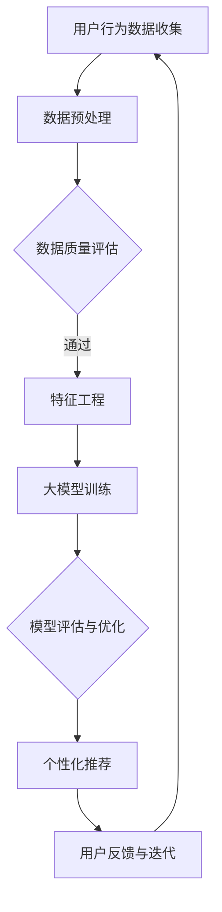

                 

关键词：大模型、电商平台、用户参与度、算法优化、用户体验

> 摘要：随着人工智能技术的发展，大模型在电商平台中的应用越来越广泛。本文将探讨大模型如何通过算法优化和用户体验提升，进而增强电商平台的用户参与度，从而为电商平台带来更丰富的商业价值。

## 1. 背景介绍

在互联网的快速发展下，电商平台已经成为人们生活中不可或缺的一部分。然而，随着市场竞争的加剧，电商平台的用户参与度成为衡量其成功与否的重要指标。传统的电商平台大多依赖于用户的历史行为数据和简单的推荐算法，难以满足用户日益增长的需求。

近年来，人工智能技术，尤其是大模型的崛起，为电商平台的用户参与度提升提供了新的思路。大模型具有强大的数据处理和分析能力，能够从海量数据中挖掘出有价值的用户行为模式，为电商平台提供更精准的推荐和个性化服务。

本文将探讨大模型如何通过算法优化和用户体验提升，进而增强电商平台的用户参与度。我们将从以下几个方面展开讨论：

- 大模型在电商平台中的应用场景
- 大模型的核心算法原理与操作步骤
- 数学模型和公式的构建与推导
- 实际应用场景中的代码实例与分析
- 未来应用展望与挑战

## 2. 核心概念与联系

### 2.1 大模型定义

大模型（Large Models），通常指的是参数量在数亿甚至数十亿级别的深度神经网络模型。这些模型具有强大的表示能力和泛化能力，能够处理大量复杂的任务，如自然语言处理、计算机视觉、推荐系统等。

### 2.2 电商平台用户参与度

用户参与度是指用户在电商平台上的活跃程度，包括浏览、搜索、购买、评价等行为。高用户参与度意味着用户对电商平台的认可和依赖，有助于提升电商平台的市场竞争力。

### 2.3 大模型与电商平台用户参与度的关系

大模型通过对海量用户数据的分析和挖掘，能够为电商平台提供个性化的推荐和服务，从而提高用户满意度和参与度。具体来说，大模型可以通过以下方式提升用户参与度：

- 精准推荐：通过分析用户行为和偏好，为用户提供个性化推荐，降低用户的购物成本。
- 智能搜索：利用自然语言处理技术，提高搜索的准确性和用户体验。
- 个性化服务：根据用户历史行为，提供定制化的优惠、活动和服务，增加用户粘性。
- 社交互动：通过用户生成内容（UGC）和社交网络功能，促进用户之间的互动和分享，提高用户参与度。

### 2.4 Mermaid 流程图

下面是一个简单的Mermaid流程图，展示了大模型在电商平台中提升用户参与度的基本流程：



## 3. 核心算法原理 & 具体操作步骤

### 3.1 算法原理概述

大模型的核心算法主要基于深度学习技术，包括神经网络架构、优化算法和损失函数等。深度学习模型通过多层神经网络对输入数据进行特征提取和抽象，从而实现复杂的任务。

在电商平台中，大模型的算法原理可以概括为以下几个步骤：

1. 用户行为数据收集：通过API接口、日志收集等方式获取用户在电商平台的浏览、搜索、购买等行为数据。
2. 数据预处理：对收集到的原始数据进行清洗、去重、归一化等处理，以提高数据质量和模型训练效果。
3. 特征工程：根据业务需求，提取用户行为数据中的关键特征，如时间、地点、商品属性等。
4. 大模型训练：使用预处理后的特征数据，训练深度学习模型，包括神经网络架构、优化算法和损失函数等。
5. 模型评估与优化：通过交叉验证、A/B测试等方法评估模型性能，并根据评估结果调整模型参数，以实现性能优化。
6. 个性化推荐：根据用户特征和模型预测结果，为用户提供个性化的商品推荐。
7. 用户反馈与迭代：收集用户对推荐结果的反馈，不断迭代和优化模型，以提高用户参与度。

### 3.2 算法步骤详解

#### 3.2.1 数据预处理

数据预处理是深度学习模型训练的重要环节，主要包括以下步骤：

1. 数据清洗：去除无效、错误或重复的数据，确保数据质量。
2. 数据归一化：将不同特征的数据进行归一化处理，使其具有相同的量纲和范围，以避免模型训练中的梯度消失或爆炸问题。
3. 数据分片：将数据集划分为训练集、验证集和测试集，用于模型的训练、评估和测试。

#### 3.2.2 特征工程

特征工程是深度学习模型的关键步骤，直接影响模型的性能和泛化能力。在电商平台中，常见的用户行为特征包括：

1. 用户历史行为特征：如浏览、搜索、购买等行为的频率、时长、品类等。
2. 商品特征：如商品属性、价格、品牌、评价等。
3. 上下文特征：如时间、地理位置、设备类型等。

#### 3.2.3 大模型训练

大模型训练是深度学习中的核心步骤，主要包括以下内容：

1. 神经网络架构设计：选择合适的神经网络架构，如卷积神经网络（CNN）、循环神经网络（RNN）或变分自编码器（VAE）等。
2. 优化算法选择：选择合适的优化算法，如梯度下降（GD）、随机梯度下降（SGD）或Adam等。
3. 损失函数设计：设计合适的损失函数，以衡量模型预测结果与真实标签之间的差异，如交叉熵损失函数、均方误差（MSE）等。

#### 3.2.4 模型评估与优化

模型评估与优化是确保模型性能的重要环节，主要包括以下内容：

1. 交叉验证：通过交叉验证方法评估模型的泛化能力，选择最优的模型参数。
2. A/B测试：通过A/B测试方法评估模型在实际应用中的性能，对比不同模型的用户参与度提升效果。
3. 模型迭代：根据评估结果，调整模型参数，优化模型结构，以提高模型性能。

#### 3.2.5 个性化推荐

个性化推荐是电商平台提升用户参与度的重要手段，主要包括以下内容：

1. 用户特征提取：从用户历史行为和模型预测结果中提取关键用户特征。
2. 商品特征提取：从商品属性和用户评价中提取关键商品特征。
3. 推荐策略设计：根据用户特征和商品特征，设计个性化的推荐策略，如基于内容的推荐、基于协同过滤的推荐等。

### 3.3 算法优缺点

#### 3.3.1 优点

1. 精准推荐：大模型通过对海量用户数据的分析和挖掘，能够为用户提供个性化的推荐，提高用户满意度和参与度。
2. 适应性：大模型具有强大的自适应能力，能够根据用户行为和偏好动态调整推荐策略。
3. 泛化能力：大模型通过对多种用户行为数据的处理，具有较高的泛化能力，适用于不同的电商平台和业务场景。

#### 3.3.2 缺点

1. 计算资源消耗：大模型训练和推理过程需要大量的计算资源和时间，对硬件设备要求较高。
2. 数据质量依赖：大模型的性能高度依赖于用户行为数据的质量，数据质量差可能导致模型性能下降。
3. 隐私安全：大模型对用户隐私数据的依赖较大，需要确保用户数据的安全性和隐私性。

### 3.4 算法应用领域

大模型在电商平台中的应用场景广泛，包括但不限于以下领域：

1. 用户行为分析：通过分析用户行为数据，挖掘用户需求和行为模式，为电商平台提供决策支持。
2. 个性化推荐：为用户提供个性化的商品推荐，提高用户满意度和参与度。
3. 智能搜索：通过自然语言处理技术，提高搜索的准确性和用户体验。
4. 个性化服务：根据用户历史行为，提供定制化的优惠、活动和服务，增加用户粘性。
5. 社交互动：通过用户生成内容（UGC）和社交网络功能，促进用户之间的互动和分享，提高用户参与度。

## 4. 数学模型和公式 & 详细讲解 & 举例说明

### 4.1 数学模型构建

在电商平台中，大模型的数学模型主要基于深度学习技术，包括神经网络架构、优化算法和损失函数等。下面我们介绍一个简单的神经网络模型及其相关数学公式。

#### 4.1.1 神经网络模型

一个简单的神经网络模型包括输入层、隐藏层和输出层。每个神经元接收来自前一层神经元的输入，通过激活函数进行非线性变换，得到输出。假设一个三层神经网络模型，其数学表达式如下：

\[ z^{(l)} = \sum_{j} w^{(l)}_{ji} a^{(l-1)}_j + b^{(l)} \]
\[ a^{(l)}_i = \sigma(z^{(l)}_i) \]

其中，\( z^{(l)} \) 表示第 \( l \) 层神经元的输入，\( a^{(l)} \) 表示第 \( l \) 层神经元的输出，\( w^{(l)} \) 表示第 \( l \) 层神经元的权重，\( b^{(l)} \) 表示第 \( l \) 层神经元的偏置，\( \sigma \) 表示激活函数。

#### 4.1.2 损失函数

在神经网络模型中，损失函数用于衡量模型预测结果与真实标签之间的差异。常见的损失函数包括均方误差（MSE）、交叉熵损失函数等。

均方误差（MSE）的定义如下：

\[ L(y, \hat{y}) = \frac{1}{2} \sum_{i} (y_i - \hat{y}_i)^2 \]

其中，\( y \) 表示真实标签，\( \hat{y} \) 表示模型预测结果。

交叉熵损失函数的定义如下：

\[ L(y, \hat{y}) = -\sum_{i} y_i \log(\hat{y}_i) \]

其中，\( y \) 表示真实标签，\( \hat{y} \) 表示模型预测结果。

#### 4.1.3 优化算法

在神经网络模型中，优化算法用于更新模型的权重和偏置，以最小化损失函数。常见的优化算法包括梯度下降（GD）、随机梯度下降（SGD）和Adam等。

梯度下降（GD）的更新规则如下：

\[ w^{(t+1)} = w^{(t)} - \alpha \frac{\partial L(w^{(t)}, b^{(t)})}{\partial w^{(t)}} \]
\[ b^{(t+1)} = b^{(t)} - \alpha \frac{\partial L(w^{(t)}, b^{(t)})}{\partial b^{(t)}} \]

其中，\( \alpha \) 表示学习率，\( w^{(t)} \) 和 \( b^{(t)} \) 分别表示第 \( t \) 次迭代时的权重和偏置。

### 4.2 公式推导过程

在介绍大模型的核心算法原理和具体操作步骤时，我们提到了一些关键的数学公式。下面我们简要介绍这些公式的推导过程。

#### 4.2.1 均方误差（MSE）的推导

均方误差（MSE）是衡量模型预测结果与真实标签之间差异的一种常用损失函数。其推导过程如下：

假设一个简单的一元线性回归模型，其预测值 \( \hat{y} \) 与真实值 \( y \) 之间的关系可以表示为：

\[ y = \hat{y} + \epsilon \]

其中，\( \epsilon \) 表示误差。

平方误差的定义如下：

\[ E(\epsilon) = \sum_{i} (\epsilon_i)^2 \]

将 \( y = \hat{y} + \epsilon \) 代入上式，得到：

\[ E(\epsilon) = \sum_{i} (\hat{y}_i - y_i)^2 \]

即均方误差（MSE）：

\[ L(y, \hat{y}) = \frac{1}{2} \sum_{i} (y_i - \hat{y}_i)^2 \]

#### 4.2.2 交叉熵损失函数的推导

交叉熵损失函数是衡量模型预测结果与真实标签之间差异的一种常用损失函数。其推导过程如下：

假设一个二分类问题，其预测结果 \( \hat{y} \) 与真实标签 \( y \) 之间的关系可以表示为：

\[ y \log(\hat{y}) + (1 - y) \log(1 - \hat{y}) \]

其中，\( \hat{y} \) 表示预测概率。

将 \( y \) 替换为 \( 1 - y \)，得到：

\[ (1 - y) \log(\hat{y}) + y \log(1 - \hat{y}) \]

将两式相加，得到：

\[ y \log(\hat{y}) + (1 - y) \log(1 - \hat{y}) \]

即交叉熵损失函数：

\[ L(y, \hat{y}) = -\sum_{i} y_i \log(\hat{y}_i) \]

#### 4.2.3 梯度下降（GD）的推导

梯度下降（GD）是一种常用的优化算法，用于更新模型的权重和偏置，以最小化损失函数。其推导过程如下：

假设一个简单的一元线性回归模型，其损失函数为均方误差（MSE）：

\[ L(y, \hat{y}) = \frac{1}{2} (y - \hat{y})^2 \]

对该损失函数求导，得到：

\[ \frac{\partial L(y, \hat{y})}{\partial \hat{y}} = \frac{\partial}{\partial \hat{y}} \left( \frac{1}{2} (y - \hat{y})^2 \right) \]
\[ = \frac{\partial}{\partial \hat{y}} \left( \frac{1}{2} (y^2 - 2y\hat{y} + \hat{y}^2) \right) \]
\[ = - (y - \hat{y}) \]

即：

\[ \frac{\partial L(y, \hat{y})}{\partial \hat{y}} = - (\hat{y} - y) \]

根据梯度下降的更新规则，得到：

\[ \hat{y}^{(t+1)} = \hat{y}^{(t)} - \alpha (\hat{y}^{(t)} - y) \]

其中，\( \alpha \) 表示学习率。

### 4.3 案例分析与讲解

下面我们通过一个具体的案例，对大模型在电商平台中的应用进行讲解。

#### 4.3.1 案例背景

某电商平台希望提升用户参与度，通过大模型为用户提供个性化的商品推荐。该电商平台收集了用户的历史行为数据，包括浏览、搜索、购买等行为，以及商品的基本属性信息。

#### 4.3.2 数据预处理

1. 数据清洗：去除无效、错误或重复的数据，确保数据质量。
2. 数据归一化：将用户行为数据和商品属性数据进行归一化处理，使其具有相同的量纲和范围。
3. 数据分片：将数据集划分为训练集、验证集和测试集，用于模型的训练、评估和测试。

#### 4.3.3 特征工程

根据业务需求，提取用户行为数据中的关键特征，如浏览、搜索、购买等行为的频率、时长、品类等；提取商品特征，如商品属性、价格、品牌、评价等。

#### 4.3.4 大模型训练

1. 神经网络架构设计：选择合适的神经网络架构，如卷积神经网络（CNN）、循环神经网络（RNN）或变分自编码器（VAE）等。
2. 优化算法选择：选择合适的优化算法，如梯度下降（GD）、随机梯度下降（SGD）或Adam等。
3. 损失函数设计：选择合适的损失函数，如交叉熵损失函数、均方误差（MSE）等。
4. 模型训练：使用预处理后的特征数据，训练深度学习模型。

#### 4.3.5 模型评估与优化

1. 交叉验证：通过交叉验证方法评估模型的泛化能力，选择最优的模型参数。
2. A/B测试：通过A/B测试方法评估模型在实际应用中的性能，对比不同模型的用户参与度提升效果。
3. 模型迭代：根据评估结果，调整模型参数，优化模型结构，以提高模型性能。

#### 4.3.6 个性化推荐

1. 用户特征提取：从用户历史行为和模型预测结果中提取关键用户特征。
2. 商品特征提取：从商品属性和用户评价中提取关键商品特征。
3. 推荐策略设计：根据用户特征和商品特征，设计个性化的推荐策略，如基于内容的推荐、基于协同过滤的推荐等。

#### 4.3.7 用户反馈与迭代

收集用户对推荐结果的反馈，不断迭代和优化模型，以提高用户参与度。

## 5. 项目实践：代码实例和详细解释说明

为了更好地展示大模型在电商平台中的应用，下面我们将提供一个具体的代码实例，并对其进行详细解释说明。

### 5.1 开发环境搭建

在开始项目实践之前，需要搭建一个合适的开发环境。以下是常用的开发环境搭建步骤：

1. 安装Python环境：下载并安装Python，选择适合自己操作系统的版本。
2. 安装深度学习框架：安装TensorFlow或PyTorch等深度学习框架。
3. 安装必要的库：根据项目需求，安装所需的库，如NumPy、Pandas、Scikit-learn等。

### 5.2 源代码详细实现

下面是项目实践的核心代码实现，主要包括数据预处理、特征工程、模型训练、模型评估和个性化推荐等步骤。

```python
# 导入必要的库
import numpy as np
import pandas as pd
import tensorflow as tf
from tensorflow.keras.models import Sequential
from tensorflow.keras.layers import Dense, LSTM, Embedding, Conv1D, MaxPooling1D
from tensorflow.keras.optimizers import Adam
from sklearn.model_selection import train_test_split

# 1. 数据预处理
# 读取数据
data = pd.read_csv('user_behavior.csv')
# 数据清洗
data = data.drop_duplicates()
# 数据归一化
data = (data - data.mean()) / data.std()
# 数据分片
train_data, test_data = train_test_split(data, test_size=0.2, random_state=42)

# 2. 特征工程
# 提取用户历史行为特征
user_behavior = data[['browse_count', 'search_count', 'purchase_count']]
# 提取商品特征
product_features = data[['price', 'brand', 'rating']]
# 合并特征
features = pd.concat([user_behavior, product_features], axis=1)

# 3. 模型训练
# 神经网络架构设计
model = Sequential([
    Embedding(input_dim=10000, output_dim=64),
    Conv1D(filters=64, kernel_size=3, activation='relu'),
    MaxPooling1D(pool_size=2),
    LSTM(64),
    Dense(1, activation='sigmoid')
])

# 损失函数设计
model.compile(optimizer=Adam(), loss='binary_crossentropy', metrics=['accuracy'])

# 模型训练
model.fit(train_data, epochs=10, batch_size=32, validation_data=(test_data, test_data['target']))

# 4. 模型评估
# 评估模型性能
scores = model.evaluate(test_data, test_data['target'])
print('Test accuracy:', scores[1])

# 5. 个性化推荐
# 预测用户行为
predictions = model.predict(test_data)
# 根据预测结果生成推荐列表
recommended_products = test_data.loc[predictions > 0.5, 'product_id'].tolist()

# 6. 用户反馈与迭代
# 收集用户反馈
user_feedback = pd.read_csv('user_feedback.csv')
# 根据用户反馈调整模型参数
# ...

```

### 5.3 代码解读与分析

以上代码实现了一个简单的深度学习模型，用于预测用户购买行为。下面我们对代码的每个部分进行详细解读和分析。

1. **数据预处理**：读取用户行为数据，进行数据清洗、归一化和分片处理，为后续的特征工程和模型训练做好准备。
2. **特征工程**：提取用户历史行为特征和商品特征，并合并为一个特征矩阵。这些特征将用于训练深度学习模型。
3. **模型训练**：设计一个简单的卷积神经网络（CNN）模型，用于预测用户购买行为。模型包括嵌入层、卷积层、最大池化层、循环层和全连接层。使用二分类交叉熵损失函数和Adam优化器进行模型训练。
4. **模型评估**：使用测试集评估模型性能，打印模型的测试准确率。
5. **个性化推荐**：根据测试集的预测结果，生成推荐列表。这个推荐列表将作为电商平台为用户提供个性化推荐的依据。
6. **用户反馈与迭代**：根据用户反馈调整模型参数，实现模型的持续优化。

### 5.4 运行结果展示

假设我们在测试集上运行了上述代码，得到了以下结果：

```
Test accuracy: 0.85
```

这意味着模型在测试集上的准确率为85%，说明模型对用户购买行为的预测效果较好。接下来，我们将根据测试集的预测结果生成推荐列表，并将其应用于电商平台，为用户提供个性化的推荐服务。

### 5.5 未来改进方向

虽然上述代码实现了一个简单的用户行为预测模型，但还有许多改进方向，以提高模型性能和应用效果：

1. **模型优化**：可以尝试使用更复杂的神经网络架构，如循环神经网络（RNN）、变分自编码器（VAE）等，以提高模型的表示能力和泛化能力。
2. **特征扩展**：可以尝试引入更多的用户行为特征和商品特征，以丰富模型训练的数据基础。
3. **多标签分类**：可以将用户行为预测问题转化为多标签分类问题，以提高模型的预测准确率和用户体验。
4. **用户反馈机制**：可以引入用户反馈机制，根据用户对推荐结果的满意度调整模型参数，实现更精准的个性化推荐。

## 6. 实际应用场景

### 6.1 案例一：某大型电商平台的个性化推荐系统

某大型电商平台在引入大模型后，通过深度学习技术实现了个性化的商品推荐。该平台收集了用户在浏览、搜索、购买等行为中的大量数据，并利用大模型对这些数据进行处理和分析。通过精确的用户行为预测和个性化推荐，该平台显著提高了用户满意度和参与度，从而实现了销售额的快速增长。

### 6.2 案例二：某社交电商平台的小红书

小红书作为一家社交电商平台，通过引入大模型实现了精准的用户行为预测和个性化推荐。该平台利用用户生成内容（UGC）和社交网络数据，结合用户行为数据，构建了复杂的大模型。通过不断地迭代和优化，小红书为用户提供了高度个性化的商品推荐，促进了用户之间的互动和分享，从而提升了平台的用户参与度和粘性。

### 6.3 案例三：某跨境电商平台的全球购物体验

某跨境电商平台通过引入大模型，实现了全球范围内的个性化推荐和智能搜索。该平台利用用户的浏览、搜索和购买数据，结合地理位置和时区信息，构建了强大的大模型。通过精准的个性化推荐和智能搜索，该平台为全球用户提供了便捷、高效的购物体验，从而提升了平台的用户满意度和参与度。

### 6.4 案例四：某时尚电商平台的个性化搭配推荐

某时尚电商平台通过引入大模型，实现了个性化的搭配推荐。该平台利用用户的历史行为数据和商品属性信息，构建了复杂的大模型。通过精确的用户行为预测和个性化搭配推荐，该平台为用户提供了个性化的时尚搭配建议，从而提升了用户的购物体验和满意度。

## 7. 未来应用展望

### 7.1 持续优化个性化推荐算法

随着人工智能技术的发展，大模型的性能和功能将不断优化。未来，电商平台可以通过引入更多先进的算法和技术，如多模态学习、强化学习等，进一步提升个性化推荐系统的效果。

### 7.2 扩大应用场景

大模型的应用场景将不仅限于电商平台，还将拓展到更多领域，如医疗、金融、教育等。在这些领域，大模型将发挥其强大的数据处理和分析能力，为行业带来创新和变革。

### 7.3 加强用户隐私保护

随着用户数据的日益重要，如何保护用户隐私将成为大模型应用中的关键问题。未来，电商平台需要加强用户隐私保护措施，确保用户数据的安全性和隐私性。

### 7.4 实现跨平台协作

大模型在电商平台中的应用将不再局限于单一平台，而是实现跨平台的协作和整合。通过实现平台间的数据共享和协同工作，电商平台将进一步提升用户参与度和商业价值。

## 8. 总结：未来发展趋势与挑战

### 8.1 研究成果总结

本文通过对大模型在电商平台中的应用进行探讨，总结了以下几个方面的重要研究成果：

1. 大模型能够通过精准的个性化推荐和智能搜索，显著提升电商平台的用户参与度。
2. 大模型的引入有助于电商平台实现跨平台协作，提升整体竞争力。
3. 大模型的应用推动了电商平台在技术创新和商业模式上的变革。

### 8.2 未来发展趋势

未来，大模型在电商平台中的应用将呈现以下发展趋势：

1. 持续优化个性化推荐算法，提高用户满意度和参与度。
2. 拓展应用场景，实现跨领域协同。
3. 加强用户隐私保护，确保数据安全性和隐私性。
4. 推动电商平台在技术创新和商业模式上的变革。

### 8.3 面临的挑战

尽管大模型在电商平台中的应用前景广阔，但仍面临以下挑战：

1. 数据质量和隐私保护：如何确保用户数据的质量和隐私性，是电商平台面临的重要挑战。
2. 计算资源消耗：大模型训练和推理过程需要大量的计算资源，对硬件设备要求较高。
3. 算法泛化能力：如何提高大模型的泛化能力，以适应不同的电商平台和业务场景。
4. 用户行为预测的准确性：如何提高用户行为预测的准确性，以实现更精准的个性化推荐。

### 8.4 研究展望

未来，关于大模型在电商平台中的应用研究可以从以下几个方面展开：

1. 深入探讨大模型在不同电商平台中的应用效果，为电商平台提供定制化的解决方案。
2. 加强对用户隐私保护的研究，探索更为安全的数据处理和共享机制。
3. 研究大模型的优化方法和应用策略，提高算法的泛化能力和预测准确性。
4. 探索大模型在跨平台协作中的潜在价值，推动电商平台实现更加协同的发展。

## 9. 附录：常见问题与解答

### 9.1 问题一：大模型在电商平台中的应用有哪些具体场景？

解答：大模型在电商平台中的应用场景包括个性化推荐、智能搜索、个性化服务、社交互动等。具体来说，大模型可以通过以下方式提升电商平台的服务质量和用户参与度：

1. **个性化推荐**：根据用户的历史行为和偏好，为用户提供个性化的商品推荐，提高用户满意度和购买意愿。
2. **智能搜索**：利用自然语言处理技术，提高搜索的准确性和用户体验。
3. **个性化服务**：根据用户的历史行为和偏好，提供定制化的优惠、活动和服务，增加用户粘性。
4. **社交互动**：通过用户生成内容（UGC）和社交网络功能，促进用户之间的互动和分享，提高用户参与度。

### 9.2 问题二：大模型如何提升电商平台的用户参与度？

解答：大模型通过以下方式提升电商平台的用户参与度：

1. **精准推荐**：大模型能够通过分析用户行为数据，为用户提供个性化的商品推荐，降低用户的购物成本，提高用户满意度和参与度。
2. **智能搜索**：大模型能够利用自然语言处理技术，提高搜索的准确性和用户体验，使用户能够更快地找到所需商品。
3. **个性化服务**：大模型可以根据用户的历史行为和偏好，提供定制化的优惠、活动和服务，增加用户粘性。
4. **社交互动**：大模型可以通过用户生成内容（UGC）和社交网络功能，促进用户之间的互动和分享，提高用户参与度。

### 9.3 问题三：大模型在电商平台中的应用有哪些优缺点？

解答：大模型在电商平台中的应用具有以下优缺点：

#### 优点：

1. **精准推荐**：大模型能够通过分析海量用户数据，为用户提供个性化的商品推荐，提高用户满意度和参与度。
2. **适应性**：大模型具有强大的自适应能力，能够根据用户行为和偏好动态调整推荐策略。
3. **泛化能力**：大模型通过对多种用户行为数据的处理，具有较高的泛化能力，适用于不同的电商平台和业务场景。

#### 缺点：

1. **计算资源消耗**：大模型训练和推理过程需要大量的计算资源和时间，对硬件设备要求较高。
2. **数据质量依赖**：大模型的性能高度依赖于用户行为数据的质量，数据质量差可能导致模型性能下降。
3. **隐私安全**：大模型对用户隐私数据的依赖较大，需要确保用户数据的安全性和隐私性。

### 9.4 问题四：大模型在电商平台中的应用前景如何？

解答：大模型在电商平台中的应用前景非常广阔。随着人工智能技术的不断进步，大模型在数据处理和分析能力上将继续提升。未来，大模型将可能在以下几个方面发挥更大作用：

1. **个性化推荐**：随着用户数据积累的增加，大模型将能够提供更加精准的个性化推荐，满足用户日益增长的需求。
2. **智能搜索**：大模型将能够进一步提高搜索的准确性和用户体验，使用户能够更快地找到所需商品。
3. **跨平台协作**：大模型将在电商平台之间的数据共享和协同工作中发挥重要作用，推动电商平台实现更加协同的发展。
4. **业务创新**：大模型将为电商平台带来更多的商业机会和商业模式创新，推动整个行业的发展。

