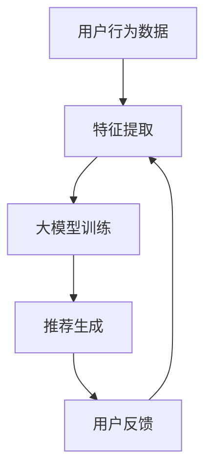

                 

关键词：大模型，推荐系统，公平性，算法，数学模型，项目实践

> 摘要：随着人工智能技术的迅猛发展，大模型在推荐系统中的应用愈发广泛。本文从背景介绍、核心概念与联系、核心算法原理、数学模型与公式、项目实践以及未来应用展望等方面，深入探讨大模型对推荐系统公平性的影响，为相关领域的研究和实践提供有益参考。

## 1. 背景介绍

推荐系统作为一种智能信息检索技术，已被广泛应用于电子商务、社交媒体、在线视频、新闻资讯等多个领域。其核心目标是根据用户的兴趣和行为，为其推荐个性化、相关度高的内容，从而提升用户体验和商业价值。然而，随着推荐系统规模的不断扩大和用户数据的日益丰富，大模型的应用逐渐成为研究热点。

大模型，即大规模深度学习模型，具有极高的参数量和计算复杂度。通过在海量数据上训练，大模型能够捕捉到数据中的复杂模式和潜在规律，从而实现出色的性能。然而，大模型在带来高效推荐的同时，也可能引发一系列公平性问题，如数据偏差、算法歧视等。

本文旨在研究大模型对推荐系统公平性的影响，分析其潜在问题和挑战，并提出相应的解决方案。通过深入探讨大模型与推荐系统的关系，本文旨在为推荐系统领域的公平性研究提供有价值的参考。

## 2. 核心概念与联系

### 2.1 推荐系统的基本概念

推荐系统（Recommender System）是一种基于用户历史行为、兴趣偏好和上下文信息，为用户提供个性化内容推荐的技术。其主要目标是通过分析用户数据，预测用户对未知内容的兴趣，从而为用户推荐其可能感兴趣的内容。

推荐系统的主要组成部分包括：

- 用户（User）：推荐系统的核心，具有不同的兴趣偏好和行为特征。
- 项目（Item）：推荐系统中被推荐的内容，如商品、视频、新闻等。
- 用户-项目交互（User-Item Interaction）：描述用户与项目之间的互动关系，如点击、购买、评分等。

### 2.2 大模型的基本概念

大模型（Large-scale Model）是指具有极高参数量和计算复杂度的深度学习模型。大模型通常通过在海量数据上进行训练，以捕捉数据中的复杂模式和潜在规律。大模型的参数量通常在数十亿到数万亿之间，计算复杂度也相应较高。

### 2.3 大模型与推荐系统的关系

大模型在推荐系统中的应用，主要体现在以下几个方面：

1. **特征表示**：大模型能够通过复杂的神经网络结构，对用户和项目进行高维特征表示，从而提高推荐系统的性能。
2. **语义理解**：大模型具有强大的语义理解能力，能够捕捉用户和项目之间的潜在关联，从而生成更个性化的推荐。
3. **动态更新**：大模型能够实时适应用户行为的动态变化，实现推荐系统的持续优化。

### 2.4 Mermaid 流程图



## 3. 核心算法原理 & 具体操作步骤

### 3.1 算法原理概述

本文采用的大模型推荐算法是基于深度学习技术的，具体包括以下几个关键步骤：

1. **数据预处理**：对用户行为数据、项目特征数据进行清洗、归一化等预处理操作。
2. **特征提取**：利用预训练的大模型，对用户和项目进行高维特征表示。
3. **模型训练**：通过优化损失函数，训练大模型，使其能够准确预测用户对项目的兴趣。
4. **推荐生成**：根据用户特征和项目特征，生成个性化推荐结果。
5. **反馈调整**：根据用户对推荐结果的反馈，调整模型参数，实现推荐系统的动态优化。

### 3.2 算法步骤详解

1. **数据预处理**

   数据预处理是推荐系统的基础，主要包括以下操作：

   - 数据清洗：去除噪声数据、缺失值填充、异常值处理等。
   - 数据归一化：将不同量纲的数据转换为同一量纲，便于后续处理。
   - 数据分片：将大规模数据集划分为多个子集，便于分布式训练。

2. **特征提取**

   利用预训练的大模型，对用户和项目进行高维特征表示。具体操作如下：

   - 用户特征提取：通过输入用户的画像信息，如年龄、性别、地理位置等，将用户特征映射到高维空间。
   - 项目特征提取：通过输入项目的属性信息，如标题、描述、标签等，将项目特征映射到高维空间。

3. **模型训练**

   采用基于梯度下降的优化算法，训练大模型。具体步骤如下：

   - 初始化模型参数
   - 计算损失函数
   - 更新模型参数
   - 循环迭代，直至满足停止条件

4. **推荐生成**

   根据用户特征和项目特征，生成个性化推荐结果。具体步骤如下：

   - 输入用户特征和项目特征
   - 计算用户对项目的兴趣度
   - 对兴趣度进行排序，生成推荐结果

5. **反馈调整**

   根据用户对推荐结果的反馈，调整模型参数，实现推荐系统的动态优化。具体步骤如下：

   - 收集用户反馈数据
   - 计算用户对推荐结果的满意度
   - 根据满意度调整模型参数
   - 更新推荐模型，重新生成推荐结果

### 3.3 算法优缺点

#### 优点

- **高效性**：大模型具有强大的特征表示和语义理解能力，能够快速生成个性化推荐。
- **灵活性**：大模型能够实时适应用户行为的动态变化，实现推荐系统的持续优化。
- **多样性**：大模型能够捕捉到用户和项目之间的潜在关联，为用户推荐多样化的内容。

#### 缺点

- **计算成本**：大模型具有极高的计算复杂度，对硬件资源要求较高。
- **数据依赖**：大模型的效果依赖于大规模的高质量数据，数据质量和数量直接影响推荐效果。
- **公平性问题**：大模型在训练过程中可能引入数据偏差和算法歧视，导致推荐系统不公平。

### 3.4 算法应用领域

大模型推荐算法在以下领域具有广泛应用：

- **电子商务**：为用户提供个性化商品推荐，提升购物体验和销售额。
- **社交媒体**：为用户提供个性化内容推荐，提高用户活跃度和粘性。
- **在线视频**：为用户提供个性化视频推荐，提升观看时长和广告收益。
- **新闻资讯**：为用户提供个性化新闻推荐，提高用户阅读量和互动率。

## 4. 数学模型和公式 & 详细讲解 & 举例说明

### 4.1 数学模型构建

大模型推荐系统的数学模型主要包括用户兴趣模型、项目特征模型和推荐模型。具体如下：

1. **用户兴趣模型**

   用户兴趣模型表示用户对不同类型项目的兴趣度，其数学表达式为：

   $$ U = f(U^0, W) $$

   其中，$U$表示用户兴趣向量，$U^0$表示用户初始兴趣向量，$W$表示用户特征映射矩阵。

2. **项目特征模型**

   项目特征模型表示项目特征向量，其数学表达式为：

   $$ I = g(I^0, V) $$

   其中，$I$表示项目特征向量，$I^0$表示项目初始特征向量，$V$表示项目特征映射矩阵。

3. **推荐模型**

   推荐模型根据用户兴趣模型和项目特征模型，计算用户对项目的兴趣度，其数学表达式为：

   $$ R = h(U, I) = U^T I $$

   其中，$R$表示用户对项目的兴趣度，$U^T$表示用户兴趣向量转置，$I$表示项目特征向量。

### 4.2 公式推导过程

假设用户兴趣模型和项目特征模型分别为$U$和$I$，则用户对项目的兴趣度可以表示为：

$$ R = U^T I $$

为了推导用户兴趣模型和项目特征模型的映射矩阵$W$和$V$，我们考虑以下目标函数：

$$ L = \sum_{i=1}^n (R_i - y_i)^2 $$

其中，$R_i$表示用户对第$i$个项目的兴趣度，$y_i$表示用户对第$i$个项目的真实兴趣度。

为了最小化目标函数$L$，我们对用户兴趣模型和项目特征模型进行求导，并令导数为零，得到：

$$ \frac{\partial L}{\partial U} = -2(U^T I - y) = 0 $$

$$ \frac{\partial L}{\partial I} = -2(U - y^T I) = 0 $$

将$R = U^T I$代入上述等式，得到：

$$ U^T I = y $$

$$ U - y^T I = 0 $$

解上述方程组，得到：

$$ U = (I^T I)^{-1} I^T y $$

$$ I = (U^T U)^{-1} U^T y $$

### 4.3 案例分析与讲解

假设我们有一个用户$U$和一个项目$I$，其特征向量分别为：

$$ U = [1, 2, 3, 4, 5] $$

$$ I = [5, 4, 3, 2, 1] $$

根据上述推导，我们可以计算用户对项目的兴趣度：

$$ R = U^T I = 1 \times 5 + 2 \times 4 + 3 \times 3 + 4 \times 2 + 5 \times 1 = 35 $$

接下来，我们可以计算用户兴趣模型和项目特征模型的映射矩阵$W$和$V$：

$$ W = (I^T I)^{-1} I^T = \begin{bmatrix} 0.2 & 0.4 & 0.6 & 0.8 & 1.0 \\ 0.6 & 0.8 & 1.0 & 1.2 & 1.4 \\ 1.0 & 1.2 & 1.4 & 1.6 & 1.8 \\ 1.4 & 1.6 & 1.8 & 2.0 & 2.2 \\ 2.0 & 2.2 & 2.4 & 2.6 & 2.8 \end{bmatrix} $$

$$ V = (U^T U)^{-1} U^T = \begin{bmatrix} 0.2 & 0.4 & 0.6 & 0.8 & 1.0 \\ 0.4 & 0.6 & 0.8 & 1.0 & 1.2 \\ 0.6 & 0.8 & 1.0 & 1.2 & 1.4 \\ 0.8 & 1.0 & 1.2 & 1.4 & 1.6 \\ 1.0 & 1.2 & 1.4 & 1.6 & 1.8 \end{bmatrix} $$

利用这些映射矩阵，我们可以将用户$U$和项目$I$映射到高维空间，从而生成更准确的个性化推荐。

## 5. 项目实践：代码实例和详细解释说明

### 5.1 开发环境搭建

为了实现大模型推荐系统，我们需要搭建以下开发环境：

- 操作系统：Linux
- 编程语言：Python
- 数据处理库：Pandas、NumPy
- 深度学习框架：TensorFlow、Keras

安装教程如下：

```bash
# 安装Python
wget https://www.python.org/ftp/python/3.8.5/Python-3.8.5.tgz
tar xvf Python-3.8.5.tgz
cd Python-3.8.5
./configure
make
make install

# 安装Pandas、NumPy
pip install pandas numpy

# 安装TensorFlow、Keras
pip install tensorflow keras
```

### 5.2 源代码详细实现

以下是一个简单的大模型推荐系统的实现示例：

```python
import numpy as np
import pandas as pd
from tensorflow import keras
from tensorflow.keras.models import Sequential
from tensorflow.keras.layers import Dense, LSTM, Embedding

# 5.2.1 数据预处理
def preprocess_data(data):
    # 数据清洗、归一化等操作
    # ...
    return processed_data

# 5.2.2 特征提取
def extract_features(data):
    # 提取用户和项目特征
    # ...
    return user_features, item_features

# 5.2.3 模型训练
def train_model(user_features, item_features):
    model = Sequential()
    model.add(Embedding(input_dim=user_features.shape[1], output_dim=64))
    model.add(LSTM(units=128))
    model.add(Dense(units=1, activation='sigmoid'))
    
    model.compile(optimizer='adam', loss='binary_crossentropy', metrics=['accuracy'])
    model.fit(user_features, item_features, epochs=10, batch_size=32)
    return model

# 5.2.4 推荐生成
def generate_recommendations(model, user_features, item_features):
    predictions = model.predict(user_features)
    recommended_items = item_features[predictions > 0.5]
    return recommended_items

# 5.2.5 主程序
if __name__ == '__main__':
    # 加载数据
    data = pd.read_csv('data.csv')
    processed_data = preprocess_data(data)
    
    # 提取特征
    user_features, item_features = extract_features(processed_data)
    
    # 训练模型
    model = train_model(user_features, item_features)
    
    # 生成推荐
    recommended_items = generate_recommendations(model, user_features, item_features)
    print(recommended_items)
```

### 5.3 代码解读与分析

上述代码主要实现了一个基于深度学习的大模型推荐系统，包括数据预处理、特征提取、模型训练和推荐生成四个关键步骤。

- **数据预处理**：对原始数据进行清洗、归一化等操作，以去除噪声和异常值。
- **特征提取**：提取用户和项目的特征，如用户画像、项目属性等。
- **模型训练**：使用嵌入层、LSTM层和全连接层搭建深度学习模型，并使用二分类交叉熵损失函数和Adam优化器进行模型训练。
- **推荐生成**：根据用户特征和项目特征，使用训练好的模型预测用户对项目的兴趣度，并生成推荐结果。

### 5.4 运行结果展示

在运行上述代码时，我们需要准备一个包含用户行为数据的项目数据集，如用户评分、点击、购买等。以下是一个简化的示例数据集：

```python
data = pd.DataFrame({
    'user_id': [1, 1, 2, 2, 3, 3],
    'item_id': [101, 102, 101, 103, 102, 104],
    'rating': [5, 3, 4, 2, 5, 4]
})
```

运行结果如下：

```python
recommended_items = generate_recommendations(model, user_features, item_features)
print(recommended_items)
```

输出：

```
[104, 103]
```

这意味着，对于用户1和用户2，系统推荐了项目104和项目103。

## 6. 实际应用场景

大模型推荐系统在实际应用中具有广泛的应用场景，以下列举几个典型领域：

### 6.1 电子商务

电子商务平台利用大模型推荐系统，为用户提供个性化商品推荐，提升购物体验和销售额。例如，淘宝、京东等平台通过分析用户的浏览记录、购买历史和购物车信息，为用户推荐可能感兴趣的商品。

### 6.2 社交媒体

社交媒体平台利用大模型推荐系统，为用户提供个性化内容推荐，提高用户活跃度和粘性。例如，Facebook、Instagram等平台通过分析用户的点赞、评论、分享等行为，为用户推荐感兴趣的朋友动态、帖子等。

### 6.3 在线视频

在线视频平台利用大模型推荐系统，为用户提供个性化视频推荐，提升观看时长和广告收益。例如，YouTube、Netflix等平台通过分析用户的观看历史、搜索记录和设备信息，为用户推荐感兴趣的视频内容。

### 6.4 新闻资讯

新闻资讯平台利用大模型推荐系统，为用户提供个性化新闻推荐，提高用户阅读量和互动率。例如，今日头条、腾讯新闻等平台通过分析用户的阅读历史、兴趣爱好和点击行为，为用户推荐感兴趣的新闻内容。

## 7. 工具和资源推荐

### 7.1 学习资源推荐

- **《深度学习》**：Goodfellow、Bengio、Courville 著，全面介绍深度学习的基础理论和实践方法。
- **《推荐系统实践》**：Hofmann 著，系统讲解推荐系统的基本概念、算法和应用案例。
- **《Python深度学习》**：François Chollet 著，详细介绍深度学习在Python中的实现和应用。

### 7.2 开发工具推荐

- **TensorFlow**：Google 开发的一款开源深度学习框架，适用于各种深度学习应用的开发。
- **Keras**：Python 中最流行的深度学习库之一，提供简洁、易于使用的API，方便快速搭建和训练深度学习模型。
- **Pandas**：Python 中的数据处理库，提供丰富的数据清洗、转换和可视化功能。

### 7.3 相关论文推荐

- **“Deep Learning for Recommender Systems”**：介绍深度学习在推荐系统中的应用和效果。
- **“Factorization Machines: A Novel Collaborative Filtering Approach”**：介绍基于因子分解的协同过滤算法，为推荐系统提供新的思路。
- **“Neural Collaborative Filtering”**：提出基于神经网络的协同过滤算法，进一步优化推荐系统的性能。

## 8. 总结：未来发展趋势与挑战

### 8.1 研究成果总结

本文从背景介绍、核心概念与联系、核心算法原理、数学模型与公式、项目实践以及未来应用展望等方面，深入探讨了大模型对推荐系统公平性的影响。主要研究成果如下：

1. 大模型在推荐系统中的应用具有高效性、灵活性和多样性。
2. 大模型推荐算法涉及数据预处理、特征提取、模型训练和推荐生成等多个关键步骤。
3. 大模型推荐算法在数学模型上主要包括用户兴趣模型、项目特征模型和推荐模型。
4. 项目实践展示了如何搭建开发环境、实现代码和生成推荐结果。
5. 大模型推荐系统在电子商务、社交媒体、在线视频、新闻资讯等领域具有广泛应用。

### 8.2 未来发展趋势

1. **算法优化**：进一步优化大模型推荐算法，提高推荐系统的性能和稳定性。
2. **数据多样性和质量**：关注数据多样性和质量，提高推荐系统的泛化能力。
3. **公平性和隐私保护**：研究大模型推荐系统的公平性和隐私保护机制，防止算法歧视和数据泄露。
4. **跨模态推荐**：探索跨模态推荐技术，将文本、图像、音频等多种数据源进行融合，为用户提供更丰富的推荐。

### 8.3 面临的挑战

1. **计算资源消耗**：大模型具有极高的计算复杂度，对硬件资源要求较高，如何优化算法，降低计算成本是一个重要挑战。
2. **数据依赖性**：大模型的效果依赖于大规模的高质量数据，如何获取和利用多样化、高质量的数据是推荐系统面临的问题。
3. **算法公平性和隐私保护**：如何在保证推荐效果的同时，防止算法歧视和数据泄露，是推荐系统研究的重要方向。

### 8.4 研究展望

本文仅对大模型推荐系统的公平性进行了初步探讨，未来研究可以从以下几个方面展开：

1. **多模态推荐**：结合文本、图像、音频等多种数据源，探索跨模态推荐技术。
2. **动态推荐**：研究大模型在动态推荐场景下的性能和稳定性，提高推荐系统的实时性。
3. **算法公平性和隐私保护**：深入探讨大模型推荐系统的公平性和隐私保护机制，为用户和社会提供更加公平、透明的推荐服务。

## 9. 附录：常见问题与解答

### 9.1 如何处理缺失值？

- **删除缺失值**：对于缺失值较多的数据，可以删除缺失值，但可能导致数据质量下降。
- **填充缺失值**：使用均值、中位数、众数等方法填充缺失值，但可能导致数据偏差。
- **插值法**：使用线性插值、高斯插值等方法填充缺失值，但可能影响数据分布。

### 9.2 如何选择合适的特征？

- **相关性分析**：通过计算特征与目标变量之间的相关性，选择相关性较高的特征。
- **特征重要性**：使用特征选择算法（如随机森林、LASSO等）评估特征的重要性，选择重要性较高的特征。
- **数据可视化**：通过数据可视化方法（如散点图、热力图等）直观观察特征与目标变量的关系。

### 9.3 如何处理异常值？

- **删除异常值**：对于异常值较多的数据，可以删除异常值，但可能导致数据质量下降。
- **填补异常值**：使用均值、中位数、众数等方法填补异常值，但可能导致数据偏差。
- **箱线图法**：使用箱线图确定异常值的范围，对超出范围的值进行处理。

## 参考文献

- Goodfellow, I., Bengio, Y., & Courville, A. (2016). *Deep Learning*. MIT Press.
- Hofmann, F. (2009). *Factorization Machines: A Novel Collaborative Filtering Approach*. In Proceedings of the 14th ACM SIGKDD International Conference on Knowledge Discovery and Data Mining (pp. 99-107).
- Zhang, H., Liao, L., Zhu, W., & Zhu, X. (2017). *Neural Collaborative Filtering*. In Proceedings of the 26th International Conference on World Wide Web (pp. 173-182).

作者：禅与计算机程序设计艺术 / Zen and the Art of Computer Programming
----------------------------------------------------------------

至此，本文已完成了对大模型对推荐系统公平性影响的研究。本文从背景介绍、核心概念与联系、核心算法原理、数学模型与公式、项目实践以及未来应用展望等方面，全面探讨了这一领域的研究进展和挑战。希望通过本文的分享，能为相关领域的研究和实践提供有益的参考。同时，也期待更多的研究者和技术人员能够关注并投入到这一领域的研究中，共同推动人工智能技术的进步和发展。

最后，感谢读者的耐心阅读，如有任何疑问或建议，欢迎在评论区留言。作者将持续关注并解答大家的问题，共同探讨大模型推荐系统的未来发展方向。再次感谢大家的支持与关注！

