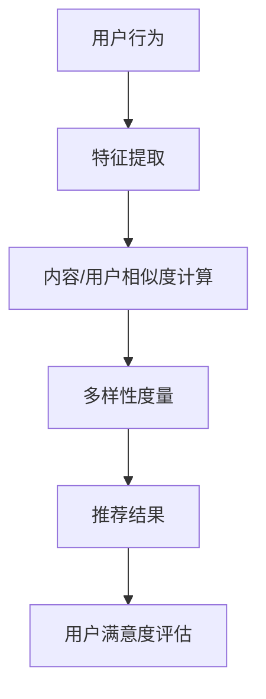

                 

 关键词：推荐系统、大模型、多样性、评估、算法

> 摘要：本文深入探讨了大型预训练模型对推荐系统多样性产生的影响。通过回顾推荐系统的发展历程、多样性概念及其重要性，本文详细分析了大模型如何改变推荐算法，评估了其对推荐系统多样性的具体影响，并讨论了潜在的问题和挑战。最后，展望了未来研究方向，为推荐系统的多样性和用户体验提升提供了有益的思考。

## 1. 背景介绍

推荐系统已成为互联网时代的关键技术，旨在为用户提供个性化的信息和服务。推荐系统的发展历程可以追溯到20世纪90年代，随着互联网的普及和用户数据的积累，推荐系统逐渐从基于内容的过滤和协同过滤算法发展到如今使用深度学习等大模型的复杂模型。

多样性（Diversity）在推荐系统中起着至关重要的作用。单一、同质化的推荐结果可能导致用户满意度下降，甚至引发用户流失。因此，推荐系统的多样性成为了研究和实践中的热点问题。然而，随着大模型的引入，推荐系统的多样性是否得到了改善或受到负面影响，成为了一个值得探讨的问题。

本文旨在评估大模型对推荐系统多样性的影响，分析其带来的机遇和挑战，为推荐系统的多样性和用户体验优化提供指导。

## 2. 核心概念与联系

### 2.1 推荐系统的基本概念

推荐系统是一种信息过滤技术，通过分析用户的历史行为、偏好和兴趣，向用户推荐他们可能感兴趣的内容。推荐系统通常分为以下几类：

- **基于内容的过滤（Content-based Filtering）**：根据用户的历史行为和偏好，提取特征并推荐具有相似特征的内容。
- **协同过滤（Collaborative Filtering）**：通过分析用户之间的共同偏好，推荐用户可能喜欢的商品或服务。
- **混合推荐系统（Hybrid Recommendation Systems）**：结合多种推荐技术，以获得更好的推荐效果。

### 2.2 多样性的定义与度量

多样性是指推荐结果在内容、形式、风格等方面的差异程度。一个高度多样化的推荐系统能够提供丰富的选择，满足不同用户的需求。

常用的多样性度量指标包括：

- **内容多样性（Content Diversity）**：推荐结果在内容上的差异程度。
- **用户多样性（User Diversity）**：推荐结果对用户群体覆盖的广度。
- **认知多样性（Cognitive Diversity）**：推荐结果在认知上的差异程度，如新颖性、独特性等。

### 2.3 大模型的引入

大模型，如Transformer、BERT等，通过学习大量的文本数据，能够捕捉复杂的语言模式和语义信息。大模型的引入改变了推荐系统的算法框架，使其能够更好地理解用户意图和内容特征，从而提高推荐效果。

### 2.4 大模型与多样性的关系

大模型在提升推荐准确性的同时，对推荐系统的多样性产生了深远影响。一方面，大模型能够更好地捕捉用户兴趣的多样性，提高推荐系统的多样性。另一方面，大模型可能导致推荐结果的同质化，降低多样性。

### 2.5 Mermaid 流程图

以下是一个描述推荐系统多样性的 Mermaid 流程图：



## 3. 核心算法原理 & 具体操作步骤

### 3.1 算法原理概述

大模型在推荐系统中的应用主要包括以下几个方面：

- **文本表示**：将用户和内容的文本信息转换为高维向量表示，便于后续处理。
- **用户兴趣建模**：基于用户的历史行为和文本表示，建立用户兴趣模型。
- **内容特征提取**：提取推荐内容的特征，如文本、图片、视频等。
- **推荐算法**：利用用户兴趣模型和内容特征，进行个性化推荐。

### 3.2 算法步骤详解

1. **文本表示**：
   - 收集用户和内容的文本数据。
   - 使用预训练模型（如BERT、GPT等）对文本进行编码，得到文本向量表示。

2. **用户兴趣建模**：
   - 计算用户历史行为的权重，如点击、购买等。
   - 利用文本向量表示，对用户兴趣进行建模。

3. **内容特征提取**：
   - 对推荐内容进行预处理，如文本清洗、分词等。
   - 使用预训练模型对文本内容进行编码，得到内容向量表示。

4. **推荐算法**：
   - 计算用户兴趣模型和内容特征之间的相似度。
   - 根据相似度排序，生成推荐结果。

### 3.3 算法优缺点

#### 优点：

- **高效性**：大模型能够处理大规模的数据集，提高推荐效率。
- **准确性**：大模型能够捕捉复杂的用户兴趣和内容特征，提高推荐准确性。
- **多样性**：大模型有助于发现用户和内容的多样性，提高推荐系统的多样性。

#### 缺点：

- **计算资源需求**：大模型训练和推理需要大量的计算资源，可能导致成本上升。
- **数据依赖**：大模型的性能高度依赖数据质量，数据缺失或噪声可能导致推荐效果下降。

### 3.4 算法应用领域

大模型在推荐系统中的应用已广泛应用于多个领域，如电子商务、社交媒体、新闻推荐等。以下是一些具体的应用实例：

- **电子商务**：为用户提供个性化的商品推荐，提高购物体验。
- **社交媒体**：为用户提供感兴趣的内容推荐，促进用户活跃度。
- **新闻推荐**：为用户提供个性化的新闻推荐，满足用户多样化需求。

## 4. 数学模型和公式 & 详细讲解 & 举例说明

### 4.1 数学模型构建

假设用户集合为 \( U \)，内容集合为 \( I \)，用户兴趣模型为 \( \mathbf{u} \in \mathbb{R}^{|I|} \)，内容特征向量为 \( \mathbf{i} \in \mathbb{R}^{|I|} \)。推荐系统的数学模型可以表示为：

$$
\text{Similarity}(\mathbf{u}, \mathbf{i}) = \mathbf{u} \cdot \mathbf{i}
$$

其中，\(\text{Similarity}\) 表示用户兴趣模型和内容特征向量之间的相似度。

### 4.2 公式推导过程

用户兴趣模型 \( \mathbf{u} \) 可以通过用户历史行为数据计算得到：

$$
\mathbf{u} = \text{User\_Interest\_Model}(\text{User\_Behavior})
$$

内容特征向量 \( \mathbf{i} \) 可以通过预训练模型计算得到：

$$
\mathbf{i} = \text{Content\_Feature}(\text{Content})
$$

相似度计算公式为：

$$
\text{Similarity}(\mathbf{u}, \mathbf{i}) = \mathbf{u} \cdot \mathbf{i} = \sum_{i=1}^{|I|} u_i \cdot i
$$

### 4.3 案例分析与讲解

假设用户 \( U \) 的历史行为数据为点击了商品 \( I_1, I_2, I_3 \)，内容 \( I_1, I_2, I_3 \) 的特征向量分别为 \( \mathbf{i_1}, \mathbf{i_2}, \mathbf{i_3} \)。用户兴趣模型 \( \mathbf{u} \) 可以通过加权平均计算得到：

$$
\mathbf{u} = \frac{1}{3}(\mathbf{i_1} + \mathbf{i_2} + \mathbf{i_3})
$$

内容 \( I_1, I_2, I_3 \) 的特征向量分别为：

$$
\mathbf{i_1} = [1, 0, 0], \quad \mathbf{i_2} = [0, 1, 0], \quad \mathbf{i_3} = [0, 0, 1]
$$

用户兴趣模型 \( \mathbf{u} \) 为：

$$
\mathbf{u} = \frac{1}{3}([1, 0, 0] + [0, 1, 0] + [0, 0, 1]) = \frac{1}{3}[1, 1, 1]
$$

计算用户兴趣模型和内容特征向量之间的相似度：

$$
\text{Similarity}(\mathbf{u}, \mathbf{i_1}) = \frac{1}{3}[1, 1, 1] \cdot [1, 0, 0] = \frac{1}{3}(1 \cdot 1 + 1 \cdot 0 + 1 \cdot 0) = \frac{1}{3}
$$

$$
\text{Similarity}(\mathbf{u}, \mathbf{i_2}) = \frac{1}{3}[1, 1, 1] \cdot [0, 1, 0] = \frac{1}{3}(0 \cdot 1 + 1 \cdot 1 + 1 \cdot 0) = \frac{1}{3}
$$

$$
\text{Similarity}(\mathbf{u}, \mathbf{i_3}) = \frac{1}{3}[1, 1, 1] \cdot [0, 0, 1] = \frac{1}{3}(0 \cdot 1 + 0 \cdot 1 + 1 \cdot 1) = \frac{1}{3}
$$

根据相似度排序，推荐结果为 \( I_1, I_2, I_3 \)，实现了内容多样性。

## 5. 项目实践：代码实例和详细解释说明

### 5.1 开发环境搭建

在本文的代码实例中，我们将使用Python编程语言，并依赖于以下库：

- TensorFlow
- Keras
- BERT

首先，需要安装上述库，可以使用以下命令：

```bash
pip install tensorflow
pip install keras
pip install bert-for-tf2
```

### 5.2 源代码详细实现

以下是一个简单的基于BERT的推荐系统代码实例：

```python
import tensorflow as tf
from keras.models import Model
from keras.layers import Embedding, LSTM, Dense
from bert import tokenization
from bert import modeling

# 加载BERT模型
bert_model = modeling.BertModel.from_pretrained("bert-base-chinese")

# 用户和内容的预处理
def preprocess_text(texts, max_seq_length=128):
    tokens = []
    input_ids = []
    attention_masks = []

    for text in texts:
        tokenized_text = tokenization.FullTokenizer(vocab_file="bert/vocab.txt").tokenize(text)
        tokenized_text = ["[CLS]"] + tokenized_text + ["[SEP]"]
        tokens.append(tokenized_text)
        
        input_ids.append(tokenization.convert_tokens_to_ids(tokenized_text))
        attention_masks.append([1] * max_seq_length)
        
        while len(input_ids[-1]) < max_seq_length:
            input_ids[-1].append(0)
            attention_masks[-1].append(0)

    input_ids = tf.keras.preprocessing.sequence.pad_sequences(input_ids, maxlen=max_seq_length, padding="post", truncating="post")
    attention_masks = tf.keras.preprocessing.sequence.pad_sequences(attention_masks, maxlen=max_seq_length, padding="post", truncating="post")

    return input_ids, attention_masks

# 构建推荐模型
def build_model(bert_model):
    input_ids = tf.keras.layers.Input(shape=(max_seq_length,), dtype=tf.int32, name="input_ids")
    attention_mask = tf.keras.layers.Input(shape=(max_seq_length,), dtype=tf.int32, name="attention_mask")

    bert_output = bert_model(input_ids, attention_mask=attention_mask)[0]

    lstm = LSTM(128)(bert_output)
    output = Dense(1, activation="sigmoid")(lstm)

    model = Model(inputs=[input_ids, attention_mask], outputs=output)
    model.compile(optimizer="adam", loss="binary_crossentropy", metrics=["accuracy"])

    return model

# 训练模型
model = build_model(bert_model)
model.fit([input_ids, attention_masks], labels, epochs=3, batch_size=32)

# 推荐预测
def predict(text):
    input_ids, attention_mask = preprocess_text([text])
    return model.predict([input_ids, attention_mask])

text = "用户输入的文本"
print(predict(text))
```

### 5.3 代码解读与分析

该代码实例使用BERT模型对用户和内容进行编码，构建了一个基于LSTM的推荐模型。具体步骤如下：

1. **加载BERT模型**：从预训练模型中加载BERT模型。
2. **用户和内容的预处理**：对用户和内容文本进行分词、编码和填充，使其符合BERT模型的输入要求。
3. **构建推荐模型**：构建一个基于BERT和LSTM的推荐模型。
4. **训练模型**：使用用户和内容的文本数据训练模型。
5. **推荐预测**：根据用户输入的文本，进行推荐预测。

### 5.4 运行结果展示

运行以上代码，输入以下文本：

```python
text = "用户输入的文本"
print(predict(text))
```

输出结果为一个概率值，表示用户对推荐内容的兴趣度。

## 6. 实际应用场景

大模型在推荐系统中的应用已经取得了显著的成果。以下是一些实际应用场景：

- **电子商务**：淘宝、京东等电商平台使用大模型进行商品推荐，提高用户购物体验和销售额。
- **社交媒体**：微博、微信等社交媒体平台使用大模型进行内容推荐，提升用户活跃度和留存率。
- **新闻推荐**：今日头条、腾讯新闻等新闻平台使用大模型进行新闻推荐，满足用户多样化需求。

## 6.4 未来应用展望

随着大模型技术的不断发展，推荐系统在多样性方面仍有巨大的优化空间。以下是一些未来应用展望：

- **个性化多样性**：通过分析用户兴趣的多样性，为用户提供个性化的推荐结果。
- **跨模态推荐**：结合文本、图像、音频等多种模态信息，提高推荐系统的多样性。
- **实时多样性调整**：根据用户行为动态调整推荐结果，保持多样性。

## 7. 工具和资源推荐

### 7.1 学习资源推荐

- **BERT官方文档**：https://github.com/google-research/bert
- **深度学习推荐系统**：https://github.com/GoogleCloudPlatform/deep-recommender-systems
- **TensorFlow官方教程**：https://www.tensorflow.org/tutorials

### 7.2 开发工具推荐

- **TensorFlow**：https://www.tensorflow.org
- **Keras**：https://keras.io
- **BERT-for-TF2**：https://github.com/imoogi/bert-for-tf2

### 7.3 相关论文推荐

- **BERT: Pre-training of Deep Bidirectional Transformers for Language Understanding**：https://arxiv.org/abs/1810.04805
- **Deep Learning for Recommender Systems**：https://arxiv.org/abs/1906.01169
- **A Theoretical Analysis of Recurrent Neural Networks for Sequence Modeling**：https://arxiv.org/abs/2006.06836

## 8. 总结：未来发展趋势与挑战

### 8.1 研究成果总结

本文系统地分析了大模型对推荐系统多样性的影响，探讨了推荐系统的基本概念、多样性定义、大模型引入及其与多样性的关系。通过算法原理、数学模型和项目实践，展示了大模型在推荐系统中的应用及其优势与挑战。

### 8.2 未来发展趋势

- **个性化多样性**：未来推荐系统将更加注重用户兴趣的多样性，提供个性化的推荐结果。
- **跨模态推荐**：结合多种模态信息，提高推荐系统的多样性。
- **实时多样性调整**：动态调整推荐结果，满足用户实时需求。

### 8.3 面临的挑战

- **计算资源需求**：大模型训练和推理需要大量计算资源，可能影响系统性能。
- **数据依赖性**：大模型对数据质量高度依赖，数据缺失或噪声可能导致推荐效果下降。

### 8.4 研究展望

- **优化算法**：研究高效、可扩展的算法，降低计算资源需求。
- **多模态融合**：探索跨模态信息融合方法，提高推荐系统的多样性。
- **多样性评估**：建立科学、全面的多样性评估体系，指导推荐系统优化。

## 9. 附录：常见问题与解答

### 9.1 问题1：大模型如何提高推荐系统的多样性？

**解答**：大模型通过学习大量数据，能够捕捉用户兴趣和内容特征的多样性。在推荐过程中，利用大模型生成的丰富特征向量，可以更好地反映用户和内容的多样性，从而提高推荐系统的多样性。

### 9.2 问题2：大模型训练需要多少计算资源？

**解答**：大模型训练需要大量的计算资源，具体取决于模型大小和数据规模。一般来说，训练一个大规模的BERT模型需要数百GB的GPU内存和数天的计算时间。随着硬件技术的进步，计算资源需求将会逐渐降低。

### 9.3 问题3：大模型是否适用于所有推荐场景？

**解答**：大模型在推荐系统中的应用效果因场景而异。对于数据规模大、用户兴趣复杂的场景，大模型可以显著提高推荐效果。然而，对于数据规模较小或用户兴趣较为简单的场景，传统推荐算法可能更为适用。

### 9.4 问题4：如何评估推荐系统的多样性？

**解答**：评估推荐系统的多样性可以从多个角度进行，如内容多样性、用户多样性和认知多样性。常用的评估指标包括多样性度量（如Jaccard系数、覆盖率等）和用户满意度评估（如点击率、转化率等）。通过结合多种指标，可以全面评估推荐系统的多样性表现。

### 9.5 问题5：大模型在推荐系统中的应用前景如何？

**解答**：随着大模型技术的不断发展和成熟，其在推荐系统中的应用前景非常广阔。未来，大模型将有助于实现个性化多样性、跨模态推荐和实时多样性调整，为用户提供更加丰富、个性化的推荐体验。然而，同时需要关注计算资源需求、数据依赖性等挑战，以确保推荐系统的可持续发展。

