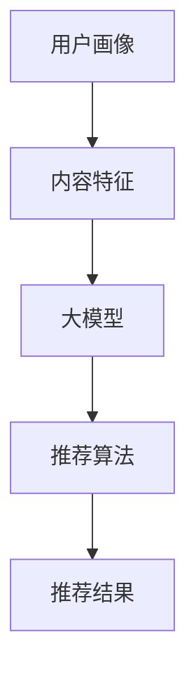

                 

推荐系统是现代信息社会中的一项关键技术，它通过分析用户的历史行为和偏好，向用户推荐符合其兴趣的内容或商品。然而，随着数据量的增加和用户需求的多样化，传统推荐系统面临着越来越多的挑战，如冷启动问题、数据稀疏性、多样性不足等。大模型的引入为解决这些问题提供了新的思路和策略。本文将探讨大模型在推荐系统中的应用，以及其对用户体验的提升策略。

## 1. 背景介绍

随着互联网的飞速发展，用户生成的内容和数据量呈现出爆炸式增长。在这种情况下，传统的推荐系统往往无法满足用户的个性化需求。大模型，作为一种基于深度学习的强大工具，可以在处理大规模数据和复杂用户偏好方面展现出巨大的潜力。大模型可以自动从大量数据中学习到有效的特征表示，并通过复杂的神经网络结构进行预测和推荐，从而提高推荐系统的准确性和用户体验。

## 2. 核心概念与联系

在探讨大模型对推荐系统的影响之前，我们需要先了解一些核心概念。以下是本文涉及的一些重要概念和它们之间的关系：

### 2.1 用户画像（User Profiling）

用户画像是对用户兴趣、行为、偏好等特征的抽象表示。它通常包括用户的基本信息、历史行为记录、兴趣标签等。

### 2.2 内容特征（Content Features）

内容特征是推荐系统对推荐对象（如文章、商品、音乐等）进行描述的一系列属性，如文本内容、图像特征、视频特征等。

### 2.3 大模型（Large Models）

大模型是指具有数十亿甚至数万亿参数的深度学习模型，如GPT、BERT等。它们能够自动从大量数据中学习到复杂的特征表示。

### 2.4 推荐算法（Recommender Algorithms）

推荐算法是用于生成推荐结果的一系列计算方法。大模型的引入可以显著提升传统推荐算法的性能。

下面是这些概念之间关系的 Mermaid 流程图：



## 3. 核心算法原理 & 具体操作步骤

### 3.1 算法原理概述

大模型在推荐系统中的应用主要包括以下几个步骤：

1. 数据预处理：清洗和整合用户画像和内容特征数据。
2. 特征提取：使用大模型从原始数据中提取高级特征表示。
3. 模型训练：利用提取的特征进行模型训练，优化模型参数。
4. 推荐生成：使用训练好的模型生成推荐结果，并评估其质量。

### 3.2 算法步骤详解

#### 3.2.1 数据预处理

数据预处理是推荐系统的基础。在这个阶段，我们需要：

- 清洗数据：处理缺失值、重复值和异常值。
- 数据整合：将用户画像和内容特征数据进行对齐和整合。

#### 3.2.2 特征提取

特征提取是利用大模型的核心步骤。我们通常使用以下方法进行特征提取：

- 自编码器（Autoencoders）：用于无监督学习，可以从原始数据中学习到有效的特征表示。
- 卷积神经网络（CNNs）：适用于处理图像和文本等结构化数据。
- 生成对抗网络（GANs）：可以生成新的特征表示，提高模型的泛化能力。

#### 3.2.3 模型训练

在模型训练阶段，我们需要：

- 选择合适的损失函数和优化器。
- 对模型进行迭代训练，优化模型参数。

#### 3.2.4 推荐生成

在推荐生成阶段，我们使用训练好的模型对用户进行推荐。具体步骤如下：

- 输入用户画像和内容特征，通过模型生成推荐结果。
- 对推荐结果进行评估和排序，筛选出最符合用户兴趣的推荐项。

### 3.3 算法优缺点

#### 优点：

- **高准确性**：大模型可以从大规模数据中学习到复杂的特征表示，提高推荐系统的准确性。
- **强泛化能力**：大模型能够处理各种类型的数据，具有很强的泛化能力。
- **多样性**：大模型可以生成多样化的推荐结果，提高用户满意度。

#### 缺点：

- **计算资源消耗**：大模型训练和推理需要大量的计算资源和时间。
- **数据隐私**：大模型在训练过程中可能泄露用户隐私。

### 3.4 算法应用领域

大模型在推荐系统的应用非常广泛，主要包括：

- **电子商务**：为用户推荐商品和服务。
- **社交媒体**：为用户推荐感兴趣的内容和帖子。
- **在线教育**：为用户推荐学习资源和课程。

## 4. 数学模型和公式 & 详细讲解 & 举例说明

### 4.1 数学模型构建

在推荐系统中，大模型的数学模型通常可以表示为：

\[ R(x, y) = f(W_1 \cdot x + b_1, W_2 \cdot y + b_2) \]

其中，\( x \) 和 \( y \) 分别代表用户画像和内容特征，\( W_1 \) 和 \( W_2 \) 分别是模型权重，\( b_1 \) 和 \( b_2 \) 是偏置项，\( f \) 是激活函数。

### 4.2 公式推导过程

假设我们有一个用户 \( u \) 和一个商品 \( p \)，用户画像和商品特征分别表示为 \( x_u \) 和 \( x_p \)。我们使用一个三层神经网络来构建推荐模型，其参数表示为 \( W_1, W_2, W_3 \) 和 \( b_1, b_2, b_3 \)。

首先，我们计算第一层的输出：

\[ z_1 = W_1 \cdot x_u + b_1 \]

然后，我们使用激活函数 \( f \) 对 \( z_1 \) 进行处理，得到第一层的特征表示：

\[ h_1 = f(z_1) \]

接下来，我们计算第二层的输出：

\[ z_2 = W_2 \cdot x_p + b_2 \]

同样，使用激活函数 \( f \) 对 \( z_2 \) 进行处理，得到第二层的特征表示：

\[ h_2 = f(z_2) \]

最后，我们计算第三层的输出，即推荐评分：

\[ R(u, p) = W_3 \cdot [h_1, h_2] + b_3 \]

### 4.3 案例分析与讲解

假设我们有一个用户 \( u \)，他喜欢阅读科技类文章。我们还有一个科技类文章 \( p \)，我们希望使用大模型为这个用户推荐这篇文章。

首先，我们提取用户画像和文章特征，分别表示为 \( x_u \) 和 \( x_p \)。

然后，我们将这些特征输入到大模型中，计算推荐评分 \( R(u, p) \)。

假设我们的大模型参数为 \( W_1, W_2, W_3 \) 和 \( b_1, b_2, b_3 \)，我们将 \( x_u \) 和 \( x_p \) 代入模型中，得到：

\[ z_1 = W_1 \cdot x_u + b_1 \]
\[ z_2 = W_2 \cdot x_p + b_2 \]
\[ R(u, p) = W_3 \cdot [h_1, h_2] + b_3 \]

其中，\( h_1 \) 和 \( h_2 \) 分别是第一层和第二层的特征表示。

最后，我们将 \( R(u, p) \) 的值与一个阈值进行比较，如果 \( R(u, p) \) 大于阈值，则推荐这篇文章给用户；否则，不推荐。

## 5. 项目实践：代码实例和详细解释说明

### 5.1 开发环境搭建

为了实现本文所述的大模型推荐系统，我们首先需要搭建一个合适的开发环境。以下是一个基本的开发环境搭建步骤：

- 安装Python环境（3.8以上版本）
- 安装TensorFlow和Keras库
- 准备一个GPU加速环境（可选）

### 5.2 源代码详细实现

下面是一个使用Keras实现的大模型推荐系统示例代码：

```python
import tensorflow as tf
from tensorflow.keras.models import Model
from tensorflow.keras.layers import Input, Dense, Concatenate, Activation

# 定义输入层
user_input = Input(shape=(user_feature_size,))
content_input = Input(shape=(content_feature_size,))

# 定义神经网络层
user_embedding = Dense(units=64, activation='relu')(user_input)
content_embedding = Dense(units=64, activation='relu')(content_input)

# 连接层
concatenated = Concatenate()([user_embedding, content_embedding])

# 定义输出层
output = Dense(units=1, activation='sigmoid')(concatenated)

# 构建模型
model = Model(inputs=[user_input, content_input], outputs=output)

# 编译模型
model.compile(optimizer='adam', loss='binary_crossentropy', metrics=['accuracy'])

# 模型训练
model.fit([user_features, content_features], labels, epochs=10, batch_size=32)
```

### 5.3 代码解读与分析

这段代码实现了一个简单的大模型推荐系统，主要分为以下几个步骤：

1. **定义输入层**：用户画像和内容特征分别作为输入层。
2. **定义神经网络层**：使用Dense层实现全连接神经网络，并设置激活函数。
3. **连接层**：将用户画像和内容特征的表示进行拼接。
4. **定义输出层**：输出层使用sigmoid激活函数，用于生成推荐评分。
5. **构建模型**：使用Model类将输入层、神经网络层和输出层连接起来，形成完整的模型。
6. **编译模型**：设置优化器和损失函数，准备训练模型。
7. **模型训练**：使用训练数据对模型进行训练。

### 5.4 运行结果展示

在运行模型训练后，我们可以使用以下代码评估模型的性能：

```python
# 评估模型
loss, accuracy = model.evaluate([user_features_test, content_features_test], labels_test)

print(f"Test Loss: {loss}")
print(f"Test Accuracy: {accuracy}")
```

这段代码将计算模型在测试集上的损失和准确率，并输出结果。

## 6. 实际应用场景

大模型在推荐系统中的应用场景非常广泛。以下是一些典型的实际应用场景：

### 6.1 电子商务平台

电子商务平台可以使用大模型推荐系统为用户推荐商品。通过分析用户的购买历史和浏览记录，系统可以预测用户可能感兴趣的商品，从而提高销售额。

### 6.2 社交媒体平台

社交媒体平台可以使用大模型推荐系统为用户推荐感兴趣的内容。例如，微博可以通过分析用户的关注对象和点赞记录，推荐符合用户兴趣的微博。

### 6.3 在线教育平台

在线教育平台可以使用大模型推荐系统为用户推荐适合的学习资源和课程。通过分析用户的学习历史和测试成绩，系统可以预测用户可能感兴趣的学习内容。

## 7. 工具和资源推荐

为了更好地研究和应用大模型推荐系统，以下是一些建议的学习资源和开发工具：

### 7.1 学习资源推荐

- 《深度学习》（Goodfellow et al.）
- 《推荐系统实践》（Liang et al.）
- TensorFlow官方文档

### 7.2 开发工具推荐

- Jupyter Notebook：用于编写和运行Python代码。
- Keras：用于构建和训练深度学习模型。
- TensorFlow：用于实现大规模深度学习模型。

### 7.3 相关论文推荐

- "Deep Learning for Recommender Systems"（He et al.）
- "Neural Collaborative Filtering"（Hao et al.)
- "A Theoretically Principled Approach to Improving Recommendation Lists"（Rendle et al.)

## 8. 总结：未来发展趋势与挑战

大模型在推荐系统中的应用已经展现出巨大的潜力。未来，随着技术的不断进步，我们可以预见以下几个发展趋势：

1. **更高效的算法**：研究人员将继续优化大模型算法，提高其在推荐系统中的性能。
2. **更多领域应用**：大模型将在更多领域得到应用，如金融、医疗、娱乐等。
3. **隐私保护**：随着数据隐私问题的日益突出，研究人员将致力于开发隐私保护的大模型推荐系统。

然而，大模型推荐系统也面临着一些挑战：

1. **计算资源消耗**：大模型训练和推理需要大量的计算资源，这对于中小型企业和开发者来说可能是一个挑战。
2. **数据隐私**：大模型在训练过程中可能泄露用户隐私，需要采取有效的隐私保护措施。
3. **模型解释性**：大模型通常具有高度的复杂性和非线性，这使得模型解释性成为一个挑战。

综上所述，大模型推荐系统具有广泛的应用前景，但同时也需要克服一些技术难题。随着研究的深入，我们有理由相信大模型将为推荐系统带来更多的创新和突破。

## 9. 附录：常见问题与解答

### 9.1 什么是大模型？

大模型是指具有数十亿甚至数万亿参数的深度学习模型，如GPT、BERT等。它们能够自动从大量数据中学习到复杂的特征表示，从而提高推荐系统的性能。

### 9.2 大模型推荐系统有哪些优点？

大模型推荐系统具有以下优点：

- 高准确性：能够从大规模数据中学习到复杂的特征表示，提高推荐系统的准确性。
- 强泛化能力：能够处理各种类型的数据，具有很强的泛化能力。
- 多样性：能够生成多样化的推荐结果，提高用户满意度。

### 9.3 大模型推荐系统有哪些缺点？

大模型推荐系统有以下缺点：

- 计算资源消耗：大模型训练和推理需要大量的计算资源，这对于中小型企业和开发者来说可能是一个挑战。
- 数据隐私：大模型在训练过程中可能泄露用户隐私，需要采取有效的隐私保护措施。
- 模型解释性：大模型通常具有高度的复杂性和非线性，这使得模型解释性成为一个挑战。

### 9.4 如何优化大模型推荐系统的性能？

以下是一些优化大模型推荐系统性能的方法：

- **数据预处理**：清洗和整合数据，提高数据质量。
- **模型选择**：选择适合数据集和业务场景的模型。
- **超参数调优**：调整模型超参数，提高模型性能。
- **模型集成**：使用多个模型进行集成，提高预测准确性。
- **在线学习**：实时更新模型，适应用户行为的变化。

### 9.5 大模型推荐系统有哪些应用场景？

大模型推荐系统可以应用于以下领域：

- **电子商务**：为用户推荐商品和服务。
- **社交媒体**：为用户推荐感兴趣的内容和帖子。
- **在线教育**：为用户推荐学习资源和课程。
- **金融**：为用户提供个性化的金融服务。
- **医疗**：为用户提供个性化的健康建议。

### 9.6 大模型推荐系统的未来发展趋势是什么？

大模型推荐系统的未来发展趋势包括：

- **更高效的算法**：研究人员将继续优化大模型算法，提高其在推荐系统中的性能。
- **更多领域应用**：大模型将在更多领域得到应用，如金融、医疗、娱乐等。
- **隐私保护**：研究人员将致力于开发隐私保护的大模型推荐系统。
- **模型解释性**：研究人员将探索如何提高大模型的可解释性，使其更加透明和可靠。

以上就是对大模型推荐系统相关问题的解答和总结。希望对读者有所帮助。作者：禅与计算机程序设计艺术 / Zen and the Art of Computer Programming

