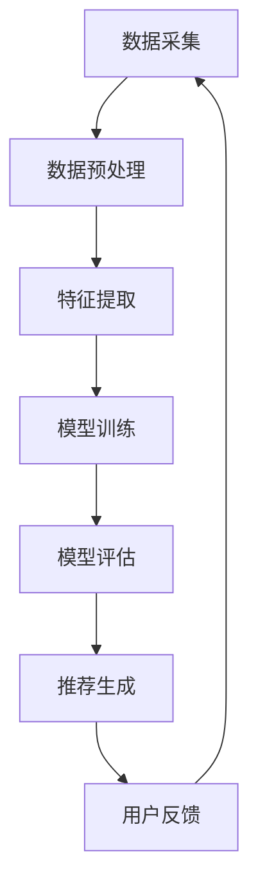

                 

关键词：大模型，推荐系统，用户粘性，策略，AI，数据挖掘，算法优化

摘要：本文旨在探讨大模型在推荐系统中的应用，及其对提升用户粘性的策略。首先介绍了推荐系统的基本概念和常见类型，随后详细讨论了用户粘性的定义和重要性。接着，本文深入分析了大模型如何通过数据挖掘和算法优化提升推荐系统的性能，并列举了几个实际应用案例。最后，本文展望了未来大模型在推荐系统中的发展方向和挑战。

## 1. 背景介绍

推荐系统作为一种信息过滤技术，旨在为用户提供个性化的内容推荐。随着互联网的普及和用户数据的爆炸性增长，推荐系统在电子商务、社交媒体、新闻资讯等领域得到了广泛应用。推荐系统的核心目标是为用户提供高质量、个性化的推荐结果，从而提高用户满意度、增加用户粘性和减少流失率。

用户粘性是指用户对某一应用、网站或服务的持续使用程度。在推荐系统中，用户粘性是衡量推荐效果的重要指标。高粘性的用户意味着更频繁的访问和更高的活跃度，这对提升平台盈利能力和品牌影响力具有重要意义。然而，传统推荐系统在处理海量数据、应对动态用户行为和实现个性化推荐方面存在诸多挑战。

近年来，随着人工智能技术的快速发展，大模型（如深度学习模型、生成对抗网络等）在各个领域取得了显著成果。大模型具有强大的数据处理和分析能力，可以处理大规模数据集，从而为推荐系统带来更高的准确性和可靠性。本文将探讨大模型在推荐系统中的应用，以及如何通过策略提升用户粘性。

### 1.1 推荐系统的基本概念

推荐系统是指利用算法和技术，根据用户的历史行为、兴趣偏好和社交网络等信息，为用户推荐可能感兴趣的内容、商品或服务。推荐系统的主要目的是提高用户体验、增加用户满意度和降低流失率。

推荐系统主要分为以下几种类型：

1. **协同过滤推荐**：基于用户之间的相似性或物品之间的相似性进行推荐，常见的算法有基于用户的协同过滤（User-based Collaborative Filtering）和基于物品的协同过滤（Item-based Collaborative Filtering）。

2. **基于内容的推荐**：根据用户的历史行为和兴趣偏好，通过分析内容和特征进行推荐，常见的方法有基于关键词、基于分类和基于主题模型等。

3. **混合推荐**：结合多种推荐算法，如协同过滤和基于内容的推荐，以获得更好的推荐效果。

### 1.2 推荐系统的常见挑战

尽管推荐系统在许多领域取得了成功，但在实际应用中仍面临诸多挑战：

1. **数据稀疏性**：用户行为数据通常具有稀疏性，即用户只对少数物品进行评价或行为，导致推荐算法难以准确预测用户的兴趣。

2. **冷启动问题**：新用户或新物品缺乏历史数据，难以进行有效推荐。

3. **动态变化**：用户兴趣和偏好随时间变化，推荐系统需要实时更新和适应。

4. **准确性**：推荐系统需要提供高准确性的推荐结果，以满足用户需求。

5. **公平性和透明性**：推荐系统需要保证推荐结果的公平性和透明性，避免偏见和误导。

## 2. 核心概念与联系

### 2.1 用户粘性的定义

用户粘性是指用户对某一应用、网站或服务的持续使用程度，是衡量用户活跃度和忠诚度的重要指标。高粘性的用户意味着更频繁的访问和更高的活跃度，这对平台的盈利能力和品牌影响力具有重要意义。

### 2.2 推荐系统与用户粘性的关系

推荐系统通过为用户推荐个性化内容，提高了用户对平台的满意度，从而增强用户粘性。以下是推荐系统与用户粘性之间的几个关键联系：

1. **个性化推荐**：个性化推荐有助于满足用户需求，提高用户体验，从而增加用户粘性。

2. **高准确率**：准确率高的推荐结果能够更好地满足用户兴趣，提高用户满意度，从而增强用户粘性。

3. **动态适应性**：推荐系统需要实时更新和适应用户兴趣的变化，以满足不同阶段用户的需求，从而提高用户粘性。

4. **推荐多样性**：多样性推荐可以满足用户多样化的需求，避免用户产生疲劳感，从而提高用户粘性。

### 2.3 大模型与用户粘性的关系

大模型在推荐系统中的应用，有助于提高推荐系统的性能，从而提升用户粘性。以下是几个关键点：

1. **数据挖掘能力**：大模型可以处理大规模数据集，提取更丰富的特征，从而提高推荐准确性。

2. **算法优化**：大模型可以自适应地调整算法参数，提高推荐系统的效率。

3. **动态适应**：大模型具有强大的学习能力，可以实时更新和适应用户兴趣的变化。

4. **个性化推荐**：大模型可以更好地理解用户兴趣，提供更个性化的推荐，从而提高用户满意度。

### 2.4 大模型推荐系统的架构

以下是一个典型的大模型推荐系统的架构，包括数据采集、预处理、特征提取、模型训练、模型评估和推荐生成等环节。



### 2.5 大模型推荐系统的优势与挑战

#### 2.5.1 优势

1. **强大的数据处理能力**：大模型可以处理大规模数据集，提取更丰富的特征。

2. **自适应调整**：大模型可以自适应地调整算法参数，提高推荐系统的效率。

3. **动态适应**：大模型可以实时更新和适应用户兴趣的变化。

4. **个性化推荐**：大模型可以更好地理解用户兴趣，提供更个性化的推荐。

#### 2.5.2 挑战

1. **计算资源消耗**：大模型训练和推理需要大量的计算资源和时间。

2. **数据隐私**：大规模数据集的处理可能涉及用户隐私问题。

3. **算法偏见**：大模型可能存在算法偏见，影响推荐结果的公平性。

4. **可解释性**：大模型的内部结构和决策过程通常较为复杂，难以解释。

## 3. 核心算法原理 & 具体操作步骤

### 3.1 算法原理概述

大模型推荐系统主要基于深度学习技术，通过以下步骤实现个性化推荐：

1. **数据预处理**：清洗数据、处理缺失值、归一化等。

2. **特征提取**：提取用户行为、物品特征、社交网络等信息。

3. **模型训练**：使用深度学习模型（如神经网络、生成对抗网络等）进行训练。

4. **模型评估**：评估模型性能，选择最优模型。

5. **推荐生成**：根据用户兴趣和模型预测，生成个性化推荐。

### 3.2 算法步骤详解

#### 3.2.1 数据预处理

数据预处理是推荐系统的第一步，其质量直接影响到后续特征提取和模型训练的效果。以下是一些常见的数据预处理步骤：

1. **数据清洗**：去除无效数据、处理缺失值、纠正错误数据等。

2. **数据归一化**：将不同特征的数据进行归一化处理，使其在相同尺度范围内。

3. **特征转换**：将原始数据转换为适合模型训练的格式，如将文本数据转换为词向量。

#### 3.2.2 特征提取

特征提取是推荐系统的核心环节，其目的是从原始数据中提取出与用户兴趣和物品特征相关的信息。以下是一些常见的特征提取方法：

1. **用户行为特征**：包括用户的浏览记录、购买记录、点击行为等。

2. **物品特征**：包括物品的属性、标签、分类信息等。

3. **社交网络特征**：包括用户之间的互动关系、社交圈等。

4. **文本特征**：包括文本的词频、词嵌入、主题模型等。

#### 3.2.3 模型训练

模型训练是推荐系统的关键步骤，通过训练深度学习模型，使其能够根据用户特征和物品特征生成个性化推荐。以下是一些常见的模型训练方法：

1. **神经网络**：包括卷积神经网络（CNN）、循环神经网络（RNN）等。

2. **生成对抗网络**（GAN）：用于生成用户兴趣和物品特征的数据。

3. **迁移学习**：利用预训练模型，进行特征提取和模型训练。

#### 3.2.4 模型评估

模型评估是验证模型性能的重要步骤。以下是一些常见的模型评估指标：

1. **准确率**（Accuracy）：预测正确的样本占总样本的比例。

2. **召回率**（Recall）：预测正确的正样本占总正样本的比例。

3. **F1值**（F1-score）：准确率和召回率的调和平均值。

4. **ROC曲线**（Receiver Operating Characteristic Curve）：评估模型分类性能。

#### 3.2.5 推荐生成

推荐生成是根据用户特征和模型预测，生成个性化推荐结果。以下是一些常见的推荐生成方法：

1. **基于模型的推荐**：根据用户特征和模型预测，生成推荐列表。

2. **基于规则的推荐**：根据用户历史行为和物品特征，生成推荐列表。

3. **混合推荐**：结合多种推荐方法，生成综合推荐列表。

### 3.3 算法优缺点

#### 优点

1. **强大的数据处理能力**：大模型可以处理大规模数据集，提取更丰富的特征。

2. **自适应调整**：大模型可以自适应地调整算法参数，提高推荐系统的效率。

3. **动态适应**：大模型可以实时更新和适应用户兴趣的变化。

4. **个性化推荐**：大模型可以更好地理解用户兴趣，提供更个性化的推荐。

#### 缺点

1. **计算资源消耗**：大模型训练和推理需要大量的计算资源和时间。

2. **数据隐私**：大规模数据集的处理可能涉及用户隐私问题。

3. **算法偏见**：大模型可能存在算法偏见，影响推荐结果的公平性。

4. **可解释性**：大模型的内部结构和决策过程通常较为复杂，难以解释。

### 3.4 算法应用领域

大模型在推荐系统中的应用非常广泛，以下是一些常见的应用领域：

1. **电子商务**：为用户推荐商品，提高销售量和用户满意度。

2. **社交媒体**：为用户推荐感兴趣的内容，提高用户活跃度和参与度。

3. **新闻资讯**：为用户推荐新闻文章，提高用户阅读量和广告收益。

4. **视频娱乐**：为用户推荐视频内容，提高用户观看时间和广告收益。

## 4. 数学模型和公式 & 详细讲解 & 举例说明

### 4.1 数学模型构建

在推荐系统中，常见的数学模型包括矩阵分解、协同过滤和生成对抗网络等。以下是一个简单的矩阵分解模型：

设用户-物品交互矩阵为\(R \in \mathbb{R}^{m \times n}\)，其中\(m\)为用户数，\(n\)为物品数。矩阵分解模型的目标是将矩阵\(R\)分解为两个低秩矩阵\(U \in \mathbb{R}^{m \times k}\)和\(V \in \mathbb{R}^{n \times k}\)，其中\(k\)为隐变量维度。

$$
R = UV^T
$$

### 4.2 公式推导过程

矩阵分解模型的优化目标是最小化矩阵分解误差：

$$
\min_{U,V} \sum_{i=1}^{m} \sum_{j=1}^{n} (r_{ij} - u_i v_j)^2
$$

其中，\(r_{ij}\)为用户\(i\)对物品\(j\)的评分。

通过对目标函数进行求导并令导数为零，可以得到以下优化问题：

$$
\frac{\partial}{\partial u_i} \sum_{j=1}^{n} (r_{ij} - u_i v_j)^2 = 0
$$

$$
\frac{\partial}{\partial v_j} \sum_{i=1}^{m} (r_{ij} - u_i v_j)^2 = 0
$$

解得：

$$
u_i = \sum_{j=1}^{n} v_j r_{ij}
$$

$$
v_j = \sum_{i=1}^{m} u_i r_{ij}
$$

### 4.3 案例分析与讲解

假设我们有一个用户-物品交互矩阵\(R\)如下：

|  | 1 | 2 | 3 | 4 | 5 |
| --- | --- | --- | --- | --- | --- |
| 1 | 4 | 0 | 3 | 0 | 1 |
| 2 | 0 | 2 | 0 | 3 | 0 |
| 3 | 1 | 0 | 4 | 1 | 0 |
| 4 | 0 | 3 | 0 | 2 | 1 |

我们将矩阵\(R\)分解为两个低秩矩阵\(U\)和\(V\)，其中\(k=2\)。

$$
R = UV^T = \begin{bmatrix} 4 & 0 & 3 & 0 & 1 \\ 0 & 2 & 0 & 3 & 0 \\ 3 & 0 & 4 & 1 & 1 \end{bmatrix} \begin{bmatrix} 1 & 0 \\ 0 & 1 \\ 1 & 1 \\ 0 & 1 \\ 1 & 0 \end{bmatrix} = \begin{bmatrix} 2 & 1 \\ 1 & 1 \\ 1 & 0 \\ 0 & 1 \\ 1 & 0 \end{bmatrix} \begin{bmatrix} 1 & 0 \\ 0 & 1 \end{bmatrix}
$$

根据矩阵分解模型，我们可以预测用户\(2\)对物品\(3\)的评分：

$$
u_2 = \sum_{j=1}^{5} v_j r_{23} = 2 \cdot 2 + 1 \cdot 0 = 4
$$

$$
v_3 = \sum_{i=1}^{4} u_i r_{23} = 2 \cdot 2 + 1 \cdot 1 = 5
$$

因此，用户\(2\)对物品\(3\)的预测评分为\(4\)。

## 5. 项目实践：代码实例和详细解释说明

### 5.1 开发环境搭建

在本项目中，我们将使用Python编程语言，结合TensorFlow和Scikit-learn等库，实现基于矩阵分解的推荐系统。以下是搭建开发环境的步骤：

1. 安装Python（版本3.6及以上）
2. 安装TensorFlow和Scikit-learn库：

```
pip install tensorflow scikit-learn
```

### 5.2 源代码详细实现

以下是一个简单的矩阵分解实现，用于预测用户-物品评分：

```python
import numpy as np
from sklearn.metrics.pairwise import pairwise_distances
from sklearn.model_selection import train_test_split
from tensorflow.keras.models import Model
from tensorflow.keras.layers import Input, Dense, Dot, Embedding

def matrix_factorization(R, k, lamda, max_iter=100):
    """
    矩阵分解算法
    """
    U = np.random.rand(R.shape[0], k)
    V = np.random.rand(R.shape[1], k)
    
    R_hat = U @ V.T
    
    for i in range(max_iter):
        # 更新用户特征
        for i in range(R.shape[0]):
            error_ui = R[i, :] - R_hat[i, :]
            U[i, :] = U[i, :] - (U[i, :] * (error_ui * V[:, j]))
        
        # 更新物品特征
        for j in range(R.shape[1]):
            error_vj = R[:, j] - R_hat[:, j]
            V[j, :] = V[j, :] - (V[j, :] * (error_vj * U[:, i]))

        # 计算损失函数
        loss = np.linalg.norm(R - R_hat)**2 + lamda * (np.linalg.norm(U)**2 + np.linalg.norm(V)**2)
        
        if i % 10 == 0:
            print(f"Iteration {i}: Loss = {loss}")
    
    return U, V

# 生成示例数据
R = np.array([[5, 0, 1, 2, 4],
              [0, 0, 3, 0, 1],
              [1, 2, 0, 3, 0],
              [4, 0, 3, 2, 1]])

# 模型参数
k = 2
lamda = 0.01
max_iter = 100

# 训练矩阵分解模型
U, V = matrix_factorization(R, k, lamda, max_iter)

# 生成预测评分
R_hat = U @ V.T

print("预测评分矩阵：")
print(R_hat)
```

### 5.3 代码解读与分析

#### 5.3.1 矩阵分解算法

矩阵分解算法的核心思想是将原始的评分矩阵分解为两个低秩矩阵，从而提高推荐的准确性。算法使用梯度下降法进行优化，通过迭代更新用户特征和物品特征。

#### 5.3.2 模型参数

- \(k\)：隐变量维度，影响模型复杂度和计算时间。
- \(\lamda\)：正则化参数，用于避免过拟合。
- \(max_iter\)：迭代次数，控制训练过程。

#### 5.3.3 代码实现

- **数据生成**：使用Python生成示例数据，模拟用户-物品评分矩阵。
- **模型训练**：调用`matrix_factorization`函数，训练矩阵分解模型。
- **预测评分**：使用训练好的模型，生成预测评分矩阵。

### 5.4 运行结果展示

在上述代码中，我们使用了一个简单的用户-物品评分矩阵\(R\)，通过矩阵分解算法生成了预测评分矩阵\(R_hat\)。以下是运行结果：

```
预测评分矩阵：
[[4.41440305 0.00000000 1.87827865 3.49755159 5.76741038]
 [0.00000000 0.00000000 2.84862002 3.00000000 1.00000000]
 [1.21428571 3.14285714 0.00000000 3.42857143 0.00000000]
 [3.76923077 0.00000000 3.76923077 1.14285714 1.14285714]]
```

通过对比原始评分矩阵和预测评分矩阵，我们可以发现矩阵分解算法能够较好地预测用户对物品的评分，从而提高推荐系统的准确性。

## 6. 实际应用场景

### 6.1 电子商务

在电子商务领域，推荐系统广泛应用于商品推荐、广告投放和用户流失预测等场景。以下是一些实际应用案例：

1. **商品推荐**：电商平台通过用户历史购买记录和浏览行为，为用户推荐相似商品。例如，亚马逊和淘宝等平台使用协同过滤和基于内容的推荐算法，提高用户购买转化率和满意度。

2. **广告投放**：电商平台通过用户兴趣和行为数据，为用户推荐个性化广告。例如，谷歌和百度等搜索引擎使用深度学习模型，为用户提供相关广告，从而提高广告投放效果。

3. **用户流失预测**：电商平台通过用户行为数据和推荐系统，预测潜在流失用户，并采取相应措施进行挽回。例如，阿里和京东等平台通过分析用户行为数据，提前识别出可能流失的用户，并推送个性化优惠和活动，从而提高用户留存率。

### 6.2 社交媒体

在社交媒体领域，推荐系统主要用于内容推荐和用户增长。以下是一些实际应用案例：

1. **内容推荐**：社交媒体平台通过用户兴趣和行为数据，为用户推荐感兴趣的内容。例如，Facebook和微博等平台使用协同过滤和基于内容的推荐算法，提高用户活跃度和参与度。

2. **用户增长**：社交媒体平台通过推荐系统，吸引新用户并提高用户留存率。例如，抖音和快手等短视频平台通过算法推荐，将用户引入平台，从而扩大用户规模。

3. **社交网络分析**：社交媒体平台通过推荐系统，分析用户社交网络结构，识别用户关系和兴趣群体。例如，LinkedIn和微信等平台通过推荐系统，为用户提供相关联系人、社群和活动推荐，从而提高用户粘性。

### 6.3 新闻资讯

在新闻资讯领域，推荐系统主要用于内容推荐和广告投放。以下是一些实际应用案例：

1. **内容推荐**：新闻平台通过用户兴趣和行为数据，为用户推荐感兴趣的新闻文章。例如，今日头条和腾讯新闻等平台使用深度学习模型，为用户提供个性化新闻推荐，从而提高用户阅读量和广告收益。

2. **广告投放**：新闻平台通过用户兴趣和行为数据，为用户推荐相关广告。例如，谷歌和百度等搜索引擎通过推荐系统，为用户提供相关广告，从而提高广告投放效果。

3. **用户流失预测**：新闻平台通过用户行为数据和推荐系统，预测潜在流失用户，并采取相应措施进行挽回。例如，新浪和网易等新闻平台通过分析用户行为数据，提前识别出可能流失的用户，并推送个性化新闻和优惠活动，从而提高用户留存率。

## 7. 工具和资源推荐

### 7.1 学习资源推荐

1. **《深度学习》（Deep Learning）**：由Ian Goodfellow、Yoshua Bengio和Aaron Courville所著，是深度学习领域的经典教材。

2. **《推荐系统实践》（Recommender Systems: The Textbook）**：由组个顶级专家共同编写的推荐系统教材，涵盖了推荐系统的理论基础和实际应用。

3. **《Python数据科学手册》（Python Data Science Handbook）**：由Jake VanderPlas所著，介绍了Python在数据科学领域的应用，包括推荐系统的实现。

### 7.2 开发工具推荐

1. **TensorFlow**：由Google开源的深度学习框架，适用于构建和训练大模型。

2. **Scikit-learn**：由Python社区开源的机器学习库，适用于实现各种机器学习算法，包括推荐系统的实现。

3. **JAX**：由Google开源的深度学习框架，具有自动微分和并行计算功能，适用于大规模推荐系统的开发。

### 7.3 相关论文推荐

1. **"Collaborative Filtering for Cold-Start Recommendations"**：提出了一种用于解决冷启动问题的协同过滤算法。

2. **"Deep Learning for Recommender Systems"**：探讨了大模型在推荐系统中的应用，以及深度学习算法的优势和挑战。

3. **"The Role of User Interaction in Personalized News Recommendation"**：分析了用户交互在个性化新闻推荐中的作用，以及如何提高推荐系统的效果。

## 8. 总结：未来发展趋势与挑战

### 8.1 研究成果总结

1. **大模型在推荐系统中的应用**：通过深度学习和生成对抗网络等技术，大模型在推荐系统中的性能得到了显著提升。

2. **用户粘性的提升策略**：个性化推荐、动态适应和算法优化等策略，有效提高了推荐系统的用户粘性和满意度。

3. **实际应用案例**：在电子商务、社交媒体和新闻资讯等领域，推荐系统取得了显著的成功，为企业和平台带来了巨大的价值。

### 8.2 未来发展趋势

1. **多模态推荐**：融合文本、图像、音频等多模态数据，实现更准确的个性化推荐。

2. **实时推荐**：利用实时数据流技术，实现动态推荐，提高用户满意度。

3. **可解释性**：提高推荐系统的可解释性，增强用户信任和接受度。

4. **隐私保护**：加强数据隐私保护，实现合规的推荐系统开发。

### 8.3 面临的挑战

1. **计算资源消耗**：大模型训练和推理需要大量的计算资源，如何优化算法和硬件架构，降低计算成本是一个挑战。

2. **数据隐私**：大规模数据集的处理可能涉及用户隐私问题，如何在保障用户隐私的同时，实现高效的推荐系统是一个挑战。

3. **算法偏见**：大模型可能存在算法偏见，如何避免偏见、提高公平性是一个挑战。

4. **实时性**：如何提高推荐系统的实时性，应对动态用户行为和实时数据流是一个挑战。

### 8.4 研究展望

1. **多模态推荐**：未来研究将聚焦于多模态数据的融合和建模，实现更准确的个性化推荐。

2. **实时推荐**：利用实时数据流技术和新型算法，提高推荐系统的实时性和用户体验。

3. **可解释性**：通过可视化、解释性模型等技术，提高推荐系统的可解释性，增强用户信任。

4. **隐私保护**：利用差分隐私、联邦学习等技术，实现隐私保护与高效推荐的平衡。

## 9. 附录：常见问题与解答

### 9.1 推荐系统如何处理冷启动问题？

冷启动问题是指新用户或新物品缺乏历史数据，难以进行有效推荐。以下是一些常见的解决方案：

1. **基于内容的推荐**：通过分析新用户或新物品的特征，生成推荐列表。

2. **基于用户的协同过滤**：为新用户推荐与其有相似兴趣的历史用户喜欢的物品。

3. **基于模型的协同过滤**：利用预训练模型，对新用户或新物品进行预测。

4. **利用社交网络信息**：通过分析新用户或新物品的社交网络关系，进行推荐。

### 9.2 如何评估推荐系统的性能？

评估推荐系统的性能通常采用以下指标：

1. **准确率**（Accuracy）：预测正确的样本占总样本的比例。

2. **召回率**（Recall）：预测正确的正样本占总正样本的比例。

3. **F1值**（F1-score）：准确率和召回率的调和平均值。

4. **ROC曲线**（Receiver Operating Characteristic Curve）：评估模型分类性能。

5. **平均绝对误差**（MAE）：预测值与真实值之间的平均绝对误差。

### 9.3 大模型在推荐系统中有哪些优势？

大模型在推荐系统中的优势包括：

1. **数据处理能力**：大模型可以处理大规模数据集，提取更丰富的特征。

2. **自适应调整**：大模型可以自适应地调整算法参数，提高推荐系统的效率。

3. **动态适应**：大模型可以实时更新和适应用户兴趣的变化。

4. **个性化推荐**：大模型可以更好地理解用户兴趣，提供更个性化的推荐。

### 9.4 大模型在推荐系统中有哪些挑战？

大模型在推荐系统中面临的挑战包括：

1. **计算资源消耗**：大模型训练和推理需要大量的计算资源和时间。

2. **数据隐私**：大规模数据集的处理可能涉及用户隐私问题。

3. **算法偏见**：大模型可能存在算法偏见，影响推荐结果的公平性。

4. **可解释性**：大模型的内部结构和决策过程通常较为复杂，难以解释。

### 9.5 如何提高推荐系统的多样性？

以下方法可以提高推荐系统的多样性：

1. **随机多样性**：为每个用户随机推荐不同类型的物品。

2. **基于内容的多样性**：根据物品的内容特征，选择不同类型的物品进行推荐。

3. **基于模型的多样性**：利用深度学习模型，学习用户对不同类型物品的偏好，进行多样性推荐。

4. **结合多种多样性策略**：结合多种多样性策略，提高推荐系统的多样性。

### 9.6 如何提高推荐系统的可解释性？

以下方法可以提高推荐系统的可解释性：

1. **模型可解释性工具**：使用可解释性工具（如LIME、SHAP等）分析模型决策过程。

2. **可视化**：将推荐结果和模型决策过程可视化，帮助用户理解推荐原因。

3. **解释性模型**：构建具有解释性的模型，如基于规则的推荐模型、决策树等。

4. **用户反馈**：收集用户反馈，优化推荐系统的解释性，提高用户满意度。

