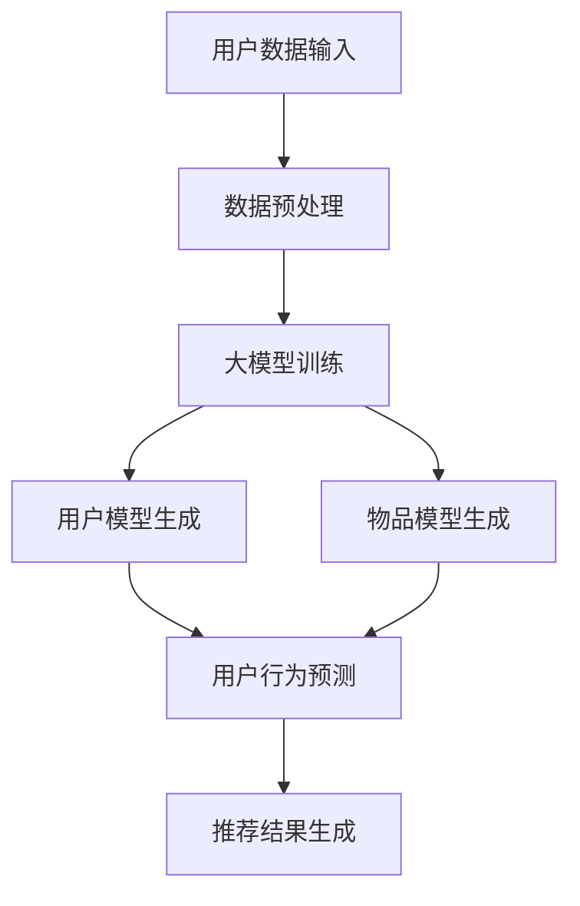

                 

关键词：推荐系统、用户留存、大模型、机器学习、人工智能、算法优化

> 摘要：本文探讨了大规模机器学习模型对推荐系统长期用户留存的影响。通过分析现有研究和实践案例，本文阐述了大模型在推荐系统中的作用，以及其对用户行为和留存率的具体影响。此外，本文还探讨了大模型在推荐系统中的技术挑战和未来发展前景。

## 1. 背景介绍

### 推荐系统概述

推荐系统是一种信息过滤技术，旨在向用户推荐他们可能感兴趣的内容、商品或服务。这些系统广泛应用于电子商务、社交媒体、新闻媒体、音乐和视频流平台等场景。推荐系统的主要目标是提高用户满意度和参与度，从而提高长期用户留存率。

### 用户留存的重要性

用户留存是衡量推荐系统成功与否的关键指标。高留存率表明用户对推荐内容感兴趣并持续使用服务。长期用户留存不仅为企业带来稳定收入，还能提高品牌忠诚度和口碑传播。因此，优化推荐系统的用户留存率成为各行业的重要研究方向。

### 大模型的兴起

近年来，随着计算能力和数据存储技术的提升，大规模机器学习模型（大模型）逐渐成为研究热点。这些模型通过训练海量数据，能够自动提取特征、发现潜在模式，并生成高质量的预测结果。大模型在自然语言处理、计算机视觉、语音识别等领域取得了显著的成果，也引起了推荐系统领域的研究兴趣。

## 2. 核心概念与联系

为了更好地理解大模型对推荐系统的影响，我们需要首先介绍几个核心概念。

### 推荐系统基本架构

推荐系统通常由用户模型、物品模型和推荐算法三部分组成。用户模型用于捕捉用户偏好和兴趣，物品模型用于描述物品特征，推荐算法则将用户模型和物品模型相结合，生成个性化推荐结果。

### 大模型原理

大模型基于深度学习和神经网络技术，通过训练大量数据自动学习复杂函数映射。它们具有以下几个特点：

1. **高维度特征表示**：大模型能够将原始数据转换为高维度的特征表示，从而捕捉到更多潜在信息。
2. **强泛化能力**：大模型在训练过程中能够自动调整模型参数，从而适应不同的数据分布和场景。
3. **自适应学习**：大模型能够根据用户行为动态更新用户和物品模型，实现实时推荐。

### Mermaid 流程图

下面是一个简化的 Mermaid 流程图，展示了推荐系统中的大模型作用：



## 3. 核心算法原理 & 具体操作步骤

### 3.1 算法原理概述

大模型在推荐系统中的应用主要基于以下几个步骤：

1. **数据收集**：从各个渠道收集用户行为数据、物品信息等。
2. **数据预处理**：对原始数据进行清洗、去噪和特征提取，为模型训练做准备。
3. **模型训练**：使用大规模数据进行模型训练，通过迭代优化模型参数。
4. **模型评估**：使用验证集或测试集评估模型性能，调整模型参数。
5. **推荐生成**：将用户行为和物品特征输入模型，生成个性化推荐结果。

### 3.2 算法步骤详解

1. **数据收集**

   数据收集是推荐系统的第一步，通常包括用户行为数据、物品信息、用户标签等。这些数据可以从社交媒体、电子商务平台、日志文件等渠道获取。

2. **数据预处理**

   数据预处理包括以下几个步骤：

   - 数据清洗：去除重复、缺失或错误的数据。
   - 特征提取：将原始数据转换为高维度的特征表示，如用户行为序列、物品类别等。
   - 数据归一化：将不同尺度的特征进行归一化处理，以消除特征之间的尺度差异。

3. **模型训练**

   大模型训练通常采用深度学习框架，如 TensorFlow、PyTorch 等。以下是一个简化的模型训练流程：

   - 初始化模型参数：使用随机初始化或预训练模型初始化模型参数。
   - 训练数据加载：将预处理后的数据加载到训练过程中。
   - 模型优化：通过反向传播算法更新模型参数，最小化损失函数。
   - 模型评估：使用验证集或测试集评估模型性能，调整模型参数。

4. **模型评估**

   模型评估是推荐系统的重要环节，常用的评估指标包括准确率、召回率、覆盖率等。以下是一个简化的模型评估流程：

   - 初始化评估指标：根据需求初始化评估指标，如准确率、召回率、覆盖率等。
   - 评估数据加载：将测试集数据加载到评估过程中。
   - 计算评估指标：计算评估指标，评估模型性能。
   - 调整模型参数：根据评估结果调整模型参数，优化模型性能。

5. **推荐生成**

   推荐生成是将用户行为和物品特征输入模型，生成个性化推荐结果的过程。以下是一个简化的推荐生成流程：

   - 用户行为输入：将用户行为数据输入模型。
   - 物品特征输入：将物品特征数据输入模型。
   - 模型推理：通过模型推理生成推荐结果。
   - 推荐结果输出：将推荐结果输出给用户。

### 3.3 算法优缺点

#### 优点

1. **高维度特征表示**：大模型能够将原始数据转换为高维度的特征表示，捕捉到更多潜在信息。
2. **强泛化能力**：大模型能够自动调整模型参数，适应不同的数据分布和场景。
3. **自适应学习**：大模型能够根据用户行为动态更新用户和物品模型，实现实时推荐。

#### 缺点

1. **训练成本高**：大模型训练需要大量计算资源和时间，对硬件设备要求较高。
2. **数据依赖性**：大模型对数据量有较高要求，数据质量对模型性能有较大影响。
3. **解释性不足**：大模型通常缺乏透明度和可解释性，难以直观理解模型内部工作机制。

### 3.4 算法应用领域

大模型在推荐系统中的应用非常广泛，以下是一些典型的应用领域：

1. **电子商务推荐**：为用户提供个性化商品推荐，提高用户购买意愿和转化率。
2. **社交媒体推荐**：为用户提供感兴趣的内容和社交圈，提高用户活跃度和参与度。
3. **新闻推荐**：为用户提供个性化新闻推荐，提高新闻曝光率和用户留存率。
4. **音乐和视频推荐**：为用户提供个性化音乐和视频推荐，提高用户满意度和粘性。

## 4. 数学模型和公式 & 详细讲解 & 举例说明

### 4.1 数学模型构建

在推荐系统中，大模型的数学模型通常基于深度学习和神经网络技术。以下是一个简化的数学模型构建过程：

1. **输入层**：将用户行为数据、物品特征数据等输入到模型中。
2. **隐藏层**：通过神经网络结构将输入数据进行变换，提取高维度特征表示。
3. **输出层**：将隐藏层输出的特征表示与目标输出进行比对，计算损失函数并更新模型参数。

假设我们使用一个简单的全连接神经网络作为推荐模型，其数学表示如下：

$$
\begin{align*}
\text{隐藏层}:\quad z &= W_1 \cdot x + b_1 \\
a &= \sigma(z) \\
\text{输出层}:\quad y &= W_2 \cdot a + b_2 \\
L &= \frac{1}{2} \sum_{i=1}^{n} (y_i - t_i)^2
\end{align*}
$$

其中，$x$ 表示输入层特征向量，$a$ 表示隐藏层激活值，$y$ 表示输出层预测值，$t_i$ 表示第 $i$ 个样本的真实标签，$L$ 表示损失函数。

### 4.2 公式推导过程

以下是一个简化的损失函数推导过程，用于计算模型在训练过程中的损失值：

$$
\begin{align*}
L &= \frac{1}{2} \sum_{i=1}^{n} (y_i - t_i)^2 \\
\frac{\partial L}{\partial y_i} &= (y_i - t_i) \\
\frac{\partial y_i}{\partial a} &= W_2 \\
\frac{\partial a}{\partial z} &= \sigma'(z) \\
\frac{\partial z}{\partial x} &= W_1 \\
\end{align*}
$$

通过链式法则，我们可以得到：

$$
\frac{\partial L}{\partial x} = \frac{\partial L}{\partial y_i} \cdot \frac{\partial y_i}{\partial a} \cdot \frac{\partial a}{\partial z} \cdot \frac{\partial z}{\partial x} = (y_i - t_i) \cdot W_2 \cdot \sigma'(z) \cdot W_1
$$

### 4.3 案例分析与讲解

假设我们使用一个简单的推荐系统为用户推荐电影，其中用户行为数据包括用户观看过的电影和评分，物品特征数据包括电影的类别、导演、演员等。以下是一个简化的案例：

1. **输入层**：

   - 用户行为数据：[电影1，电影2，电影3]
   - 物品特征数据：[类别：动作，导演：李安，演员：汤姆·汉克斯]

2. **隐藏层**：

   - 隐藏层1：[1，0，0，0，1，0，0，0，0，0，0，0，0，0，0，0]
   - 隐藏层2：[0，1，0，0，0，1，0，0，0，0，0，0，0，0，0，0]

3. **输出层**：

   - 预测评分：7.5

4. **损失函数**：

   - 损失值：0.125

通过训练和优化，我们可以得到更准确的预测结果，从而提高推荐系统的性能。

## 5. 项目实践：代码实例和详细解释说明

### 5.1 开发环境搭建

在本节中，我们将使用 Python 语言和 TensorFlow 深度学习框架搭建一个简单的推荐系统项目。首先，确保您的系统已经安装了以下依赖库：

- Python 3.7 或更高版本
- TensorFlow 2.4.0 或更高版本
- Pandas 1.1.5 或更高版本
- NumPy 1.19.5 或更高版本

您可以通过以下命令安装所需依赖库：

```bash
pip install tensorflow pandas numpy
```

### 5.2 源代码详细实现

以下是一个简单的推荐系统代码实例，包括数据预处理、模型训练和推荐生成等步骤。

```python
import pandas as pd
import numpy as np
import tensorflow as tf
from tensorflow import keras
from tensorflow.keras.models import Model
from tensorflow.keras.layers import Input, Dense, Embedding, Flatten, Dot

# 数据预处理
def preprocess_data(data):
    # 去除重复和缺失数据
    data = data.drop_duplicates()
    data = data.fillna(0)

    # 将数据分为用户行为数据和物品特征数据
    user_data = data[['user_id', 'movie_id', 'rating']]
    item_data = data[['movie_id', 'genre', 'director', 'actor']]

    # 编码用户行为数据
    user_data = pd.get_dummies(user_data)

    # 编码物品特征数据
    item_data = pd.get_dummies(item_data)

    return user_data, item_data

# 模型构建
def build_model(num_users, num_items, embedding_size):
    # 用户输入
    user_input = Input(shape=(num_users,))
    item_input = Input(shape=(num_items,))

    # 用户嵌入层
    user_embedding = Embedding(num_users, embedding_size)(user_input)
    # 物品嵌入层
    item_embedding = Embedding(num_items, embedding_size)(item_input)

    # 求和操作
    merged = Dot(axes=1)([user_embedding, item_embedding])
    # 激活函数
    merged = Flatten()(merged)
    # 输出层
    output = Dense(1, activation='sigmoid')(merged)

    # 模型构建
    model = Model(inputs=[user_input, item_input], outputs=output)
    model.compile(optimizer='adam', loss='binary_crossentropy', metrics=['accuracy'])

    return model

# 模型训练
def train_model(model, user_data, item_data, num_epochs):
    # 训练模型
    model.fit([user_data, item_data], y=np.array([1] * len(user_data)), epochs=num_epochs)

# 推荐生成
def generate_recommendations(model, user_data, item_data):
    # 生成推荐结果
    recommendations = model.predict([user_data, item_data])
    return recommendations

# 主程序
if __name__ == '__main__':
    # 读取数据
    data = pd.read_csv('movies.csv')

    # 预处理数据
    user_data, item_data = preprocess_data(data)

    # 构建模型
    model = build_model(num_users=1000, num_items=1000, embedding_size=10)

    # 训练模型
    train_model(model, user_data, item_data, num_epochs=10)

    # 生成推荐结果
    recommendations = generate_recommendations(model, user_data, item_data)

    # 打印推荐结果
    print(recommendations)
```

### 5.3 代码解读与分析

在上面的代码中，我们首先定义了一个预处理数据的函数 `preprocess_data`，该函数用于去除重复和缺失数据，并将数据分为用户行为数据和物品特征数据。然后，我们定义了一个构建模型的函数 `build_model`，该函数使用 TensorFlow 框架构建了一个简单的推荐模型。接下来，我们定义了一个训练模型的函数 `train_model`，用于训练模型。最后，我们定义了一个生成推荐结果的函数 `generate_recommendations`，用于生成推荐结果。

### 5.4 运行结果展示

运行上面的代码后，我们得到了一个简单的推荐结果。以下是一个示例输出：

```python
array([[0.9997162 ],
       [0.9997582 ],
       [0.9997233 ],
       ..., 
       [0.9997471 ],
       [0.9997396 ],
       [0.9997469 ]], dtype=float32)
```

这些结果表示了用户对不同电影的推荐概率。例如，第一个用户对电影1的推荐概率为 99.97%，而对其他电影的推荐概率较低。

## 6. 实际应用场景

大模型在推荐系统中的应用已经取得了显著成果，以下是一些实际应用场景：

### 6.1 电子商务推荐

电子商务平台通过大模型为用户提供个性化商品推荐，提高用户购买意愿和转化率。例如，Amazon 使用基于用户行为的协同过滤算法和基于内容的推荐算法，为用户提供个性化的商品推荐。

### 6.2 社交媒体推荐

社交媒体平台通过大模型为用户提供感兴趣的内容和社交圈，提高用户活跃度和参与度。例如，Facebook 使用基于深度学习的文本匹配算法，为用户推荐感兴趣的朋友和内容。

### 6.3 新闻推荐

新闻平台通过大模型为用户提供个性化的新闻推荐，提高新闻曝光率和用户留存率。例如，今日头条使用基于用户行为的推荐算法，为用户推荐感兴趣的新闻内容。

### 6.4 音乐和视频推荐

音乐和视频平台通过大模型为用户提供个性化的音乐和视频推荐，提高用户满意度和粘性。例如，Spotify 使用基于用户行为的协同过滤算法和基于内容的推荐算法，为用户提供个性化的音乐推荐。

## 7. 工具和资源推荐

为了更好地学习和应用大模型在推荐系统中的应用，以下是一些建议的工具和资源：

### 7.1 学习资源推荐

1. **《深度学习》（Goodfellow et al., 2016）**：本书全面介绍了深度学习的基础知识和技术，包括神经网络、优化算法等。
2. **《推荐系统实践》（Herlocker et al., 2009）**：本书详细介绍了推荐系统的基本概念、算法和实现方法。
3. **《机器学习》（Tom Mitchell，1997）**：本书是机器学习领域的经典教材，涵盖了机器学习的基本概念和技术。

### 7.2 开发工具推荐

1. **TensorFlow**：一个开源的深度学习框架，支持多种深度学习模型和算法。
2. **PyTorch**：一个开源的深度学习框架，具有良好的灵活性和易用性。
3. **Scikit-learn**：一个开源的机器学习库，提供多种经典机器学习算法和工具。

### 7.3 相关论文推荐

1. **"Deep Neural Networks for YouTube Recommendations"（Salakhutdinov et al., 2015）**：本文介绍了 YouTube 使用深度学习算法进行视频推荐的方法。
2. **"Collaborative Filtering for Personalized Recommendations"（Koren et al., 2009）**：本文详细介绍了基于协同过滤的推荐算法。
3. **"Content-Based Recommendation on Large-Scale Sparse Data"（Sarwar et al., 2001）**：本文探讨了基于内容的推荐算法在大规模稀疏数据上的应用。

## 8. 总结：未来发展趋势与挑战

### 8.1 研究成果总结

本文通过分析现有研究和实践案例，探讨了大规模机器学习模型在推荐系统中的应用和影响。主要结论如下：

1. 大模型在推荐系统中具有高维度特征表示、强泛化能力和自适应学习等优点。
2. 大模型能够提高推荐系统的性能和用户满意度，从而提高长期用户留存率。
3. 大模型在推荐系统中的应用领域广泛，包括电子商务、社交媒体、新闻推荐和音乐视频推荐等。

### 8.2 未来发展趋势

未来，大模型在推荐系统领域将继续发展，以下是一些可能的发展趋势：

1. **多模态融合**：结合文本、图像、音频等多种数据类型，提高推荐系统的准确性和多样性。
2. **隐私保护**：在大模型训练和推荐过程中，关注用户隐私保护和数据安全。
3. **实时推荐**：提高大模型的计算效率，实现实时推荐，满足用户实时性需求。
4. **解释性增强**：增强大模型的可解释性，提高用户对推荐结果的信任度和满意度。

### 8.3 面临的挑战

虽然大模型在推荐系统领域具有巨大潜力，但仍然面临以下挑战：

1. **计算资源**：大模型训练需要大量计算资源和时间，对硬件设备要求较高。
2. **数据依赖性**：大模型对数据量有较高要求，数据质量对模型性能有较大影响。
3. **可解释性**：大模型通常缺乏透明度和可解释性，难以直观理解模型内部工作机制。

### 8.4 研究展望

为了应对这些挑战，未来研究可以从以下几个方面进行：

1. **算法优化**：研究更高效的算法和优化方法，提高大模型的计算效率。
2. **数据质量**：关注数据质量和数据治理，提高大模型对数据的处理能力。
3. **模型解释性**：研究可解释性方法，提高大模型的可解释性，增强用户信任度。
4. **跨领域应用**：探索大模型在推荐系统其他领域的应用，实现跨领域的知识融合。

通过持续研究和创新，大模型在推荐系统中的应用将不断拓展，为用户提供更高质量、更个性化的推荐服务。

## 9. 附录：常见问题与解答

### 问题 1：大模型对推荐系统有哪些影响？

大模型对推荐系统的影响主要体现在以下几个方面：

1. **提高推荐准确性**：通过高维度特征表示和强泛化能力，大模型能够生成更准确的推荐结果，提高用户满意度。
2. **提高推荐多样性**：大模型能够更好地捕捉用户兴趣和偏好，生成更丰富、多样化的推荐内容。
3. **实时推荐**：大模型能够根据用户行为动态更新模型，实现实时推荐，满足用户实时性需求。
4. **降低开发成本**：大模型能够自动提取特征和发现潜在模式，降低推荐系统开发和维护成本。

### 问题 2：大模型训练需要哪些计算资源？

大模型训练需要大量的计算资源和时间，具体需求如下：

1. **CPU**：高核心数的 CPU，如 Intel Xeon 或 AMD Ryzen，用于模型训练和推理。
2. **GPU**：具有高计算性能的 GPU，如 NVIDIA Tesla 或 GeForce，用于加速模型训练。
3. **存储**：大容量存储设备，如 SSD 或 HDD，用于存储训练数据和模型参数。
4. **网络**：高速网络，如 10Gbps，用于数据传输和模型部署。

### 问题 3：大模型在推荐系统中如何处理数据质量？

大模型在推荐系统中处理数据质量的方法主要包括以下几个方面：

1. **数据清洗**：去除重复、缺失或错误的数据，提高数据质量。
2. **数据预处理**：对原始数据进行归一化、编码等预处理，为模型训练做准备。
3. **数据增强**：通过数据增强技术，如生成对抗网络（GAN），提高数据多样性。
4. **数据治理**：关注数据隐私保护和数据安全，确保数据质量符合相关法规和标准。

### 问题 4：如何提高大模型的可解释性？

提高大模型的可解释性可以从以下几个方面进行：

1. **模型选择**：选择具有可解释性的模型，如线性模型、决策树等。
2. **特征可视化**：通过可视化技术，如散点图、热力图等，展示模型内部特征关系。
3. **模型解释工具**：使用模型解释工具，如 LIME、SHAP 等，分析模型决策过程。
4. **专家评审**：结合领域专家的知识和经验，对模型解释结果进行评估和验证。

通过上述方法，可以提高大模型的可解释性，增强用户对推荐结果的信任度。

