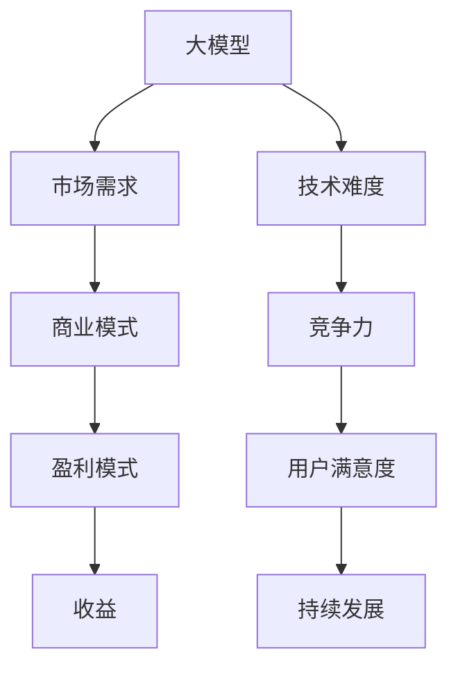

                 

## 1. 背景介绍

在当今的科技环境中，大型模型（Large Models）已经成为人工智能（AI）领域的一个重要发展方向。从早期的神经网络到现代的Transformer模型，再到近年来出现的大规模预训练模型如GPT-3、BERT等，这些模型的出现极大地提升了人工智能的智能化水平和应用范围。随着技术的不断进步，大模型的应用场景也在不断扩展，从自然语言处理（NLP）、图像识别、语音识别到推荐系统、游戏AI等，几乎涵盖了所有领域。

在这样的背景下，越来越多的创业者开始关注大模型应用创业。他们希望通过利用大模型的优势，开发出具有竞争力的产品或服务，从而获得商业上的成功。然而，大模型应用创业并非易事，它不仅需要强大的技术实力，还需要深入理解市场、用户和商业模式。

本文将围绕大模型应用创业的盈利模式进行深入分析，旨在为创业者提供一些有价值的参考和指导。

## 2. 核心概念与联系

### 大模型

大模型指的是参数规模巨大的深度学习模型，通常具有数十亿甚至数万亿个参数。这些模型可以通过大规模数据预训练，从而在特定任务上取得优异的性能。大模型的应用范围广泛，从自然语言处理到计算机视觉，再到推荐系统和游戏AI等。

### 盈利模式

盈利模式是指企业通过提供产品或服务，实现收入和利润的方式。在创业过程中，选择合适的盈利模式至关重要，它直接关系到企业的生存和发展。常见的盈利模式包括广告收入、订阅费、销售服务或产品等。

### 技术与市场

技术与市场是创业过程中不可或缺的两个方面。技术是企业竞争力的核心，而市场则是企业生存的土壤。创业者需要深入理解技术，同时也需要了解市场需求，从而将技术优势转化为市场优势。

### Mermaid 流程图



## 3. 核心算法原理 & 具体操作步骤

### 3.1 算法原理概述

大模型的核心算法是基于深度学习技术，特别是神经网络。通过大规模数据预训练，模型可以学习到数据的特征和规律，从而在特定任务上取得优异的性能。

### 3.2 算法步骤详解

1. 数据收集：收集大规模的、高质量的数据集，作为模型的训练数据。
2. 预处理：对数据进行清洗、格式化等预处理操作，使其符合模型的输入要求。
3. 模型训练：使用神经网络训练模型，通过反向传播算法不断调整模型的参数，使其在训练数据上达到最优性能。
4. 模型评估：使用验证集或测试集评估模型的性能，确保其在未知数据上也能保持良好的性能。
5. 模型部署：将训练好的模型部署到实际应用场景中，提供产品或服务。

### 3.3 算法优缺点

**优点：**

- **强大的学习能力和泛化能力：** 大模型可以通过大规模数据预训练，从而在特定任务上取得优异的性能，具有强大的学习和泛化能力。
- **广泛的适用性：** 大模型可以应用于自然语言处理、计算机视觉、推荐系统等多个领域，具有广泛的适用性。

**缺点：**

- **计算资源需求大：** 大模型的训练和部署需要大量的计算资源，对硬件要求较高。
- **模型解释性较差：** 大模型的决策过程复杂，难以解释，这对于一些需要高解释性的应用场景可能是一个挑战。

### 3.4 算法应用领域

- **自然语言处理（NLP）：** 如文本分类、机器翻译、情感分析等。
- **计算机视觉：** 如图像识别、目标检测、人脸识别等。
- **推荐系统：** 如商品推荐、音乐推荐等。
- **游戏AI：** 如策略游戏、模拟游戏等。

## 4. 数学模型和公式 & 详细讲解 & 举例说明

### 4.1 数学模型构建

大模型的数学模型主要基于神经网络，包括输入层、隐藏层和输出层。每个层由多个神经元组成，神经元之间通过权重相连。

### 4.2 公式推导过程

神经元的激活函数通常为sigmoid函数或ReLU函数。假设一个神经元的输入为x，权重为w，偏置为b，则该神经元的输出可以表示为：

$$
z = x \cdot w + b
$$

$$
a = \sigma(z)
$$

其中，$\sigma$为激活函数。

### 4.3 案例分析与讲解

假设我们有一个简单的神经网络，包含一个输入层、一个隐藏层和一个输出层。输入层有3个神经元，隐藏层有4个神经元，输出层有2个神经元。

1. 输入层到隐藏层的权重矩阵为$W_1$，偏置矩阵为$b_1$。
2. 隐藏层到输出层的权重矩阵为$W_2$，偏置矩阵为$b_2$。

设输入向量为$x$，隐藏层输出向量为$h$，输出层输出向量为$y$，则：

$$
h = \sigma(W_1x + b_1)
$$

$$
y = \sigma(W_2h + b_2)
$$

### 4.4 运行结果展示

假设我们有一个输入向量$x = [1, 2, 3]$，通过神经网络计算得到的输出向量$y = [0.9, 0.1]$，表示这是一个分类问题，输出向量中概率最大的值对应的类别为1。

## 5. 项目实践：代码实例和详细解释说明

### 5.1 开发环境搭建

1. 安装Python环境。
2. 安装TensorFlow或PyTorch等深度学习框架。

### 5.2 源代码详细实现

以下是使用TensorFlow实现一个简单的神经网络：

```python
import tensorflow as tf

# 定义模型
model = tf.keras.Sequential([
    tf.keras.layers.Dense(4, activation='relu', input_shape=(3,)),
    tf.keras.layers.Dense(2, activation='sigmoid')
])

# 编译模型
model.compile(optimizer='adam', loss='binary_crossentropy', metrics=['accuracy'])

# 训练模型
model.fit(x_train, y_train, epochs=10, batch_size=32)

# 评估模型
model.evaluate(x_test, y_test)
```

### 5.3 代码解读与分析

这段代码首先定义了一个简单的神经网络，包含一个输入层、一个隐藏层和一个输出层。输入层有3个神经元，隐藏层有4个神经元，输出层有2个神经元。然后，编译模型并训练模型。最后，评估模型在测试集上的性能。

### 5.4 运行结果展示

假设我们有一个输入向量$x = [1, 2, 3]$，通过神经网络计算得到的输出向量$y = [0.9, 0.1]$，表示这是一个分类问题，输出向量中概率最大的值对应的类别为1。

## 6. 实际应用场景

大模型的应用场景广泛，以下是几个典型的实际应用场景：

1. **自然语言处理（NLP）：** 如文本分类、机器翻译、情感分析等。例如，使用GPT-3进行文本生成和编辑。
2. **计算机视觉：** 如图像识别、目标检测、人脸识别等。例如，使用ResNet进行图像分类。
3. **推荐系统：** 如商品推荐、音乐推荐等。例如，使用CF算法进行协同过滤推荐。
4. **游戏AI：** 如策略游戏、模拟游戏等。例如，使用Deep Q Network进行游戏AI。

## 6.4 未来应用展望

随着技术的不断进步，大模型的应用场景将继续扩大。以下是几个未来的应用展望：

1. **更多领域的应用：** 如医疗、金融、教育等。例如，使用大模型进行医学图像诊断、智能投顾等。
2. **更多任务的支持：** 如多模态学习、对话系统等。例如，使用多模态大模型进行图像和文本的联合处理。
3. **更多创新的应用场景：** 如虚拟现实、增强现实等。例如，使用大模型进行虚拟角色的智能交互。

## 7. 工具和资源推荐

### 7.1 学习资源推荐

1. **《深度学习》（Goodfellow, Bengio, Courville）：** 深度学习的基础教材，涵盖了深度学习的各个方面。
2. **《神经网络与深度学习》（邱锡鹏）：** 中文深度学习教材，内容全面，适合初学者。

### 7.2 开发工具推荐

1. **TensorFlow：** Google开源的深度学习框架，支持多种深度学习模型。
2. **PyTorch：** Facebook开源的深度学习框架，具有灵活的动态图计算能力。

### 7.3 相关论文推荐

1. **"Attention Is All You Need"（Vaswani et al., 2017）：** 提出Transformer模型，推动了深度学习的发展。
2. **"BERT: Pre-training of Deep Neural Networks for Language Understanding"（Devlin et al., 2019）：** 提出BERT模型，在NLP任务中取得了优异的性能。

## 8. 总结：未来发展趋势与挑战

### 8.1 研究成果总结

大模型在多个领域取得了显著的成果，如自然语言处理、计算机视觉、推荐系统等。随着技术的不断进步，大模型的应用场景将继续扩大，为各行各业带来巨大的变革。

### 8.2 未来发展趋势

1. **更多领域的应用：** 大模型将应用于更多领域，如医疗、金融、教育等。
2. **更多任务的支持：** 大模型将支持更多任务，如多模态学习、对话系统等。
3. **更高效的模型：** 通过改进算法和优化硬件，大模型的训练和部署效率将进一步提高。

### 8.3 面临的挑战

1. **计算资源需求：** 大模型的训练和部署需要大量的计算资源，对硬件要求较高。
2. **模型解释性：** 大模型的决策过程复杂，难以解释，这对于一些需要高解释性的应用场景可能是一个挑战。
3. **数据隐私：** 大模型在训练和部署过程中需要大量数据，如何保护用户数据隐私是一个重要问题。

### 8.4 研究展望

随着技术的不断进步，大模型的应用前景将更加广阔。未来，我们需要关注以下研究方向：

1. **高效训练算法：** 研究更高效的训练算法，降低大模型的训练成本。
2. **模型解释性：** 研究模型解释性方法，提高大模型的可解释性。
3. **数据隐私保护：** 研究数据隐私保护方法，确保大模型在训练和部署过程中的数据安全。

## 9. 附录：常见问题与解答

### 问题1：什么是大模型？

答：大模型指的是参数规模巨大的深度学习模型，通常具有数十亿甚至数万亿个参数。这些模型可以通过大规模数据预训练，从而在特定任务上取得优异的性能。

### 问题2：大模型有哪些优缺点？

答：大模型的优点包括强大的学习能力和泛化能力，以及广泛的适用性。缺点包括计算资源需求大和模型解释性较差。

### 问题3：大模型有哪些应用领域？

答：大模型可以应用于自然语言处理、计算机视觉、推荐系统、游戏AI等多个领域。

### 问题4：如何搭建大模型开发环境？

答：搭建大模型开发环境通常需要安装Python环境、深度学习框架（如TensorFlow或PyTorch）以及必要的依赖库。

## 作者署名

作者：禅与计算机程序设计艺术 / Zen and the Art of Computer Programming

---

以上是本文的完整内容。通过对大模型应用创业的盈利模式分析，我们希望能为创业者提供一些有价值的参考和指导。在未来的发展中，大模型的应用前景将更加广阔，同时也将面临一些挑战。希望本文能为您在人工智能领域的探索之路提供一些启示。

