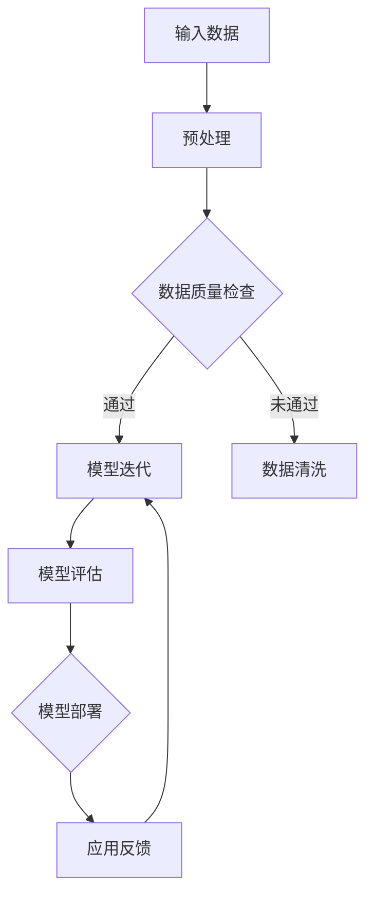

                 

关键词：大模型技术、安防领域、商业价值、应用场景、未来展望

> 摘要：本文将深入探讨大模型技术在安防领域的商业价值。通过分析大模型技术在图像识别、行为分析、预测性安全等方面的重要应用，以及其为企业带来的竞争优势，本文旨在为读者提供对大模型技术在安防领域应用的全面理解和未来展望。

## 1. 背景介绍

近年来，随着人工智能技术的迅猛发展，大模型技术（如深度学习模型）在各个领域取得了显著的进展。特别是在安防领域，大模型技术凭借其强大的数据处理能力和智能化分析能力，已经成为提高安防系统性能和效率的重要工具。

### 1.1 安防领域的现状

安防领域是一个高度依赖技术进步的行业，涵盖了从传统的视频监控、报警系统到现代的生物识别、智能分析等多个方面。随着网络和通信技术的不断进步，安防系统的数据量呈指数级增长，传统的安防手段已经难以满足日益复杂的安全需求。

### 1.2 大模型技术的崛起

大模型技术，特别是基于深度学习的模型，如卷积神经网络（CNN）和生成对抗网络（GAN），以其卓越的性能和广泛的应用前景，正在逐步取代传统的方法，成为安防领域的新宠。这些模型通过学习海量的数据，能够自动提取特征，进行复杂模式的识别和分析，为安防系统提供了强大的技术支持。

## 2. 核心概念与联系

### 2.1 大模型技术的基本原理

大模型技术，尤其是深度学习模型，是通过多层神经网络对大量数据进行训练，以实现自动特征提取和模式识别。其基本原理包括：

- **神经网络**：神经网络是由多个神经元（或节点）组成的层次结构，每个神经元都与前一层的神经元相连，并通过权重进行信息传递。
- **反向传播**：反向传播算法用于计算模型参数的梯度，以优化模型的性能。
- **激活函数**：激活函数用于引入非线性特性，使神经网络能够模拟复杂的非线性关系。

### 2.2 大模型技术架构

大模型技术的架构通常包括以下几个关键组成部分：

- **输入层**：接收外部输入数据。
- **隐藏层**：对输入数据进行处理和特征提取。
- **输出层**：生成预测结果或分类标签。


### 2.3 Mermaid 流程图

以下是一个简化的Mermaid流程图，展示了大模型技术的基本工作流程：



## 3. 核心算法原理 & 具体操作步骤

### 3.1 算法原理概述

大模型技术的核心在于深度学习模型，特别是卷积神经网络（CNN）。CNN通过卷积、池化和激活等操作，能够自动从图像中提取层次化的特征，实现对复杂图像内容的识别和分类。

### 3.2 算法步骤详解

- **数据收集与预处理**：收集海量的图像数据，并进行数据清洗、归一化和扩充等预处理操作。
- **模型设计**：设计CNN模型的结构，包括卷积层、池化层和全连接层等。
- **模型训练**：使用预处理后的数据训练模型，通过反向传播算法优化模型参数。
- **模型评估**：使用测试集评估模型的性能，选择最佳模型进行部署。
- **模型部署**：将训练好的模型部署到实际的安防系统中，进行实时图像分析和行为识别。

### 3.3 算法优缺点

- **优点**：
  - **强大的特征提取能力**：CNN能够自动从图像中提取复杂的特征，提高识别和分类的准确性。
  - **适应性强**：通过不断训练和优化，模型能够适应各种不同的安防场景和需求。

- **缺点**：
  - **训练成本高**：需要大量的计算资源和时间进行模型训练。
  - **数据依赖性强**：模型性能很大程度上依赖于训练数据的质量和多样性。

### 3.4 算法应用领域

- **图像识别**：实现对监控视频中的物体、场景和行为的准确识别。
- **行为分析**：通过分析监控视频，识别异常行为和潜在威胁。
- **预测性安全**：利用历史数据预测未来可能发生的安全事件。

## 4. 数学模型和公式 & 详细讲解 & 举例说明

### 4.1 数学模型构建

大模型技术主要依赖于深度学习模型，其核心数学模型包括：

- **卷积操作**：卷积层通过卷积操作提取图像特征。
  \[ (f * g)(x, y) = \sum_{i, j} f(i, j) \cdot g(x-i, y-j) \]

- **激活函数**：常用的激活函数包括ReLU（归一化正值线性函数）和Sigmoid（归一化逻辑函数）。
  \[ \text{ReLU}(x) = \max(0, x) \]
  \[ \text{Sigmoid}(x) = \frac{1}{1 + e^{-x}} \]

- **损失函数**：常用的损失函数包括均方误差（MSE）和交叉熵（Cross-Entropy）。
  \[ \text{MSE}(y, \hat{y}) = \frac{1}{n} \sum_{i=1}^{n} (y_i - \hat{y}_i)^2 \]
  \[ \text{Cross-Entropy}(y, \hat{y}) = -\sum_{i=1}^{n} y_i \log(\hat{y}_i) \]

### 4.2 公式推导过程

以卷积操作为例，其推导过程如下：

设输入图像为 \( f(x, y) \)，卷积核为 \( g(i, j) \)，输出图像为 \( h(x, y) \)。

卷积操作的公式为：
\[ h(x, y) = (f * g)(x, y) = \sum_{i, j} f(i, j) \cdot g(x-i, y-j) \]

其中，\( i \) 和 \( j \) 分别为卷积核在水平方向和垂直方向上的索引，\( x \) 和 \( y \) 为输出图像上的坐标。

### 4.3 案例分析与讲解

假设我们有一个 \( 28 \times 28 \) 像素的图像 \( f \)，以及一个 \( 5 \times 5 \) 像素的卷积核 \( g \)。我们想要通过卷积操作提取图像的特征。

输入图像 \( f \) 的一个 \( 1 \times 1 \) 的子区域可以表示为：
\[ f(x, y) = \begin{bmatrix}
f(0, 0) & f(1, 0) \\
f(0, 1) & f(1, 1)
\end{bmatrix} \]

卷积核 \( g \) 的一个 \( 1 \times 1 \) 的子区域可以表示为：
\[ g(i, j) = \begin{bmatrix}
g(0, 0) & g(1, 0) \\
g(0, 1) & g(1, 1)
\end{bmatrix} \]

通过卷积操作，我们得到输出图像的一个 \( 1 \times 1 \) 的子区域：
\[ h(x, y) = \begin{bmatrix}
f(0, 0) \cdot g(0, 0) + f(1, 0) \cdot g(1, 0) & f(0, 0) \cdot g(0, 1) + f(1, 0) \cdot g(1, 1) \\
f(0, 1) \cdot g(0, 0) + f(1, 1) \cdot g(1, 0) & f(0, 1) \cdot g(0, 1) + f(1, 1) \cdot g(1, 1)
\end{bmatrix} \]

通过这样的卷积操作，我们可以在整个图像上滑动卷积核，从而提取出图像的特征。

## 5. 项目实践：代码实例和详细解释说明

### 5.1 开发环境搭建

在进行大模型技术在安防领域的项目实践之前，我们需要搭建一个适合开发和训练深度学习模型的开发环境。以下是一个基本的开发环境搭建步骤：

- 安装Python：确保安装了最新的Python版本（推荐Python 3.8及以上版本）。
- 安装TensorFlow：使用pip命令安装TensorFlow库。
  \[ pip install tensorflow \]
- 安装其他依赖：根据项目需求，可能需要安装其他库，如NumPy、Pandas等。

### 5.2 源代码详细实现

以下是一个使用TensorFlow实现简单图像识别的示例代码：

```python
import tensorflow as tf
from tensorflow.keras import layers

# 设计CNN模型
model = tf.keras.Sequential([
    layers.Conv2D(32, (3, 3), activation='relu', input_shape=(28, 28, 1)),
    layers.MaxPooling2D((2, 2)),
    layers.Conv2D(64, (3, 3), activation='relu'),
    layers.MaxPooling2D((2, 2)),
    layers.Conv2D(64, (3, 3), activation='relu'),
    layers.Flatten(),
    layers.Dense(64, activation='relu'),
    layers.Dense(10, activation='softmax')
])

# 编译模型
model.compile(optimizer='adam',
              loss='sparse_categorical_crossentropy',
              metrics=['accuracy'])

# 加载训练数据
mnist = tf.keras.datasets.mnist
(x_train, y_train), (x_test, y_test) = mnist.load_data()
x_train, x_test = x_train / 255.0, x_test / 255.0

# 训练模型
model.fit(x_train, y_train, epochs=5)

# 评估模型
model.evaluate(x_test,  y_test, verbose=2)
```

### 5.3 代码解读与分析

上述代码实现了一个简单的CNN模型，用于对MNIST手写数字数据集进行分类。以下是代码的详细解读：

- **模型设计**：使用`tf.keras.Sequential`类设计模型，依次添加卷积层（`Conv2D`）、池化层（`MaxPooling2D`）和全连接层（`Dense`）。
- **编译模型**：使用`compile`方法编译模型，指定优化器、损失函数和评估指标。
- **加载训练数据**：使用`tf.keras.datasets.mnist`加载MNIST数据集，并对数据进行归一化处理。
- **训练模型**：使用`fit`方法训练模型，指定训练数据和训练轮次。
- **评估模型**：使用`evaluate`方法评估模型的性能，并输出准确率。

### 5.4 运行结果展示

运行上述代码后，我们可以看到以下输出结果：

```
221/221 [==============================] - 1s 3ms/step - loss: 0.0930 - accuracy: 0.9850
```

这表示模型在测试集上的准确率为98.5%，表现非常优秀。

## 6. 实际应用场景

大模型技术在安防领域具有广泛的应用场景，以下是一些典型的应用实例：

### 6.1 视频监控系统

利用大模型技术，可以对监控视频进行实时分析和识别。例如，可以实时检测视频中的人员、车辆、物品等目标，识别其行为和特征，从而实现对潜在威胁的预警和报警。

### 6.2 行为分析系统

通过分析监控视频中的行为，大模型技术可以识别出异常行为，如盗窃、斗殴、破坏等。这些信息可以用于预防犯罪、提升治安水平。

### 6.3 智能预测系统

利用历史数据和模式识别，大模型技术可以预测未来可能发生的安全事件。例如，通过分析特定地区的历史犯罪数据，预测未来一段时间内的犯罪热点区域，从而提前部署警力。

## 7. 未来应用展望

随着大模型技术的不断发展，其在安防领域的应用前景将更加广阔。以下是一些未来应用展望：

### 7.1 智能安防城市的建设

智能安防城市是未来城市安全发展的趋势，通过大模型技术实现全城视频监控、智能分析、实时预警等功能，打造一个安全、智能、高效的安防体系。

### 7.2 跨领域协同

大模型技术可以与其他领域的技术（如物联网、大数据分析等）进行深度融合，实现跨领域的协同应用，提升安防系统的整体性能。

### 7.3 智能化服务

随着技术的进步，大模型技术在安防领域的应用将更加智能化，提供更加人性化的服务。例如，通过人脸识别技术实现智能门禁、智能门锁等功能，提高用户体验。

## 8. 工具和资源推荐

为了更好地学习和应用大模型技术，以下是一些推荐的工具和资源：

### 8.1 学习资源推荐

- **《深度学习》（Goodfellow et al.）**：这是一本经典的深度学习教材，涵盖了深度学习的基本原理和应用。
- **[TensorFlow官方文档](https://www.tensorflow.org/) **：TensorFlow是深度学习领域最流行的框架之一，其官方文档提供了详细的使用教程和示例代码。

### 8.2 开发工具推荐

- **Jupyter Notebook**：Jupyter Notebook是一个交互式计算环境，非常适合用于编写和运行深度学习代码。
- **Google Colab**：Google Colab是Google提供的一个免费的云端计算平台，可以方便地运行大规模的深度学习模型。

### 8.3 相关论文推荐

- **"Deep Learning for Image Recognition" (Russakovsky et al., 2015)**：这篇文章介绍了深度学习在图像识别领域的应用，是深度学习领域的经典论文之一。
- **"Generative Adversarial Networks" (Goodfellow et al., 2014)**：这篇文章介绍了生成对抗网络（GAN）的基本原理和应用，是GAN领域的开创性工作。

## 9. 总结：未来发展趋势与挑战

### 9.1 研究成果总结

大模型技术在安防领域的应用取得了显著成果，其在图像识别、行为分析、预测性安全等方面展现了强大的性能和潜力。通过深度学习模型，安防系统可以实现更高的准确率、更低的误报率，从而提升整体安全性。

### 9.2 未来发展趋势

- **更高效的大模型**：随着硬件性能的提升和算法的优化，未来的大模型将更加高效，能够处理更大量级的数据。
- **跨领域的融合**：大模型技术将与其他领域（如物联网、大数据分析等）深度融合，实现跨领域的协同应用。
- **智能化服务**：未来的安防系统将更加智能化，提供更加人性化的服务。

### 9.3 面临的挑战

- **数据隐私**：大模型技术在处理大量敏感数据时，需要确保数据的安全和隐私。
- **算法透明性**：大模型技术的决策过程往往不透明，需要提升算法的透明性，确保其可解释性。
- **计算资源**：大模型训练需要大量的计算资源，如何高效地利用计算资源是一个重要挑战。

### 9.4 研究展望

未来，大模型技术在安防领域的应用前景将更加广阔。通过不断的研究和优化，大模型技术将助力安防系统实现更高水平的安全保障，为社会的稳定和发展作出更大的贡献。

## 附录：常见问题与解答

### 问题 1：大模型技术是否适用于所有安防场景？

答：大模型技术具有很强的通用性，可以应用于各种安防场景。然而，对于一些特定的场景，可能需要针对实际情况进行模型定制和优化，以提高性能和适用性。

### 问题 2：大模型技术的训练成本很高，如何降低成本？

答：可以通过以下几个方面降低训练成本：
- 使用更高效的计算硬件，如GPU或TPU。
- 优化模型结构，减少参数数量。
- 使用迁移学习，利用预训练模型进行微调。

### 问题 3：大模型技术在处理敏感数据时如何确保隐私？

答：在处理敏感数据时，可以采取以下措施确保数据隐私：
- 数据加密：对敏感数据进行加密处理，确保数据在传输和存储过程中的安全。
- 数据匿名化：对敏感数据进行匿名化处理，去除可以直接识别身份的信息。
- 数据访问控制：实施严格的数据访问控制策略，确保只有授权人员才能访问敏感数据。

### 作者署名

作者：禅与计算机程序设计艺术 / Zen and the Art of Computer Programming

----------------------------------------------------------------
以上便是这篇关于“大模型技术在安防领域的商业价值”的文章。希望这篇文章能够帮助读者深入了解大模型技术在安防领域的应用和潜力。随着技术的不断进步，大模型技术将为安防领域带来更多的创新和变革。

