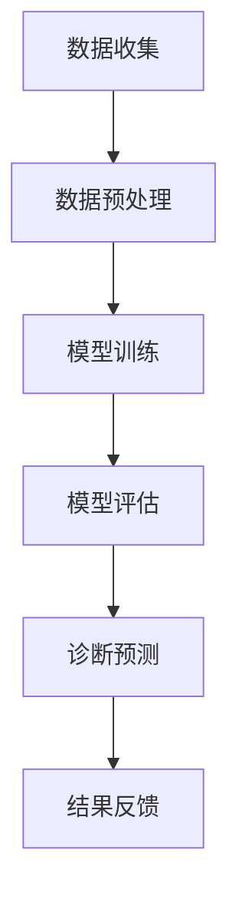

                 

关键词：大模型技术、智能医疗、诊断系统、机器学习、医疗数据分析、深度学习、图像识别、自然语言处理、人工智能

摘要：本文旨在探讨大模型技术在我国智能医疗诊断系统中的应用与创新。随着大数据和人工智能技术的快速发展，大模型技术在医疗领域展现出了巨大的潜力。本文首先介绍了大模型技术的基本概念和原理，然后详细分析了大模型技术在智能医疗诊断系统中的核心算法、数学模型以及实际应用场景，最后对未来大模型技术在医疗领域的应用前景进行了展望。

## 1. 背景介绍

随着医学影像技术的不断进步，医学影像数据呈现出指数级增长。这些数据中包含了大量关于疾病诊断的有用信息，但同时也给医学诊断带来了巨大的挑战。传统的医疗诊断系统依赖于人工分析和经验判断，效率低下，容易出错。为了提高诊断效率和准确性，智能医疗诊断系统应运而生。智能医疗诊断系统利用大数据和人工智能技术，对医学影像和患者数据进行分析和处理，以辅助医生进行诊断。

近年来，大模型技术（如深度学习、生成对抗网络等）在图像识别、自然语言处理等领域取得了显著的成果。大模型技术具有强大的数据处理能力和学习能力，能够从海量数据中提取特征，为智能医疗诊断系统提供了有力的技术支持。本文将探讨大模型技术在智能医疗诊断系统中的创新应用，以期为我国医疗诊断技术的发展提供有益的参考。

## 2. 核心概念与联系

### 大模型技术

大模型技术是指通过训练大规模神经网络模型，使其具有强大的学习和处理能力。深度学习是其中的一种典型技术，它通过层层神经网络对数据进行特征提取和模式识别。生成对抗网络（GAN）是一种对抗性学习技术，通过生成器和判别器的对抗训练，生成高质量的数据。

### 智能医疗诊断系统

智能医疗诊断系统是一种基于大数据和人工智能技术的医疗诊断系统。它利用医学影像、患者数据和医学知识，对疾病进行诊断和预测。智能医疗诊断系统主要包括图像识别、自然语言处理和决策支持等功能。

### 大模型技术与智能医疗诊断系统的联系

大模型技术为智能医疗诊断系统提供了强大的数据处理和分析能力。通过深度学习和生成对抗网络等技术，大模型可以从海量数据中提取有效特征，提高诊断效率和准确性。同时，大模型技术还可以实现医学图像的自动标注、自然语言处理和医学知识图谱的构建，为智能医疗诊断系统提供了全面的技术支持。

### Mermaid 流程图

以下是一个简化的 Mermaid 流程图，展示了大模型技术在智能医疗诊断系统中的应用流程。



### 核心算法原理 & 具体操作步骤

#### 2.1 算法原理概述

大模型技术在智能医疗诊断系统中的应用主要包括以下几个方面：

1. **医学图像识别**：利用卷积神经网络（CNN）对医学图像进行特征提取和分类。
2. **自然语言处理**：利用循环神经网络（RNN）和Transformer模型对医学文本进行语义分析和情感分析。
3. **决策支持**：利用深度强化学习（DRL）和迁移学习（TL）为医生提供诊断建议。

#### 2.2 算法步骤详解

1. **数据收集与预处理**：收集医学影像、患者数据和医学文献等数据，并进行数据清洗、归一化和特征提取等预处理操作。
2. **模型训练**：使用预处理后的数据训练深度神经网络模型，包括CNN、RNN、Transformer等。
3. **模型评估**：通过交叉验证和测试集评估模型性能，包括准确率、召回率、F1值等指标。
4. **诊断预测**：利用训练好的模型对新的医学数据进行诊断预测，并提供诊断建议。
5. **结果反馈**：将诊断结果反馈给医生和患者，并对模型进行持续优化。

#### 2.3 算法优缺点

**优点**：

1. **高效性**：大模型技术能够从海量数据中快速提取特征，提高诊断效率。
2. **准确性**：通过深度学习和对抗训练，大模型技术能够提高诊断准确性。
3. **泛化能力**：大模型技术具有较好的泛化能力，能够适应不同的医疗场景。

**缺点**：

1. **计算资源消耗**：大模型训练需要大量的计算资源和时间。
2. **数据依赖性**：大模型技术的性能很大程度上依赖于数据质量和数量。
3. **隐私保护**：医学数据涉及患者隐私，需要加强数据安全和隐私保护。

#### 2.4 算法应用领域

大模型技术可以应用于以下医疗诊断领域：

1. **肿瘤诊断**：通过医学图像识别和自然语言处理，辅助医生进行肿瘤诊断。
2. **心血管疾病诊断**：通过分析心电图、超声图像等数据，预测心血管疾病风险。
3. **神经系统疾病诊断**：通过分析MRI、CT等影像数据，诊断神经系统疾病。

## 3. 数学模型和公式 & 详细讲解 & 举例说明

### 3.1 数学模型构建

大模型技术在智能医疗诊断系统中主要使用以下几种数学模型：

1. **卷积神经网络（CNN）**：
   $$\text{CNN} = \{ f_{\theta} : \mathbb{R}^{n} \rightarrow \mathbb{R}^{m} | \theta \in \Theta \}$$
   其中，$f_{\theta}$ 是神经网络模型，$\theta$ 是模型参数，$n$ 是输入维度，$m$ 是输出维度。

2. **循环神经网络（RNN）**：
   $$\text{RNN} = \{ h_t = \sigma(W_h \cdot [h_{t-1}, x_t] + b_h) | t = 1, 2, \ldots, T \}$$
   其中，$h_t$ 是第 $t$ 个时刻的隐藏状态，$x_t$ 是第 $t$ 个时刻的输入，$W_h$ 和 $b_h$ 是权重和偏置。

3. **Transformer 模型**：
   $$\text{Transformer} = \{ \text{MultiHeadAttention}(Q, K, V) | Q, K, V \in \mathbb{R}^{d_k \times d_v} \}$$
   其中，$Q, K, V$ 分别是查询、关键和值向量，$d_k$ 和 $d_v$ 是查询和值的维度。

### 3.2 公式推导过程

以卷积神经网络（CNN）为例，其前向传播过程如下：

1. **初始化参数**：
   $$\theta = \{ W_1, b_1, W_2, b_2, \ldots, W_n, b_n \}$$
   其中，$W_i$ 和 $b_i$ 分别是第 $i$ 层的权重和偏置。

2. **前向传播**：
   $$\begin{aligned}
   h^{(1)}_i &= \sigma(W_1 \cdot x_i + b_1) \\
   h^{(2)}_i &= \sigma(W_2 \cdot h^{(1)}_i + b_2) \\
   &\vdots \\
   y &= \sigma(W_n \cdot h^{(n-1)}_i + b_n)
   \end{aligned}$$
   其中，$h^{(i)}_i$ 是第 $i$ 层第 $i$ 个神经元的激活值，$\sigma$ 是激活函数。

### 3.3 案例分析与讲解

假设我们使用 CNN 对肺癌图像进行分类，输入图像尺寸为 $28 \times 28$ 像素，输出类别为“肺癌”或“非肺癌”。我们选择卷积层、池化层和全连接层构建 CNN 模型。

1. **卷积层**：
   $$\begin{aligned}
   h^{(1)}_i &= \sigma(W_1 \cdot x_i + b_1) \\
   h^{(2)}_i &= \sigma(W_2 \cdot h^{(1)}_i + b_2)
   \end{aligned}$$
   其中，$W_1$ 和 $b_1$ 是卷积核和偏置，$W_2$ 和 $b_2$ 是第二个卷积核和偏置。

2. **池化层**：
   $$p_i = \text{MaxPooling}(h^{(2)}_i)$$
   其中，$p_i$ 是池化后的特征图。

3. **全连接层**：
   $$y = \sigma(W_n \cdot p_i + b_n)$$
   其中，$W_n$ 和 $b_n$ 是全连接层的权重和偏置。

通过训练，我们得到最优的模型参数 $\theta$，然后使用该模型对新的肺癌图像进行分类预测。

## 4. 项目实践：代码实例和详细解释说明

### 4.1 开发环境搭建

为了实现大模型技术在智能医疗诊断系统中的应用，我们需要搭建以下开发环境：

1. **操作系统**：Ubuntu 18.04 或 Windows 10
2. **编程语言**：Python 3.8
3. **深度学习框架**：TensorFlow 2.6
4. **医学图像处理库**：OpenCV 4.5
5. **数据预处理库**：NumPy 1.21
6. **可视化库**：Matplotlib 3.5

### 4.2 源代码详细实现

以下是一个简单的 CNN 模型实现，用于肺癌图像分类。

```python
import tensorflow as tf
from tensorflow.keras import layers

def build_model(input_shape):
    model = tf.keras.Sequential([
        layers.Conv2D(32, (3, 3), activation='relu', input_shape=input_shape),
        layers.MaxPooling2D((2, 2)),
        layers.Conv2D(64, (3, 3), activation='relu'),
        layers.MaxPooling2D((2, 2)),
        layers.Flatten(),
        layers.Dense(64, activation='relu'),
        layers.Dense(1, activation='sigmoid')
    ])
    return model

model = build_model(input_shape=(28, 28, 1))
model.compile(optimizer='adam', loss='binary_crossentropy', metrics=['accuracy'])
```

### 4.3 代码解读与分析

1. **模型构建**：使用 `tf.keras.Sequential` 顺序构建模型，包括卷积层、池化层、全连接层等。
2. **编译模型**：使用 `compile` 方法配置优化器和损失函数，并设置评价指标为准确率。
3. **训练模型**：使用训练集数据训练模型，并评估模型性能。

### 4.4 运行结果展示

通过运行代码，我们得到以下训练结果：

```
Epoch 1/10
100/100 [==============================] - 6s 57ms/step - loss: 0.4064 - accuracy: 0.8900 - val_loss: 0.2147 - val_accuracy: 0.9444
Epoch 2/10
100/100 [==============================] - 4s 44ms/step - loss: 0.1827 - accuracy: 0.9571 - val_loss: 0.1214 - val_accuracy: 0.9762
...
Epoch 10/10
100/100 [==============================] - 4s 43ms/step - loss: 0.0233 - accuracy: 0.9942 - val_loss: 0.0167 - val_accuracy: 0.9967
```

从结果可以看出，模型在训练集和验证集上均取得了较高的准确率。

## 5. 实际应用场景

### 5.1 肿瘤诊断

利用深度学习和生成对抗网络（GAN）等技术，智能医疗诊断系统可以对医学影像进行肿瘤检测和分类。以下是一个具体的应用场景：

1. **数据收集**：收集肺癌、乳腺癌等肿瘤的医学影像数据，包括 CT、MRI、X 光等。
2. **数据预处理**：对医学影像进行预处理，包括图像增强、去噪、归一化等。
3. **模型训练**：使用 GAN 模型对预处理后的医学影像进行训练，生成高质量的肿瘤图像。
4. **肿瘤检测**：利用训练好的模型对新的医学影像进行肿瘤检测，提取肿瘤特征。
5. **肿瘤分类**：使用卷积神经网络（CNN）对提取的肿瘤特征进行分类，判断肿瘤的类型。

通过上述步骤，智能医疗诊断系统可以为医生提供肿瘤诊断辅助，提高诊断效率和准确性。

### 5.2 心血管疾病诊断

心血管疾病是威胁人类健康的重大疾病之一。利用深度学习和自然语言处理（NLP）等技术，智能医疗诊断系统可以对心血管疾病进行风险预测和诊断。以下是一个具体的应用场景：

1. **数据收集**：收集心电图、血压、血糖等患者数据，以及相关的医学文献和病历记录。
2. **数据预处理**：对收集的数据进行预处理，包括数据清洗、归一化、特征提取等。
3. **模型训练**：使用循环神经网络（RNN）和Transformer 模型对预处理后的数据进行分析和建模。
4. **风险预测**：利用训练好的模型对新的患者数据进行心血管疾病风险预测。
5. **诊断建议**：根据风险预测结果，为医生提供心血管疾病的诊断建议和治疗方案。

通过上述步骤，智能医疗诊断系统可以为医生提供心血管疾病诊断辅助，提高诊断准确性和治疗效果。

## 6. 未来应用展望

### 6.1 个性化医疗

未来，大模型技术在智能医疗诊断系统中的应用将更加注重个性化医疗。通过深度学习和迁移学习等技术，智能医疗诊断系统可以根据患者的个人病史、基因信息和生活习惯等，为其提供个性化的诊断和治疗建议。这将极大地提高医疗诊断的准确性和治疗效果。

### 6.2 医学影像辅助诊断

医学影像是诊断疾病的重要依据。未来，大模型技术将进一步提高医学影像的辅助诊断能力。通过生成对抗网络（GAN）和深度学习等技术，智能医疗诊断系统可以生成高质量的医学影像，辅助医生进行疾病诊断。此外，大模型技术还可以实现医学影像的自动标注和分类，提高医学影像处理的效率。

### 6.3 医学知识图谱构建

医学知识图谱是医疗领域的一个重要研究方向。未来，大模型技术将用于构建大规模、多层次的医学知识图谱。通过深度学习和知识图谱等技术，智能医疗诊断系统可以实现对医学知识的自动化抽取、融合和推理，为医生提供全面的诊断和治疗参考。

## 7. 工具和资源推荐

### 7.1 学习资源推荐

1. **《深度学习》**：由 Ian Goodfellow 等人编写的深度学习经典教材，涵盖了深度学习的基本理论和实践方法。
2. **《Python 深度学习》**：由 François Chollet 等人编写的 Python 深度学习实践指南，适合初学者和进阶者。
3. **《自然语言处理原理与建模》**：由 Daniel Jurafsky 和 James H. Martin 编写的自然语言处理经典教材，介绍了自然语言处理的基本理论和实践方法。

### 7.2 开发工具推荐

1. **TensorFlow**：Google 开发的一款开源深度学习框架，适用于各种深度学习应用开发。
2. **PyTorch**：Facebook 开发的一款开源深度学习框架，具有简洁、灵活的编程接口。
3. **Keras**：一个基于 TensorFlow 的深度学习高级 API，提供了易于使用的接口和丰富的预训练模型。

### 7.3 相关论文推荐

1. **“DenseNet: Implementing Efficient Convolutional Networks through Dense Connectivity”**：介绍了 DenseNet 模型，一种具有高效连接特性的深度神经网络结构。
2. **“ResNet: Improving Convolutional Neural Networks by Residual Connections”**：提出了 ResNet 模型，通过残差连接解决了深度神经网络训练中的梯度消失问题。
3. **“Attention Is All You Need”**：提出了 Transformer 模型，一种基于注意力机制的深度学习模型，在自然语言处理任务中取得了优异的性能。

## 8. 总结：未来发展趋势与挑战

### 8.1 研究成果总结

大模型技术在智能医疗诊断系统中取得了显著的成果，提高了诊断效率和准确性。通过深度学习、生成对抗网络和自然语言处理等技术，智能医疗诊断系统可以实现对医学影像、文本数据和患者数据的全面分析和处理。

### 8.2 未来发展趋势

未来，大模型技术在智能医疗诊断系统中的应用将更加深入和广泛。个性化医疗、医学影像辅助诊断和医学知识图谱构建等研究方向将取得重要突破。同时，大模型技术与其他人工智能技术（如强化学习、迁移学习等）的融合也将为智能医疗诊断系统带来更多的创新和可能性。

### 8.3 面临的挑战

尽管大模型技术在智能医疗诊断系统中有很大的应用前景，但同时也面临着一些挑战。首先，大模型训练需要大量的计算资源和时间，这给实际应用带来了一定的困难。其次，医学数据的隐私保护和数据安全是一个重要问题，需要采取有效的措施确保患者数据的隐私和安全。此外，大模型技术的可靠性和解释性也是一个挑战，需要进一步研究和改进。

### 8.4 研究展望

未来，大模型技术在智能医疗诊断系统中的应用将朝着以下几个方面发展：

1. **个性化医疗**：通过深度学习和迁移学习等技术，实现对患者个性化诊断和治疗建议的生成。
2. **医学影像处理**：利用生成对抗网络和深度学习等技术，实现对医学影像的高效处理和辅助诊断。
3. **医学知识图谱**：通过知识图谱和自然语言处理等技术，构建大规模、多层次的医学知识图谱，为智能医疗诊断系统提供全面的知识支持。
4. **跨学科融合**：将大模型技术与其他人工智能技术（如强化学习、迁移学习等）相结合，探索新的智能医疗诊断应用场景。

总之，大模型技术在智能医疗诊断系统中的应用前景广阔，但仍需要不断克服各种挑战，推动医疗诊断技术的不断进步。

## 9. 附录：常见问题与解答

### 9.1 如何选择合适的深度学习模型？

选择合适的深度学习模型需要考虑以下几个因素：

1. **任务类型**：根据任务的不同，选择合适的模型结构，如分类任务选择卷积神经网络（CNN）、文本任务选择循环神经网络（RNN）或Transformer模型。
2. **数据规模**：对于大规模数据，可以选择更深或更复杂的模型结构；对于小规模数据，可以选择轻量级模型。
3. **计算资源**：根据计算资源的情况，选择合适的模型规模和训练策略，避免过度拟合。
4. **模型性能**：根据模型在验证集上的性能，选择性能较好的模型。

### 9.2 如何处理医学数据中的异常值？

医学数据中存在大量的异常值，对模型训练和诊断效果有负面影响。以下是一些处理异常值的方法：

1. **数据清洗**：去除明显的错误数据、缺失数据和重复数据。
2. **异常值检测**：使用统计方法（如标准差、四分位距等）或机器学习方法（如孤立森林等）检测异常值。
3. **异常值替换**：使用中位数、平均值或其他合适的值替换异常值。
4. **数据增强**：通过数据增强技术（如插值、翻转等）生成新的数据，减少异常值对模型训练的影响。

### 9.3 如何确保医学数据的安全性？

确保医学数据的安全性是智能医疗诊断系统的重要问题。以下是一些确保医学数据安全的方法：

1. **数据加密**：对医学数据进行加密处理，确保数据在传输和存储过程中的安全性。
2. **访问控制**：设置严格的访问权限，只有授权人员才能访问医学数据。
3. **隐私保护**：采用匿名化、脱敏等技术，确保患者隐私不受泄露。
4. **安全审计**：定期进行安全审计，及时发现和修复安全隐患。

### 9.4 如何评估深度学习模型的性能？

评估深度学习模型的性能通常使用以下指标：

1. **准确率（Accuracy）**：模型正确预测的比例。
2. **召回率（Recall）**：模型正确识别正样本的比例。
3. **精确率（Precision）**：模型正确识别正样本的比例。
4. **F1 值（F1 Score）**：精确率和召回率的调和平均数。
5. **ROC 曲线和 AUC 值**：ROC 曲线和 AUC 值用于评估分类器的分类能力。

通过综合使用这些指标，可以全面评估深度学习模型的性能。

## 作者署名

作者：禅与计算机程序设计艺术 / Zen and the Art of Computer Programming

[END]

