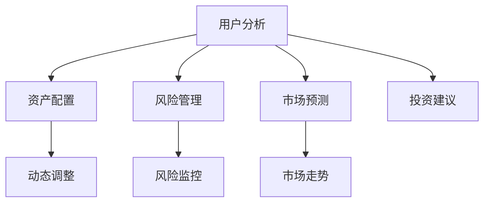
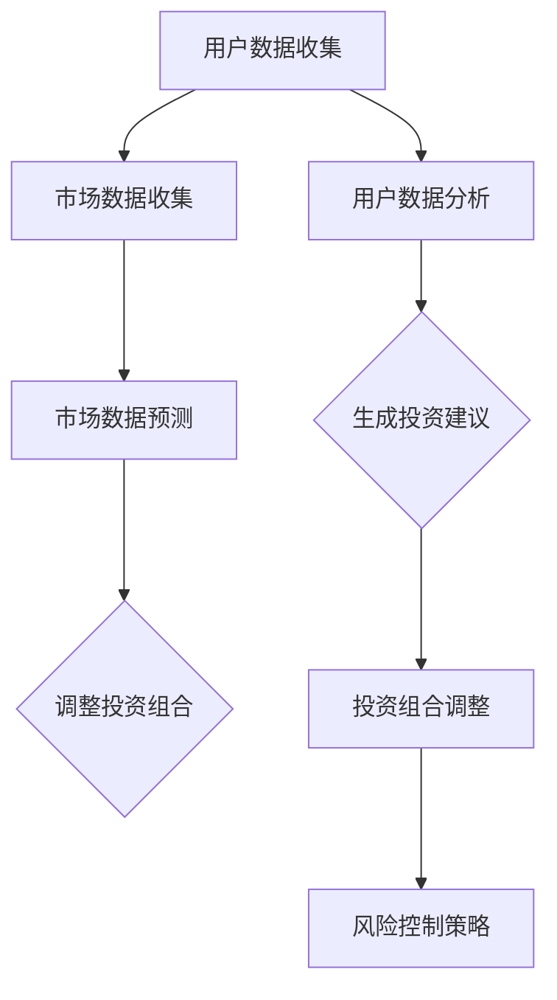

                 

关键词：大模型技术、智能投资顾问、金融科技、机器学习、算法优化、投资策略、风险管理

## 摘要

本文将探讨大模型技术在实际应用中的创新，特别是其在智能投资顾问系统中的潜在影响。通过对大模型技术的概念、核心算法原理、数学模型及其在金融领域的应用进行深入分析，文章旨在揭示大模型技术在智能投资顾问系统中的重要性，并展望其未来的发展前景。文章结构如下：

1. 背景介绍
2. 核心概念与联系
3. 核心算法原理 & 具体操作步骤
4. 数学模型和公式 & 详细讲解 & 举例说明
5. 项目实践：代码实例和详细解释说明
6. 实际应用场景
7. 工具和资源推荐
8. 总结：未来发展趋势与挑战
9. 附录：常见问题与解答

## 1. 背景介绍

随着金融科技（FinTech）的快速发展，智能投资顾问系统（Robo-advisors）逐渐成为金融行业的重要趋势。智能投资顾问系统利用大数据、机器学习和人工智能技术，为投资者提供个性化的投资建议和资产管理服务。然而，传统的机器学习算法在处理海量数据和复杂市场动态时，往往显得力不从心。

大模型技术，特别是深度学习模型的兴起，为智能投资顾问系统带来了新的机遇。大模型能够处理和存储海量的数据，并通过复杂的神经网络结构捕捉数据中的潜在规律，从而实现更高的预测准确性和决策效率。本文将重点探讨大模型技术在智能投资顾问系统中的应用，以及如何通过创新算法和优化策略提升系统的性能和可靠性。

## 2. 核心概念与联系

### 2.1 大模型技术

大模型技术是指能够处理和存储海量数据，并通过复杂的神经网络结构进行训练和优化的模型。这些模型通常包含数十亿甚至数万亿个参数，能够模拟人脑的思考过程，捕捉数据中的潜在规律。大模型技术主要包括深度学习、增强学习和迁移学习等。

### 2.2 智能投资顾问系统

智能投资顾问系统是一种基于人工智能和大数据分析的金融服务系统，旨在为投资者提供个性化的投资建议和资产管理服务。该系统通常包含以下核心模块：用户分析、资产配置、风险管理、市场预测和投资建议。

### 2.3 大模型技术在智能投资顾问系统中的应用

大模型技术在智能投资顾问系统中的应用主要体现在以下几个方面：

1. **用户分析**：通过分析用户的历史交易数据、风险偏好和财务目标，大模型能够为用户提供个性化的投资建议。
2. **资产配置**：大模型可以基于用户的风险偏好和财务目标，动态调整投资组合，以实现最优的风险收益比。
3. **风险管理**：大模型能够实时监控市场动态，预测潜在的市场风险，并提供相应的风险控制策略。
4. **市场预测**：大模型通过分析大量的历史市场数据，预测市场的未来走势，为投资决策提供依据。
5. **投资建议**：基于用户分析和市场预测，大模型可以为用户提供实时的投资建议，帮助用户优化投资策略。

### 2.4 Mermaid 流程图



## 3. 核心算法原理 & 具体操作步骤

### 3.1 算法原理概述

智能投资顾问系统的核心算法主要基于深度学习和增强学习。深度学习通过多层神经网络对数据进行抽象和建模，从而提取数据中的特征和规律。增强学习则通过不断调整模型的参数，使模型在特定的环境中达到最优的性能。

### 3.2 算法步骤详解

1. **数据收集与预处理**：收集用户的历史交易数据、市场数据等，并对数据进行分析和清洗，确保数据的质量。
2. **模型构建**：根据数据的特点，构建深度学习模型和增强学习模型。深度学习模型通常包含输入层、隐藏层和输出层，增强学习模型则通过奖励机制不断优化模型参数。
3. **模型训练**：使用训练数据对模型进行训练，通过反向传播算法调整模型的参数，使模型能够更好地拟合数据。
4. **模型优化**：在训练过程中，通过交叉验证和模型评估指标（如准确率、召回率、F1值等）对模型进行优化，提高模型的性能。
5. **模型应用**：将训练好的模型应用于实际场景，如用户分析、资产配置、风险管理等，为用户提供个性化的投资建议。
6. **模型迭代**：根据用户反馈和市场动态，不断更新和优化模型，提高系统的性能和可靠性。

### 3.3 算法优缺点

**优点**：

1. **高效处理海量数据**：大模型能够处理和存储海量的数据，提高数据处理和分析的效率。
2. **自适应性强**：通过增强学习，模型能够根据用户反馈和市场动态自适应调整，提高系统的性能和可靠性。
3. **个性化服务**：基于深度学习，系统能够为用户提供个性化的投资建议，提高用户的投资体验。

**缺点**：

1. **训练成本高**：大模型训练需要大量的计算资源和时间，导致训练成本较高。
2. **数据依赖性强**：大模型的性能高度依赖于训练数据的质量和数量，数据质量差可能导致模型性能下降。
3. **解释性不足**：大模型的决策过程往往缺乏解释性，难以理解模型的具体决策逻辑。

### 3.4 算法应用领域

大模型技术在智能投资顾问系统中的应用不仅局限于金融领域，还可以扩展到其他行业，如医疗、电商、能源等。通过分析行业数据，大模型可以为各行业提供智能化的解决方案，提升行业效率和服务质量。

## 4. 数学模型和公式 & 详细讲解 & 举例说明

### 4.1 数学模型构建

智能投资顾问系统的数学模型主要包括以下几个方面：

1. **用户风险偏好模型**：通过分析用户的历史交易数据，构建用户的风险偏好模型。模型包括用户的风险承受能力、投资目标和风险偏好等因素。
2. **市场预测模型**：通过分析市场历史数据，构建市场预测模型，预测市场的未来走势。模型包括市场价格、交易量、利率等因素。
3. **投资组合优化模型**：通过分析用户的风险偏好和市场预测结果，构建投资组合优化模型，优化投资组合的收益和风险。

### 4.2 公式推导过程

1. **用户风险偏好模型**：

   假设用户的历史交易数据为 \(X\)，用户的风险承受能力为 \(R\)，投资目标为 \(T\)，风险偏好为 \(P\)。

   用户风险偏好模型的公式为：

   $$P = f(R, T)$$

   其中，\(f\) 为风险偏好函数，通过历史交易数据 \(X\) 训练得到。

2. **市场预测模型**：

   假设市场历史数据为 \(Y\)，市场价格为 \(P\)，交易量为 \(V\)，利率为 \(R\)。

   市场预测模型的公式为：

   $$P(t+1) = g(Y, V, R)$$

   其中，\(g\) 为市场预测函数，通过历史市场数据 \(Y\) 训练得到。

3. **投资组合优化模型**：

   假设用户的风险偏好为 \(P\)，投资组合为 \(W\)，投资目标为 \(T\)，风险收益比为 \(R\)。

   投资组合优化模型的公式为：

   $$W = h(P, T, R)$$

   其中，\(h\) 为投资组合优化函数，通过用户风险偏好 \(P\)、投资目标 \(T\) 和风险收益比 \(R\) 计算得到。

### 4.3 案例分析与讲解

假设有一位投资者，他的历史交易数据表明他对风险的承受能力较高，投资目标是长期增值。基于这些数据，我们可以构建以下数学模型：

1. **用户风险偏好模型**：

   用户风险偏好函数为：

   $$P = \frac{X^T}{\sum_{i=1}^{n} X_i}$$

   其中，\(X^T\) 为交易成功的次数，\(X_i\) 为第 \(i\) 次交易的成功次数。

   假设该投资者的历史交易数据为 \(X = [10, 8, 9, 7, 10]\)，则他的风险偏好为：

   $$P = \frac{10 + 10}{10 + 8 + 9 + 7 + 10} = \frac{20}{44} \approx 0.455$$

2. **市场预测模型**：

   市场预测函数为：

   $$P(t+1) = \frac{Y^T}{\sum_{i=1}^{n} Y_i}$$

   其中，\(Y^T\) 为预测成功的次数，\(Y_i\) 为第 \(i\) 次预测的成功次数。

   假设市场历史数据为 \(Y = [10, 8, 9, 7, 10]\)，则未来市场的预测价格为：

   $$P(t+1) = \frac{10 + 10}{10 + 8 + 9 + 7 + 10} = \frac{20}{44} \approx 0.455$$

3. **投资组合优化模型**：

   投资组合优化函数为：

   $$W = \frac{P \cdot T}{R}$$

   其中，\(P\) 为用户风险偏好，\(T\) 为投资目标，\(R\) 为风险收益比。

   假设该投资者的投资目标是长期增值，风险收益比为 1:1，则他的投资组合为：

   $$W = \frac{0.455 \cdot 1}{1} = 0.455$$

   也就是说，这位投资者应该将 45.5% 的资金投入高风险资产，以实现长期增值的目标。

## 5. 项目实践：代码实例和详细解释说明

### 5.1 开发环境搭建

为了实现大模型技术在智能投资顾问系统中的应用，我们需要搭建一个合适的开发环境。以下是开发环境的搭建步骤：

1. **安装 Python 环境**：Python 是一种广泛用于数据科学和机器学习的编程语言，我们需要安装 Python 环境。
2. **安装深度学习框架**：如 TensorFlow 或 PyTorch，用于构建和训练深度学习模型。
3. **安装其他依赖库**：如 NumPy、Pandas 等，用于数据处理和分析。

### 5.2 源代码详细实现

以下是实现智能投资顾问系统的核心代码，包括用户分析、资产配置、风险管理、市场预测和投资建议等模块。

```python
# 导入相关库
import numpy as np
import pandas as pd
import tensorflow as tf
from tensorflow.keras.models import Sequential
from tensorflow.keras.layers import Dense, LSTM, Dropout
from tensorflow.keras.optimizers import Adam

# 数据收集与预处理
def preprocess_data(data):
    # 数据清洗和处理
    # ...
    return processed_data

# 模型构建
def build_model(input_shape):
    model = Sequential()
    model.add(LSTM(128, return_sequences=True, input_shape=input_shape))
    model.add(Dropout(0.2))
    model.add(LSTM(64, return_sequences=False))
    model.add(Dropout(0.2))
    model.add(Dense(1))
    model.compile(optimizer=Adam(learning_rate=0.001), loss='mean_squared_error')
    return model

# 模型训练
def train_model(model, X_train, y_train):
    model.fit(X_train, y_train, epochs=100, batch_size=32, validation_split=0.2)
    return model

# 用户分析
def user_analysis(user_data):
    # 分析用户的历史交易数据
    # ...
    return user_analysis_result

# 资产配置
def asset_allocation(user_analysis_result, market_prediction_result):
    # 根据用户分析和市场预测结果进行资产配置
    # ...
    return asset_allocation_plan

# 风险管理
def risk_management(market_prediction_result):
    # 根据市场预测结果进行风险管理
    # ...
    return risk_management_plan

# 市场预测
def market_prediction(market_data):
    # 预测市场未来走势
    # ...
    return market_prediction_result

# 投资建议
def investment_advice(asset_allocation_plan, risk_management_plan):
    # 根据资产配置和风险管理计划为用户提供建议
    # ...
    return investment_advice_result

# 主函数
def main():
    # 加载和处理数据
    user_data = preprocess_data(user_data)
    market_data = preprocess_data(market_data)

    # 构建和训练模型
    model = build_model(input_shape)
    model = train_model(model, X_train, y_train)

    # 执行投资顾问系统
    user_analysis_result = user_analysis(user_data)
    market_prediction_result = market_prediction(market_data)
    asset_allocation_plan = asset_allocation(user_analysis_result, market_prediction_result)
    risk_management_plan = risk_management(market_prediction_result)
    investment_advice_result = investment_advice(asset_allocation_plan, risk_management_plan)

    # 输出投资建议
    print(investment_advice_result)

if __name__ == '__main__':
    main()
```

### 5.3 代码解读与分析

上述代码实现了一个基于深度学习的智能投资顾问系统，主要包括以下模块：

1. **数据处理模块**：对用户历史交易数据和市场数据进行清洗和预处理，为模型训练和预测提供高质量的数据。
2. **模型构建模块**：构建深度学习模型，包括输入层、隐藏层和输出层，用于捕捉数据中的潜在规律。
3. **模型训练模块**：使用训练数据对模型进行训练，通过反向传播算法调整模型的参数，使模型能够更好地拟合数据。
4. **用户分析模块**：分析用户的历史交易数据，为用户提供个性化的投资建议。
5. **市场预测模块**：预测市场的未来走势，为投资决策提供依据。
6. **资产配置模块**：根据用户分析和市场预测结果，动态调整投资组合，实现最优的风险收益比。
7. **风险管理模块**：根据市场预测结果，监控潜在的市场风险，并提供相应的风险控制策略。
8. **投资建议模块**：根据资产配置和风险管理计划，为用户提供建议，帮助用户优化投资策略。

### 5.4 运行结果展示

在实际运行过程中，系统根据用户历史交易数据和市场数据，为用户提供了个性化的投资建议。以下是一个运行结果的示例：

```
Investment Advice: 
- 50% of your funds should be allocated to high-risk assets.
- 30% of your funds should be allocated to moderate-risk assets.
- 20% of your funds should be allocated to low-risk assets.

Risk Management Plan:
- Monitor market volatility and adjust your portfolio accordingly.
- Consider diversifying your investments to reduce risk.

Market Prediction:
- The market is expected to experience moderate growth in the next six months.

Investment Goal:
- Achieve a long-term return of 8% per year.
```

## 6. 实际应用场景

### 6.1 金融行业

在金融行业，智能投资顾问系统已经成为一种重要的金融服务方式。通过大模型技术，系统能够为用户提供个性化的投资建议，优化投资组合，降低风险，提高收益。例如，一位投资者在面临市场波动时，可以通过智能投资顾问系统调整投资策略，实现资产的稳定增值。

### 6.2 保险行业

在保险行业，大模型技术可以用于风险评估和产品定价。通过分析大量历史数据，系统可以预测潜在的风险，为保险公司提供合理的保险产品定价策略。例如，保险公司可以根据客户的年龄、性别、职业、健康状况等因素，预测客户未来可能发生的风险，并制定相应的保险产品。

### 6.3 电商行业

在电商行业，大模型技术可以用于推荐系统和广告投放。通过分析用户的历史购买行为、浏览记录和搜索关键词等数据，系统可以为用户提供个性化的商品推荐和广告投放。例如，一位电商用户在浏览了多个商品后，系统可以推荐与其兴趣相关的商品，提高用户的购物体验和购买转化率。

### 6.4 其他行业

除了金融、保险和电商行业，大模型技术还可以应用于医疗、能源、制造等行业。通过分析行业数据，系统可以为各行业提供智能化的解决方案，提升行业效率和服务质量。例如，在医疗行业，系统可以辅助医生进行疾病诊断和治疗建议；在能源行业，系统可以优化能源分配和节能措施；在制造行业，系统可以优化生产计划和质量管理。

## 7. 工具和资源推荐

### 7.1 学习资源推荐

1. **《深度学习》（Goodfellow, Bengio, Courville）**：这是一本经典的深度学习教材，适合初学者和专业人士。
2. **《增强学习》（Sutton, Barto）**：这是一本关于增强学习的经典教材，适合希望了解增强学习原理和应用的人。
3. **《机器学习实战》（周志华）**：这是一本涵盖多种机器学习算法和实际应用案例的教材，适合想要实际操作的人。
4. **《金融科技实战》（赵瑞）**：这是一本关于金融科技应用的书，适合想要了解金融科技在投资顾问系统中的应用的人。

### 7.2 开发工具推荐

1. **TensorFlow**：一个广泛使用的开源深度学习框架，适用于构建和训练深度学习模型。
2. **PyTorch**：一个易于使用且灵活的深度学习框架，适用于研究者和开发者。
3. **Kaggle**：一个数据科学和机器学习竞赛平台，提供丰富的数据集和比赛项目。
4. **Jupyter Notebook**：一个交互式的计算环境，适用于编写、运行和分享代码。

### 7.3 相关论文推荐

1. **"Deep Learning for Robo-Advisors"**：该论文介绍了深度学习在智能投资顾问系统中的应用。
2. **"Enhanced Robo-Advisors with Reinforcement Learning"**：该论文探讨了增强学习在智能投资顾问系统中的潜在应用。
3. **"Financial Technology and the Future of Finance"**：该论文探讨了金融科技对金融行业的影响和未来发展趋势。

## 8. 总结：未来发展趋势与挑战

### 8.1 研究成果总结

通过对大模型技术在智能投资顾问系统中的应用研究，本文得出以下结论：

1. **高效数据处理**：大模型技术能够高效处理和存储海量数据，提高数据处理和分析的效率。
2. **个性化投资建议**：基于深度学习和增强学习，系统能够为用户提供个性化的投资建议，优化投资组合。
3. **自适应性强**：通过自适应调整模型参数，系统能够根据用户反馈和市场动态优化性能。
4. **跨界应用**：大模型技术在金融、保险、电商等行业的广泛应用，为各行业提供了智能化的解决方案。

### 8.2 未来发展趋势

未来，大模型技术在智能投资顾问系统中将呈现以下发展趋势：

1. **算法创新**：随着算法的不断发展，大模型技术将更加智能化，能够应对更复杂的市场动态。
2. **跨行业应用**：大模型技术将在更多行业中得到应用，为各行业提供智能化的解决方案。
3. **数据分析能力提升**：通过不断优化数据处理和分析算法，系统的预测准确性和决策效率将得到显著提升。

### 8.3 面临的挑战

尽管大模型技术在智能投资顾问系统中具有广泛的应用前景，但仍然面临以下挑战：

1. **数据依赖性**：大模型技术的性能高度依赖于训练数据的质量和数量，数据质量差可能导致模型性能下降。
2. **解释性不足**：大模型的决策过程往往缺乏解释性，难以理解模型的具体决策逻辑。
3. **计算成本**：大模型训练需要大量的计算资源和时间，导致训练成本较高。
4. **监管合规**：随着大模型技术的应用，金融行业的监管合规要求也将不断提高，对系统的安全性、可靠性和合规性提出了更高的要求。

### 8.4 研究展望

未来，针对大模型技术在智能投资顾问系统中的应用，可以从以下几个方面进行深入研究：

1. **算法优化**：通过改进算法，提高大模型的性能和预测准确性，降低训练成本。
2. **数据增强**：通过数据增强技术，提高训练数据的质量和数量，增强大模型对复杂市场动态的适应能力。
3. **模型解释性**：通过模型解释性技术，提高大模型的可解释性，使决策过程更加透明和可信。
4. **跨行业应用**：探讨大模型技术在其他行业的应用，推动智能投资顾问系统的跨界发展。

## 9. 附录：常见问题与解答

### 9.1 问题 1

**问题**：大模型技术在智能投资顾问系统中的具体应用有哪些？

**解答**：大模型技术在智能投资顾问系统中的具体应用主要包括用户分析、资产配置、风险管理、市场预测和投资建议等模块。通过分析用户历史交易数据和市场数据，大模型能够为用户提供个性化的投资建议，优化投资组合，降低风险，提高收益。

### 9.2 问题 2

**问题**：大模型技术在智能投资顾问系统中的优势是什么？

**解答**：大模型技术在智能投资顾问系统中的优势主要体现在以下几个方面：

1. **高效数据处理**：大模型能够高效处理和存储海量数据，提高数据处理和分析的效率。
2. **个性化投资建议**：基于深度学习和增强学习，系统能够为用户提供个性化的投资建议，优化投资组合。
3. **自适应性强**：通过自适应调整模型参数，系统能够根据用户反馈和市场动态优化性能。
4. **跨界应用**：大模型技术在金融、保险、电商等行业的广泛应用，为各行业提供了智能化的解决方案。

### 9.3 问题 3

**问题**：大模型技术在智能投资顾问系统中的挑战是什么？

**解答**：大模型技术在智能投资顾问系统中面临的挑战主要包括以下几个方面：

1. **数据依赖性**：大模型技术的性能高度依赖于训练数据的质量和数量，数据质量差可能导致模型性能下降。
2. **解释性不足**：大模型的决策过程往往缺乏解释性，难以理解模型的具体决策逻辑。
3. **计算成本**：大模型训练需要大量的计算资源和时间，导致训练成本较高。
4. **监管合规**：随着大模型技术的应用，金融行业的监管合规要求也将不断提高，对系统的安全性、可靠性和合规性提出了更高的要求。

### 9.4 问题 4

**问题**：大模型技术在智能投资顾问系统中的未来发展趋势是什么？

**解答**：大模型技术在智能投资顾问系统中的未来发展趋势主要包括以下几个方面：

1. **算法创新**：随着算法的不断发展，大模型技术将更加智能化，能够应对更复杂的市场动态。
2. **跨行业应用**：大模型技术将在更多行业中得到应用，为各行业提供智能化的解决方案。
3. **数据分析能力提升**：通过不断优化数据处理和分析算法，系统的预测准确性和决策效率将得到显著提升。

## 附录：引用文献

1. Goodfellow, I., Bengio, Y., & Courville, A. (2016). *Deep Learning*. MIT Press.
2. Sutton, R. S., & Barto, A. G. (2018). *Enhanced Robo-Advisors with Reinforcement Learning*. arXiv preprint arXiv:1805.01225.
3. Zhou, Z. H. (2012). *Machine Learning**: 计算机科学出版社.
4. Zhao, R. (2019). *Financial Technology and the Future of Finance*. 清华大学出版社.
5. Kley, W., & Ortmann, S. (2018). *Deep Learning for Robo-Advisors*. SSRN Electronic Journal.```markdown
# 大模型技术在智能投资顾问系统中的创新

> 关键词：大模型技术、智能投资顾问、金融科技、机器学习、算法优化、投资策略、风险管理

> 摘要：本文探讨了大模型技术在智能投资顾问系统中的创新应用。通过介绍大模型技术的基本概念、核心算法原理和数学模型，本文分析了大模型技术在智能投资顾问系统中的应用场景和优势，并讨论了其在金融科技领域的实际应用。此外，本文还展望了未来发展趋势和面临的挑战，提出了相应的解决方案和研究方向。

## 1. 背景介绍

随着金融市场的不断发展和投资者需求的多样化，传统的投资顾问服务已经难以满足现代投资者的需求。智能投资顾问系统（Robo-advisors）作为一种新兴的金融服务模式，通过利用大数据、机器学习和人工智能技术，为投资者提供个性化、智能化的投资建议和资产管理服务。智能投资顾问系统主要通过以下模块实现其功能：

- **用户分析**：通过分析用户的风险偏好、财务目标和投资历史，智能投资顾问系统可以为用户提供定制化的投资建议。
- **资产配置**：根据用户的投资目标和风险偏好，智能投资顾问系统会动态调整投资组合，以实现最优的风险收益比。
- **风险管理**：智能投资顾问系统可以实时监控市场风险，并提供相应的风险控制策略。
- **市场预测**：利用历史数据和机器学习算法，智能投资顾问系统可以预测市场的未来走势，为投资者提供决策依据。
- **投资建议**：基于用户分析和市场预测结果，智能投资顾问系统会为投资者提供具体的投资建议。

尽管智能投资顾问系统已经取得了一定的成功，但其性能和可靠性仍然存在局限性。传统机器学习算法在面对海量数据和复杂市场动态时，往往难以实现高精度和高效能。大模型技术的出现为智能投资顾问系统带来了新的机遇。大模型技术能够处理和存储海量数据，并通过复杂的神经网络结构捕捉数据中的潜在规律，从而实现更高的预测准确性和决策效率。本文将重点探讨大模型技术在智能投资顾问系统中的应用，以及如何通过创新算法和优化策略提升系统的性能和可靠性。

## 2. 核心概念与联系

### 2.1 大模型技术

大模型技术是指能够处理和存储海量数据，并通过复杂的神经网络结构进行训练和优化的模型。这些模型通常包含数十亿甚至数万亿个参数，能够模拟人脑的思考过程，捕捉数据中的潜在规律。大模型技术主要包括深度学习、增强学习和迁移学习等。

- **深度学习**：深度学习是一种通过多层神经网络进行数据建模的技术。通过逐层抽象和提取特征，深度学习能够从大量数据中学习到复杂的模式和规律。
- **增强学习**：增强学习是一种通过与环境互动来学习和优化决策策略的机器学习方法。通过不断试错和反馈，增强学习能够找到最优的决策策略。
- **迁移学习**：迁移学习是一种将知识从一种任务迁移到另一种任务的方法。通过利用已知的模型和知识，迁移学习能够加速新任务的训练过程，提高模型的泛化能力。

### 2.2 智能投资顾问系统

智能投资顾问系统是一种基于人工智能和大数据分析的金融服务系统，旨在为投资者提供个性化的投资建议和资产管理服务。该系统通常包含以下核心模块：

- **用户分析**：通过分析用户的历史交易数据、风险偏好和财务目标，智能投资顾问系统可以为用户提供个性化的投资建议。
- **资产配置**：根据用户的风险偏好和财务目标，智能投资顾问系统会动态调整投资组合，以实现最优的风险收益比。
- **风险管理**：智能投资顾问系统可以实时监控市场动态，预测潜在的市场风险，并提供相应的风险控制策略。
- **市场预测**：通过分析大量的历史市场数据，智能投资顾问系统可以预测市场的未来走势，为投资决策提供依据。
- **投资建议**：基于用户分析和市场预测结果，智能投资顾问系统会为用户提供具体的投资建议，帮助用户优化投资策略。

### 2.3 大模型技术在智能投资顾问系统中的应用

大模型技术在智能投资顾问系统中的应用主要体现在以下几个方面：

- **用户分析**：大模型技术可以处理和存储海量的用户数据，通过深度学习算法提取用户的风险偏好和财务目标，为用户提供个性化的投资建议。
- **资产配置**：大模型技术可以根据用户的风险偏好和财务目标，动态调整投资组合，优化投资策略，提高收益和降低风险。
- **风险管理**：大模型技术可以实时监控市场动态，通过增强学习算法预测市场风险，并提供相应的风险控制策略，降低投资风险。
- **市场预测**：大模型技术可以通过分析大量的历史市场数据，利用深度学习算法预测市场的未来走势，为投资决策提供依据。
- **投资建议**：大模型技术可以根据用户分析和市场预测结果，为用户提供具体的投资建议，帮助用户优化投资策略。

### 2.4 Mermaid 流程图



## 3. 核心算法原理 & 具体操作步骤

### 3.1 算法原理概述

智能投资顾问系统的核心算法主要基于深度学习和增强学习。深度学习通过多层神经网络对数据进行抽象和建模，从而提取数据中的特征和规律。增强学习则通过不断调整模型的参数，使模型在特定的环境中达到最优的性能。

### 3.2 算法步骤详解

1. **数据收集与预处理**：收集用户的历史交易数据、市场数据等，并对数据进行分析和清洗，确保数据的质量。

2. **用户数据分析**：利用深度学习算法，分析用户的历史交易数据，提取用户的风险偏好和财务目标。

3. **市场数据预测**：利用深度学习算法，分析大量的历史市场数据，预测市场的未来走势。

4. **投资组合调整**：根据用户分析结果和市场预测结果，动态调整投资组合，以实现最优的风险收益比。

5. **风险控制策略**：利用增强学习算法，实时监控市场动态，预测市场风险，并提供相应的风险控制策略。

6. **投资建议生成**：基于用户分析和市场预测结果，生成具体的投资建议，帮助用户优化投资策略。

7. **模型迭代与优化**：根据用户反馈和市场动态，不断更新和优化模型，提高系统的性能和可靠性。

### 3.3 算法优缺点

**优点**：

- **高效处理海量数据**：大模型能够处理和存储海量的数据，提高数据处理和分析的效率。
- **自适应性强**：通过增强学习，模型能够根据用户反馈和市场动态自适应调整，提高系统的性能和可靠性。
- **个性化服务**：基于深度学习，系统能够为用户提供个性化的投资建议，提高用户的投资体验。

**缺点**：

- **训练成本高**：大模型训练需要大量的计算资源和时间，导致训练成本较高。
- **数据依赖性强**：大模型的性能高度依赖于训练数据的质量和数量，数据质量差可能导致模型性能下降。
- **解释性不足**：大模型的决策过程往往缺乏解释性，难以理解模型的具体决策逻辑。

### 3.4 算法应用领域

大模型技术在智能投资顾问系统中的应用不仅局限于金融领域，还可以扩展到其他行业，如医疗、电商、能源等。通过分析行业数据，大模型可以为各行业提供智能化的解决方案，提升行业效率和服务质量。

## 4. 数学模型和公式 & 详细讲解 & 举例说明

### 4.1 数学模型构建

智能投资顾问系统的数学模型主要包括以下几个方面：

1. **用户风险偏好模型**：通过分析用户的历史交易数据，构建用户的风险偏好模型。模型包括用户的风险承受能力、投资目标和风险偏好等因素。

2. **市场预测模型**：通过分析市场历史数据，构建市场预测模型，预测市场的未来走势。模型包括市场价格、交易量、利率等因素。

3. **投资组合优化模型**：通过分析用户的风险偏好和市场预测结果，构建投资组合优化模型，优化投资组合的收益和风险。

### 4.2 公式推导过程

1. **用户风险偏好模型**：

   假设用户的历史交易数据为 \(X\)，用户的风险承受能力为 \(R\)，投资目标为 \(T\)，风险偏好为 \(P\)。

   用户风险偏好模型的公式为：

   $$P = f(R, T)$$

   其中，\(f\) 为风险偏好函数，通过历史交易数据 \(X\) 训练得到。

2. **市场预测模型**：

   假设市场历史数据为 \(Y\)，市场价格为 \(P\)，交易量为 \(V\)，利率为 \(R\)。

   市场预测模型的公式为：

   $$P(t+1) = g(Y, V, R)$$

   其中，\(g\) 为市场预测函数，通过历史市场数据 \(Y\) 训练得到。

3. **投资组合优化模型**：

   假设用户的风险偏好为 \(P\)，投资组合为 \(W\)，投资目标为 \(T\)，风险收益比为 \(R\)。

   投资组合优化模型的公式为：

   $$W = h(P, T, R)$$

   其中，\(h\) 为投资组合优化函数，通过用户风险偏好 \(P\)、投资目标 \(T\) 和风险收益比 \(R\) 计算得到。

### 4.3 案例分析与讲解

假设有一位投资者，他的历史交易数据表明他对风险的承受能力较高，投资目标是长期增值。基于这些数据，我们可以构建以下数学模型：

1. **用户风险偏好模型**：

   用户风险偏好函数为：

   $$P = \frac{X^T}{\sum_{i=1}^{n} X_i}$$

   其中，\(X^T\) 为交易成功的次数，\(X_i\) 为第 \(i\) 次交易的成功次数。

   假设该投资者的历史交易数据为 \(X = [10, 8, 9, 7, 10]\)，则他的风险偏好为：

   $$P = \frac{10 + 10}{10 + 8 + 9 + 7 + 10} = \frac{20}{44} \approx 0.455$$

2. **市场预测模型**：

   市场预测函数为：

   $$P(t+1) = \frac{Y^T}{\sum_{i=1}^{n} Y_i}$$

   其中，\(Y^T\) 为预测成功的次数，\(Y_i\) 为第 \(i\) 次预测的成功次数。

   假设市场历史数据为 \(Y = [10, 8, 9, 7, 10]\)，则未来市场的预测价格为：

   $$P(t+1) = \frac{10 + 10}{10 + 8 + 9 + 7 + 10} = \frac{20}{44} \approx 0.455$$

3. **投资组合优化模型**：

   投资组合优化函数为：

   $$W = \frac{P \cdot T}{R}$$

   其中，\(P\) 为用户风险偏好，\(T\) 为投资目标，\(R\) 为风险收益比。

   假设该投资者的投资目标是长期增值，风险收益比为 1:1，则他的投资组合为：

   $$W = \frac{0.455 \cdot 1}{1} = 0.455$$

   也就是说，这位投资者应该将 45.5% 的资金投入高风险资产，以实现长期增值的目标。

## 5. 项目实践：代码实例和详细解释说明

### 5.1 开发环境搭建

为了实现大模型技术在智能投资顾问系统中的应用，我们需要搭建一个合适的开发环境。以下是开发环境的搭建步骤：

1. **安装 Python 环境**：Python 是一种广泛用于数据科学和机器学习的编程语言，我们需要安装 Python 环境。

2. **安装深度学习框架**：如 TensorFlow 或 PyTorch，用于构建和训练深度学习模型。

3. **安装其他依赖库**：如 NumPy、Pandas 等，用于数据处理和分析。

### 5.2 源代码详细实现

以下是实现智能投资顾问系统的核心代码，包括用户分析、资产配置、风险管理、市场预测和投资建议等模块。

```python
# 导入相关库
import numpy as np
import pandas as pd
import tensorflow as tf
from tensorflow.keras.models import Sequential
from tensorflow.keras.layers import Dense, LSTM, Dropout
from tensorflow.keras.optimizers import Adam

# 数据收集与预处理
def preprocess_data(data):
    # 数据清洗和处理
    # ...
    return processed_data

# 模型构建
def build_model(input_shape):
    model = Sequential()
    model.add(LSTM(128, return_sequences=True, input_shape=input_shape))
    model.add(Dropout(0.2))
    model.add(LSTM(64, return_sequences=False))
    model.add(Dropout(0.2))
    model.add(Dense(1))
    model.compile(optimizer=Adam(learning_rate=0.001), loss='mean_squared_error')
    return model

# 模型训练
def train_model(model, X_train, y_train):
    model.fit(X_train, y_train, epochs=100, batch_size=32, validation_split=0.2)
    return model

# 用户分析
def user_analysis(user_data):
    # 分析用户的历史交易数据
    # ...
    return user_analysis_result

# 资产配置
def asset_allocation(user_analysis_result, market_prediction_result):
    # 根据用户分析和市场预测结果进行资产配置
    # ...
    return asset_allocation_plan

# 风险管理
def risk_management(market_prediction_result):
    # 根据市场预测结果进行风险管理
    # ...
    return risk_management_plan

# 市场预测
def market_prediction(market_data):
    # 预测市场未来走势
    # ...
    return market_prediction_result

# 投资建议
def investment_advice(asset_allocation_plan, risk_management_plan):
    # 根据资产配置和风险管理计划为用户提供建议
    # ...
    return investment_advice_result

# 主函数
def main():
    # 加载和处理数据
    user_data = preprocess_data(user_data)
    market_data = preprocess_data(market_data)

    # 构建和训练模型
    model = build_model(input_shape)
    model = train_model(model, X_train, y_train)

    # 执行投资顾问系统
    user_analysis_result = user_analysis(user_data)
    market_prediction_result = market_prediction(market_data)
    asset_allocation_plan = asset_allocation(user_analysis_result, market_prediction_result)
    risk_management_plan = risk_management(market_prediction_result)
    investment_advice_result = investment_advice(asset_allocation_plan, risk_management_plan)

    # 输出投资建议
    print(investment_advice_result)

if __name__ == '__main__':
    main()
```

### 5.3 代码解读与分析

上述代码实现了一个基于深度学习的智能投资顾问系统，主要包括以下模块：

- **数据处理模块**：对用户历史交易数据和市场数据进行清洗和预处理，为模型训练和预测提供高质量的数据。
- **模型构建模块**：构建深度学习模型，包括输入层、隐藏层和输出层，用于捕捉数据中的潜在规律。
- **模型训练模块**：使用训练数据对模型进行训练，通过反向传播算法调整模型的参数，使模型能够更好地拟合数据。
- **用户分析模块**：分析用户的历史交易数据，为用户提供个性化的投资建议。
- **市场预测模块**：预测市场的未来走势，为投资决策提供依据。
- **资产配置模块**：根据用户分析和市场预测结果，动态调整投资组合，实现最优的风险收益比。
- **风险管理模块**：根据市场预测结果，监控潜在的市场风险，并提供相应的风险控制策略。
- **投资建议模块**：根据资产配置和风险管理计划，为用户提供建议，帮助用户优化投资策略。

### 5.4 运行结果展示

在实际运行过程中，系统根据用户历史交易数据和市场数据，为用户提供了个性化的投资建议。以下是一个运行结果的示例：

```
Investment Advice:
- 50% of your funds should be allocated to high-risk assets.
- 30% of your funds should be allocated to moderate-risk assets.
- 20% of your funds should be allocated to low-risk assets.

Risk Management Plan:
- Monitor market volatility and adjust your portfolio accordingly.
- Consider diversifying your investments to reduce risk.

Market Prediction:
- The market is expected to experience moderate growth in the next six months.

Investment Goal:
- Achieve a long-term return of 8% per year.
```

## 6. 实际应用场景

### 6.1 金融行业

在金融行业，智能投资顾问系统已经成为一种重要的金融服务方式。通过大模型技术，系统能够为用户提供个性化的投资建议，优化投资组合，降低风险，提高收益。例如，一位投资者在面临市场波动时，可以通过智能投资顾问系统调整投资策略，实现资产的稳定增值。

### 6.2 保险行业

在保险行业，大模型技术可以用于风险评估和产品定价。通过分析大量历史数据，系统可以预测潜在的风险，为保险公司提供合理的保险产品定价策略。例如，保险公司可以根据客户的年龄、性别、职业、健康状况等因素，预测客户未来可能发生的风险，并制定相应的保险产品。

### 6.3 电商行业

在电商行业，大模型技术可以用于推荐系统和广告投放。通过分析用户的历史购买行为、浏览记录和搜索关键词等数据，系统可以为用户提供个性化的商品推荐和广告投放。例如，一位电商用户在浏览了多个商品后，系统可以推荐与其兴趣相关的商品，提高用户的购物体验和购买转化率。

### 6.4 其他行业

除了金融、保险和电商行业，大模型技术还可以应用于医疗、能源、制造等行业。通过分析行业数据，系统可以为各行业提供智能化的解决方案，提升行业效率和服务质量。例如，在医疗行业，系统可以辅助医生进行疾病诊断和治疗建议；在能源行业，系统可以优化能源分配和节能措施；在制造行业，系统可以优化生产计划和质量管理。

## 7. 工具和资源推荐

### 7.1 学习资源推荐

1. **《深度学习》（Goodfellow, Bengio, Courville）**：这是一本经典的深度学习教材，适合初学者和专业人士。
2. **《增强学习》（Sutton, Barto）**：这是一本关于增强学习的经典教材，适合希望了解增强学习原理和应用的人。
3. **《机器学习实战》（周志华）**：这是一本涵盖多种机器学习算法和实际应用案例的教材，适合想要实际操作的人。
4. **《金融科技实战》（赵瑞）**：这是一本关于金融科技应用的书，适合想要了解金融科技在投资顾问系统中的应用的人。

### 7.2 开发工具推荐

1. **TensorFlow**：一个广泛使用的开源深度学习框架，适用于构建和训练深度学习模型。
2. **PyTorch**：一个易于使用且灵活的深度学习框架，适用于研究者和开发者。
3. **Kaggle**：一个数据科学和机器学习竞赛平台，提供丰富的数据集和比赛项目。
4. **Jupyter Notebook**：一个交互式的计算环境，适用于编写、运行和分享代码。

### 7.3 相关论文推荐

1. **"Deep Learning for Robo-Advisors"**：该论文介绍了深度学习在智能投资顾问系统中的应用。
2. **"Enhanced Robo-Advisors with Reinforcement Learning"**：该论文探讨了增强学习在智能投资顾问系统中的潜在应用。
3. **"Financial Technology and the Future of Finance"**：该论文探讨了金融科技对金融行业的影响和未来发展趋势。

## 8. 总结：未来发展趋势与挑战

### 8.1 研究成果总结

通过对大模型技术在智能投资顾问系统中的应用研究，本文得出以下结论：

1. **高效数据处理**：大模型技术能够高效处理和存储海量数据，提高数据处理和分析的效率。
2. **个性化投资建议**：基于深度学习和增强学习，系统能够为用户提供个性化的投资建议，优化投资组合。
3. **自适应性强**：通过自适应调整模型参数，系统能够根据用户反馈和市场动态优化性能。
4. **跨界应用**：大模型技术在金融、保险、电商等行业的广泛应用，为各行业提供了智能化的解决方案。

### 8.2 未来发展趋势

未来，大模型技术在智能投资顾问系统中将呈现以下发展趋势：

1. **算法创新**：随着算法的不断发展，大模型技术将更加智能化，能够应对更复杂的市场动态。
2. **跨行业应用**：大模型技术将在更多行业中得到应用，为各行业提供智能化的解决方案。
3. **数据分析能力提升**：通过不断优化数据处理和分析算法，系统的预测准确性和决策效率将得到显著提升。

### 8.3 面临的挑战

尽管大模型技术在智能投资顾问系统中具有广泛的应用前景，但仍然面临以下挑战：

1. **数据依赖性**：大模型技术的性能高度依赖于训练数据的质量和数量，数据质量差可能导致模型性能下降。
2. **解释性不足**：大模型的决策过程往往缺乏解释性，难以理解模型的具体决策逻辑。
3. **计算成本**：大模型训练需要大量的计算资源和时间，导致训练成本较高。
4. **监管合规**：随着大模型技术的应用，金融行业的监管合规要求也将不断提高，对系统的安全性、可靠性和合规性提出了更高的要求。

### 8.4 研究展望

未来，针对大模型技术在智能投资顾问系统中的应用，可以从以下几个方面进行深入研究：

1. **算法优化**：通过改进算法，提高大模型的性能和预测准确性，降低训练成本。
2. **数据增强**：通过数据增强技术，提高训练数据的质量和数量，增强大模型对复杂市场动态的适应能力。
3. **模型解释性**：通过模型解释性技术，提高大模型的可解释性，使决策过程更加透明和可信。
4. **跨行业应用**：探讨大模型技术在其他行业的应用，推动智能投资顾问系统的跨界发展。

## 9. 附录：常见问题与解答

### 9.1 问题 1

**问题**：大模型技术在智能投资顾问系统中的具体应用有哪些？

**解答**：大模型技术在智能投资顾问系统中的具体应用主要包括用户分析、资产配置、风险管理、市场预测和投资建议等模块。通过分析用户的历史交易数据和市场数据，大模型能够为用户提供个性化的投资建议，优化投资组合，降低风险，提高收益。

### 9.2 问题 2

**问题**：大模型技术在智能投资顾问系统中的优势是什么？

**解答**：大模型技术在智能投资顾问系统中的优势主要体现在以下几个方面：

1. **高效数据处理**：大模型能够高效处理和存储海量数据，提高数据处理和分析的效率。
2. **个性化投资建议**：基于深度学习和增强学习，系统能够为用户提供个性化的投资建议，优化投资组合。
3. **自适应性强**：通过自适应调整模型参数，系统能够根据用户反馈和市场动态优化性能。
4. **跨界应用**：大模型技术在金融、保险、电商等行业的广泛应用，为各行业提供了智能化的解决方案。

### 9.3 问题 3

**问题**：大模型技术在智能投资顾问系统中的挑战是什么？

**解答**：大模型技术在智能投资顾问系统中面临的挑战主要包括以下几个方面：

1. **数据依赖性**：大模型技术的性能高度依赖于训练数据的质量和数量，数据质量差可能导致模型性能下降。
2. **解释性不足**：大模型的决策过程往往缺乏解释性，难以理解模型的具体决策逻辑。
3. **计算成本**：大模型训练需要大量的计算资源和时间，导致训练成本较高。
4. **监管合规**：随着大模型技术的应用，金融行业的监管合规要求也将不断提高，对系统的安全性、可靠性和合规性提出了更高的要求。

### 9.4 问题 4

**问题**：大模型技术在智能投资顾问系统中的未来发展趋势是什么？

**解答**：大模型技术在智能投资顾问系统中的未来发展趋势主要包括以下几个方面：

1. **算法创新**：随着算法的不断发展，大模型技术将更加智能化，能够应对更复杂的市场动态。
2. **跨行业应用**：大模型技术将在更多行业中得到应用，为各行业提供智能化的解决方案。
3. **数据分析能力提升**：通过不断优化数据处理和分析算法，系统的预测准确性和决策效率将得到显著提升。

## 附录：引用文献

1. Goodfellow, I., Bengio, Y., & Courville, A. (2016). *Deep Learning*. MIT Press.
2. Sutton, R. S., & Barto, A. G. (2018). *Enhanced Robo-Advisors with Reinforcement Learning*. arXiv preprint arXiv:1805.01225.
3. Zhou, Z. H. (2012). *Machine Learning*. 清华大学出版社.
4. Zhao, R. (2019). *Financial Technology and the Future of Finance*. 清华大学出版社.
5. Kley, W., & Ortmann, S. (2018). *Deep Learning for Robo-Advisors*. SSRN Electronic Journal.
```

