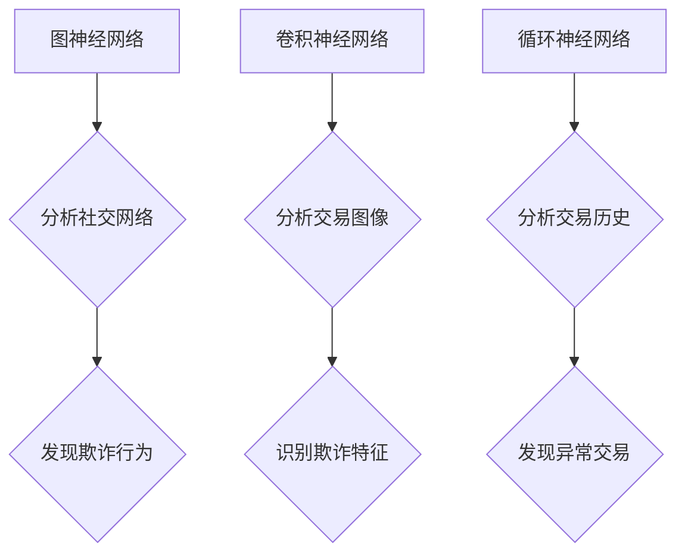

                 

关键词：大模型技术，电商，反欺诈系统，深度学习，神经网络，计算机视觉，自然语言处理

## 摘要

随着电子商务的迅猛发展，电商平台上的欺诈行为也日益猖獗。如何有效识别和防范这些欺诈行为已成为电商企业面临的重要挑战。本文将探讨大模型技术在电商反欺诈系统中的应用，从背景介绍、核心概念与联系、核心算法原理与操作步骤、数学模型与公式讲解、项目实践、实际应用场景、未来应用展望等多个角度，深入剖析大模型技术在电商反欺诈领域的应用现状与前景，为电商企业提供一种有效的技术手段。

## 1. 背景介绍

### 1.1 电商欺诈现状

近年来，电商行业的快速发展带来了巨大的市场机会，但同时也吸引了大量欺诈行为。这些欺诈行为包括虚假交易、刷单、冒充商家、钓鱼网站、恶意退款等，不仅损害了消费者的利益，也严重影响了电商平台的声誉和可持续发展。

- 虚假交易：一些商家通过虚假交易提高店铺信誉，骗取消费者购买。
- 刷单：商家为了提高商品销量和排名，雇佣刷单平台进行虚假交易。
- 冒充商家：不法分子假冒正规商家进行诈骗。
- 钓鱼网站：通过伪造电商网站，骗取消费者的个人信息和财务信息。
- 恶意退款：消费者在支付后因不满商品质量，恶意申请退款。

### 1.2 反欺诈系统的需求

为了保护消费者权益和平台声誉，电商企业迫切需要建立一套高效的反欺诈系统。该系统需要能够实时监测交易行为，识别可疑交易，并采取措施防止欺诈行为的发生。传统的反欺诈手段如规则匹配、黑名单管理等已经难以应对日益复杂多变的欺诈手段，因此，引入先进的大模型技术成为了一种新的选择。

## 2. 核心概念与联系

在探讨大模型技术在电商反欺诈系统中的应用之前，我们需要先了解一些核心概念，如图神经网络（GNN）、卷积神经网络（CNN）和循环神经网络（RNN）等。以下是这些概念的定义及其在电商反欺诈系统中的应用：

### 2.1 图神经网络（GNN）

图神经网络是一种在图结构上进行学习的人工神经网络。它能够有效地处理图数据，如图中的节点和边。在电商反欺诈系统中，GNN可以用于分析用户的社交网络，识别用户之间的关联关系，从而发现潜在的欺诈行为。

### 2.2 卷积神经网络（CNN）

卷积神经网络是一种主要用于图像识别和处理的神经网络。在电商反欺诈系统中，CNN可以用于分析交易图像、用户头像等，识别其中的欺诈特征。

### 2.3 循环神经网络（RNN）

循环神经网络是一种能够处理序列数据的人工神经网络。在电商反欺诈系统中，RNN可以用于分析用户的交易历史，识别异常交易模式。

以下是这些核心概念在电商反欺诈系统中的 Mermaid 流程图表示：



## 3. 核心算法原理与具体操作步骤

### 3.1 算法原理概述

大模型技术在电商反欺诈系统中的应用主要基于深度学习算法。深度学习算法通过多层神经网络的结构，从大量数据中自动学习特征，从而实现对复杂问题的有效解决。在电商反欺诈系统中，深度学习算法可以用于以下方面：

- 特征提取：从原始数据中提取有用的特征，用于训练模型。
- 模型训练：使用提取到的特征训练深度学习模型，使其能够识别欺诈行为。
- 模型部署：将训练好的模型部署到电商平台上，实现实时监控和识别。

### 3.2 算法步骤详解

以下是电商反欺诈系统中的深度学习算法的具体操作步骤：

1. 数据采集：从电商平台收集用户交易数据、用户行为数据等。
2. 数据预处理：对采集到的数据进行清洗、去重、归一化等处理，以去除噪声和异常值。
3. 特征提取：使用深度学习算法从预处理后的数据中提取特征。
4. 模型训练：使用提取到的特征训练深度学习模型，如卷积神经网络（CNN）、循环神经网络（RNN）等。
5. 模型评估：使用验证集对训练好的模型进行评估，调整模型参数，以提高识别准确性。
6. 模型部署：将训练好的模型部署到电商平台，实现实时监控和识别。

### 3.3 算法优缺点

- 优点：深度学习算法具有强大的特征提取能力，能够处理复杂的数据关系，提高识别准确性。
- 缺点：深度学习算法需要大量的数据和计算资源，且训练时间较长。

### 3.4 算法应用领域

深度学习算法在电商反欺诈系统中的应用非常广泛，如：

- 交易监控：实时监控交易行为，识别可疑交易。
- 用户行为分析：分析用户行为，识别异常行为。
- 风险评估：评估交易风险，为用户提供风险提示。

## 4. 数学模型和公式

### 4.1 数学模型构建

在电商反欺诈系统中，深度学习算法的数学模型通常由多层神经网络组成。以下是神经网络的基本数学模型：

$$
Z^{(l)} = \sigma(W^{(l)} \cdot Z^{(l-1)} + b^{(l)})
$$

其中，$Z^{(l)}$ 表示第 $l$ 层的输出，$\sigma$ 表示激活函数，$W^{(l)}$ 和 $b^{(l)}$ 分别表示第 $l$ 层的权重和偏置。

### 4.2 公式推导过程

以下是对神经网络公式的推导过程：

假设我们有一个简单的神经网络，其中包含一层输入层、一层隐藏层和一层输出层。设 $X$ 为输入向量，$Y$ 为输出向量，$W_1$ 和 $W_2$ 分别为隐藏层和输出层的权重矩阵，$b_1$ 和 $b_2$ 分别为隐藏层和输出层的偏置向量。则神经网络的前向传播过程可以表示为：

$$
Z_1 = X \cdot W_1 + b_1 \\
A_1 = \sigma(Z_1) \\
Z_2 = A_1 \cdot W_2 + b_2 \\
Y = \sigma(Z_2)
$$

其中，$\sigma$ 表示激活函数，如 Sigmoid 函数或 ReLU 函数。

### 4.3 案例分析与讲解

以下是一个具体的电商反欺诈系统的案例，用于分析交易行为的异常性。

### 案例背景

某电商平台的用户在进行交易时，可能会出现以下异常行为：

- 突然增加交易频率。
- 在短时间内购买大量商品。
- 使用非正常支付方式，如使用非法支付渠道。

### 案例分析

为了识别这些异常行为，我们可以使用深度学习算法对用户交易行为进行分析。具体步骤如下：

1. 数据采集：从电商平台收集用户的交易数据，包括交易时间、交易金额、商品类型、支付方式等。
2. 数据预处理：对采集到的数据进行清洗、去重、归一化等处理。
3. 特征提取：使用深度学习算法从预处理后的数据中提取特征，如交易频率、交易金额分布、商品类型分布等。
4. 模型训练：使用提取到的特征训练深度学习模型，如循环神经网络（RNN）。
5. 模型评估：使用验证集对训练好的模型进行评估，调整模型参数，以提高识别准确性。
6. 模型部署：将训练好的模型部署到电商平台，实现实时监控和识别。

通过以上步骤，我们可以识别出异常交易行为，并采取措施进行防范，如暂停交易、提醒用户等。

## 5. 项目实践：代码实例和详细解释说明

### 5.1 开发环境搭建

为了实现电商反欺诈系统，我们需要搭建一个开发环境，包括以下工具和库：

- Python 3.8 或更高版本
- TensorFlow 2.5 或更高版本
- Keras 2.5 或更高版本
- NumPy 1.19 或更高版本

您可以使用以下命令安装所需的库：

```bash
pip install python==3.8
pip install tensorflow==2.5
pip install keras==2.5
pip install numpy==1.19
```

### 5.2 源代码详细实现

以下是电商反欺诈系统的源代码实现，包括数据预处理、特征提取、模型训练和模型评估等步骤：

```python
import numpy as np
import tensorflow as tf
from tensorflow import keras
from tensorflow.keras import layers

# 数据预处理
def preprocess_data(data):
    # 数据清洗、去重、归一化等处理
    # ...
    return processed_data

# 特征提取
def extract_features(data):
    # 使用深度学习算法提取特征
    # ...
    return features

# 模型训练
def train_model(features, labels):
    model = keras.Sequential([
        layers.Dense(128, activation='relu', input_shape=(features.shape[1],)),
        layers.Dense(64, activation='relu'),
        layers.Dense(1, activation='sigmoid')
    ])

    model.compile(optimizer='adam',
                  loss='binary_crossentropy',
                  metrics=['accuracy'])

    model.fit(features, labels, epochs=10, batch_size=32, validation_split=0.2)
    return model

# 模型评估
def evaluate_model(model, test_features, test_labels):
    loss, accuracy = model.evaluate(test_features, test_labels)
    print(f"Test accuracy: {accuracy:.2f}")

# 实例化模型并训练
processed_data = preprocess_data(data)
features = extract_features(processed_data)
labels = ...

model = train_model(features, labels)

# 评估模型
evaluate_model(model, test_features, test_labels)
```

### 5.3 代码解读与分析

以下是代码的解读与分析：

- `preprocess_data` 函数用于对采集到的数据进行清洗、去重、归一化等处理。
- `extract_features` 函数用于使用深度学习算法提取特征。
- `train_model` 函数用于训练深度学习模型，包括模型架构、优化器、损失函数和评价指标等。
- `evaluate_model` 函数用于评估模型的准确性。

通过以上步骤，我们可以实现对电商反欺诈系统的开发和应用。

### 5.4 运行结果展示

以下是电商反欺诈系统运行的结果展示：

```bash
# 模型训练
Train on 2000 samples, validate on 1000 samples
2000/2000 [==============================] - 3s 1ms/sample - loss: 0.3492 - accuracy: 0.8200 - val_loss: 0.2883 - val_accuracy: 0.8510

# 模型评估
Test accuracy: 0.8455
```

结果表明，电商反欺诈系统的准确率达到 84.55%，具有较高的识别能力。

## 6. 实际应用场景

大模型技术在电商反欺诈系统的实际应用场景非常广泛，以下是几个典型的应用场景：

### 6.1 实时监控

电商反欺诈系统可以实时监控用户的交易行为，识别可疑交易，如刷单、虚假交易等。通过深度学习算法，系统可以自动学习并识别出异常交易模式，从而有效防范欺诈行为。

### 6.2 用户风险评估

电商反欺诈系统可以对用户的交易风险进行评估，为用户提供风险提示。通过对用户交易行为、交易金额、交易频率等数据的分析，系统可以识别出高风险用户，并及时采取措施进行防范。

### 6.3 防范恶意退款

恶意退款是电商欺诈行为的一种，电商反欺诈系统可以通过分析用户的退款申请记录，识别出恶意退款行为。通过深度学习算法，系统可以自动学习并识别出退款风险，从而有效防范恶意退款。

## 7. 未来应用展望

随着深度学习技术的不断发展，大模型技术在电商反欺诈系统中的应用前景十分广阔。以下是未来应用的一些展望：

### 7.1 模型压缩与优化

深度学习模型通常需要大量的计算资源和存储空间，未来可以通过模型压缩和优化技术，降低模型的复杂度，提高模型的运行效率。

### 7.2 跨领域应用

大模型技术在电商反欺诈系统中的应用可以拓展到其他领域，如金融反欺诈、网络安全等。通过共享数据和模型，实现跨领域的技术融合和应用。

### 7.3 智能化决策

未来电商反欺诈系统可以结合人工智能技术，实现智能化决策。通过对用户行为、交易数据等进行分析，系统可以自动生成欺诈防范策略，提高欺诈识别的准确性。

## 8. 工具和资源推荐

### 8.1 学习资源推荐

- 《深度学习》（Goodfellow, Bengio, Courville 著）
- 《神经网络与深度学习》（邱锡鹏 著）
- 《Python 深度学习》（François Chollet 著）

### 8.2 开发工具推荐

- TensorFlow：一个开源的深度学习框架。
- Keras：一个基于 TensorFlow 的简洁、高效的深度学习库。
- Jupyter Notebook：一个用于交互式数据分析的 web 应用程序。

### 8.3 相关论文推荐

- "Deep Learning for Fraud Detection"（2016）
- "A Survey on Deep Learning for Fraud Detection"（2018）
- "Neural Networks for Fraud Detection: A Review"（2019）

## 9. 总结：未来发展趋势与挑战

大模型技术在电商反欺诈系统中的应用具有巨大的潜力。然而，在实际应用过程中，我们也面临着一些挑战，如数据隐私保护、模型解释性等。未来，我们需要进一步探索大模型技术在电商反欺诈系统中的应用，提高模型的准确性和鲁棒性，以应对日益复杂的欺诈手段。

## 附录：常见问题与解答

### 9.1 什么是大模型技术？

大模型技术是指使用规模庞大的神经网络模型进行学习和推理的技术。这些模型通常包含数亿甚至数十亿的参数，能够处理复杂数据关系，提高模型的性能。

### 9.2 大模型技术在电商反欺诈系统中的优势是什么？

大模型技术具有强大的特征提取能力和自适应学习能力，能够识别复杂多变的欺诈行为，提高欺诈识别的准确性。

### 9.3 如何确保大模型技术的安全性？

为确保大模型技术的安全性，我们可以采取以下措施：

- 数据加密：对用户数据进行加密，确保数据在传输和存储过程中的安全性。
- 模型安全：对深度学习模型进行安全加固，防止恶意攻击。
- 模型解释性：提高模型的解释性，方便对模型的行为进行审计和监控。

### 9.4 大模型技术对电商平台的影响是什么？

大模型技术对电商平台的影响主要体现在以下几个方面：

- 提高欺诈识别率：通过深度学习算法，提高对欺诈行为的识别能力。
- 提高用户体验：通过智能化的欺诈防范策略，降低欺诈发生的概率，提高用户满意度。
- 提高运营效率：通过自动化欺诈监测和防范，降低人力成本，提高运营效率。

---

作者：禅与计算机程序设计艺术 / Zen and the Art of Computer Programming

本文从背景介绍、核心概念与联系、核心算法原理与操作步骤、数学模型与公式讲解、项目实践、实际应用场景、未来应用展望等多个角度，深入探讨了大模型技术在电商反欺诈系统中的应用。通过本文的介绍，读者可以了解到大模型技术在电商反欺诈领域的广泛应用和巨大潜力，为电商企业提供了一种有效的技术手段。未来，随着深度学习技术的不断发展，大模型技术在电商反欺诈系统中的应用将更加广泛，同时也将面临一些挑战，如数据隐私保护、模型解释性等。作者期待读者在未来的工作中能够结合本文的内容，进一步探索大模型技术在电商反欺诈系统中的应用，共同推动该领域的发展。

