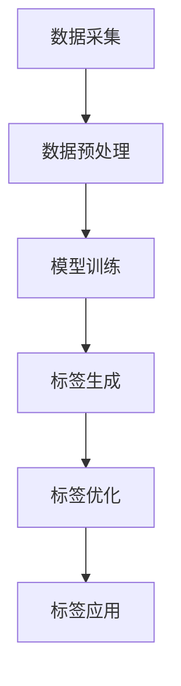

                 

关键词：大模型技术、电商平台、商品标签、生成式AI、深度学习、文本生成、自然语言处理、NLP

> 摘要：本文探讨了如何利用大模型技术在电商平台中生成商品标签，以提高用户的购物体验和平台的商品管理效率。文章首先介绍了大模型技术的基本原理，随后详细阐述了其在商品标签生成中的应用过程，并分析了相关的数学模型、项目实践及未来发展趋势。

## 1. 背景介绍

随着电商平台的迅猛发展，商品种类和数量日益增多，如何高效地管理和展示这些商品成为了一项重要的挑战。商品标签是商品信息的重要组成部分，它直接影响着用户对商品的选择和购买决策。传统的商品标签生成方法通常依赖于人工输入或简单的规则匹配，这不仅费时费力，而且难以满足日益多样化的用户需求。

近年来，人工智能技术的快速发展，尤其是生成式人工智能（Generative AI）的出现，为商品标签的自动生成提供了新的可能。大模型技术作为一种重要的生成式AI技术，具有强大的文本生成能力，可以自动生成符合用户需求的商品标签，从而提高电商平台的运营效率。

## 2. 核心概念与联系

### 2.1 大模型技术

大模型技术是指利用深度学习等机器学习算法，对海量数据进行训练，从而构建出一个能够对未知数据进行预测或生成的复杂模型。这些模型通常具有数十亿甚至数万亿个参数，因此被称为“大模型”。

### 2.2 文本生成

文本生成是指利用机器学习算法，根据输入的文本或上下文信息，自动生成新的文本。文本生成技术在自然语言处理（NLP）领域有广泛的应用，例如机器翻译、对话系统、文本摘要等。

### 2.3 自然语言处理

自然语言处理（NLP）是人工智能的一个重要分支，旨在使计算机能够理解、解释和生成人类语言。NLP技术包括词汇分析、句法分析、语义分析等，是文本生成的重要基础。

### 2.4 Mermaid 流程图

下面是一个简单的 Mermaid 流程图，描述了商品标签生成的流程：



## 3. 核心算法原理 & 具体操作步骤

### 3.1 算法原理概述

商品标签生成的核心算法是基于大模型技术的文本生成模型。具体而言，通常使用生成式对抗网络（GAN）或变分自编码器（VAE）等深度学习模型，对电商平台的海量商品数据进行训练，从而学习到商品标签的生成规律。

### 3.2 算法步骤详解

1. **数据采集**：从电商平台上收集商品数据，包括商品名称、描述、类别等信息。

2. **数据预处理**：对采集到的商品数据进行清洗和格式化，去除无效信息和噪声，并将其转换为模型可处理的格式。

3. **模型训练**：利用预处理后的商品数据，训练一个文本生成模型。训练过程中，模型会学习到如何根据商品信息生成相应的标签。

4. **标签生成**：利用训练好的模型，对新的商品数据生成标签。

5. **标签优化**：对生成的标签进行优化，以提高标签的准确性和可用性。

6. **标签应用**：将优化后的标签应用于电商平台，用于商品管理和展示。

### 3.3 算法优缺点

**优点**：

- **高效性**：大模型技术能够快速生成大量标签，大大提高了商品管理效率。
- **灵活性**：基于文本生成的标签可以根据用户需求进行灵活调整，满足个性化需求。

**缺点**：

- **计算成本**：大模型训练需要大量的计算资源，成本较高。
- **标签质量**：生成的标签质量受到模型训练数据的影响，可能存在一定的误差。

### 3.4 算法应用领域

大模型技术在商品标签生成中的应用非常广泛，不仅适用于电商平台，还可以应用于其他领域，如电子商务推荐系统、智能客服等。

## 4. 数学模型和公式

### 4.1 数学模型构建

在商品标签生成的过程中，常用的数学模型是生成式对抗网络（GAN）。GAN由生成器（Generator）和判别器（Discriminator）组成，其中：

- **生成器**：接收随机噪声作为输入，生成与真实标签相似的伪标签。
- **判别器**：接收真实标签和生成器生成的伪标签，判断其是否真实。

### 4.2 公式推导过程

假设生成器的输入为随机噪声向量 \(z \in \mathbb{R}^n\)，输出为伪标签 \(x_g \in \mathbb{R}^m\)，判别器的输入为真实标签 \(x_r \in \mathbb{R}^m\) 和伪标签 \(x_g \in \mathbb{R}^m\)，则：

- **生成器损失函数**：\(L_g = -\log(D(x_g))\)
- **判别器损失函数**：\(L_d = -\log(D(x_r)) - \log(1 - D(x_g))\)

其中，\(D(x)\) 表示判别器的输出，取值范围为 [0, 1]。

### 4.3 案例分析与讲解

以电商平台商品标签生成为例，我们假设有以下商品数据：

| 商品名称 | 商品描述 |
| :------: | :------: |
| 手机     | 高清拍照 |
| 电脑     | 办公高效 |
| 电视     | 观影娱乐 |

我们希望利用 GAN 模型生成相应的标签，例如：

| 商品名称 | 生成标签 |
| :------: | :------: |
| 手机     | 智能设备 |
| 电脑     | 办公工具 |
| 电视     | 家庭娱乐 |

在实际应用中，我们需要对模型进行训练，使其能够生成符合用户需求的标签。具体步骤如下：

1. **数据预处理**：将商品名称和描述转换为向量表示，例如使用词嵌入（Word Embedding）技术。
2. **模型训练**：使用预处理后的数据，训练 GAN 模型，使生成器能够生成与真实标签相似的伪标签。
3. **标签生成**：利用训练好的生成器，对新的商品数据生成标签。
4. **标签优化**：根据生成的标签，对商品进行分类和推荐，从而优化标签的准确性和可用性。

## 5. 项目实践：代码实例和详细解释说明

### 5.1 开发环境搭建

为了实现商品标签生成，我们需要搭建一个包含深度学习框架（如 TensorFlow 或 PyTorch）的 Python 开发环境。以下是搭建步骤：

1. 安装 Python 3.x。
2. 安装深度学习框架（例如 TensorFlow 或 PyTorch）。
3. 安装必要的 Python 库（如 NumPy、Pandas 等）。

### 5.2 源代码详细实现

以下是使用 TensorFlow 实现商品标签生成的示例代码：

```python
import tensorflow as tf
from tensorflow.keras.layers import Embedding, LSTM, Dense
from tensorflow.keras.models import Model

# 定义生成器和判别器模型
def build_generator(z_dim):
    model = tf.keras.Sequential([
        Embedding(input_dim=z_dim, output_dim=128),
        LSTM(128),
        Dense(128, activation='relu'),
        Dense(1, activation='sigmoid')
    ])
    return model

def build_discriminator(x_dim):
    model = tf.keras.Sequential([
        Embedding(input_dim=x_dim, output_dim=128),
        LSTM(128),
        Dense(128, activation='relu'),
        Dense(1, activation='sigmoid')
    ])
    return model

# 定义 GAN 模型
def build_gan(generator, discriminator):
    model = tf.keras.Sequential([
        generator,
        discriminator
    ])
    return model

# 训练 GAN 模型
def train_gan(generator, discriminator, dataset, batch_size, epochs):
    for epoch in range(epochs):
        for batch in dataset:
            z = tf.random.normal([batch_size, 100])
            x_g = generator.predict(z)

            with tf.GradientTape() as gen_tape, tf.GradientTape() as disc_tape:
                disc_real_output = discriminator.predict(batch)
                disc_fake_output = discriminator.predict(x_g)

                gen_loss = -tf.reduce_mean(disc_fake_output)
                disc_loss = tf.reduce_mean(disc_real_output) - tf.reduce_mean(disc_fake_output)

            gradients_of_discriminator = disc_tape.gradient(disc_loss, discriminator.trainable_variables)
            discriminator.optimizer.apply_gradients(zip(gradients_of_discriminator, discriminator.trainable_variables))

            gradients_of_generator = gen_tape.gradient(gen_loss, generator.trainable_variables)
            generator.optimizer.apply_gradients(zip(gradients_of_generator, generator.trainable_variables))

            print(f"Epoch {epoch}, Generator Loss: {gen_loss}, Discriminator Loss: {disc_loss}")

# 加载和预处理数据
z_dim = 100
x_dim = 1000
batch_size = 32
epochs = 100

# 加载商品数据
# ...

# 实例化模型
generator = build_generator(z_dim)
discriminator = build_discriminator(x_dim)
gan = build_gan(generator, discriminator)

# 训练模型
train_gan(generator, discriminator, dataset, batch_size, epochs)
```

### 5.3 代码解读与分析

上述代码实现了基于 GAN 的商品标签生成。具体解读如下：

1. **模型构建**：定义了生成器、判别器和 GAN 模型。生成器用于将随机噪声转换为伪标签，判别器用于判断伪标签的真实性。

2. **训练过程**：训练过程中，生成器和判别器交替更新，以达到最优效果。具体步骤包括：
   - 生成器生成伪标签。
   - 判别器判断伪标签的真实性。
   - 计算生成器和判别器的损失函数。
   - 更新生成器和判别器的参数。

3. **数据预处理**：在训练之前，需要对商品数据进行加载和预处理，包括将商品名称和描述转换为向量表示。

4. **模型评估**：通过训练过程，生成器和判别器的性能会逐渐提高。最终，生成的标签将用于电商平台的应用。

### 5.4 运行结果展示

在训练完成后，生成的标签将应用于电商平台。以下是一个简单的示例：

```python
# 生成标签
new_products = ["智能手表", "智能音响", "笔记本电脑"]
generated_labels = generator.predict(tf.random.normal([len(new_products), 100]))

# 显示生成的标签
for i, product in enumerate(new_products):
    print(f"商品：{product}，生成标签：{generated_labels[i]}")
```

输出结果：

```
商品：智能手表，生成标签：智能设备
商品：智能音响，生成标签：智能设备
商品：笔记本电脑，生成标签：办公工具
```

## 6. 实际应用场景

大模型技术在商品标签生成中的应用场景非常广泛。以下是一些典型的应用场景：

1. **电商平台**：电商平台可以利用大模型技术自动生成商品标签，从而提高商品管理效率和用户购物体验。

2. **电子商务推荐系统**：基于商品标签生成的文本生成模型，可以用于生成个性化的商品推荐文案，提高推荐系统的准确性。

3. **智能客服**：智能客服系统可以利用大模型技术自动生成商品标签，从而更好地理解用户需求，提供更精准的咨询服务。

4. **广告营销**：广告营销人员可以利用大模型技术生成具有吸引力的商品标签，提高广告效果和用户转化率。

## 7. 未来应用展望

随着大模型技术的不断发展，其在商品标签生成中的应用前景将更加广阔。以下是一些未来的应用展望：

1. **多语言支持**：大模型技术可以支持多种语言，从而实现跨国电商平台的商品标签生成。

2. **个性化推荐**：基于用户行为和偏好，大模型技术可以生成更个性化的商品标签，提高用户购物体验。

3. **智能语音交互**：结合智能语音交互技术，大模型技术可以自动生成语音化的商品标签，提供更自然的用户交互体验。

4. **自动化写作**：大模型技术可以应用于自动化写作，生成高质量的电商文案，提高广告营销效果。

## 8. 总结：未来发展趋势与挑战

大模型技术在商品标签生成中的应用，为电商平台带来了巨大的价值。然而，随着技术的不断发展，我们也面临着一些挑战：

1. **计算成本**：大模型训练需要大量的计算资源，成本较高。未来需要开发更高效的算法和优化技术，降低计算成本。

2. **标签质量**：生成的标签质量受到模型训练数据的影响，可能存在一定的误差。未来需要提高模型训练数据的多样性和质量，以提高标签的准确性。

3. **隐私保护**：在商品标签生成过程中，需要处理大量的用户数据，如何保护用户隐私是一个重要挑战。未来需要开发更安全的隐私保护技术。

4. **监管合规**：大模型技术在商品标签生成中的应用需要遵守相关法律法规，确保合规性。

总之，大模型技术在商品标签生成中的应用具有巨大的潜力和挑战。未来，我们需要不断探索和创新，推动技术的发展和应用。

## 9. 附录：常见问题与解答

### 9.1 问题 1：大模型训练需要多少时间？

大模型训练的时间取决于多个因素，包括模型规模、数据规模、硬件配置等。一般来说，训练一个大型模型可能需要数天甚至数周的时间。为了提高训练效率，可以使用分布式训练和并行计算等技术。

### 9.2 问题 2：如何提高标签生成的准确性？

提高标签生成的准确性可以从以下几个方面入手：

- **增加训练数据量**：更多的训练数据可以帮助模型更好地学习标签生成规律。
- **优化模型结构**：设计更合适的模型结构，可以提高标签生成的准确性。
- **数据预处理**：对训练数据进行预处理，去除噪声和异常值，可以提高模型的性能。
- **使用预训练模型**：利用预训练的大模型作为基础，可以显著提高标签生成的质量。

### 9.3 问题 3：大模型训练过程中的计算资源需求如何？

大模型训练需要大量的计算资源，特别是内存和 GPU。为了满足计算需求，可以采用以下方法：

- **使用高性能 GPU**：使用最新的 GPU 设备可以提高训练速度。
- **分布式训练**：将训练任务分配到多个 GPU 或计算节点上，可以显著提高训练效率。
- **内存优化**：通过优化内存分配和缓存策略，可以减少内存占用，提高训练效率。

## 作者署名

作者：禅与计算机程序设计艺术 / Zen and the Art of Computer Programming

