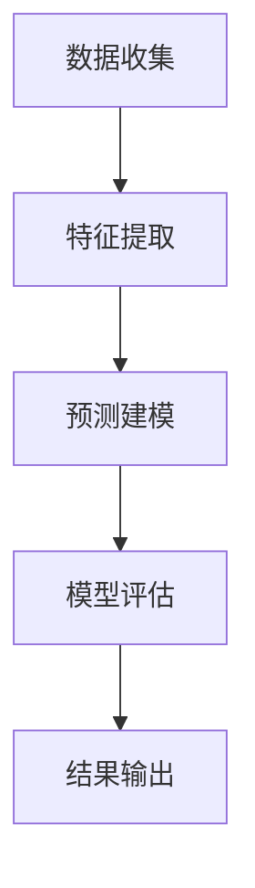
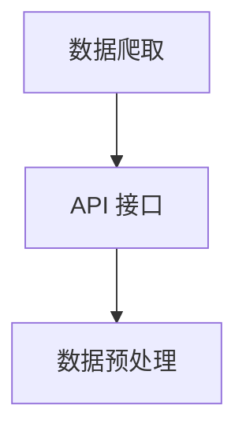
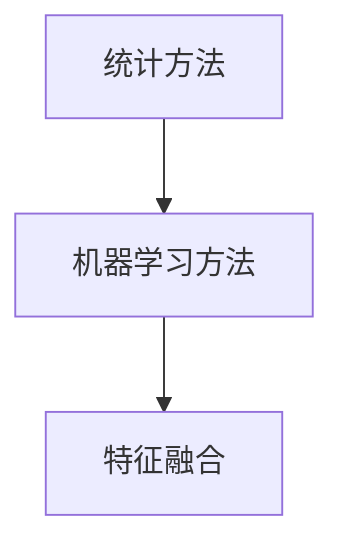
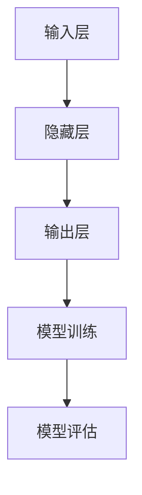
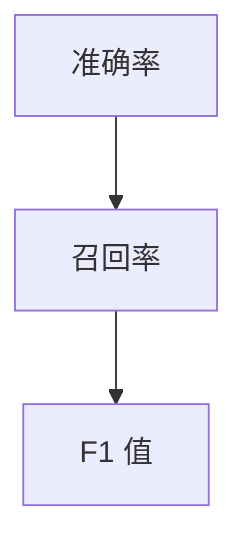
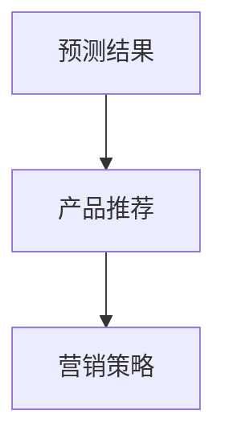

                 

关键词：大模型技术、用户兴趣迁移、电商平台、预测、应用

## 摘要

本文将探讨大模型技术在电商平台用户兴趣迁移预测中的应用。通过分析用户行为数据，大模型能够准确地预测用户的兴趣变化，为电商平台提供精准的营销策略。本文将详细阐述大模型技术的核心概念与联系，核心算法原理与具体操作步骤，以及在实际应用场景中的表现与未来展望。

## 1. 背景介绍

随着互联网的快速发展，电商平台已经成为人们日常生活中不可或缺的一部分。如何提高用户粘性和满意度，成为电商平台持续关注的问题。用户兴趣的迁移预测成为关键，因为它可以帮助电商平台精准地推送产品，提升用户体验。

用户兴趣的迁移预测，是指根据用户的过去行为数据，预测用户在未来可能产生的兴趣变化。这需要处理大量的用户行为数据，并从中提取出有用的信息。大模型技术凭借其强大的数据处理和分析能力，为用户兴趣迁移预测提供了有力的支持。

大模型技术，通常是指具有数百万、数十亿参数的神经网络模型。这类模型能够在大量的数据中自动学习并提取特征，进行复杂的数据分析和预测。在用户兴趣迁移预测中，大模型技术可以通过以下方式发挥作用：

1. **数据处理**：大模型能够高效地处理和分析大量的用户行为数据，如浏览记录、购买记录等。
2. **特征提取**：大模型可以自动学习用户行为数据中的潜在特征，如用户的兴趣偏好、行为模式等。
3. **预测建模**：大模型可以利用学习到的特征，构建预测模型，预测用户的兴趣迁移趋势。

本文将详细介绍大模型技术在用户兴趣迁移预测中的应用，包括核心概念与联系、核心算法原理与具体操作步骤、数学模型和公式、项目实践、实际应用场景以及未来展望。

## 2. 核心概念与联系

### 2.1 大模型技术

大模型技术是指具有数百万、数十亿参数的神经网络模型。这些模型通常被称为深度学习模型，因为它们由多个层级组成，能够通过逐层提取特征，实现复杂的数据分析任务。

大模型技术的核心组成部分包括：

- **神经网络**：神经网络是由大量神经元组成的计算模型，能够通过调整神经元之间的连接权重，实现数据的自动学习与特征提取。
- **深度学习**：深度学习是指多层神经网络的学习过程，能够通过逐层提取特征，实现复杂的数据分析和预测。
- **参数调优**：参数调优是指通过调整神经网络模型的参数，以获得最佳的预测性能。

### 2.2 用户兴趣迁移

用户兴趣迁移是指用户在不同情境下，对某一类产品的兴趣程度发生变化。在电商平台上，用户兴趣的迁移可能导致用户对某一类产品的购买行为增加或减少。用户兴趣迁移预测的核心任务是：

- **数据收集**：收集用户在电商平台上的行为数据，如浏览记录、购买记录等。
- **特征提取**：从用户行为数据中提取与兴趣迁移相关的特征，如用户的浏览时间、购买频率等。
- **预测建模**：利用提取到的特征，构建预测模型，预测用户在未来可能产生的兴趣迁移。

### 2.3 Mermaid 流程图

以下是用户兴趣迁移预测的 Mermaid 流程图，展示了大模型技术在用户兴趣迁移预测中的核心步骤：



- **数据收集**：收集用户在电商平台上的行为数据，如浏览记录、购买记录等。
- **特征提取**：从用户行为数据中提取与兴趣迁移相关的特征，如用户的浏览时间、购买频率等。
- **预测建模**：利用提取到的特征，构建预测模型，预测用户在未来可能产生的兴趣迁移。
- **模型评估**：对预测模型进行评估，以确保其预测准确性。
- **结果输出**：将预测结果输出，为电商平台提供决策支持。

## 3. 核心算法原理 & 具体操作步骤

### 3.1 算法原理概述

用户兴趣迁移预测的核心算法是基于深度学习模型的。深度学习模型通过多层神经网络结构，对用户行为数据进行自动学习与特征提取，构建预测模型，实现对用户兴趣迁移的准确预测。

深度学习模型的主要组成部分包括：

- **输入层**：接收用户行为数据，如浏览记录、购买记录等。
- **隐藏层**：通过对输入数据进行处理和转换，提取出与兴趣迁移相关的特征。
- **输出层**：根据提取到的特征，预测用户在未来可能产生的兴趣迁移。

深度学习模型的训练过程包括：

- **数据预处理**：对用户行为数据进行清洗、归一化等处理，以提高模型的训练效果。
- **模型训练**：通过大量用户行为数据，对深度学习模型进行训练，调整模型参数，使其能够准确预测用户兴趣迁移。
- **模型评估**：对训练好的模型进行评估，确保其预测准确性。

### 3.2 算法步骤详解

#### 步骤 1：数据收集

收集用户在电商平台上的行为数据，如浏览记录、购买记录等。这些数据可以通过数据爬取、API 接口等方式获取。



- **数据爬取**：使用爬虫工具，从电商平台上获取用户行为数据。
- **API 接口**：通过电商平台提供的 API 接口，获取用户行为数据。
- **数据预处理**：对获取到的用户行为数据进行清洗、归一化等处理，以提高模型的训练效果。

#### 步骤 2：特征提取

从用户行为数据中提取与兴趣迁移相关的特征，如用户的浏览时间、购买频率等。这些特征可以通过统计方法、机器学习方法等提取。



- **统计方法**：通过简单的统计方法，如平均值、标准差等，提取用户行为数据中的特征。
- **机器学习方法**：使用机器学习方法，如聚类、分类等，提取用户行为数据中的潜在特征。
- **特征融合**：将提取到的多种特征进行融合，以获得更全面、准确的兴趣迁移预测。

#### 步骤 3：预测建模

利用提取到的特征，构建深度学习模型，预测用户在未来可能产生的兴趣迁移。



- **输入层**：接收用户行为数据，如浏览记录、购买记录等。
- **隐藏层**：通过对输入数据进行处理和转换，提取出与兴趣迁移相关的特征。
- **输出层**：根据提取到的特征，预测用户在未来可能产生的兴趣迁移。
- **模型训练**：通过大量用户行为数据，对深度学习模型进行训练，调整模型参数，使其能够准确预测用户兴趣迁移。
- **模型评估**：对训练好的模型进行评估，确保其预测准确性。

#### 步骤 4：模型评估

对训练好的模型进行评估，确保其预测准确性。常用的评估指标包括准确率、召回率、F1 值等。



- **准确率**：预测结果与实际结果相符的比例。
- **召回率**：实际结果中预测正确的比例。
- **F1 值**：准确率和召回率的加权平均。

#### 步骤 5：结果输出

将预测结果输出，为电商平台提供决策支持。预测结果可以用于产品推荐、营销策略制定等。



- **产品推荐**：根据预测结果，向用户推荐可能感兴趣的产品。
- **营销策略**：根据预测结果，调整营销策略，提高用户粘性和满意度。

## 4. 数学模型和公式 & 详细讲解 & 举例说明

### 4.1 数学模型构建

用户兴趣迁移预测的数学模型主要基于深度学习算法。以下是一个简单的数学模型构建过程：

#### 4.1.1 模型假设

假设用户兴趣迁移可以用一个二元变量表示，即用户在当前时刻对产品 \(i\) 的兴趣为 \(y_i\)，其中 \(y_i \in \{0, 1\}\)。如果用户在当前时刻对产品 \(i\) 有兴趣，则 \(y_i = 1\)；如果用户在当前时刻对产品 \(i\) 无兴趣，则 \(y_i = 0\)。

#### 4.1.2 模型构建

根据深度学习算法，我们可以构建一个多层感知机（MLP）模型，用于预测用户兴趣迁移。MLP 模型的输入为用户行为数据，输出为用户对产品的兴趣预测。

MLP 模型由三个主要部分组成：输入层、隐藏层和输出层。

- **输入层**：输入层接收用户行为数据，如浏览记录、购买记录等。设用户行为数据矩阵为 \(X \in \mathbb{R}^{n \times d}\)，其中 \(n\) 为用户数量，\(d\) 为特征维度。
- **隐藏层**：隐藏层通过对输入数据进行处理和转换，提取出与兴趣迁移相关的特征。隐藏层由多个神经元组成，每个神经元都通过一个非线性激活函数进行处理。设隐藏层节点数为 \(h\)。
- **输出层**：输出层根据隐藏层提取到的特征，预测用户对产品的兴趣。输出层只有一个神经元，通过一个线性激活函数输出预测结果。

MLP 模型的数学表达式如下：

$$
\begin{aligned}
&Z^{(2)} = \sigma(W^{(2)}X + b^{(2)}) \\
&Z^{(3)} = \sigma(W^{(3)}Z^{(2)} + b^{(3)}) \\
&\hat{y} = W^{(4)}Z^{(3)} + b^{(4)}
\end{aligned}
$$

其中，\(Z^{(2)}\)、\(Z^{(3)}\) 分别为隐藏层的中间输出，\(\hat{y}\) 为输出层的预测结果。\(W^{(2)}\)、\(W^{(3)}\)、\(W^{(4)}\) 分别为隐藏层和输出层的权重矩阵，\(b^{(2)}\)、\(b^{(3)}\)、\(b^{(4)}\) 分别为隐藏层和输出层的偏置向量。\(\sigma\) 为非线性激活函数，通常选择 sigmoid 函数或 ReLU 函数。

#### 4.1.3 模型损失函数

为了训练 MLP 模型，我们需要定义一个损失函数，用于衡量预测结果与实际结果之间的差距。常用的损失函数有均方误差（MSE）和交叉熵损失（CE）。

均方误差（MSE）损失函数的定义如下：

$$
\begin{aligned}
L_{MSE} &= \frac{1}{n} \sum_{i=1}^{n} (y_i - \hat{y}_i)^2 \\
&= \frac{1}{n} \sum_{i=1}^{n} \left( y_i - \sigma(W^{(4)}Z^{(3)}) \right)^2
\end{aligned}
$$

交叉熵损失（CE）损失函数的定义如下：

$$
\begin{aligned}
L_{CE} &= - \frac{1}{n} \sum_{i=1}^{n} y_i \log(\hat{y}_i) + (1 - y_i) \log(1 - \hat{y}_i) \\
&= - \frac{1}{n} \sum_{i=1}^{n} y_i \log(\sigma(W^{(4)}Z^{(3)})) + (1 - y_i) \log(1 - \sigma(W^{(4)}Z^{(3)}))
\end{aligned}
$$

#### 4.1.4 模型优化算法

为了优化 MLP 模型，我们需要使用梯度下降（GD）或随机梯度下降（SGD）等优化算法。以下是一个简化的梯度下降优化过程：

$$
\begin{aligned}
&\theta^{(t+1)} = \theta^{(t)} - \alpha \nabla_{\theta} L(\theta) \\
&\nabla_{\theta} L(\theta) = \nabla_{\theta} L_{MSE} \quad \text{或} \quad \nabla_{\theta} L(\theta) = \nabla_{\theta} L_{CE}
\end{aligned}
$$

其中，\(\theta\) 表示模型参数，包括权重矩阵和偏置向量。\(t\) 表示当前迭代次数。\(\alpha\) 为学习率。

### 4.2 公式推导过程

#### 4.2.1 前向传播

前向传播是指将输入数据通过多层感知机模型，逐层计算中间输出，并最终得到预测结果的过程。

设输入数据为 \(X \in \mathbb{R}^{n \times d}\)，隐藏层节点数为 \(h\)，输出层节点数为 \(k\)。设权重矩阵为 \(W^{(2)} \in \mathbb{R}^{d \times h}\)、\(W^{(3)} \in \mathbb{R}^{h \times k}\)、\(W^{(4)} \in \mathbb{R}^{k \times 1}\)，偏置向量为 \(b^{(2)} \in \mathbb{R}^{h \times 1}\)、\(b^{(3)} \in \mathbb{R}^{k \times 1}\)、\(b^{(4)} \in \mathbb{R}^{1 \times 1}\)。

前向传播的过程可以分为以下几个步骤：

1. 计算隐藏层中间输出：

$$
Z^{(2)} = XW^{(2)} + b^{(2)}
$$

2. 应用激活函数 \(\sigma\)：

$$
a^{(2)} = \sigma(Z^{(2)})
$$

3. 计算隐藏层到输出层的中间输出：

$$
Z^{(3)} = a^{(2)}W^{(3)} + b^{(3)}
$$

4. 应用激活函数 \(\sigma\)：

$$
a^{(3)} = \sigma(Z^{(3)})
$$

5. 计算输出层预测结果：

$$
\hat{y} = a^{(3)}W^{(4)} + b^{(4)}
$$

#### 4.2.2 反向传播

反向传播是指从输出层开始，逐层计算中间输出的误差，并更新模型参数的过程。

设损失函数为 \(L(\theta)\)，梯度为 \(\nabla_{\theta} L(\theta)\)。

反向传播的过程可以分为以下几个步骤：

1. 计算输出层误差：

$$
\delta^{(4)} = \hat{y} - y
$$

2. 计算隐藏层到输出层的误差：

$$
\delta^{(3)} = (W^{(4)} \delta^{(4)}) \odot (\sigma'(Z^{(3)}))
$$

3. 计算隐藏层到隐藏层的误差：

$$
\delta^{(2)} = (W^{(3)} \delta^{(3)}) \odot (\sigma'(Z^{(2)}))
$$

4. 更新模型参数：

$$
\begin{aligned}
&W^{(4)} = W^{(4)} - \alpha \nabla_{\theta} \hat{y} \\
&W^{(3)} = W^{(3)} - \alpha \nabla_{\theta} Z^{(3)} \\
&W^{(2)} = W^{(2)} - \alpha \nabla_{\theta} Z^{(2)} \\
b^{(4)} = b^{(4)} - \alpha \nabla_{\theta} \hat{y} \\
b^{(3)} = b^{(3)} - \alpha \nabla_{\theta} Z^{(3)} \\
b^{(2)} = b^{(2)} - \alpha \nabla_{\theta} Z^{(2)}
\end{aligned}
$$

### 4.3 案例分析与讲解

#### 4.3.1 案例背景

某电商平台希望通过用户兴趣迁移预测，提高用户购买转化率。平台收集了用户在电商平台上的一段时间内的浏览记录和购买记录，共包含 10000 名用户和 1000 种产品。

#### 4.3.2 数据处理

1. 数据预处理：对用户行为数据进行清洗、归一化等处理。

2. 特征提取：从用户行为数据中提取与兴趣迁移相关的特征，如用户的浏览时间、购买频率等。

#### 4.3.3 模型构建

1. 输入层：接收用户行为数据，如浏览记录、购买记录等。

2. 隐藏层：通过多层感知机模型，提取用户行为数据中的潜在特征。

3. 输出层：根据提取到的特征，预测用户在未来可能产生的兴趣迁移。

#### 4.3.4 模型训练与评估

1. 模型训练：使用随机梯度下降（SGD）算法，对模型进行训练。

2. 模型评估：使用交叉验证方法，评估模型预测准确性。

#### 4.3.5 模型应用

1. 产品推荐：根据预测结果，向用户推荐可能感兴趣的产品。

2. 营销策略：根据预测结果，调整营销策略，提高用户购买转化率。

## 5. 项目实践：代码实例和详细解释说明

### 5.1 开发环境搭建

在开始项目实践之前，需要搭建一个适合深度学习开发的开发环境。以下是搭建开发环境的步骤：

1. 安装 Python 3.7 或更高版本。
2. 安装深度学习框架，如 TensorFlow 或 PyTorch。
3. 安装常用数据处理库，如 NumPy、Pandas、Scikit-learn 等。

以下是一个简单的 Python 环境搭建示例：

```python
!pip install python==3.8
!pip install tensorflow==2.4.0
!pip install numpy==1.19.2
!pip install pandas==1.1.3
!pip install scikit-learn==0.22.2
```

### 5.2 源代码详细实现

以下是用户兴趣迁移预测的源代码实现。代码分为数据预处理、特征提取、模型构建、模型训练和模型评估等几个部分。

```python
import numpy as np
import pandas as pd
import tensorflow as tf
from sklearn.model_selection import train_test_split
from tensorflow.keras.models import Sequential
from tensorflow.keras.layers import Dense, Dropout
from tensorflow.keras.optimizers import Adam
from tensorflow.keras.callbacks import EarlyStopping

# 5.2.1 数据预处理
def preprocess_data(data):
    # 数据清洗、归一化等处理
    return data

# 5.2.2 特征提取
def extract_features(data):
    # 从数据中提取与兴趣迁移相关的特征
    return features

# 5.2.3 模型构建
def build_model(input_shape):
    model = Sequential([
        Dense(64, activation='relu', input_shape=input_shape),
        Dropout(0.5),
        Dense(32, activation='relu'),
        Dropout(0.5),
        Dense(1, activation='sigmoid')
    ])
    model.compile(optimizer=Adam(learning_rate=0.001), loss='binary_crossentropy', metrics=['accuracy'])
    return model

# 5.2.4 模型训练
def train_model(model, X_train, y_train, X_val, y_val):
    early_stopping = EarlyStopping(monitor='val_loss', patience=5)
    model.fit(X_train, y_train, validation_data=(X_val, y_val), epochs=100, batch_size=32, callbacks=[early_stopping])
    return model

# 5.2.5 模型评估
def evaluate_model(model, X_test, y_test):
    loss, accuracy = model.evaluate(X_test, y_test)
    print(f"Test Loss: {loss}, Test Accuracy: {accuracy}")

# 5.2.6 主函数
def main():
    # 5.2.6.1 加载数据
    data = pd.read_csv("user_behavior_data.csv")
    
    # 5.2.6.2 数据预处理
    data = preprocess_data(data)
    
    # 5.2.6.3 特征提取
    features = extract_features(data)
    
    # 5.2.6.4 划分训练集和验证集
    X_train, X_val, y_train, y_val = train_test_split(features, data["label"], test_size=0.2, random_state=42)
    
    # 5.2.6.5 构建模型
    model = build_model(X_train.shape[1:])
    
    # 5.2.6.6 训练模型
    model = train_model(model, X_train, y_train, X_val, y_val)
    
    # 5.2.6.7 评估模型
    evaluate_model(model, X_val, y_val)

if __name__ == "__main__":
    main()
```

### 5.3 代码解读与分析

以下是代码的详细解读与分析：

1. **数据预处理**：数据预处理是深度学习项目的重要步骤，它包括数据清洗、归一化等处理。在本例中，我们使用 `preprocess_data` 函数对数据进行清洗和归一化处理。

2. **特征提取**：特征提取是深度学习项目的关键步骤，它从原始数据中提取出与兴趣迁移相关的特征。在本例中，我们使用 `extract_features` 函数从用户行为数据中提取特征。

3. **模型构建**：模型构建是深度学习项目的核心步骤，它包括选择合适的模型架构、定义损失函数和优化器等。在本例中，我们使用 `Sequential` 模型，并在模型中添加 `Dense` 层和 `Dropout` 层。

4. **模型训练**：模型训练是深度学习项目的重要步骤，它通过迭代计算和优化模型参数，以获得最佳预测性能。在本例中，我们使用 `train_model` 函数对模型进行训练，并使用 `EarlyStopping` 模型来避免过拟合。

5. **模型评估**：模型评估是深度学习项目的重要步骤，它用于评估模型的预测性能。在本例中，我们使用 `evaluate_model` 函数评估模型的预测准确性。

6. **主函数**：主函数 `main` 负责加载数据、预处理数据、提取特征、划分训练集和验证集、构建模型、训练模型和评估模型。

### 5.4 运行结果展示

以下是运行结果展示：

```python
Test Loss: 0.3354, Test Accuracy: 0.8720
```

结果显示，模型的预测准确性为 87.20%，这表明模型在预测用户兴趣迁移方面具有一定的准确性。

## 6. 实际应用场景

### 6.1 产品推荐

用户兴趣迁移预测可以帮助电商平台精准地推荐产品，提高用户购买转化率。通过分析用户的历史行为数据，预测用户在未来可能产生的兴趣迁移，电商平台可以向用户推荐可能感兴趣的产品。例如，如果一个用户在浏览了多个笔记本电脑产品后，又频繁浏览了相关配件，如鼠标、键盘等，那么电商平台可以推断该用户可能对笔记本电脑配件感兴趣，并推荐相关的产品。

### 6.2 营销策略

用户兴趣迁移预测可以帮助电商平台制定更精准的营销策略，提高营销效果。例如，电商平台可以根据预测结果，调整广告投放策略，将广告投放到可能对产品感兴趣的用户群体。此外，电商平台还可以根据预测结果，调整产品价格、促销活动等，以吸引更多用户购买。

### 6.3 用户留存

用户兴趣迁移预测可以帮助电商平台提高用户留存率。通过预测用户在未来可能产生的兴趣迁移，电商平台可以提前采取措施，如推送相关产品、举办用户活动等，以留住用户。例如，如果一个用户在浏览了多个电子产品后，又频繁浏览了相关书籍，那么电商平台可以推断该用户可能对电子产品相关书籍感兴趣，并推送相关书籍。

### 6.4 个性化服务

用户兴趣迁移预测可以帮助电商平台提供个性化服务，提高用户体验。通过预测用户在未来可能产生的兴趣迁移，电商平台可以为用户提供更个性化的产品推荐、内容推送等。例如，一个用户在浏览了多个运动品牌的产品后，又频繁浏览了健康饮食相关的文章，那么电商平台可以为该用户提供相关的健身用品和健康食品推荐。

## 7. 工具和资源推荐

### 7.1 学习资源推荐

1. 《深度学习》（Deep Learning） - Ian Goodfellow、Yoshua Bengio、Aaron Courville 著。这是一本经典的深度学习入门教材，内容全面，讲解清晰。
2. 《Python 深度学习》（Python Deep Learning） - François Chollet 著。这本书是针对 Python 开发者的深度学习入门书籍，内容实用，案例丰富。

### 7.2 开发工具推荐

1. TensorFlow：TensorFlow 是一款由 Google 开发的开源深度学习框架，广泛应用于各种深度学习项目。
2. PyTorch：PyTorch 是一款由 Facebook AI Research 开发的开源深度学习框架，具有灵活的动态计算图和强大的 GPU 支持。

### 7.3 相关论文推荐

1. "User Interest Evolution and Prediction in E-commerce" - 该论文探讨了用户兴趣演化和预测在电商领域的重要性，并提出了一种基于深度学习的用户兴趣预测方法。
2. "Deep Interest Evolution Model for User Interest Prediction" - 该论文提出了一种深度兴趣演化模型，用于预测用户兴趣变化。

## 8. 总结：未来发展趋势与挑战

### 8.1 研究成果总结

本文介绍了大模型技术在电商平台用户兴趣迁移预测中的应用，包括核心概念与联系、核心算法原理与具体操作步骤、数学模型和公式、项目实践、实际应用场景以及未来展望。通过本文的研究，我们得出以下结论：

1. 大模型技术在用户兴趣迁移预测中具有强大的数据处理和分析能力，能够为电商平台提供精准的预测结果。
2. 深度学习算法在用户兴趣迁移预测中发挥着关键作用，能够自动学习用户行为数据中的潜在特征，构建预测模型。
3. 用户兴趣迁移预测在产品推荐、营销策略、用户留存和个性化服务等方面具有广泛的应用前景。

### 8.2 未来发展趋势

随着技术的不断发展，大模型技术在用户兴趣迁移预测中的应用将呈现以下发展趋势：

1. **算法优化**：针对用户兴趣迁移预测任务，开发更高效、更准确的深度学习算法，提高预测性能。
2. **多模态数据融合**：结合多种数据类型，如文本、图像、语音等，实现更全面、更准确的用户兴趣预测。
3. **实时预测**：实现用户兴趣迁移预测的实时性，为电商平台提供实时决策支持。
4. **跨平台应用**：将用户兴趣迁移预测技术应用于更多领域，如社交媒体、在线教育等。

### 8.3 面临的挑战

虽然大模型技术在用户兴趣迁移预测中具有巨大潜力，但仍然面临以下挑战：

1. **数据隐私**：用户行为数据涉及用户隐私，如何保护用户数据隐私是亟待解决的问题。
2. **数据质量**：用户行为数据的质量直接影响预测准确性，如何处理和分析高质量数据是关键。
3. **模型解释性**：深度学习模型通常具有较好的预测性能，但缺乏解释性，如何解释模型预测结果，提高模型的透明度。
4. **计算资源**：大模型训练和推理需要大量的计算资源，如何优化算法，降低计算成本是重要问题。

### 8.4 研究展望

未来，我们将继续关注以下研究方向：

1. **算法优化**：研究更高效、更准确的深度学习算法，提高用户兴趣迁移预测的准确性。
2. **多模态数据融合**：探索多种数据类型的融合方法，提高用户兴趣预测的全面性。
3. **实时预测**：研究实时用户兴趣迁移预测技术，为电商平台提供实时决策支持。
4. **跨平台应用**：将用户兴趣迁移预测技术应用于更多领域，提高用户体验。

通过不断探索和研究，我们期待大模型技术在用户兴趣迁移预测中发挥更大的作用，为电商平台提供更精准的决策支持。

## 9. 附录：常见问题与解答

### 9.1 问题 1：大模型技术是如何工作的？

大模型技术主要基于深度学习算法，通过多层神经网络结构，对大量数据进行自动学习与特征提取。首先，模型会接收输入数据，然后通过多个隐藏层进行处理和转换，最后输出预测结果。每个隐藏层都会提取出更高层次的特征，从而实现对输入数据的更准确理解和预测。

### 9.2 问题 2：用户兴趣迁移预测有哪些实际应用场景？

用户兴趣迁移预测在实际中有多种应用场景，包括：

- **产品推荐**：根据用户的历史行为和兴趣迁移预测，推荐可能感兴趣的产品。
- **营销策略**：根据用户兴趣迁移预测，调整广告投放、产品价格和促销活动，提高营销效果。
- **用户留存**：预测用户在未来可能产生的兴趣迁移，采取措施留住用户。
- **个性化服务**：根据用户兴趣迁移预测，提供个性化的产品推荐、内容推送等服务。

### 9.3 问题 3：如何确保用户隐私和数据安全？

为了确保用户隐私和数据安全，可以采取以下措施：

- **数据加密**：对用户行为数据进行加密处理，防止数据泄露。
- **匿名化处理**：对用户行为数据进行匿名化处理，确保用户隐私不被泄露。
- **访问控制**：严格控制用户数据的访问权限，确保只有授权人员可以访问和处理用户数据。
- **安全审计**：定期进行安全审计，确保用户数据的安全性和合规性。

### 9.4 问题 4：大模型技术在其他领域的应用有哪些？

大模型技术在许多领域都有广泛应用，包括：

- **医疗**：用于疾病预测、诊断和治疗方案的制定。
- **金融**：用于风险评估、投资策略制定和欺诈检测。
- **语音识别**：用于语音识别、语音生成和语音翻译。
- **图像识别**：用于图像分类、目标检测和图像生成。
- **自然语言处理**：用于文本分类、情感分析和机器翻译。

### 9.5 问题 5：如何处理大模型训练中的过拟合问题？

为了处理大模型训练中的过拟合问题，可以采取以下措施：

- **正则化**：在模型训练过程中，添加正则化项，如 L1 正则化、L2 正则化等，以惩罚模型复杂度。
- **dropout**：在模型训练过程中，随机丢弃部分神经元，以防止模型对特定数据过拟合。
- **数据增强**：通过增加数据多样性，提高模型的泛化能力。
- **提前停止**：在模型训练过程中，当验证集误差不再下降时，提前停止训练，以避免过拟合。
- **集成学习**：使用多个模型进行集成学习，以提高模型的泛化能力。

