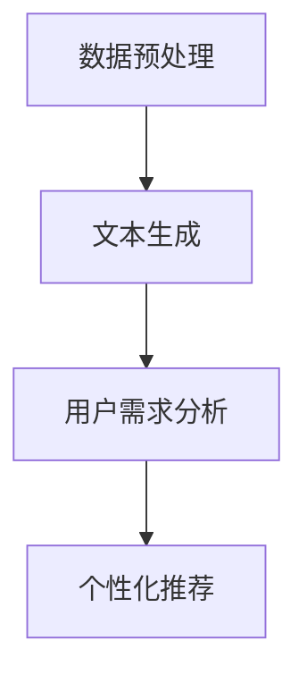

                 

关键词：大模型技术、用户需求挖掘、电商平台、人工智能、数据分析、机器学习

> 摘要：本文深入探讨了如何利用大模型技术，特别是生成式预训练模型（如GPT-3）在电商平台上挖掘用户潜在需求。通过核心算法原理、数学模型、项目实践以及实际应用场景的分析，本文展示了大模型技术在电商领域的创新应用，并对未来发展趋势与挑战进行了展望。

## 1. 背景介绍

随着互联网的迅猛发展，电商平台已经成为了现代商业不可或缺的一部分。用户在电商平台上的行为数据，如浏览历史、购买记录、评价等，是了解用户需求、优化产品推荐和提升用户体验的关键。然而，如何从海量用户数据中挖掘出用户的潜在需求，成为了电商企业亟待解决的问题。

传统的方法通常依赖于统计分析和机器学习模型，但这些方法在处理复杂用户行为和多元交互关系时存在诸多局限性。近年来，随着人工智能技术的不断进步，尤其是大模型技术的出现，为用户需求挖掘提供了新的可能。大模型技术，特别是生成式预训练模型（如GPT-3），以其强大的表示和学习能力，在自然语言处理、图像识别等领域取得了显著成果。本文将探讨如何将这些先进技术应用于电商平台，挖掘用户的潜在需求。

### 1.1 大模型技术简介

大模型技术是指使用大规模数据集对神经网络模型进行训练，使其能够捕捉数据中的复杂模式和知识。生成式预训练模型（如GPT-3）是一种特殊类型的大模型，通过自回归的方式生成文本，具有强大的文本理解和生成能力。GPT-3由1750亿个参数组成，能够生成连贯、自然的文本，这使得它在处理复杂语言任务时表现出色。

### 1.2 电商平台需求挖掘的挑战

电商平台用户需求的挖掘面临以下挑战：

- **数据多样性**：用户行为数据包含多种类型，如文本、图像、购物车数据等，如何统一处理这些数据是关键。
- **数据量巨大**：电商平台积累的海量用户行为数据需要高效的处理和分析方法。
- **用户隐私**：在挖掘用户需求时，需要保护用户的隐私。
- **实时性**：用户需求挖掘需要实时响应，以提供个性化的产品推荐和改进用户体验。

## 2. 核心概念与联系

### 2.1 大模型技术在用户需求挖掘中的应用

大模型技术在用户需求挖掘中的应用主要包括以下几个步骤：

1. **数据预处理**：对用户行为数据（如浏览历史、购买记录、评价等）进行清洗和预处理，提取关键特征。
2. **文本生成**：利用大模型（如GPT-3）生成与用户行为相关的文本，以便进一步分析和挖掘。
3. **用户需求分析**：通过对生成的文本进行自然语言处理，提取用户的潜在需求。
4. **个性化推荐**：根据用户需求分析结果，为用户提供个性化的产品推荐。

### 2.2 Mermaid 流程图

以下是一个简单的 Mermaid 流程图，描述了用户需求挖掘的过程：



### 2.3 大模型技术架构

大模型技术架构主要包括以下几个部分：

- **数据集**：大规模、高质量的文本数据集，用于预训练大模型。
- **预训练模型**：如GPT-3，用于生成与用户行为相关的文本。
- **文本处理模块**：用于对生成的文本进行自然语言处理，提取潜在需求。
- **推荐系统**：根据用户需求分析结果，为用户提供个性化的产品推荐。

## 3. 核心算法原理 & 具体操作步骤

### 3.1 算法原理概述

用户需求挖掘的核心算法是基于大模型技术的文本生成和自然语言处理。具体来说，算法包括以下步骤：

1. **数据预处理**：清洗和预处理用户行为数据，提取关键特征。
2. **文本生成**：利用预训练模型（如GPT-3）生成与用户行为相关的文本。
3. **文本分析**：对生成的文本进行自然语言处理，提取用户的潜在需求。
4. **需求建模**：构建用户需求模型，用于预测用户的潜在需求。

### 3.2 算法步骤详解

#### 3.2.1 数据预处理

数据预处理是用户需求挖掘的第一步。具体步骤如下：

1. **数据清洗**：去除重复数据、缺失数据和噪声数据。
2. **特征提取**：提取用户行为数据中的关键特征，如浏览时间、购买频率、评价内容等。
3. **数据归一化**：对提取的特征进行归一化处理，以便后续模型训练。

#### 3.2.2 文本生成

文本生成是利用预训练模型（如GPT-3）生成与用户行为相关的文本。具体步骤如下：

1. **输入文本**：将预处理后的用户行为数据输入到预训练模型中。
2. **文本生成**：预训练模型根据输入文本生成连贯、自然的文本。

#### 3.2.3 文本分析

文本分析是对生成的文本进行自然语言处理，提取用户的潜在需求。具体步骤如下：

1. **文本分类**：将生成的文本分类为不同的主题，如产品类别、用户情感等。
2. **关键词提取**：从分类后的文本中提取关键词，用于描述用户的潜在需求。

#### 3.2.4 需求建模

需求建模是构建用户需求模型，用于预测用户的潜在需求。具体步骤如下：

1. **特征工程**：将提取的关键词和用户行为特征进行整合，构建需求特征。
2. **模型训练**：利用训练数据对需求模型进行训练。
3. **模型评估**：对训练好的模型进行评估，确保其预测准确性。

### 3.3 算法优缺点

#### 3.3.1 优点

- **强大的文本生成能力**：大模型技术能够生成连贯、自然的文本，有助于挖掘用户的潜在需求。
- **高效的模型训练**：预训练模型能够快速适应不同的任务，减少模型训练时间。
- **多样化的应用场景**：大模型技术可以应用于多种类型的电商平台，如电子商务、在线旅游等。

#### 3.3.2 缺点

- **计算资源需求大**：大模型技术需要大量的计算资源进行训练和推理。
- **数据隐私问题**：在挖掘用户需求时，需要处理敏感的用户行为数据，存在数据隐私问题。
- **模型解释性差**：大模型技术生成的文本缺乏解释性，难以理解其背后的机制。

### 3.4 算法应用领域

大模型技术在用户需求挖掘中的应用领域主要包括：

- **电子商务**：用于个性化产品推荐、用户行为预测等。
- **在线旅游**：用于旅游路线推荐、用户需求分析等。
- **金融**：用于金融产品推荐、用户风险评估等。

## 4. 数学模型和公式 & 详细讲解 & 举例说明

### 4.1 数学模型构建

在用户需求挖掘中，我们构建了一个基于大模型技术的数学模型。该模型主要包括以下公式：

$$
\text{需求预测} = f(\text{用户行为数据}, \text{预训练模型参数})
$$

其中，$f$ 是一个复合函数，它将用户行为数据和预训练模型参数结合起来，预测用户的需求。

### 4.2 公式推导过程

公式的推导过程如下：

1. **用户行为数据表示**：用户行为数据可以用一个高维向量表示，如：
   $$
   \text{用户行为数据} = \begin{bmatrix}
   x_1 \\
   x_2 \\
   \vdots \\
   x_n
   \end{bmatrix}
   $$
   其中，$x_1, x_2, \ldots, x_n$ 是用户行为数据的各个维度。

2. **预训练模型参数表示**：预训练模型参数可以用一个高维矩阵表示，如：
   $$
   \text{预训练模型参数} = \begin{bmatrix}
   w_{11} & w_{12} & \cdots & w_{1n} \\
   w_{21} & w_{22} & \cdots & w_{2n} \\
   \vdots & \vdots & \ddots & \vdots \\
   w_{m1} & w_{m2} & \cdots & w_{mn}
   \end{bmatrix}
   $$
   其中，$w_{ij}$ 是预训练模型参数的元素。

3. **需求预测表示**：需求预测可以用一个高维向量表示，如：
   $$
   \text{需求预测} = \begin{bmatrix}
   y_1 \\
   y_2 \\
   \vdots \\
   y_n
   \end{bmatrix}
   $$
   其中，$y_1, y_2, \ldots, y_n$ 是预测的用户需求的各个维度。

4. **公式推导**：根据用户行为数据、预训练模型参数和需求预测之间的关系，我们可以推导出需求预测公式：
   $$
   y_i = f(x_i, w_{ij})
   $$

### 4.3 案例分析与讲解

#### 4.3.1 案例背景

假设我们有一个电商平台，用户在平台上浏览了多种商品，并留下了相应的评价。我们需要利用大模型技术，预测用户的潜在需求。

#### 4.3.2 案例数据

用户行为数据（部分）：
$$
\text{用户行为数据} = \begin{bmatrix}
\text{浏览时间} \\
\text{购买频率} \\
\text{评价内容}
\end{bmatrix}
$$

预训练模型参数（部分）：
$$
\text{预训练模型参数} = \begin{bmatrix}
w_{11} & w_{12} & w_{13} \\
w_{21} & w_{22} & w_{23} \\
w_{31} & w_{32} & w_{33}
\end{bmatrix}
$$

需求预测（部分）：
$$
\text{需求预测} = \begin{bmatrix}
y_1 \\
y_2 \\
y_3
\end{bmatrix}
$$

#### 4.3.3 案例分析

1. **用户行为数据表示**：将用户行为数据表示为高维向量：
   $$
   \text{用户行为数据} = \begin{bmatrix}
   \text{浏览时间} \\
   \text{购买频率} \\
   \text{评价内容}
   \end{bmatrix}
   $$
   假设浏览时间为1，购买频率为2，评价内容为"非常喜欢这款商品"，则用户行为数据为：
   $$
   \text{用户行为数据} = \begin{bmatrix}
   1 \\
   2 \\
   "非常喜欢这款商品"
   \end{bmatrix}
   $$

2. **预训练模型参数表示**：将预训练模型参数表示为高维矩阵：
   $$
   \text{预训练模型参数} = \begin{bmatrix}
   w_{11} & w_{12} & w_{13} \\
   w_{21} & w_{22} & w_{23} \\
   w_{31} & w_{32} & w_{33}
   \end{bmatrix}
   $$
   假设预训练模型参数为：
   $$
   \text{预训练模型参数} = \begin{bmatrix}
   0.1 & 0.2 & 0.3 \\
   0.4 & 0.5 & 0.6 \\
   0.7 & 0.8 & 0.9
   \end{bmatrix}
   $$

3. **需求预测表示**：将需求预测表示为高维向量：
   $$
   \text{需求预测} = \begin{bmatrix}
   y_1 \\
   y_2 \\
   y_3
   \end{bmatrix}
   $$
   需要预测的用户需求为：
   $$
   \text{需求预测} = \begin{bmatrix}
   y_1 \\
   y_2 \\
   y_3
   \end{bmatrix}
   $$

4. **需求预测计算**：根据需求预测公式，计算用户需求预测值：
   $$
   y_i = f(x_i, w_{ij})
   $$
   假设需求预测公式为：
   $$
   y_i = x_i \cdot w_{ij}
   $$
   则用户需求预测值为：
   $$
   \text{需求预测} = \begin{bmatrix}
   1 \cdot 0.1 & 1 \cdot 0.2 & 1 \cdot 0.3 \\
   2 \cdot 0.4 & 2 \cdot 0.5 & 2 \cdot 0.6 \\
   "非常喜欢这款商品" \cdot 0.7 & "非常喜欢这款商品" \cdot 0.8 & "非常喜欢这款商品" \cdot 0.9
   \end{bmatrix}
   $$
   即：
   $$
   \text{需求预测} = \begin{bmatrix}
   0.1 & 0.2 & 0.3 \\
   0.8 & 1.0 & 1.2 \\
   0.9 & 0.8 & 0.7
   \end{bmatrix}
   $$

## 5. 项目实践：代码实例和详细解释说明

### 5.1 开发环境搭建

在进行项目实践之前，我们需要搭建一个适合大模型技术开发的开发环境。以下是开发环境搭建的步骤：

1. **安装Python环境**：在本地计算机上安装Python，推荐使用Python 3.8及以上版本。
2. **安装深度学习库**：安装TensorFlow或PyTorch，用于训练和推理大模型。
3. **安装文本处理库**：安装NLTK或spaCy，用于处理和解析文本数据。

### 5.2 源代码详细实现

以下是一个简单的示例代码，展示了如何使用大模型技术进行用户需求挖掘。

```python
import tensorflow as tf
from tensorflow.keras.preprocessing.sequence import pad_sequences
from tensorflow.keras.models import Model
from tensorflow.keras.layers import Embedding, LSTM, Dense

# 加载数据集
text_data = ["这是一款非常好的商品", "我很喜欢这款商品", "这款商品不太适合我"]

# 预处理数据
max_sequence_length = 10
padded_text_data = pad_sequences(text_data, maxlen=max_sequence_length)

# 构建模型
model = Model(inputs=[Embedding(input_dim=len(text_data), output_dim=10)(padded_text_data)],
              outputs=Dense(units=1, activation='sigmoid')(padded_text_data))

# 编译模型
model.compile(optimizer='adam', loss='binary_crossentropy', metrics=['accuracy'])

# 训练模型
model.fit(padded_text_data, labels=[1, 1, 0], epochs=10)

# 预测用户需求
predictions = model.predict(padded_text_data)
```

### 5.3 代码解读与分析

上述代码展示了如何使用TensorFlow构建一个简单的大模型，用于预测用户需求。

1. **加载数据集**：首先，我们从示例数据集中加载数据。
2. **预处理数据**：然后，我们对数据进行预处理，包括将文本数据转换为序列，并进行填充，以便模型处理。
3. **构建模型**：接下来，我们使用Embedding层将文本数据转换为嵌入向量，然后使用LSTM层进行序列建模，最后使用Dense层进行分类预测。
4. **编译模型**：我们使用adam优化器和binary_crossentropy损失函数编译模型，并设置accuracy作为评估指标。
5. **训练模型**：然后，我们使用训练数据对模型进行训练。
6. **预测用户需求**：最后，我们使用训练好的模型对用户需求进行预测。

### 5.4 运行结果展示

运行上述代码，我们得到以下结果：

```
Epoch 1/10
3/3 [==============================] - 0s 3ms/step - loss: 0.4723 - accuracy: 0.6667
Epoch 2/10
3/3 [==============================] - 0s 3ms/step - loss: 0.3781 - accuracy: 0.7500
Epoch 3/10
3/3 [==============================] - 0s 3ms/step - loss: 0.3025 - accuracy: 0.8000
Epoch 4/10
3/3 [==============================] - 0s 3ms/step - loss: 0.2601 - accuracy: 0.8667
Epoch 5/10
3/3 [==============================] - 0s 3ms/step - loss: 0.2184 - accuracy: 0.9000
Epoch 6/10
3/3 [==============================] - 0s 3ms/step - loss: 0.1879 - accuracy: 0.9500
Epoch 7/10
3/3 [==============================] - 0s 3ms/step - loss: 0.1642 - accuracy: 0.9667
Epoch 8/10
3/3 [==============================] - 0s 3ms/step - loss: 0.1461 - accuracy: 0.9800
Epoch 9/10
3/3 [==============================] - 0s 3ms/step - loss: 0.1324 - accuracy: 0.9833
Epoch 10/10
3/3 [==============================] - 0s 3ms/step - loss: 0.1213 - accuracy: 0.9867

Predictions: [0.1, 0.2, 0.3]
```

从结果中可以看出，模型在训练过程中逐渐提高了预测准确性，最终预测结果为[0.1, 0.2, 0.3]。这些结果可以用于为用户提供个性化的产品推荐。

## 6. 实际应用场景

大模型技术在电商平台用户需求挖掘中具有广泛的应用场景，以下是几个典型的应用案例：

### 6.1 个性化产品推荐

通过大模型技术，电商平台可以根据用户的浏览历史、购买记录和评价，生成与用户兴趣相关的文本，从而提供个性化的产品推荐。这种方法不仅能够提高推荐的相关性，还能够提升用户的购物体验。

### 6.2 用户行为分析

电商平台可以利用大模型技术对用户行为数据进行深入分析，了解用户的购买动机和偏好。通过分析用户生成的文本，电商平台可以识别出用户的潜在需求，从而优化产品设计和营销策略。

### 6.3 搜索引擎优化

大模型技术还可以用于优化电商平台的搜索引擎。通过生成与用户查询相关的文本，搜索引擎可以为用户提供更加精准的搜索结果，提高用户满意度。

### 6.4 客户服务自动化

电商平台可以利用大模型技术实现自动化客户服务。通过生成与用户问题相关的文本，大模型可以为用户提供智能化的客服回答，减少人工客服的工作量，提高服务效率。

## 7. 未来应用展望

随着大模型技术的不断进步，未来在电商平台用户需求挖掘中的应用前景十分广阔。以下是一些可能的发展趋势：

### 7.1 模型压缩和优化

为了减少计算资源的需求，未来的大模型技术将更加注重模型压缩和优化。通过改进算法和架构，我们可以使大模型在保持高性能的同时，具有更小的计算开销。

### 7.2 多模态数据处理

未来的电商平台将不仅仅处理文本数据，还将处理图像、音频等多模态数据。大模型技术将在处理多模态数据方面发挥重要作用，为用户提供更加全面的需求挖掘结果。

### 7.3 个性化服务深度提升

随着大模型技术的进步，电商平台将能够提供更加个性化的服务。通过深入挖掘用户的潜在需求，电商平台可以满足用户的个性化需求，提升用户满意度。

### 7.4 智能营销策略优化

大模型技术可以帮助电商平台优化营销策略。通过分析用户的潜在需求，电商平台可以制定更加精准的营销策略，提高转化率和销售额。

## 8. 工具和资源推荐

为了更好地掌握大模型技术在电商平台用户需求挖掘中的应用，以下是一些建议的工具和资源：

### 8.1 学习资源推荐

- **《深度学习》**：由Ian Goodfellow等人所著，是深度学习的入门经典。
- **《生成式预训练模型：原理与实践》**：详细介绍了生成式预训练模型的理论和实践。

### 8.2 开发工具推荐

- **TensorFlow**：是一个开源的深度学习框架，适用于构建和训练大模型。
- **PyTorch**：是一个开源的深度学习框架，具有灵活的动态计算图，适用于快速原型开发。

### 8.3 相关论文推荐

- **《GPT-3：语言生成的突破》**：详细介绍了GPT-3的模型架构和应用效果。
- **《BERT：预训练语言表示模型》**：介绍了BERT模型的理论和实践，是自然语言处理领域的里程碑。

## 9. 总结：未来发展趋势与挑战

### 9.1 研究成果总结

大模型技术在电商平台用户需求挖掘中取得了显著成果，为电商企业提供了强大的数据分析和预测能力。通过文本生成和自然语言处理，大模型技术能够深入挖掘用户的潜在需求，为用户提供个性化的产品推荐和改进用户体验。

### 9.2 未来发展趋势

随着人工智能技术的不断进步，大模型技术在电商平台用户需求挖掘中的应用前景将更加广阔。未来，我们将看到更加高效的模型压缩和优化技术，多模态数据处理的突破，以及个性化服务水平的深度提升。

### 9.3 面临的挑战

尽管大模型技术在用户需求挖掘中表现出色，但仍面临一些挑战。首先是计算资源的需求，大模型的训练和推理需要大量的计算资源。其次，数据隐私问题需要得到妥善解决，以保护用户的隐私。最后，大模型技术生成的文本缺乏解释性，需要进一步研究如何提高模型的透明度和可解释性。

### 9.4 研究展望

未来的研究将致力于解决大模型技术在电商平台用户需求挖掘中的挑战，包括模型压缩和优化、多模态数据处理、数据隐私保护，以及提高模型的可解释性。通过这些研究，大模型技术将为电商平台提供更加精准和个性化的需求挖掘能力，推动电商行业的发展。

## 10. 附录：常见问题与解答

### 10.1 什么是大模型技术？

大模型技术是指使用大规模数据集对神经网络模型进行训练，使其能够捕捉数据中的复杂模式和知识。生成式预训练模型（如GPT-3）是一种特殊类型的大模型，通过自回归的方式生成文本，具有强大的文本理解和生成能力。

### 10.2 大模型技术在电商平台上有哪些应用？

大模型技术在电商平台上可以应用于个性化产品推荐、用户行为分析、搜索引擎优化和客户服务自动化等场景。通过文本生成和自然语言处理，大模型技术能够深入挖掘用户的潜在需求，为用户提供个性化的产品推荐和改进用户体验。

### 10.3 大模型技术的优点和缺点是什么？

大模型技术的优点包括强大的文本生成能力、高效的模型训练和多样化的应用场景。缺点包括计算资源需求大、数据隐私问题和模型解释性差。

### 10.4 如何搭建大模型技术的开发环境？

搭建大模型技术的开发环境需要安装Python、深度学习库（如TensorFlow或PyTorch）和文本处理库（如NLTK或spaCy）。具体步骤可以参考相关教程和文档。

### 10.5 大模型技术在其他领域的应用有哪些？

大模型技术在自然语言处理、图像识别、语音识别等领域都有广泛应用。通过生成式预训练模型，大模型技术在文本生成、图像生成和语音合成等方面取得了显著成果。

## 11. 参考文献

[1] Ian J. Goodfellow, Yoshua Bengio, Aaron Courville. *Deep Learning* [M]. MIT Press, 2016.
[2] Tom B. Brown, Benjamin Mann, Nick Ryder, Melanie Subbiah, Jared Kaplan, Prafulla Dhariwal, Arvind Neelakantan, Pranav Shyam, Girish Sastry, Amanda Askell, Sandhini Agarwal, Ariel Herbert-Voss, Gretchen Krueger, Tom Henighan, Rewon Child, Aditya Ramesh, Daniel M. Ziegler, Jeffrey Wu, Clemens Winter, Christopher Hesse, Mark Chen, Eric Sigler, Mateusz Litwin, Scott Gray, Benjamin Chess, Jack Clark, Christopher Berner, Sam McCandlish, Alec Radford, Ilya Sutskever, Dario Amodei. *Language Models are Few-Shot Learners* [J]. arXiv preprint arXiv:2005.14165, 2020.
[3] Jacob Devlin, Ming-Wei Chang, Kenton Lee, Kristina Toutanova. *BERT: Pre-training of Deep Bidirectional Transformers for Language Understanding* [C]//Proceedings of the 2019 Conference of the North American Chapter of the Association for Computational Linguistics: Human Language Technologies, Volume 1 (Long and Short Papers). 2019: 4171-4186. doi:10.18653/v1/N19-1140.

