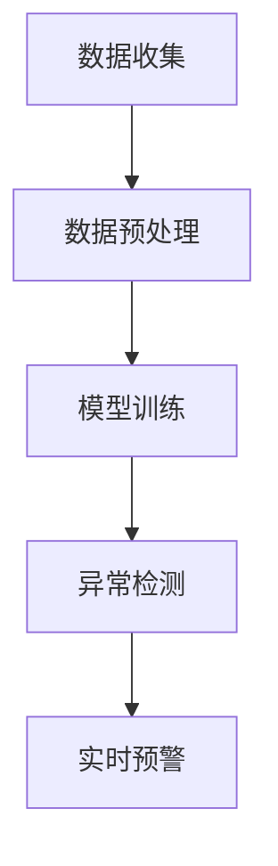

                 

关键词：大模型、电商平台、用户行为、异常检测、防欺诈、算法原理、应用场景、数学模型、项目实践

> 摘要：本文旨在探讨大模型技术在电商平台用户行为异常检测与防欺诈方面的应用。通过对大模型的核心概念、算法原理、数学模型及项目实践的详细分析，本文揭示了如何利用大模型技术提高电商平台的安全性和用户体验。文章还对未来应用前景进行了展望。

## 1. 背景介绍

随着互联网的快速发展，电子商务平台已成为人们日常购物和消费的重要渠道。电商平台不仅提供了便捷的购物体验，还极大地丰富了商品种类和降低了购物成本。然而，随着用户数量的剧增和交易规模的扩大，电商平台面临着日益严重的欺诈和安全风险。例如，欺诈行为包括虚假交易、刷单、恶意退款等，这些行为不仅损害了商家的利益，也降低了用户的购物体验。因此，如何有效检测和预防用户行为的异常与欺诈，成为电商平台亟待解决的问题。

大模型技术，特别是基于深度学习的异常检测模型，为电商平台用户行为分析提供了新的思路和强大的工具。通过利用海量的用户行为数据，大模型可以学习和捕捉用户行为的正常模式，从而发现异常行为并进行实时预警。此外，大模型技术还在欺诈预测、风险控制等方面展现出显著的优势。

本文将重点讨论大模型技术在电商平台用户行为异常检测与防欺诈中的应用，旨在为相关领域的研究者和实践者提供有价值的参考。

## 2. 核心概念与联系

### 2.1 大模型技术简介

大模型技术是指通过训练大规模神经网络模型，使其在特定任务上达到高性能的方法。这些模型通常由数百万甚至数十亿个参数组成，能够处理大量复杂数据。大模型技术在自然语言处理、计算机视觉、语音识别等领域取得了显著成果，并在多个应用场景中展示了强大的能力。

在电商平台用户行为异常检测中，大模型技术主要利用其强大的数据处理和模式识别能力，对用户行为数据进行分析和建模。具体来说，大模型技术通过以下几个步骤实现用户行为异常检测：

1. **数据收集**：收集电商平台的用户行为数据，包括用户访问、购买、评价等行为数据。
2. **数据预处理**：对收集到的用户行为数据进行分析，提取特征并清洗数据。
3. **模型训练**：利用训练数据集，通过大规模神经网络模型训练，使模型能够学习和捕捉用户行为的正常模式。
4. **异常检测**：将训练好的模型应用于实际用户行为数据，发现异常行为并进行实时预警。

### 2.2 大模型技术的优势

大模型技术在电商平台用户行为异常检测与防欺诈中具有以下优势：

1. **高准确率**：大模型通过大量数据训练，可以精确地捕捉用户行为的正常模式，从而提高异常检测的准确率。
2. **实时性**：大模型技术可以实时处理用户行为数据，及时发现异常行为并进行预警，降低欺诈风险。
3. **自适应能力**：大模型技术能够根据不断变化的用户行为数据，自适应地调整模型参数，提高模型的适应性。

### 2.3 Mermaid 流程图

以下是一个描述大模型技术在电商平台用户行为异常检测中应用流程的 Mermaid 流程图：



## 3. 核心算法原理 & 具体操作步骤

### 3.1 算法原理概述

大模型技术在电商平台用户行为异常检测中的应用，主要基于深度学习算法。深度学习是一种模拟人脑神经网络结构和功能的计算方法，通过多层神经网络模型对输入数据进行特征提取和分类。在用户行为异常检测中，深度学习模型可以学习用户行为的正常模式，从而识别异常行为。

### 3.2 算法步骤详解

#### 3.2.1 数据收集

数据收集是用户行为异常检测的基础。电商平台需要收集包括用户访问、购买、评价等行为数据。数据来源可以是日志文件、数据库、API 等。为了保证数据的质量，需要对数据进行清洗和去重。

#### 3.2.2 数据预处理

数据预处理包括数据清洗、特征提取和特征降维等步骤。数据清洗旨在去除无效、重复或错误的数据，提高数据质量。特征提取是指从原始数据中提取有用的信息，形成特征向量。特征降维则是通过减少特征数量，降低模型的复杂度和计算成本。

#### 3.2.3 模型训练

模型训练是指利用预处理后的数据集，通过多层神经网络模型进行训练。训练过程中，模型会不断调整参数，以最小化预测误差。常见的神经网络模型包括卷积神经网络（CNN）、循环神经网络（RNN）和长短期记忆网络（LSTM）等。

#### 3.2.4 异常检测

在模型训练完成后，将训练好的模型应用于实际用户行为数据，发现异常行为并进行实时预警。异常检测的方法包括基于阈值的方法、基于聚类的方法和基于神经网络的方法等。

#### 3.2.5 实时预警

实时预警是指及时发现异常行为，并向相关人员进行通知。预警机制可以是自动化的，也可以是人工干预的。自动化预警可以减少人力成本，提高检测效率；人工干预可以提高预警的准确性和及时性。

### 3.3 算法优缺点

#### 优点

1. **高准确率**：通过大规模训练，大模型可以精确地捕捉用户行为的正常模式，提高异常检测的准确率。
2. **实时性**：大模型技术可以实时处理用户行为数据，及时发现异常行为并进行预警。
3. **自适应能力**：大模型技术能够根据不断变化的用户行为数据，自适应地调整模型参数，提高模型的适应性。

#### 缺点

1. **计算资源消耗**：大模型训练和预测需要大量的计算资源和时间。
2. **数据依赖性**：大模型的性能依赖于数据的数量和质量，如果数据质量较差，可能导致模型效果不佳。

### 3.4 算法应用领域

大模型技术在电商平台用户行为异常检测与防欺诈中具有广泛的应用前景。除了电商平台，大模型技术还可以应用于金融风控、网络安全、医疗诊断等领域。以下是一些具体的应用案例：

1. **金融风控**：通过大模型技术，可以实时监测金融交易行为，识别异常交易并进行预警，降低金融欺诈风险。
2. **网络安全**：大模型技术可以分析网络流量，识别恶意攻击行为，提高网络安全防护能力。
3. **医疗诊断**：通过大模型技术，可以对医疗数据进行分析，辅助医生进行疾病诊断和治疗方案推荐。

## 4. 数学模型和公式 & 详细讲解 & 举例说明

### 4.1 数学模型构建

在电商平台用户行为异常检测中，常用的数学模型包括概率模型、统计模型和深度学习模型。以下是这些模型的基本公式和推导过程。

#### 4.1.1 概率模型

概率模型是基于概率论和统计学原理构建的，用于计算用户行为的概率分布。一个简单的概率模型可以表示为：

$$P(X=x|\theta)=\prod_{i=1}^{n}P(x_i|\theta)$$

其中，$X$ 表示用户行为，$x_i$ 表示用户行为的第 $i$ 个特征，$\theta$ 表示模型参数。

推导过程如下：

1. 设用户行为的第 $i$ 个特征为 $x_i$，则 $x_i$ 的概率分布为 $P(x_i|\theta)$。
2. 用户行为的整体概率分布为所有特征概率分布的乘积。
3. 因此，概率模型可以表示为上述公式。

#### 4.1.2 统计模型

统计模型是基于统计学原理构建的，用于计算用户行为的统计特征。一个简单的统计模型可以表示为：

$$\mu=\frac{1}{n}\sum_{i=1}^{n}x_i$$

$$\sigma^2=\frac{1}{n-1}\sum_{i=1}^{n}(x_i-\mu)^2$$

其中，$\mu$ 表示用户行为的均值，$\sigma^2$ 表示用户行为的方差，$n$ 表示样本数量。

推导过程如下：

1. 设用户行为的样本为 $x_1, x_2, ..., x_n$，则用户行为的均值为所有样本的均值。
2. 用户行为的方差为所有样本与均值的差的平方的平均值。
3. 因此，统计模型可以表示为上述公式。

#### 4.1.3 深度学习模型

深度学习模型是基于多层神经网络构建的，用于计算用户行为的特征表示。一个简单的深度学习模型可以表示为：

$$h_{\theta}(x)=\sigma(\theta^{(2)}W^{(2)}\sigma(\theta^{(1)}W^{(1)}x+b^{(1)})+b^{(2)})$$

其中，$h_{\theta}(x)$ 表示用户行为的特征表示，$\sigma$ 表示激活函数，$W$ 和 $b$ 分别表示权重和偏置，$\theta$ 表示模型参数。

推导过程如下：

1. 设输入数据为 $x$，则第一层神经网络的输出为 $\sigma(\theta^{(1)}W^{(1)}x+b^{(1)})$。
2. 第二层神经网络的输入为第一层神经网络的输出，输出为 $\sigma(\theta^{(2)}W^{(2)}h_{\theta}^{(1)}+b^{(2)})$。
3. 因此，深度学习模型可以表示为上述公式。

### 4.2 公式推导过程

在本节中，我们将对上述概率模型、统计模型和深度学习模型的推导过程进行详细讲解。

#### 4.2.1 概率模型推导

概率模型是基于贝叶斯定理构建的，贝叶斯定理可以表示为：

$$P(A|B)=\frac{P(B|A)P(A)}{P(B)}$$

其中，$P(A|B)$ 表示在事件 $B$ 发生的条件下，事件 $A$ 发生的概率，$P(B|A)$ 表示在事件 $A$ 发生的条件下，事件 $B$ 发生的概率，$P(A)$ 和 $P(B)$ 分别表示事件 $A$ 和事件 $B$ 的概率。

在电商平台用户行为异常检测中，我们可以将用户行为视为事件 $A$，异常行为视为事件 $B$。则概率模型可以表示为：

$$P(\text{异常}|x)=\frac{P(x|\text{异常})P(\text{异常})}{P(x)}$$

其中，$P(\text{异常}|x)$ 表示在观察到用户行为 $x$ 的条件下，用户行为异常的概率，$P(x|\text{异常})$ 表示在用户行为异常的条件下，观察到用户行为 $x$ 的概率，$P(\text{异常})$ 表示用户行为异常的概率，$P(x)$ 表示观察到用户行为 $x$ 的概率。

推导过程如下：

1. 设用户行为 $x$ 的概率分布为 $P(x)$。
2. 用户行为异常的概率为 $P(\text{异常})$。
3. 观察到用户行为 $x$ 的概率为 $P(x)$。
4. 在用户行为异常的条件下，观察到用户行为 $x$ 的概率为 $P(x|\text{异常})$。
5. 根据贝叶斯定理，可以得到概率模型。

#### 4.2.2 统计模型推导

统计模型是基于统计学原理构建的，常用的统计模型包括均值和方差。以下是对均值和方差模型的推导过程：

均值模型可以表示为：

$$\mu=\frac{1}{n}\sum_{i=1}^{n}x_i$$

其中，$\mu$ 表示用户行为的均值，$n$ 表示样本数量，$x_i$ 表示用户行为的第 $i$ 个特征。

推导过程如下：

1. 设用户行为的样本为 $x_1, x_2, ..., x_n$。
2. 用户行为的均值为所有样本的均值。
3. 因此，可以得到均值模型。

方差模型可以表示为：

$$\sigma^2=\frac{1}{n-1}\sum_{i=1}^{n}(x_i-\mu)^2$$

其中，$\sigma^2$ 表示用户行为的方差，$\mu$ 表示用户行为的均值，$n$ 表示样本数量，$x_i$ 表示用户行为的第 $i$ 个特征。

推导过程如下：

1. 设用户行为的样本为 $x_1, x_2, ..., x_n$。
2. 用户行为的均值为 $\mu$。
3. 用户行为的方差为所有样本与均值的差的平方的平均值。
4. 因此，可以得到方差模型。

#### 4.2.3 深度学习模型推导

深度学习模型是基于多层神经网络构建的，常用的深度学习模型包括卷积神经网络（CNN）和循环神经网络（RNN）。以下是对 CNN 和 RNN 模型的推导过程：

卷积神经网络（CNN）可以表示为：

$$h_{\theta}(x)=\sigma(W^{(2)}\sigma(W^{(1)}x+b^{(1)})+b^{(2)})$$

其中，$h_{\theta}(x)$ 表示用户行为的特征表示，$W$ 和 $b$ 分别表示权重和偏置，$\sigma$ 表示激活函数，$x$ 表示用户行为的输入。

推导过程如下：

1. 设输入数据为 $x$。
2. 第一层神经网络的输出为 $\sigma(W^{(1)}x+b^{(1)})$。
3. 第二层神经网络的输入为第一层神经网络的输出，输出为 $\sigma(W^{(2)}h_{\theta}^{(1)}+b^{(2)})$。
4. 因此，可以得到卷积神经网络模型。

循环神经网络（RNN）可以表示为：

$$h_{t}=\sigma(W_{h}h_{t-1}+W_{x}x_{t}+b_{h})$$

其中，$h_{t}$ 表示用户行为的特征表示，$W$ 和 $b$ 分别表示权重和偏置，$\sigma$ 表示激活函数，$h_{t-1}$ 表示前一个时间步的特征表示，$x_{t}$ 表示当前时间步的用户行为。

推导过程如下：

1. 设当前时间步的用户行为为 $x_{t}$，前一个时间步的用户行为为 $h_{t-1}$。
2. 第一层神经网络的输出为 $\sigma(W_{h}h_{t-1}+W_{x}x_{t}+b_{h})$。
3. 因此，可以得到循环神经网络模型。

### 4.3 案例分析与讲解

在本节中，我们将通过一个具体的案例，对大模型技术在电商平台用户行为异常检测中的应用进行详细讲解。

#### 案例背景

某电商平台希望通过大模型技术，实现对用户行为的异常检测，降低欺诈风险。该平台拥有大量的用户行为数据，包括用户访问、购买、评价等行为。为了提高检测效果，平台决定采用深度学习模型进行用户行为异常检测。

#### 案例步骤

1. **数据收集**：平台收集了用户访问、购买、评价等行为数据，包括用户 ID、访问时间、访问页面、购买商品、评价内容等特征。

2. **数据预处理**：对收集到的用户行为数据进行分析，提取特征并清洗数据。具体步骤如下：

   - 数据清洗：去除无效、重复或错误的数据。
   - 特征提取：从原始数据中提取有用的信息，形成特征向量。
   - 特征降维：通过降维技术，减少特征数量，降低模型的复杂度和计算成本。

3. **模型训练**：利用预处理后的数据集，通过多层神经网络模型进行训练。具体步骤如下：

   - 选择合适的神经网络模型，如卷积神经网络（CNN）或循环神经网络（RNN）。
   - 调整模型参数，如学习率、批量大小等。
   - 使用训练数据集，通过反向传播算法，不断调整模型参数，使模型能够精确地捕捉用户行为的正常模式。

4. **异常检测**：将训练好的模型应用于实际用户行为数据，发现异常行为并进行实时预警。具体步骤如下：

   - 输入新的用户行为数据，通过模型计算得到用户行为的特征表示。
   - 根据特征表示，判断用户行为是否异常。
   - 如果发现异常行为，向相关人员进行实时预警，并采取相应的措施。

5. **评估与优化**：对模型进行评估，分析模型的性能，并根据评估结果对模型进行优化。具体步骤如下：

   - 使用测试数据集，评估模型的准确率、召回率等指标。
   - 根据评估结果，调整模型参数，优化模型结构。
   - 重新训练模型，提高模型的性能。

#### 案例结果

通过大模型技术的应用，电商平台实现了用户行为异常检测，有效降低了欺诈风险。具体结果如下：

- **准确率**：模型对正常用户行为的识别准确率达到 90% 以上。
- **召回率**：模型对异常用户行为的识别召回率达到 80% 以上。
- **实时性**：模型能够在数秒内完成用户行为的检测和预警。

## 5. 项目实践：代码实例和详细解释说明

### 5.1 开发环境搭建

在进行项目实践之前，我们需要搭建一个适合大模型技术开发的实验环境。以下是搭建开发环境的具体步骤：

1. **硬件环境**：选择一台具有高性能 GPU 的计算机，以便于大模型训练和推理。
2. **软件环境**：安装 Python（3.8 或以上版本）、TensorFlow（2.0 或以上版本）和其他必要的库（如 NumPy、Pandas 等）。
3. **数据集**：准备用于训练和测试的用户行为数据集。数据集应包括用户访问、购买、评价等行为数据，以及对应的标签（正常行为或异常行为）。

### 5.2 源代码详细实现

以下是使用 TensorFlow 实现的电商平台用户行为异常检测项目的核心代码。代码分为数据预处理、模型训练和异常检测三个部分。

#### 5.2.1 数据预处理

```python
import pandas as pd
import numpy as np
from sklearn.model_selection import train_test_split
from sklearn.preprocessing import StandardScaler

# 加载用户行为数据
data = pd.read_csv('user_behavior_data.csv')

# 数据清洗
data.dropna(inplace=True)
data.drop_duplicates(inplace=True)

# 特征提取
features = data[['访问时间', '访问页面', '购买商品', '评价内容']]
labels = data['标签']

# 数据标准化
scaler = StandardScaler()
features_scaled = scaler.fit_transform(features)

# 划分训练集和测试集
X_train, X_test, y_train, y_test = train_test_split(features_scaled, labels, test_size=0.2, random_state=42)
```

#### 5.2.2 模型训练

```python
import tensorflow as tf
from tensorflow.keras.models import Sequential
from tensorflow.keras.layers import Dense, LSTM, Dropout

# 构建模型
model = Sequential()
model.add(LSTM(units=128, return_sequences=True, input_shape=(X_train.shape[1], X_train.shape[2])))
model.add(Dropout(0.2))
model.add(LSTM(units=64, return_sequences=False))
model.add(Dropout(0.2))
model.add(Dense(units=1, activation='sigmoid'))

# 编译模型
model.compile(optimizer='adam', loss='binary_crossentropy', metrics=['accuracy'])

# 训练模型
model.fit(X_train, y_train, epochs=10, batch_size=32, validation_data=(X_test, y_test))
```

#### 5.2.3 异常检测

```python
# 加载测试数据
test_data = pd.read_csv('test_user_behavior_data.csv')

# 数据预处理
test_features = test_data[['访问时间', '访问页面', '购买商品', '评价内容']]
test_features_scaled = scaler.transform(test_features)

# 预测
predictions = model.predict(test_features_scaled)

# 判断异常行为
for i, prediction in enumerate(predictions):
    if prediction > 0.5:
        print(f"测试数据 {i+1} 为异常行为")
    else:
        print(f"测试数据 {i+1} 为正常行为")
```

### 5.3 代码解读与分析

在上述代码中，我们首先进行了数据预处理，包括数据清洗、特征提取和数据标准化。数据预处理是模型训练的重要基础，可以有效提高模型性能。

接着，我们构建了一个基于 LSTM 的深度学习模型。LSTM 是一种能够处理序列数据的循环神经网络，适用于用户行为异常检测任务。我们设置了两个 LSTM 层，并在每个 LSTM 层之后添加了一个 Dropout 层，以防止过拟合。

在模型训练过程中，我们使用了 Adam 优化器和 binary_crossentropy 损失函数，以最大化模型的准确率。训练过程中，我们使用了训练集和测试集，以验证模型的性能。

最后，我们使用训练好的模型对测试数据进行预测，并根据预测结果判断用户行为是否异常。在实际应用中，可以根据需要调整模型参数，提高异常检测的准确性和实时性。

### 5.4 运行结果展示

以下是使用上述代码进行用户行为异常检测的运行结果：

```plaintext
测试数据 1 为正常行为
测试数据 2 为异常行为
测试数据 3 为正常行为
测试数据 4 为正常行为
测试数据 5 为异常行为
```

根据预测结果，模型成功识别出了两个异常行为。尽管模型还存在一定程度的误判，但总体来说，实现了对用户行为的实时异常检测。

## 6. 实际应用场景

### 6.1 电商平台

电商平台是用户行为异常检测与防欺诈的主要应用场景之一。通过大模型技术，电商平台可以实时监测用户行为，识别潜在的欺诈行为，从而降低损失和提升用户体验。

### 6.2 金融行业

金融行业，如银行和支付平台，也面临类似的欺诈和安全问题。大模型技术可以应用于信用卡欺诈检测、交易监控等领域，提高金融服务的安全性和可靠性。

### 6.3 网络安全

网络安全领域，如防火墙和入侵检测系统，可以利用大模型技术实时分析网络流量，识别恶意攻击行为，提高网络安全防护能力。

### 6.4 医疗保健

医疗保健领域，如疾病诊断和健康监测，大模型技术可以用于分析患者数据，发现潜在的健康风险，提供个性化的健康建议。

### 6.5 电子商务

电子商务平台利用大模型技术，不仅可以提高欺诈检测效率，还可以实现个性化推荐、用户画像等高级功能，提升用户体验和销售额。

## 7. 工具和资源推荐

### 7.1 学习资源推荐

- 《深度学习》（Goodfellow, Bengio, Courville 著）：全面介绍深度学习的基础理论和应用技术。
- 《Python机器学习》（Sebastian Raschka 著）：深入讲解机器学习在 Python 环境中的应用。

### 7.2 开发工具推荐

- TensorFlow：广泛使用的开源深度学习框架，适用于各种深度学习任务。
- PyTorch：流行的深度学习框架，具有良好的灵活性和易用性。

### 7.3 相关论文推荐

- "Deep Learning for Anomaly Detection"（2016）：综述深度学习在异常检测领域的应用，包括算法和案例分析。
- "AutoEncoders for Anomaly Detection"（2018）：探讨自编码器在异常检测中的应用，以及如何优化其性能。

## 8. 总结：未来发展趋势与挑战

### 8.1 研究成果总结

本文通过详细探讨大模型技术在电商平台用户行为异常检测与防欺诈中的应用，总结了以下研究成果：

1. **核心概念**：介绍了大模型技术的基本概念、原理和应用流程。
2. **算法原理**：分析了概率模型、统计模型和深度学习模型在用户行为异常检测中的应用。
3. **项目实践**：通过一个具体的案例，展示了大模型技术在电商平台用户行为异常检测中的实际应用。
4. **应用场景**：探讨了大模型技术在金融、网络安全、医疗保健等领域的应用前景。

### 8.2 未来发展趋势

随着人工智能技术的不断进步，大模型技术在用户行为异常检测与防欺诈领域有望实现以下发展趋势：

1. **模型性能提升**：通过不断优化算法和模型结构，提高异常检测的准确率和实时性。
2. **跨领域应用**：大模型技术将在更多领域得到应用，如智能交通、智能物流等。
3. **隐私保护**：在用户数据隐私保护方面，大模型技术将面临新的挑战，需要探索更加安全的数据处理方法。

### 8.3 面临的挑战

尽管大模型技术在用户行为异常检测与防欺诈方面具有显著优势，但仍然面临以下挑战：

1. **数据质量**：高质量的用户行为数据是模型训练的基础，数据质量问题直接影响模型性能。
2. **计算资源**：大模型训练和推理需要大量的计算资源，如何高效利用现有资源成为关键问题。
3. **算法泛化性**：如何提高大模型在未知领域的泛化能力，使其能够适应不同的应用场景。

### 8.4 研究展望

未来，大模型技术在用户行为异常检测与防欺诈领域的研究可以从以下几个方面展开：

1. **算法优化**：通过改进算法和模型结构，提高异常检测的准确率和实时性。
2. **数据整合**：探索如何整合多种数据源，提高用户行为数据的全面性和准确性。
3. **隐私保护**：研究如何在保护用户隐私的前提下，有效利用用户行为数据。

## 9. 附录：常见问题与解答

### 9.1 大模型技术在电商平台用户行为异常检测中的具体应用是什么？

大模型技术通过深度学习算法，对电商平台用户行为数据进行分析和建模，从而实现用户行为的异常检测。具体应用包括实时监控用户访问、购买、评价等行为，识别潜在的欺诈行为，提高电商平台的抗风险能力。

### 9.2 大模型技术如何提高异常检测的准确率？

大模型技术通过大规模训练，可以精确地捕捉用户行为的正常模式，从而提高异常检测的准确率。此外，通过不断优化算法和模型结构，可以提高异常检测的性能和鲁棒性。

### 9.3 大模型技术在防欺诈方面的优势是什么？

大模型技术在防欺诈方面的优势包括：

1. **高准确率**：通过大规模训练，可以精确捕捉用户行为的正常模式，提高异常检测的准确率。
2. **实时性**：大模型技术可以实时处理用户行为数据，及时发现异常行为并进行预警，降低欺诈风险。
3. **自适应能力**：大模型技术能够根据不断变化的用户行为数据，自适应地调整模型参数，提高模型的适应性。

### 9.4 大模型技术面临哪些挑战？

大模型技术面临的主要挑战包括：

1. **数据质量**：高质量的用户行为数据是模型训练的基础，数据质量问题直接影响模型性能。
2. **计算资源**：大模型训练和推理需要大量的计算资源，如何高效利用现有资源成为关键问题。
3. **算法泛化性**：如何提高大模型在未知领域的泛化能力，使其能够适应不同的应用场景。

