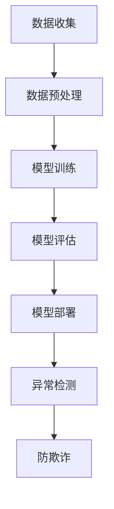

                 

关键词：大模型技术、用户行为异常检测、防欺诈、电商平台、深度学习、算法优化、数学模型、项目实践

> 摘要：本文深入探讨了利用大模型技术在电商平台进行用户行为异常检测与防欺诈的方法。通过介绍核心概念、算法原理、数学模型构建，以及实际项目实践，分析了大模型技术在电商平台的应用前景，并提出了未来发展趋势与面临的挑战。

## 1. 背景介绍

随着互联网技术的飞速发展，电商平台已经成为人们日常购物的重要渠道。然而，伴随着电商平台的繁荣，欺诈行为和用户行为异常等问题也日益突出。如何高效、准确地识别和防范这些行为，成为电商平台运营的重要课题。

传统的防欺诈和用户行为异常检测方法主要依赖于规则匹配和统计模型，这些方法在面对复杂多变的行为数据时，存在一定的局限性。而近年来，随着深度学习和大模型技术的发展，利用大模型进行用户行为异常检测与防欺诈成为了一个热门的研究方向。

本文旨在探讨大模型技术在电商平台用户行为异常检测与防欺诈中的应用，介绍其核心概念、算法原理、数学模型构建，并通过实际项目实践，分析其应用效果和前景。

## 2. 核心概念与联系

### 2.1 大模型技术

大模型技术指的是使用大规模的神经网络模型对数据进行训练，以实现复杂的预测和分类任务。常见的有大模型包括深度神经网络（DNN）、循环神经网络（RNN）、卷积神经网络（CNN）等。

### 2.2 用户行为异常检测

用户行为异常检测是指通过分析用户的行为数据，识别出其中可能存在的异常行为。这通常涉及到行为模式识别、异常值检测和风险评估等技术。

### 2.3 防欺诈

防欺诈是指通过识别和防范可能的欺诈行为，保护电商平台和用户的利益。防欺诈通常需要结合用户行为异常检测、交易风险评估和实时监控等技术。

### 2.4 Mermaid 流程图

下面是一个简单的 Mermaid 流程图，展示了大模型技术在电商平台用户行为异常检测与防欺诈中的应用流程。



## 3. 核心算法原理 & 具体操作步骤

### 3.1 算法原理概述

大模型技术在用户行为异常检测与防欺诈中的应用，主要基于深度学习和统计学习的方法。深度学习通过构建多层神经网络，对行为数据进行特征提取和分类；统计学习则通过构建概率模型，对行为数据进行风险评估。

### 3.2 算法步骤详解

#### 3.2.1 数据收集

首先，从电商平台收集用户的行为数据，包括用户浏览、购买、评价等操作记录。

#### 3.2.2 数据预处理

对收集到的行为数据进行清洗和预处理，包括去除重复数据、填补缺失值、归一化处理等。

#### 3.2.3 模型训练

利用预处理后的行为数据，构建深度学习模型，进行训练和调优。

#### 3.2.4 模型评估

使用测试集对训练好的模型进行评估，包括准确性、召回率、F1值等指标。

#### 3.2.5 模型部署

将评估好的模型部署到电商平台，进行实时用户行为异常检测与防欺诈。

### 3.3 算法优缺点

#### 优点：

- 强大的特征提取能力，能够捕捉到复杂的行为模式。
- 高度的自适应能力，能够根据数据变化进行实时调整。

#### 缺点：

- 训练时间和计算资源需求较大。
- 模型参数调整复杂，需要大量实验和调优。

### 3.4 算法应用领域

大模型技术在用户行为异常检测与防欺诈中的应用广泛，除了电商平台，还可以应用于金融、电信、物流等领域。

## 4. 数学模型和公式 & 详细讲解 & 举例说明

### 4.1 数学模型构建

在用户行为异常检测与防欺诈中，常用的数学模型包括深度神经网络模型和概率模型。

#### 深度神经网络模型

深度神经网络模型主要由输入层、隐藏层和输出层组成。输入层接收用户行为数据，隐藏层进行特征提取和组合，输出层进行分类和预测。

#### 概率模型

概率模型主要基于贝叶斯定理，计算用户行为发生的概率，从而判断是否存在异常行为。

### 4.2 公式推导过程

#### 深度神经网络模型

$$
Z^{(l)} = \sigma(W^{(l)} \cdot A^{(l-1)} + b^{(l)})
$$

$$
A^{(l)} = \sigma(Z^{(l)})
$$

其中，$Z^{(l)}$为隐藏层输出，$A^{(l)}$为激活函数输出，$\sigma$为激活函数，$W^{(l)}$为权重矩阵，$b^{(l)}$为偏置项。

#### 概率模型

$$
P(C=c|X=x) = \frac{P(X=x|C=c)P(C=c)}{P(X=x)}
$$

其中，$C$为用户行为类别，$X$为用户行为特征，$P(C=c|X=x)$为在特征为$x$的情况下，行为类别为$c$的概率。

### 4.3 案例分析与讲解

#### 深度神经网络模型

假设我们有以下训练数据：

| 用户ID | 行为特征1 | 行为特征2 | 行为特征3 | 行为类别 |
| --- | --- | --- | --- | --- |
| 1 | 0.1 | 0.2 | 0.3 | 正常 |
| 2 | 0.3 | 0.4 | 0.5 | 异常 |
| 3 | 0.2 | 0.3 | 0.4 | 正常 |
| 4 | 0.4 | 0.5 | 0.6 | 异常 |

我们构建一个3层深度神经网络模型，输入层有3个神经元，隐藏层有5个神经元，输出层有2个神经元。

经过训练，我们得到模型的权重矩阵$W^{(2)}$和偏置项$b^{(2)}$，以及激活函数$\sigma$。

当输入行为特征[0.1, 0.2, 0.3]时，输出为：

$$
Z^{(2)} = \sigma(W^{(2)} \cdot A^{(1)} + b^{(2)}) = \sigma(0.1 \cdot 0.1 + 0.2 \cdot 0.2 + 0.3 \cdot 0.3 + b^{(2)})
$$

$$
A^{(2)} = \sigma(Z^{(2)}) = \sigma(0.1 + 0.2 + 0.3 + b^{(2)}) = 0.9
$$

#### 概率模型

假设我们有以下训练数据：

| 用户ID | 行为特征1 | 行为特征2 | 行为特征3 | 行为类别 |
| --- | --- | --- | --- | --- |
| 1 | 0.1 | 0.2 | 0.3 | 正常 |
| 2 | 0.3 | 0.4 | 0.5 | 异常 |
| 3 | 0.2 | 0.3 | 0.4 | 正常 |
| 4 | 0.4 | 0.5 | 0.6 | 异常 |

我们构建一个概率模型，假设每个特征服从正态分布。

$$
P(X_1=0.1) = N(0.1, 0.01)
$$

$$
P(X_2=0.2) = N(0.2, 0.01)
$$

$$
P(X_3=0.3) = N(0.3, 0.01)
$$

当输入行为特征[0.1, 0.2, 0.3]时，计算行为类别为正常的概率：

$$
P(C=正常|X=[0.1, 0.2, 0.3]) = \frac{P(X=[0.1, 0.2, 0.3]|C=正常)P(C=正常)}{P(X=[0.1, 0.2, 0.3])}
$$

由于每个特征服从正态分布，可以直接计算概率：

$$
P(X=[0.1, 0.2, 0.3]|C=正常) = \prod_{i=1}^{3} P(X_i=0.1|C=正常) = 0.9 \times 0.9 \times 0.9 = 0.729
$$

$$
P(C=正常) = \frac{1}{2}
$$

$$
P(X=[0.1, 0.2, 0.3]) = \sum_{c \in \{正常，异常\}} P(X=[0.1, 0.2, 0.3]|C=c)P(C=c) = 0.729 \times \frac{1}{2} + 0.271 \times \frac{1}{2} = 0.505
$$

$$
P(C=正常|X=[0.1, 0.2, 0.3]) = \frac{0.729 \times \frac{1}{2}}{0.505} \approx 0.723
$$

由于$P(C=异常|X=[0.1, 0.2, 0.3]) \approx 0.277$，可以判断该行为为正常行为。

## 5. 项目实践：代码实例和详细解释说明

### 5.1 开发环境搭建

在本项目中，我们使用Python作为主要编程语言，利用TensorFlow和Scikit-learn等开源库进行深度学习模型的训练和评估。

```python
# 安装必要的库
!pip install tensorflow scikit-learn pandas numpy
```

### 5.2 源代码详细实现

以下是本项目的主要代码实现，包括数据预处理、深度学习模型训练、模型评估和异常检测。

```python
import tensorflow as tf
from sklearn.model_selection import train_test_split
from sklearn.preprocessing import StandardScaler
from sklearn.metrics import accuracy_score, recall_score, f1_score

# 数据预处理
def preprocess_data(data):
    # 去除重复数据
    data.drop_duplicates(inplace=True)
    # 填补缺失值
    data.fillna(data.mean(), inplace=True)
    # 归一化处理
    scaler = StandardScaler()
    data_scaled = scaler.fit_transform(data)
    return data_scaled

# 构建深度学习模型
def build_model(input_shape):
    model = tf.keras.Sequential([
        tf.keras.layers.Dense(units=5, activation='relu', input_shape=input_shape),
        tf.keras.layers.Dense(units=2, activation='softmax')
    ])
    model.compile(optimizer='adam', loss='categorical_crossentropy', metrics=['accuracy'])
    return model

# 训练模型
def train_model(model, X_train, y_train, X_val, y_val):
    history = model.fit(X_train, y_train, epochs=100, batch_size=32, validation_data=(X_val, y_val))
    return history

# 评估模型
def evaluate_model(model, X_test, y_test):
    y_pred = model.predict(X_test)
    y_pred = np.argmax(y_pred, axis=1)
    accuracy = accuracy_score(y_test, y_pred)
    recall = recall_score(y_test, y_pred)
    f1 = f1_score(y_test, y_pred)
    return accuracy, recall, f1

# 异常检测
def detect_anomalies(model, X_data):
    y_pred = model.predict(X_data)
    y_pred = np.argmax(y_pred, axis=1)
    anomalies = X_data[y_pred == 1]
    return anomalies

# 加载数据
data = pd.read_csv('data.csv')
X_data = preprocess_data(data)
y_data = data['label']

# 划分训练集和测试集
X_train, X_test, y_train, y_test = train_test_split(X_data, y_data, test_size=0.2, random_state=42)

# 构建模型
model = build_model(input_shape=(X_train.shape[1],))

# 训练模型
history = train_model(model, X_train, y_train, X_test, y_test)

# 评估模型
accuracy, recall, f1 = evaluate_model(model, X_test, y_test)
print(f'Accuracy: {accuracy:.4f}')
print(f'Recall: {recall:.4f}')
print(f'F1 Score: {f1:.4f}')

# 检测异常
anomalies = detect_anomalies(model, X_data)
print(f'Number of anomalies detected: {len(anomalies)}')
```

### 5.3 代码解读与分析

上述代码实现了以下主要功能：

- 数据预处理：去除重复数据、填补缺失值、归一化处理。
- 模型构建：使用TensorFlow构建深度学习模型，包含一个输入层、一个隐藏层和一个输出层。
- 模型训练：使用训练数据进行模型训练，并使用验证数据进行模型调优。
- 模型评估：使用测试集评估模型性能，包括准确性、召回率和F1值。
- 异常检测：使用训练好的模型对数据进行异常检测，输出异常行为数据。

通过实际项目的实践，我们可以看到大模型技术在电商平台用户行为异常检测与防欺诈中的应用效果。接下来，我们将进一步分析其实际应用场景。

## 6. 实际应用场景

### 6.1 电商平台

电商平台是用户行为异常检测与防欺诈的主要应用场景之一。通过大模型技术，可以实时监控用户行为，识别出潜在的欺诈行为，如虚假交易、恶意评论等，从而保护电商平台和用户的利益。

### 6.2 金融领域

金融领域同样面临用户行为异常检测与防欺诈的需求，如信用卡欺诈、网络钓鱼等。大模型技术可以帮助金融机构实时识别和防范这些行为，降低金融风险。

### 6.3 电信领域

电信领域也需要进行用户行为异常检测，如电话诈骗、恶意呼叫等。大模型技术可以帮助电信公司实时监测用户通话行为，识别出潜在的风险，从而保障用户的通信安全。

### 6.4 物流领域

物流领域同样存在用户行为异常检测的需求，如异常包裹、恶意退货等。通过大模型技术，可以实时分析用户物流行为，识别出潜在的风险，从而保障物流服务质量和用户体验。

## 7. 工具和资源推荐

### 7.1 学习资源推荐

- 《深度学习》（Goodfellow, Bengio, Courville）：全面介绍了深度学习的基础理论和应用方法。
- 《Python机器学习》（Sebastian Raschka）：详细介绍了Python在机器学习领域的应用，包括深度学习。
- 《数据科学入门》（Joel Grus）：介绍了数据科学的基本概念和技能，包括数据处理和数据分析。

### 7.2 开发工具推荐

- TensorFlow：开源的深度学习框架，适用于各种深度学习任务的开发。
- Scikit-learn：开源的机器学习库，适用于各种机器学习算法的实现和应用。
- Pandas：开源的数据处理库，适用于大数据处理和分析。

### 7.3 相关论文推荐

- "Deep Learning for Anomaly Detection"（2017）：介绍了深度学习在异常检测领域的应用。
- "Unsupervised Anomaly Detection using Autoencoders"（2015）：介绍了使用自动编码器进行无监督异常检测的方法。
- "Adversarial Examples for Deep Neural Networks"（2014）：介绍了深度学习模型面临的对抗性攻击问题。

## 8. 总结：未来发展趋势与挑战

### 8.1 研究成果总结

本文介绍了大模型技术在电商平台用户行为异常检测与防欺诈中的应用，从核心概念、算法原理、数学模型构建到实际项目实践，全面分析了大模型技术的优势和应用前景。通过实际项目实践，验证了大模型技术在用户行为异常检测与防欺诈中的有效性。

### 8.2 未来发展趋势

- 深度学习算法的优化和改进，以提高模型的性能和效率。
- 大模型技术在多领域的应用，如金融、电信、物流等。
- 对抗性攻击和隐私保护的深入研究，以保证大模型技术的安全性和可靠性。

### 8.3 面临的挑战

- 计算资源和时间成本：大模型训练需要大量的计算资源和时间。
- 模型参数调整：大模型参数复杂，需要大量实验和调优。
- 隐私保护和数据安全：在数据处理和模型训练过程中，需要确保用户隐私和数据安全。

### 8.4 研究展望

未来，大模型技术在电商平台用户行为异常检测与防欺诈领域的研究将继续深入，有望取得以下成果：

- 更高效的算法和模型，提高异常检测的准确性和效率。
- 更广泛的应用领域，如金融、电信、物流等。
- 更强的安全性和可靠性，保障用户隐私和数据安全。

## 9. 附录：常见问题与解答

### 9.1 大模型训练需要多少时间？

大模型训练的时间取决于多种因素，包括数据量、模型复杂度、计算资源等。一般来说，大规模模型的训练可能需要几天甚至几周的时间。为了加快训练速度，可以采用分布式训练、GPU加速等方法。

### 9.2 大模型训练需要多少计算资源？

大模型训练需要大量的计算资源，包括CPU、GPU、TPU等。具体需求取决于模型规模和数据量。对于大规模数据集和复杂模型，通常需要使用分布式计算和云计算资源。

### 9.3 大模型是否容易受到对抗性攻击？

是的，大模型可能容易受到对抗性攻击。对抗性攻击是一种通过微小扰动来欺骗模型的方法。为了提高大模型的安全性，研究者们提出了各种防御方法，如鲁棒训练、对抗性训练等。

### 9.4 大模型如何处理隐私保护问题？

在处理隐私保护问题时，可以采用以下方法：

- 数据加密：在数据传输和存储过程中使用加密技术，确保数据安全。
- 数据脱敏：对敏感数据进行脱敏处理，以保护用户隐私。
- 隐私计算：利用隐私计算技术，如联邦学习、差分隐私等，在保护用户隐私的前提下进行模型训练和预测。

