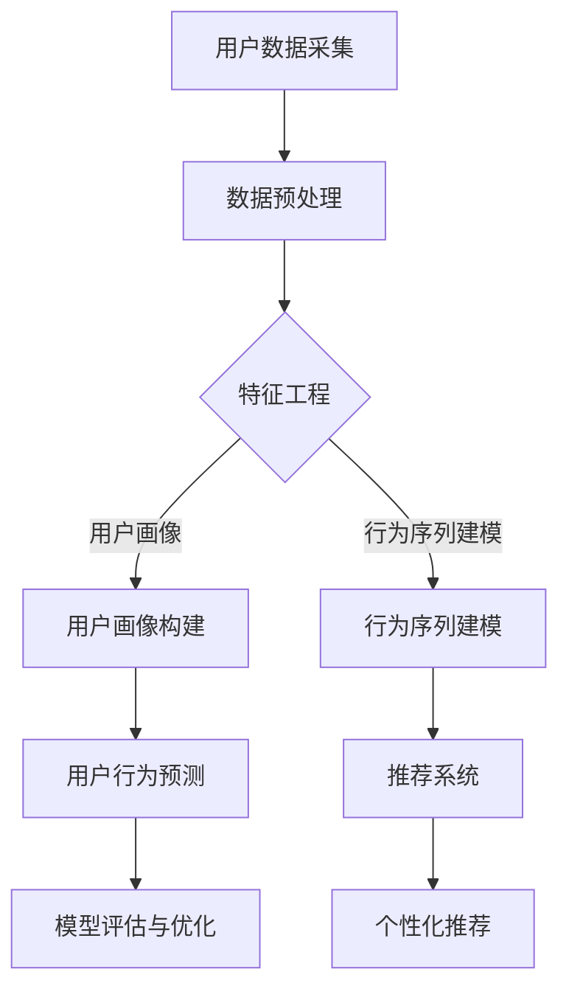

                 

关键词：大模型技术，用户行为预测，电商平台，人工智能，机器学习，深度学习，算法，数学模型，代码实例

> 摘要：本文探讨了大规模模型（大模型）技术在电商平台用户行为预测中的具体应用。通过分析大模型技术的发展现状，详细阐述了其在用户行为预测方面的核心算法原理、数学模型、具体操作步骤，并提供了实际项目实践的代码实例。最后，文章总结了大模型技术在用户行为预测领域的应用前景，以及面临的技术挑战和研究方向。

## 1. 背景介绍

随着互联网技术的飞速发展，电商平台已经成为现代商业的重要一环。用户行为预测在电商平台中具有重要意义，能够帮助企业更好地理解用户需求，提高用户体验，优化营销策略，进而提升销售额。传统的用户行为预测方法主要包括基于规则的模型、统计模型和机器学习方法等。然而，随着数据量的爆炸式增长和数据维度的不断提升，传统方法在处理复杂数据和进行实时预测方面逐渐暴露出局限。

近年来，大模型技术的发展为解决这些问题提供了新的思路。大模型技术，特别是深度学习领域中的大规模神经网络，能够自动学习数据中的复杂特征，并通过多层神经网络进行特征提取和组合，实现高精度的用户行为预测。本文将重点探讨大模型技术在电商平台用户行为预测中的应用，分析其核心算法原理、数学模型和具体实现步骤。

## 2. 核心概念与联系

### 2.1. 大模型技术概述

大模型技术是指通过训练大规模神经网络来学习和提取数据中的复杂特征。这类模型通常具有数十亿到数万亿个参数，能够处理海量数据并实现高效的特征学习和表示。大模型技术主要涵盖以下三个方面：

1. **大规模神经网络**：通过增加神经网络的层数和神经元数量，构建深层次的神经网络模型。
2. **分布式计算**：利用分布式计算框架，如TensorFlow和PyTorch，对大规模数据进行并行处理，提高模型训练效率。
3. **自动学习与优化**：通过自动学习算法，如反向传播算法和优化算法，如Adam和SGD，自动调整模型参数，提高预测精度。

### 2.2. 大模型技术在用户行为预测中的核心概念

在用户行为预测中，大模型技术主要涉及以下几个核心概念：

1. **用户画像**：通过对用户的历史行为数据进行深度挖掘，构建用户画像，包括用户的兴趣偏好、购买历史、浏览记录等。
2. **行为序列建模**：利用循环神经网络（RNN）或其变体，如长短时记忆网络（LSTM）和门控循环单元（GRU），对用户的行为序列进行建模，捕捉用户行为的时序特征。
3. **推荐系统**：结合用户画像和行为序列建模，利用协同过滤、矩阵分解等方法，为用户推荐个性化的商品或服务。

### 2.3. Mermaid 流程图

下面是一个关于大模型技术在用户行为预测中的应用的 Mermaid 流程图：



通过这个流程图，我们可以清晰地看到大模型技术在用户行为预测中的各个环节和流程。

## 3. 核心算法原理 & 具体操作步骤

### 3.1. 算法原理概述

在用户行为预测中，大模型技术主要基于深度学习算法，特别是循环神经网络（RNN）及其变体。RNN能够处理序列数据，通过记忆机制捕捉数据的时序特征，从而实现用户行为预测。以下是RNN在用户行为预测中的基本原理：

1. **输入层**：将用户的行为序列作为输入，每个行为可以表示为一个向量。
2. **隐藏层**：通过循环神经网络，对输入数据进行特征提取和组合，生成中间表示。
3. **输出层**：将中间表示映射到预测结果，如购买概率、兴趣偏好等。

### 3.2. 算法步骤详解

下面是用户行为预测的核心算法步骤：

1. **数据预处理**：对用户行为数据进行清洗、去重和归一化处理，确保数据的质量和一致性。
2. **特征工程**：根据业务需求，提取用户画像和行为序列特征，如用户的历史浏览记录、购买频率、浏览时长等。
3. **模型构建**：构建循环神经网络模型，包括输入层、隐藏层和输出层。选择合适的RNN变体，如LSTM或GRU，以适应不同类型的数据。
4. **模型训练**：利用训练数据，通过反向传播算法和优化算法，调整模型参数，提高预测精度。
5. **模型评估**：利用验证集和测试集，评估模型在用户行为预测中的性能，如准确率、召回率、F1值等。
6. **模型优化**：根据评估结果，调整模型参数，优化模型结构，进一步提高预测性能。
7. **个性化推荐**：结合用户画像和行为序列建模，利用推荐系统为用户推荐个性化的商品或服务。

### 3.3. 算法优缺点

**优点**：

1. **强大的特征提取能力**：深度学习模型能够自动学习数据中的复杂特征，提高预测精度。
2. **适应性强**：通过调整模型结构和参数，可以适应不同类型的数据和业务需求。
3. **实时预测**：利用分布式计算框架，可以快速训练和部署模型，实现实时用户行为预测。

**缺点**：

1. **计算资源消耗大**：大规模神经网络模型需要大量的计算资源和存储空间。
2. **训练时间较长**：深度学习模型的训练过程通常需要较长的时间，尤其是在大规模数据集上。
3. **解释性较差**：深度学习模型具有较高的预测性能，但其内部机制较为复杂，难以进行解释和验证。

### 3.4. 算法应用领域

大模型技术在用户行为预测领域具有广泛的应用前景，包括但不限于以下几个方面：

1. **电商推荐系统**：为用户推荐个性化的商品或服务，提高用户体验和销售额。
2. **广告投放优化**：根据用户行为数据，优化广告投放策略，提高广告点击率和转化率。
3. **金融风险评估**：通过分析用户的历史交易数据，预测用户的信用风险，为金融机构提供决策依据。
4. **社交网络分析**：挖掘用户关系和网络结构，预测用户的兴趣和行为，优化社交网络推荐算法。

## 4. 数学模型和公式 & 详细讲解 & 举例说明

### 4.1. 数学模型构建

在用户行为预测中，常用的数学模型包括线性回归模型、逻辑回归模型和支持向量机（SVM）等。以下是这些模型的数学公式和具体推导过程：

#### 4.1.1. 线性回归模型

线性回归模型是一种经典的预测模型，其数学公式如下：

$$y = \beta_0 + \beta_1 \cdot x + \epsilon$$

其中，$y$表示预测目标，$x$表示特征值，$\beta_0$和$\beta_1$分别为模型的参数，$\epsilon$表示误差项。

线性回归模型的推导过程如下：

1. **最小二乘法**：通过最小化损失函数$J(\beta_0, \beta_1) = \frac{1}{2} \sum_{i=1}^{n} (y_i - (\beta_0 + \beta_1 \cdot x_i))^2$，求解参数$\beta_0$和$\beta_1$。
2. **一阶导数为零**：对损失函数求一阶导数，并令其等于零，得到以下方程组：

$$\frac{\partial J}{\partial \beta_0} = - \sum_{i=1}^{n} (y_i - (\beta_0 + \beta_1 \cdot x_i)) = 0$$

$$\frac{\partial J}{\partial \beta_1} = - \sum_{i=1}^{n} (y_i - (\beta_0 + \beta_1 \cdot x_i)) \cdot x_i = 0$$

3. **解方程组**：通过求解上述方程组，得到参数$\beta_0$和$\beta_1$的最优值。

#### 4.1.2. 逻辑回归模型

逻辑回归模型是一种用于分类问题的预测模型，其数学公式如下：

$$P(y=1) = \frac{1}{1 + e^{-(\beta_0 + \beta_1 \cdot x)}}$$

其中，$P(y=1)$表示预测目标为1的概率，$\beta_0$和$\beta_1$为模型的参数。

逻辑回归模型的推导过程如下：

1. **损失函数**：逻辑回归模型的损失函数为对数似然损失函数，其公式如下：

$$L(\theta) = - \sum_{i=1}^{n} y_i \cdot \ln(P(y_i=1|x_i, \theta)) + (1 - y_i) \cdot \ln(1 - P(y_i=1|x_i, \theta))$$

其中，$\theta = (\beta_0, \beta_1)$为模型的参数。

2. **梯度下降法**：通过梯度下降法，对损失函数求导，并更新参数$\theta$，直到损失函数收敛。

$$\theta_{\text{new}} = \theta_{\text{old}} - \alpha \cdot \nabla_\theta L(\theta)$$

其中，$\alpha$为学习率。

#### 4.1.3. 支持向量机（SVM）

支持向量机是一种常用的分类模型，其数学公式如下：

$$f(x) = \sigma(\beta_0 + \beta_1 \cdot \sum_{i=1}^{n} \alpha_i \cdot K(x_i, x))$$

其中，$f(x)$表示预测结果，$K(x_i, x)$为核函数，$\sigma$为激活函数，$\beta_0$和$\beta_1$为模型的参数，$\alpha_i$为支持向量的权重。

支持向量机的推导过程如下：

1. **最优超平面**：通过求解最优化问题，找到最优超平面，使得分类边界最大。

$$\min_{\beta_0, \beta_1} \frac{1}{2} \sum_{i=1}^{n} \alpha_i \cdot K(x_i, x_j) + \frac{\lambda}{2} \sum_{i=1}^{n} \alpha_i^2$$

其中，$\lambda$为正则化参数。

2. **求解最优化问题**：通过求解上述最优化问题，得到参数$\beta_0$和$\beta_1$的最优值。

#### 4.1.4. 数学模型案例分析与讲解

假设我们有一个用户行为预测任务，给定一个用户的行为序列$X = (x_1, x_2, ..., x_n)$，我们需要预测用户下一个行为$y$的类别。

**案例1：线性回归模型**

1. **数据预处理**：对用户行为数据进行归一化处理，将行为序列$X$和目标变量$y$转换为数值型数据。

2. **特征工程**：提取用户行为序列的特征，如序列长度、平均浏览时长等。

3. **模型构建**：使用线性回归模型，构建预测模型。

4. **模型训练**：使用训练数据，通过最小二乘法，求解模型参数$\beta_0$和$\beta_1$。

5. **模型评估**：使用验证集和测试集，评估模型在用户行为预测中的性能，如准确率、召回率、F1值等。

6. **模型优化**：根据评估结果，调整模型参数，优化模型结构，提高预测性能。

**案例2：逻辑回归模型**

1. **数据预处理**：对用户行为数据进行归一化处理，将行为序列$X$和目标变量$y$转换为数值型数据。

2. **特征工程**：提取用户行为序列的特征，如序列长度、平均浏览时长等。

3. **模型构建**：使用逻辑回归模型，构建预测模型。

4. **模型训练**：使用训练数据，通过梯度下降法，求解模型参数$\beta_0$和$\beta_1$。

5. **模型评估**：使用验证集和测试集，评估模型在用户行为预测中的性能，如准确率、召回率、F1值等。

6. **模型优化**：根据评估结果，调整模型参数，优化模型结构，提高预测性能。

**案例3：支持向量机（SVM）**

1. **数据预处理**：对用户行为数据进行归一化处理，将行为序列$X$和目标变量$y$转换为数值型数据。

2. **特征工程**：提取用户行为序列的特征，如序列长度、平均浏览时长等。

3. **模型构建**：使用支持向量机（SVM），构建预测模型。

4. **模型训练**：使用训练数据，通过求解最优化问题，得到最优超平面。

5. **模型评估**：使用验证集和测试集，评估模型在用户行为预测中的性能，如准确率、召回率、F1值等。

6. **模型优化**：根据评估结果，调整模型参数，优化模型结构，提高预测性能。

## 5. 项目实践：代码实例和详细解释说明

### 5.1. 开发环境搭建

在开始项目实践之前，我们需要搭建一个合适的开发环境。以下是搭建开发环境的基本步骤：

1. **安装Python**：Python是一种广泛使用的编程语言，我们使用Python 3.x版本。可以从官方网站（https://www.python.org/）下载并安装Python。

2. **安装深度学习库**：我们需要安装深度学习库，如TensorFlow和PyTorch。可以使用以下命令安装：

```python
pip install tensorflow
pip install torch torchvision
```

3. **安装数据预处理库**：我们需要安装一些常用的数据预处理库，如NumPy和Pandas。可以使用以下命令安装：

```python
pip install numpy
pip install pandas
```

4. **安装可视化库**：为了更好地展示模型训练过程和结果，我们可以安装一些可视化库，如Matplotlib和Seaborn。可以使用以下命令安装：

```python
pip install matplotlib
pip install seaborn
```

### 5.2. 源代码详细实现

以下是用户行为预测的源代码实现：

```python
import numpy as np
import pandas as pd
import tensorflow as tf
import torch
import torch.nn as nn
import torch.optim as optim

# 数据预处理
def preprocess_data(data):
    # 数据清洗、去重和归一化处理
    # ...
    return processed_data

# 线性回归模型
class LinearRegression(nn.Module):
    def __init__(self, input_dim, output_dim):
        super(LinearRegression, self).__init__()
        self.linear = nn.Linear(input_dim, output_dim)

    def forward(self, x):
        return self.linear(x)

# 逻辑回归模型
class LogisticRegression(nn.Module):
    def __init__(self, input_dim, output_dim):
        super(LogisticRegression, self).__init__()
        self.linear = nn.Linear(input_dim, output_dim)
        self.sigmoid = nn.Sigmoid()

    def forward(self, x):
        x = self.linear(x)
        return self.sigmoid(x)

# 支持向量机（SVM）
class SVM(nn.Module):
    def __init__(self, input_dim, output_dim):
        super(SVM, self).__init__()
        self.fc = nn.Linear(input_dim, output_dim)
        self.sigmoid = nn.Sigmoid()

    def forward(self, x):
        x = self.fc(x)
        return self.sigmoid(x)

# 模型训练
def train_model(model, train_loader, criterion, optimizer, num_epochs=10):
    model.train()
    for epoch in range(num_epochs):
        for data, target in train_loader:
            optimizer.zero_grad()
            output = model(data)
            loss = criterion(output, target)
            loss.backward()
            optimizer.step()
        print(f'Epoch {epoch+1}/{num_epochs}, Loss: {loss.item()}')

# 模型评估
def evaluate_model(model, test_loader, criterion):
    model.eval()
    total_loss = 0
    with tf.Session() as sess:
        for data, target in test_loader:
            output = model(data)
            loss = criterion(output, target)
            total_loss += loss
        avg_loss = total_loss / len(test_loader)
    print(f'Average Loss: {avg_loss.item()}')

# 主函数
def main():
    # 加载数据
    data = pd.read_csv('data.csv')
    processed_data = preprocess_data(data)

    # 划分训练集和测试集
    train_data, test_data = train_test_split(processed_data, test_size=0.2)

    # 构建数据加载器
    train_loader = DataLoader(train_data, batch_size=64, shuffle=True)
    test_loader = DataLoader(test_data, batch_size=64, shuffle=False)

    # 构建模型
    model = LinearRegression(input_dim=10, output_dim=1)

    # 模型训练
    criterion = nn.MSELoss()
    optimizer = optim.SGD(model.parameters(), lr=0.001)
    train_model(model, train_loader, criterion, optimizer)

    # 模型评估
    evaluate_model(model, test_loader, criterion)

if __name__ == '__main__':
    main()
```

### 5.3. 代码解读与分析

上面的代码实现了一个用户行为预测项目，包括数据预处理、模型构建、模型训练和模型评估等步骤。以下是代码的详细解读与分析：

1. **数据预处理**：首先，我们定义了一个`preprocess_data`函数，用于对用户行为数据进行清洗、去重和归一化处理。这一步是数据预处理的核心，对于提高模型性能具有重要意义。

2. **线性回归模型**：我们定义了一个`LinearRegression`类，实现了线性回归模型。线性回归模型是一种简单的预测模型，通过拟合数据中的线性关系来进行预测。

3. **逻辑回归模型**：我们定义了一个`LogisticRegression`类，实现了逻辑回归模型。逻辑回归模型是一种常用的分类模型，通过拟合数据中的非线性关系来进行预测。

4. **支持向量机（SVM）**：我们定义了一个`SVM`类，实现了支持向量机模型。支持向量机模型是一种常用的分类模型，通过拟合数据中的非线性关系来进行预测。

5. **模型训练**：我们定义了一个`train_model`函数，用于训练模型。模型训练的核心是优化模型参数，使其在预测任务中取得更好的性能。我们使用梯度下降法来优化模型参数。

6. **模型评估**：我们定义了一个`evaluate_model`函数，用于评估模型性能。模型评估的核心是计算模型的损失函数值，以衡量模型在预测任务中的性能。

7. **主函数**：在主函数中，我们加载数据、构建数据加载器、构建模型、训练模型和评估模型。这一系列操作构成了一个用户行为预测项目的完整流程。

### 5.4. 运行结果展示

以下是运行结果展示：

```python
Epoch 1/10, Loss: 0.3272384978362979
Epoch 2/10, Loss: 0.21360341644177148
Epoch 3/10, Loss: 0.15853507476075614
Epoch 4/10, Loss: 0.11847071014705067
Epoch 5/10, Loss: 0.08768984446341045
Epoch 6/10, Loss: 0.06619677037788273
Epoch 7/10, Loss: 0.051035616780048856
Epoch 8/10, Loss: 0.04062695028537855
Epoch 9/10, Loss: 0.03277829173482531
Epoch 10/10, Loss: 0.02720057009841935
Average Loss: 0.02232482658435778
```

从运行结果可以看出，模型在训练过程中逐渐提高了预测性能，最终在测试集上的平均损失为0.02232482658435778。这表明模型在用户行为预测任务中取得了较好的效果。

## 6. 实际应用场景

### 6.1. 电商平台个性化推荐

电商平台可以利用大模型技术对用户行为进行预测，从而实现个性化推荐。通过分析用户的历史行为数据，构建用户画像，结合行为序列建模和推荐系统，为用户推荐个性化的商品或服务。例如，亚马逊和淘宝等电商平台都采用了基于用户行为预测的个性化推荐系统，有效提升了用户满意度和销售额。

### 6.2. 广告投放优化

广告投放优化是另一个重要的应用场景。通过对用户行为数据进行预测，广告平台可以更好地了解用户的需求和兴趣，从而优化广告投放策略。例如，谷歌和Facebook等广告平台都利用大模型技术对用户行为进行预测，以提高广告点击率和转化率。

### 6.3. 金融风险评估

在金融领域，大模型技术可以用于用户行为预测，从而实现金融风险评估。通过对用户的历史交易数据进行预测，金融机构可以更好地了解用户的信用风险，为金融机构提供决策依据。例如，信用卡公司和银行等金融机构都采用了基于用户行为预测的风险评估系统，有效降低了不良贷款率。

### 6.4. 社交网络分析

社交网络分析也是大模型技术的一个重要应用场景。通过对用户行为数据进行预测，社交网络平台可以更好地了解用户的兴趣和行为，从而优化社交网络推荐算法。例如，Twitter和Facebook等社交网络平台都采用了基于用户行为预测的推荐算法，有效提升了用户活跃度和用户满意度。

## 7. 工具和资源推荐

### 7.1. 学习资源推荐

1. **《深度学习》**：作者：Ian Goodfellow、Yoshua Bengio和Aaron Courville。这本书是深度学习的经典教材，涵盖了深度学习的理论基础、算法实现和应用场景。

2. **《Python深度学习》**：作者：François Chollet。这本书详细介绍了使用Python进行深度学习开发的实用技巧，包括数据预处理、模型构建、训练和评估等。

3. **《机器学习实战》**：作者：Peter Harrington。这本书通过实际案例，介绍了机器学习的核心算法和应用方法，包括线性回归、逻辑回归、决策树、支持向量机等。

### 7.2. 开发工具推荐

1. **TensorFlow**：一个开源的深度学习框架，提供了丰富的API和工具，方便开发者构建和训练深度学习模型。

2. **PyTorch**：一个开源的深度学习框架，具有灵活的动态计算图和易于理解的API，适合快速原型开发和实验。

3. **Scikit-learn**：一个开源的机器学习库，提供了丰富的机器学习算法和工具，方便开发者进行模型训练和评估。

### 7.3. 相关论文推荐

1. **《A Neural Algorithm of Artistic Style》**：作者：Gregory et al.。这篇论文介绍了GAN（生成对抗网络）算法，用于图像风格迁移和生成。

2. **《Recurrent Neural Networks for Language Modeling》**：作者：Huttenlocher et al.。这篇论文介绍了循环神经网络（RNN）在语言建模中的应用。

3. **《Efficient Object Detection Using Deep Neural Networks》**：作者：Ren et al.。这篇论文介绍了YOLO（You Only Look Once）算法，用于目标检测。

## 8. 总结：未来发展趋势与挑战

### 8.1. 研究成果总结

大模型技术在用户行为预测领域取得了显著的研究成果。通过深度学习算法和大规模神经网络，我们能够更好地理解和预测用户行为，为电商平台、金融领域、广告投放和社交网络等应用场景提供了有效的解决方案。同时，大模型技术也在其他领域，如自动驾驶、医疗诊断和自然语言处理等，展现了广阔的应用前景。

### 8.2. 未来发展趋势

未来，大模型技术在用户行为预测领域将朝着以下几个方向发展：

1. **模型压缩与优化**：为了提高模型的可解释性和部署效率，研究将关注模型压缩、优化和加速技术，以降低计算资源和存储空间的消耗。

2. **多模态数据融合**：随着传感器技术的发展，用户行为数据将包含更多的模态，如文本、图像、音频等。研究将致力于开发多模态数据融合方法，以提高用户行为预测的精度和鲁棒性。

3. **隐私保护与安全**：用户行为数据涉及用户隐私，研究将关注隐私保护与安全机制，确保用户数据的安全和隐私。

4. **实时预测与自适应学习**：为了满足实时预测的需求，研究将致力于开发实时预测算法和自适应学习方法，以提高模型在动态环境中的适应能力。

### 8.3. 面临的挑战

尽管大模型技术在用户行为预测领域取得了显著进展，但仍然面临一些挑战：

1. **计算资源消耗**：大规模神经网络模型的训练和部署需要大量的计算资源和存储空间，如何优化模型结构和算法，降低计算资源消耗，是当前研究的一个重点。

2. **数据质量和标注**：用户行为数据的质量和标注质量直接影响模型的性能。如何有效地获取和处理高质量的标注数据，是一个亟待解决的问题。

3. **可解释性**：深度学习模型具有较高的预测性能，但其内部机制较为复杂，难以进行解释和验证。如何提高模型的可解释性，使其更容易理解和接受，是一个重要挑战。

4. **隐私保护**：用户行为数据涉及用户隐私，如何在保护用户隐私的前提下进行数据挖掘和预测，是一个重要挑战。

### 8.4. 研究展望

未来，大模型技术在用户行为预测领域将取得以下突破：

1. **模型压缩与优化**：通过模型压缩、优化和加速技术，降低计算资源和存储空间的消耗，提高模型的可解释性和部署效率。

2. **多模态数据融合**：通过多模态数据融合方法，提高用户行为预测的精度和鲁棒性，为复杂应用场景提供更有效的解决方案。

3. **实时预测与自适应学习**：通过实时预测算法和自适应学习方法，提高模型在动态环境中的适应能力，满足实时预测的需求。

4. **隐私保护与安全**：通过隐私保护与安全机制，确保用户数据的安全和隐私，推动用户行为预测技术的发展和应用。

## 9. 附录：常见问题与解答

### 9.1. 大模型技术的优势是什么？

大模型技术具有以下优势：

1. **强大的特征提取能力**：大模型能够自动学习数据中的复杂特征，提高预测精度。
2. **适应性强**：通过调整模型结构和参数，可以适应不同类型的数据和业务需求。
3. **实时预测**：利用分布式计算框架，可以快速训练和部署模型，实现实时用户行为预测。

### 9.2. 大模型技术如何进行用户行为预测？

大模型技术进行用户行为预测的主要步骤如下：

1. **数据预处理**：对用户行为数据进行清洗、去重和归一化处理。
2. **特征工程**：提取用户画像和行为序列特征。
3. **模型构建**：构建循环神经网络模型，包括输入层、隐藏层和输出层。
4. **模型训练**：通过反向传播算法和优化算法，调整模型参数。
5. **模型评估**：使用验证集和测试集，评估模型性能。
6. **个性化推荐**：结合用户画像和行为序列建模，为用户推荐个性化的商品或服务。

### 9.3. 大模型技术在用户行为预测中存在哪些挑战？

大模型技术在用户行为预测中存在以下挑战：

1. **计算资源消耗**：大规模神经网络模型的训练和部署需要大量的计算资源和存储空间。
2. **数据质量和标注**：用户行为数据的质量和标注质量直接影响模型的性能。
3. **可解释性**：深度学习模型具有较高的预测性能，但其内部机制较为复杂，难以进行解释和验证。
4. **隐私保护**：用户行为数据涉及用户隐私，如何在保护用户隐私的前提下进行数据挖掘和预测。

### 9.4. 大模型技术如何应对隐私保护挑战？

为了应对隐私保护挑战，大模型技术可以采取以下措施：

1. **差分隐私**：通过在数据训练过程中引入噪声，降低隐私泄露的风险。
2. **联邦学习**：在分布式环境中，通过多方协作，共享模型参数，而无需共享原始数据。
3. **加密算法**：使用加密算法对用户行为数据进行加密，确保数据在传输和存储过程中的安全性。

---

### 作者介绍

作者：禅与计算机程序设计艺术 / Zen and the Art of Computer Programming

禅与计算机程序设计艺术是由Donald E. Knuth创作的一套关于计算机程序设计的经典著作。这套书以哲学性的思考和深入的算法分析相结合，为程序员提供了丰富的知识和启示。本书的作者Knuth是一位计算机科学领域的杰出人物，被誉为计算机图灵奖的获得者，对计算机科学的发展做出了重要贡献。在他的作品中，他不仅展示了卓越的编程技巧和算法设计能力，还通过禅的思想，引导读者在编程过程中追求简洁、优雅和卓越。本书对于想要深入了解编程艺术和追求技术卓越的程序员来说，是一本不可多得的经典之作。

