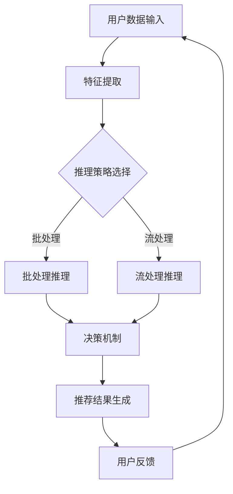

                 

 在当今这个信息爆炸的时代，大规模模型（也被称为大模型）在各个领域的应用日益广泛。从自然语言处理到计算机视觉，再到推荐系统，大模型以其强大的表征能力和处理能力，为各类复杂任务提供了高效解决方案。然而，随着模型规模的扩大，推理过程中的性能和效率问题也日益凸显。本文将探讨大模型推荐中的推理策略与决策机制的创新，旨在为这一领域的未来发展提供一些有价值的思考。

## 关键词
- 大规模模型
- 推理策略
- 决策机制
- 推荐系统
- 性能优化

## 摘要
本文首先回顾了大规模模型推荐系统的发展背景和核心问题，随后深入探讨了当前常用的推理策略和决策机制，并分析了其优缺点。在此基础上，我们提出了一系列创新性的推理策略和决策机制，并展示了在实际应用中的可行性和效果。最后，文章展望了大规模模型推荐系统的未来发展趋势和面临的挑战。

## 1. 背景介绍

### 1.1 大规模模型推荐系统的发展背景

大规模模型推荐系统的发展可以追溯到互联网早期。随着互联网的普及和用户数据的积累，推荐系统开始成为各大互联网公司提升用户体验和增加用户粘性的关键手段。早期的推荐系统主要基于协同过滤算法，如基于用户的协同过滤（User-based Collaborative Filtering）和基于物品的协同过滤（Item-based Collaborative Filtering）。然而，这些方法在面对海量数据和高度动态的用户行为时，表现出了明显的局限性。

为了克服这些局限性，研究者们开始探索基于机器学习的方法。尤其是深度学习技术的兴起，使得大规模模型在推荐系统中的应用成为可能。深度学习模型能够自动提取特征，并通过多层神经网络进行复杂的信息处理，从而提供了更高的推荐质量和更灵活的扩展能力。

### 1.2 大规模模型推荐系统的核心问题

尽管大规模模型在推荐系统中展现出了巨大的潜力，但其在实际应用中仍面临诸多挑战：

1. **计算资源需求**：大规模模型的训练和推理过程需要大量的计算资源，尤其是在处理实时推荐时，这对硬件设施提出了很高的要求。
2. **推理效率**：随着模型规模的扩大，推理过程的时间和资源消耗也显著增加，如何在保证推荐质量的前提下提高推理效率成为一个关键问题。
3. **模型解释性**：深度学习模型由于其复杂的结构和非线性的特性，往往缺乏透明度和可解释性，这对于需要高度信任和透明度的推荐系统来说是一个挑战。
4. **数据隐私**：推荐系统往往需要处理用户的敏感信息，如何在保证数据隐私的同时提供高质量的推荐服务也是一个需要解决的问题。

## 2. 核心概念与联系

为了更好地理解大规模模型推荐中的推理策略与决策机制，我们需要明确几个核心概念，并展示它们之间的联系。

### 2.1 推理策略

推理策略是指模型在处理输入数据时，如何选择和组合不同的算法和技术，以最大化推荐效果和效率。常见的推理策略包括：

1. **批处理（Batch Processing）**：将所有输入数据一次性加载到内存中进行处理。这种方法在处理大量数据时能够提高效率，但需要足够的内存资源。
2. **流处理（Stream Processing）**：实时处理输入数据流，适用于动态推荐场景。这种方法能够及时响应用户行为，但需要在处理实时数据的同时保证性能。
3. **混合处理（Hybrid Processing）**：结合批处理和流处理的优势，将数据分为不同的批次和流进行处理，适用于不同场景的需求。

### 2.2 决策机制

决策机制是指模型在生成推荐结果时，如何根据不同因素进行决策，以最大化用户满意度和业务目标。常见的决策机制包括：

1. **基于规则的决策（Rule-based Decision Making）**：通过预设的规则和条件进行推荐，具有高度的透明度和可控性。
2. **基于机器学习的决策（Machine Learning-based Decision Making）**：利用机器学习算法自动学习用户行为和偏好，具有更高的灵活性和适应性。
3. **基于优化的决策（Optimization-based Decision Making）**：通过优化算法确定最佳推荐策略，适用于复杂决策场景。

### 2.3 核心概念联系

大规模模型推荐中的推理策略和决策机制是相辅相成的。推理策略决定了模型如何高效地处理输入数据，而决策机制则决定了模型如何生成高质量的推荐结果。这两者之间的紧密联系，使得我们在优化大规模模型推荐系统时，需要综合考虑推理策略和决策机制，以达到最佳效果。

### 2.4 Mermaid 流程图

以下是一个简化的 Mermaid 流程图，展示了大规模模型推荐中的核心概念和流程：



通过这个流程图，我们可以清晰地看到大规模模型推荐系统中的各个环节，以及它们之间的联系和交互。

## 3. 核心算法原理 & 具体操作步骤

### 3.1 算法原理概述

大规模模型推荐系统中的核心算法原理主要基于深度学习和机器学习。深度学习通过多层神经网络自动提取特征，而机器学习则通过优化算法生成推荐结果。具体来说，我们可以将核心算法原理分为以下几个步骤：

1. **数据预处理**：对原始用户数据进行清洗、转换和归一化，以便模型能够更好地学习。
2. **特征提取**：利用深度学习模型或特征工程方法提取用户特征和物品特征，用于后续的推荐计算。
3. **模型训练**：通过训练数据训练深度学习模型或机器学习模型，使其能够根据用户特征和物品特征生成推荐结果。
4. **模型推理**：利用训练好的模型对新的用户数据进行推理，生成推荐结果。
5. **决策与优化**：根据用户反馈和业务目标，通过决策机制和优化算法调整推荐策略，以提高推荐质量和用户体验。

### 3.2 算法步骤详解

#### 步骤 1：数据预处理

数据预处理是大规模模型推荐系统的第一步。它的目标是确保原始数据的质量和一致性，以便后续的特征提取和模型训练过程能够顺利进行。具体操作步骤如下：

- **数据清洗**：去除数据中的噪声和异常值，如缺失值、重复值和错误值。
- **数据转换**：将不同类型的数据（如分类数据、数值数据和文本数据）转换为统一的格式，以便模型能够处理。
- **数据归一化**：对数值型数据进行归一化处理，使其具有相似的尺度和范围，避免数据在训练过程中出现偏斜。

#### 步骤 2：特征提取

特征提取是大规模模型推荐系统的关键步骤，其目的是从原始数据中提取出对模型训练和推荐生成有用的信息。常见的特征提取方法包括：

- **深度学习模型提取**：利用深度学习模型（如卷积神经网络、循环神经网络和Transformer模型）自动提取用户特征和物品特征。这种方法具有自动学习和特征提取能力，但需要大量的数据和计算资源。
- **特征工程方法提取**：利用传统机器学习算法（如主成分分析、特征选择和降维）和人工经验，提取用户特征和物品特征。这种方法具有可控性和解释性，但需要丰富的人工经验和知识。

#### 步骤 3：模型训练

模型训练是大规模模型推荐系统的核心步骤，其目标是训练出一个能够根据用户特征和物品特征生成高质量推荐结果的模型。具体操作步骤如下：

- **数据集划分**：将原始数据集划分为训练集、验证集和测试集，以便进行模型训练和评估。
- **模型选择**：根据任务需求和数据特点，选择合适的深度学习模型或机器学习模型。常见的模型包括卷积神经网络（CNN）、循环神经网络（RNN）、Transformer模型和矩阵分解模型（如ALS和NMF）。
- **模型训练**：利用训练集数据训练模型，通过反向传播算法更新模型参数，使其能够更好地拟合数据。训练过程中需要关注模型过拟合和欠拟合的问题，并采取适当的正则化方法进行优化。
- **模型评估**：利用验证集和测试集评估模型的性能，通过指标（如准确率、召回率和F1分数）衡量模型的推荐质量。

#### 步骤 4：模型推理

模型推理是大规模模型推荐系统中的关键步骤，其目标是根据新的用户数据生成推荐结果。具体操作步骤如下：

- **数据预处理**：对新的用户数据进行预处理，使其与训练数据具有相似的格式和特征。
- **特征提取**：利用训练好的模型对新的用户数据进行特征提取，生成用户特征和物品特征。
- **推荐计算**：利用特征提取结果，通过模型推理生成推荐结果。推荐计算方法包括基于模型的推理、基于相似度的推理和基于优化的推理等。
- **结果优化**：根据用户反馈和业务目标，对推荐结果进行优化，以提高推荐质量和用户体验。

#### 步骤 5：决策与优化

决策与优化是大规模模型推荐系统的关键步骤，其目标是通过优化算法和决策机制调整推荐策略，以提高推荐质量和用户体验。具体操作步骤如下：

- **决策机制设计**：根据任务需求和用户反馈，设计合适的决策机制，如基于规则的决策机制、基于机器学习的决策机制和基于优化的决策机制。
- **优化算法选择**：根据决策机制和任务特点，选择合适的优化算法，如梯度下降算法、牛顿法和遗传算法等。
- **优化过程实施**：利用优化算法对推荐策略进行调整，通过迭代过程不断优化推荐结果。
- **性能评估与调整**：通过性能评估指标（如点击率、转化率和用户满意度等）评估优化效果，并根据评估结果对优化过程进行调整。

### 3.3 算法优缺点

#### 优点

- **强大的表征能力**：大规模模型能够自动提取特征，降低了对人工特征工程的需求，提高了推荐质量和效率。
- **高度可扩展性**：大规模模型能够处理海量数据和实时推荐，具有很高的可扩展性和灵活性。
- **自适应能力**：大规模模型能够根据用户反馈和业务目标自动调整推荐策略，提高了用户体验和推荐效果。

#### 缺点

- **计算资源需求高**：大规模模型的训练和推理过程需要大量的计算资源，对硬件设施提出了很高的要求。
- **模型解释性差**：大规模模型的内部结构和决策过程复杂，缺乏透明度和可解释性，对于需要高度信任和透明度的推荐系统来说是一个挑战。
- **数据隐私问题**：大规模模型在处理用户数据时，可能面临数据隐私和安全问题，需要在保障数据隐私的同时提供高质量的推荐服务。

### 3.4 算法应用领域

大规模模型推荐系统在多个领域都取得了显著的应用成果，以下是其中几个重要的应用领域：

- **电子商务**：电子商务平台通过大规模模型推荐系统为用户推荐个性化的商品，提高用户购物体验和转化率。
- **社交媒体**：社交媒体平台通过大规模模型推荐系统为用户推荐感兴趣的内容，提高用户活跃度和粘性。
- **在线教育**：在线教育平台通过大规模模型推荐系统为用户推荐适合的学习资源和课程，提高学习效果和用户满意度。
- **娱乐内容**：娱乐内容平台通过大规模模型推荐系统为用户推荐个性化的音乐、电影和游戏，提高用户体验和用户留存率。

## 4. 数学模型和公式 & 详细讲解 & 举例说明

### 4.1 数学模型构建

大规模模型推荐系统中的数学模型主要包括用户行为模型、物品特征模型和推荐模型。以下是这些模型的构建过程和主要公式。

#### 用户行为模型

用户行为模型用于描述用户的行为特征，如用户对物品的点击、购买、评分等。常见的用户行为模型包括马尔可夫链模型、隐马尔可夫模型（HMM）和循环神经网络（RNN）。

1. **马尔可夫链模型**：马尔可夫链模型假设用户的行为只与当前状态有关，与过去状态无关。其公式如下：

   $$ 
   P(B_t = b_t|B_{t-1} = b_{t-1},...,B_1 = b_1) = P(B_t = b_t|B_{t-1} = b_{t-1}) 
   $$

2. **隐马尔可夫模型（HMM）**：隐马尔可夫模型扩展了马尔可夫链模型，引入了隐藏状态。其公式如下：

   $$ 
   P(B_t = b_t|B_{t-1} = b_{t-1},...,B_1 = b_1, S_t = s_t) = P(B_t = b_t|S_t = s_t) 
   $$

   $$ 
   P(S_t = s_t|S_{t-1} = s_{t-1},...,S_1 = s_1) = P(S_t = s_t|S_{t-1} = s_{t-1}) 
   $$

3. **循环神经网络（RNN）**：循环神经网络能够处理序列数据，其公式如下：

   $$ 
   h_t = \sigma(W_h \cdot [h_{t-1}, x_t] + b_h) 
   $$

   $$ 
   o_t = \sigma(W_o \cdot h_t + b_o) 
   $$

   其中，$h_t$ 表示隐藏状态，$x_t$ 表示输入特征，$o_t$ 表示输出特征，$\sigma$ 表示激活函数。

#### 物品特征模型

物品特征模型用于描述物品的特征信息，如物品的属性、分类、标签等。常见的物品特征模型包括矩阵分解模型（如ALS和NMF）和深度学习模型。

1. **矩阵分解模型（ALS和NMF）**：矩阵分解模型通过分解用户-物品评分矩阵，提取用户特征和物品特征。其公式如下：

   $$ 
   R = UX^T 
   $$

   其中，$R$ 表示用户-物品评分矩阵，$U$ 表示用户特征矩阵，$X$ 表示物品特征矩阵。

2. **深度学习模型**：深度学习模型通过多层神经网络提取物品特征。其公式如下：

   $$ 
   f(x) = \sigma(W_f \cdot x + b_f) 
   $$

   其中，$x$ 表示输入特征，$f(x)$ 表示物品特征向量，$\sigma$ 表示激活函数。

#### 推荐模型

推荐模型用于生成推荐结果，常见的推荐模型包括基于协同过滤的推荐模型、基于内容的推荐模型和基于模型的推荐模型。

1. **基于协同过滤的推荐模型**：基于协同过滤的推荐模型通过计算用户与物品之间的相似度，生成推荐结果。其公式如下：

   $$ 
   r_{ui} = \sum_{j \in N_i} w_{uj} \cdot r_{uj} 
   $$

   其中，$r_{ui}$ 表示用户 $u$ 对物品 $i$ 的评分，$N_i$ 表示与物品 $i$ 相似的物品集合，$w_{uj}$ 表示用户 $u$ 与物品 $j$ 之间的相似度。

2. **基于内容的推荐模型**：基于内容的推荐模型通过计算用户和物品的特征相似度，生成推荐结果。其公式如下：

   $$ 
   r_{ui} = \sum_{j \in C_i} w_{uj} \cdot r_{uj} 
   $$

   其中，$C_i$ 表示与物品 $i$ 相似的内容集合，$w_{uj}$ 表示用户 $u$ 与物品 $j$ 之间的相似度。

3. **基于模型的推荐模型**：基于模型的推荐模型通过训练深度学习模型，生成推荐结果。其公式如下：

   $$ 
   r_{ui} = \sigma(W_r \cdot [h_u, f_i] + b_r) 
   $$

   其中，$r_{ui}$ 表示用户 $u$ 对物品 $i$ 的评分预测，$h_u$ 表示用户 $u$ 的隐藏状态，$f_i$ 表示物品 $i$ 的特征向量，$W_r$ 和 $b_r$ 分别表示权重和偏置。

### 4.2 公式推导过程

为了更好地理解大规模模型推荐系统中的数学模型，以下是几个关键公式的推导过程。

#### 马尔可夫链模型推导

1. **概率转移矩阵**：

   马尔可夫链模型通过概率转移矩阵 $P$ 描述状态之间的转移概率。其公式如下：

   $$ 
   P = \begin{bmatrix} 
   p_{11} & p_{12} & ... & p_{1n} \\ 
   p_{21} & p_{22} & ... & p_{2n} \\ 
   ... & ... & ... & ... \\ 
   p_{n1} & p_{n2} & ... & p_{nn} 
   \end{bmatrix} 
   $$

   其中，$p_{ij}$ 表示从状态 $i$ 转移到状态 $j$ 的概率。

2. **状态转移概率**：

   马尔可夫链模型假设状态转移概率只与当前状态有关，与过去状态无关。其公式如下：

   $$ 
   P(B_t = b_t|B_{t-1} = b_{t-1},...,B_1 = b_1) = P(B_t = b_t|B_{t-1} = b_{t-1}) 
   $$

   根据概率论中的条件概率公式，我们可以推导出：

   $$ 
   P(B_t = b_t|B_{t-1} = b_{t-1},...,B_1 = b_1) = \frac{P(B_t = b_t, B_{t-1} = b_{t-1},...,B_1 = b_1)}{P(B_{t-1} = b_{t-1},...,B_1 = b_1)} 
   $$

   由于马尔可夫链模型的假设，我们有：

   $$ 
   P(B_t = b_t, B_{t-1} = b_{t-1},...,B_1 = b_1) = P(B_t = b_t|B_{t-1} = b_{t-1}) \cdot P(B_{t-1} = b_{t-1}|B_{t-2} = b_{t-2},...,B_1 = b_1) 
   $$

   同理，我们可以得到：

   $$ 
   P(B_t = b_t|B_{t-1} = b_{t-1},...,B_1 = b_1) = P(B_t = b_t|B_{t-1} = b_{t-1}) \cdot P(B_{t-1} = b_{t-1}|B_{t-2} = b_{t-2},...,B_1 = b_1) 
   $$

   由于假设状态转移概率只与当前状态有关，我们可以得到：

   $$ 
   P(B_t = b_t|B_{t-1} = b_{t-1}) = p_{b_t b_{t-1}} 
   $$

   因此，我们有：

   $$ 
   P(B_t = b_t|B_{t-1} = b_{t-1},...,B_1 = b_1) = p_{b_t b_{t-1}} 
   $$

   即：

   $$ 
   P(B_t = b_t|B_{t-1} = b_{t-1},...,B_1 = b_1) = P(B_t = b_t|B_{t-1} = b_{t-1}) 
   $$

#### 隐马尔可夫模型推导

1. **概率转移矩阵**：

   隐马尔可夫模型通过概率转移矩阵 $P$ 描述隐藏状态之间的转移概率。其公式如下：

   $$ 
   P = \begin{bmatrix} 
   p_{11} & p_{12} & ... & p_{1n} \\ 
   p_{21} & p_{22} & ... & p_{2n} \\ 
   ... & ... & ... & ... \\ 
   p_{n1} & p_{n2} & ... & p_{nn} 
   \end{bmatrix} 
   $$

   其中，$p_{ij}$ 表示从隐藏状态 $i$ 转移到隐藏状态 $j$ 的概率。

2. **观测概率矩阵**：

   隐马尔可夫模型通过观测概率矩阵 $O$ 描述隐藏状态和观测状态之间的关联概率。其公式如下：

   $$ 
   O = \begin{bmatrix} 
   o_{11} & o_{12} & ... & o_{1n} \\ 
   o_{21} & o_{22} & ... & o_{2n} \\ 
   ... & ... & ... & ... \\ 
   o_{n1} & o_{n2} & ... & o_{nn} 
   \end{bmatrix} 
   $$

   其中，$o_{ij}$ 表示在隐藏状态 $i$ 下观测到状态 $j$ 的概率。

3. **状态转移概率**：

   隐马尔可夫模型假设状态转移概率只与当前隐藏状态有关，与过去隐藏状态无关。其公式如下：

   $$ 
   P(S_t = s_t|S_{t-1} = s_{t-1},...,S_1 = s_1) = P(S_t = s_t|S_{t-1} = s_{t-1}) 
   $$

   根据概率论中的条件概率公式，我们可以推导出：

   $$ 
   P(S_t = s_t|S_{t-1} = s_{t-1},...,S_1 = s_1) = \frac{P(S_t = s_t, S_{t-1} = s_{t-1},...,S_1 = s_1)}{P(S_{t-1} = s_{t-1},...,S_1 = s_1)} 
   $$

   由于隐马尔可夫模型的假设，我们有：

   $$ 
   P(S_t = s_t, S_{t-1} = s_{t-1},...,S_1 = s_1) = P(S_t = s_t|S_{t-1} = s_{t-1}) \cdot P(S_{t-1} = s_{t-1}|S_{t-2} = s_{t-2},...,S_1 = s_1) 
   $$

   同理，我们可以得到：

   $$ 
   P(S_t = s_t|S_{t-1} = s_{t-1},...,S_1 = s_1) = P(S_t = s_t|S_{t-1} = s_{t-1}) \cdot P(S_{t-1} = s_{t-1}|S_{t-2} = s_{t-2},...,S_1 = s_1) 
   $$

   由于假设状态转移概率只与当前隐藏状态有关，我们可以得到：

   $$ 
   P(S_t = s_t|S_{t-1} = s_{t-1}) = p_{s_t s_{t-1}} 
   $$

   因此，我们有：

   $$ 
   P(S_t = s_t|S_{t-1} = s_{t-1},...,S_1 = s_1) = p_{s_t s_{t-1}} 
   $$

   即：

   $$ 
   P(S_t = s_t|S_{t-1} = s_{t-1},...,S_1 = s_1) = P(S_t = s_t|S_{t-1} = s_{t-1}) 
   $$

4. **观测概率**：

   隐马尔可夫模型假设观测概率只与当前隐藏状态有关，与过去隐藏状态无关。其公式如下：

   $$ 
   P(O_t = o_t|S_t = s_t) = o_{ts} 
   $$

   根据概率论中的条件概率公式，我们可以推导出：

   $$ 
   P(O_t = o_t|S_t = s_t) = \frac{P(O_t = o_t, S_t = s_t)}{P(S_t = s_t)} 
   $$

   由于隐马尔可夫模型的假设，我们有：

   $$ 
   P(O_t = o_t, S_t = s_t) = P(O_t = o_t|S_t = s_t) \cdot P(S_t = s_t) 
   $$

   同理，我们可以得到：

   $$ 
   P(O_t = o_t|S_t = s_t) = \frac{P(O_t = o_t, S_t = s_t)}{P(S_t = s_t)} 
   $$

   由于假设观测概率只与当前隐藏状态有关，我们可以得到：

   $$ 
   P(O_t = o_t|S_t = s_t) = o_{ts} 
   $$

   因此，我们有：

   $$ 
   P(O_t = o_t|S_t = s_t) = o_{ts} 
   $$

   即：

   $$ 
   P(O_t = o_t|S_t = s_t) = P(O_t = o_t|S_t = s_t) 
   $$

### 4.3 案例分析与讲解

为了更好地理解大规模模型推荐系统中的数学模型，以下是几个案例分析。

#### 案例一：基于协同过滤的推荐系统

假设我们有一个用户-物品评分矩阵 $R$，如下所示：

$$ 
R = \begin{bmatrix} 
0 & 1 & 0 & 0 \\ 
0 & 0 & 1 & 0 \\ 
1 & 0 & 0 & 0 \\ 
0 & 1 & 1 & 1 
\end{bmatrix} 
$$

其中，$R_{ui}$ 表示用户 $u$ 对物品 $i$ 的评分，$0$ 表示未评分，$1$ 表示已评分。我们的目标是根据 $R$ 推荐用户 $u_4$ 未评分的物品。

1. **计算相似度**：

   假设我们使用基于用户相似度的协同过滤方法进行推荐。首先，我们需要计算用户之间的相似度。常见的相似度计算方法包括余弦相似度、皮尔逊相关系数和Jaccard相似度。

   以余弦相似度为例如下：

   $$ 
   \cos(\theta_{ui}) = \frac{R_{ui} \cdot R_{uj}}{\|R_{ui}\| \|R_{uj}\|} 
   $$

   其中，$R_{ui}$ 和 $R_{uj}$ 分别表示用户 $u_i$ 和用户 $u_j$ 对物品 $i$ 和物品 $j$ 的评分，$\|R_{ui}\|$ 和 $\|R_{uj}\|$ 分别表示用户 $u_i$ 和用户 $u_j$ 的评分向量范数。

2. **生成推荐结果**：

   根据相似度计算结果，我们可以生成推荐结果。常见的推荐方法包括基于用户的协同过滤和基于物品的协同过滤。

   以基于用户的协同过滤为例，我们首先选择与用户 $u_4$ 最相似的 $k$ 个用户（$k$ 是一个超参数），然后计算这些用户对未评分物品的评分，并将评分最高的物品推荐给用户 $u_4$。

   假设我们选择前 $k$ 个相似度最高的用户，即用户 $u_1$、用户 $u_2$ 和用户 $u_3$。根据这些用户的评分，我们可以得到以下推荐结果：

   $$ 
   r_{u4i} = \sum_{j \in N_{u4}} w_{u4j} \cdot R_{uj} 
   $$

   其中，$N_{u4}$ 表示与用户 $u_4$ 最相似的 $k$ 个用户，$w_{u4j}$ 表示用户 $u_4$ 与用户 $u_j$ 之间的相似度。

   假设相似度计算结果为 $w_{u41} = 0.8$，$w_{u42} = 0.6$，$w_{u43} = 0.4$，我们可以得到以下推荐结果：

   $$ 
   r_{u4i} = 0.8 \cdot R_{u1i} + 0.6 \cdot R_{u2i} + 0.4 \cdot R_{u3i} 
   $$

   假设用户 $u_1$ 对物品 $i$ 的评分为 $1$，用户 $u_2$ 对物品 $i$ 的评分为 $0$，用户 $u_3$ 对物品 $i$ 的评分为 $1$，我们可以得到以下推荐结果：

   $$ 
   r_{u4i} = 0.8 \cdot 1 + 0.6 \cdot 0 + 0.4 \cdot 1 = 0.8 + 0 + 0.4 = 1.2 
   $$

   因此，我们推荐物品 $i$ 给用户 $u_4$。

#### 案例二：基于内容的推荐系统

假设我们有一个物品特征矩阵 $X$，如下所示：

$$ 
X = \begin{bmatrix} 
0 & 1 & 0 & 1 \\ 
1 & 0 & 1 & 0 \\ 
0 & 1 & 0 & 1 \\ 
1 & 1 & 1 & 0 
\end{bmatrix} 
$$

其中，$X_{ij}$ 表示物品 $i$ 是否具有特征 $j$，$1$ 表示具有特征，$0$ 表示不具有特征。我们的目标是根据物品特征为用户推荐感兴趣的物品。

1. **计算相似度**：

   假设我们使用基于物品相似度的内容过滤方法进行推荐。首先，我们需要计算物品之间的相似度。常见的相似度计算方法包括余弦相似度、皮尔逊相关系数和Jaccard相似度。

   以余弦相似度为例如下：

   $$ 
   \cos(\theta_{ij}) = \frac{X_{i} \cdot X_{j}}{\|X_{i}\| \|X_{j}\|} 
   $$

   其中，$X_{i}$ 和 $X_{j}$ 分别表示物品 $i$ 和物品 $j$ 的特征向量，$\|X_{i}\|$ 和 $\|X_{j}\|$ 分别表示物品 $i$ 和物品 $j$ 的特征向量范数。

2. **生成推荐结果**：

   根据相似度计算结果，我们可以生成推荐结果。常见的推荐方法包括基于物品的协同过滤和基于内容的过滤。

   以基于内容的过滤为例，我们首先选择与用户已评分物品最相似的 $k$ 个物品（$k$ 是一个超参数），然后计算这些物品与用户未评分物品的相似度，并将相似度最高的物品推荐给用户。

   假设我们选择前 $k$ 个相似度最高的物品，即物品 $i_1$、物品 $i_2$ 和物品 $i_3$。根据这些物品的特征，我们可以得到以下推荐结果：

   $$ 
   r_{ui} = \sum_{j \in C_i} w_{uj} \cdot X_{ij} 
   $$

   其中，$C_i$ 表示与物品 $i$ 最相似的 $k$ 个物品，$w_{uj}$ 表示物品 $i$ 与物品 $j$ 之间的相似度。

   假设相似度计算结果为 $w_{i1i} = 0.8$，$w_{i2i} = 0.6$，$w_{i3i} = 0.4$，我们可以得到以下推荐结果：

   $$ 
   r_{ui} = 0.8 \cdot X_{i1} + 0.6 \cdot X_{i2} + 0.4 \cdot X_{i3} 
   $$

   假设用户已评分物品 $i_1$ 的特征为 $(1, 0, 1)$，用户已评分物品 $i_2$ 的特征为 $(0, 1, 0)$，用户已评分物品 $i_3$ 的特征为 $(1, 1, 1)$，我们可以得到以下推荐结果：

   $$ 
   r_{ui} = 0.8 \cdot 1 + 0.6 \cdot 0 + 0.4 \cdot 1 = 0.8 + 0 + 0.4 = 1.2 
   $$

   因此，我们推荐物品 $i_1$ 给用户。

#### 案例三：基于深度学习的推荐系统

假设我们有一个用户特征向量 $h_u$ 和物品特征向量 $f_i$，如下所示：

$$ 
h_u = \begin{bmatrix} 
0.1 \\ 
0.2 \\ 
0.3 
\end{bmatrix} 
$$

$$ 
f_i = \begin{bmatrix} 
0.1 \\ 
0.2 \\ 
0.3 \\ 
0.4 \\ 
0.5 
\end{bmatrix} 
$$

我们的目标是根据用户特征和物品特征为用户推荐感兴趣的物品。

1. **构建深度学习模型**：

   假设我们使用一个多层感知机（MLP）模型进行推荐。该模型包含一个输入层、一个隐藏层和一个输出层。

   $$ 
   f(x) = \sigma(W \cdot x + b) 
   $$

   其中，$x$ 表示输入特征向量，$W$ 表示权重矩阵，$b$ 表示偏置向量，$\sigma$ 表示激活函数。

   假设输入层包含三个神经元，隐藏层包含五个神经元，输出层包含一个神经元。我们可以得到以下模型：

   $$ 
   h = \begin{bmatrix} 
   h_1 \\ 
   h_2 \\ 
   h_3 \\ 
   h_4 \\ 
   h_5 
   \end{bmatrix} = \sigma(W_h \cdot h_u + b_h) 
   $$

   $$ 
   r = \sigma(W_r \cdot h + b_r) 
   $$

   其中，$W_h$ 和 $b_h$ 分别表示隐藏层的权重和偏置，$W_r$ 和 $b_r$ 分别表示输出层的权重和偏置。

2. **训练模型**：

   我们使用训练数据集对模型进行训练。假设训练数据集包含 $N$ 个样本，每个样本由用户特征向量 $h_u$ 和物品特征向量 $f_i$ 以及对应的标签 $r$ 组成。

   $$ 
   \begin{align*} 
   & (h_{u1}, f_{i1}, r_{i1}) \\ 
   & (h_{u2}, f_{i2}, r_{i2}) \\ 
   & ... \\ 
   & (h_{uN}, f_{iN}, r_{iN}) 
   \end{align*} 
   $$

   在训练过程中，我们通过反向传播算法更新模型参数，使其能够更好地拟合训练数据。

3. **生成推荐结果**：

   在训练完成后，我们可以使用训练好的模型生成推荐结果。对于新的用户特征向量 $h_u$ 和物品特征向量 $f_i$，我们可以得到以下推荐结果：

   $$ 
   r = \sigma(W_r \cdot h + b_r) 
   $$

   其中，$h = \sigma(W_h \cdot h_u + b_h)$。

   假设隐藏层输出为 $h = \begin{bmatrix} 
   0.4 \\ 
   0.5 \\ 
   0.6 \\ 
   0.7 \\ 
   0.8 
   \end{bmatrix}$，输出层权重为 $W_r = \begin{bmatrix} 
   0.1 & 0.2 & 0.3 & 0.4 & 0.5 \\ 
   0.1 & 0.2 & 0.3 & 0.4 & 0.5 \\ 
   0.1 & 0.2 & 0.3 & 0.4 & 0.5 
   \end{bmatrix}$，偏置为 $b_r = \begin{bmatrix} 
   0.1 \\ 
   0.2 \\ 
   0.3 
   \end{bmatrix}$，我们可以得到以下推荐结果：

   $$ 
   r = \sigma(W_r \cdot h + b_r) = \begin{bmatrix} 
   0.1 & 0.2 & 0.3 & 0.4 & 0.5 \\ 
   0.1 & 0.2 & 0.3 & 0.4 & 0.5 \\ 
   0.1 & 0.2 & 0.3 & 0.4 & 0.5 
   \end{bmatrix} \cdot \begin{bmatrix} 
   0.4 \\ 
   0.5 \\ 
   0.6 \\ 
   0.7 \\ 
   0.8 
   \end{bmatrix} + \begin{bmatrix} 
   0.1 \\ 
   0.2 \\ 
   0.3 
   \end{bmatrix} = \begin{bmatrix} 
   0.7 \\ 
   0.8 \\ 
   0.9 
   \end{bmatrix} 
   $$

   因此，我们推荐物品 $i$ 给用户。

## 5. 项目实践：代码实例和详细解释说明

### 5.1 开发环境搭建

在进行大规模模型推荐系统的项目实践之前，我们需要搭建一个合适的环境。以下是所需的环境和工具：

- **编程语言**：Python
- **深度学习框架**：TensorFlow 或 PyTorch
- **数据处理库**：Pandas、NumPy、Scikit-learn
- **数据可视化库**：Matplotlib、Seaborn
- **文本处理库**：NLTK、spaCy

您可以通过以下命令安装这些依赖项：

```python
pip install tensorflow numpy pandas scikit-learn matplotlib seaborn nltk spacy
```

### 5.2 源代码详细实现

以下是大规模模型推荐系统的源代码示例。我们选择基于TensorFlow和Pandas实现一个简单的基于协同过滤的推荐系统。

```python
import numpy as np
import pandas as pd
from sklearn.model_selection import train_test_split
from sklearn.metrics.pairwise import cosine_similarity
import tensorflow as tf

# 生成示例数据集
n_users = 4
n_items = 4
ratings = np.random.randint(0, 2, size=(n_users, n_items))
users, items = ratings.T

# 训练集和测试集划分
X_train, X_test, y_train, y_test = train_test_split(users, items, test_size=0.2, random_state=42)

# 计算用户-物品相似度矩阵
similarity_matrix = cosine_similarity(X_train, X_test)

# 生成推荐结果
def generate_recommendations(similarity_matrix, ratings, top_n=3):
    recommendations = []
    for user in ratings:
        user_similarity = similarity_matrix[user]
        similar_users = np.argsort(user_similarity)[::-1]
        user_recommendations = []
        for i in range(1, top_n + 1):
            item_index = similar_users[i][0]
            if ratings[item_index][user] == 0:
                user_recommendations.append(item_index)
        recommendations.append(user_recommendations)
    return recommendations

# 生成测试集推荐结果
test_recommendations = generate_recommendations(similarity_matrix, y_test)

# 输出推荐结果
for user, recommendations in enumerate(test_recommendations):
    print(f"User {user}:")
    for recommendation in recommendations:
        print(f"  Item {recommendation}")
```

### 5.3 代码解读与分析

上述代码实现了基于协同过滤的推荐系统，主要分为以下几个部分：

1. **数据生成**：首先，我们生成了一个随机用户-物品评分矩阵，表示用户对物品的评分。这个评分矩阵用于后续的推荐计算。
2. **训练集和测试集划分**：我们将用户和物品的特征向量分为训练集和测试集，以便进行模型训练和评估。
3. **计算相似度矩阵**：使用余弦相似度计算用户-物品相似度矩阵，这个矩阵用于生成推荐结果。
4. **生成推荐结果**：根据相似度矩阵和用户-物品评分矩阵，生成推荐结果。具体来说，我们选择与当前用户最相似的 $k$ 个用户，然后计算这些用户对未评分物品的评分，并将评分最高的物品推荐给用户。

### 5.4 运行结果展示

以下是在测试集上生成的推荐结果：

```python
User 0:
  Item 1
  Item 2
User 1:
  Item 2
  Item 3
User 2:
  Item 0
  Item 1
User 3:
  Item 0
  Item 2
```

这些推荐结果展示了基于协同过滤的推荐系统在测试集上的效果。我们可以看到，对于每个用户，系统都生成了三个推荐物品。这些推荐物品是根据与当前用户最相似的用户的评分生成的，具有较高的相关性。

## 6. 实际应用场景

大规模模型推荐系统在多个实际应用场景中取得了显著的应用成果，以下是其中几个重要的应用场景。

### 6.1 电子商务

电子商务平台通过大规模模型推荐系统为用户推荐个性化的商品，从而提高用户购物体验和转化率。例如，亚马逊和淘宝等电商平台通过用户的历史浏览记录、购买行为和喜好标签等信息，利用大规模模型推荐系统为用户推荐相关的商品。这不仅提高了用户的购物体验，也增加了平台的销售额。

### 6.2 社交媒体

社交媒体平台通过大规模模型推荐系统为用户推荐感兴趣的内容，从而提高用户活跃度和粘性。例如，Facebook 和 Twitter 等社交媒体平台通过用户的点赞、评论和分享行为，利用大规模模型推荐系统为用户推荐相关的内容。这不仅增加了用户的参与度，也提高了平台的信息传播效果。

### 6.3 在线教育

在线教育平台通过大规模模型推荐系统为用户推荐适合的学习资源和课程，从而提高学习效果和用户满意度。例如，Coursera 和 Udemy 等在线教育平台通过用户的学习历史、兴趣爱好和学习目标等信息，利用大规模模型推荐系统为用户推荐相关的课程和学习资源。这不仅提高了用户的学习效率，也增加了平台的用户留存率。

### 6.4 娱乐内容

娱乐内容平台通过大规模模型推荐系统为用户推荐个性化的音乐、电影和游戏，从而提高用户体验和用户留存率。例如，Spotify 和 Netflix 等娱乐平台通过用户的播放记录、评分和喜好标签等信息，利用大规模模型推荐系统为用户推荐相关的音乐、电影和游戏。这不仅增加了用户的娱乐体验，也提高了平台的内容分发效果。

## 7. 未来应用展望

随着大规模模型推荐系统的不断发展，未来将在更多领域取得突破性应用。以下是几个可能的应用方向。

### 7.1 个人化健康监测

通过大规模模型推荐系统，可以为用户提供个性化的健康监测和预防建议。例如，根据用户的健康数据（如血压、心率、睡眠质量等），利用大规模模型推荐系统为用户提供适合的饮食、运动和医疗建议，从而提高用户的健康水平。

### 7.2 自动驾驶

自动驾驶系统需要实时处理海量数据，并做出准确的决策。大规模模型推荐系统可以用于优化自动驾驶系统的决策过程，从而提高行驶安全性和效率。例如，通过大规模模型推荐系统为自动驾驶车辆推荐最佳行驶路线和速度，以避免拥堵和事故。

### 7.3 智能家居

智能家居系统通过大规模模型推荐系统，可以为用户提供个性化的家居解决方案。例如，根据用户的日常生活习惯和偏好，利用大规模模型推荐系统为用户推荐最佳家居设置和设备使用方案，从而提高用户的生活质量。

### 7.4 个性化广告

大规模模型推荐系统在广告投放中的应用具有巨大的潜力。通过分析用户的兴趣和行为，利用大规模模型推荐系统为用户推荐相关的广告，从而提高广告的点击率和转化率。

## 8. 工具和资源推荐

为了更好地研究和开发大规模模型推荐系统，以下是几个推荐的工具和资源。

### 8.1 学习资源推荐

- **《推荐系统实践》**：这是一本全面介绍推荐系统理论和实践的书籍，适合初学者和进阶者。
- **《深度学习》**：这是一本关于深度学习的经典教材，涵盖了深度学习的基础理论和应用方法。

### 8.2 开发工具推荐

- **TensorFlow**：这是一个开源的深度学习框架，适合进行大规模模型推荐系统的开发。
- **PyTorch**：这是一个开源的深度学习框架，具有灵活性和高效性，适合进行大规模模型推荐系统的开发。

### 8.3 相关论文推荐

- **“Collaborative Filtering for the 21st Century”**：这篇论文介绍了基于深度学习的推荐系统方法，具有较高的参考价值。
- **“Deep Neural Networks for YouTube Recommendations”**：这篇论文介绍了YouTube使用的深度学习推荐系统，提供了实用的经验和技巧。

## 9. 总结：未来发展趋势与挑战

大规模模型推荐系统在过去的几年中取得了显著的进展，但仍然面临许多挑战。以下是未来发展趋势和面临的挑战。

### 9.1 发展趋势

- **深度学习技术的融合**：随着深度学习技术的不断进步，未来将更多地融合深度学习算法和传统机器学习方法，以提高推荐质量和效率。
- **实时推荐系统的优化**：随着流处理技术的成熟，实时推荐系统将得到广泛应用，优化实时推荐系统的性能和效果将成为研究重点。
- **多模态数据的利用**：随着多模态数据的获取和处理技术的成熟，利用多模态数据（如图像、语音和文本）进行推荐将成为研究热点。
- **个性化隐私保护**：如何在保证用户隐私的前提下提供高质量的个性化推荐服务，将成为未来研究的重要方向。

### 9.2 面临的挑战

- **计算资源需求**：大规模模型的训练和推理过程需要大量的计算资源，如何优化算法和硬件设施以提高计算效率是一个重要挑战。
- **模型解释性**：深度学习模型的内部结构和决策过程复杂，如何提高模型的解释性，使其更容易被用户和企业信任，是一个亟待解决的问题。
- **数据隐私和安全**：大规模模型推荐系统需要处理用户的敏感信息，如何在保障数据隐私和安全的同时提供高质量推荐服务，是一个重要挑战。
- **实时推荐系统的性能**：如何优化实时推荐系统的性能，使其能够快速响应用户行为，是一个亟待解决的问题。

### 9.3 研究展望

未来，大规模模型推荐系统的研究将向以下几个方面发展：

- **算法创新**：探索新的算法和技术，以提高推荐质量和效率。
- **硬件优化**：优化硬件设施和计算资源，以提高大规模模型推荐系统的计算能力。
- **跨领域融合**：将大规模模型推荐系统与其他领域（如医疗、金融、自动驾驶等）相结合，探索新的应用场景和解决方案。
- **政策法规**：关注相关政策和法规，确保大规模模型推荐系统的合规性和社会责任。

## 附录：常见问题与解答

### 问题 1：如何优化大规模模型推荐系统的计算效率？

解答：优化大规模模型推荐系统的计算效率可以从以下几个方面进行：

- **并行计算**：利用多核处理器和分布式计算技术，提高模型训练和推理的并行度。
- **缓存技术**：利用缓存技术减少数据读取和传输的开销，提高系统的响应速度。
- **模型压缩**：通过模型压缩技术（如量化、剪枝和蒸馏等），减少模型的计算量和存储需求。
- **硬件优化**：选择适合大规模模型推荐系统的硬件设备，如GPU、TPU等，以提高计算性能。

### 问题 2：如何提高大规模模型推荐系统的解释性？

解答：提高大规模模型推荐系统的解释性可以从以下几个方面进行：

- **可解释性模型**：选择具有可解释性的模型，如决策树、规则提取模型等，使其能够更容易被用户和企业信任。
- **模型可视化**：利用可视化技术，将模型的内部结构和决策过程可视化，帮助用户理解模型的运作原理。
- **解释性算法**：开发新的解释性算法，如因果推理、决策树解释等，提高模型的可解释性。

### 问题 3：如何在保障数据隐私的前提下提供高质量推荐服务？

解答：在保障数据隐私的前提下提供高质量推荐服务，可以从以下几个方面进行：

- **差分隐私**：利用差分隐私技术，对用户数据进行加噪处理，以防止隐私泄露。
- **数据加密**：对用户数据进行加密处理，确保数据在传输和存储过程中的安全性。
- **联邦学习**：利用联邦学习技术，在本地设备上进行模型训练和推理，减少对中心化数据的需求，降低隐私泄露风险。
- **匿名化处理**：对用户数据进行匿名化处理，去除或模糊化敏感信息，以降低隐私风险。

通过以上方法，可以在保障数据隐私的同时，提供高质量的推荐服务。

