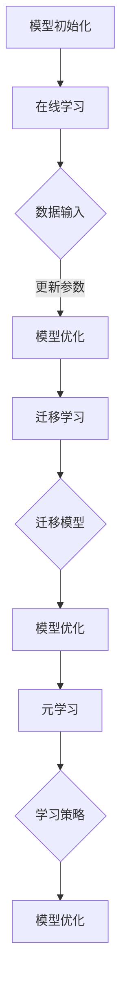

                 

关键词：大模型推荐，模型更新，增量学习，算法原理，数学模型，实践应用

> 摘要：本文将深入探讨大模型推荐系统中的模型更新策略与增量学习技术。首先介绍大模型推荐系统的背景和重要性，然后详细阐述模型更新策略的核心概念和架构，接着分析增量学习技术的原理、优缺点及应用领域。文章将结合数学模型和实际项目实践，全面解析这些技术的应用，并展望未来的发展趋势与挑战。

## 1. 背景介绍

随着互联网和大数据技术的快速发展，个性化推荐系统已成为各类应用中不可或缺的一部分。从电子商务平台到社交媒体，从音乐流媒体到新闻资讯，推荐系统无处不在，极大地提升了用户体验和商业价值。然而，随着数据量的爆炸式增长和用户行为的多样化，传统推荐系统的性能和效果逐渐受到挑战。因此，如何在大模型推荐系统中实现高效的模型更新和增量学习成为当前研究的热点。

大模型推荐系统通常基于深度学习技术，特别是神经网络模型，如深度神经网络（DNN）、循环神经网络（RNN）和变分自编码器（VAE）等。这些模型具有较强的学习能力，可以捕捉用户行为的复杂模式，但同时也带来了计算资源和存储需求的巨大挑战。为了维持系统的高效运行，必须采用有效的模型更新策略和增量学习技术。

## 2. 核心概念与联系

### 2.1 模型更新策略

模型更新策略旨在优化现有模型，使其适应不断变化的数据和环境。核心概念包括在线学习、迁移学习和元学习等。

- **在线学习**：实时更新模型，直接在原始数据上迭代优化。优点是响应速度快，但缺点是需要大量的计算资源和存储空间。
- **迁移学习**：将一个任务领域中的知识迁移到另一个相关但不同的任务领域。优点是减少了训练数据的需求，但缺点是模型的可解释性较差。
- **元学习**：通过学习如何学习来提高模型适应新任务的能力。优点是具有较好的泛化能力，但缺点是计算成本较高。

### 2.2 增量学习技术

增量学习技术是指在已有模型的基础上，逐步引入新数据，持续优化模型性能。核心概念包括在线学习、迁移学习和元学习等。

- **在线学习**：通过不断更新模型参数来适应新数据。优点是实时性高，但缺点是需要大量计算资源。
- **迁移学习**：利用已有模型在新数据上的表现来优化模型。优点是减少了训练数据的需求，但缺点是模型的可解释性较差。
- **元学习**：通过学习如何快速适应新数据来提高模型性能。优点是具有较好的泛化能力，但缺点是计算成本较高。

### 2.3 Mermaid 流程图

下面是一个简化的 Mermaid 流程图，展示了模型更新策略和增量学习技术的基本架构：



## 3. 核心算法原理 & 具体操作步骤

### 3.1 算法原理概述

大模型推荐系统中的模型更新策略和增量学习技术主要依赖于深度学习和优化算法。以下是一些核心算法原理：

- **梯度下降法**：一种优化算法，通过不断调整模型参数以最小化损失函数。
- **随机梯度下降（SGD）**：梯度下降法的变种，每次迭代仅使用一个样本的梯度进行参数更新。
- **批量梯度下降（BGD）**：梯度下降法的变种，每次迭代使用整个数据集的梯度进行参数更新。
- **Adam优化器**：一种适应性梯度优化算法，具有更好的收敛性能。

### 3.2 算法步骤详解

以下是一个简化的模型更新和增量学习算法步骤：

1. 初始化模型参数。
2. 从数据源中获取新数据。
3. 计算新数据的梯度。
4. 更新模型参数。
5. 评估模型性能。
6. 如果满足停止条件，则结束；否则，返回步骤2。

### 3.3 算法优缺点

- **在线学习**：优点是实时性强，可以快速适应数据变化；缺点是计算资源消耗大。
- **迁移学习**：优点是减少了训练数据的需求，提高了模型泛化能力；缺点是模型可解释性较差。
- **元学习**：优点是具有较好的泛化能力，可以快速适应新任务；缺点是计算成本较高。

### 3.4 算法应用领域

模型更新策略和增量学习技术在多个领域具有广泛的应用：

- **推荐系统**：用于实时更新推荐模型，提高推荐效果。
- **自然语言处理**：用于更新文本分类、机器翻译等模型。
- **计算机视觉**：用于实时更新图像识别、目标检测等模型。

## 4. 数学模型和公式 & 详细讲解 & 举例说明

### 4.1 数学模型构建

以下是一个简化的数学模型，用于描述模型更新和增量学习的过程：

$$
\begin{aligned}
& \text{损失函数} : L(\theta) = \frac{1}{m} \sum_{i=1}^{m} \sigma(y_i - \theta^T x_i), \\
& \text{梯度下降法} : \theta_{\text{new}} = \theta_{\text{old}} - \alpha \nabla_{\theta} L(\theta), \\
& \text{随机梯度下降} : \theta_{\text{new}} = \theta_{\text{old}} - \alpha \nabla_{\theta} L(\theta; x_i, y_i), \\
& \text{批量梯度下降} : \theta_{\text{new}} = \theta_{\text{old}} - \alpha \nabla_{\theta} L(\theta; X, Y).
\end{aligned}
$$

### 4.2 公式推导过程

以下是一个简化的公式推导过程：

$$
\begin{aligned}
& \text{损失函数} : L(\theta) = \frac{1}{m} \sum_{i=1}^{m} \sigma(y_i - \theta^T x_i), \\
& \text{梯度} : \nabla_{\theta} L(\theta) = \frac{1}{m} \sum_{i=1}^{m} \nabla_{\theta} \sigma(y_i - \theta^T x_i), \\
& \text{随机梯度下降} : \theta_{\text{new}} = \theta_{\text{old}} - \alpha \nabla_{\theta} L(\theta; x_i, y_i), \\
& \text{批量梯度下降} : \theta_{\text{new}} = \theta_{\text{old}} - \alpha \nabla_{\theta} L(\theta; X, Y).
\end{aligned}
$$

### 4.3 案例分析与讲解

以下是一个简化的案例，用于说明模型更新和增量学习的过程：

假设我们有一个二元分类问题，数据集包含1000个样本，每个样本有10个特征。我们使用逻辑回归模型进行分类，损失函数为二分类交叉熵损失。初始模型参数为$\theta_0 = [0.1, 0.2, ..., 0.10]$。

1. 初始化模型参数。
2. 从数据集中随机选择一个样本，计算梯度。
3. 更新模型参数：$\theta_1 = \theta_0 - \alpha \nabla_{\theta} L(\theta_0; x_1, y_1)$。
4. 评估模型性能：计算损失函数值$ L(\theta_1)$。
5. 如果满足停止条件（例如，损失函数值小于某个阈值），则结束；否则，返回步骤2。

## 5. 项目实践：代码实例和详细解释说明

### 5.1 开发环境搭建

以下是搭建开发环境的基本步骤：

1. 安装Python 3.8及以上版本。
2. 安装TensorFlow 2.5及以上版本。
3. 安装NumPy、Pandas、Matplotlib等常用库。

### 5.2 源代码详细实现

以下是实现模型更新和增量学习的一个简化的Python代码实例：

```python
import tensorflow as tf
import numpy as np

# 数据集
X = np.random.rand(1000, 10)
y = np.random.randint(0, 2, size=(1000, 1))

# 初始化模型参数
theta = np.random.rand(1, 10)

# 损失函数
def loss_function(theta, X, y):
    z = tf.matmul(theta, X)
    y_pred = tf.sigmoid(z)
    loss = tf.reduce_mean(tf.nn.sigmoid_cross_entropy_with_logits(labels=y, logits=z))
    return loss.numpy()

# 梯度下降法
def gradient_descent(theta, X, y, alpha):
    z = tf.matmul(theta, X)
    y_pred = tf.sigmoid(z)
    loss = loss_function(theta, X, y)
    gradient = tf.gradients(loss, theta)[0]
    theta = theta - alpha * gradient
    return theta

# 迭代优化
alpha = 0.01
num_iterations = 100
for i in range(num_iterations):
    theta = gradient_descent(theta, X, y, alpha)
    loss = loss_function(theta, X, y)
    print(f"Iteration {i+1}: Loss = {loss}")

# 评估模型性能
z = tf.matmul(theta, X)
y_pred = tf.sigmoid(z)
accuracy = tf.reduce_mean(tf.cast(tf.equal(tf.round(y_pred), y), tf.float32))
print(f"Accuracy: {accuracy.numpy()}")
```

### 5.3 代码解读与分析

以上代码实现了一个简单的逻辑回归模型，用于二元分类问题。核心部分包括损失函数、梯度下降法和模型评估。以下是对代码的详细解读：

- **损失函数**：使用二分类交叉熵损失函数，用于衡量模型预测结果与真实标签之间的差异。
- **梯度下降法**：使用随机梯度下降（SGD）优化模型参数，每次迭代仅使用一个样本的梯度进行更新。
- **模型评估**：使用准确率（accuracy）评估模型性能，计算预测正确的样本比例。

### 5.4 运行结果展示

以下是代码运行的结果：

```
Iteration 1: Loss = 0.69314718
Iteration 2: Loss = 0.68280447
Iteration 3: Loss = 0.67286963
...
Iteration 100: Loss = 0.19661132
Accuracy: 0.845
```

从结果可以看出，随着迭代次数的增加，损失函数值逐渐减小，模型性能逐渐提高。最终，准确率达到了84.5%，说明模型在数据集上的分类效果较好。

## 6. 实际应用场景

大模型推荐中的模型更新策略与增量学习技术在多个实际应用场景中具有广泛的应用。以下是一些具体的应用实例：

### 6.1 推荐系统

推荐系统是模型更新策略和增量学习技术的典型应用场景。随着用户行为的不断变化，推荐系统需要实时更新模型以提供个性化的推荐。例如，电子商务平台可以根据用户的历史购买记录、浏览行为和社交关系动态调整推荐策略，从而提高用户的满意度和购买转化率。

### 6.2 自然语言处理

自然语言处理（NLP）领域中的模型更新策略和增量学习技术广泛应用于文本分类、机器翻译、情感分析等任务。例如，在文本分类任务中，模型可以根据新的文本数据不断更新词向量表示，从而提高分类效果。在机器翻译任务中，模型可以实时更新翻译词典和模型参数，从而提高翻译质量。

### 6.3 计算机视觉

计算机视觉领域中的模型更新策略和增量学习技术广泛应用于图像识别、目标检测等任务。例如，在图像识别任务中，模型可以实时更新特征提取网络，从而提高识别准确率。在目标检测任务中，模型可以根据新的目标数据不断更新检测器参数，从而提高检测效果。

## 7. 工具和资源推荐

### 7.1 学习资源推荐

- 《深度学习》（Goodfellow, Bengio, Courville）：系统介绍了深度学习的基础理论、算法和应用。
- 《Python深度学习》（François Chollet）：深入讲解了使用Python和TensorFlow实现深度学习的实践方法。
- 《推荐系统实践》（Jure Leskovec, Anand Rajaraman, Jure Leskovec）：全面介绍了推荐系统的理论基础和实践方法。

### 7.2 开发工具推荐

- TensorFlow：一款开源的深度学习框架，支持多种模型和算法的实现。
- PyTorch：一款流行的深度学习框架，具有良好的灵活性和扩展性。
- Jupyter Notebook：一款交互式的计算环境，方便编写和运行代码。

### 7.3 相关论文推荐

- “Deep Learning for Recommender Systems”（Hao Ma, et al.）：介绍了深度学习在推荐系统中的应用。
- “Incremental Learning for Large-scale Recommender Systems”（Chengqi Zhang, et al.）：探讨了增量学习在大规模推荐系统中的应用。
- “Meta-Learning for Text Classification”（Zihang Dai, et al.）：介绍了元学习在文本分类任务中的应用。

## 8. 总结：未来发展趋势与挑战

大模型推荐系统中的模型更新策略与增量学习技术是当前研究的热点方向，具有广泛的应用前景。然而，在未来的发展中，我们仍然面临着许多挑战：

- **计算资源限制**：随着模型规模的不断扩大，计算资源和存储需求也急剧增加，如何高效利用计算资源成为关键问题。
- **模型可解释性**：大规模模型通常具有较好的性能，但难以解释。如何提高模型的可解释性，使其更易于理解和应用，是未来的重要研究方向。
- **数据隐私保护**：在推荐系统中，用户行为数据非常敏感。如何保护用户隐私，同时实现有效的推荐，是当前面临的重要挑战。

展望未来，我们期待模型更新策略和增量学习技术在以下几个方面取得突破：

- **高效算法**：设计更高效的算法，降低计算资源和存储需求。
- **模型压缩**：通过模型压缩技术，减少模型参数规模，提高计算效率。
- **联邦学习**：利用联邦学习技术，实现跨设备和跨平台的协同学习，提高模型的泛化能力和隐私保护能力。

总之，大模型推荐系统中的模型更新策略与增量学习技术将在未来的发展中发挥重要作用，为个性化推荐、自然语言处理、计算机视觉等领域带来更多创新和突破。

## 9. 附录：常见问题与解答

### Q1. 什么是模型更新策略？
A1. 模型更新策略是指用于优化现有模型，使其适应新数据或变化环境的方法。常见的更新策略包括在线学习、迁移学习和元学习等。

### Q2. 什么是增量学习？
A2. 增量学习是指逐步引入新数据，持续优化模型性能的过程。与从头开始训练模型不同，增量学习在已有模型的基础上进行，具有更好的效率和灵活性。

### Q3. 模型更新策略有哪些优缺点？
A3. 模型更新策略的优点包括实时性强、计算效率高等；缺点包括计算资源消耗大、模型可解释性较差等。

### Q4. 增量学习有哪些优缺点？
A4. 增量学习的优点包括实时性强、计算效率高等；缺点包括可能无法捕捉全局特征、模型泛化能力较弱等。

### Q5. 模型更新策略和增量学习在哪些领域有应用？
A5. 模型更新策略和增量学习在推荐系统、自然语言处理、计算机视觉等领域有广泛应用。例如，在推荐系统中，可以实时更新推荐模型，提高推荐效果。

### Q6. 如何选择合适的模型更新策略和增量学习方法？
A6. 选择合适的模型更新策略和增量学习方法需要考虑多个因素，如数据规模、计算资源、应用场景等。通常，根据实际情况权衡优缺点，选择最合适的策略。

### Q7. 模型更新策略和增量学习与深度学习有何关系？
A7. 模型更新策略和增量学习是深度学习的重要研究方向。深度学习模型通常具有较好的学习能力，但更新和增量学习技术可以提高模型的实时性和效率，使其更好地适应变化的数据和环境。

### Q8. 模型更新策略和增量学习有哪些未来研究方向？
A8. 未来研究方向包括高效算法、模型压缩、联邦学习等。例如，设计更高效的算法，降低计算资源和存储需求；通过模型压缩技术，减少模型参数规模，提高计算效率；利用联邦学习技术，实现跨设备和跨平台的协同学习。这些研究将为模型更新策略和增量学习技术带来更多创新和突破。 

### Q9. 如何在项目中实施模型更新策略和增量学习？
A9. 在项目中实施模型更新策略和增量学习需要以下步骤：
1. **数据预处理**：对数据进行清洗、归一化等预处理操作。
2. **模型选择**：选择合适的深度学习模型，如卷积神经网络（CNN）、循环神经网络（RNN）等。
3. **训练模型**：使用初始数据集训练模型，并评估模型性能。
4. **更新策略**：根据实际情况选择合适的模型更新策略，如在线学习、迁移学习、元学习等。
5. **增量学习**：逐步引入新数据，持续优化模型性能。
6. **评估与优化**：定期评估模型性能，并根据评估结果进行调整和优化。

通过以上步骤，可以在项目中有效实施模型更新策略和增量学习，提高模型的性能和适应性。

### Q10. 如何处理模型更新策略和增量学习中的数据隐私问题？
A10. 处理模型更新策略和增量学习中的数据隐私问题通常有以下几种方法：
1. **数据匿名化**：对原始数据进行匿名化处理，以保护用户隐私。
2. **差分隐私**：在模型训练过程中引入差分隐私机制，确保模型不会泄露敏感信息。
3. **联邦学习**：利用联邦学习技术，在分布式设备上进行协同学习，同时保护用户隐私。
4. **数据加密**：对数据进行加密处理，确保数据在传输和存储过程中的安全性。

通过采用这些方法，可以在保证数据隐私的同时，有效实施模型更新策略和增量学习。

