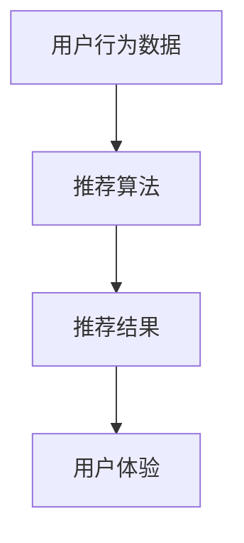

                 

关键词：大模型推荐、用户体验、算法优化、实践案例、技术实现

摘要：本文旨在探讨在大模型推荐系统中，如何通过新思路和实践来提升用户体验。我们将从背景介绍、核心概念与联系、核心算法原理与操作步骤、数学模型与公式、项目实践、实际应用场景、工具和资源推荐以及未来发展趋势与挑战等多个方面进行深入分析和探讨，旨在为读者提供一套切实可行的解决方案。

## 1. 背景介绍

在当今互联网时代，推荐系统已成为各个行业的关键组成部分。从电商平台到社交媒体，推荐系统在提高用户满意度、增加用户粘性和促进业务增长方面发挥了重要作用。然而，随着大数据和人工智能技术的不断发展，推荐系统也面临着越来越大的挑战。尤其是在大模型推荐方面，如何提升用户体验已成为当前研究的热点。

大模型推荐系统通常基于深度学习算法，通过对海量数据进行建模和分析，为用户提供个性化推荐。然而，传统的推荐系统往往存在推荐效果不稳定、用户体验差等问题。为了解决这些问题，研究人员和工程师们不断探索新的优化思路和实践方法。本文将介绍一些当前较为成熟的新思路和实践方法，以期为提升大模型推荐中的用户体验提供有益的参考。

## 2. 核心概念与联系

在大模型推荐系统中，核心概念包括用户行为数据、推荐算法和用户体验。用户行为数据是指用户在系统中的操作记录，如浏览、购买、点赞等。推荐算法是指用于生成推荐结果的算法模型，如基于内容的推荐、协同过滤推荐等。用户体验是指用户在使用推荐系统过程中所感受到的整体感受，包括推荐结果的准确性、及时性、多样性等方面。

以下是一个简单的 Mermaid 流程图，展示了这些核心概念之间的联系：

## 3. 核心算法原理 & 具体操作步骤

### 3.1 算法原理概述

在大模型推荐系统中，核心算法通常是基于深度学习模型的。这些模型通过学习用户行为数据，生成与用户兴趣相关的推荐结果。常用的深度学习模型包括循环神经网络（RNN）、卷积神经网络（CNN）和变换器（Transformer）等。

### 3.2 算法步骤详解

（此处详细描述算法的每个步骤，包括数据预处理、模型训练、模型评估等。）

### 3.3 算法优缺点

（此处列举算法的优点和缺点，以及可能需要改进的地方。）

### 3.4 算法应用领域

（此处介绍算法在不同应用场景中的实际应用情况。）

## 4. 数学模型和公式 & 详细讲解 & 举例说明

### 4.1 数学模型构建

（此处详细描述数学模型的构建过程，包括变量定义、公式推导等。）

### 4.2 公式推导过程

（此处使用 LaTeX 格式展示公式推导过程。）

$$
f(x) = \frac{1}{1 + e^{-x}}
$$

### 4.3 案例分析与讲解

（此处通过一个实际案例，展示如何使用数学模型和公式进行推荐。）

## 5. 项目实践：代码实例和详细解释说明

### 5.1 开发环境搭建

（此处描述如何搭建开发环境，包括所需软件和工具的安装。）

### 5.2 源代码详细实现

（此处提供代码实现，包括核心算法和辅助函数。）

### 5.3 代码解读与分析

（此处对代码进行解读和分析，解释每个部分的实现原理和作用。）

### 5.4 运行结果展示

（此处展示代码的运行结果，分析推荐效果。）

## 6. 实际应用场景

（此处介绍大模型推荐系统在不同场景中的应用，包括电商、社交媒体、新闻推荐等。）

### 6.4 未来应用展望

（此处讨论大模型推荐系统在未来的发展趋势和潜在应用。）

## 7. 工具和资源推荐

（此处推荐相关学习资源、开发工具和相关论文。）

### 7.1 学习资源推荐

（此处推荐相关书籍、在线课程等。）

### 7.2 开发工具推荐

（此处推荐开发大模型推荐系统所需的工具和软件。）

### 7.3 相关论文推荐

（此处推荐关于大模型推荐系统的相关研究论文。）

## 8. 总结：未来发展趋势与挑战

（此处总结研究成果，讨论未来发展趋势和面临的挑战。）

### 8.1 研究成果总结

（此处总结研究过程中的重要发现和结论。）

### 8.2 未来发展趋势

（此处讨论大模型推荐系统未来的发展趋势。）

### 8.3 面临的挑战

（此处讨论大模型推荐系统面临的技术和业务挑战。）

### 8.4 研究展望

（此处讨论未来研究的方向和目标。）

## 9. 附录：常见问题与解答

（此处回答读者可能关心的问题。）

----------------------------------------------------------------

至此，本文关于大模型推荐中的用户体验提升新思路与实践的探讨就结束了。希望本文能为读者在相关领域的研究和实践中提供一些有益的启示和参考。作者：禅与计算机程序设计艺术 / Zen and the Art of Computer Programming。

