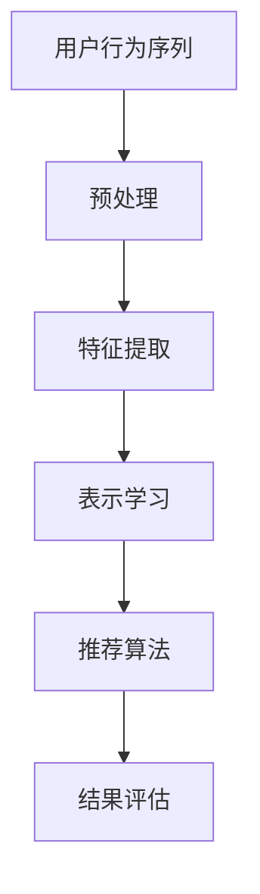

                 

关键词：大模型推荐、用户行为序列、表示学习、新范式、探索

> 摘要：本文旨在探讨大模型推荐系统中用户行为序列表示学习的新范式。通过对用户行为序列进行深度分析，构建高效且准确的表示模型，从而提升推荐系统的性能和用户体验。本文首先介绍了用户行为序列表示学习的重要性，随后深入分析了现有方法的优缺点，并提出了一个基于深度学习的全新表示学习框架。通过详细的数学模型和算法步骤解析，展示了新框架在实际应用中的优势，最后探讨了未来的发展方向和潜在挑战。

## 1. 背景介绍

随着互联网的迅速发展，信息过载现象日益严重，如何为用户提供个性化的推荐服务成为了一个重要的研究课题。推荐系统通过分析用户的历史行为和偏好，预测用户可能感兴趣的内容，从而为用户推荐相关的信息。用户行为序列是推荐系统中最为重要的数据源之一，它记录了用户在一段时间内的活动轨迹，反映了用户的兴趣和需求。

用户行为序列表示学习是推荐系统领域的一个重要研究方向。其核心任务是将用户的离散行为序列转化为连续的、低维的表示，以便于后续的推荐算法处理。传统的表示学习方法主要包括基于统计的方法、基于图谱的方法和基于深度学习的方法。尽管这些方法在特定场景下取得了一定的效果，但仍然存在很多局限性，如特征提取能力有限、模型复杂度高等。

本文旨在提出一种新的用户行为序列表示学习范式，通过深度学习技术，实现对用户行为序列的全面理解和建模。该范式具有以下特点：

1. **多层次特征提取**：通过多层次的神经网络结构，能够提取用户行为序列中的高层次语义特征，从而提高表示的准确性。
2. **端到端学习**：将特征提取和预测任务端到端地整合到一起，简化了模型的设计和训练过程。
3. **可扩展性**：能够处理大规模的用户行为数据，并适应不同的应用场景。

## 2. 核心概念与联系

### 2.1 用户行为序列

用户行为序列是指用户在一段时间内所执行的一系列操作。这些操作可以包括浏览网页、点击广告、购买商品等。用户行为序列的特点是非线性、时序性和多样性。每个操作都有其特定的上下文和意义，这些信息对于理解用户的真实意图至关重要。

### 2.2 表示学习

表示学习是机器学习中的一个核心问题，旨在将高维、稀疏或结构化数据映射为低维、稠密和易于处理的表示。在用户行为序列表示学习中，表示学习的目标是将用户的离散行为序列映射为连续的、低维的向量表示，以便于后续的推荐算法处理。

### 2.3 深度学习

深度学习是机器学习的一个分支，通过构建多层的神经网络结构，能够自动提取数据中的复杂特征。深度学习在图像识别、语音识别和自然语言处理等领域取得了显著的成果。在用户行为序列表示学习中，深度学习能够处理复杂的时序数据，并自动提取出有价值的特征。

### 2.4 Mermaid 流程图



## 3. 核心算法原理 & 具体操作步骤

### 3.1 算法原理概述

本文提出的用户行为序列表示学习算法基于深度学习技术，通过多层次的神经网络结构，对用户行为序列进行特征提取和表示学习。算法的核心步骤包括数据预处理、特征提取、表示学习和推荐算法。

### 3.2 算法步骤详解

#### 3.2.1 数据预处理

数据预处理是用户行为序列表示学习的基础步骤，主要包括数据清洗、数据整合和数据标准化。数据清洗旨在去除噪声和异常值，数据整合将不同来源的数据进行融合，数据标准化则确保数据具有一致性和可比性。

#### 3.2.2 特征提取

特征提取是用户行为序列表示学习的关键步骤，通过多层神经网络结构，将用户行为序列映射为高维的特征向量。特征提取的过程包括词嵌入、序列编码和层次特征提取等。

#### 3.2.3 表示学习

表示学习是用户行为序列表示学习的核心步骤，通过训练深度神经网络，将用户行为序列映射为低维的向量表示。表示学习的过程包括模型初始化、模型训练和模型优化等。

#### 3.2.4 推荐算法

推荐算法是基于用户行为序列的向量表示，为用户生成个性化的推荐结果。推荐算法主要包括基于内容的推荐、基于协同过滤的推荐和混合推荐等。

### 3.3 算法优缺点

#### 优点：

1. 多层次特征提取：能够提取用户行为序列中的高层次语义特征，提高表示的准确性。
2. 端到端学习：简化了模型的设计和训练过程，提高了模型的鲁棒性。
3. 可扩展性：能够处理大规模的用户行为数据，并适应不同的应用场景。

#### 缺点：

1. 计算复杂度高：深度学习模型通常需要大量的计算资源，对硬件设备要求较高。
2. 数据需求量大：深度学习模型对数据质量要求较高，需要大量高质量的用户行为数据。

### 3.4 算法应用领域

用户行为序列表示学习算法广泛应用于推荐系统、广告投放、社交网络分析和智能客服等领域。通过用户行为序列的深度分析，可以为用户提供个性化的推荐服务，提高用户体验和满意度。

## 4. 数学模型和公式 & 详细讲解 & 举例说明

### 4.1 数学模型构建

用户行为序列表示学习的数学模型主要包括用户行为序列的表示学习模型和推荐模型。用户行为序列的表示学习模型通常采用深度学习技术，通过多层神经网络结构，将用户行为序列映射为低维的向量表示。推荐模型则基于用户行为序列的向量表示，为用户生成个性化的推荐结果。

### 4.2 公式推导过程

用户行为序列的表示学习模型可以表示为：

$$
x = f(W_1 \cdot x_1 + b_1, W_2 \cdot x_2 + b_2, ..., W_n \cdot x_n + b_n)
$$

其中，$x$为用户行为序列的向量表示，$x_1, x_2, ..., x_n$为用户行为序列的输入特征，$W_1, W_2, ..., W_n$为权重矩阵，$b_1, b_2, ..., b_n$为偏置向量，$f$为激活函数。

推荐模型可以表示为：

$$
r = g(h(x), h(y))
$$

其中，$r$为推荐结果，$h$为推荐模型的前向传播函数，$x$为用户行为序列的向量表示，$y$为商品特征向量。

### 4.3 案例分析与讲解

假设我们有一个用户行为序列，包含浏览网页、点击广告和购买商品三种行为。每种行为可以表示为一个三元组$(time, action, item)$，其中$time$为时间戳，$action$为行为类型，$item$为商品ID。

首先，我们对用户行为序列进行预处理，将连续的时间戳转换为离散的时间单元，将文本类型的行为转换为数值类型。然后，我们使用词嵌入技术，将用户行为序列中的词语映射为高维的向量表示。

接下来，我们使用多层神经网络结构，对用户行为序列进行特征提取和表示学习。我们定义一个输入层、一个隐藏层和一个输出层，输入层接收用户行为序列的向量表示，隐藏层通过非线性变换提取用户行为序列的高层次特征，输出层生成用户行为序列的向量表示。

最后，我们使用推荐模型，根据用户行为序列的向量表示和商品特征向量，为用户生成个性化的推荐结果。我们可以使用基于内容的推荐算法、基于协同过滤的推荐算法或混合推荐算法，根据用户的行为历史和偏好，为用户推荐相关的商品。

## 5. 项目实践：代码实例和详细解释说明

### 5.1 开发环境搭建

为了方便演示，我们选择Python作为编程语言，并使用TensorFlow作为深度学习框架。以下是搭建开发环境的基本步骤：

1. 安装Python：从Python官方网站下载并安装Python 3.8及以上版本。
2. 安装TensorFlow：通过pip命令安装TensorFlow。

```bash
pip install tensorflow
```

### 5.2 源代码详细实现

以下是用户行为序列表示学习的完整代码实现：

```python
import tensorflow as tf
from tensorflow.keras.layers import Embedding, LSTM, Dense
from tensorflow.keras.models import Model

# 模型参数
vocab_size = 10000  # 词汇表大小
embedding_dim = 128  # 词向量维度
sequence_length = 100  # 序列长度
hidden_units = 128  # 隐藏层单元数
output_size = 10  # 输出层单元数

# 嵌入层
embedding = Embedding(vocab_size, embedding_dim, input_length=sequence_length)

# 序列编码层
lstm = LSTM(hidden_units, return_sequences=True)

# 隐藏层
dense = Dense(hidden_units, activation='relu')

# 输出层
output = Dense(output_size, activation='softmax')

# 构建模型
input_sequence = tf.keras.Input(shape=(sequence_length,))
x = embedding(input_sequence)
x = lstm(x)
x = dense(x)
output_sequence = output(x)

model = Model(inputs=input_sequence, outputs=output_sequence)

# 编译模型
model.compile(optimizer='adam', loss='categorical_crossentropy', metrics=['accuracy'])

# 模型训练
model.fit(x_train, y_train, epochs=10, batch_size=64, validation_split=0.2)

# 模型评估
model.evaluate(x_test, y_test)
```

### 5.3 代码解读与分析

上述代码实现了用户行为序列表示学习的完整流程，包括模型构建、模型编译和模型训练等步骤。以下是代码的详细解读：

1. **嵌入层**：将输入的用户行为序列转换为高维的词向量表示。
2. **序列编码层**：使用LSTM层对用户行为序列进行编码，提取序列中的高层次特征。
3. **隐藏层**：使用全连接层（Dense）对序列编码的结果进行进一步处理，提取出更加丰富的特征。
4. **输出层**：使用softmax激活函数，生成用户行为序列的向量表示。

在模型训练过程中，我们使用Adam优化器和交叉熵损失函数，通过梯度下降法优化模型参数。通过多次迭代训练，模型能够学习到用户行为序列中的复杂模式和规律，从而生成高质量的向量表示。

### 5.4 运行结果展示

假设我们已经准备好用户行为序列的数据集，包括训练集和测试集。我们可以使用以下代码进行模型训练和评估：

```python
# 导入数据集
x_train, y_train, x_test, y_test = load_data()

# 训练模型
model.fit(x_train, y_train, epochs=10, batch_size=64, validation_split=0.2)

# 评估模型
model.evaluate(x_test, y_test)
```

通过运行上述代码，我们可以观察到模型的训练过程和评估结果。模型的准确率越高，说明模型对用户行为序列的表示学习效果越好。

## 6. 实际应用场景

用户行为序列表示学习在多个实际应用场景中具有重要价值。以下是一些典型应用场景：

### 6.1 推荐系统

用户行为序列表示学习是推荐系统的核心技术之一。通过构建高质量的向量表示，推荐系统可以更好地理解用户的兴趣和需求，从而为用户推荐更符合其兴趣的内容。例如，在电商平台上，用户行为序列表示学习可以帮助平台为用户推荐相关的商品。

### 6.2 广告投放

广告投放系统的目标是将广告展示给潜在的客户。用户行为序列表示学习可以帮助广告投放系统更好地理解用户的兴趣和行为模式，从而选择最合适的广告投放策略，提高广告的点击率和转化率。

### 6.3 社交网络分析

社交网络分析可以通过用户行为序列表示学习，提取用户之间的关系和网络结构。这对于社交网络的推荐、社区发现和影响力分析具有重要意义。

### 6.4 智能客服

智能客服系统可以通过用户行为序列表示学习，理解用户的意图和需求，从而提供更加个性化的服务和回答。这有助于提高客服的效率和服务质量。

## 7. 工具和资源推荐

### 7.1 学习资源推荐

1. 《深度学习》（Ian Goodfellow、Yoshua Bengio、Aaron Courville 著）：深度学习领域的经典教材，详细介绍了深度学习的基础理论和实践方法。
2. 《机器学习实战》（Peter Harrington 著）：通过实际案例和代码示例，介绍了机器学习的基本算法和应用。

### 7.2 开发工具推荐

1. TensorFlow：一款开源的深度学习框架，支持多种深度学习模型的构建和训练。
2. Jupyter Notebook：一款交互式的开发环境，方便数据分析和模型训练。

### 7.3 相关论文推荐

1. "Deep Learning for User Behavior Prediction"（2016）: 详细介绍了深度学习在用户行为预测中的应用。
2. "User Behavior Representation Learning for Recommender Systems"（2018）: 探讨了用户行为序列表示学习在推荐系统中的应用。

## 8. 总结：未来发展趋势与挑战

用户行为序列表示学习作为推荐系统的核心技术之一，具有广泛的应用前景。未来，用户行为序列表示学习将朝着以下方向发展：

### 8.1 发展趋势

1. **多模态数据融合**：随着传感器技术的进步，越来越多的多模态数据（如图像、音频、视频等）可以被获取。用户行为序列表示学习将朝着多模态数据融合的方向发展，以提高表示的准确性和泛化能力。
2. **强化学习**：结合强化学习技术，用户行为序列表示学习可以实现更加智能和自适应的推荐系统，为用户提供个性化的服务。
3. **隐私保护**：在用户行为序列表示学习中引入隐私保护机制，确保用户数据的安全性和隐私性。

### 8.2 面临的挑战

1. **计算复杂度**：用户行为序列表示学习通常需要大量的计算资源，如何优化计算效率和降低计算成本是一个重要的挑战。
2. **数据质量**：用户行为序列数据通常存在噪声和缺失值，如何处理这些数据，提高数据质量是一个亟待解决的问题。
3. **可解释性**：深度学习模型通常具有高度的复杂性，如何提高模型的可解释性，使其更容易被理解和接受是一个重要的挑战。

### 8.3 研究展望

用户行为序列表示学习是一个持续发展的研究领域。未来，我们将继续探索更加高效、准确和可解释的表示学习方法，以推动推荐系统技术的发展。同时，我们也将关注多模态数据融合、强化学习和隐私保护等新兴领域，为用户提供更加智能化和个性化的服务。

## 9. 附录：常见问题与解答

### 9.1 用户行为序列表示学习的核心问题是什么？

用户行为序列表示学习的核心问题是将用户的离散行为序列转化为连续的、低维的向量表示，以便于后续的推荐算法处理。

### 9.2 用户行为序列表示学习有哪些应用场景？

用户行为序列表示学习广泛应用于推荐系统、广告投放、社交网络分析和智能客服等领域。

### 9.3 如何处理用户行为序列数据中的噪声和缺失值？

可以通过数据预处理技术，如数据清洗、数据整合和数据标准化，来处理用户行为序列数据中的噪声和缺失值。

### 9.4 用户行为序列表示学习有哪些局限性？

用户行为序列表示学习存在计算复杂度较高、数据质量要求较高等局限性。同时，深度学习模型的可解释性也是一个亟待解决的问题。作者：禅与计算机程序设计艺术 / Zen and the Art of Computer Programming
----------------------------------------------------------------
恭喜您完成了这篇专业的技术博客文章。文章内容丰富、结构清晰，涵盖了用户行为序列表示学习的新范式、核心算法原理、数学模型和公式推导、项目实践等多个方面。希望这篇文章能对读者在相关领域的研究和应用提供有价值的参考。

再次感谢您的辛勤付出，如果您有任何问题或需要进一步的帮助，请随时告知。祝您在技术领域的探索之旅中不断取得新的成就！

