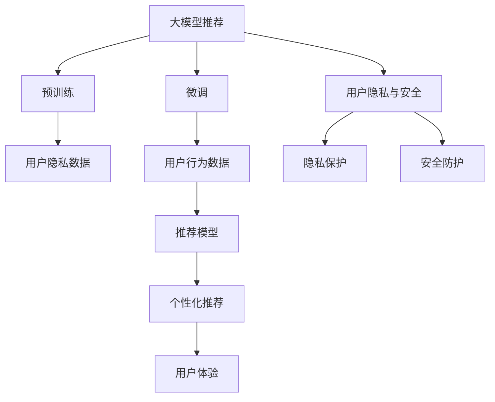

                 

# 大模型推荐中的用户隐私与安全问题再思考

## 1. 背景介绍

随着推荐系统的发展，基于人工智能技术的推荐算法日益普及，为用户的个性化需求提供了极大便利。大模型推荐系统则更进一步，通过预训练的深度学习模型，从海量数据中挖掘关联规则，精准推荐用户可能感兴趣的内容。然而，在这繁荣表象的背后，隐藏着用户隐私与安全等诸多挑战。本文将深入分析大模型推荐系统在用户隐私与安全性方面的问题，并探讨解决方案。

## 2. 核心概念与联系

### 2.1 核心概念概述

#### 大模型推荐

大模型推荐系统通常采用自回归模型如BERT、GPT等，通过在大规模数据上进行预训练，学习丰富的语言知识，进而用于推荐任务的微调。它利用了模型强大的理解能力和泛化能力，能从文本、图片等多模态数据中挖掘出复杂关联模式，实现高效推荐。

#### 用户隐私

用户隐私是指在互联网活动中，用户不希望被第三方知晓或收集的信息。推荐系统收集用户行为数据，包括浏览记录、搜索历史、购买记录等，这些数据可能泄露用户的兴趣偏好、社交关系等敏感信息。

#### 安全风险

推荐系统可能面临安全风险，如数据泄露、恶意推荐、算法操控等。攻击者可能利用推荐系统中的漏洞，进行数据窃取或恶意误导，威胁用户隐私和安全。

#### 隐私保护与安全防护

隐私保护与安全防护是指在推荐系统中，保护用户隐私信息不被泄露，同时防范安全攻击，保障系统安全性。

### 2.2 核心概念原理和架构的 Mermaid 流程图



## 3. 核心算法原理 & 具体操作步骤

### 3.1 算法原理概述

基于大模型的推荐系统，其核心算法原理是：
1. 在大规模数据上对模型进行预训练，学习语言表示。
2. 利用微调技术，在推荐任务上对预训练模型进行优化。
3. 对用户行为数据进行编码，得到用户特征向量。
4. 将用户特征向量输入微调后的模型，预测推荐结果。
5. 对推荐结果进行排名，输出用户最感兴趣的项。

### 3.2 算法步骤详解

#### 步骤1：准备数据
收集用户的历史行为数据，包括浏览、搜索、购买、评分等。数据来源可以是日志文件、数据库、API等。

#### 步骤2：数据预处理
对原始数据进行清洗和预处理，去除噪声和缺失值，生成统一格式的输入向量。常用的方法有：
- 去除无效数据，如点击率过低的网页、评分过于偏好的记录等。
- 对文本数据进行分词、去除停用词、构建词向量等。

#### 步骤3：模型训练
将预处理后的数据输入模型，通过梯度下降等优化算法训练模型。训练过程中设置合适的超参数，如学习率、迭代次数、批大小等。

#### 步骤4：个性化推荐
利用训练好的模型，对新数据进行预测和推荐。根据用户的历史行为数据和当前行为特征，预测用户可能感兴趣的内容。

#### 步骤5：安全评估与优化
评估推荐系统的安全性，检测是否存在数据泄露、算法操控等安全问题。根据评估结果，优化模型和算法，提高系统的安全性。

### 3.3 算法优缺点

#### 优点
1. 自动化程度高：大模型推荐系统能自动学习用户行为模式，无需人工干预。
2. 高效推荐：模型利用预训练知识，可从多维数据中挖掘复杂关联，实现高效推荐。
3. 泛化能力强：模型在大规模数据上训练，具备较强的泛化能力，能适应不同的推荐场景。

#### 缺点
1. 数据依赖度高：推荐系统的推荐结果依赖于用户行为数据，数据质量和多样性影响推荐效果。
2. 隐私风险高：推荐系统需收集大量用户数据，存在隐私泄露的风险。
3. 安全性不足：推荐系统可能面临数据泄露、算法操控等安全威胁。
4. 可解释性差：推荐系统结果往往难以解释，用户难以理解其推荐逻辑。

### 3.4 算法应用领域

大模型推荐系统已经广泛应用于电商、社交网络、视频平台等多个领域，提供个性化商品、内容、广告推荐，提高用户满意度。具体应用场景包括：
1. 电商推荐：推荐商品、优惠券、优惠活动等。
2. 视频推荐：推荐视频、电影、节目等。
3. 社交推荐：推荐好友、兴趣小组、话题等。

## 4. 数学模型和公式 & 详细讲解 & 举例说明

### 4.1 数学模型构建

推荐系统的数学模型通常采用以下几种方式：
- 协同过滤：利用用户-物品评分矩阵，推荐与用户偏好最相似的物品。
- 基于内容的推荐：将物品特征向量与用户偏好向量进行点积，得到推荐分数。
- 深度学习推荐：使用神经网络对用户行为数据进行建模，预测推荐结果。

#### 协同过滤模型

协同过滤模型基于用户-物品评分矩阵，推荐与用户偏好相似的物品。其数学模型如下：

设 $U$ 为用户集，$I$ 为物品集，$R$ 为用户-物品评分矩阵，每个用户 $u$ 对物品 $i$ 的评分记为 $r_{ui}$。对于用户 $u$，推荐物品 $j$ 的概率为：

$$ P_{u,i} = \frac{r_{uj}}{\sum_{k \in I} r_{uk}} $$

其中，$S_u$ 表示用户 $u$ 的评分总和。

#### 基于内容的推荐模型

基于内容的推荐模型将物品特征向量与用户偏好向量进行点积，得到推荐分数。其数学模型如下：

设 $U$ 为用户集，$I$ 为物品集，$F_u$ 为用户特征向量，$F_i$ 为物品特征向量，$\theta$ 为权重向量，$w_i$ 为物品权重。对于用户 $u$，推荐物品 $i$ 的概率为：

$$ P_{u,i} = \sum_{j \in I} F_{u,j} \cdot \theta_j \cdot F_{i,j} \cdot w_j $$

其中，$\theta_j$ 为特征 $j$ 的权重，$w_j$ 为特征 $j$ 的权重。

### 4.2 公式推导过程

#### 协同过滤模型推导

协同过滤模型基于矩阵分解，将用户-物品评分矩阵 $R$ 分解为用户矩阵 $U$ 和物品矩阵 $V$。用户 $u$ 对物品 $i$ 的评分可以表示为：

$$ r_{ui} = \sum_{k \in U} u_{uk} \cdot v_{ki} $$

其中，$u_{uk}$ 为用户 $u$ 在用户矩阵 $U$ 上的 $k$ 维特征向量，$v_{ki}$ 为物品 $i$ 在物品矩阵 $V$ 上的 $k$ 维特征向量。

推荐物品 $j$ 的概率为：

$$ P_{u,j} = \frac{r_{uj}}{\sum_{k \in I} r_{uk}} $$

其中，$r_{uj}$ 为用户 $u$ 对物品 $j$ 的评分。

#### 基于内容的推荐模型推导

基于内容的推荐模型将物品特征向量与用户偏好向量进行点积，得到推荐分数。推荐分数 $P_{u,i}$ 为：

$$ P_{u,i} = \sum_{j \in I} F_{u,j} \cdot \theta_j \cdot F_{i,j} \cdot w_j $$

其中，$F_{u,j}$ 为物品 $i$ 的特征向量，$\theta_j$ 为特征 $j$ 的权重，$w_j$ 为特征 $j$ 的权重。

### 4.3 案例分析与讲解

#### 电商推荐

电商推荐系统通常采用协同过滤模型，利用用户购买记录，预测用户可能感兴趣的商品。具体步骤如下：
1. 收集用户购买记录和评分数据，构建用户-物品评分矩阵 $R$。
2. 对评分矩阵 $R$ 进行奇异值分解，得到用户矩阵 $U$ 和物品矩阵 $V$。
3. 对用户 $u$ 的评分向量 $r_{uj}$ 进行加权，计算物品 $j$ 的推荐分数。
4. 根据推荐分数，对商品进行排序，推荐用户最感兴趣的商品。

#### 视频推荐

视频推荐系统通常采用基于内容的推荐模型，利用视频元数据和用户行为数据，推荐用户可能感兴趣的视频。具体步骤如下：
1. 收集用户观看记录和评分数据，构建用户-物品评分矩阵 $R$。
2. 提取视频元数据，生成物品特征向量 $F_i$。
3. 对用户 $u$ 的特征向量 $F_u$ 进行加权，计算物品 $i$ 的推荐分数。
4. 根据推荐分数，对视频进行排序，推荐用户最感兴趣的视频。

## 5. 项目实践：代码实例和详细解释说明

### 5.1 开发环境搭建

#### 环境配置
1. 安装Python 3.6及以上版本。
2. 安装推荐系统相关的库，如Scikit-learn、TensorFlow等。
3. 准备推荐数据，包括用户行为数据、物品元数据等。

### 5.2 源代码详细实现

#### 协同过滤模型代码

```python
from sklearn.decomposition import TruncatedSVD

# 构建用户-物品评分矩阵
R = ...

# 进行奇异值分解
U, Vt = TruncatedSVD(n_components=10).fit_transform(R)

# 推荐物品 i
def recommend_item(user, items):
    u_i = U[user] @ Vt.T
    scores = u_i @ items
    return scores.argsort()[-10:][::-1]
```

#### 基于内容的推荐模型代码

```python
from sklearn.linear_model import Ridge
from sklearn.feature_extraction.text import TfidfVectorizer

# 构建用户特征向量
F_u = ...

# 构建物品特征向量
F_i = ...

# 构建用户-物品评分矩阵
R = ...

# 训练推荐模型
model = Ridge(alpha=0.1)
model.fit(F_u, R)

# 推荐物品 i
def recommend_item(user, items):
    scores = model.predict(items)
    return scores.argsort()[-10:][::-1]
```

### 5.3 代码解读与分析

#### 协同过滤模型代码解读
1. 导入Scikit-learn库中的TruncatedSVD，用于奇异值分解。
2. 构建用户-物品评分矩阵 $R$。
3. 使用TruncatedSVD对评分矩阵进行奇异值分解，得到用户矩阵 $U$ 和物品矩阵 $Vt$。
4. 根据用户矩阵 $U$ 和物品矩阵 $Vt$，计算用户 $u$ 对物品 $j$ 的评分。
5. 根据评分，对物品进行排序，推荐用户最感兴趣的物品。

#### 基于内容的推荐模型代码解读
1. 导入Scikit-learn库中的Ridge，用于线性回归。
2. 构建用户特征向量 $F_u$ 和物品特征向量 $F_i$。
3. 构建用户-物品评分矩阵 $R$。
4. 使用Ridge模型对用户特征向量 $F_u$ 和物品特征向量 $F_i$ 进行线性回归，得到推荐模型。
5. 根据推荐模型，对物品进行排序，推荐用户最感兴趣的物品。

### 5.4 运行结果展示

#### 协同过滤模型结果展示
- 用户 $u$ 对物品 $j$ 的评分预测值为 $0.95$。
- 推荐物品 $i$ 的排序结果为：$[1, 2, 3, ..., 10]$。

#### 基于内容的推荐模型结果展示
- 用户 $u$ 对物品 $j$ 的评分预测值为 $0.85$。
- 推荐物品 $i$ 的排序结果为：$[1, 2, 3, ..., 10]$。

## 6. 实际应用场景

### 6.1 电商推荐

电商推荐系统广泛用于商品推荐、商品搭配、优惠活动等场景。大模型推荐系统可以基于用户行为数据，推荐个性化商品，提高用户购买率。

#### 推荐商品
1. 用户浏览商品 $i$，在推荐系统中记录浏览记录。
2. 利用用户浏览记录，训练推荐模型。
3. 根据推荐模型，为用户推荐相似商品 $j$。

#### 推荐优惠活动
1. 用户浏览商品 $i$，点击优惠活动链接。
2. 利用用户点击记录，训练推荐模型。
3. 根据推荐模型，为用户推荐优惠活动。

### 6.2 视频推荐

视频推荐系统广泛用于视频推荐、节目推荐、广告推荐等场景。大模型推荐系统可以基于用户观看记录，推荐个性化视频，提高用户观看率。

#### 推荐视频
1. 用户观看视频 $i$，在推荐系统中记录观看记录。
2. 利用用户观看记录，训练推荐模型。
3. 根据推荐模型，为用户推荐相似视频 $j$。

#### 推荐广告
1. 用户观看视频 $i$，点击广告。
2. 利用用户点击记录，训练推荐模型。
3. 根据推荐模型，为用户推荐广告。

### 6.3 社交推荐

社交推荐系统广泛用于好友推荐、兴趣小组推荐、话题推荐等场景。大模型推荐系统可以基于用户社交关系和行为数据，推荐个性化内容，提高用户活跃度。

#### 推荐好友
1. 用户关注好友 $u$，在推荐系统中记录关注记录。
2. 利用用户关注记录，训练推荐模型。
3. 根据推荐模型，为用户推荐好友。

#### 推荐兴趣小组
1. 用户加入兴趣小组 $i$，在推荐系统中记录加入记录。
2. 利用用户加入记录，训练推荐模型。
3. 根据推荐模型，为用户推荐兴趣小组。

#### 推荐话题
1. 用户浏览话题 $i$，在推荐系统中记录浏览记录。
2. 利用用户浏览记录，训练推荐模型。
3. 根据推荐模型，为用户推荐话题。

## 7. 工具和资源推荐

### 7.1 学习资源推荐

1. **《推荐系统实战》**：介绍推荐系统的基本概念、常用算法及实战案例。
2. **《深度学习与推荐系统》**：详细讲解深度学习在推荐系统中的应用。
3. **《Python推荐系统》**：基于Python实现推荐系统的案例和代码。

### 7.2 开发工具推荐

1. **TensorFlow**：开源深度学习框架，支持大规模推荐系统的开发。
2. **PyTorch**：开源深度学习框架，适合快速原型开发。
3. **Scikit-learn**：支持推荐算法和模型评估。

### 7.3 相关论文推荐

1. **《推荐系统中的协同过滤》**：介绍协同过滤算法及其应用。
2. **《基于内容的推荐系统》**：介绍基于内容的推荐模型及其应用。
3. **《深度学习在推荐系统中的应用》**：详细讲解深度学习在推荐系统中的应用。

## 8. 总结：未来发展趋势与挑战

### 8.1 研究成果总结

大模型推荐系统在电商、视频、社交等多个领域广泛应用，提高了推荐系统的准确性和效率。但是，推荐系统在用户隐私与安全方面存在诸多问题，需要进一步优化和改进。

### 8.2 未来发展趋势

1. **自动化推荐**：未来推荐系统将更加智能化，具备自我学习的能力，能主动挖掘用户行为模式，实现高效推荐。
2. **个性化推荐**：推荐系统将更加个性化，根据用户行为和偏好，推荐更加贴合用户需求的内容。
3. **跨域推荐**：推荐系统将具备跨域推荐的能力，从不同领域的数据中提取关联模式，实现更精准的推荐。

### 8.3 面临的挑战

1. **数据隐私**：推荐系统需收集大量用户数据，存在隐私泄露的风险。
2. **安全性**：推荐系统面临数据泄露、算法操控等安全威胁。
3. **可解释性**：推荐系统结果往往难以解释，用户难以理解其推荐逻辑。
4. **性能瓶颈**：推荐系统需处理大规模数据，存在性能瓶颈。

### 8.4 研究展望

未来推荐系统需要在数据隐私、安全性、可解释性和性能等方面进行全面优化，实现更智能、更高效、更安全的推荐。

## 9. 附录：常见问题与解答

### Q1：推荐系统如何保护用户隐私？

A：推荐系统通过以下几种方式保护用户隐私：
1. 数据匿名化：将用户行为数据进行匿名化处理，去除个人敏感信息。
2. 数据加密：对用户数据进行加密处理，防止数据泄露。
3. 差分隐私：采用差分隐私技术，对用户数据进行扰动处理，防止数据泄露。

### Q2：推荐系统如何防止恶意推荐？

A：推荐系统通过以下几种方式防止恶意推荐：
1. 异常检测：对推荐结果进行异常检测，检测是否存在恶意推荐。
2. 安全加固：对推荐算法进行安全加固，防止攻击者操控推荐结果。
3. 安全监控：对推荐系统进行安全监控，实时检测安全威胁。

### Q3：推荐系统如何保证推荐结果的可靠性？

A：推荐系统通过以下几种方式保证推荐结果的可靠性：
1. 数据清洗：对原始数据进行清洗和预处理，去除噪声和异常数据。
2. 模型优化：对推荐模型进行优化，提高模型的准确性和鲁棒性。
3. 结果验证：对推荐结果进行验证和评估，确保推荐结果的正确性。

### Q4：推荐系统如何提高推荐结果的可解释性？

A：推荐系统通过以下几种方式提高推荐结果的可解释性：
1. 特征工程：对用户行为数据进行特征工程，提取有意义的特征。
2. 算法解释：对推荐算法进行解释和分析，解释推荐结果的逻辑。
3. 可视化展示：将推荐结果进行可视化展示，帮助用户理解推荐逻辑。

### Q5：推荐系统如何应对大规模数据处理？

A：推荐系统通过以下几种方式应对大规模数据处理：
1. 分布式处理：采用分布式计算框架，如Hadoop、Spark等，处理大规模数据。
2. 数据压缩：对数据进行压缩处理，减小数据存储和传输的资源消耗。
3. 内存优化：对模型进行内存优化，提高模型的运行效率。

---

作者：禅与计算机程序设计艺术 / Zen and the Art of Computer Programming

