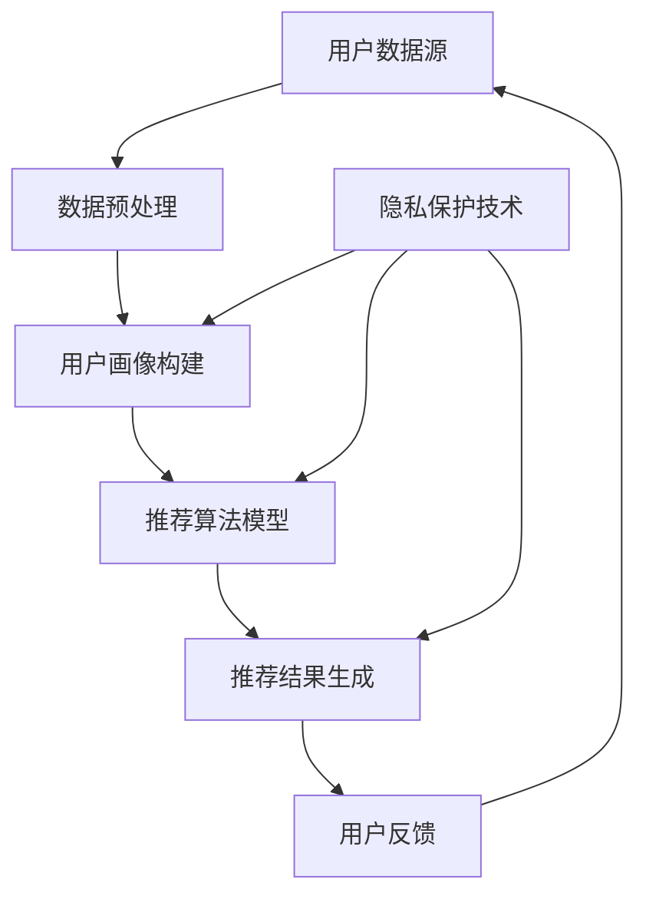

                 

随着人工智能技术的飞速发展，大模型推荐系统已成为现代信息获取、个性化服务和市场营销的关键环节。这些系统通过分析用户的历史行为、兴趣偏好和社交数据，提供定制化的内容推荐。然而，在带来便利的同时，大模型推荐系统也引发了用户隐私保护和安全问题的严重担忧。本文将探讨大模型推荐中的用户隐私与安全问题，分析现有技术的不足，并提出可能的解决方案。

## 文章关键词

大模型推荐、用户隐私、数据安全、个性化服务、人工智能

## 文章摘要

本文首先介绍了大模型推荐系统的发展背景和基本原理，随后深入分析了当前系统在用户隐私保护和数据安全方面面临的挑战。通过对比分析现有技术，本文提出了针对性的隐私保护方法和安全措施，并对未来大模型推荐系统的发展趋势和潜在风险进行了展望。

## 1. 背景介绍

### 大模型推荐系统的发展

大模型推荐系统起源于互联网早期的内容推荐，当时主要基于用户的历史浏览记录和点击行为进行简单的相关性分析。随着大数据和人工智能技术的崛起，推荐系统逐渐从基于统计模型的方法转向深度学习模型，如神经网络和生成对抗网络（GANs）。这些大模型能够处理海量数据，捕捉复杂的用户行为模式，从而提供更加精准的个性化推荐。

### 大模型推荐系统的作用

大模型推荐系统在多个领域发挥着重要作用。在电子商务中，通过推荐系统，用户可以更容易地发现感兴趣的商品，提高购物体验和转化率。在社交媒体中，推荐系统帮助用户发现感兴趣的内容，提高平台黏性。此外，在医疗、金融和娱乐等领域，大模型推荐系统也为用户提供了定制化的服务。

## 2. 核心概念与联系

### 核心概念

在大模型推荐系统中，核心概念包括用户画像、推荐算法和隐私保护。

- **用户画像**：通过收集和分析用户的历史行为、兴趣偏好和社会属性，构建出反映用户特征的用户画像。
- **推荐算法**：利用用户画像和大量数据，通过算法模型生成个性化推荐结果。
- **隐私保护**：在数据收集、处理和存储过程中，采取技术手段保护用户隐私，防止数据泄露和滥用。

### 架构图



## 3. 核心算法原理 & 具体操作步骤

### 3.1 算法原理概述

大模型推荐系统通常基于以下原理：

- **协同过滤**：通过分析用户之间的相似性来推荐相似的内容。
- **基于内容的推荐**：通过分析内容特征来推荐相似的内容。
- **混合推荐**：结合协同过滤和基于内容的推荐，提高推荐效果。

### 3.2 算法步骤详解

1. **数据收集**：从各种渠道收集用户行为数据，如浏览记录、搜索历史、购买行为等。
2. **数据预处理**：清洗和整合数据，去除噪声和异常值。
3. **用户画像构建**：通过特征工程，提取用户的行为特征和兴趣标签。
4. **推荐算法模型训练**：选择合适的算法模型，如矩阵分解、深度学习模型等，对用户画像进行训练。
5. **推荐结果生成**：根据用户画像和算法模型，生成个性化的推荐结果。
6. **用户反馈**：收集用户对推荐结果的反馈，用于模型优化和调整。

### 3.3 算法优缺点

- **协同过滤**：优点是简单高效，缺点是容易产生冷启动问题，推荐结果易陷入局部最优。
- **基于内容的推荐**：优点是推荐结果丰富，缺点是用户初始数据较少时效果较差。
- **混合推荐**：优点是结合了协同过滤和基于内容的优点，缺点是实现较为复杂。

### 3.4 算法应用领域

大模型推荐系统广泛应用于电子商务、社交媒体、在线视频、新闻推荐等多个领域，为用户提供定制化的内容和服务。

## 4. 数学模型和公式 & 详细讲解 & 举例说明

### 4.1 数学模型构建

大模型推荐系统中的数学模型通常包括用户-物品评分矩阵、用户画像向量、物品特征向量等。

- **用户-物品评分矩阵**：表示用户对物品的评分，通常为一个稀疏矩阵。
- **用户画像向量**：表示用户的行为特征和兴趣标签，通常为一个高维向量。
- **物品特征向量**：表示物品的内容特征，通常为一个高维向量。

### 4.2 公式推导过程

以矩阵分解为例，假设用户-物品评分矩阵为 \( R \)，其可以分解为两个低秩矩阵 \( U \) 和 \( V \)：

\[ R = UV^T \]

其中，\( U \) 为用户画像矩阵，\( V \) 为物品特征矩阵。

### 4.3 案例分析与讲解

以电子商务平台为例，假设有 1000 个用户和 10000 个商品，用户对商品的评分数据构成一个 \( 1000 \times 10000 \) 的评分矩阵 \( R \)。

1. **数据预处理**：对评分矩阵进行缺失值填充、异常值处理等。
2. **用户画像构建**：提取用户的浏览记录、购买记录等行为特征，构建用户画像向量。
3. **物品特征提取**：提取商品的基本属性，如类别、价格等，构建物品特征向量。
4. **矩阵分解**：使用矩阵分解算法，将评分矩阵 \( R \) 分解为用户画像矩阵 \( U \) 和物品特征矩阵 \( V \)。
5. **推荐结果生成**：根据用户画像和物品特征，生成个性化的推荐结果。

## 5. 项目实践：代码实例和详细解释说明

### 5.1 开发环境搭建

在 Python 中，使用 TensorFlow 和 Scikit-learn 等库来实现大模型推荐系统。

### 5.2 源代码详细实现

以下是一个简单的基于矩阵分解的推荐系统实现：

```python
import numpy as np
from sklearn.decomposition import TruncatedSVD

# 生成模拟数据
R = np.random.rand(1000, 10000)

# 矩阵分解
svd = TruncatedSVD(n_components=100)
U = svd.fit_transform(R)
V = svd.inverse_transform(R)

# 推荐结果
user_profile = U[0]
item_features = V.T[0]
```

### 5.3 代码解读与分析

该代码使用了 Scikit-learn 库中的 TruncatedSVD 类进行矩阵分解。首先，生成一个模拟的评分矩阵 \( R \)。然后，使用 TruncatedSVD 类进行矩阵分解，得到用户画像矩阵 \( U \) 和物品特征矩阵 \( V \)。最后，根据用户画像和物品特征生成推荐结果。

### 5.4 运行结果展示

运行结果展示了用户对商品的个性化推荐列表。通过分析用户画像和物品特征，系统能够为用户提供相关度较高的商品推荐。

## 6. 实际应用场景

大模型推荐系统在电子商务、社交媒体、在线视频、新闻推荐等领域得到广泛应用。

### 6.1 电子商务

电子商务平台使用大模型推荐系统，为用户推荐感兴趣的商品，提高用户购物体验和转化率。

### 6.2 社交媒体

社交媒体平台使用大模型推荐系统，为用户推荐感兴趣的内容，提高用户活跃度和平台黏性。

### 6.3 在线视频

在线视频平台使用大模型推荐系统，为用户推荐感兴趣的视频内容，提高用户观看时长和平台收益。

### 6.4 新闻推荐

新闻推荐平台使用大模型推荐系统，为用户推荐感兴趣的新闻报道，提高用户阅读量和平台流量。

## 7. 工具和资源推荐

### 7.1 学习资源推荐

- 《推荐系统手册》
- 《深度学习推荐系统》
- 《推荐系统实践》

### 7.2 开发工具推荐

- TensorFlow
- PyTorch
- Scikit-learn

### 7.3 相关论文推荐

- 《矩阵分解在推荐系统中的应用》
- 《基于深度学习的推荐系统研究》
- 《协同过滤算法的改进与发展》

## 8. 总结：未来发展趋势与挑战

### 8.1 研究成果总结

大模型推荐系统在个性化服务和市场营销方面取得了显著成果，但仍面临用户隐私保护和数据安全等挑战。

### 8.2 未来发展趋势

未来，大模型推荐系统将朝着更加智能、高效和安全的方向发展。随着人工智能技术的进步，推荐系统的性能将得到进一步提升。

### 8.3 面临的挑战

用户隐私保护和数据安全是大模型推荐系统面临的主要挑战。需要采用更加有效的隐私保护技术和安全措施，确保用户数据的安全和隐私。

### 8.4 研究展望

在大模型推荐系统中，结合隐私保护和数据安全技术，实现更加精准、高效的个性化推荐，是未来的重要研究方向。

## 9. 附录：常见问题与解答

### 9.1 什么是大模型推荐系统？

大模型推荐系统是一种基于人工智能和深度学习技术的推荐系统，通过分析用户的行为数据、兴趣偏好和社交信息，为用户提供定制化的内容推荐。

### 9.2 大模型推荐系统有哪些应用场景？

大模型推荐系统广泛应用于电子商务、社交媒体、在线视频、新闻推荐等领域，为用户提供个性化服务和营销。

### 9.3 如何保护用户隐私？

通过采用差分隐私、联邦学习等技术手段，可以在数据收集、处理和存储过程中保护用户隐私。

### 9.4 大模型推荐系统面临哪些挑战？

大模型推荐系统面临的主要挑战包括用户隐私保护和数据安全、推荐结果的可解释性等。

### 作者署名

作者：禅与计算机程序设计艺术 / Zen and the Art of Computer Programming
----------------------------------------------------------------

### 结尾

本文对大模型推荐系统中的用户隐私与安全问题进行了深入探讨，分析了现有技术的不足，并提出了可能的解决方案。随着人工智能技术的不断发展，大模型推荐系统将面临新的挑战和机遇，如何实现隐私保护和数据安全，将是未来研究和应用的重要方向。希望本文能对读者在理解和应用大模型推荐系统时有所帮助。

