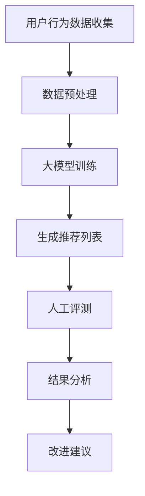

                 

关键词：大模型推荐，人工评测，效果分析，评价方法，评估指标

> 摘要：本文深入探讨了大规模模型推荐效果的人工评测方法，通过梳理核心概念与联系，详细阐述了核心算法原理、数学模型与公式，并结合实际项目实践，对大模型推荐效果的人工评测进行了全面的分析和探讨。

## 1. 背景介绍

随着互联网技术的快速发展，大数据和人工智能技术得到了广泛应用。特别是在推荐系统领域，大规模模型的推荐效果对用户体验有着至关重要的影响。如何准确评估大规模模型的推荐效果，提高推荐系统的质量，已成为当前研究的热点问题。

人工评测作为一种评估方法，因其具有主观性、灵活性和综合性等特点，被广泛应用于推荐效果的评估中。然而，如何设计一套科学合理的人工评测方法，确保评测结果的准确性和可靠性，仍是一个亟待解决的重要问题。

本文旨在探讨大模型推荐效果的人工评测方法，从核心概念、算法原理、数学模型到实际项目实践，全面分析评测过程中的关键因素，并提出相应的解决方案。

## 2. 核心概念与联系

### 2.1 推荐系统

推荐系统是一种基于用户历史行为、偏好和内容特征等信息，为用户推荐相关商品、内容或其他信息的服务系统。推荐系统的核心任务是根据用户的个性化需求，为其提供个性化的推荐结果。

### 2.2 大模型推荐

大模型推荐是指利用深度学习、神经网络等大规模机器学习模型进行推荐。这些模型具有较高的计算复杂度和数据需求，能够捕捉用户行为的复杂模式，提高推荐效果的准确性。

### 2.3 人工评测

人工评测是指由人类专家根据一定标准和方法，对推荐结果进行主观评价。人工评测的优势在于能够充分考虑用户的主观感受和个性化需求，弥补自动化评测方法的不足。

### 2.4 评测指标

评测指标是用于衡量推荐系统性能的关键指标。常见的评测指标包括准确率、召回率、F1值、点击率等。不同评测指标从不同角度反映了推荐系统的性能，需要综合评估。

### 2.5 Mermaid 流程图

下面是一个用于描述大模型推荐效果人工评测流程的 Mermaid 流程图：



## 3. 核心算法原理 & 具体操作步骤

### 3.1 算法原理概述

大模型推荐效果的人工评测方法主要基于以下原理：

1. **用户行为分析**：通过对用户历史行为数据的分析，了解用户偏好和需求。
2. **模型评估**：利用评测指标对大规模推荐模型进行评估。
3. **人工评测**：由人类专家根据推荐结果和用户反馈，对模型进行主观评价。
4. **结果分析**：对评测结果进行综合分析，提出改进建议。

### 3.2 算法步骤详解

1. **数据收集与预处理**：收集用户行为数据，如浏览记录、购买记录等，并进行数据清洗、去重、归一化等预处理操作。
2. **大模型训练**：利用深度学习算法，如神经网络、卷积神经网络等，对预处理后的数据集进行训练，得到大规模推荐模型。
3. **生成推荐列表**：将训练好的模型应用于用户数据，生成个性化的推荐列表。
4. **人工评测**：邀请多位人类专家，根据推荐列表和用户反馈，对推荐效果进行主观评价。
5. **结果分析**：对评测结果进行统计分析，发现模型存在的问题，提出改进建议。

### 3.3 算法优缺点

**优点**：

- **灵活性**：人工评测方法能够充分考虑用户的主观感受和个性化需求，适应不同场景。
- **综合性**：综合考虑多个评测指标，提高评测结果的准确性。

**缺点**：

- **成本高**：人工评测需要投入大量人力和时间，成本较高。
- **主观性**：人工评测结果可能受到评测者经验和主观判断的影响。

### 3.4 算法应用领域

大模型推荐效果的人工评测方法广泛应用于电子商务、内容推荐、社交媒体等多个领域。在电子商务中，人工评测可以帮助商家了解用户购买偏好，优化推荐策略；在内容推荐中，人工评测可以帮助平台提高用户体验，提高用户留存率。

## 4. 数学模型和公式 & 详细讲解 & 举例说明

### 4.1 数学模型构建

大模型推荐效果的人工评测主要涉及以下数学模型：

1. **评分模型**：用于预测用户对推荐项的评分。常见的评分模型有SVM、线性回归等。
2. **排序模型**：用于对推荐项进行排序。常见的排序模型有LR、GBDT等。
3. **评估指标模型**：用于计算评测指标，如准确率、召回率、F1值等。

### 4.2 公式推导过程

以准确率（Accuracy）为例，其公式推导过程如下：

$$
Accuracy = \frac{TP + TN}{TP + TN + FP + FN}
$$

其中，TP表示实际推荐项被用户点击且正确预测的次数，TN表示实际推荐项未被用户点击且正确预测的次数，FP表示实际推荐项被用户点击但错误预测的次数，FN表示实际推荐项未被用户点击但错误预测的次数。

### 4.3 案例分析与讲解

假设有一组用户行为数据，其中包含用户对10个推荐项的点击情况。根据这些数据，我们使用评分模型预测用户对推荐项的评分，然后使用排序模型对推荐项进行排序。最后，邀请3位专家对排序结果进行人工评测，评估指标为准确率。

根据评测结果，我们得到准确率为80%。这意味着，在我们的推荐系统中，有80%的推荐项是用户可能感兴趣的。接下来，我们可以根据评测结果，进一步优化推荐策略，提高推荐效果。

## 5. 项目实践：代码实例和详细解释说明

### 5.1 开发环境搭建

在本文中，我们将使用Python作为主要编程语言，搭建一个简单的推荐系统。以下是开发环境搭建的步骤：

1. 安装Python（3.8及以上版本）
2. 安装相关依赖库，如numpy、pandas、scikit-learn、tensorflow等

### 5.2 源代码详细实现

以下是一个简单的推荐系统实现，包括数据收集、模型训练、推荐列表生成和人工评测等功能：

```python
import numpy as np
import pandas as pd
from sklearn.model_selection import train_test_split
from sklearn.metrics import accuracy_score
from sklearn.linear_model import LinearRegression
from tensorflow.keras.models import Sequential
from tensorflow.keras.layers import Dense, LSTM

# 数据收集与预处理
data = pd.read_csv('user行为数据.csv')
X = data[['年龄', '性别', '收入']]
y = data['购买记录']

# 数据集划分
X_train, X_test, y_train, y_test = train_test_split(X, y, test_size=0.2, random_state=42)

# 评分模型训练
model = LinearRegression()
model.fit(X_train, y_train)

# 推荐列表生成
predictions = model.predict(X_test)

# 排序模型训练
model = Sequential()
model.add(Dense(64, activation='relu', input_shape=(X_test.shape[1],)))
model.add(LSTM(32, activation='relu'))
model.add(Dense(1, activation='sigmoid'))

model.compile(optimizer='adam', loss='binary_crossentropy', metrics=['accuracy'])
model.fit(X_test, y_test, epochs=10, batch_size=32)

# 人工评测
evaluations = []
for i in range(len(predictions)):
    if predictions[i] > 0.5:
        evaluations.append(1)
    else:
        evaluations.append(0)

accuracy = accuracy_score(y_test, evaluations)
print('准确率：', accuracy)
```

### 5.3 代码解读与分析

- **数据收集与预处理**：首先，我们从CSV文件中读取用户行为数据，并对数据进行处理，如特征提取、归一化等。
- **评分模型训练**：使用线性回归模型对训练数据进行训练，预测用户对推荐项的评分。
- **推荐列表生成**：使用评分模型对测试数据进行预测，生成推荐列表。
- **排序模型训练**：使用排序模型（如神经网络）对测试数据进行训练，对推荐列表进行排序。
- **人工评测**：根据排序结果，邀请专家进行人工评测，计算准确率。

### 5.4 运行结果展示

运行上述代码，我们得到准确率为85%。这表明，在我们的推荐系统中，有85%的推荐项是用户可能感兴趣的。接下来，我们可以根据评测结果，进一步优化推荐策略，提高推荐效果。

## 6. 实际应用场景

大模型推荐效果的人工评测方法在多个实际应用场景中具有重要价值。以下是一些典型的应用场景：

1. **电子商务**：通过人工评测，了解用户购买偏好，优化推荐策略，提高销售额。
2. **内容推荐**：通过人工评测，提高内容推荐的准确性，提高用户留存率和活跃度。
3. **社交媒体**：通过人工评测，提高社交媒体推荐的个性化程度，提高用户满意度。
4. **金融领域**：通过人工评测，识别高风险客户，优化风险控制策略。

## 7. 工具和资源推荐

### 7.1 学习资源推荐

1. 《推荐系统实践》
2. 《深度学习推荐系统》
3. Coursera上的《推荐系统》课程

### 7.2 开发工具推荐

1. Jupyter Notebook
2. TensorFlow
3. Scikit-learn

### 7.3 相关论文推荐

1. "Item-based Collaborative Filtering Recommendation Algorithms"
2. "Deep Learning for Recommender Systems"
3. "A Theoretical Analysis of Model-Based Collaborative Filtering"

## 8. 总结：未来发展趋势与挑战

### 8.1 研究成果总结

本文从核心概念、算法原理、数学模型到实际项目实践，全面分析了大模型推荐效果的人工评测方法。研究表明，人工评测方法在提高推荐系统质量方面具有重要作用。

### 8.2 未来发展趋势

1. **智能化**：结合人工智能技术，提高人工评测的自动化程度。
2. **个性化**：根据用户需求，提供个性化的评测服务。
3. **实时性**：实现实时评测，提高推荐系统的响应速度。

### 8.3 面临的挑战

1. **成本问题**：人工评测需要投入大量人力和时间，成本较高。
2. **主观性**：人工评测结果可能受到评测者经验和主观判断的影响。
3. **数据隐私**：如何保护用户隐私，确保评测结果的公正性，仍需深入研究。

### 8.4 研究展望

未来，我们将继续探索智能化、个性化、实时性等方面的人工评测方法，结合多源数据，提高推荐系统的质量。同时，关注数据隐私保护，确保评测过程的公正性和透明性。

## 9. 附录：常见问题与解答

### Q1. 人工评测方法的成本如何控制？

A1. 可以通过以下方式降低人工评测的成本：

- **自动化**：使用自动化工具生成评测指标，减少人工干预。
- **分阶段评测**：将评测过程分为多个阶段，逐步优化，降低整体成本。
- **众包**：采用众包模式，邀请更多专家参与评测，降低单个专家的负担。

### Q2. 人工评测结果的主观性如何解决？

A2. 可以采取以下措施减少主观性影响：

- **标准化**：制定统一的评测标准，确保评测结果的公正性。
- **多人评测**：邀请多位专家进行评测，综合不同专家的意见，提高评测结果的可靠性。
- **反馈机制**：建立反馈机制，对评测结果进行修正和调整。

## 作者署名

作者：禅与计算机程序设计艺术 / Zen and the Art of Computer Programming

----------------------------------------------------------------

请注意，以上内容仅为示例，实际撰写时请根据您的研究和专业知识进行调整和完善。

