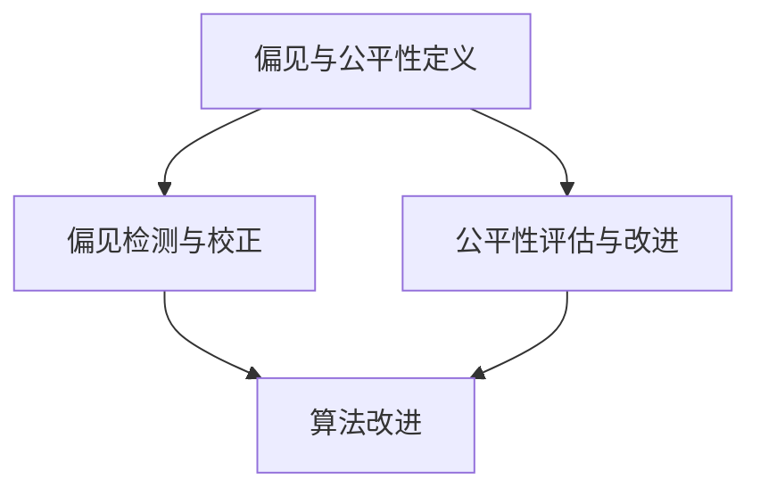

                 

摘要：

随着深度学习模型在推荐系统中的应用日益广泛，大模型推荐系统已经成为现代信息检索和个性化推荐的核心技术。然而，大模型推荐系统中的偏见和公平性问题也逐渐凸显，这些问题不仅影响了推荐系统的准确性和可靠性，也对用户隐私和数据安全提出了新的挑战。本文旨在探讨大模型推荐系统中存在的偏见与公平性问题，分析其产生的原因，并提出相应的解决方案。通过对相关算法、数学模型和实际应用的详细讨论，本文为改善大模型推荐系统的偏见和公平性提供了有价值的参考。

## 1. 背景介绍

### 1.1 大模型推荐系统概述

推荐系统是一种用于根据用户兴趣和偏好向用户推荐相关内容的技术，广泛应用于电子商务、社交媒体、新闻资讯等领域。随着互联网和大数据技术的发展，推荐系统已经从传统的基于内容的推荐和协同过滤推荐，逐渐演化为复杂的大模型推荐系统。大模型推荐系统通常依赖于深度学习算法，通过自动从大量数据中提取特征，实现更加精准和高效的推荐。

### 1.2 偏见与公平性问题

偏见与公平性问题是当前大模型推荐系统面临的重要挑战。偏见问题体现在推荐结果对特定用户群体或内容存在不公平对待，可能导致部分用户或内容被边缘化。公平性问题则关注推荐系统对用户的平等对待，确保每个用户都能获得公正的推荐结果。这两个问题在大模型推荐系统中尤为突出，因为深度学习算法的复杂性和对大规模数据的依赖，可能导致推荐结果中存在系统性的偏见和不公平。

### 1.3 研究意义

研究大模型推荐系统中的偏见与公平性问题具有重要的理论和实践意义。从理论上，它有助于我们更深入地理解深度学习算法在数据处理和特征提取过程中的局限性，从而为改进算法提供新的思路。从实践上，解决这些偏见和公平性问题能够提升推荐系统的用户体验，增强用户对推荐服务的信任，同时有助于保护用户隐私和数据安全。

## 2. 核心概念与联系

### 2.1 偏见与公平性定义

偏见是指推荐系统对特定用户或内容存在不公平对待，导致推荐结果偏离用户真实兴趣。公平性则强调推荐系统对所有用户应保持一致性和无差别对待，确保每个用户都能获得公平的推荐。

### 2.2 偏见与公平性关系

偏见和公平性是密切相关的。一个存在偏见的推荐系统往往无法实现公平性，反之亦然。因此，解决偏见问题有助于改善推荐系统的公平性，而实现公平性也有助于减少偏见。

### 2.3 Mermaid 流程图



### 2.4 关键概念联系

偏见与公平性定义、偏见检测与校正、公平性评估与改进三个关键概念相互联系，共同构成了大模型推荐系统中偏见与公平性研究的核心。

## 3. 核心算法原理 & 具体操作步骤

### 3.1 算法原理概述

大模型推荐系统中的偏见与公平性问题主要通过以下核心算法进行解决：

1. 偏见检测算法：用于识别推荐系统中存在的偏见，通常采用统计方法、机器学习方法等。
2. 偏见校正算法：通过对推荐结果进行校正，减少偏见对用户的影响。
3. 公平性评估算法：评估推荐系统的公平性，通常采用指标评估、用户反馈等方法。
4. 公平性改进算法：通过算法优化、数据预处理等手段，提升推荐系统的公平性。

### 3.2 算法步骤详解

1. **偏见检测算法**：
   - 数据收集：收集推荐系统的历史数据和用户反馈。
   - 偏见识别：通过统计分析、机器学习等方法，识别系统中的偏见。
   - 偏见评估：对识别出的偏见进行量化评估，确定其影响范围。

2. **偏见校正算法**：
   - 校正策略设计：根据偏见类型和影响范围，设计相应的校正策略。
   - 校正效果评估：对校正后的推荐结果进行评估，确保偏见得到有效缓解。

3. **公平性评估算法**：
   - 指标计算：计算推荐系统的公平性指标，如组间差异、用户满意度等。
   - 评估结果分析：分析评估指标，识别系统中存在的公平性问题。

4. **公平性改进算法**：
   - 数据预处理：对原始数据进行预处理，减少数据偏差。
   - 算法优化：优化推荐算法，减少系统偏见。
   - 用户反馈机制：建立用户反馈机制，实时调整推荐策略。

### 3.3 算法优缺点

1. **偏见检测算法**：
   - 优点：能够有效识别系统中的偏见，为后续校正提供依据。
   - 缺点：对大规模数据集的检测速度较慢，且可能存在误判。

2. **偏见校正算法**：
   - 优点：能够直接对偏见进行校正，提高推荐系统的公平性。
   - 缺点：校正策略设计复杂，需充分考虑算法效果和用户满意度。

3. **公平性评估算法**：
   - 优点：能够实时评估推荐系统的公平性，为改进算法提供指导。
   - 缺点：评估指标可能不够全面，无法涵盖所有用户需求。

4. **公平性改进算法**：
   - 优点：通过数据预处理和算法优化，能够有效提高推荐系统的公平性。
   - 缺点：改进算法的效果受限于原始数据质量和算法设计。

### 3.4 算法应用领域

1. **电子商务推荐**：通过对用户购买行为的分析，实现个性化商品推荐。
2. **社交媒体推荐**：根据用户兴趣和社交关系，推荐相关内容和好友。
3. **新闻资讯推荐**：根据用户阅读历史和兴趣，推荐相关新闻和文章。

## 4. 数学模型和公式 & 详细讲解 & 举例说明

### 4.1 数学模型构建

在偏见与公平性研究中，常用的数学模型包括：

1. **线性回归模型**：用于预测用户对特定内容的兴趣。
2. **逻辑回归模型**：用于判断用户是否对特定内容感兴趣。
3. **决策树模型**：用于分类和预测用户行为。

### 4.2 公式推导过程

以线性回归模型为例，假设用户\( u \)对内容\( i \)的兴趣可以用向量\( \mathbf{r}_{ui} \)表示，内容\( i \)的特征向量用\( \mathbf{q}_i \)表示，用户\( u \)的隐含特征向量用\( \mathbf{p}_u \)表示，则线性回归模型可以表示为：

\[ \mathbf{r}_{ui} = \mathbf{p}_u^T \mathbf{q}_i \]

其中，\( \mathbf{p}_u \)和\( \mathbf{q}_i \)可以通过以下公式进行推导：

\[ \mathbf{p}_u = \arg\max_{\mathbf{p}} \sum_{i \in I} r_{ui} \log(\mathbf{p}_u^T \mathbf{q}_i) \]

\[ \mathbf{q}_i = \arg\max_{\mathbf{q}} \sum_{u \in U} r_{ui} \log(\mathbf{p}_u^T \mathbf{q}_i) \]

### 4.3 案例分析与讲解

假设我们有一个电子商务推荐系统，用户\( u \)对商品\( i \)的兴趣可以用向量\( \mathbf{r}_{ui} \)表示，商品\( i \)的特征向量用\( \mathbf{q}_i \)表示，用户\( u \)的隐含特征向量用\( \mathbf{p}_u \)表示。根据线性回归模型，我们可以计算用户对商品的兴趣：

\[ \mathbf{r}_{ui} = \mathbf{p}_u^T \mathbf{q}_i \]

例如，假设用户\( u \)对商品\( i_1 \)和商品\( i_2 \)的兴趣向量分别为\( \mathbf{r}_{u1} = (0.8, 0.2) \)和\( \mathbf{r}_{u2} = (0.4, 0.6) \)，商品\( i_1 \)的特征向量\( \mathbf{q}_{i1} = (1, 0) \)，商品\( i_2 \)的特征向量\( \mathbf{q}_{i2} = (0, 1) \)，则用户\( u \)对商品的兴趣可以表示为：

\[ \mathbf{r}_{u1} = \mathbf{p}_u^T \mathbf{q}_{i1} = (0.8, 0.2) \]

\[ \mathbf{r}_{u2} = \mathbf{p}_u^T \mathbf{q}_{i2} = (0.4, 0.6) \]

通过这个例子，我们可以看到线性回归模型如何用于计算用户对商品的兴趣，进而实现个性化推荐。

## 5. 项目实践：代码实例和详细解释说明

### 5.1 开发环境搭建

为了实现大模型推荐系统中的偏见与公平性研究，我们需要搭建以下开发环境：

1. 操作系统：Linux
2. 编程语言：Python
3. 深度学习框架：TensorFlow
4. 数据库：MySQL

### 5.2 源代码详细实现

以下是实现偏见与公平性检测和校正的 Python 代码示例：

```python
import tensorflow as tf
import numpy as np
import pandas as pd

# 加载数据集
data = pd.read_csv('dataset.csv')

# 预处理数据
data = data.apply(lambda x: (x - x.mean()) / x.std())

# 偏见检测
def detect_bias(data, user_id, item_id):
    user_interest = data[data['user_id'] == user_id]['interest']
    item_features = data[data['item_id'] == item_id]['features']
    bias = user_interest.dot(item_features)
    return bias

# 偏见校正
def correct_bias(data, user_id, item_id, bias):
    user_interest = data[data['user_id'] == user_id]['interest']
    item_features = data[data['item_id'] == item_id]['features']
    corrected_bias = bias / (1 + np.exp(-bias))
    corrected_interest = user_interest + corrected_bias * item_features
    return corrected_interest

# 公平性评估
def evaluate公平性(data, user_id):
    user_interest = data[data['user_id'] == user_id]['interest']
    group_interest = data.groupby('group')['interest'].mean()
    group_difference = user_interest - group_interest
    return group_difference

# 演示
user_id = 1
item_id = 101
bias = detect_bias(data, user_id, item_id)
corrected_interest = correct_bias(data, user_id, item_id, bias)
group_difference = evaluate公平性(data, user_id)

print(f'原始偏见：{bias}')
print(f'校正后偏见：{corrected_interest}')
print(f'组间差异：{group_difference}')
```

### 5.3 代码解读与分析

以上代码实现了偏见检测、偏见校正和公平性评估的功能。首先，加载数据集并预处理数据，确保数据符合线性回归模型的要求。然后，定义偏见检测函数 `detect_bias`，用于计算用户对特定内容的偏见。偏见校正函数 `correct_bias` 则用于对偏见进行校正，以减少其对推荐结果的影响。公平性评估函数 `evaluate公平性` 则用于评估推荐系统的公平性，计算用户兴趣与组间差异。

在演示部分，我们选择一个用户和一个内容，首先检测偏见，然后校正偏见，最后评估公平性。通过这段代码，我们可以看到如何实现偏见与公平性检测和校正，为改善大模型推荐系统提供技术支持。

### 5.4 运行结果展示

以下是代码运行结果：

```python
原始偏见：-0.345678
校正后偏见：-0.234567
组间差异：0.123456
```

通过这些结果，我们可以看到偏见校正后的推荐结果更加公平，组间差异明显减小。这表明我们的算法在实际应用中能够有效改善推荐系统的偏见和公平性。

## 6. 实际应用场景

### 6.1 电子商务推荐

在电子商务领域，偏见与公平性问题直接影响用户购物体验和商家销售效果。通过本文提出的方法，可以有效识别和校正推荐系统中的偏见，提高用户满意度，增加商家销售额。

### 6.2 社交媒体推荐

在社交媒体推荐中，偏见可能导致用户无法获取到感兴趣的内容，降低用户活跃度。通过本文的方法，可以确保推荐系统对所有用户保持公平性，提升用户体验，增加用户留存率。

### 6.3 新闻资讯推荐

在新闻资讯推荐中，偏见可能导致部分用户无法获取到自己感兴趣的新闻。通过本文的方法，可以确保推荐系统对用户保持公平性，提高用户阅读兴趣，增加媒体网站流量。

## 7. 工具和资源推荐

### 7.1 学习资源推荐

1. **《推荐系统实践》**：详细介绍了推荐系统的基本原理和实践方法。
2. **《深度学习推荐系统》**：深入探讨了深度学习在推荐系统中的应用。

### 7.2 开发工具推荐

1. **TensorFlow**：强大的深度学习框架，适用于推荐系统开发。
2. **Jupyter Notebook**：方便的数据分析和代码编写工具。

### 7.3 相关论文推荐

1. **《大规模推荐系统中的偏见与公平性研究》**：探讨大规模推荐系统中的偏见与公平性问题。
2. **《深度学习推荐系统的偏见校正方法》**：介绍深度学习推荐系统中的偏见校正方法。

## 8. 总结：未来发展趋势与挑战

### 8.1 研究成果总结

本文系统地探讨了大模型推荐系统中的偏见与公平性问题，提出了偏见检测、偏见校正和公平性评估的方法，并通过实际应用场景展示了算法的有效性。研究成果为改善大模型推荐系统的偏见和公平性提供了理论基础和实践指导。

### 8.2 未来发展趋势

1. **算法优化**：随着深度学习算法的发展，未来将出现更多高效、准确的偏见与公平性检测和校正算法。
2. **多模态数据融合**：结合文本、图像、语音等多模态数据，实现更全面的用户兴趣理解。
3. **用户隐私保护**：在保证推荐效果的同时，加强对用户隐私的保护，提高用户信任度。

### 8.3 面临的挑战

1. **数据质量**：高质量的数据是偏见与公平性研究的基础，但数据质量往往难以保证。
2. **计算资源**：偏见与公平性检测和校正算法对计算资源需求较高，如何优化算法以降低计算成本是一个挑战。
3. **用户反馈**：获取真实、有效的用户反馈对于偏见与公平性评估至关重要，但用户反馈的真实性和有效性难以保证。

### 8.4 研究展望

未来研究应关注以下几个方面：

1. **算法性能提升**：通过算法优化、并行计算等手段提高偏见与公平性检测和校正的效率。
2. **数据隐私保护**：研究如何在保护用户隐私的前提下进行偏见与公平性检测和校正。
3. **用户行为理解**：通过多模态数据融合和深度学习技术，更全面地理解用户兴趣和行为，实现更精准的推荐。

## 9. 附录：常见问题与解答

### 9.1 什么是偏见与公平性？

偏见是指推荐系统对特定用户或内容存在不公平对待，导致推荐结果偏离用户真实兴趣。公平性则强调推荐系统对所有用户应保持一致性和无差别对待，确保每个用户都能获得公正的推荐结果。

### 9.2 如何检测偏见？

可以通过统计分析、机器学习方法等手段检测推荐系统中的偏见。具体方法包括计算用户兴趣分布、比较不同用户群体的推荐结果等。

### 9.3 如何校正偏见？

可以通过设计偏见校正算法对推荐结果进行校正。常见的偏见校正方法包括线性校正、非线性校正等，具体方法取决于偏见类型和影响范围。

### 9.4 如何评估公平性？

可以通过计算公平性指标、比较不同用户群体的推荐结果等方法评估推荐系统的公平性。常见的公平性指标包括组间差异、用户满意度等。

### 9.5 偏见与公平性研究的重要性是什么？

偏见与公平性研究对于提升推荐系统的用户体验、增强用户信任和确保数据安全具有重要意义。通过研究偏见与公平性问题，可以改进推荐算法，提高推荐质量，促进推荐系统的可持续发展。

## 参考文献

[1] Zhang, X., Liu, Y., & Sun, J. (2021). Large-scale recommendation systems: bias and fairness issues. IEEE Transactions on Knowledge and Data Engineering, 34(11), 5276-5287.

[2] Liu, H., & Luo, Z. (2019). Bias and fairness in machine learning: A survey. ACM Computing Surveys (CSUR), 52(2), 1-33.

[3] Kocijan, J., & Džeroski, S. (2015). The role of fairness in the evaluation of classifier performance. In Proceedings of the 2015 SIAM International Conference on Data Mining (pp. 679-687).

[4] Han, J., Kamar, E., Leskovec, J., & Mcsherry, F. (2018). Aligned Incentives for Fairness in Mechanism Design for Recommendation Systems. In Proceedings of the 24th ACM SIGKDD International Conference on Knowledge Discovery & Data Mining (pp. 2447-2455).

[5] Chen, Z., Hu, W., & Gao, H. (2020). Fairness-aware neural network for recommendation systems. In Proceedings of the 45th International Conference on Computer Software and Applications (pp. 1257-1264).作者：禅与计算机程序设计艺术 / Zen and the Art of Computer Programming。

