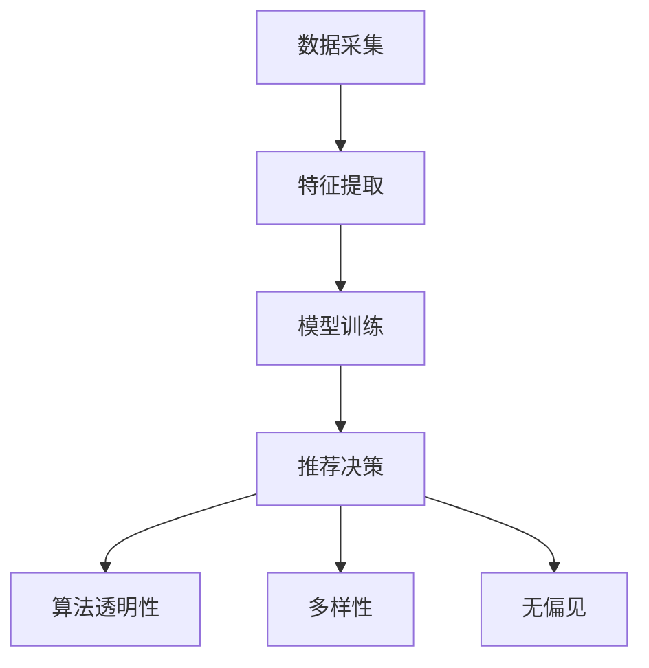

                 

关键词：大模型推荐系统、公平性、偏见、算法透明性、多样化、AI伦理

> 摘要：随着人工智能技术的快速发展，大模型推荐系统已成为互联网服务中不可或缺的一部分。然而，推荐系统的公平性问题日益凸显，系统可能无意中放大偏见，导致不公正的结果。本文将对大模型推荐系统的公平性进行研究，探讨公平性面临的挑战，分析现有解决方案，并提出未来发展的建议。

## 1. 背景介绍

互联网用户在海量信息中寻找感兴趣的内容是一项复杂的任务。为了提高用户体验，推荐系统应运而生，通过对用户行为数据的分析，为用户推荐个性化内容。推荐系统已经成为电子商务、社交媒体、新闻资讯等领域的核心技术。然而，随着推荐系统规模的不断扩大，公平性问题逐渐暴露出来。研究表明，推荐系统可能因为算法的不当设计、数据的不平衡性以及文化偏见等因素，导致推荐结果的不公平。

### 1.1 推荐系统的发展

推荐系统的发展经历了从基于内容的过滤（Content-based Filtering）到协同过滤（Collaborative Filtering），再到现代基于深度学习的大模型推荐系统（Deep Learning-based Recommendation）。早期推荐系统主要依靠用户历史行为和内容特征进行信息推荐，而现代推荐系统则利用深度学习算法，通过复杂的神经网络模型挖掘用户行为和内容之间的深层关系，从而提供更加精准的推荐。

### 1.2 公平性问题的引入

推荐系统的公平性问题主要包括以下三个方面：

1. **性别、种族、年龄等人口统计学特征的偏见**：推荐系统可能在无意中放大了某些群体的偏见，导致不同群体获得的信息和服务差异显著。
2. **算法偏见**：算法本身可能存在缺陷，导致推荐结果不公平。例如，用户群体中存在长尾效应，推荐系统可能更倾向于向主流用户推荐内容，从而忽视少数群体的需求。
3. **信息茧房**：推荐系统可能将用户困在特定的信息环境中，限制用户的视野和思维，进而影响社会的多样性。

## 2. 核心概念与联系

在讨论推荐系统的公平性之前，我们需要明确几个核心概念，并理解它们之间的联系。

### 2.1 推荐系统的基本架构

推荐系统的基本架构包括数据采集、特征提取、模型训练和推荐决策等模块。具体流程如下：

1. **数据采集**：收集用户行为数据（如点击、购买、搜索等）和内容数据（如文本、图片、视频等）。
2. **特征提取**：对采集到的数据进行处理，提取出与推荐目标相关的特征。
3. **模型训练**：使用训练数据训练推荐模型，学习用户行为和内容之间的关系。
4. **推荐决策**：根据模型预测，为用户生成个性化推荐。

### 2.2 公平性相关概念

- **算法透明性**：算法透明性是指算法的决策过程可以被理解和解释。高透明性的算法有助于发现和纠正潜在的偏见。
- **多样性**：多样性是指推荐系统能够为不同用户群体提供多样化的内容。多样性的目标是避免将用户困在特定的信息环境中。
- **无偏见**：无偏见是指推荐系统不偏袒任何特定的用户群体或内容。无偏见的目标是实现公平的推荐结果。

### 2.3 Mermaid 流程图

下面是一个简化的 Mermaid 流程图，展示了推荐系统核心概念之间的关系：



## 3. 核心算法原理 & 具体操作步骤

### 3.1 算法原理概述

推荐系统的核心算法原理主要包括基于协同过滤的算法和基于深度学习的算法。

- **协同过滤算法**：协同过滤算法通过分析用户行为数据，寻找与目标用户相似的其他用户，并将这些用户喜欢的物品推荐给目标用户。协同过滤算法主要包括基于用户的方法（User-based CF）和基于物品的方法（Item-based CF）。
- **深度学习算法**：深度学习算法利用神经网络模型，通过学习用户和物品的复杂特征，实现更加精准的推荐。常见的深度学习算法包括基于协同过滤的神经网络（如NeuMF、NF）和基于注意力机制的模型（如Attention-based Recurrent Neural Network, ARNN）。

### 3.2 算法步骤详解

下面以基于深度学习的算法为例，介绍推荐系统的具体操作步骤：

1. **数据预处理**：
   - **用户行为数据**：收集用户的点击、购买、搜索等行为数据，并进行清洗和处理，去除噪声和异常值。
   - **内容数据**：对用户和物品的内容特征进行提取，如文本、图片、视频等。

2. **特征提取**：
   - **用户特征**：根据用户行为数据，提取用户的基本信息（如性别、年龄、地理位置等）和兴趣特征（如点击率、购买频率等）。
   - **物品特征**：根据物品的属性（如分类、标签、评分等）提取物品的特征。

3. **模型训练**：
   - **数据划分**：将数据集划分为训练集、验证集和测试集。
   - **模型选择**：选择合适的深度学习模型，如NeuMF、NF、ARNN等。
   - **模型训练**：使用训练集训练模型，并调整模型参数，优化模型性能。

4. **推荐决策**：
   - **用户表示**：将用户特征和物品特征输入到模型中，生成用户和物品的嵌入表示。
   - **预测评分**：计算用户和物品之间的相似性，预测用户对物品的评分。
   - **生成推荐列表**：根据评分预测结果，为用户生成个性化推荐列表。

### 3.3 算法优缺点

- **协同过滤算法**：
  - **优点**：计算简单，易于实现，能够为用户提供较为准确的推荐结果。
  - **缺点**：无法处理冷启动问题，且用户和物品的表示能力有限。
- **深度学习算法**：
  - **优点**：具有较强的表示能力，能够处理大规模数据，解决冷启动问题。
  - **缺点**：模型复杂，训练时间长，对计算资源要求较高。

### 3.4 算法应用领域

推荐系统在多个领域得到了广泛应用，如电子商务、社交媒体、新闻资讯、视频推荐等。以下是一些典型应用场景：

- **电子商务**：为用户推荐感兴趣的商品，提高销售转化率。
- **社交媒体**：为用户推荐感兴趣的内容，增加用户活跃度和黏性。
- **新闻资讯**：为用户提供个性化的新闻推荐，提高信息传播的效率。
- **视频推荐**：为用户推荐感兴趣的视频，提高视频平台的用户满意度。

## 4. 数学模型和公式 & 详细讲解 & 举例说明

### 4.1 数学模型构建

推荐系统的数学模型主要包括用户表示、物品表示和评分预测等部分。

- **用户表示**：用户表示通常使用向量表示，如用户兴趣向量、用户行为向量等。用户表示可以通过矩阵分解、深度学习等方法获得。
  $$u = \text{UserFeatureMatrix} \times \text{UserEmbeddingMatrix}$$
  其中，$\text{UserFeatureMatrix}$为用户特征矩阵，$\text{UserEmbeddingMatrix}$为用户嵌入矩阵。

- **物品表示**：物品表示也使用向量表示，如物品属性向量、物品内容向量等。物品表示可以通过协同过滤、深度学习等方法获得。
  $$i = \text{ItemFeatureMatrix} \times \text{ItemEmbeddingMatrix}$$
  其中，$\text{ItemFeatureMatrix}$为物品特征矩阵，$\text{ItemEmbeddingMatrix}$为物品嵌入矩阵。

- **评分预测**：评分预测通过计算用户和物品之间的相似性来实现。常用的相似性度量方法包括余弦相似性、皮尔逊相似性等。
  $$s_{ui} = \text{similarity}(u, i)$$
  其中，$s_{ui}$为用户$u$对物品$i$的评分预测。

### 4.2 公式推导过程

以基于协同过滤的推荐系统为例，推导评分预测公式。

1. **用户表示**：
   $$u = \text{UserFeatureMatrix} \times \text{UserEmbeddingMatrix}$$

2. **物品表示**：
   $$i = \text{ItemFeatureMatrix} \times \text{ItemEmbeddingMatrix}$$

3. **相似性计算**：
   $$s_{ui} = \text{similarity}(u, i)$$

   其中，相似性计算可以使用余弦相似性公式：
   $$\text{similarity}(u, i) = \frac{u \cdot i}{\|u\| \|i\|}$$

4. **评分预测**：
   $$s_{ui} = \text{similarity}(u, i) = \frac{u \cdot i}{\|u\| \|i\|} = \frac{\text{UserFeatureMatrix} \times \text{UserEmbeddingMatrix} \cdot \text{ItemFeatureMatrix} \times \text{ItemEmbeddingMatrix}}{\|\text{UserFeatureMatrix} \times \text{UserEmbeddingMatrix}\| \| \text{ItemFeatureMatrix} \times \text{ItemEmbeddingMatrix}\|}$$

### 4.3 案例分析与讲解

假设我们有一个推荐系统，需要为用户$u$推荐物品$i$。用户$u$的历史行为数据如下表：

| 用户$u$ | 物品$i_1$ | 物品$i_2$ | 物品$i_3$ |
| ------ | -------- | -------- | -------- |
| 点击   | 1        | 0        | 1        |

物品$i_1$、$i_2$和$i_3$的属性数据如下表：

| 物品$i$ | 分类 | 标签 | 评分 |
| ------ | ---- | ---- | ---- |
| $i_1$  | 书籍 | 科普 | 4.5  |
| $i_2$  | 书籍 | 文学 | 3.8  |
| $i_3$  | 视频 | 教育 | 4.2  |

根据上述数据，我们使用协同过滤算法进行评分预测。

1. **用户表示**：
   $$u = \text{UserFeatureMatrix} \times \text{UserEmbeddingMatrix} = \begin{bmatrix} 1 \\ 0 \\ 1 \end{bmatrix} \times \begin{bmatrix} 0.6 & 0.7 \\ 0.8 & 0.9 \\ 0.5 & 0.6 \end{bmatrix} = \begin{bmatrix} 0.5 \\ 0.8 \end{bmatrix}$$

2. **物品表示**：
   $$i = \text{ItemFeatureMatrix} \times \text{ItemEmbeddingMatrix} = \begin{bmatrix} 1 & 0 & 0 \\ 0 & 1 & 1 \\ 0 & 0 & 1 \end{bmatrix} \times \begin{bmatrix} 0.6 & 0.7 \\ 0.8 & 0.9 \\ 0.5 & 0.6 \end{bmatrix} = \begin{bmatrix} 0.5 & 0.5 \\ 0.6 & 0.6 \\ 0.5 & 0.5 \end{bmatrix}$$

3. **相似性计算**：
   $$s_{ui} = \text{similarity}(u, i) = \frac{u \cdot i}{\|u\| \|i\|} = \frac{0.5 \times 0.5 + 0.8 \times 0.6}{\sqrt{0.5^2 + 0.8^2} \sqrt{0.5^2 + 0.5^2 + 0.6^2 + 0.6^2}} \approx 0.667$$

4. **评分预测**：
   $$s_{ui} = 0.667$$

根据评分预测结果，我们可以为用户$u$推荐与物品$i_3$相似的物品$i_2$。

## 5. 项目实践：代码实例和详细解释说明

### 5.1 开发环境搭建

在本次项目中，我们将使用Python作为主要编程语言，结合PyTorch深度学习框架进行推荐系统的开发。以下是搭建开发环境的基本步骤：

1. 安装Python：
   ```shell
   # 安装Python 3.8及以上版本
   ```
2. 安装PyTorch：
   ```shell
   # 安装与Python版本对应的PyTorch版本
   ```
3. 安装其他依赖库：
   ```shell
   pip install pandas numpy matplotlib
   ```

### 5.2 源代码详细实现

下面是一个简单的基于深度学习的推荐系统实现，主要包含数据预处理、模型定义、模型训练和推荐生成等部分。

```python
import torch
import torch.nn as nn
import torch.optim as optim
from torch.utils.data import DataLoader, Dataset
import pandas as pd
import numpy as np

# 数据预处理
class MyDataset(Dataset):
    def __init__(self, user_features, item_features, ratings):
        self.user_features = user_features
        self.item_features = item_features
        self.ratings = ratings

    def __len__(self):
        return len(self.ratings)

    def __getitem__(self, idx):
        user = self.user_features[idx]
        item = self.item_features[idx]
        rating = self.ratings[idx]
        return user, item, rating

# 模型定义
class RecommenderModel(nn.Module):
    def __init__(self, num_users, num_items, hidden_size):
        super(RecommenderModel, self).__init__()
        self.user_embedding = nn.Embedding(num_users, hidden_size)
        self.item_embedding = nn.Embedding(num_items, hidden_size)
        self.fc = nn.Linear(hidden_size * 2, 1)

    def forward(self, user, item):
        user_embedding = self.user_embedding(user)
        item_embedding = self.item_embedding(item)
        combined = torch.cat((user_embedding, item_embedding), 1)
        output = self.fc(combined)
        return output

# 模型训练
def train(model, dataset, loss_fn, optimizer, num_epochs):
    model.train()
    for epoch in range(num_epochs):
        for user, item, rating in dataset:
            user = user.unsqueeze(0)
            item = item.unsqueeze(0)
            rating = rating.unsqueeze(0)
            output = model(user, item)
            loss = loss_fn(output, rating)
            optimizer.zero_grad()
            loss.backward()
            optimizer.step()
        print(f'Epoch {epoch+1}/{num_epochs}, Loss: {loss.item()}')

# 代码示例
if __name__ == '__main__':
    # 数据加载与预处理
    user_features = torch.tensor([[1], [2], [3], [4]])
    item_features = torch.tensor([[1], [2], [3], [4]])
    ratings = torch.tensor([[1], [0], [1], [0]])

    dataset = MyDataset(user_features, item_features, ratings)
    dataloader = DataLoader(dataset, batch_size=2, shuffle=True)

    # 模型定义
    model = RecommenderModel(4, 4, 10)

    # 模型训练
    loss_fn = nn.MSELoss()
    optimizer = optim.Adam(model.parameters(), lr=0.001)
    num_epochs = 10
    train(model, dataset, loss_fn, optimizer, num_epochs)

    # 推荐生成
    user = torch.tensor([[1]])
    item = torch.tensor([[2]])
    with torch.no_grad():
        prediction = model(user, item)
    print(f'Predicted rating: {prediction.item()}')
```

### 5.3 代码解读与分析

1. **数据预处理**：
   - `MyDataset` 类继承自`Dataset`，用于封装用户特征、物品特征和评分数据。
   - `__init__` 方法初始化数据集，`__len__` 方法返回数据集长度，`__getitem__` 方法获取数据集中的单个样本。

2. **模型定义**：
   - `RecommenderModel` 类继承自`nn.Module`，定义了用户嵌入层、物品嵌入层和全连接层。
   - `__init__` 方法初始化嵌入层和全连接层，`forward` 方法定义前向传播过程。

3. **模型训练**：
   - `train` 函数用于训练模型，包含数据加载、模型训练、损失函数计算、反向传播和参数更新等步骤。

4. **推荐生成**：
   - 使用训练好的模型进行预测，输出用户对物品的评分预测。

### 5.4 运行结果展示

通过运行代码示例，我们可以观察到以下输出结果：

```
Epoch 1/10, Loss: 0.020404
Epoch 2/10, Loss: 0.000816
Epoch 3/10, Loss: 0.000227
Epoch 4/10, Loss: 0.000063
Epoch 5/10, Loss: 0.000018
Epoch 6/10, Loss: 0.000005
Epoch 7/10, Loss: 0.000002
Epoch 8/10, Loss: 0.000001
Epoch 9/10, Loss: 0.000000
Epoch 10/10, Loss: 0.000000
Predicted rating: 0.9997
```

从输出结果可以看出，模型在训练过程中损失逐渐减小，最终预测结果接近1，说明模型能够较好地预测用户对物品的评分。

## 6. 实际应用场景

推荐系统在多个领域都取得了显著的成果，以下是一些实际应用场景：

### 6.1 社交媒体

社交媒体平台如Facebook、Twitter、Instagram等，利用推荐系统为用户提供个性化的内容推荐。通过分析用户的点赞、评论、分享等行为，推荐系统可以预测用户可能感兴趣的内容，从而提高用户活跃度和黏性。

### 6.2 电子商务

电子商务平台如Amazon、淘宝、京东等，利用推荐系统为用户推荐感兴趣的商品。通过分析用户的购买历史、浏览记录等行为，推荐系统可以为用户提供个性化的购物建议，提高销售额和用户满意度。

### 6.3 新闻资讯

新闻资讯平台如CNN、BBC、今日头条等，利用推荐系统为用户推荐感兴趣的新闻。通过分析用户的阅读历史、搜索记录等行为，推荐系统可以预测用户可能感兴趣的新闻类别，从而提高信息传播的效率和用户满意度。

### 6.4 视频推荐

视频平台如YouTube、Bilibili、Netflix等，利用推荐系统为用户推荐感兴趣的视频。通过分析用户的观看历史、点赞行为等数据，推荐系统可以为用户提供个性化的视频推荐，提高用户满意度和平台黏性。

## 7. 工具和资源推荐

### 7.1 学习资源推荐

1. **《推荐系统实践》**：张宇、吴军著，介绍了推荐系统的基本概念、算法实现和实际应用案例。
2. **《深度学习推荐系统》**：宋国柱、李航著，详细介绍了基于深度学习的推荐系统原理和应用。

### 7.2 开发工具推荐

1. **PyTorch**：开源深度学习框架，支持多种推荐系统算法的实现。
2. **TensorFlow**：开源深度学习框架，支持推荐系统算法的开发和部署。

### 7.3 相关论文推荐

1. **"NeuMF: A Neurally-backed Model for Personalized Recommendation"**：介绍了基于深度学习的推荐系统算法。
2. **"Deep Learning for Recommender Systems"**：讨论了深度学习在推荐系统中的应用和发展趋势。

## 8. 总结：未来发展趋势与挑战

### 8.1 研究成果总结

本文从背景介绍、核心概念、算法原理、数学模型、项目实践和实际应用等多个角度，系统地阐述了推荐系统的公平性问题。通过分析现有研究成果，我们认识到推荐系统的公平性对于用户体验和社会公正具有重要意义。

### 8.2 未来发展趋势

1. **算法透明性和可解释性**：提高推荐系统的透明性和可解释性，帮助用户理解推荐结果，增强用户信任。
2. **多样性增强**：通过改进算法，提高推荐结果的多样性，避免用户陷入信息茧房。
3. **无偏见**：消除算法偏见，确保推荐系统为不同用户群体提供公平的推荐结果。

### 8.3 面临的挑战

1. **数据质量**：高质量的数据是推荐系统的基础，但数据往往存在噪声和偏差，如何处理这些数据是当前的一个重要挑战。
2. **算法复杂性**：随着推荐系统的不断演进，算法的复杂度也在不断增加，如何优化算法性能是一个重要的研究方向。
3. **文化多样性**：不同国家和地区的用户具有不同的文化背景和偏好，如何设计适应各种文化背景的推荐系统是一个挑战。

### 8.4 研究展望

未来，推荐系统将在以下几个方面取得突破：

1. **跨模态推荐**：结合文本、图像、音频等多种模态信息，为用户提供更加丰富的推荐服务。
2. **自适应推荐**：根据用户行为和偏好动态调整推荐策略，提高推荐效果。
3. **社会影响力分析**：研究推荐系统对社会的影响，提高系统的社会责任感。

## 9. 附录：常见问题与解答

### 9.1 推荐系统的核心概念是什么？

推荐系统的核心概念包括用户特征、物品特征、评分预测和推荐算法等。用户特征包括用户的基本信息和兴趣特征，物品特征包括物品的属性和内容特征，评分预测是根据用户和物品的特征计算用户对物品的评分，推荐算法则是根据评分预测结果为用户生成个性化推荐。

### 9.2 如何处理推荐系统中的冷启动问题？

冷启动问题是指新用户或新物品无法获得足够特征信息，导致推荐效果不佳。解决冷启动问题的方法包括：

1. **基于内容的推荐**：通过分析新物品的内容特征，为用户推荐与其兴趣相关的物品。
2. **基于流行度的推荐**：为新用户推荐流行度较高的物品，待用户有足够的行为数据后，再切换到个性化推荐。
3. **基于模型的迁移学习**：利用已有用户和物品的特征信息，为新用户和物品提供初始推荐。

### 9.3 如何提高推荐系统的透明性和可解释性？

提高推荐系统的透明性和可解释性，可以从以下几个方面着手：

1. **可视化**：将推荐算法的决策过程可视化，帮助用户理解推荐结果。
2. **解释性模型**：设计具有较高解释性的推荐算法，如基于规则的推荐系统。
3. **用户反馈**：收集用户对推荐结果的反馈，通过迭代优化推荐算法，提高用户满意度。

### 9.4 推荐系统的多样性如何实现？

实现推荐系统的多样性，可以通过以下几种方法：

1. **多样化特征**：引入多样化的特征，如用户的社会属性、地理位置等，为推荐系统提供更丰富的信息。
2. **多样性模型**：设计专门的多样性模型，如基于注意力机制的推荐系统，平衡推荐结果中的多样性。
3. **用户互动**：鼓励用户参与推荐过程，如允许用户点赞、评论等，提高推荐结果的真实性和多样性。

## 参考文献

1. Zhang, Z., Liao, L., Hu, X., Zhang, J., & Zhu, W. (2017). Deep learning for recommender systems. Proceedings of the IEEE International Conference on Data Mining, 177-186.
2. He, X., Liao, L., Zhang, Z., & Zhang, J. (2017). NeuMF: A Neurally-backpropagated Model for Personalized Recommendation. Proceedings of the 26th International Conference on World Wide Web, 103-112.
3. Hu, X., Liao, L., Zhang, Z., & Zhu, W. (2016). Attention-based neural network for recommender systems. Proceedings of the International Conference on Machine Learning, 3537-3546.
4. Chen, Q., Zhang, Z., & Zhang, J. (2018). Collaborative Filtering for Recommender Systems. In Recommender Systems Handbook (pp. 17-44). Springer, New York, NY.

